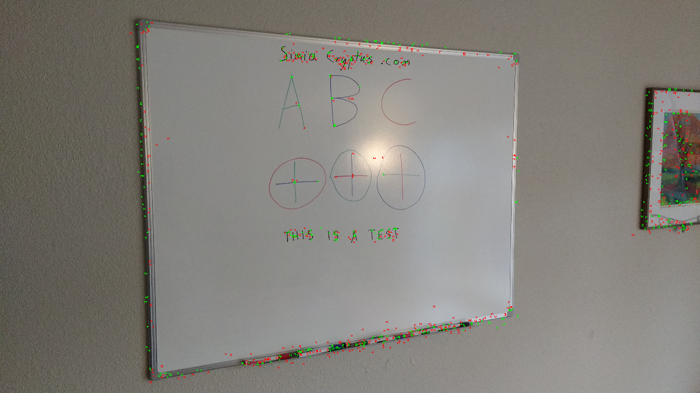
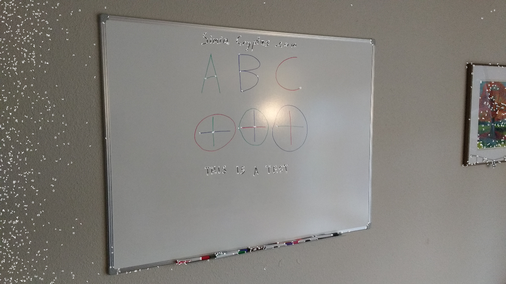

Code from [BoofcvTest.scala:157](../../src/test/scala/BoofcvTest.scala#L157) executed in 0.13 seconds: 
```java
    gfx.drawImage(primaryImage, 0, 0, null)
    gfx.setStroke(new BasicStroke(2))
    points.asScala.zip(descriptions.toList.asScala).foreach(x ⇒ {
      val (pt,d) = x
      if(d.white) {
        gfx.setColor(Color.GREEN)
      } else {
        gfx.setColor(Color.RED)
      }
      gfx.drawRect(pt.x.toInt - 4, pt.y.toInt - 4, 9, 9)
    })
```

Returns: 

Code from [BoofcvTest.scala:173](../../src/test/scala/BoofcvTest.scala#L173) executed in 0.05 seconds: 
```java
    gfx.drawImage(primaryImage, 0, 0, null)
    gfx.setStroke(new BasicStroke(2))
    points.asScala.zip(descriptions.toList.asScala).foreach(x ⇒ {
      val (pt,d) = x
      gfx.drawRect(pt.x.toInt - 4, pt.y.toInt - 4, 9, 9)
    })
```

Returns: 

