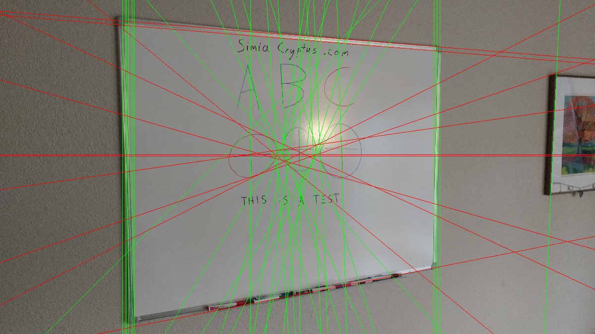

## HoughPolar
Code from [BoofcvSpec.scala:101](../../src/test/scala/BoofcvSpec.scala#L101) executed in 0.00 seconds: 
```java
    FactoryDetectLineAlgs.houghPolar(new ConfigHoughPolar(localMaxRadius, minCounts, 2, resolutionAngle, edgeThreshold, maxLines), classOf[GrayU8], classOf[GrayS16])
```

Returns: 
```
    boofcv.abst.feature.detect.line.DetectLineHoughPolar@2364305a
```
Code from [BoofcvSpec.scala:65](../../src/test/scala/BoofcvSpec.scala#L65) executed in 4.09 seconds: 
```java
    val found: util.List[LineParametric2D_F32] = detector.detect(ConvertBufferedImage.convertFromSingle(image1, null, classOf[GrayU8]))
    gfx.drawImage(image1, 0, 0, width, height, null)
    found.asScala.foreach(line ⇒ {
      System.out.println(line)
      if(Math.abs(line.slope.x) > Math.abs(line.slope.y)) {
        val x1 = 0
        val y1 = (line.p.y - line.p.x * line.slope.y / line.slope.x).toInt
        val x2 = image1.getWidth
        val y2 = y1 + (x2 * line.slope.y / line.slope.x).toInt
        gfx.setColor(Color.RED)
        gfx.drawLine(
          x1 * width / image1.getWidth, y1 * height / image1.getHeight,
          x2 * width / image1.getWidth, y2 * height / image1.getHeight)
      } else {
        val y1 = 0
        val x1 = (line.p.x - line.p.y * line.slope.x / line.slope.y).toInt
        val y2 = image1.getHeight
        val x2 = x1 + (y2 * line.slope.x / line.slope.y).toInt
        gfx.setColor(Color.GREEN)
        gfx.drawLine(
          x1 * width / image1.getWidth, y1 * height / image1.getHeight,
          x2 * width / image1.getWidth, y2 * height / image1.getHeight)
      }
    })
```
Logging: 
```
    LineParametric2D_F32 P( 902.4794 1211.1199 ) Slope( -0.03489945 -0.99939084 )LineParametric2D_F32 P( 876.75476 1219.0286 ) Slope( -0.040713172 -0.9991709 )LineParametric2D_F32 P( 3039.934 1192.3428 ) Slope( -0.023268957 0.9997292 )LineParametric2D_F32 P( 3055.933 1192.7151 ) Slope( -0.023268957 0.9997292 )LineParametric2D_F32 P( 2160.1995 253.31543 ) Slope( -0.9961947 -0.08715577 )LineParametric2D_F32 P( 2152.912 276.78967 ) Slope( -0.9966849 -0.08135869 )LineParametric2D_F32 P( 2238.958 2041.8062 ) Slope( -0.98378086 0.17937464 )LineParametric2D_F32 P( 2226.936 2003.3159 ) Slope( -0.9848077 0.17364822 )LineParametric2D_F32 P( 2206.1162 2030.9884 ) Slope( -0.98944163 0.14493175 )LineParametric2D_F32 P( 2235.7288 2024.0945 ) Slope( -0.98378086 0.17937464 )LineParametric2D_F32 P( 889.7593 1170.0 ) Slope( -0.0 1.0 )LineParametric2D_F32 P( 901.7616 1170.0 ) Slope( -0.0 1.0 )LineParametric2D_F32 P( 3844.4443 1252.1803 ) Slope( -0.046525314 0.9989171 )LineParametric2D_F32 P( 3808.4763 1250.5051 ) Slope( -0.046525314 0.9989171 )LineParametric2D_F32 P( 867.75476 1170.0 ) Slope( -0.0 1.0 )LineParametric2D_F32 P( 3048.1794 1164.3673 ) Slope( -0.00581777 -0.9999831 )LineParametric2D_F32 P( 3920.3774 1255.7169 ) Slope( -0.046525314 0.9989171 )LineParametric2D_F32 P( 43.725952 1146.3058 ) Slope( -0.011635266 0.9999323 )LineParametric2D_F32 P( 97.28186 1019.7586 ) Slope( -0.075558856 0.99714136 )LineParametric2D_F32 P( 128.43115 1113.2151 ) Slope( -0.02908472 0.9995769 )LineParametric2D_F32 P( 109.25 1020.6655 ) Slope( -0.075558856 0.99714136 )LineParametric2D_F32 P( 2067.663 1052.6227 ) Slope( -0.9945219 0.10452842 )LineParametric2D_F32 P( 156.78296 1237.1602 ) Slope( -0.03489945 -0.99939084 )LineParametric2D_F32 P( 189.83447 993.5455 ) Slope( -0.09294987 0.9956708 )LineParametric2D_F32 P( 175.3081 1381.4015 ) Slope( -0.11031248 -0.99389696 )LineParametric2D_F32 P( 194.6206 916.20355 ) Slope( -0.13340962 0.991061 )LineParametric2D_F32 P( 2095.082 305.9568 ) Slope( -0.9998477 -0.017452471 )LineParametric2D_F32 P( 118.1272 1330.1462 ) Slope( -0.08135868 -0.9966849 )LineParametric2D_F32 P( 134.84595 942.6441 ) Slope( -0.11609291 0.99323833 )LineParametric2D_F32 P( 102.1355 1123.9647 ) Slope( -0.023268957 0.9997292 )LineParametric2D_F32 P( 165.93347 991.3142 ) Slope( -0.09294987 0.9956708 )LineParametric2D_F32 P( 76.442505 1228.2977 ) Slope( -0.029084785 -0.9995769 )LineParametric2D_F32 P( 2123.036 431.10254 ) Slope( -0.9983081 -0.058144942 )LineParametric2D_F32 P( 2051.237 346.33533 ) Slope( -0.99939084 0.034899496 )LineParametric2D_F32 P( 42.13965 1217.4316 ) Slope( -0.023268895 -0.9997292 )LineParametric2D_F32 P( 177.677 1081.3978 ) Slope( -0.046525314 0.9989171 )LineParametric2D_F32 P( 152.87537 1057.7578 ) Slope( -0.05814483 0.9983082 )LineParametric2D_F32 P( 2201.694 2074.0305 ) Slope( -0.991061 0.13340962 )LineParametric2D_F32 P( 209.74817 1148.2377 ) Slope( -0.011635266 0.9999323 )LineParametric2D_F32 P( 2171.65 2093.6519 ) Slope( -0.9951132 0.09874079 )LineParametric2D_F32 P( 234.84082 1407.4612 ) Slope( -0.12764147 -0.9918204 )LineParametric2D_F32 P( 69.899414 1134.9136 ) Slope( -0.017452406 0.9998477 )LineParametric2D_F32 P( 2075.032 1048.0765 ) Slope( -0.9991709 0.040713098 )LineParametric2D_F32 P( 223.1648 1094.3397 ) Slope( -0.040713098 0.9991709 )LineParametric2D_F32 P( 9.616211 1182.0452 ) Slope( -0.00581777 -0.9999831 )LineParametric2D_F32 P( 261.75537 1148.8428 ) Slope( -0.011635266 0.9999323 )LineParametric2D_F32 P( 212.75342 1006.6371 ) Slope( -0.08715574 0.9961947 )LineParametric2D_F32 P( 257.55383 1340.1327 ) Slope( -0.09294988 -0.9956708 )LineParametric2D_F32 P( 228.75366 1234.6469 ) Slope( -0.03489945 -0.99939084 )LineParametric2D_F32 P( 258.40234 1223.0032 ) Slope( -0.029084785 -0.9995769 )LineParametric2D_F32 P( 71.71228 1298.6967 ) Slope( -0.063951604 -0.997953 )LineParametric2D_F32 P( 261.6051 1501.5513 ) Slope( -0.17937459 -0.98378086 )LineParametric2D_F32 P( 307.0348 803.9121 ) Slope( -0.20221758 0.9793406 )LineParametric2D_F32 P( 451.1194 1606.457 ) Slope( -0.25881892 -0.9659259 )LineParametric2D_F32 P( 261.5 914.4265 ) Slope( -0.1391731 0.99026805 )LineParametric2D_F32 P( 340.32837 1363.0859 ) Slope( -0.11031248 -0.99389696 )LineParametric2D_F32 P( 332.5027 1530.8289 ) Slope( -0.20221737 -0.9793407 )LineParametric2D_F32 P( 2098.655 1383.2288 ) Slope( -0.9961947 0.087155685 )LineParametric2D_F32 P( 2084.7012 1371.9862 ) Slope( -0.9997292 0.02326882 )LineParametric2D_F32 P( 315.31335 879.96716 ) Slope( -0.16217794 0.9867615 )LineParametric2D_F32 P( 2079.2786 1045.977 ) Slope( -0.9999831 0.0058176946 )LineParametric2D_F32 P( 738.8364 1666.9987 ) Slope( -0.3474812 -0.9376869 )LineParametric2D_F32 P( 442.82544 710.8385 ) Slope( -0.27004036 0.962849 )LineParametric2D_F32 P( 291.91052 1201.2113 ) Slope( -0.017452458 -0.9998477 )LineParametric2D_F32 P( 240.65247 1009.07794 ) Slope( -0.08715574 0.9961947 )LineParametric2D_F32 P( 287.45056 864.6671 ) Slope( -0.1679159 0.98580134 )LineParametric2D_F32 P( 328.33533 1016.7492 ) Slope( -0.08715574 0.9961947 )LineParametric2D_F32 P( 365.14795 763.57263 ) Slope( -0.23061587 0.9730449 )LineParametric2D_F32 P( 713.05444 1722.2817 ) Slope( -0.3746065 -0.9271839 )LineParametric2D_F32 P( 2125.0532 1555.4545 ) Slope( -0.9932384 0.11609289 )LineParametric2D_F32 P( 2161.9717 343.88898 ) Slope( -0.9951132 -0.098740995 )LineParametric2D_F32 P( 328.61316 1272.0062 ) Slope( -0.058144573 -0.9983082 )LineParametric2D_F32 P( 397.89697 781.6559 ) Slope( -0.22495106 0.97437006 )LineParametric2D_F32 P( 2012.7842 346.57172 ) Slope( -0.9966849 0.081358604 )LineParametric2D_F32 P( 750.9531 1725.044 ) Slope( -0.38536918 -0.9227625 )LineParametric2D_F32 P( 377.58337 1490.6492 ) Slope( -0.18509482 -0.9827207 )LineParametric2D_F32 P( 333.5337 965.8674 ) Slope( -0.11609291 0.99323833 )LineParametric2D_F32 P( 331.83398 1436.466 ) Slope( -0.15068556 -0.9885817 )LineParametric2D_F32 P( 249.79736 836.2958 ) Slope( -0.17937459 0.98378086 )LineParametric2D_F32 P( 1922.7803 1209.1992 ) Slope( -0.24192186 -0.9702957 )LineParametric2D_F32 P( 2006.1366 1174.7334 ) Slope( -0.063951604 -0.997953 )LineParametric2D_F32 P( 378.77344 1573.198 ) Slope( -0.23061582 -0.9730449 )LineParametric2D_F32 P( 350.2694 1361.9825 ) Slope( -0.11031248 -0.99389696 )LineParametric2D_F32 P( 2128.9968 405.41333 ) Slope( -0.997953 -0.06395173 )LineParametric2D_F32 P( 297.76013 1149.2617 ) Slope( -0.011635266 0.9999323 )LineParametric2D_F32 P( 273.13342 1096.3759 ) Slope( -0.040713098 0.9991709 )LineParametric2D_F32 P( 2103.6184 590.3636 ) Slope( -0.9991709 -0.040713184 )LineParametric2D_F32 P( 434.37476 1509.794 ) Slope( -0.20221737 -0.9793407 )LineParametric2D_F32 P( 351.60962 906.5481 ) Slope( -0.15068573 0.9885817 )LineParametric2D_F32 P( 2093.9968 1169.5928 ) Slope( -0.029084785 -0.9995769 )LineParametric2D_F32 P( 305.1134 1097.679 ) Slope( -0.040713098 0.9991709 )LineParametric2D_F32 P( 355.91382 834.8716 ) Slope( -0.190809 0.98162717 )LineParametric2D_F32 P( 853.79663 1768.0588 ) Slope( -0.4383709 -0.8987942 )LineParametric2D_F32 P( 547.6898 1638.4741 ) Slope( -0.2923716 -0.9563048 )LineParametric2D_F32 P( 413.49 1554.7439 ) Slope( -0.22495088 -0.9743701 )LineParametric2D_F32 P( 2086.6326 1397.9497 ) Slope( -0.9995769 0.02908459 )LineParametric2D_F32 P( 732.80774 643.8486 ) Slope( -0.36379322 0.93147975 )LineParametric2D_F32 P( 608.8192 1695.7935 ) Slope( -0.33654743 -0.94166654 )LineParametric2D_F32 P( 482.22375 1558.511 ) Slope( -0.23627272 -0.9716868 )LineParametric2D_F32 P( 808.176 1701.1462 ) Slope( -0.38536918 -0.9227625 )
```

Returns: 

## HoughFoot
Code from [BoofcvSpec.scala:105](../../src/test/scala/BoofcvSpec.scala#L105) executed in 0.00 seconds: 
```java
    FactoryDetectLineAlgs.houghFoot(new ConfigHoughFoot(localMaxRadius, minCounts, minDistanceFromOrigin, edgeThreshold, maxLines), classOf[GrayU8], classOf[GrayS16])
```

Returns: 
```
    boofcv.abst.feature.detect.line.DetectLineHoughFoot@7c56e013
```
Code from [BoofcvSpec.scala:65](../../src/test/scala/BoofcvSpec.scala#L65) executed in 0.32 seconds: 
```java
    val found: util.List[LineParametric2D_F32] = detector.detect(ConvertBufferedImage.convertFromSingle(image1, null, classOf[GrayU8]))
    gfx.drawImage(image1, 0, 0, width, height, null)
    found.asScala.foreach(line ⇒ {
      System.out.println(line)
      if(Math.abs(line.slope.x) > Math.abs(line.slope.y)) {
        val x1 = 0
        val y1 = (line.p.y - line.p.x * line.slope.y / line.slope.x).toInt
        val x2 = image1.getWidth
        val y2 = y1 + (x2 * line.slope.y / line.slope.x).toInt
        gfx.setColor(Color.RED)
        gfx.drawLine(
          x1 * width / image1.getWidth, y1 * height / image1.getHeight,
          x2 * width / image1.getWidth, y2 * height / image1.getHeight)
      } else {
        val y1 = 0
        val x1 = (line.p.x - line.p.y * line.slope.x / line.slope.y).toInt
        val y2 = image1.getHeight
        val x2 = x1 + (y2 * line.slope.x / line.slope.y).toInt
        gfx.setColor(Color.GREEN)
        gfx.drawLine(
          x1 * width / image1.getWidth, y1 * height / image1.getHeight,
          x2 * width / image1.getWidth, y2 * height / image1.getHeight)
      }
    })
```
Logging: 
```
    LineParametric2D_F32 P( 2094.0 1170.0 ) Slope( 0.0 14.0 )LineParametric2D_F32 P( 3057.0 1170.0 ) Slope( 0.0 977.0 )LineParametric2D_F32 P( 2005.0 1174.0 ) Slope( -4.0 -75.0 )LineParametric2D_F32 P( 885.0 1170.0 ) Slope( 0.0 -1195.0 )LineParametric2D_F32 P( 898.0 1170.0 ) Slope( 0.0 -1182.0 )LineParametric2D_F32 P( 2080.0 1082.0 ) Slope( 88.0 0.0 )LineParametric2D_F32 P( 2046.0 1180.0 ) Slope( -10.0 -34.0 )LineParametric2D_F32 P( 874.0 1170.0 ) Slope( 0.0 -1206.0 )LineParametric2D_F32 P( 3035.0 1170.0 ) Slope( 0.0 955.0 )LineParametric2D_F32 P( 3075.0 1170.0 ) Slope( 0.0 995.0 )LineParametric2D_F32 P( 1940.0 1208.0 ) Slope( -38.0 -140.0 )LineParametric2D_F32 P( 2195.0 1165.0 ) Slope( 5.0 115.0 )LineParametric2D_F32 P( 2153.0 284.0 ) Slope( 886.0 73.0 )LineParametric2D_F32 P( 2071.0 1178.0 ) Slope( -8.0 -9.0 )LineParametric2D_F32 P( 2249.0 2031.0 ) Slope( -861.0 169.0 )LineParametric2D_F32 P( 2061.0 1193.0 ) Slope( -23.0 -19.0 )LineParametric2D_F32 P( 923.0 1170.0 ) Slope( 0.0 -1157.0 )LineParametric2D_F32 P( 2155.0 255.0 ) Slope( 915.0 75.0 )LineParametric2D_F32 P( 858.0 1170.0 ) Slope( 0.0 -1222.0 )LineParametric2D_F32 P( 1927.0 1076.0 ) Slope( 94.0 -153.0 )LineParametric2D_F32 P( 1752.0 1170.0 ) Slope( 0.0 -328.0 )LineParametric2D_F32 P( 1783.0 873.0 ) Slope( 297.0 -297.0 )LineParametric2D_F32 P( 2391.0 1161.0 ) Slope( 9.0 311.0 )LineParametric2D_F32 P( 2168.0 1195.0 ) Slope( -25.0 88.0 )LineParametric2D_F32 P( 2028.0 1194.0 ) Slope( -24.0 -52.0 )LineParametric2D_F32 P( 2242.0 1163.0 ) Slope( 7.0 162.0 )LineParametric2D_F32 P( 2127.0 1176.0 ) Slope( -6.0 47.0 )LineParametric2D_F32 P( 2012.0 1161.0 ) Slope( 9.0 -68.0 )LineParametric2D_F32 P( 1956.0 1151.0 ) Slope( 19.0 -124.0 )LineParametric2D_F32 P( 2242.0 1119.0 ) Slope( 51.0 162.0 )LineParametric2D_F32 P( 3856.0 1254.0 ) Slope( -84.0 1776.0 )LineParametric2D_F32 P( 2152.0 1204.0 ) Slope( -34.0 72.0 )LineParametric2D_F32 P( 2122.0 1080.0 ) Slope( 90.0 42.0 )LineParametric2D_F32 P( 1939.0 1124.0 ) Slope( 46.0 -141.0 )LineParametric2D_F32 P( 2061.0 1037.0 ) Slope( 133.0 -19.0 )LineParametric2D_F32 P( 2080.0 1094.0 ) Slope( 76.0 0.0 )LineParametric2D_F32 P( 2139.0 1208.0 ) Slope( -38.0 59.0 )LineParametric2D_F32 P( 2045.0 1101.0 ) Slope( 69.0 -35.0 )LineParametric2D_F32 P( 2067.0 1132.0 ) Slope( 38.0 -13.0 )LineParametric2D_F32 P( 2084.0 1156.0 ) Slope( 14.0 4.0 )LineParametric2D_F32 P( 1942.0 1179.0 ) Slope( -9.0 -138.0 )LineParametric2D_F32 P( 936.0 1170.0 ) Slope( 0.0 -1144.0 )
```

Returns: 

## HoughFootSubimage
Code from [BoofcvSpec.scala:109](../../src/test/scala/BoofcvSpec.scala#L109) executed in 0.00 seconds: 
```java
    FactoryDetectLineAlgs.houghFootSub(new ConfigHoughFootSubimage(localMaxRadius, minCounts, minDistanceFromOrigin, edgeThreshold, maxLines, totalHorizontalDivisions, totalVerticalDivisions), classOf[GrayU8], classOf[GrayS16])
```

Returns: 
```
    boofcv.abst.feature.detect.line.DetectLineHoughFootSubimage@16f7b4af
```
Code from [BoofcvSpec.scala:65](../../src/test/scala/BoofcvSpec.scala#L65) executed in 0.34 seconds: 
```java
    val found: util.List[LineParametric2D_F32] = detector.detect(ConvertBufferedImage.convertFromSingle(image1, null, classOf[GrayU8]))
    gfx.drawImage(image1, 0, 0, width, height, null)
    found.asScala.foreach(line ⇒ {
      System.out.println(line)
      if(Math.abs(line.slope.x) > Math.abs(line.slope.y)) {
        val x1 = 0
        val y1 = (line.p.y - line.p.x * line.slope.y / line.slope.x).toInt
        val x2 = image1.getWidth
        val y2 = y1 + (x2 * line.slope.y / line.slope.x).toInt
        gfx.setColor(Color.RED)
        gfx.drawLine(
          x1 * width / image1.getWidth, y1 * height / image1.getHeight,
          x2 * width / image1.getWidth, y2 * height / image1.getHeight)
      } else {
        val y1 = 0
        val x1 = (line.p.x - line.p.y * line.slope.x / line.slope.y).toInt
        val y2 = image1.getHeight
        val x2 = x1 + (y2 * line.slope.x / line.slope.y).toInt
        gfx.setColor(Color.GREEN)
        gfx.drawLine(
          x1 * width / image1.getWidth, y1 * height / image1.getHeight,
          x2 * width / image1.getWidth, y2 * height / image1.getHeight)
      }
    })
```
Logging: 
```
    LineParametric2D_F32 P( 2861.0 1909.0 ) Slope( -8.0 1.0 )LineParametric2D_F32 P( 3882.0 731.0 ) Slope( 0.0 -18.0 )LineParametric2D_F32 P( 887.0 1313.0 ) Slope( 3.0 107.0 )LineParametric2D_F32 P( 2330.0 270.0 ) Slope( -124.0 -10.0 )LineParametric2D_F32 P( 3055.0 1316.0 ) Slope( 0.0 195.0 )LineParametric2D_F32 P( 1807.0 734.0 ) Slope( -3.0 -13.0 )LineParametric2D_F32 P( 2386.0 1022.0 ) Slope( 1.0 46.0 )LineParametric2D_F32 P( 3037.0 1316.0 ) Slope( 0.0 177.0 )LineParametric2D_F32 P( 2347.0 1316.0 ) Slope( 0.0 7.0 )LineParametric2D_F32 P( 1752.0 1023.0 ) Slope( 0.0 -68.0 )LineParametric2D_F32 P( 1823.0 1083.0 ) Slope( -60.0 3.0 )LineParametric2D_F32 P( 3903.0 1347.0 ) Slope( -31.0 3.0 )LineParametric2D_F32 P( 1809.0 438.0 ) Slope( 0.0 -11.0 )LineParametric2D_F32 P( 1820.0 446.0 ) Slope( -8.0 0.0 )LineParametric2D_F32 P( 3869.0 731.0 ) Slope( 0.0 -31.0 )LineParametric2D_F32 P( 2352.0 445.0 ) Slope( -7.0 12.0 )LineParametric2D_F32 P( 1976.0 720.0 ) Slope( 11.0 156.0 )LineParametric2D_F32 P( 270.0 438.0 ) Slope( 0.0 10.0 )LineParametric2D_F32 P( 2345.0 440.0 ) Slope( -2.0 5.0 )LineParametric2D_F32 P( 2093.0 1028.0 ) Slope( -5.0 -247.0 )LineParametric2D_F32 P( 2855.0 1884.0 ) Slope( 17.0 -5.0 )LineParametric2D_F32 P( 928.0 2190.0 ) Slope( 3.0 148.0 )LineParametric2D_F32 P( 3073.0 437.0 ) Slope( 1.0 213.0 )LineParametric2D_F32 P( 3900.0 546.0 ) Slope( -108.0 0.0 )LineParametric2D_F32 P( 2204.0 1322.0 ) Slope( -6.0 -136.0 )LineParametric2D_F32 P( 3920.0 1316.0 ) Slope( 0.0 20.0 )LineParametric2D_F32 P( 263.0 1906.0 ) Slope( -5.0 3.0 )LineParametric2D_F32 P( 1296.0 2164.0 ) Slope( 29.0 -4.0 )LineParametric2D_F32 P( 860.0 424.0 ) Slope( 14.0 80.0 )LineParametric2D_F32 P( 1827.0 445.0 ) Slope( -7.0 7.0 )LineParametric2D_F32 P( 1848.0 809.0 ) Slope( -78.0 28.0 )LineParametric2D_F32 P( 2312.0 743.0 ) Slope( -12.0 -28.0 )LineParametric2D_F32 P( 890.0 1329.0 ) Slope( -13.0 110.0 )LineParametric2D_F32 P( 1788.0 1321.0 ) Slope( -5.0 -32.0 )LineParametric2D_F32 P( 2349.0 1325.0 ) Slope( -9.0 9.0 )LineParametric2D_F32 P( 2328.0 1295.0 ) Slope( 21.0 -12.0 )LineParametric2D_F32 P( 2331.0 1318.0 ) Slope( -2.0 -9.0 )LineParametric2D_F32 P( 251.0 436.0 ) Slope( 2.0 -9.0 )LineParametric2D_F32 P( 281.0 417.0 ) Slope( 21.0 21.0 )LineParametric2D_F32 P( 1865.0 438.0 ) Slope( 0.0 45.0 )LineParametric2D_F32 P( 1729.0 436.0 ) Slope( 2.0 -91.0 )LineParametric2D_F32 P( 2332.0 425.0 ) Slope( 13.0 -8.0 )LineParametric2D_F32 P( 2354.0 486.0 ) Slope( -48.0 14.0 )LineParametric2D_F32 P( 2340.0 474.0 ) Slope( -36.0 0.0 )LineParametric2D_F32 P( 2369.0 474.0 ) Slope( -36.0 29.0 )LineParametric2D_F32 P( 2362.0 457.0 ) Slope( -19.0 22.0 )LineParametric2D_F32 P( 2325.0 755.0 ) Slope( -24.0 -15.0 )LineParametric2D_F32 P( 3861.0 723.0 ) Slope( 8.0 -39.0 )LineParametric2D_F32 P( 880.0 1006.0 ) Slope( 17.0 100.0 )LineParametric2D_F32 P( 1828.0 1065.0 ) Slope( -42.0 8.0 )LineParametric2D_F32 P( 2258.0 1004.0 ) Slope( 19.0 -82.0 )LineParametric2D_F32 P( 2225.0 994.0 ) Slope( 29.0 -115.0 )LineParametric2D_F32 P( 3912.0 1025.0 ) Slope( -2.0 12.0 )LineParametric2D_F32 P( 882.0 1300.0 ) Slope( 16.0 102.0 )LineParametric2D_F32 P( 2361.0 1300.0 ) Slope( 16.0 21.0 )LineParametric2D_F32 P( 2371.0 1281.0 ) Slope( 35.0 31.0 )LineParametric2D_F32 P( 908.0 1624.0 ) Slope( -16.0 128.0 )LineParametric2D_F32 P( 922.0 1876.0 ) Slope( 25.0 142.0 )LineParametric2D_F32 P( 270.0 2196.0 ) Slope( -3.0 10.0 )LineParametric2D_F32 P( 256.0 2186.0 ) Slope( 7.0 -4.0 )LineParametric2D_F32 P( 775.0 2190.0 ) Slope( 3.0 -5.0 )LineParametric2D_F32 P( 250.0 144.0 ) Slope( 2.0 -10.0 )LineParametric2D_F32 P( 279.0 169.0 ) Slope( -23.0 19.0 )LineParametric2D_F32 P( 257.0 139.0 ) Slope( 7.0 -3.0 )LineParametric2D_F32 P( 1803.0 211.0 ) Slope( -65.0 -17.0 )LineParametric2D_F32 P( 2348.0 260.0 ) Slope( -114.0 8.0 )LineParametric2D_F32 P( 268.0 433.0 ) Slope( 5.0 8.0 )LineParametric2D_F32 P( 249.0 443.0 ) Slope( -5.0 -11.0 )LineParametric2D_F32 P( 269.0 429.0 ) Slope( 9.0 9.0 )LineParametric2D_F32 P( 1836.0 438.0 ) Slope( 0.0 16.0 )LineParametric2D_F32 P( 1790.0 438.0 ) Slope( 0.0 -30.0 )LineParametric2D_F32 P( 2052.0 487.0 ) Slope( -49.0 232.0 )LineParametric2D_F32 P( 1967.0 521.0 ) Slope( -83.0 147.0 )LineParametric2D_F32 P( 1740.0 420.0 ) Slope( 18.0 -80.0 )LineParametric2D_F32 P( 2368.0 449.0 ) Slope( -11.0 28.0 )LineParametric2D_F32 P( 2356.0 404.0 ) Slope( 34.0 16.0 )LineParametric2D_F32 P( 2367.0 483.0 ) Slope( -45.0 27.0 )LineParametric2D_F32 P( 2879.0 354.0 ) Slope( 84.0 19.0 )LineParametric2D_F32 P( 3883.0 515.0 ) Slope( -77.0 -17.0 )LineParametric2D_F32 P( 3889.0 489.0 ) Slope( -51.0 -11.0 )LineParametric2D_F32 P( 240.0 731.0 ) Slope( 0.0 -20.0 )LineParametric2D_F32 P( 2294.0 742.0 ) Slope( -11.0 -46.0 )LineParametric2D_F32 P( 2324.0 741.0 ) Slope( -10.0 -16.0 )LineParametric2D_F32 P( 2354.0 769.0 ) Slope( -38.0 14.0 )LineParametric2D_F32 P( 3900.0 671.0 ) Slope( 60.0 0.0 )LineParametric2D_F32 P( 4002.0 712.0 ) Slope( 19.0 102.0 )LineParametric2D_F32 P( 269.0 1013.0 ) Slope( 10.0 9.0 )LineParametric2D_F32 P( 253.0 1011.0 ) Slope( 12.0 -7.0 )LineParametric2D_F32 P( 256.0 1030.0 ) Slope( -7.0 -4.0 )LineParametric2D_F32 P( 859.0 1010.0 ) Slope( 13.0 79.0 )LineParametric2D_F32 P( 1836.0 946.0 ) Slope( 77.0 16.0 )LineParametric2D_F32 P( 1853.0 952.0 ) Slope( 71.0 33.0 )LineParametric2D_F32 P( 1927.0 975.0 ) Slope( 48.0 107.0 )LineParametric2D_F32 P( 1935.0 1091.0 ) Slope( -68.0 115.0 )LineParametric2D_F32 P( 2313.0 999.0 ) Slope( 24.0 -27.0 )LineParametric2D_F32 P( 2223.0 1068.0 ) Slope( -45.0 -117.0 )LineParametric2D_F32 P( 270.0 1319.0 ) Slope( -3.0 10.0 )LineParametric2D_F32 P( 222.0 1306.0 ) Slope( 10.0 -38.0 )LineParametric2D_F32 P( 266.0 1326.0 ) Slope( -10.0 6.0 )LineParametric2D_F32 P( 1788.0 1349.0 ) Slope( -33.0 -32.0 )
```

Returns: 

