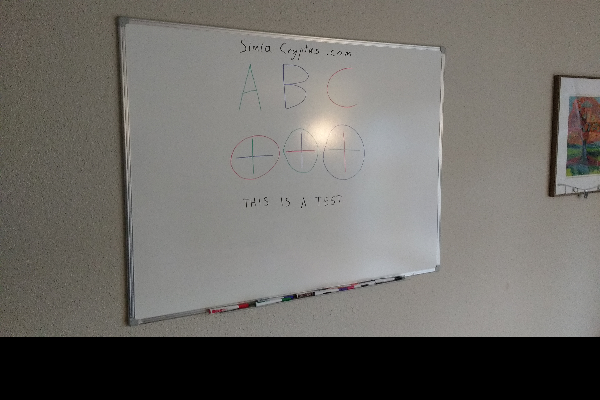
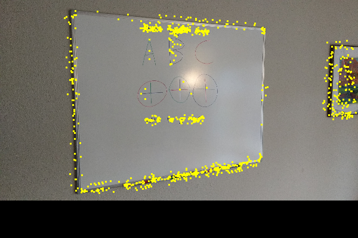
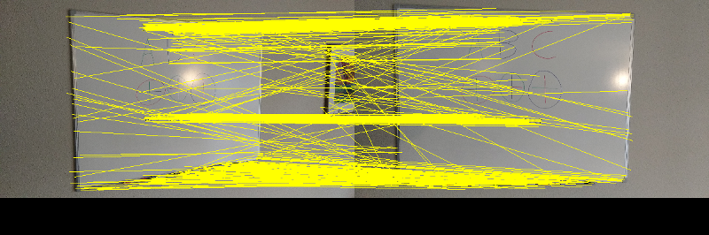
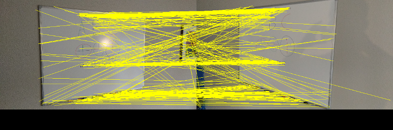
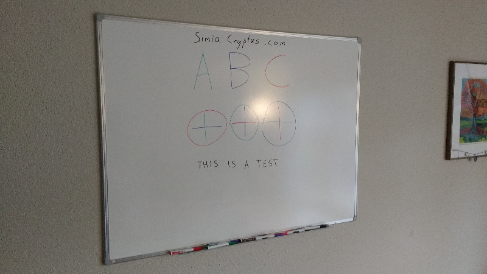
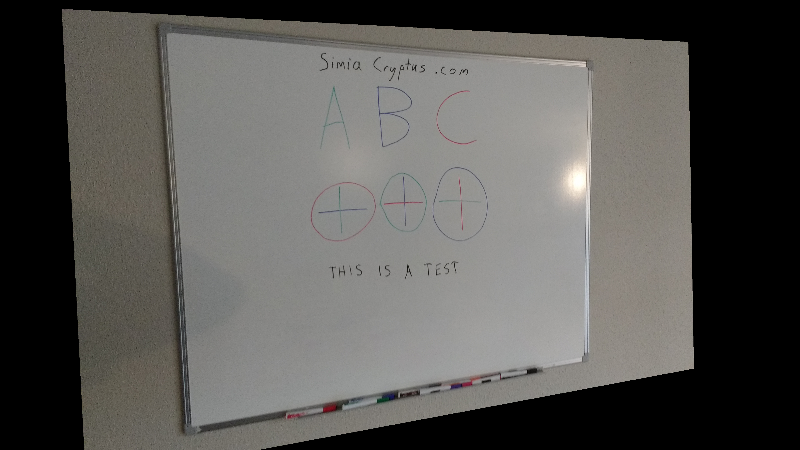
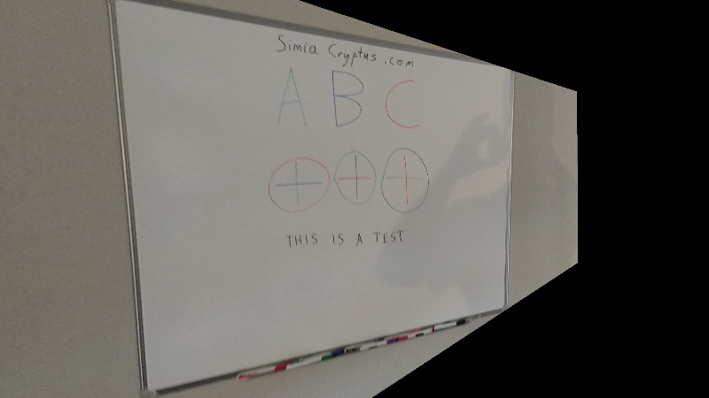

Code from [Main.scala:148](../../src/test/scala/Main.scala#L148) executed in 0.00 seconds: 
```java
    gfx.drawImage(image1, 0, 0, width, height, null)
```

Returns: 

Code from [Main.scala:151](../../src/test/scala/Main.scala#L151) executed in 4.00 seconds: 
```java
    describe(describeConfig, image1)
```

Returns: 
```
    ([P( 2119.080078125 356.6414489746094 ), P( 1760.559814453125 1400.2044677734375 ), P( 2780.90380859375 1921.225830078125 ), P( 2409.940673828125 373.3511962890625 ), P( 2345.70166015625 374.1662292480469 ), P( 2116.9072265625 337.605712890625 ), P( 2269.208740234375 377.75738525390625 ), P( 2128.504150390625 336.9275207519531 ), P( 2105.607666015625 1403.4395751953125 ), P( 2290.2021484375 2029.1741943359375 ), P( 2404.986083984375 369.951416015625 ), P( 2426.611572265625 366.8545837402344 ), P( 2161.6923828125 367.9652099609375 ), P( 2362.293212890625 366.14453125 ), P( 2351.283203125 365.20623779296875 ), P( 2154.16064453125 364.2197265625 ), P( 2089.374755859375 338.9324645996094 ), P( 2085.933349609375 364.88983154296875 ), P( 2208.250244140625 1368.9224853515625 ), P( 2224.776123046875 1369.1170654296875 ), P( 2414.135009765625 362.7471923828125 ), P( 2208.87890625 363.0947570800781 ), P( 2202.32568359375 360.7427673339844 ), P( 2213.64404296875 1373.535400390625 ), P( 2145.44140625 361.1680908203125 ), P( 2036.310791015625 362.9016418457031 ), P( 1742.0355224609375 1407.2291259765625 ), P( 1820.3199462890625 308.37646484375 ), P( 2244.29296875 2037.65771484375 ), P( 1765.82177734375 1405.604736328125 ), P( 1782.9388427734375 322.88275146484375 ), P( 1977.1302490234375 299.0006103515625 ), P( 2098.940673828125 358.753662109375 ), P( 2102.17041015625 1377.2275390625 ), P( 2251.98046875 1376.0477294921875 ), P( 2026.2454833984375 408.328369140625 ), P( 2594.2880859375 1946.0389404296875 ), P( 1708.01904296875 1435.500732421875 ), P( 1705.4144287109375 1383.2965087890625 ), P( 2083.71435546875 357.06329345703125 ), P( 1989.6505126953125 1382.82470703125 ), P( 1865.777587890625 356.4227294921875 ), P( 2574.219970703125 1948.0233154296875 ), P( 1771.9815673828125 326.1120910644531 ), P( 1772.2496337890625 339.7464599609375 ), P( 2053.45654296875 353.54522705078125 ), P( 2001.88134765625 353.2326965332031 ), P( 2252.806884765625 1424.2578125 ), P( 2302.197509765625 1385.590576171875 ), P( 1810.6217041015625 354.05291748046875 ), P( 2119.1298828125 325.98828125 ), P( 1700.1195068359375 1387.7359619140625 ), P( 1711.087890625 1388.61376953125 ), P( 2191.861328125 348.5318603515625 ), P( 2252.064208984375 1398.9490966796875 ), P( 2159.904541015625 349.261962890625 ), P( 1760.4443359375 329.12481689453125 ), P( 2013.2691650390625 350.262451171875 ), P( 1844.464111328125 350.0152893066406 ), P( 2164.073974609375 339.5029602050781 ), P( 1753.4183349609375 350.3575439453125 ), P( 2025.4779052734375 416.2375183105469 ), P( 2069.39794921875 2047.73583984375 ), P( 3048.13232421875 329.9245910644531 ), P( 1964.7308349609375 2064.859375 ), P( 2257.740966796875 1418.5721435546875 ), P( 2308.69775390625 347.4500427246094 ), P( 2199.78759765625 346.74420166015625 ), P( 2090.7353515625 347.098388671875 ), P( 2099.05908203125 1409.2308349609375 ), P( 1866.0723876953125 347.61199951171875 ), P( 2355.9658203125 1414.44287109375 ), P( 1729.7525634765625 348.33563232421875 ), P( 2103.072509765625 1415.181884765625 ), P( 3010.989990234375 1880.0625 ), P( 2123.955078125 331.051025390625 ), P( 1762.25634765625 1412.094482421875 ), P( 1747.269775390625 1411.750244140625 ), P( 2738.053955078125 1929.5167236328125 ), P( 1846.0667724609375 322.9884033203125 ), P( 2424.349365234375 359.8895568847656 ), P( 2349.767333984375 2018.8077392578125 ), P( 1847.5233154296875 2088.839111328125 ), P( 1836.3284912109375 1383.0869140625 ), P( 2202.54150390625 1373.945068359375 ), P( 1859.642333984375 355.69842529296875 ), P( 3028.121826171875 1843.6029052734375 ), P( 3015.82421875 1886.150146484375 ), P( 1746.615966796875 1400.427001953125 ), P( 1849.1500244140625 1372.3682861328125 ), P( 4066.94189453125 1322.1556396484375 ), P( 1685.843505859375 305.1904296875 ), P( 1680.4051513671875 284.9670104980469 ), P( 1836.2027587890625 1422.8179931640625 ), P( 2312.280029296875 1400.7518310546875 ), P( 2401.143798828125 364.1951904296875 ), P( 1703.1058349609375 350.4125671386719 ), P( 1782.19677734375 334.6430358886719 ), P( 1984.9478759765625 1391.77392578125 ), P( 2256.153076171875 1391.933837890625 ), P( 2151.79248046875 347.00823974609375 ), P( 2812.711181640625 1914.5850830078125 ), P( 2109.49755859375 1414.346923828125 ), P( 1681.0787353515625 296.8717956542969 ), P( 1782.4052734375 332.0306091308594 ), P( 2037.4111328125 370.36529541015625 ), P( 2062.042724609375 2061.754150390625 ), P( 2300.460205078125 370.74334716796875 ), P( 1852.4130859375 1411.0455322265625 ), P( 2153.787841796875 342.818603515625 ), P( 2043.784423828125 372.7291564941406 ), P( 2007.8243408203125 1406.39111328125 ), P( 2490.992431640625 1966.5855712890625 ), P( 1853.8759765625 325.70428466796875 ), P( 2300.64599609375 1418.112548828125 ), P( 2349.028076171875 1369.7662353515625 ), P( 1953.114013671875 343.8819580078125 ), P( 1861.169677734375 327.1670837402344 ), P( 2664.268310546875 1930.9400634765625 ), P( 1854.7613525390625 350.84161376953125 ), P( 4047.009521484375 1343.6954345703125 ), P( 2256.8681640625 1380.544677734375 ), P( 2645.1484375 1963.927734375 ), P( 2133.163330078125 2043.4659423828125 ), P( 2452.800537109375 1999.7879638671875 ), P( 2268.984375 2031.2259521484375 ), P( 2343.194580078125 1364.938232421875 ), P( 1815.66748046875 347.9080810546875 ), P( 2002.135498046875 1410.8411865234375 ), P( 2341.923583984375 365.0189208984375 ), P( 2359.470458984375 382.1667785644531 ), P( 2354.915283203125 1365.5047607421875 ), P( 3053.2001953125 350.0126647949219 ), P( 2091.70263671875 1046.1043701171875 ), P( 1697.6348876953125 345.5845642089844 ), P( 1982.6617431640625 754.5903930664062 ), P( 2118.131591796875 2039.8778076171875 ), P( 1676.78125 278.9630432128906 ), P( 2257.53955078125 1403.1527099609375 ), P( 2270.99951171875 1420.621337890625 ), P( 3048.56103515625 341.84588623046875 ), P( 1641.7198486328125 1096.33203125 ), P( 2357.670654296875 374.58795166015625 ), P( 2308.119140625 354.7640686035156 ), P( 1833.6229248046875 2092.15869140625 ), P( 1969.66650390625 585.3486328125 ), P( 1867.615478515625 332.1061706542969 ), P( 2875.58642578125 1903.6402587890625 ), P( 1802.461669921875 2084.087890625 ), P( 3051.543212890625 321.80584716796875 ), P( 2363.9609375 378.8985290527344 ), P( 2530.9560546875 1957.531982421875 ), P( 1798.112060546875 2098.80029296875 ), P( 1969.8974609375 454.85894775390625 ), P( 2638.2822265625 1965.03955078125 ), P( 1841.0906982421875 2077.40869140625 ), P( 2260.936767578125 2035.0157470703125 ), P( 2070.453857421875 2059.882080078125 ), P( 1691.9222412109375 320.11419677734375 ), P( 2520.954345703125 1960.0667724609375 ), P( 1986.7459716796875 748.7306518554688 ), P( 2195.852294921875 340.81414794921875 ), P( 2642.12060546875 1963.029541015625 ), P( 1862.865234375 2074.25048828125 ), P( 2590.9208984375 1951.8126220703125 ), P( 1973.6007080078125 579.2055053710938 ), P( 2401.97900390625 379.28814697265625 ), P( 1974.6558837890625 590.6817626953125 ), P( 3017.842529296875 1859.4312744140625 ), P( 1849.7178955078125 329.60357666015625 ), P( 4047.143310546875 1336.3782958984375 ), P( 2296.186767578125 359.18914794921875 ), P( 1843.7568359375 1376.844970703125 ), P( 1863.2279052734375 316.9862976074219 ), P( 2282.05224609375 2031.023193359375 ), P( 1834.8353271484375 1392.3507080078125 ), P( 4052.818359375 1318.9232177734375 ), P( 2350.724609375 1409.2088623046875 ), P( 1771.888427734375 322.2448425292969 ), P( 1856.7767333984375 327.9898376464844 ), P( 1956.8748779296875 2075.255126953125 ), P( 2129.8173828125 339.67706298828125 ), P( 2459.72607421875 1991.5714111328125 ), P( 1846.8223876953125 348.8419189453125 ), P( 2013.404052734375 353.0226745605469 ), P( 2091.4716796875 352.1593322753906 ), P( 2159.30615234375 351.9679870605469 ), P( 2037.8470458984375 359.3123474121094 ), P( 2198.580810546875 360.6960754394531 ), P( 1795.671142578125 2089.724365234375 ), P( 2425.859619140625 370.2455749511719 ), P( 1957.303466796875 2089.60546875 ), P( 1963.8946533203125 450.9654846191406 ), P( 2102.294921875 1379.68505859375 ), P( 1785.170654296875 2091.62890625 ), P( 1778.590087890625 2102.140869140625 ), P( 2106.8515625 1416.0263671875 ), P( 2176.564208984375 2032.3157958984375 ... and 36580 more bytes
```
Code from [Main.scala:154](../../src/test/scala/Main.scala#L154) executed in 0.05 seconds: 
```java
    val hints = new RenderingHints(RenderingHints.KEY_INTERPOLATION, RenderingHints.VALUE_INTERPOLATION_BICUBIC)
    hints.put(RenderingHints.KEY_TEXT_ANTIALIASING, RenderingHints.VALUE_TEXT_ANTIALIAS_ON)
    gfx.asInstanceOf[Graphics2D].setRenderingHints(hints)
```

Returns: 

Code from [Main.scala:172](../../src/test/scala/Main.scala#L172) executed in 3.61 seconds: 
```java
    describe(describeConfig, secondaryImage)
```

Returns: 
```
    ([P( 1580.19140625 250.6410369873047 ), P( 508.15594482421875 1889.0838623046875 ), P( 2224.14697265625 244.7628173828125 ), P( 2013.89599609375 1409.6888427734375 ), P( 2216.3544921875 244.93699645996094 ), P( 1866.5120849609375 1440.6927490234375 ), P( 2201.3291015625 244.20040893554688 ), P( 1389.0711669921875 1375.156982421875 ), P( 2004.53759765625 245.88311767578125 ), P( 1895.2452392578125 244.26644897460938 ), P( 1716.59765625 697.3037109375 ), P( 2047.0482177734375 2183.691162109375 ), P( 2201.378662109375 1413.1717529296875 ), P( 1377.86376953125 1384.7974853515625 ), P( 1526.182861328125 199.8748779296875 ), P( 1856.82275390625 1425.908935546875 ), P( 1706.724609375 1400.54931640625 ), P( 1729.585693359375 1434.83740234375 ), P( 1480.5218505859375 225.20156860351562 ), P( 1521.0408935546875 1392.901611328125 ), P( 1793.75244140625 261.6453857421875 ), P( 1467.734375 224.17660522460938 ), P( 1666.637451171875 1392.7430419921875 ), P( 1729.0889892578125 1393.6453857421875 ), P( 1837.6998291015625 1475.990966796875 ), P( 2304.01123046875 243.43218994140625 ), P( 1354.892578125 197.11302185058594 ), P( 1454.3504638671875 225.04884338378906 ), P( 2285.536865234375 241.9459991455078 ), P( 2270.248291015625 241.477294921875 ), P( 2208.021728515625 241.6112823486328 ), P( 2193.469482421875 241.2241973876953 ), P( 1369.0615234375 205.29197692871094 ), P( 1417.698486328125 246.81251525878906 ), P( 2105.845947265625 1437.1136474609375 ), P( 1445.45263671875 249.165283203125 ), P( 2130.744384765625 254.8828125 ), P( 2112.770263671875 1435.814208984375 ), P( 1554.2177734375 246.59510803222656 ), P( 1776.4295654296875 307.31756591796875 ), P( 1703.1597900390625 506.2997741699219 ), P( 1747.8779296875 243.36756896972656 ), P( 1418.4700927734375 1398.6424560546875 ), P( 2047.2779541015625 1474.2052001953125 ), P( 1852.2305908203125 253.67074584960938 ), P( 2185.569580078125 1475.683837890625 ), P( 1789.3997802734375 254.87521362304688 ), P( 1954.1475830078125 222.43992614746094 ), P( 1741.3394775390625 257.64959716796875 ), P( 1928.573486328125 248.83975219726562 ), P( 1436.87548828125 1399.5052490234375 ), P( 1985.352783203125 1412.5439453125 ), P( 1942.3319091796875 248.18121337890625 ), P( 3236.0791015625 195.15614318847656 ), P( 1906.560791015625 220.50694274902344 ), P( 1894.538818359375 221.72146606445312 ), P( 2492.047119140625 2150.58740234375 ), P( 1998.6119384765625 230.18093872070312 ), P( 2011.8563232421875 247.34967041015625 ), P( 1546.0823974609375 1422.3331298828125 ), P( 2047.4786376953125 1420.0330810546875 ), P( 2176.90478515625 1423.9830322265625 ), P( 1707.8548583984375 1410.7039794921875 ), P( 2274.194091796875 247.4270477294922 ), P( 1897.033935546875 209.61184692382812 ), P( 1575.569091796875 220.2660675048828 ), P( 2305.26708984375 267.51751708984375 ), P( 1909.179931640625 208.4582977294922 ), P( 2298.252685546875 238.0261993408203 ), P( 2255.19970703125 270.0709533691406 ), P( 2191.149658203125 256.8345947265625 ), P( 1376.906982421875 171.545166015625 ), P( 1422.874267578125 194.19720458984375 ), P( 2135.234619140625 1453.3304443359375 ), P( 2051.983154296875 1438.3304443359375 ), P( 2220.598876953125 256.59747314453125 ), P( 2129.641357421875 1458.986083984375 ), P( 1787.1893310546875 237.828369140625 ), P( 1775.0606689453125 315.2442321777344 ), P( 1373.97998046875 1433.24560546875 ), P( 1859.698486328125 232.3277130126953 ), P( 1989.294921875 232.6727294921875 ), P( 2134.010986328125 231.89320373535156 ), P( 3232.37255859375 170.09046936035156 ), P( 2053.017822265625 1468.903564453125 ), P( 1977.2333984375 260.9417724609375 ), P( 1885.5103759765625 217.23086547851562 ), P( 2209.557373046875 234.16539001464844 ), P( 1482.1766357421875 217.71066284179688 ), P( 1802.812744140625 260.8570556640625 ), P( 1458.9588623046875 218.94483947753906 ), P( 2120.543701171875 2175.762939453125 ), P( 1467.768310546875 237.14959716796875 ), P( 1417.497314453125 219.448486328125 ), P( 1755.776123046875 234.8314666748047 ), P( 1386.7841796875 249.73263549804688 ), P( 2172.038330078125 1415.785888671875 ), P( 1382.1334228515625 215.21664428710938 ), P( 1712.347412109375 1404.649658203125 ), P( 1953.27587890625 249.54122924804688 ), P( 3195.86767578125 2092.291748046875 ), P( 1489.2421875 250.6054229736328 ), P( 1936.0396728515625 236.2789306640625 ), P( 3230.561767578125 188.6617889404297 ), P( 1412.3250732421875 1383.4317626953125 ), P( 1513.5675048828125 251.65870666503906 ), P( 1526.6046142578125 1387.5191650390625 ), P( 2052.6767578125 1426.0684814453125 ), P( 2049.36572265625 1035.6126708984375 ), P( 1677.2518310546875 215.85511779785156 ), P( 2160.729736328125 1412.8975830078125 ), P( 2117.26416015625 1420.758544921875 ), P( 1542.1636962890625 1376.724609375 ), P( 2155.279296875 271.2685852050781 ), P( 1734.860595703125 1428.197998046875 ), P( 511.1122131347656 2120.226806640625 ), P( 1582.1138916015625 227.01632690429688 ), P( 2052.73486328125 1021.0235595703125 ), P( 1450.7393798828125 217.8970489501953 ), P( 1447.23046875 224.27774047851562 ), P( 3218.82275390625 1357.9927978515625 ), P( 1996.3431396484375 1414.0045166015625 ), P( 1546.9296875 249.0792694091797 ), P( 2179.363525390625 1468.306884765625 ), P( 2130.78076171875 1469.906005859375 ), P( 3145.1025390625 2121.111083984375 ), P( 1439.0921630859375 1414.9224853515625 ), P( 1680.0338134765625 239.9163055419922 ), P( 1553.223388671875 1420.0474853515625 ), P( 2311.853759765625 256.2212219238281 ), P( 1550.153076171875 252.72271728515625 ), P( 2124.861572265625 246.7845458984375 ), P( 506.20770263671875 1763.8480224609375 ), P( 1684.1009521484375 232.71453857421875 ), P( 3145.214599609375 2140.951416015625 ), P( 1992.91455078125 1452.087646484375 ), P( 508.1833190917969 1920.7718505859375 ), P( 3253.299560546875 219.25344848632812 ), P( 509.54229736328125 2041.8385009765625 ), P( 1881.729736328125 552.0562133789062 ), P( 1864.32763671875 1448.9429931640625 ), P( 3163.352294921875 2108.864501953125 ), P( 2216.604736328125 237.28221130371094 ), P( 1303.1922607421875 1060.892822265625 ), P( 3225.8857421875 1339.9981689453125 ), P( 1707.9010009765625 500.0850524902344 ), P( 2213.26318359375 264.1847229003906 ), P( 493.3152160644531 1048.8560791015625 ), P( 3252.133056640625 822.4437255859375 ), P( 3183.882080078125 2092.06494140625 ), P( 1547.670166015625 233.545654296875 ), P( 1437.04248046875 1181.2158203125 ), P( 2484.963623046875 2171.021240234375 ), P( 2269.789306640625 256.15838623046875 ), P( 3186.011474609375 1557.12744140625 ), P( 1577.33642578125 208.9589080810547 ), P( 510.16259765625 2072.349365234375 ), P( 2136.021240234375 1462.779541015625 ), P( 1682.183349609375 228.56008911132812 ), P( 1668.0322265625 1408.1209716796875 ), P( 1376.0787353515625 218.90965270996094 ), P( 525.0196533203125 1471.9654541015625 ), P( 1566.2489013671875 218.1977081298828 ), P( 2144.31005859375 233.65821838378906 ), P( 1853.1322021484375 1023.7951049804688 ), P( 503.8863525390625 1552.82861328125 ), P( 503.05389404296875 1493.363037109375 ), P( 1747.852783203125 235.1236114501953 ), P( 508.6556396484375 1965.58447265625 ), P( 1911.345947265625 206.97816467285156 ), P( 1791.2236328125 252.3085174560547 ), P( 1776.956298828125 303.7483215332031 ), P( 2214.893310546875 247.73834228515625 ), P( 2200.689208984375 247.19793701171875 ), P( 1454.7236328125 229.6435089111328 ), P( 2055.22021484375 1467.2841796875 ), P( 1955.552734375 247.353515625 ), P( 1385.17724609375 252.8928680419922 ), P( 1571.111083984375 253.2274169921875 ), P( 1580.053466796875 253.8942108154297 ), P( 1895.3638916015625 207.7374267578125 ), P( 1869.2032470703125 247.9547119140625 ), P( 3136.497802734375 2144.672119140625 ), P( 2127.121826171875 1458.4783935546875 ), P( 1939.987060546875 253.40390014648438 ), P( 2132.801025390625 253.27499389648438 ), P( 1862.989990234375 1451.06982421875 ), P( 2280.0625 253.46823120117188 ), P( 1715.384033203125 184.26852416992188 ), P( 2303.2265625 246.21873474121094 ), P( 2047.6849365234375 1445.771240234375 ), P( 1850.5079345703125 1441.60595703125 ), P( 2002.7218017578125 229.97523498535156 ), P( 2116.52783203125 1435.267822265625 ), P( 2053.841796875 1436.7178955078125 ), P( 1... and 35879 more bytes
```
Code from [Main.scala:176](../../src/test/scala/Main.scala#L176) executed in 0.27 seconds: 
```java
    associate(describeConfig, pointsA, descriptionsA, pointsB, descriptionsB)
```

Returns: 
```
    [boofcv.struct.geo.AssociatedPair@5f59185e, boofcv.struct.geo.AssociatedPair@60bdf15d, boofcv.struct.geo.AssociatedPair@47da3952, boofcv.struct.geo.AssociatedPair@51e4ccb3, boofcv.struct.geo.AssociatedPair@46e8a539, boofcv.struct.geo.AssociatedPair@495083a0, boofcv.struct.geo.AssociatedPair@5fd62371, boofcv.struct.geo.AssociatedPair@28a0fd6c, boofcv.struct.geo.AssociatedPair@2b62442c, boofcv.struct.geo.AssociatedPair@66629f63, boofcv.struct.geo.AssociatedPair@841e575, boofcv.struct.geo.AssociatedPair@27a5328c, boofcv.struct.geo.AssociatedPair@1e5f4170, boofcv.struct.geo.AssociatedPair@6c345c5f, boofcv.struct.geo.AssociatedPair@6b5966e1, boofcv.struct.geo.AssociatedPair@65e61854, boofcv.struct.geo.AssociatedPair@1568159, boofcv.struct.geo.AssociatedPair@4fcee388, boofcv.struct.geo.AssociatedPair@6f80fafe, boofcv.struct.geo.AssociatedPair@3af17be2, boofcv.struct.geo.AssociatedPair@f9879ac, boofcv.struct.geo.AssociatedPair@37f21974, boofcv.struct.geo.AssociatedPair@5f4d427e, boofcv.struct.geo.AssociatedPair@6e521c1e, boofcv.struct.geo.AssociatedPair@224b4d61, boofcv.struct.geo.AssociatedPair@5d5d9e5, boofcv.struct.geo.AssociatedPair@303e3593, boofcv.struct.geo.AssociatedPair@4ef27d66, boofcv.struct.geo.AssociatedPair@362a019c, boofcv.struct.geo.AssociatedPair@1d9bec4d, boofcv.struct.geo.AssociatedPair@5c48c0c0, boofcv.struct.geo.AssociatedPair@10c8f62, boofcv.struct.geo.AssociatedPair@674c583e, boofcv.struct.geo.AssociatedPair@25f7391e, boofcv.struct.geo.AssociatedPair@3f23a3a0, boofcv.struct.geo.AssociatedPair@5ab14cb9, boofcv.struct.geo.AssociatedPair@5fb97279, boofcv.struct.geo.AssociatedPair@439a8f59, boofcv.struct.geo.AssociatedPair@61861a29, boofcv.struct.geo.AssociatedPair@31024624, boofcv.struct.geo.AssociatedPair@25bcd0c7, boofcv.struct.geo.AssociatedPair@32cb636e, boofcv.struct.geo.AssociatedPair@63cd604c, boofcv.struct.geo.AssociatedPair@40dd3977, boofcv.struct.geo.AssociatedPair@3a4e343, boofcv.struct.geo.AssociatedPair@6a1d204a, boofcv.struct.geo.AssociatedPair@62dae245, boofcv.struct.geo.AssociatedPair@4b6579e8, boofcv.struct.geo.AssociatedPair@6fff253c, boofcv.struct.geo.AssociatedPair@6c6357f9, boofcv.struct.geo.AssociatedPair@591e58fa, boofcv.struct.geo.AssociatedPair@3954d008, boofcv.struct.geo.AssociatedPair@2f94c4db, boofcv.struct.geo.AssociatedPair@593e824f, boofcv.struct.geo.AssociatedPair@72ccd81a, boofcv.struct.geo.AssociatedPair@6d8792db, boofcv.struct.geo.AssociatedPair@64bc21ac, boofcv.struct.geo.AssociatedPair@493dfb8e, boofcv.struct.geo.AssociatedPair@5d25e6bb, boofcv.struct.geo.AssociatedPair@ce5a68e, boofcv.struct.geo.AssociatedPair@9d157ff, boofcv.struct.geo.AssociatedPair@2f162cc0, boofcv.struct.geo.AssociatedPair@5df417a7, boofcv.struct.geo.AssociatedPair@7c041b41, boofcv.struct.geo.AssociatedPair@7f69d591, boofcv.struct.geo.AssociatedPair@61078690, boofcv.struct.geo.AssociatedPair@1cb3ec38, boofcv.struct.geo.AssociatedPair@403132fc, boofcv.struct.geo.AssociatedPair@71c5b236, boofcv.struct.geo.AssociatedPair@2cab9998, boofcv.struct.geo.AssociatedPair@2f7a7219, boofcv.struct.geo.AssociatedPair@669513d8, boofcv.struct.geo.AssociatedPair@3a1d593e, boofcv.struct.geo.AssociatedPair@4a8a60bc, boofcv.struct.geo.AssociatedPair@361c294e, boofcv.struct.geo.AssociatedPair@7859e786, boofcv.struct.geo.AssociatedPair@285d851a, boofcv.struct.geo.AssociatedPair@314b8f2d, boofcv.struct.geo.AssociatedPair@664a9613, boofcv.struct.geo.AssociatedPair@5118388b, boofcv.struct.geo.AssociatedPair@15a902e7, boofcv.struct.geo.AssociatedPair@7876d598, boofcv.struct.geo.AssociatedPair@4a3e3e8b, boofcv.struct.geo.AssociatedPair@5af28b27, boofcv.struct.geo.AssociatedPair@71104a4, boofcv.struct.geo.AssociatedPair@4985cbcb, boofcv.struct.geo.AssociatedPair@72f46e16, boofcv.struct.geo.AssociatedPair@3c9168dc, boofcv.struct.geo.AssociatedPair@332a7fce, boofcv.struct.geo.AssociatedPair@549621f3, boofcv.struct.geo.AssociatedPair@54361a9, boofcv.struct.geo.AssociatedPair@32232e55, boofcv.struct.geo.AssociatedPair@5217f3d0, boofcv.struct.geo.AssociatedPair@37ebc9d8, boofcv.struct.geo.AssociatedPair@293bb8a5, boofcv.struct.geo.AssociatedPair@2416a51, boofcv.struct.geo.AssociatedPair@6fa590ba, boofcv.struct.geo.AssociatedPair@6e9319f, boofcv.struct.geo.AssociatedPair@72e34f77, boofcv.struct.geo.AssociatedPair@7bf9b098, boofcv.struct.geo.AssociatedPair@389adf1d, boofcv.struct.geo.AssociatedPair@77307458, boofcv.struct.geo.AssociatedPair@1fc0053e, boofcv.struct.geo.AssociatedPair@290b1b2e, boofcv.struct.geo.AssociatedPair@47874b25, boofcv.struct.geo.AssociatedPair@33617539, boofcv.struct.geo.AssociatedPair@2c177f9e, boofcv.struct.geo.AssociatedPair@5db4c359, boofcv.struct.geo.AssociatedPair@209775a9, boofcv.struct.geo.AssociatedPair@18e7143f, boofcv.struct.geo.AssociatedPair@f9b7332, boofcv.struct.geo.AssociatedPair@74cec793, boofcv.struct.geo.AssociatedPair@6fefce9e, boofcv.struct.geo.AssociatedPair@4f8969b0, boofcv.struct.geo.AssociatedPair@1bdf8190, boofcv.struct.geo.AssociatedPair@192f2f27, boofcv.struct.geo.AssociatedPair@8a589a2, boofcv.struct.geo.AssociatedPair@c65a5ef, boofcv.struct.geo.AssociatedPair@6b5176f2, boofcv.struct.geo.AssociatedPair@b672aa8, boofcv.struct.geo.AssociatedPair@2fab4aff, boofcv.struct.geo.AssociatedPair@ec0c838, boofcv.struct.geo.AssociatedPair@6e46d9f4, boofcv.struct.geo.AssociatedPair@5cc69cfe, boofcv.struct.geo.AssociatedPair@29cfd92b, boofcv.struct.geo.AssociatedPair@21c64522, boofcv.struct.geo.AssociatedPair@7997b197, boofcv.struct.geo.AssociatedPair@11dee337, boofcv.struct.geo.AssociatedPair@460f76a6, boofcv.struct.geo.AssociatedPair@55f3c410, boofcv.struct.geo.AssociatedPair@11acdc30, boofcv.struct.geo.AssociatedPair@770d4269, boofcv.struct.geo.AssociatedPair@4a8ab068, boofcv.struct.geo.AssociatedPair@1922e6d, boofcv.struct.geo.AssociatedPair@76a82f33, boofcv.struct.geo.AssociatedPair@6bab2585, boofcv.struct.geo.AssociatedPair@74bdc168, boofcv.struct.geo.AssociatedPair@644c78d4, boofcv.struct.geo.AssociatedPair@532a02d9, boofcv.struct.geo.AssociatedPair@611f8234, boofcv.struct.geo.AssociatedPair@7bb3a9fe, boofcv.struct.geo.AssociatedPair@7cbee484, boofcv.struct.geo.AssociatedPair@7f811d00, boofcv.struct.geo.AssociatedPair@62923ee6, boofcv.struct.geo.AssociatedPair@4089713, boofcv.struct.geo.AssociatedPair@f19c9d2, boofcv.struct.geo.AssociatedPair@7807ac2c, boofcv.struct.geo.AssociatedPair@b91d8c4, boofcv.struct.geo.AssociatedPair@4b6166aa, boofcv.struct.geo.AssociatedPair@a77614d, boofcv.struct.geo.AssociatedPair@4fd4cae3, boofcv.struct.geo.AssociatedPair@4a067c25, boofcv.struct.geo.AssociatedPair@a1217f9, boofcv.struct.geo.AssociatedPair@3bde62ff, boofcv.struct.geo.AssociatedPair@523424b5, boofcv.struct.geo.AssociatedPair@2baa8d82, boofcv.struct.geo.AssociatedPair@319dead1, boofcv.struct.geo.AssociatedPair@791cbf87, boofcv.struct.geo.AssociatedPair@a7e2d9d, boofcv.struct.geo.AssociatedPair@754777cd, boofcv.struct.geo.AssociatedPair@2b52c0d6, boofcv.struct.geo.AssociatedPair@372ea2bc, boofcv.struct.geo.AssociatedPair@4cc76301, boofcv.struct.geo.AssociatedPair@2f08c4b, boofcv.struct.geo.AssociatedPair@3f19b8b3, boofcv.struct.geo.AssociatedPair@7de0c6ae, boofcv.struct.geo.AssociatedPair@a486d78, boofcv.struct.geo.AssociatedPair@cdc3aae, boofcv.struct.geo.AssociatedPair@7ef2d7a6, boofcv.struct.geo.AssociatedPair@5dcbb60, boofcv.struct.geo.AssociatedPair@4c36250e, boofcv.struct.geo.AssociatedPair@21526f6c, boofcv.struct.geo.AssociatedPair@49f5c307, boofcv.struct.geo.AssociatedPair@299266e2, boofcv.struct.geo.AssociatedPair@5471388b, boofcv.struct.geo.AssociatedPair@66ea1466, boofcv.struct.geo.AssociatedPair@1601e47, boofcv.struct.geo.AssociatedPair@3bffddff, boofcv.struct.geo.AssociatedPair@66971f6b, boofcv.struct.geo.AssociatedPair@50687efb, boofcv.struct.geo.AssociatedPair@517bd097, boofcv.struct.geo.AssociatedPair@142eef62, boofcv.struct.geo.AssociatedPair@4a9cc6cb, boofcv.struct.geo.AssociatedPair@5990e6c5, boofcv.struct.geo.AssociatedPair@56e07a08, boofcv.struct.geo.AssociatedPair@35d6ca49, boofcv.struct.geo.AssociatedPair@1950e8a6, boofcv.struct.geo.AssociatedPair@47289387, boofcv.struct.geo.AssociatedPair@12cd9150, boofcv.struct.geo.AssociatedPair@114a85c2, boofcv.struct.geo.AssociatedPair@f415a95, boofcv.s... and 10493 more bytes
```
Code from [Main.scala:180](../../src/test/scala/Main.scala#L180) executed in 0.08 seconds: 
```java
    val hints = new RenderingHints(RenderingHints.KEY_INTERPOLATION, RenderingHints.VALUE_INTERPOLATION_BICUBIC)
    hints.put(RenderingHints.KEY_TEXT_ANTIALIASING, RenderingHints.VALUE_TEXT_ANTIALIAS_ON)
    gfx.asInstanceOf[Graphics2D].setRenderingHints(hints)
```

Returns: 

Code from [Main.scala:198](../../src/test/scala/Main.scala#L198) executed in 0.11 seconds: 
```java
    val modelMatcher: ModelMatcher[Homography2D_F64, AssociatedPair] = FactoryMultiViewRobust.homographyRansac(null, new ConfigRansac(60, 3));
    if (!modelMatcher.process(pairs)) throw new RuntimeException("Model Matcher failed!")
    modelMatcher.getModelParameters
```

Returns: 
```
    Homography2D_F64[ 9.36e-01 -4.78e-02 -2.98e+02 ; -5.20e-02 9.90e-01 -1.02e-04 ; -1.02e-04 -5.88e-06 1.10e+00 ]
```
Code from [Main.scala:172](../../src/test/scala/Main.scala#L172) executed in 3.88 seconds: 
```java
    describe(describeConfig, secondaryImage)
```

Returns: 
```
    ([P( 1352.0567626953125 1240.8946533203125 ), P( 1153.166259765625 1812.094482421875 ), P( 2829.052001953125 2286.896484375 ), P( 1769.7969970703125 1354.1756591796875 ), P( 70.92559051513672 2288.836669921875 ), P( 2845.98974609375 1934.357421875 ), P( 77.6508560180664 2236.042236328125 ), P( 1527.7490234375 1950.31640625 ), P( 2845.88720703125 1948.1009521484375 ), P( 1533.943603515625 1958.6121826171875 ), P( 1533.9127197265625 1961.6712646484375 ), P( 1681.19189453125 163.10348510742188 ), P( 74.72999572753906 2280.556640625 ), P( 925.037109375 1740.1922607421875 ), P( 2817.07666015625 2278.07861328125 ), P( 1965.976318359375 171.89736938476562 ), P( 1981.1766357421875 173.84750366210938 ), P( 1668.9097900390625 360.05218505859375 ), P( 1603.3544921875 1992.3138427734375 ), P( 1821.8763427734375 1363.2464599609375 ), P( 1554.3934326171875 180.55601501464844 ), P( 1684.9649658203125 180.89895629882812 ), P( 1910.4193115234375 184.5431671142578 ), P( 893.6748046875 421.12786865234375 ), P( 1947.4072265625 186.02017211914062 ), P( 1808.473876953125 1342.8935546875 ), P( 75.90374755859375 2238.8515625 ), P( 1616.7301025390625 1344.3475341796875 ), P( 1675.2086181640625 191.5779571533203 ), P( 1700.2366943359375 190.01951599121094 ), P( 1953.671630859375 190.8267059326172 ), P( 69.11419677734375 2274.492431640625 ), P( 1682.178955078125 193.94235229492188 ), P( 1748.88916015625 192.9788818359375 ), P( 1839.9139404296875 194.9188995361328 ), P( 1886.091064453125 193.207763671875 ), P( 1704.851318359375 197.0050506591797 ), P( 1892.4327392578125 197.47247314453125 ), P( 1981.72802734375 196.90960693359375 ), P( 1669.96826171875 198.8806610107422 ), P( 1763.9744873046875 1339.095703125 ), P( 1710.048583984375 204.23292541503906 ), P( 1845.8095703125 201.84896850585938 ), P( 1748.03662109375 205.96063232421875 ), P( 1902.9598388671875 207.127197265625 ), P( 1941.5433349609375 204.79254150390625 ), P( 1884.2127685546875 2079.7470703125 ), P( 1840.8685302734375 208.1592254638672 ), P( 2866.15478515625 1608.0728759765625 ), P( 1861.153564453125 1336.927001953125 ), P( 1648.843994140625 213.15945434570312 ), P( 2837.99462890625 2088.699951171875 ), P( 70.34880828857422 2243.74755859375 ), P( 1867.859375 1335.040283203125 ), P( 1673.3258056640625 215.84246826171875 ), P( 1814.0819091796875 214.6946563720703 ), P( 1333.737548828125 1228.04248046875 ), P( 1867.6180419921875 1390.93017578125 ), P( 78.50613403320312 2267.349853515625 ), P( 895.1848754882812 758.0889892578125 ), P( 1855.557373046875 1331.8023681640625 ), P( 1862.311279296875 217.067626953125 ), P( 1337.521240234375 221.20272827148438 ), P( 1466.9447021484375 221.37741088867188 ), P( 1584.752197265625 219.89901733398438 ), P( 1599.1728515625 221.23968505859375 ), P( 1704.6439208984375 221.11671447753906 ), P( 1657.3905029296875 499.5599060058594 ), P( 1711.7987060546875 221.75062561035156 ), P( 2837.7763671875 2106.01171875 ), P( 1532.654541015625 223.95416259765625 ), P( 1615.849853515625 224.2854461669922 ), P( 1723.2581787109375 1329.0340576171875 ), P( 1662.9573974609375 508.0706481933594 ), P( 1422.2142333984375 1240.687744140625 ), P( 1461.4207763671875 226.49844360351562 ), P( 1584.00439453125 226.91494750976562 ), P( 1861.8701171875 1325.6861572265625 ), P( 1572.67431640625 230.8570556640625 ), P( 1644.5894775390625 230.90658569335938 ), P( 1368.65576171875 1252.2633056640625 ), P( 1397.823486328125 233.84024047851562 ), P( 57.05712127685547 2197.890869140625 ), P( 1528.9927978515625 232.67030334472656 ), P( 1601.910888671875 232.5805206298828 ), P( 1364.4051513671875 1257.8375244140625 ), P( 1335.84619140625 235.68707275390625 ), P( 2832.164794921875 2190.013427734375 ), P( 2270.0595703125 2189.74462890625 ), P( 1471.93798828125 239.4033203125 ), P( 1427.2452392578125 1268.13427734375 ), P( 1569.3291015625 243.0542449951172 ), P( 1537.3206787109375 1271.779541015625 ), P( 84.29724884033203 2261.94873046875 ), P( 71.44835662841797 2259.8154296875 ), P( 1343.4658203125 244.5106658935547 ), P( 1390.0791015625 246.15057373046875 ), P( 1404.9600830078125 246.212646484375 ), P( 1397.5205078125 247.2675018310547 ), P( 1553.667236328125 250.47677612304688 ), P( 900.249267578125 1502.0072021484375 ), P( 1466.6492919921875 255.40733337402344 ), P( 1629.4066162109375 1287.229248046875 ), P( 79.55277252197266 2257.8388671875 ), P( 4141.927734375 2146.460693359375 ), P( 1410.7796630859375 259.6945495605469 ), P( 1425.2286376953125 258.9297180175781 ), P( 1637.9176025390625 1292.9434814453125 ), P( 1542.283447265625 1297.8951416015625 ), P( 1728.317138671875 1310.3809814453125 ), P( 1629.0106201171875 278.2157897949219 ), P( 1548.216064453125 1303.362060546875 ), P( 2152.061279296875 2166.857421875 ), P( 2842.2509765625 2004.923095703125 ), P( 2878.99951171875 1518.0416259765625 ), P( 2854.025390625 1927.381103515625 ), P( 1527.9068603515625 210.15309143066406 ), P( 1971.9754638671875 174.18182373046875 ), P( 2073.136474609375 2127.8798828125 ), P( 1130.739990234375 1823.94140625 ), P( 1474.0738525390625 245.7376708984375 ), P( 1545.408203125 476.43145751953125 ), P( 1990.7109375 166.0527801513672 ), P( 2052.024169921875 2127.56494140625 ), P( 156.10415649414062 1747.816162109375 ), P( 901.6605834960938 806.8401489257812 ), P( 2853.170654296875 1837.3343505859375 ), P( 1681.955322265625 379.14508056640625 ), P( 2895.07666015625 1160.98681640625 ), P( 2825.998291015625 2280.8466796875 ), P( 4013.60888671875 2275.99658203125 ), P( 2829.117431640625 2061.3974609375 ), P( 2851.896484375 1843.9947509765625 ), P( 165.87191772460938 1850.980712890625 ), P( 2822.953125 2190.57763671875 ), P( 901.8180541992188 1633.6533203125 ), P( 4012.274658203125 2180.993408203125 ), P( 1461.859375 236.33815002441406 ), P( 2127.95654296875 2158.27978515625 ), P( 901.1906127929688 830.70703125 ), P( 2077.12548828125 2142.731689453125 ), P( 4031.95751953125 2173.922119140625 ), P( 1415.7459716796875 1238.448486328125 ), P( 1656.2801513671875 200.6223907470703 ), P( 896.2557983398438 1399.42919921875 ), P( 1544.3538818359375 630.76416015625 ), P( 68.54132843017578 2216.4140625 ), P( 1668.5892333984375 371.3865051269531 ), P( 1353.0755615234375 1874.2008056640625 ), P( 1651.717529296875 345.0884094238281 ), P( 2843.927978515625 2012.1951904296875 ), P( 4120.974609375 2117.058349609375 ), P( 4107.021484375 2143.021484375 ), P( 29.76152229309082 2152.953857421875 ), P( 1367.8082275390625 262.0913391113281 ), P( 1345.2108154296875 227.95361328125 ), P( 900.9267578125 1408.181396484375 ), P( 1649.5386962890625 226.70982360839844 ), P( 2810.686767578125 2273.91650390625 ), P( 2841.9716796875 2028.9573974609375 ), P( 2862.94677734375 1679.0458984375 ), P( 84.16301727294922 2240.574951171875 ), P( 1754.8670654296875 212.5089111328125 ), P( 2834.891357421875 2131.860595703125 ), P( 2812.10693359375 2214.78857421875 ), P( 1356.2493896484375 1235.0626220703125 ), P( 1582.010009765625 220.01031494140625 ), P( 1535.0595703125 1953.48388671875 ), P( 1624.9959716796875 1318.2391357421875 ), P( 1590.364501953125 290.23077392578125 ), P( 1731.730712890625 1313.2763671875 ), P( 1716.2872314453125 1310.160888671875 ), P( 1847.9609375 201.19140625 ), P( 1631.7452392578125 1331.789794921875 ), P( 1770.2879638671875 1330.33154296875 ), P( 1965.9462890625 169.16323852539062 ), P( 1745.710205078125 206.9302978515625 ), P( 67.75604248046875 2293.031005859375 ), P( 1539.8740234375 1298.453369140625 ), P( 60.11126708984375 2197.730712890625 ), P( 1869.4600830078125 1337.6981201171875 ), P( 1980.00927734375 177.12335205078125 ), P( 1453.761474609375 247.7991943359375 ), P( 1895.1639404296875 197.6394500732422 ), P( 1538.9381103515625 335.53289794921875 ), P( 1540.237060546875 1272.9027099609375 ), P( 1466.2869873046875 246.4105987548828 ), P( 1658.92822265625 2016.8836669921875 ), P( 1682.999755859375 196.18130493164062 ), P( 1686.9017333984375 178.94961547851562 ), P( 1424.6307373046875 1268.0272216796875 ), P( 1361.7269287109375 1258.83935546875 ), P( 2074.932373046875 2108.798095703125 ), P( 76.12975311279297 2234.402099609375 ), P( 1598.488037109375 240.3763885498047 ), P( 1671.1441650390625 182.8062744140625 ), P( 1697.439453125 215.07264... and 39391 more bytes
```
Code from [Main.scala:176](../../src/test/scala/Main.scala#L176) executed in 0.24 seconds: 
```java
    associate(describeConfig, pointsA, descriptionsA, pointsB, descriptionsB)
```

Returns: 
```
    [boofcv.struct.geo.AssociatedPair@6ce1f601, boofcv.struct.geo.AssociatedPair@38875e7d, boofcv.struct.geo.AssociatedPair@1e886a5b, boofcv.struct.geo.AssociatedPair@d816dde, boofcv.struct.geo.AssociatedPair@6e33c391, boofcv.struct.geo.AssociatedPair@6c451c9c, boofcv.struct.geo.AssociatedPair@31c269fd, boofcv.struct.geo.AssociatedPair@372b0d86, boofcv.struct.geo.AssociatedPair@47747fb9, boofcv.struct.geo.AssociatedPair@3113a37, boofcv.struct.geo.AssociatedPair@213e3629, boofcv.struct.geo.AssociatedPair@4e9658b5, boofcv.struct.geo.AssociatedPair@2a7b6f69, boofcv.struct.geo.AssociatedPair@20312893, boofcv.struct.geo.AssociatedPair@70eecdc2, boofcv.struct.geo.AssociatedPair@c41709a, boofcv.struct.geo.AssociatedPair@7db0565c, boofcv.struct.geo.AssociatedPair@54ec8cc9, boofcv.struct.geo.AssociatedPair@52eacb4b, boofcv.struct.geo.AssociatedPair@5528a42c, boofcv.struct.geo.AssociatedPair@2a551a63, boofcv.struct.geo.AssociatedPair@1a6f5124, boofcv.struct.geo.AssociatedPair@1edb61b1, boofcv.struct.geo.AssociatedPair@ec2bf82, boofcv.struct.geo.AssociatedPair@cc62a3b, boofcv.struct.geo.AssociatedPair@6cc0bcf6, boofcv.struct.geo.AssociatedPair@29539e36, boofcv.struct.geo.AssociatedPair@32f61a31, boofcv.struct.geo.AssociatedPair@f5c79a6, boofcv.struct.geo.AssociatedPair@669253b7, boofcv.struct.geo.AssociatedPair@5305c37d, boofcv.struct.geo.AssociatedPair@51a06cbe, boofcv.struct.geo.AssociatedPair@3dddbe65, boofcv.struct.geo.AssociatedPair@49a64d82, boofcv.struct.geo.AssociatedPair@344561e0, boofcv.struct.geo.AssociatedPair@66d23e4a, boofcv.struct.geo.AssociatedPair@36ac8a63, boofcv.struct.geo.AssociatedPair@4d9d1b69, boofcv.struct.geo.AssociatedPair@52c8295b, boofcv.struct.geo.AssociatedPair@251f7d26, boofcv.struct.geo.AssociatedPair@77b21474, boofcv.struct.geo.AssociatedPair@52d10fb8, boofcv.struct.geo.AssociatedPair@41c07648, boofcv.struct.geo.AssociatedPair@1fe8d51b, boofcv.struct.geo.AssociatedPair@781e7326, boofcv.struct.geo.AssociatedPair@22680f52, boofcv.struct.geo.AssociatedPair@60d84f61, boofcv.struct.geo.AssociatedPair@39c11e6c, boofcv.struct.geo.AssociatedPair@324dcd31, boofcv.struct.geo.AssociatedPair@503d56b5, boofcv.struct.geo.AssociatedPair@72bca894, boofcv.struct.geo.AssociatedPair@433ffad1, boofcv.struct.geo.AssociatedPair@1fc793c2, boofcv.struct.geo.AssociatedPair@2575f671, boofcv.struct.geo.AssociatedPair@329a1243, boofcv.struct.geo.AssociatedPair@ecf9fb3, boofcv.struct.geo.AssociatedPair@2d35442b, boofcv.struct.geo.AssociatedPair@27f9e982, boofcv.struct.geo.AssociatedPair@4593ff34, boofcv.struct.geo.AssociatedPair@37d3d232, boofcv.struct.geo.AssociatedPair@30c0ccff, boofcv.struct.geo.AssociatedPair@581d969c, boofcv.struct.geo.AssociatedPair@22db8f4, boofcv.struct.geo.AssociatedPair@2b46a8c1, boofcv.struct.geo.AssociatedPair@1d572e62, boofcv.struct.geo.AssociatedPair@29caf222, boofcv.struct.geo.AssociatedPair@46cf05f7, boofcv.struct.geo.AssociatedPair@5851bd4f, boofcv.struct.geo.AssociatedPair@7cd1ac19, boofcv.struct.geo.AssociatedPair@2f40a43, boofcv.struct.geo.AssociatedPair@3caa4757, boofcv.struct.geo.AssociatedPair@69c43e48, boofcv.struct.geo.AssociatedPair@1804f60d, boofcv.struct.geo.AssociatedPair@3a80515c, boofcv.struct.geo.AssociatedPair@547e29a4, boofcv.struct.geo.AssociatedPair@1c807b1d, boofcv.struct.geo.AssociatedPair@238b521e, boofcv.struct.geo.AssociatedPair@1b39fd82, boofcv.struct.geo.AssociatedPair@3e2fc448, boofcv.struct.geo.AssociatedPair@21680803, boofcv.struct.geo.AssociatedPair@588ab592, boofcv.struct.geo.AssociatedPair@c8b96ec, boofcv.struct.geo.AssociatedPair@4cc61eb1, boofcv.struct.geo.AssociatedPair@2d8f2f3a, boofcv.struct.geo.AssociatedPair@2024293c, boofcv.struct.geo.AssociatedPair@7048f722, boofcv.struct.geo.AssociatedPair@c074c0c, boofcv.struct.geo.AssociatedPair@58a55449, boofcv.struct.geo.AssociatedPair@5949eba8, boofcv.struct.geo.AssociatedPair@6e0ff644, boofcv.struct.geo.AssociatedPair@58dea0a5, boofcv.struct.geo.AssociatedPair@2a2bb0eb, boofcv.struct.geo.AssociatedPair@3c291aad, boofcv.struct.geo.AssociatedPair@2d0566ba, boofcv.struct.geo.AssociatedPair@733037, boofcv.struct.geo.AssociatedPair@7728643a, boofcv.struct.geo.AssociatedPair@320e400, boofcv.struct.geo.AssociatedPair@5167268, boofcv.struct.geo.AssociatedPair@1cfd1875, boofcv.struct.geo.AssociatedPair@28c0b664, boofcv.struct.geo.AssociatedPair@2c444798, boofcv.struct.geo.AssociatedPair@1af7f54a, boofcv.struct.geo.AssociatedPair@6ebd78d1, boofcv.struct.geo.AssociatedPair@436390f4, boofcv.struct.geo.AssociatedPair@4d157787, boofcv.struct.geo.AssociatedPair@68ed96ca, boofcv.struct.geo.AssociatedPair@6d1310f6, boofcv.struct.geo.AssociatedPair@3228d990, boofcv.struct.geo.AssociatedPair@54e7391d, boofcv.struct.geo.AssociatedPair@50b8ae8d, boofcv.struct.geo.AssociatedPair@255990cc, boofcv.struct.geo.AssociatedPair@51c929ae, boofcv.struct.geo.AssociatedPair@3c8bdd5b, boofcv.struct.geo.AssociatedPair@29d2d081, boofcv.struct.geo.AssociatedPair@40e4ea87, boofcv.struct.geo.AssociatedPair@58783f6c, boofcv.struct.geo.AssociatedPair@3a7b503d, boofcv.struct.geo.AssociatedPair@512d92b, boofcv.struct.geo.AssociatedPair@62c5bbdc, boofcv.struct.geo.AssociatedPair@7bdf6bb7, boofcv.struct.geo.AssociatedPair@1bc53649, boofcv.struct.geo.AssociatedPair@88d6f9b, boofcv.struct.geo.AssociatedPair@47d93e0d, boofcv.struct.geo.AssociatedPair@475b7792, boofcv.struct.geo.AssociatedPair@751e664e, boofcv.struct.geo.AssociatedPair@160c3ec1, boofcv.struct.geo.AssociatedPair@182b435b, boofcv.struct.geo.AssociatedPair@4d0402b, boofcv.struct.geo.AssociatedPair@2fa7ae9, boofcv.struct.geo.AssociatedPair@7577b641, boofcv.struct.geo.AssociatedPair@3704122f, boofcv.struct.geo.AssociatedPair@3153ddfc, boofcv.struct.geo.AssociatedPair@60afd40d, boofcv.struct.geo.AssociatedPair@28a2a3e7, boofcv.struct.geo.AssociatedPair@3f2049b6, boofcv.struct.geo.AssociatedPair@10b3df93, boofcv.struct.geo.AssociatedPair@ea27e34, boofcv.struct.geo.AssociatedPair@33a2499c, boofcv.struct.geo.AssociatedPair@e72dba7, boofcv.struct.geo.AssociatedPair@33c2bd, boofcv.struct.geo.AssociatedPair@1dfd5f51, boofcv.struct.geo.AssociatedPair@3c321bdb, boofcv.struct.geo.AssociatedPair@24855019, boofcv.struct.geo.AssociatedPair@3abd581e, boofcv.struct.geo.AssociatedPair@4d4d8fcf, boofcv.struct.geo.AssociatedPair@610db97e, boofcv.struct.geo.AssociatedPair@6f0628de, boofcv.struct.geo.AssociatedPair@3fabf088, boofcv.struct.geo.AssociatedPair@1e392345, boofcv.struct.geo.AssociatedPair@12f3afb5, boofcv.struct.geo.AssociatedPair@4ced35ed, boofcv.struct.geo.AssociatedPair@2c22a348, boofcv.struct.geo.AssociatedPair@7bd69e82, boofcv.struct.geo.AssociatedPair@74d7184a, boofcv.struct.geo.AssociatedPair@51b01960, boofcv.struct.geo.AssociatedPair@6831d8fd, boofcv.struct.geo.AssociatedPair@27dc79f7, boofcv.struct.geo.AssociatedPair@6b85300e, boofcv.struct.geo.AssociatedPair@3aaf4f07, boofcv.struct.geo.AssociatedPair@5cbf9e9f, boofcv.struct.geo.AssociatedPair@18e8473e, boofcv.struct.geo.AssociatedPair@5a2f016d, boofcv.struct.geo.AssociatedPair@1a38ba58, boofcv.struct.geo.AssociatedPair@3ad394e6, boofcv.struct.geo.AssociatedPair@6058e535, boofcv.struct.geo.AssociatedPair@42deb43a, boofcv.struct.geo.AssociatedPair@1deb2c43, boofcv.struct.geo.AssociatedPair@3bb9efbc, boofcv.struct.geo.AssociatedPair@1cefc4b3, boofcv.struct.geo.AssociatedPair@2b27cc70, boofcv.struct.geo.AssociatedPair@6f6a7463, boofcv.struct.geo.AssociatedPair@1bdaa23d, boofcv.struct.geo.AssociatedPair@79f227a9, boofcv.struct.geo.AssociatedPair@6ca320ab, boofcv.struct.geo.AssociatedPair@50d68830, boofcv.struct.geo.AssociatedPair@1e53135d, boofcv.struct.geo.AssociatedPair@7674a051, boofcv.struct.geo.AssociatedPair@3a7704c, boofcv.struct.geo.AssociatedPair@6754ef00, boofcv.struct.geo.AssociatedPair@619bd14c, boofcv.struct.geo.AssociatedPair@323e8306, boofcv.struct.geo.AssociatedPair@a23a01d, boofcv.struct.geo.AssociatedPair@4acf72b6, boofcv.struct.geo.AssociatedPair@7561db12, boofcv.struct.geo.AssociatedPair@3301500b, boofcv.struct.geo.AssociatedPair@24b52d3e, boofcv.struct.geo.AssociatedPair@15deb1dc, boofcv.struct.geo.AssociatedPair@6e9c413e, boofcv.struct.geo.AssociatedPair@57a4d5ee, boofcv.struct.geo.AssociatedPair@5af5def9, boofcv.struct.geo.AssociatedPair@3a45c42a, boo... and 5226 more bytes
```
Code from [Main.scala:180](../../src/test/scala/Main.scala#L180) executed in 0.07 seconds: 
```java
    val hints = new RenderingHints(RenderingHints.KEY_INTERPOLATION, RenderingHints.VALUE_INTERPOLATION_BICUBIC)
    hints.put(RenderingHints.KEY_TEXT_ANTIALIASING, RenderingHints.VALUE_TEXT_ANTIALIAS_ON)
    gfx.asInstanceOf[Graphics2D].setRenderingHints(hints)
```

Returns: 

Code from [Main.scala:198](../../src/test/scala/Main.scala#L198) executed in 0.01 seconds: 
```java
    val modelMatcher: ModelMatcher[Homography2D_F64, AssociatedPair] = FactoryMultiViewRobust.homographyRansac(null, new ConfigRansac(60, 3));
    if (!modelMatcher.process(pairs)) throw new RuntimeException("Model Matcher failed!")
    modelMatcher.getModelParameters
```

Returns: 
```
    Homography2D_F64[ 1.51e-01 -5.41e-02 1.34e+03 ; -3.26e-01 9.91e-01 -4.24e-04 ; -4.24e-04 -1.03e-05 1.88e+00 ]
```
Code from [Main.scala:205](../../src/test/scala/Main.scala#L205) executed in 0.02 seconds: 
```java
    transforms.flatMap(x ⇒ {
      val (secondaryImage, transformParameters) = x
      val fromBtoA = transformParameters.invert(null)
      List((0, 0), (0, secondaryImage.getHeight), (secondaryImage.getWidth, 0), (secondaryImage.getWidth, secondaryImage.getHeight)).map(xx ⇒ {
        val (x, y) = xx
        tranform(x, y, fromBtoA)
      })
    }).toList
```

Returns: 
```
    List((3391.636896775158,1544.1327882341382), (-6085.092372943892,7768.810328069528), (446.17313260590595,2507.927985840024), (3579.375171688246,217.20774945464933), (3385.736390144198,538.0875663824784), (-10281.18453083444,-3957.437349875644), (320.4449189917474,45.98761192046388), (3608.488059782942,1916.9340879121348))
```
Code from [Main.scala:216](../../src/test/scala/Main.scala#L216) executed in 0.01 seconds: 
```java
    val renderMinX = boundsPoints.map(_._1).min
    val renderMaxX = boundsPoints.map(_._1).max
    val renderMinY = boundsPoints.map(_._2).min
    val renderMaxY = boundsPoints.map(_._2).max
    if (expand) (Math.max(0, -renderMinX), Math.max(0, -renderMinY))
    else (0.0, 0.0)
```

Returns: 
```
    (0.0,0.0)
```
Code from [Main.scala:225](../../src/test/scala/Main.scala#L225) executed in 0.00 seconds: 
```java
    val renderMinX = boundsPoints.map(_._1).min
    val renderMaxX = boundsPoints.map(_._1).max
    val renderMinY = boundsPoints.map(_._2).min
    val renderMaxY = boundsPoints.map(_._2).max
    if (expand) (renderMaxX - renderMinX, renderMaxY - renderMinY)
    else (primaryImage.getWidth.toDouble, primaryImage.getHeight.toDouble)
```

Returns: 
```
    (4160.0,2340.0)
```
Code from [Main.scala:234](../../src/test/scala/Main.scala#L234) executed in 0.02 seconds: 
```java
    val output = new BufferedImage(renderWidth.toInt, renderHeight.toInt, primaryImage.getType)
    output.getGraphics.drawImage(primaryImage, offsetX.toInt, offsetY.toInt, null)
    output
```

Returns: 

Code from [Main.scala:241](../../src/test/scala/Main.scala#L241) executed in 0.02 seconds: 
```java
    val scale = 1
    val fromAToWork = new Homography2D_F64(scale, 0, offsetX, 0, scale, offsetY, 0, 0, 1)
    val fromWorkToA = fromAToWork.invert(null)
    val fromWorkToB: Homography2D_F64 = fromWorkToA.concat(transformParameters, null)
```

Returns: 
```
    boofcv.alg.distort.impl.ImplImageDistort_PL@676f0a60
```
Code from [Main.scala:255](../../src/test/scala/Main.scala#L255) executed in 1.61 seconds: 
```java
    val boofImage = ConvertBufferedImage.convertFromMulti(secondaryImage, null, true, classOf[GrayF32])
    val work: Planar[GrayF32] = boofImage.createNew(renderWidth.toInt, renderHeight.toInt)
    distortion.apply(boofImage, work)
    val output = new BufferedImage(renderWidth.toInt, renderHeight.toInt, primaryImage.getType)
    ConvertBufferedImage.convertTo(work, output, true)
    output
```

Returns: 

Code from [Main.scala:241](../../src/test/scala/Main.scala#L241) executed in 0.00 seconds: 
```java
    val scale = 1
    val fromAToWork = new Homography2D_F64(scale, 0, offsetX, 0, scale, offsetY, 0, 0, 1)
    val fromWorkToA = fromAToWork.invert(null)
    val fromWorkToB: Homography2D_F64 = fromWorkToA.concat(transformParameters, null)
```

Returns: 
```
    boofcv.alg.distort.impl.ImplImageDistort_PL@33a053d
```
Code from [Main.scala:255](../../src/test/scala/Main.scala#L255) executed in 1.70 seconds: 
```java
    val boofImage = ConvertBufferedImage.convertFromMulti(secondaryImage, null, true, classOf[GrayF32])
    val work: Planar[GrayF32] = boofImage.createNew(renderWidth.toInt, renderHeight.toInt)
    distortion.apply(boofImage, work)
    val output = new BufferedImage(renderWidth.toInt, renderHeight.toInt, primaryImage.getType)
    ConvertBufferedImage.convertTo(work, output, true)
    output
```

Returns: 

