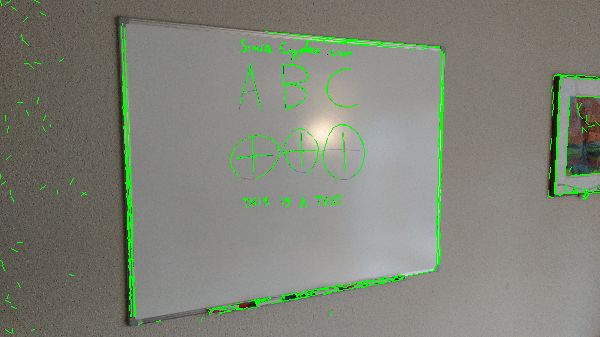

Code from [Main.scala:132](../../src/test/scala/Main.scala#L132) executed in 0.01 seconds: 
```java
    FactoryDetectLineAlgs.lineRansac(40, 30, 2.36, true, classOf[GrayF32], classOf[GrayF32])
```

Returns: 
```
    boofcv.abst.feature.detect.line.DetectLineSegmentsGridRansac@1623134f
```
Code from [Main.scala:113](../../src/test/scala/Main.scala#L113) executed in 1.70 seconds: 
```java
    val found: util.List[LineSegment2D_F32] = detector.detect(ConvertBufferedImage.convertFromSingle(image1, null, classOf[GrayF32]))
    gfx.drawImage(image1, 0, 0, width, height, null)
    gfx.setColor(Color.GREEN)
    found.asScala.foreach(line ⇒ {
      gfx.drawLine(
        (line.a.x * width / image1.getWidth).toInt, (line.a.y * height / image1.getHeight).toInt,
        (line.b.x * width / image1.getWidth).toInt, (line.b.y * height / image1.getHeight).toInt)
    })
```

Returns: 

