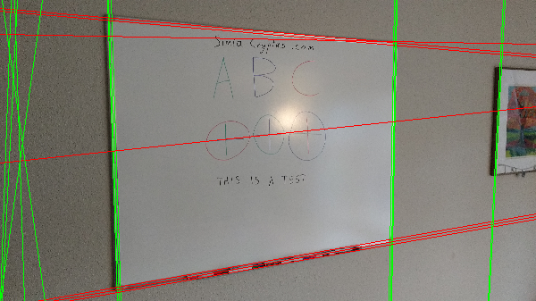
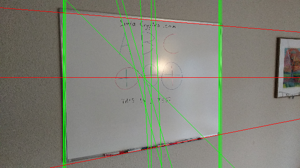
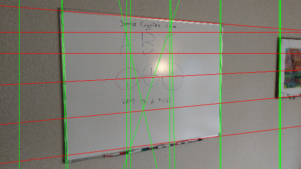

Code from [Main.scala:95](../../src/test/scala/Main.scala#L95) executed in 0.10 seconds: 
```java
    FactoryDetectLineAlgs.houghPolar(new ConfigHoughPolar(localMaxRadius, minCounts, 2, resolutionAngle, edgeThreshold, maxLines), classOf[GrayU8], classOf[GrayS16])
```

Returns: 
```
    boofcv.abst.feature.detect.line.DetectLineHoughPolar@7e5d9a50
```
Code from [Main.scala:61](../../src/test/scala/Main.scala#L61) executed in 2.49 seconds: 
```java
    val found: util.List[LineParametric2D_F32] = detector.detect(ConvertBufferedImage.convertFromSingle(image1, null, classOf[GrayU8]))
    gfx.drawImage(image1, 0, 0, width, height, null)
    found.asScala.foreach(line ⇒ {
      if(Math.abs(line.slope.x) > Math.abs(line.slope.y)) {
        val x1 = 0
        val y1 = (line.p.y - line.p.x * line.slope.y / line.slope.x).toInt
        val x2 = image1.getWidth
        val y2 = y1 + (x2 * line.slope.y / line.slope.x).toInt
        gfx.setColor(Color.RED)
        gfx.drawLine(
          x1 * width / image1.getWidth, y1 * height / image1.getHeight,
          x2 * width / image1.getWidth, y2 * height / image1.getHeight)
      } else {
        val y1 = 0
        val x1 = (line.p.x - line.p.y * line.slope.x / line.slope.y).toInt
        val y2 = image1.getHeight
        val x2 = x1 + (y2 * line.slope.x / line.slope.y).toInt
        gfx.setColor(Color.GREEN)
        gfx.drawLine(
          x1 * width / image1.getWidth, y1 * height / image1.getHeight,
          x2 * width / image1.getWidth, y2 * height / image1.getHeight)
      }
    })
```

Returns: 

Code from [Main.scala:98](../../src/test/scala/Main.scala#L98) executed in 0.01 seconds: 
```java
    FactoryDetectLineAlgs.houghFoot(new ConfigHoughFoot(localMaxRadius, minCounts, minDistanceFromOrigin, edgeThreshold, maxLines), classOf[GrayU8], classOf[GrayS16])
```

Returns: 
```
    boofcv.abst.feature.detect.line.DetectLineHoughFoot@556d0826
```
Code from [Main.scala:61](../../src/test/scala/Main.scala#L61) executed in 0.58 seconds: 
```java
    val found: util.List[LineParametric2D_F32] = detector.detect(ConvertBufferedImage.convertFromSingle(image1, null, classOf[GrayU8]))
    gfx.drawImage(image1, 0, 0, width, height, null)
    found.asScala.foreach(line ⇒ {
      if(Math.abs(line.slope.x) > Math.abs(line.slope.y)) {
        val x1 = 0
        val y1 = (line.p.y - line.p.x * line.slope.y / line.slope.x).toInt
        val x2 = image1.getWidth
        val y2 = y1 + (x2 * line.slope.y / line.slope.x).toInt
        gfx.setColor(Color.RED)
        gfx.drawLine(
          x1 * width / image1.getWidth, y1 * height / image1.getHeight,
          x2 * width / image1.getWidth, y2 * height / image1.getHeight)
      } else {
        val y1 = 0
        val x1 = (line.p.x - line.p.y * line.slope.x / line.slope.y).toInt
        val y2 = image1.getHeight
        val x2 = x1 + (y2 * line.slope.x / line.slope.y).toInt
        gfx.setColor(Color.GREEN)
        gfx.drawLine(
          x1 * width / image1.getWidth, y1 * height / image1.getHeight,
          x2 * width / image1.getWidth, y2 * height / image1.getHeight)
      }
    })
```

Returns: 

Code from [Main.scala:101](../../src/test/scala/Main.scala#L101) executed in 0.00 seconds: 
```java
    FactoryDetectLineAlgs.houghFootSub(new ConfigHoughFootSubimage(localMaxRadius, minCounts, minDistanceFromOrigin, edgeThreshold, maxLines, totalHorizontalDivisions, totalVerticalDivisions), classOf[GrayU8], classOf[GrayS16])
```

Returns: 
```
    boofcv.abst.feature.detect.line.DetectLineHoughFootSubimage@3dddefd8
```
Code from [Main.scala:61](../../src/test/scala/Main.scala#L61) executed in 0.42 seconds: 
```java
    val found: util.List[LineParametric2D_F32] = detector.detect(ConvertBufferedImage.convertFromSingle(image1, null, classOf[GrayU8]))
    gfx.drawImage(image1, 0, 0, width, height, null)
    found.asScala.foreach(line ⇒ {
      if(Math.abs(line.slope.x) > Math.abs(line.slope.y)) {
        val x1 = 0
        val y1 = (line.p.y - line.p.x * line.slope.y / line.slope.x).toInt
        val x2 = image1.getWidth
        val y2 = y1 + (x2 * line.slope.y / line.slope.x).toInt
        gfx.setColor(Color.RED)
        gfx.drawLine(
          x1 * width / image1.getWidth, y1 * height / image1.getHeight,
          x2 * width / image1.getWidth, y2 * height / image1.getHeight)
      } else {
        val y1 = 0
        val x1 = (line.p.x - line.p.y * line.slope.x / line.slope.y).toInt
        val y2 = image1.getHeight
        val x2 = x1 + (y2 * line.slope.x / line.slope.y).toInt
        gfx.setColor(Color.GREEN)
        gfx.drawLine(
          x1 * width / image1.getWidth, y1 * height / image1.getHeight,
          x2 * width / image1.getWidth, y2 * height / image1.getHeight)
      }
    })
```

Returns: 

