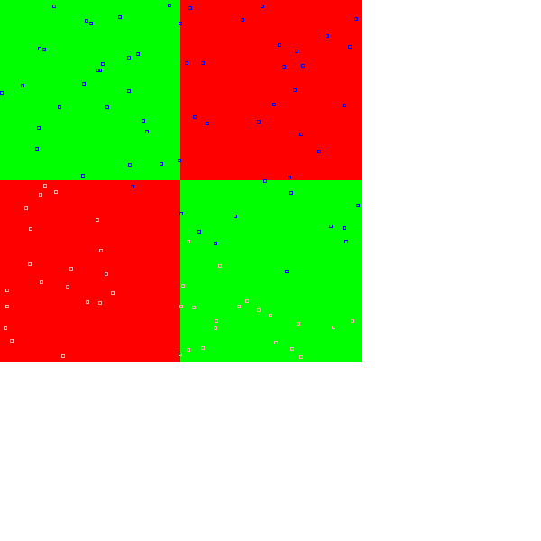

## Linear
Code from [MindsEyeDemo.scala:282](../../src/test/scala/MindsEyeDemo.scala#L282) executed in 0.00 seconds: 
```java
    (x: Double, y: Double) ⇒ if (x < y) 0 else 1
```

Returns: 

```
    <function2>
```


Code from [MindsEyeDemo.scala:284](../../src/test/scala/MindsEyeDemo.scala#L284) executed in 0.00 seconds: 
```java
    var model: DAGNetwork = new DAGNetwork
    model = model.add(new DenseSynapseLayerJBLAS(Tensor.dim(inputSize: _*), outputSize).setWeights(new ToDoubleFunction[Coordinate] {
      override def applyAsDouble(value: Coordinate): Double = Util.R.get.nextGaussian * 0.1
    }))
    model = model.add(new BiasLayer(outputSize: _*))
    model = model.add(new SoftmaxActivationLayer)
    model
```

Returns: 

```
    {
      "class": "DAGNetwork",
      "id": "a2ddb6b4-68f2-426a-905a-758d00000007",
      "root": {
        "layer": {
          "class": "SoftmaxActivationLayer",
          "id": "a2ddb6b4-68f2-426a-905a-758d0000000a"
        },
        "prev0": {
          "layer": {
            "class": "BiasLayer",
            "id": "a2ddb6b4-68f2-426a-905a-758d00000009",
            "bias": "[0.0, 0.0]"
          },
          "prev0": {
            "layer": {
              "class": "DenseSynapseLayerJBLAS",
              "id": "a2ddb6b4-68f2-426a-905a-758d00000008",
              "weights": "[ [ 0.0011755490773915813,-0.0657843020557711 ],[ 0.013288835673933231,0.04898844305812058 ] ]"
            },
            "prev0": {
              "target": "[ded615c9-0c20-4d95-ba22-6fc16b5243b9, 2c1c1973-e5e4-44a8-a8ed-77ad705f55a3]"
            }
          }
        }
      }
    }
```


Code from [MindsEyeDemo.scala:233](../../src/test/scala/MindsEyeDemo.scala#L233) executed in 0.13 seconds: 
```java
    (0 to 400).foreach(x ⇒ (0 to 400).foreach(y ⇒ {
      function((x / 200.0) - 1.0, (y / 200.0) - 1.0) match {
        case 0 ⇒ gfx.setColor(Color.RED)
        case 1 ⇒ gfx.setColor(Color.GREEN)
      }
      gfx.drawRect(x, y, 1, 1)
    }))
    validationData.foreach(testObj ⇒ {
      val row = new util.LinkedHashMap[String, AnyRef]()
      val result = model.eval(testObj(0)).data.head
      (0 until MAX).maxBy(i ⇒ result.get(i)) match {
        case 0 ⇒ gfx.setColor(Color.PINK)
        case 1 ⇒ gfx.setColor(Color.BLUE)
      }
      val xx = testObj(0).get(0) * 200.0 + 200.0
      val yy = testObj(0).get(1) * 200.0 + 200.0
      gfx.drawRect(xx.toInt - 1, yy.toInt - 1, 3, 3)
    })
```

Returns: 


Code from [MindsEyeDemo.scala:254](../../src/test/scala/MindsEyeDemo.scala#L254) executed in 0.01 seconds: 
```java
    validationData.map(testObj ⇒ {
      val result = model.eval(testObj(0)).data.head
      val prediction: Int = (0 until MAX).maxBy(i ⇒ result.get(i))
      val actual: Int = (0 until MAX).maxBy(i ⇒ testObj(1).get(i))
      actual → prediction
    }).groupBy(_._1).mapValues(_.groupBy(_._2).mapValues(_.size))
```

Returns: 

```
    Map(1 -> Map(1 -> 55, 0 -> 1), 0 -> Map(0 -> 44))
```


Actual \ Predicted | 0 | 1
--- | --- | ---
 **0** | 44 | 0 | 0 | 0 | 0 | 0 | 0 | 0 | 0 | 0
 **1** | 1 | 55 | 0 | 0 | 0 | 0 | 0 | 0 | 0 | 0
Code from [MindsEyeDemo.scala:276](../../src/test/scala/MindsEyeDemo.scala#L276) executed in 0.00 seconds: 
```java
    overall → byCategory
```

Returns: 

```
    (99.0,Map(0 -> 100.0, 1 -> 98.21428571428571))
```


## XOR
Code from [MindsEyeDemo.scala:295](../../src/test/scala/MindsEyeDemo.scala#L295) executed in 0.00 seconds: 
```java
    (x: Double, y: Double) ⇒ if ((x < 0) ^ (y < 0)) 0 else 1
```

Returns: 

```
    <function2>
```


Code from [MindsEyeDemo.scala:298](../../src/test/scala/MindsEyeDemo.scala#L298) executed in 0.00 seconds: 
```java
    var model: DAGNetwork = new DAGNetwork
    model = model.add(new DenseSynapseLayerJBLAS(Tensor.dim(inputSize: _*), outputSize).setWeights(new ToDoubleFunction[Coordinate] {
      override def applyAsDouble(value: Coordinate): Double = Util.R.get.nextGaussian * 0.2
    }))
    model = model.add(new BiasLayer(outputSize: _*))
    model = model.add(new SoftmaxActivationLayer)
    model
```

Returns: 

```
    {
      "class": "DAGNetwork",
      "id": "a2ddb6b4-68f2-426a-905a-758d0000000d",
      "root": {
        "layer": {
          "class": "SoftmaxActivationLayer",
          "id": "a2ddb6b4-68f2-426a-905a-758d00000010"
        },
        "prev0": {
          "layer": {
            "class": "BiasLayer",
            "id": "a2ddb6b4-68f2-426a-905a-758d0000000f",
            "bias": "[0.0, 0.0]"
          },
          "prev0": {
            "layer": {
              "class": "DenseSynapseLayerJBLAS",
              "id": "a2ddb6b4-68f2-426a-905a-758d0000000e",
              "weights": "[ [ -0.24524846870193218,0.11813670817258758 ],[ -0.18745512882537124,-0.197714839372946 ] ]"
            },
            "prev0": {
              "target": "[933d89f5-e4b9-450a-ae25-48271e34e67b, 4213cda2-1ad4-4925-b1b5-7c4caeb7c670]"
            }
          }
        }
      }
    }
```


Code from [MindsEyeDemo.scala:233](../../src/test/scala/MindsEyeDemo.scala#L233) executed in 0.10 seconds: 
```java
    (0 to 400).foreach(x ⇒ (0 to 400).foreach(y ⇒ {
      function((x / 200.0) - 1.0, (y / 200.0) - 1.0) match {
        case 0 ⇒ gfx.setColor(Color.RED)
        case 1 ⇒ gfx.setColor(Color.GREEN)
      }
      gfx.drawRect(x, y, 1, 1)
    }))
    validationData.foreach(testObj ⇒ {
      val row = new util.LinkedHashMap[String, AnyRef]()
      val result = model.eval(testObj(0)).data.head
      (0 until MAX).maxBy(i ⇒ result.get(i)) match {
        case 0 ⇒ gfx.setColor(Color.PINK)
        case 1 ⇒ gfx.setColor(Color.BLUE)
      }
      val xx = testObj(0).get(0) * 200.0 + 200.0
      val yy = testObj(0).get(1) * 200.0 + 200.0
      gfx.drawRect(xx.toInt - 1, yy.toInt - 1, 3, 3)
    })
```

Returns: 




Code from [MindsEyeDemo.scala:254](../../src/test/scala/MindsEyeDemo.scala#L254) executed in 0.00 seconds: 
```java
    validationData.map(testObj ⇒ {
      val result = model.eval(testObj(0)).data.head
      val prediction: Int = (0 until MAX).maxBy(i ⇒ result.get(i))
      val actual: Int = (0 until MAX).maxBy(i ⇒ testObj(1).get(i))
      actual → prediction
    }).groupBy(_._1).mapValues(_.groupBy(_._2).mapValues(_.size))
```

Returns: 

```
    Map(1 -> Map(0 -> 61), 0 -> Map(0 -> 39))
```


Actual \ Predicted | 0 | 1
--- | --- | ---
 **0** | 39 | 0 | 0 | 0 | 0 | 0 | 0 | 0 | 0 | 0
 **1** | 61 | 0 | 0 | 0 | 0 | 0 | 0 | 0 | 0 | 0
Code from [MindsEyeDemo.scala:276](../../src/test/scala/MindsEyeDemo.scala#L276) executed in 0.00 seconds: 
```java
    overall → byCategory
```

Returns: 

```
    (39.0,Map(0 -> 100.0, 1 -> 0.0))
```


Code from [MindsEyeDemo.scala:307](../../src/test/scala/MindsEyeDemo.scala#L307) executed in 0.01 seconds: 
```java
    var model: DAGNetwork = new DAGNetwork
    val middleSize = Array[Int](15)
    model = model.add(new DenseSynapseLayerJBLAS(Tensor.dim(inputSize: _*), middleSize).setWeights(new ToDoubleFunction[Coordinate] {
      override def applyAsDouble(value: Coordinate): Double = Util.R.get.nextGaussian * 1
    }))
    model = model.add(new BiasLayer(middleSize: _*))
    model = model.add(new AbsActivationLayer())
    model = model.add(new DenseSynapseLayerJBLAS(Tensor.dim(middleSize: _*), outputSize).setWeights(new ToDoubleFunction[Coordinate] {
      override def applyAsDouble(value: Coordinate): Double = Util.R.get.nextGaussian * 1
    }))
    model = model.add(new BiasLayer(outputSize: _*))
    model = model.add(new SoftmaxActivationLayer)
    model
```

Returns: 

```
    {
      "class": "DAGNetwork",
      "id": "a2ddb6b4-68f2-426a-905a-758d00000013",
      "root": {
        "layer": {
          "class": "SoftmaxActivationLayer",
          "id": "a2ddb6b4-68f2-426a-905a-758d00000019"
        },
        "prev0": {
          "layer": {
            "class": "BiasLayer",
            "id": "a2ddb6b4-68f2-426a-905a-758d00000018",
            "bias": "[0.0, 0.0]"
          },
          "prev0": {
            "layer": {
              "class": "DenseSynapseLayerJBLAS",
              "id": "a2ddb6b4-68f2-426a-905a-758d00000017",
              "weights": "[ [ -0.6630447404977792,-0.6125370986211313 ],[ 0.313388224085457,-1.1851917740937317 ],[ -1.662436407286282,-0.3156677486376192 ],[ 0.6377594612296221,-0.4943623588378066 ],[ 1.5541691218535625,-2.963485398252958 ],[ 1.2990513432950725,1.4292021558032366 ],[ -0.9551661380673003,0.6806615016262993 ],[ -0.7510003244913536,-0.02140555681639731 ],... ]"
            },
            "prev0": {
              "layer": {
                "class": "AbsActivationLayer",
                "id": "a2ddb6b4-68f2-426a-905a-758d00000016"
              },
              "prev0": {
                "layer": {
                  "class": "BiasLayer",
                  "id": "a2ddb6b4-68f2-426a-905a-758d00000015",
                  "bias": "[0.0, 0.0, 0.0, 0.0, 0.0, 0.0, 0.0, 0.0, 0.0, 0.0, 0.0, 0.0, 0.0, 0.0, 0.0]"
                },
                "prev0": {
                  "layer": {
                    "class": "DenseSynapseLayerJBLAS",
                    "id": "a2ddb6b4-68f2-426a-905a-758d00000014",
                    "weights": "[ [ 0.9009214398554469,-0.005282217646837058,1.6108637565296509,-0.4667930388530999,-1.0686004239319282,-1.8785484842517817,0.08810735815079791,-0.7993940839665006,... ],[ -1.2512162330923093,0.3079479524023446,-0.6046528199053811,-0.47383065695245014,-1.1576461409849297,0.5383336658783114,0.05639206671984922,-0.06772029587085933,... ] ]"
                  },
                  "prev0": {
                    "target": "[107b106b-d025-46a5-a4a1-59ba93b70342, f4be08bf-d2c3-449c-b1f4-a2255d30ac24]"
                  }
                }
              }
            }
          }
        }
      }
    }
```


Code from [MindsEyeDemo.scala:233](../../src/test/scala/MindsEyeDemo.scala#L233) executed in 0.13 seconds: 
```java
    (0 to 400).foreach(x ⇒ (0 to 400).foreach(y ⇒ {
      function((x / 200.0) - 1.0, (y / 200.0) - 1.0) match {
        case 0 ⇒ gfx.setColor(Color.RED)
        case 1 ⇒ gfx.setColor(Color.GREEN)
      }
      gfx.drawRect(x, y, 1, 1)
    }))
    validationData.foreach(testObj ⇒ {
      val row = new util.LinkedHashMap[String, AnyRef]()
      val result = model.eval(testObj(0)).data.head
      (0 until MAX).maxBy(i ⇒ result.get(i)) match {
        case 0 ⇒ gfx.setColor(Color.PINK)
        case 1 ⇒ gfx.setColor(Color.BLUE)
      }
      val xx = testObj(0).get(0) * 200.0 + 200.0
      val yy = testObj(0).get(1) * 200.0 + 200.0
      gfx.drawRect(xx.toInt - 1, yy.toInt - 1, 3, 3)
    })
```

Returns: 


Code from [MindsEyeDemo.scala:254](../../src/test/scala/MindsEyeDemo.scala#L254) executed in 0.00 seconds: 
```java
    validationData.map(testObj ⇒ {
      val result = model.eval(testObj(0)).data.head
      val prediction: Int = (0 until MAX).maxBy(i ⇒ result.get(i))
      val actual: Int = (0 until MAX).maxBy(i ⇒ testObj(1).get(i))
      actual → prediction
    }).groupBy(_._1).mapValues(_.groupBy(_._2).mapValues(_.size))
```

Returns: 

```
    Map(1 -> Map(1 -> 43), 0 -> Map(1 -> 6, 0 -> 51))
```


Actual \ Predicted | 0 | 1
--- | --- | ---
 **0** | 51 | 6 | 0 | 0 | 0 | 0 | 0 | 0 | 0 | 0
 **1** | 0 | 43 | 0 | 0 | 0 | 0 | 0 | 0 | 0 | 0
Code from [MindsEyeDemo.scala:276](../../src/test/scala/MindsEyeDemo.scala#L276) executed in 0.00 seconds: 
```java
    overall → byCategory
```

Returns: 

```
    (94.0,Map(0 -> 89.47368421052632, 1 -> 100.0))
```


## Circle
Code from [MindsEyeDemo.scala:324](../../src/test/scala/MindsEyeDemo.scala#L324) executed in 0.00 seconds: 
```java
    (x: Double, y: Double) ⇒ if ((x * x) + (y * y) < 0.5) 0 else 1
```

Returns: 

```
    <function2>
```


Code from [MindsEyeDemo.scala:327](../../src/test/scala/MindsEyeDemo.scala#L327) executed in 0.00 seconds: 
```java
    var model: DAGNetwork = new DAGNetwork
    model = model.add(new DenseSynapseLayerJBLAS(Tensor.dim(inputSize: _*), outputSize).setWeights(new ToDoubleFunction[Coordinate] {
      override def applyAsDouble(value: Coordinate): Double = Util.R.get.nextGaussian * 0.2
    }))
    model = model.add(new BiasLayer(outputSize: _*))
    model = model.add(new SoftmaxActivationLayer)
    model
```

Returns: 

```
    {
      "class": "DAGNetwork",
      "id": "a2ddb6b4-68f2-426a-905a-758d0000001c",
      "root": {
        "layer": {
          "class": "SoftmaxActivationLayer",
          "id": "a2ddb6b4-68f2-426a-905a-758d0000001f"
        },
        "prev0": {
          "layer": {
            "class": "BiasLayer",
            "id": "a2ddb6b4-68f2-426a-905a-758d0000001e",
            "bias": "[0.0, 0.0]"
          },
          "prev0": {
            "layer": {
              "class": "DenseSynapseLayerJBLAS",
              "id": "a2ddb6b4-68f2-426a-905a-758d0000001d",
              "weights": "[ [ -0.14680234437338002,-0.09676299057404171 ],[ 0.0810449214400146,-0.13933616534537166 ] ]"
            },
            "prev0": {
              "target": "[b26ddd07-ccec-481a-8f80-9a4a5a6b0175, efdcd0cd-9f4c-46ce-888e-7366a0649bdf]"
            }
          }
        }
      }
    }
```


