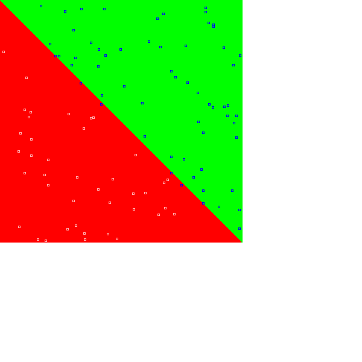

## Linear
The simplest problem is linear descrimination, which can be learned by the simplest network

Code from [MindsEyeDemo.scala:273](../../src/test/scala/MindsEyeDemo.scala#L273) executed in 0.00 seconds: 
```java
    (x: Double, y: Double) ⇒ if (x < y) 0 else 1
```

Returns: 

```
    <function2>
```


Code from [MindsEyeDemo.scala:275](../../src/test/scala/MindsEyeDemo.scala#L275) executed in 0.00 seconds: 
```java
    var model: DAGNetwork = new DAGNetwork
    model = model.add(new DenseSynapseLayerJBLAS(Tensor.dim(inputSize: _*), outputSize).setWeights(new ToDoubleFunction[Coordinate] {
      override def applyAsDouble(value: Coordinate): Double = Util.R.get.nextGaussian * 0.1
    }))
    model = model.add(new BiasLayer(outputSize: _*))
    model = model.add(new SoftmaxActivationLayer)
    model
```

Returns: 

```
    {
      "class": "DAGNetwork",
      "id": "c032913e-c689-4a8c-b707-0a1c00000007",
      "root": {
        "layer": {
          "class": "SoftmaxActivationLayer",
          "id": "c032913e-c689-4a8c-b707-0a1c0000000a"
        },
        "prev0": {
          "layer": {
            "class": "BiasLayer",
            "id": "c032913e-c689-4a8c-b707-0a1c00000009",
            "bias": "[0.0, 0.0]"
          },
          "prev0": {
            "layer": {
              "class": "DenseSynapseLayerJBLAS",
              "id": "c032913e-c689-4a8c-b707-0a1c00000008",
              "weights": "[ [ 0.02731259309228078,-0.0786607911055522 ],[ -0.13945413989092037,-0.001713369999339198 ] ]"
            },
            "prev0": {
              "target": "[088ba979-d28e-4e82-85dc-0b9d871dd797, c7c56b68-e2a9-449f-9c0c-e04edb001b08]"
            }
          }
        }
      }
    }
```


Code from [MindsEyeDemo.scala:248](../../src/test/scala/MindsEyeDemo.scala#L248) executed in 0.10 seconds: 
```java
    plotXY(gfx)
```

Returns: 




Code from [MindsEyeDemo.scala:265](../../src/test/scala/MindsEyeDemo.scala#L265) executed in 0.00 seconds: 
```java
    overall → byCategory
```

Returns: 

```
    (98.0,Map(0 -> 98.11320754716981, 1 -> 97.87234042553192))
```


## XOR
The XOR function is not linearly seperable, and cannot be solved by this network:

Code from [MindsEyeDemo.scala:287](../../src/test/scala/MindsEyeDemo.scala#L287) executed in 0.00 seconds: 
```java
    (x: Double, y: Double) ⇒ if ((x < 0) ^ (y < 0)) 0 else 1
```

Returns: 

```
    <function2>
```


Code from [MindsEyeDemo.scala:290](../../src/test/scala/MindsEyeDemo.scala#L290) executed in 0.00 seconds: 
```java
    var model: DAGNetwork = new DAGNetwork
    model = model.add(new DenseSynapseLayerJBLAS(Tensor.dim(inputSize: _*), outputSize).setWeights(new ToDoubleFunction[Coordinate] {
      override def applyAsDouble(value: Coordinate): Double = Util.R.get.nextGaussian * 0.2
    }))
    model = model.add(new BiasLayer(outputSize: _*))
    model = model.add(new SoftmaxActivationLayer)
    model
```

Returns: 

```
    {
      "class": "DAGNetwork",
      "id": "c032913e-c689-4a8c-b707-0a1c0000000d",
      "root": {
        "layer": {
          "class": "SoftmaxActivationLayer",
          "id": "c032913e-c689-4a8c-b707-0a1c00000010"
        },
        "prev0": {
          "layer": {
            "class": "BiasLayer",
            "id": "c032913e-c689-4a8c-b707-0a1c0000000f",
            "bias": "[0.0, 0.0]"
          },
          "prev0": {
            "layer": {
              "class": "DenseSynapseLayerJBLAS",
              "id": "c032913e-c689-4a8c-b707-0a1c0000000e",
              "weights": "[ [ 0.03842391337202879,-0.019403823878777048 ],[ -0.11329512047406415,-0.3753031804746383 ] ]"
            },
            "prev0": {
              "target": "[bf638e6a-822d-4090-b59f-42c63c59802d, 16319f33-daa2-4bf8-8cb8-89670db8dd80]"
            }
          }
        }
      }
    }
```


Code from [MindsEyeDemo.scala:248](../../src/test/scala/MindsEyeDemo.scala#L248) executed in 0.10 seconds: 
```java
    plotXY(gfx)
```

Returns: 


Code from [MindsEyeDemo.scala:265](../../src/test/scala/MindsEyeDemo.scala#L265) executed in 0.00 seconds: 
```java
    overall → byCategory
```

Returns: 

```
    (52.0,Map(0 -> 100.0, 1 -> 0.0))
```


If we add a hidden layer with enough units, we can learn the nonlinearity:

Code from [MindsEyeDemo.scala:300](../../src/test/scala/MindsEyeDemo.scala#L300) executed in 0.03 seconds: 
```java
    var model: DAGNetwork = new DAGNetwork
    val middleSize = Array[Int](15)
    model = model.add(new DenseSynapseLayerJBLAS(Tensor.dim(inputSize: _*), middleSize).setWeights(new ToDoubleFunction[Coordinate] {
      override def applyAsDouble(value: Coordinate): Double = Util.R.get.nextGaussian * 1
    }))
    model = model.add(new BiasLayer(middleSize: _*))
    model = model.add(new AbsActivationLayer())
    model = model.add(new DenseSynapseLayerJBLAS(Tensor.dim(middleSize: _*), outputSize).setWeights(new ToDoubleFunction[Coordinate] {
      override def applyAsDouble(value: Coordinate): Double = Util.R.get.nextGaussian * 1
    }))
    model = model.add(new BiasLayer(outputSize: _*))
    model = model.add(new SoftmaxActivationLayer)
    model
```

Returns: 

```
    {
      "class": "DAGNetwork",
      "id": "c032913e-c689-4a8c-b707-0a1c00000013",
      "root": {
        "layer": {
          "class": "SoftmaxActivationLayer",
          "id": "c032913e-c689-4a8c-b707-0a1c00000019"
        },
        "prev0": {
          "layer": {
            "class": "BiasLayer",
            "id": "c032913e-c689-4a8c-b707-0a1c00000018",
            "bias": "[0.0, 0.0]"
          },
          "prev0": {
            "layer": {
              "class": "DenseSynapseLayerJBLAS",
              "id": "c032913e-c689-4a8c-b707-0a1c00000017",
              "weights": "[ [ -1.4495697143642619,-1.0627308113744076 ],[ -0.35725444263767486,0.04256395468541661 ],[ 1.8197638885865624,0.8250589875650377 ],[ -1.1902183441020369,0.5346251241457803 ],[ -1.5841948146306213,0.9352740153818914 ],[ -0.8307547643828911,2.4214813083856184 ],[ -0.956419374067667,1.0128185966726944 ],[ -1.7494428746230792,0.7216704783069519 ],... ]"
            },
            "prev0": {
              "layer": {
                "class": "AbsActivationLayer",
                "id": "c032913e-c689-4a8c-b707-0a1c00000016"
              },
              "prev0": {
                "layer": {
                  "class": "BiasLayer",
                  "id": "c032913e-c689-4a8c-b707-0a1c00000015",
                  "bias": "[0.0, 0.0, 0.0, 0.0, 0.0, 0.0, 0.0, 0.0, 0.0, 0.0, 0.0, 0.0, 0.0, 0.0, 0.0]"
                },
                "prev0": {
                  "layer": {
                    "class": "DenseSynapseLayerJBLAS",
                    "id": "c032913e-c689-4a8c-b707-0a1c00000014",
                    "weights": "[ [ 0.0035258325977013715,0.28301518452793306,0.1954866785390585,-0.10490076316636902,-0.975970820351259,0.4264070019343107,-1.7584614675429742,-0.7115293445823194,... ],[ -0.6443678368369344,0.2738875971612559,0.04455490069018557,-0.7445158496908095,0.91919411607883,1.7163077860171008,-0.42643471550299533,0.9684255683320624,... ] ]"
                  },
                  "prev0": {
                    "target": "[77e5e0eb-65a1-4638-9740-3998d298d4e4, c6643afd-d6a6-4682-82d9-ec60fc689239]"
                  }
                }
              }
            }
          }
        }
      }
    }
```


Code from [MindsEyeDemo.scala:248](../../src/test/scala/MindsEyeDemo.scala#L248) executed in 0.10 seconds: 
```java
    plotXY(gfx)
```

Returns: 


Code from [MindsEyeDemo.scala:265](../../src/test/scala/MindsEyeDemo.scala#L265) executed in 0.00 seconds: 
```java
    overall → byCategory
```

Returns: 

```
    (98.0,Map(0 -> 100.0, 1 -> 96.22641509433963))
```


## Circle
Similar behavior is seen with simple networks on the unit circle function

Code from [MindsEyeDemo.scala:318](../../src/test/scala/MindsEyeDemo.scala#L318) executed in 0.00 seconds: 
```java
    (x: Double, y: Double) ⇒ if ((x * x) + (y * y) < 0.5) 0 else 1
```

Returns: 

```
    <function2>
```


Code from [MindsEyeDemo.scala:321](../../src/test/scala/MindsEyeDemo.scala#L321) executed in 0.00 seconds: 
```java
    var model: DAGNetwork = new DAGNetwork
    model = model.add(new DenseSynapseLayerJBLAS(Tensor.dim(inputSize: _*), outputSize).setWeights(new ToDoubleFunction[Coordinate] {
      override def applyAsDouble(value: Coordinate): Double = Util.R.get.nextGaussian * 0.2
    }))
    model = model.add(new BiasLayer(outputSize: _*))
    model = model.add(new SoftmaxActivationLayer)
    model
```

Returns: 

```
    {
      "class": "DAGNetwork",
      "id": "c032913e-c689-4a8c-b707-0a1c0000001c",
      "root": {
        "layer": {
          "class": "SoftmaxActivationLayer",
          "id": "c032913e-c689-4a8c-b707-0a1c0000001f"
        },
        "prev0": {
          "layer": {
            "class": "BiasLayer",
            "id": "c032913e-c689-4a8c-b707-0a1c0000001e",
            "bias": "[0.0, 0.0]"
          },
          "prev0": {
            "layer": {
              "class": "DenseSynapseLayerJBLAS",
              "id": "c032913e-c689-4a8c-b707-0a1c0000001d",
              "weights": "[ [ -0.07893453437681383,0.2096906616304288 ],[ -0.3404302218547208,-0.00439234106977883 ] ]"
            },
            "prev0": {
              "target": "[8157a5d5-c3fe-4214-8de6-375c3fdf987c, 5dd330b4-105b-492f-9f94-822782cd7b73]"
            }
          }
        }
      }
    }
```


Code from [MindsEyeDemo.scala:248](../../src/test/scala/MindsEyeDemo.scala#L248) executed in 0.10 seconds: 
```java
    plotXY(gfx)
```

Returns: 


Code from [MindsEyeDemo.scala:265](../../src/test/scala/MindsEyeDemo.scala#L265) executed in 0.00 seconds: 
```java
    overall → byCategory
```

Returns: 

```
    (41.0,Map(0 -> 100.0, 1 -> 0.0))
```


Code from [MindsEyeDemo.scala:330](../../src/test/scala/MindsEyeDemo.scala#L330) executed in 0.01 seconds: 
```java
    var model: DAGNetwork = new DAGNetwork
    val middleSize = Array[Int](15)
    model = model.add(new DenseSynapseLayerJBLAS(Tensor.dim(inputSize: _*), middleSize).setWeights(new ToDoubleFunction[Coordinate] {
      override def applyAsDouble(value: Coordinate): Double = Util.R.get.nextGaussian * 1
    }))
    model = model.add(new BiasLayer(middleSize: _*))
    model = model.add(new AbsActivationLayer())
    model = model.add(new DenseSynapseLayerJBLAS(Tensor.dim(middleSize: _*), outputSize).setWeights(new ToDoubleFunction[Coordinate] {
      override def applyAsDouble(value: Coordinate): Double = Util.R.get.nextGaussian * 1
    }))
    model = model.add(new BiasLayer(outputSize: _*))
    model = model.add(new SoftmaxActivationLayer)
    model
```

Returns: 

```
    {
      "class": "DAGNetwork",
      "id": "c032913e-c689-4a8c-b707-0a1c00000022",
      "root": {
        "layer": {
          "class": "SoftmaxActivationLayer",
          "id": "c032913e-c689-4a8c-b707-0a1c00000028"
        },
        "prev0": {
          "layer": {
            "class": "BiasLayer",
            "id": "c032913e-c689-4a8c-b707-0a1c00000027",
            "bias": "[0.0, 0.0]"
          },
          "prev0": {
            "layer": {
              "class": "DenseSynapseLayerJBLAS",
              "id": "c032913e-c689-4a8c-b707-0a1c00000026",
              "weights": "[ [ -0.5436352601824106,-0.6174622469445284 ],[ 1.4387225416357186,-0.87271077476213 ],[ 0.6279848121627911,-0.40946938633350055 ],[ 0.30286026180771747,-0.031229829542187306 ],[ -0.2032121774994939,-0.6734669949947408 ],[ -0.5555637514914058,1.7204596504544172 ],[ -0.034931968738069516,0.1815660330200032 ],[ -0.2168844199447683,-1.5732383546670035 ],... ]"
            },
            "prev0": {
              "layer": {
                "class": "AbsActivationLayer",
                "id": "c032913e-c689-4a8c-b707-0a1c00000025"
              },
              "prev0": {
                "layer": {
                  "class": "BiasLayer",
                  "id": "c032913e-c689-4a8c-b707-0a1c00000024",
                  "bias": "[0.0, 0.0, 0.0, 0.0, 0.0, 0.0, 0.0, 0.0, 0.0, 0.0, 0.0, 0.0, 0.0, 0.0, 0.0]"
                },
                "prev0": {
                  "layer": {
                    "class": "DenseSynapseLayerJBLAS",
                    "id": "c032913e-c689-4a8c-b707-0a1c00000023",
                    "weights": "[ [ -0.08438528871110212,0.13222709559813986,0.06385277753285667,0.7709858938969454,0.774194606342678,-0.19860632083042612,1.0261323957707726,0.6287817498084207,... ],[ 0.21084236526511732,-0.6896639767545193,-1.2964274648081622,-1.8539825186120311,0.7933208811738357,0.25081400158060174,1.4117433375329327,-2.397928125705889,... ] ]"
                  },
                  "prev0": {
                    "target": "[1640184d-61bd-4c9f-8cb1-39336dc5d813, ed7044d0-8bfd-43d1-b29b-073292a13765]"
                  }
                }
              }
            }
          }
        }
      }
    }
```


Code from [MindsEyeDemo.scala:248](../../src/test/scala/MindsEyeDemo.scala#L248) executed in 0.10 seconds: 
```java
    plotXY(gfx)
```

Returns: 


Code from [MindsEyeDemo.scala:265](../../src/test/scala/MindsEyeDemo.scala#L265) executed in 0.00 seconds: 
```java
    overall → byCategory
```

Returns: 

```
    (95.0,Map(0 -> 90.0, 1 -> 97.14285714285714))
```


