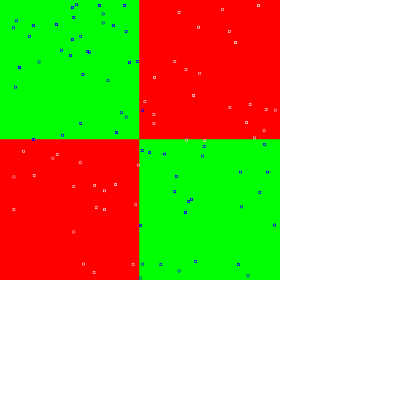

## Linear
The simplest problem is linear descrimination, which can be learned by the simplest network

Code from [MindsEyeDemo.scala:309](../../src/test/scala/MindsEyeDemo.scala#L309) executed in 0.00 seconds: 
```java
    (x: Double, y: Double) ⇒ if (x < y) 0 else 1
```

Returns: 

```
    <function2>
```


Code from [MindsEyeDemo.scala:311](../../src/test/scala/MindsEyeDemo.scala#L311) executed in 0.01 seconds: 
```java
    var model: PipelineNetwork = new PipelineNetwork
    model.add(new DenseSynapseLayerJBLAS(Tensor.dim(inputSize: _*), outputSize).setWeights(new ToDoubleFunction[Coordinate] {
      override def applyAsDouble(value: Coordinate): Double = Util.R.get.nextGaussian * 0.1
    }))
    model.add(new BiasLayer(outputSize: _*))
    model.add(new SoftmaxActivationLayer)
    model
```

Returns: 

```
    {
      "class": "PipelineNetwork",
      "id": "5c4a4a38-73ac-488b-b1a1-b55a00000007",
      "nodes": [
        {
          "id": {
            "class": "DenseSynapseLayerJBLAS",
            "id": "5c4a4a38-73ac-488b-b1a1-b55a00000008",
            "weights": "[ [ 0.15064511430430585,0.1254296736614699 ],[ 0.059788408642144714,0.05896708758013644 ] ]"
          },
          "prev0": {
            "target": "[ec4a591a-e0f8-42a0-b108-adc5407ac414]"
          }
        },
        {
          "id": {
            "class": "BiasLayer",
            "id": "5c4a4a38-73ac-488b-b1a1-b55a00000009",
            "bias": "[0.0, 0.0]"
          },
          "prev0": {
            "id": {
              "class": "DenseSynapseLayerJBLAS",
              "id": "5c4a4a38-73ac-488b-b1a1-b55a00000008",
              "weights": "[ [ 0.15064511430430585,0.1254296736614699 ],[ 0.059788408642144714,0.05896708758013644 ] ]"
            },
            "prev0": {
              "target": "[ec4a591a-e0f8-42a0-b108-adc5407ac414]"
            }
          }
        },
        {
          "id": {
            "class": "SoftmaxActivationLayer",
            "id": "5c4a4a38-73ac-488b-b1a1-b55a0000000a"
          },
          "prev0": {
            "id": {
              "class": "BiasLayer",
              "id": "5c4a4a38-73ac-488b-b1a1-b55a00000009",
              "bias": "[0.0, 0.0]"
            },
            "prev0": {
              "id": {
                "class": "DenseSynapseLayerJBLAS",
                "id": "5c4a4a38-73ac-488b-b1a1-b55a00000008",
                "weights": "[ [ 0.15064511430430585,0.1254296736614699 ],[ 0.059788408642144714,0.05896708758013644 ] ]"
              },
              "prev0": {
                "target": "[ec4a591a-e0f8-42a0-b108-adc5407ac414]"
              }
            }
          }
        }
      ],
      "root": {
        "id": {
          "class": "SoftmaxActivationLayer",
          "id": "5c4a4a38-73ac-488b-b1a1-b55a0000000a"
        },
        "prev0": {
          "id": {
            "class": "BiasLayer",
            "id": "5c4a4a38-73ac-488b-b1a1-b55a00000009",
            "bias": "[0.0, 0.0]"
          },
          "prev0": {
            "id": {
              "class": "DenseSynapseLayerJBLAS",
              "id": "5c4a4a38-73ac-488b-b1a1-b55a00000008",
              "weights": "[ [ 0.15064511430430585,0.1254296736614699 ],[ 0.059788408642144714,0.05896708758013644 ] ]"
            },
            "prev0": {
              "target": "[ec4a591a-e0f8-42a0-b108-adc5407ac414]"
            }
          }
        }
      }
    }
```


Code from [MindsEyeDemo.scala:284](../../src/test/scala/MindsEyeDemo.scala#L284) executed in 0.11 seconds: 
```java
    plotXY(gfx)
```

Returns: 


Code from [MindsEyeDemo.scala:301](../../src/test/scala/MindsEyeDemo.scala#L301) executed in 0.00 seconds: 
```java
    overall → byCategory
```

Returns: 

```
    (99.0,Map(0 -> 97.82608695652173, 1 -> 100.0))
```


## XOR
The XOR function is not linearly seperable, and cannot be solved by this network:

Code from [MindsEyeDemo.scala:323](../../src/test/scala/MindsEyeDemo.scala#L323) executed in 0.00 seconds: 
```java
    (x: Double, y: Double) ⇒ if ((x < 0) ^ (y < 0)) 0 else 1
```

Returns: 

```
    <function2>
```


Code from [MindsEyeDemo.scala:326](../../src/test/scala/MindsEyeDemo.scala#L326) executed in 0.00 seconds: 
```java
    var model: PipelineNetwork = new PipelineNetwork
    model.add(new DenseSynapseLayerJBLAS(Tensor.dim(inputSize: _*), outputSize).setWeights(new ToDoubleFunction[Coordinate] {
      override def applyAsDouble(value: Coordinate): Double = Util.R.get.nextGaussian * 0.2
    }))
    model.add(new BiasLayer(outputSize: _*))
    model.add(new SoftmaxActivationLayer)
    model
```

Returns: 

```
    {
      "class": "PipelineNetwork",
      "id": "5c4a4a38-73ac-488b-b1a1-b55a0000000d",
      "nodes": [
        {
          "id": {
            "class": "DenseSynapseLayerJBLAS",
            "id": "5c4a4a38-73ac-488b-b1a1-b55a0000000e",
            "weights": "[ [ -0.23729889364087375,0.03307450634045789 ],[ -0.08216429349465698,0.14374585308169033 ] ]"
          },
          "prev0": {
            "target": "[81df8788-1a5f-431a-92fc-16feaa9fa20e]"
          }
        },
        {
          "id": {
            "class": "BiasLayer",
            "id": "5c4a4a38-73ac-488b-b1a1-b55a0000000f",
            "bias": "[0.0, 0.0]"
          },
          "prev0": {
            "id": {
              "class": "DenseSynapseLayerJBLAS",
              "id": "5c4a4a38-73ac-488b-b1a1-b55a0000000e",
              "weights": "[ [ -0.23729889364087375,0.03307450634045789 ],[ -0.08216429349465698,0.14374585308169033 ] ]"
            },
            "prev0": {
              "target": "[81df8788-1a5f-431a-92fc-16feaa9fa20e]"
            }
          }
        },
        {
          "id": {
            "class": "SoftmaxActivationLayer",
            "id": "5c4a4a38-73ac-488b-b1a1-b55a00000010"
          },
          "prev0": {
            "id": {
              "class": "BiasLayer",
              "id": "5c4a4a38-73ac-488b-b1a1-b55a0000000f",
              "bias": "[0.0, 0.0]"
            },
            "prev0": {
              "id": {
                "class": "DenseSynapseLayerJBLAS",
                "id": "5c4a4a38-73ac-488b-b1a1-b55a0000000e",
                "weights": "[ [ -0.23729889364087375,0.03307450634045789 ],[ -0.08216429349465698,0.14374585308169033 ] ]"
              },
              "prev0": {
                "target": "[81df8788-1a5f-431a-92fc-16feaa9fa20e]"
              }
            }
          }
        }
      ],
      "root": {
        "id": {
          "class": "SoftmaxActivationLayer",
          "id": "5c4a4a38-73ac-488b-b1a1-b55a00000010"
        },
        "prev0": {
          "id": {
            "class": "BiasLayer",
            "id": "5c4a4a38-73ac-488b-b1a1-b55a0000000f",
            "bias": "[0.0, 0.0]"
          },
          "prev0": {
            "id": {
              "class": "DenseSynapseLayerJBLAS",
              "id": "5c4a4a38-73ac-488b-b1a1-b55a0000000e",
              "weights": "[ [ -0.23729889364087375,0.03307450634045789 ],[ -0.08216429349465698,0.14374585308169033 ] ]"
            },
            "prev0": {
              "target": "[81df8788-1a5f-431a-92fc-16feaa9fa20e]"
            }
          }
        }
      }
    }
```


Code from [MindsEyeDemo.scala:284](../../src/test/scala/MindsEyeDemo.scala#L284) executed in 0.08 seconds: 
```java
    plotXY(gfx)
```

Returns: 


Code from [MindsEyeDemo.scala:301](../../src/test/scala/MindsEyeDemo.scala#L301) executed in 0.00 seconds: 
```java
    overall → byCategory
```

Returns: 

```
    (52.0,Map(0 -> 47.916666666666664, 1 -> 55.76923076923077))
```


If we add a hidden id with enough units, we can learn the nonlinearity:

Code from [MindsEyeDemo.scala:336](../../src/test/scala/MindsEyeDemo.scala#L336) executed in 0.01 seconds: 
```java
    var model: PipelineNetwork = new PipelineNetwork
    val middleSize = Array[Int](15)
    model.add(new DenseSynapseLayerJBLAS(Tensor.dim(inputSize: _*), middleSize).setWeights(new ToDoubleFunction[Coordinate] {
      override def applyAsDouble(value: Coordinate): Double = Util.R.get.nextGaussian * 1
    }))
    model.add(new BiasLayer(middleSize: _*))
    model.add(new AbsActivationLayer())
    model.add(new DenseSynapseLayerJBLAS(Tensor.dim(middleSize: _*), outputSize).setWeights(new ToDoubleFunction[Coordinate] {
      override def applyAsDouble(value: Coordinate): Double = Util.R.get.nextGaussian * 1
    }))
    model.add(new BiasLayer(outputSize: _*))
    model.add(new SoftmaxActivationLayer)
    model
```

Returns: 

```
    {
      "class": "PipelineNetwork",
      "id": "5c4a4a38-73ac-488b-b1a1-b55a00000013",
      "nodes": [
        {
          "id": {
            "class": "DenseSynapseLayerJBLAS",
            "id": "5c4a4a38-73ac-488b-b1a1-b55a00000014",
            "weights": "[ [ -0.6781016010946287,0.8082510839918802,-0.48625194324811977,0.27595942189893785,-0.33463261047516785,-0.36828606295347466,-1.0457456384468575,-0.7195931121832095,... ],[ -1.549420027658395,-2.207056000565788,-1.5564736978989966,-1.9842516171140847,-1.2776997557341745,-1.1219206473400656,-2.063388558587663,-0.48652977023539973,... ] ]"
          },
          "prev0": {
            "target": "[3d5991ff-bc01-4040-8ef0-6be21964c96a]"
          }
        },
        {
          "id": {
            "class": "BiasLayer",
            "id": "5c4a4a38-73ac-488b-b1a1-b55a00000015",
            "bias": "[0.0, 0.0, 0.0, 0.0, 0.0, 0.0, 0.0, 0.0, 0.0, 0.0, 0.0, 0.0, 0.0, 0.0, 0.0]"
          },
          "prev0": {
            "id": {
              "class": "DenseSynapseLayerJBLAS",
              "id": "5c4a4a38-73ac-488b-b1a1-b55a00000014",
              "weights": "[ [ -0.6781016010946287,0.8082510839918802,-0.48625194324811977,0.27595942189893785,-0.33463261047516785,-0.36828606295347466,-1.0457456384468575,-0.7195931121832095,... ],[ -1.549420027658395,-2.207056000565788,-1.5564736978989966,-1.9842516171140847,-1.2776997557341745,-1.1219206473400656,-2.063388558587663,-0.48652977023539973,... ] ]"
            },
            "prev0": {
              "target": "[3d5991ff-bc01-4040-8ef0-6be21964c96a]"
            }
          }
        },
        {
          "id": {
            "class": "AbsActivationLayer",
            "id": "5c4a4a38-73ac-488b-b1a1-b55a00000016"
          },
          "prev0": {
            "id": {
              "class": "BiasLayer",
              "id": "5c4a4a38-73ac-488b-b1a1-b55a00000015",
              "bias": "[0.0, 0.0, 0.0, 0.0, 0.0, 0.0, 0.0, 0.0, 0.0, 0.0, 0.0, 0.0, 0.0, 0.0, 0.0]"
            },
            "prev0": {
              "id": {
                "class": "DenseSynapseLayerJBLAS",
                "id": "5c4a4a38-73ac-488b-b1a1-b55a00000014",
                "weights": "[ [ -0.6781016010946287,0.8082510839918802,-0.48625194324811977,0.27595942189893785,-0.33463261047516785,-0.36828606295347466,-1.0457456384468575,-0.7195931121832095,... ],[ -1.549420027658395,-2.207056000565788,-1.5564736978989966,-1.9842516171140847,-1.2776997557341745,-1.1219206473400656,-2.063388558587663,-0.48652977023539973,... ] ]"
              },
              "prev0": {
                "target": "[3d5991ff-bc01-4040-8ef0-6be21964c96a]"
              }
            }
          }
        },
        {
          "id": {
            "class": "DenseSynapseLayerJBLAS",
            "id": "5c4a4a38-73ac-488b-b1a1-b55a00000017",
            "weights": "[ [ -1.5527787562377051,-0.7517290184983089 ],[ -1.5119119159789303,0.6101319130782988 ],[ 0.14224088534386597,-0.23134124579599966 ],[ -1.1795743974669448,0.8407277238606542 ],[ -1.205040215969255,-1.0776460683044062 ],[ 0.5558706943950652,-0.02065362860721885 ],[ -0.5918689921219654,-0.7786631827737767 ],[ -1.093126501090422,1.1373047315593843 ],... ]"
          },
          "prev0": {
            "id": {
              "class": "AbsActivationLayer",
              "id": "5c4a4a38-73ac-488b-b1a1-b55a00000016"
            },
            "prev0": {
              "id": {
                "class": "BiasLayer",
                "id": "5c4a4a38-73ac-488b-b1a1-b55a00000015",
                "bias": "[0.0, 0.0, 0.0, 0.0, 0.0, 0.0, 0.0, 0.0, 0.0, 0.0, 0.0, 0.0, 0.0, 0.0, 0.0]"
              },
              "prev0": {
                "id": {
                  "class": "DenseSynapseLayerJBLAS",
                  "id": "5c4a4a38-73ac-488b-b1a1-b55a00000014",
                  "weights": "[ [ -0.6781016010946287,0.8082510839918802,-0.48625194324811977,0.27595942189893785,-0.33463261047516785,-0.36828606295347466,-1.0457456384468575,-0.7195931121832095,... ],[ -1.549420027658395,-2.207056000565788,-1.5564736978989966,-1.9842516171140847,-1.2776997557341745,-1.1219206473400656,-2.063388558587663,-0.48652977023539973,... ] ]"
                },
                "prev0": {
                  "target": "[3d5991ff-bc01-4040-8ef0-6be21964c96a]"
                }
              }
            }
          }
        },
        {
          "id": {
            "class": "BiasLayer",
            "id": "5c4a4a38-73ac-488b-b1a1-b55a00000018",
            "bias": "[0.0, 0.0]"
          },
          "prev0": {
            "id": {
              "class": "DenseSynapseLayerJBLAS",
              "id": "5c4a4a38-73ac-488b-b1a1-b55a00000017",
              "weights": "[ [ -1.5527787562377051,-0.7517290184983089 ],[ -1.5119119159789303,0.6101319130782988 ],[ 0.14224088534386597,-0.23134124579599966 ],[ -1.1795743974669448,0.8407277238606542 ],[ -1.205040215969255,-1.0776460683044062 ],[ 0.5558706943950652,-0.02065362860721885 ],[ -0.5918689921219654,-0.7786631827737767 ],[ -1.093126501090422,1.1373047315593843 ],... ]"
            },
            "prev0": {
              "id": {
                "class": "AbsActivationLayer",
                "id": "5c4a4a38-73ac-488b-b1a1-b55a00000016"
              },
              "prev0": {
                "id": {
                  "class": "BiasLayer",
                  "id": "5c4a4a38-73ac-488b-b1a1-b55a00000015",
                  "bias": "[0.0, 0.0, 0.0, 0.0, 0.0, 0.0, 0.0, 0.0, 0.0, 0.0, 0.0, 0.0, 0.0, 0.0, 0.0]"
                },
                "prev0": {
                  "id": {
                    "class": "DenseSynapseLayerJBLAS",
                    "id": "5c4a4a38-73ac-488b-b1a1-b55a00000014",
                    "weights": "[ [ -0.6781016010946287,0.8082510839918802,-0.48625194324811977,0.27595942189893785,-0.33463261047516785,-0.36828606295347466,-1.0457456384468575,-0.7195931121832095,... ],[ -1.549420027658395,-2.207056000565788,-1.5564736978989966,-1.9842516171140847,-1.2776997557341745,-1.1219206473400656,-2.063388558587663,-0.48652977023539973,... ] ]"
                  },
                  "prev0": {
                    "target": "[3d5991ff-bc01-4040-8ef0-6be21964c96a]"
                  }
                }
              }
            }
          }
        },
        {
          "id": {
            "class": "SoftmaxActivationLayer",
            "id": "5c4a4a38-73ac-488b-b1a1-b55a00000019"
          },
          "prev0": {
            "id": {
              "class": "BiasLayer",
              "id": "5c4a4a38-73ac-488b-b1a1-b55a00000018",
              "bias": "[0.0, 0.0]"
            },
            "prev0": {
              "id": {
                "class": "DenseSynapseLayerJBLAS",
                "id": "5c4a4a38-73ac-488b-b1a1-b55a00000017",
                "weights": "[ [ -1.5527787562377051,-0.7517290184983089 ],[ -1.5119119159789303,0.6101319130782988 ],[ 0.14224088534386597,-0.23134124579599966 ],[ -1.1795743974669448,0.8407277238606542 ],[ -1.205040215969255,-1.0776460683044062 ],[ 0.5558706943950652,-0.02065362860721885 ],[ -0.5918689921219654,-0.7786631827737767 ],[ -1.093126501090422,1.1373047315593843 ],... ]"
              },
              "prev0": {
                "id": {
                  "class": "AbsActivationLayer",
                  "id": "5c4a4a38-73ac-488b-b1a1-b55a00000016"
                },
                "prev0": {
                  "id": {
                    "class": "BiasLayer",
                    "id": "5c4a4a38-73ac-488b-b1a1-b55a00000015",
                    "bias": "[0.0, 0.0, 0.0, 0.0, 0.0, 0.0, 0.0, 0.0, 0.0, 0.0, 0.0, 0.0, 0.0, 0.0, 0.0]"
                  },
                  "prev0": {
                    "id": {
                      "class": "DenseSynapseLayerJBLAS",
                      "id": "5c4a4a38-73ac-488b-b1a1-b55a00000014",
                      "weights": "[ [ -0.6781016010946287,0.8082510839918802,-0.48625194324811977,0.27595942189893785,-0.33463261047516785,-0.36828606295347466,-1.0457456384468575,-0.7195931121832095,... ],[ -1.549420027658395,-2.207056000565788,-1.5564736978989966,-1.9842516171140847,-1.2776997557341745,-1.1219206473400656,-2.063388558587663,-0.4865297702353997... and 2342 more bytes
```


Code from [MindsEyeDemo.scala:284](../../src/test/scala/MindsEyeDemo.scala#L284) executed in 0.07 seconds: 
```java
    plotXY(gfx)
```

Returns: 




Code from [MindsEyeDemo.scala:301](../../src/test/scala/MindsEyeDemo.scala#L301) executed in 0.00 seconds: 
```java
    overall → byCategory
```

Returns: 

```
    (97.0,Map(0 -> 94.33962264150944, 1 -> 100.0))
```


## Circle
Similar behavior is seen with simple networks on the unit circle function

Code from [MindsEyeDemo.scala:354](../../src/test/scala/MindsEyeDemo.scala#L354) executed in 0.00 seconds: 
```java
    (x: Double, y: Double) ⇒ if ((x * x) + (y * y) < 0.5) 0 else 1
```

Returns: 

```
    <function2>
```


Code from [MindsEyeDemo.scala:357](../../src/test/scala/MindsEyeDemo.scala#L357) executed in 0.00 seconds: 
```java
    var model: PipelineNetwork = new PipelineNetwork
    model.add(new DenseSynapseLayerJBLAS(Tensor.dim(inputSize: _*), outputSize).setWeights(new ToDoubleFunction[Coordinate] {
      override def applyAsDouble(value: Coordinate): Double = Util.R.get.nextGaussian * 0.2
    }))
    model.add(new BiasLayer(outputSize: _*))
    model.add(new SoftmaxActivationLayer)
    model
```

Returns: 

```
    {
      "class": "PipelineNetwork",
      "id": "5c4a4a38-73ac-488b-b1a1-b55a0000001c",
      "nodes": [
        {
          "id": {
            "class": "DenseSynapseLayerJBLAS",
            "id": "5c4a4a38-73ac-488b-b1a1-b55a0000001d",
            "weights": "[ [ 0.1478485145753441,-0.3312272055898643 ],[ -0.28318057167727223,-0.033030345699399846 ] ]"
          },
          "prev0": {
            "target": "[9d037374-df13-4456-ab3c-3a57ee7a7563]"
          }
        },
        {
          "id": {
            "class": "BiasLayer",
            "id": "5c4a4a38-73ac-488b-b1a1-b55a0000001e",
            "bias": "[0.0, 0.0]"
          },
          "prev0": {
            "id": {
              "class": "DenseSynapseLayerJBLAS",
              "id": "5c4a4a38-73ac-488b-b1a1-b55a0000001d",
              "weights": "[ [ 0.1478485145753441,-0.3312272055898643 ],[ -0.28318057167727223,-0.033030345699399846 ] ]"
            },
            "prev0": {
              "target": "[9d037374-df13-4456-ab3c-3a57ee7a7563]"
            }
          }
        },
        {
          "id": {
            "class": "SoftmaxActivationLayer",
            "id": "5c4a4a38-73ac-488b-b1a1-b55a0000001f"
          },
          "prev0": {
            "id": {
              "class": "BiasLayer",
              "id": "5c4a4a38-73ac-488b-b1a1-b55a0000001e",
              "bias": "[0.0, 0.0]"
            },
            "prev0": {
              "id": {
                "class": "DenseSynapseLayerJBLAS",
                "id": "5c4a4a38-73ac-488b-b1a1-b55a0000001d",
                "weights": "[ [ 0.1478485145753441,-0.3312272055898643 ],[ -0.28318057167727223,-0.033030345699399846 ] ]"
              },
              "prev0": {
                "target": "[9d037374-df13-4456-ab3c-3a57ee7a7563]"
              }
            }
          }
        }
      ],
      "root": {
        "id": {
          "class": "SoftmaxActivationLayer",
          "id": "5c4a4a38-73ac-488b-b1a1-b55a0000001f"
        },
        "prev0": {
          "id": {
            "class": "BiasLayer",
            "id": "5c4a4a38-73ac-488b-b1a1-b55a0000001e",
            "bias": "[0.0, 0.0]"
          },
          "prev0": {
            "id": {
              "class": "DenseSynapseLayerJBLAS",
              "id": "5c4a4a38-73ac-488b-b1a1-b55a0000001d",
              "weights": "[ [ 0.1478485145753441,-0.3312272055898643 ],[ -0.28318057167727223,-0.033030345699399846 ] ]"
            },
            "prev0": {
              "target": "[9d037374-df13-4456-ab3c-3a57ee7a7563]"
            }
          }
        }
      }
    }
```


Code from [MindsEyeDemo.scala:284](../../src/test/scala/MindsEyeDemo.scala#L284) executed in 0.07 seconds: 
```java
    plotXY(gfx)
```

Returns: 


Code from [MindsEyeDemo.scala:301](../../src/test/scala/MindsEyeDemo.scala#L301) executed in 0.00 seconds: 
```java
    overall → byCategory
```

Returns: 

```
    (61.0,Map(0 -> 0.0, 1 -> 100.0))
```


Code from [MindsEyeDemo.scala:366](../../src/test/scala/MindsEyeDemo.scala#L366) executed in 0.01 seconds: 
```java
    var model: PipelineNetwork = new PipelineNetwork
    val middleSize = Array[Int](15)
    model.add(new DenseSynapseLayerJBLAS(Tensor.dim(inputSize: _*), middleSize).setWeights(new ToDoubleFunction[Coordinate] {
      override def applyAsDouble(value: Coordinate): Double = Util.R.get.nextGaussian * 1
    }))
    model.add(new BiasLayer(middleSize: _*))
    model.add(new AbsActivationLayer())
    model.add(new DenseSynapseLayerJBLAS(Tensor.dim(middleSize: _*), outputSize).setWeights(new ToDoubleFunction[Coordinate] {
      override def applyAsDouble(value: Coordinate): Double = Util.R.get.nextGaussian * 1
    }))
    model.add(new BiasLayer(outputSize: _*))
    model.add(new SoftmaxActivationLayer)
    model
```

Returns: 

```
    {
      "class": "PipelineNetwork",
      "id": "5c4a4a38-73ac-488b-b1a1-b55a00000022",
      "nodes": [
        {
          "id": {
            "class": "DenseSynapseLayerJBLAS",
            "id": "5c4a4a38-73ac-488b-b1a1-b55a00000023",
            "weights": "[ [ -1.5504727197120647,1.3328780090441656,-0.5063301538833035,-1.2219496149980371,0.2546113468824688,1.2281887043750292,0.2896863614802504,-1.9075494971445501,... ],[ 0.14112178614693607,-0.34804850070586063,-0.452861728832872,1.3849435858685295,2.5550393998494507,1.4952477348728812,-0.27307013276552605,0.30447177895311245,... ] ]"
          },
          "prev0": {
            "target": "[016b8ca3-912d-4958-8e6a-0cbcd9408301]"
          }
        },
        {
          "id": {
            "class": "BiasLayer",
            "id": "5c4a4a38-73ac-488b-b1a1-b55a00000024",
            "bias": "[0.0, 0.0, 0.0, 0.0, 0.0, 0.0, 0.0, 0.0, 0.0, 0.0, 0.0, 0.0, 0.0, 0.0, 0.0]"
          },
          "prev0": {
            "id": {
              "class": "DenseSynapseLayerJBLAS",
              "id": "5c4a4a38-73ac-488b-b1a1-b55a00000023",
              "weights": "[ [ -1.5504727197120647,1.3328780090441656,-0.5063301538833035,-1.2219496149980371,0.2546113468824688,1.2281887043750292,0.2896863614802504,-1.9075494971445501,... ],[ 0.14112178614693607,-0.34804850070586063,-0.452861728832872,1.3849435858685295,2.5550393998494507,1.4952477348728812,-0.27307013276552605,0.30447177895311245,... ] ]"
            },
            "prev0": {
              "target": "[016b8ca3-912d-4958-8e6a-0cbcd9408301]"
            }
          }
        },
        {
          "id": {
            "class": "AbsActivationLayer",
            "id": "5c4a4a38-73ac-488b-b1a1-b55a00000025"
          },
          "prev0": {
            "id": {
              "class": "BiasLayer",
              "id": "5c4a4a38-73ac-488b-b1a1-b55a00000024",
              "bias": "[0.0, 0.0, 0.0, 0.0, 0.0, 0.0, 0.0, 0.0, 0.0, 0.0, 0.0, 0.0, 0.0, 0.0, 0.0]"
            },
            "prev0": {
              "id": {
                "class": "DenseSynapseLayerJBLAS",
                "id": "5c4a4a38-73ac-488b-b1a1-b55a00000023",
                "weights": "[ [ -1.5504727197120647,1.3328780090441656,-0.5063301538833035,-1.2219496149980371,0.2546113468824688,1.2281887043750292,0.2896863614802504,-1.9075494971445501,... ],[ 0.14112178614693607,-0.34804850070586063,-0.452861728832872,1.3849435858685295,2.5550393998494507,1.4952477348728812,-0.27307013276552605,0.30447177895311245,... ] ]"
              },
              "prev0": {
                "target": "[016b8ca3-912d-4958-8e6a-0cbcd9408301]"
              }
            }
          }
        },
        {
          "id": {
            "class": "DenseSynapseLayerJBLAS",
            "id": "5c4a4a38-73ac-488b-b1a1-b55a00000026",
            "weights": "[ [ 0.1289044473987378,0.4950134253229858 ],[ -0.31920671292242814,0.39179312894830187 ],[ -0.6919202962176788,-0.9555114280155242 ],[ 0.9982885353436776,0.49571431196746746 ],[ -0.2548890685267655,-0.18073545659789422 ],[ 0.6060216817840343,1.645104862855589 ],[ 0.2752799468710272,0.025821741520068157 ],[ 0.12232859062351178,-1.7277246773886688 ],... ]"
          },
          "prev0": {
            "id": {
              "class": "AbsActivationLayer",
              "id": "5c4a4a38-73ac-488b-b1a1-b55a00000025"
            },
            "prev0": {
              "id": {
                "class": "BiasLayer",
                "id": "5c4a4a38-73ac-488b-b1a1-b55a00000024",
                "bias": "[0.0, 0.0, 0.0, 0.0, 0.0, 0.0, 0.0, 0.0, 0.0, 0.0, 0.0, 0.0, 0.0, 0.0, 0.0]"
              },
              "prev0": {
                "id": {
                  "class": "DenseSynapseLayerJBLAS",
                  "id": "5c4a4a38-73ac-488b-b1a1-b55a00000023",
                  "weights": "[ [ -1.5504727197120647,1.3328780090441656,-0.5063301538833035,-1.2219496149980371,0.2546113468824688,1.2281887043750292,0.2896863614802504,-1.9075494971445501,... ],[ 0.14112178614693607,-0.34804850070586063,-0.452861728832872,1.3849435858685295,2.5550393998494507,1.4952477348728812,-0.27307013276552605,0.30447177895311245,... ] ]"
                },
                "prev0": {
                  "target": "[016b8ca3-912d-4958-8e6a-0cbcd9408301]"
                }
              }
            }
          }
        },
        {
          "id": {
            "class": "BiasLayer",
            "id": "5c4a4a38-73ac-488b-b1a1-b55a00000027",
            "bias": "[0.0, 0.0]"
          },
          "prev0": {
            "id": {
              "class": "DenseSynapseLayerJBLAS",
              "id": "5c4a4a38-73ac-488b-b1a1-b55a00000026",
              "weights": "[ [ 0.1289044473987378,0.4950134253229858 ],[ -0.31920671292242814,0.39179312894830187 ],[ -0.6919202962176788,-0.9555114280155242 ],[ 0.9982885353436776,0.49571431196746746 ],[ -0.2548890685267655,-0.18073545659789422 ],[ 0.6060216817840343,1.645104862855589 ],[ 0.2752799468710272,0.025821741520068157 ],[ 0.12232859062351178,-1.7277246773886688 ],... ]"
            },
            "prev0": {
              "id": {
                "class": "AbsActivationLayer",
                "id": "5c4a4a38-73ac-488b-b1a1-b55a00000025"
              },
              "prev0": {
                "id": {
                  "class": "BiasLayer",
                  "id": "5c4a4a38-73ac-488b-b1a1-b55a00000024",
                  "bias": "[0.0, 0.0, 0.0, 0.0, 0.0, 0.0, 0.0, 0.0, 0.0, 0.0, 0.0, 0.0, 0.0, 0.0, 0.0]"
                },
                "prev0": {
                  "id": {
                    "class": "DenseSynapseLayerJBLAS",
                    "id": "5c4a4a38-73ac-488b-b1a1-b55a00000023",
                    "weights": "[ [ -1.5504727197120647,1.3328780090441656,-0.5063301538833035,-1.2219496149980371,0.2546113468824688,1.2281887043750292,0.2896863614802504,-1.9075494971445501,... ],[ 0.14112178614693607,-0.34804850070586063,-0.452861728832872,1.3849435858685295,2.5550393998494507,1.4952477348728812,-0.27307013276552605,0.30447177895311245,... ] ]"
                  },
                  "prev0": {
                    "target": "[016b8ca3-912d-4958-8e6a-0cbcd9408301]"
                  }
                }
              }
            }
          }
        },
        {
          "id": {
            "class": "SoftmaxActivationLayer",
            "id": "5c4a4a38-73ac-488b-b1a1-b55a00000028"
          },
          "prev0": {
            "id": {
              "class": "BiasLayer",
              "id": "5c4a4a38-73ac-488b-b1a1-b55a00000027",
              "bias": "[0.0, 0.0]"
            },
            "prev0": {
              "id": {
                "class": "DenseSynapseLayerJBLAS",
                "id": "5c4a4a38-73ac-488b-b1a1-b55a00000026",
                "weights": "[ [ 0.1289044473987378,0.4950134253229858 ],[ -0.31920671292242814,0.39179312894830187 ],[ -0.6919202962176788,-0.9555114280155242 ],[ 0.9982885353436776,0.49571431196746746 ],[ -0.2548890685267655,-0.18073545659789422 ],[ 0.6060216817840343,1.645104862855589 ],[ 0.2752799468710272,0.025821741520068157 ],[ 0.12232859062351178,-1.7277246773886688 ],... ]"
              },
              "prev0": {
                "id": {
                  "class": "AbsActivationLayer",
                  "id": "5c4a4a38-73ac-488b-b1a1-b55a00000025"
                },
                "prev0": {
                  "id": {
                    "class": "BiasLayer",
                    "id": "5c4a4a38-73ac-488b-b1a1-b55a00000024",
                    "bias": "[0.0, 0.0, 0.0, 0.0, 0.0, 0.0, 0.0, 0.0, 0.0, 0.0, 0.0, 0.0, 0.0, 0.0, 0.0]"
                  },
                  "prev0": {
                    "id": {
                      "class": "DenseSynapseLayerJBLAS",
                      "id": "5c4a4a38-73ac-488b-b1a1-b55a00000023",
                      "weights": "[ [ -1.5504727197120647,1.3328780090441656,-0.5063301538833035,-1.2219496149980371,0.2546113468824688,1.2281887043750292,0.2896863614802504,-1.9075494971445501,... ],[ 0.14112178614693607,-0.34804850070586063,-0.452861728832872,1.3849435858685295,2.5550393998494507,1.4952477348728812,-0.27307013276552605,0.30447177895311245,... ] ]"
                    },
  ... and 2300 more bytes
```


Code from [MindsEyeDemo.scala:284](../../src/test/scala/MindsEyeDemo.scala#L284) executed in 0.06 seconds: 
```java
    plotXY(gfx)
```

Returns: 


Code from [MindsEyeDemo.scala:301](../../src/test/scala/MindsEyeDemo.scala#L301) executed in 0.00 seconds: 
```java
    overall → byCategory
```

Returns: 

```
    (94.0,Map(0 -> 97.36842105263158, 1 -> 91.93548387096774))
```


