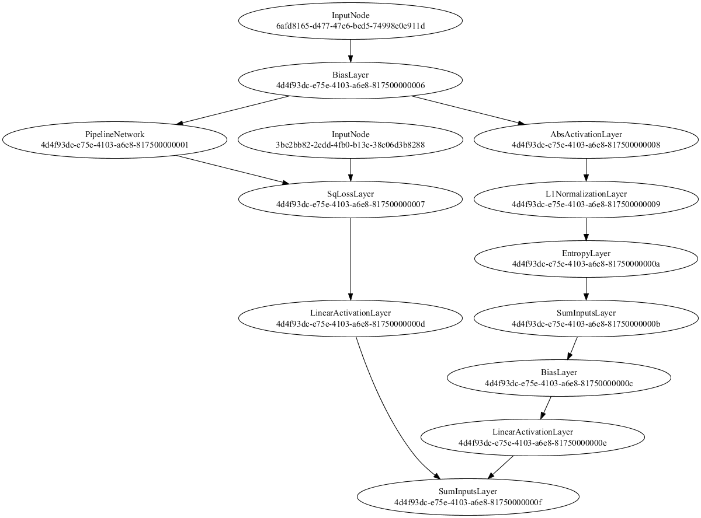

Code from [MindsEyeDemo.scala:358](../../src/test/scala/MindsEyeDemo.scala#L358) executed in 0.12 seconds: 
```java
    def singleConvolution: ConvolutionSynapseLayer = {
      val convolution = new ConvolutionSynapseLayer(Array[Int](3, 3), 9)
      (0 until 3).foreach(ii⇒{
        val i = ii + ii * 3
        convolution.kernel.set(Array[Int](0, 2, i), 0.333)
        convolution.kernel.set(Array[Int](1, 1, i), 0.333)
        convolution.kernel.set(Array[Int](2, 0, i), 0.333)
      })
      convolution.freeze
      convolution
    }
    val net = new DAGNetwork
    net.add(singleConvolution)
    net.add(singleConvolution)
    net.add(singleConvolution)
    net
```

Returns: 

```
    {
      "class": "DAGNetwork",
      "id": "4e6f0ce4-0046-4051-bb40-c84e0000002b",
      "root": {
        "layer": {
          "class": "ConvolutionSynapseLayer",
          "id": "4e6f0ce4-0046-4051-bb40-c84e0000002e",
          "kernel": "[ [ [ 0.0,0.0,0.0,0.0,0.0,0.0,0.0,0.0,0.0 ],[ 0.0,0.0,0.0,0.0,0.0,0.0,0.0,0.0,0.0 ],[ 0.333,0.0,0.0,0.0,0.333,0.0,0.0,0.0,0.333 ] ],[ [ 0.0,0.0,0.0,0.0,0.0,0.0,0.0,0.0,0.0 ],[ 0.333,0.0,0.0,0.0,0.333,0.0,0.0,0.0,0.333 ],[ 0.0,0.0,0.0,0.0,0.0,0.0,0.0,0.0,0.0 ] ],[ [ 0.333,0.0,0.0,0.0,0.333,0.0,0.0,0.0,0.333 ],[ 0.0,0.0,0.0,0.0,0.0,0.0,0.0,0.0,0.0 ],[ 0.0,0.0,0.0,0.0,0.0,0.0,0.0,0.0,0.0 ] ] ]"
        },
        "prev0": {
          "layer": {
            "class": "ConvolutionSynapseLayer",
            "id": "4e6f0ce4-0046-4051-bb40-c84e0000002d",
            "kernel": "[ [ [ 0.0,0.0,0.0,0.0,0.0,0.0,0.0,0.0,0.0 ],[ 0.0,0.0,0.0,0.0,0.0,0.0,0.0,0.0,0.0 ],[ 0.333,0.0,0.0,0.0,0.333,0.0,0.0,0.0,0.333 ] ],[ [ 0.0,0.0,0.0,0.0,0.0,0.0,0.0,0.0,0.0 ],[ 0.333,0.0,0.0,0.0,0.333,0.0,0.0,0.0,0.333 ],[ 0.0,0.0,0.0,0.0,0.0,0.0,0.0,0.0,0.0 ] ],[ [ 0.333,0.0,0.0,0.0,0.333,0.0,0.0,0.0,0.333 ],[ 0.0,0.0,0.0,0.0,0.0,0.0,0.0,0.0,0.0 ],[ 0.0,0.0,0.0,0.0,0.0,0.0,0.0,0.0,0.0 ] ] ]"
          },
          "prev0": {
            "layer": {
              "class": "ConvolutionSynapseLayer",
              "id": "4e6f0ce4-0046-4051-bb40-c84e0000002c",
              "kernel": "[ [ [ 0.0,0.0,0.0,0.0,0.0,0.0,0.0,0.0,0.0 ],[ 0.0,0.0,0.0,0.0,0.0,0.0,0.0,0.0,0.0 ],[ 0.333,0.0,0.0,0.0,0.333,0.0,0.0,0.0,0.333 ] ],[ [ 0.0,0.0,0.0,0.0,0.0,0.0,0.0,0.0,0.0 ],[ 0.333,0.0,0.0,0.0,0.333,0.0,0.0,0.0,0.333 ],[ 0.0,0.0,0.0,0.0,0.0,0.0,0.0,0.0,0.0 ] ],[ [ 0.333,0.0,0.0,0.0,0.333,0.0,0.0,0.0,0.333 ],[ 0.0,0.0,0.0,0.0,0.0,0.0,0.0,0.0,0.0 ],[ 0.0,0.0,0.0,0.0,0.0,0.0,0.0,0.0,0.0 ] ] ]"
            },
            "prev0": {
              "target": "[1e5de440-b15a-46a6-809d-d096955e8e4f, cdb2c85a-fdeb-425a-ab24-0593542c41e7]"
            }
          }
        }
      }
    }
```


Code from [MindsEyeDemo.scala:378](../../src/test/scala/MindsEyeDemo.scala#L378) executed in 0.53 seconds: 
```java
    val read = ImageIO.read(getClass.getResourceAsStream("/monkey1.jpg"))
    def scale(img: BufferedImage, scale: Double) = {
      val w = img.getWidth
      val h = img.getHeight
      val after = new BufferedImage((w * scale).toInt, (h * scale).toInt, BufferedImage.TYPE_INT_ARGB)
      val at = new AffineTransform
      at.scale(scale, scale)
      new AffineTransformOp(at, AffineTransformOp.TYPE_BILINEAR).filter(img, after)
    }
    scale(read, 0.5)
```

Returns: 


Code from [MindsEyeDemo.scala:392](../../src/test/scala/MindsEyeDemo.scala#L392) executed in 1.77 seconds: 
```java
    blurFilter.eval(Array(Array(idealImageTensor))).data.head
```

Returns: 

```
    [ [ [ 91.42886761200002,184.11322048200003,138.251082528 ],[ 93.38594757300001,184.96251933300005,141.53749982100004 ],[ 91.20731139000002,182.93158729800004,141.16823945100003 ],[ 90.24723442800001,182.78388315,141.75905604300002 ],[ 88.62248880000003,183.15314352000001,141.90676019100002 ],[ 86.37000054300002,183.37469974200005,141.574425858 ],[ 84.00673417500002,183.116217483,141.13131341400003 ],[ 84.11751228600001,185.07329744400002,143.01454130100004 ],... ],[ [ 92.42587061100002,185.11022348100005,139.24808552700003 ],[ 90.98575516800001,183.30084766800005,139.61734589700004 ],[ 91.05960724200001,182.96851333500004,140.94668322900003 ],[ 90.35801253900001,183.11621748300004,141.79598208000002 ],[ 88.84404502200002,183.67010803800002,142.09139037600002 ],[ 86.55463072800002,183.67010803800002,141.72213000600001 ],[ 86.148444321,185.11022348100002,143.125319412 ],[ 86.03766621000003,187.06730344200002,145.00854729900004 ],... ],[ [ 90.76419894600002,184.07629444500003,137.955674232 ],[ 91.50271968600002,183.78088614900003,139.912754193 ],[ 91.68734987100001,183.96551633400003,141.79598208000002 ],[ 90.727272909,184.15014651900003,142.46065074600003 ],[ 88.88097105900002,184.26092463000003,142.34987263500003 ],[ 87.77318994900001,185.07329744400002,143.125319412 ],[ 86.88696506100003,186.36570873900004,144.38080467000003 ],[ 84.59755076700002,185.84874422100006,143.82691411500002 ],... ],[ [ 91.35501553800002,184.408628778,138.288008565 ],[ 92.20431438900002,185.07329744400002,141.31594359900004 ],[ 91.50271968600002,185.03637140700002,142.42372470900003 ],[ 90.28416046500001,184.777889148,142.60835489400003 ],[ 88.73326691100002,184.99944537000002,143.08839337500004 ],[ 86.99774317200001,185.70104007300003,143.75306204100002 ],[ 85.48377565500002,185.36870574000005,143.49457978200002 ],[ 83.12050928700002,184.92559329600005,142.68220696800003 ],... ],[ [ 91.87198005600001,185.92259629500003,140.06045834100001 ],[ 91.31808950100002,186.14415251700004,141.72213000600004 ],[ 90.35801253900001,185.22100159200002,142.12831641300002 ],[ 88.844045022,184.92559329600002,142.75605904200003 ],[ 86.37000054300002,185.14714951800005,143.23609752300004 ],[ 85.48377565500002,184.92559329600005,143.162245449 ],[ 83.78517795300002,184.26092463000003,142.276020561 ],[ 82.271210436,184.03936840800003,142.01753830200002 ],... ],[ [ 90.80112498300002,186.84574722000002,140.28201456300002 ],[ 89.73026991000002,185.66411403600003,140.90975719200003 ],[ 88.43785861500001,185.03637140700002,141.94368622800002 ],[ 85.85303602500002,184.88866725900004,142.719133005 ],[ 85.29914547000001,184.96251933300005,143.199171486 ],[ 84.11751228600002,184.11322048200003,142.34987263500003 ],[ 82.71432288000001,183.59625596400002,141.72213000600004 ],[ 81.97580214000001,183.70703407500002,141.463647747 ],... ],[ [ 89.21330539200002,185.88567025800003,139.174233453 ],[ 87.994746171,185.25792762900002,140.46664474800002 ],[ 85.88996206200001,184.99944537000005,141.86983415400002 ],[ 85.44684961800002,185.36870574000002,143.199171486 ],[ 84.56062473000001,184.66711103700004,143.014541301 ],[ 82.64047080600001,183.48547785300002,141.72213000600004 ],[ 82.45584062100001,183.15314352000004,141.168239451 ],[ 82.97280513900002,183.67010803800002,141.64827793200004 ],... ],[ [ 88.216302393,185.51640988800003,138.69419497200002 ],[ 86.81311298700001,185.47948385100003,140.61434889600002 ],[ 86.07459224700001,185.77489214700003,142.49757678300003 ],[ 85.37299754400001,185.51640988800003,143.56843185600002 ],[ 82.64047080600001,183.81781218600003,142.05446433900002 ],[ 82.197358362,182.74695711300004,140.90975719200003 ],[ 83.04665721300002,183.15314352000001,141.279017562 ],[ 83.268213435,183.48547785300002,141.57442585800004 ],... ],... ]
```


Code from [MindsEyeDemo.scala:395](../../src/test/scala/MindsEyeDemo.scala#L395) executed in 0.12 seconds: 
```java
    blurredImage.toRgbImage()
```

Returns: 


Code from [MindsEyeDemo.scala:402](../../src/test/scala/MindsEyeDemo.scala#L402) executed in 0.01 seconds: 
```java
    val dagNetwork = new DAGNetwork
    val bias = new BiasLayer(inputSize: _*)
    val modeledImageNode = dagNetwork.add(bias).getHead
    dagNetwork.add(blurFilter)
    dagNetwork.addLossComponent(new SqLossLayer)
    val imageRMS: DAGNode = dagNetwork.add(new VerboseWrapper("rms", new BiasLayer().freeze)).getHead
    dagNetwork.add(new AbsActivationLayer, modeledImageNode)
    dagNetwork.add(new L1NormalizationLayer)
    dagNetwork.add(new EntropyLayer)
    dagNetwork.add(new SumInputsLayer)
    val image_entropy: DAGNode = dagNetwork.add(new VerboseWrapper("entropy", new BiasLayer().freeze)).getHead
    val scaledRms: DAGNode = dagNetwork.add(new LinearActivationLayer().setWeight(1.0).freeze, imageRMS).getHead
    val scaledEntropy: DAGNode = dagNetwork.add(new LinearActivationLayer().setWeight(0.001).freeze, image_entropy).getHead
    dagNetwork.add(new VerboseWrapper("product", new SumInputsLayer), scaledRms, scaledEntropy)
    (bias, dagNetwork)
```

Returns: 

```
    ({
      "class": "BiasLayer",
      "id": "4e6f0ce4-0046-4051-bb40-c84e00000030",
      "bias": "[0.0, 0.0, 0.0, 0.0, 0.0, 0.0, 0.0, 0.0, 0.0, 0.0, 0.0, 0.0, 0.0, 0.0, 0.0, 0.0, 0.0, 0.0, 0.0, 0.0, 0.0, 0.0, 0.0, 0.0, 0.0, 0.0, 0.0, 0.0, 0.0, 0.0, 0.0, 0.0, 0.0, 0.0, 0.0, 0.0, 0.0, 0.0, 0.0, 0.0, 0.0, 0.0, 0.0, 0.0, 0.0, 0.0, 0.0, 0.0, 0.0, 0.0, 0.0, 0.0, 0.0, 0.0, 0.0, 0.0, 0.0, 0.0, 0.0, 0.0, 0.0, 0.0, 0.0, 0.0, 0.0, 0.0, 0.0, 0.0, 0.0, 0.0, 0.0, 0.0, 0.0, 0.0, 0.0, 0.0, 0.0, 0.0, 0.0, 0.0, 0.0, 0.0, 0.0, 0.0, 0.0, 0.0, 0.0, 0.0, 0.0, 0.0, 0.0, 0.0, 0.0, 0.0, 0.0, 0.0, 0.0, 0.0, 0.0, 0.0, 0.0, 0.0, 0.0, 0.0, 0.0, 0.0, 0.0, 0.0, 0.0, 0.0, 0.0, 0.0, 0.0, 0.0, 0.0, 0.0, 0.0, 0.0, 0.0, 0.0, 0.0, 0.0, 0.0, 0.0, 0.0, 0.0, 0.0, 0.0, 0.0, 0.0, 0.0, 0.0, 0.0, 0.0, 0.0, 0.0, 0.0, 0.0, 0.0, 0.0, 0.0, 0.0, 0.0, 0.0, 0.0, 0.0, 0.0, 0.0, 0.0, 0.0, 0.0, 0.0, 0.0, 0.0, 0.0, 0.0, 0.0, 0.0, 0.0, 0.0, 0.0, 0.0, 0.0, 0.0, 0.0, 0.0, 0.0, 0.0, 0.0, 0.0, 0.0, 0.0, 0.0, 0.0, 0.0, 0.0, 0.0, 0.0, 0.0, 0.0, 0.0, 0.0, 0.0, 0.0, 0.0, 0.0, 0.0, 0.0, 0.0, 0.0, 0.0, 0.0, 0.0, 0.0, 0.0, 0.0, 0.0, 0.0, 0.0, 0.0, 0.0, 0.0, 0.0, 0.0, 0.0, 0.0, 0.0, 0.0, 0.0, 0.0, 0.0, 0.0, 0.0, 0.0, 0.0, 0.0, 0.0, 0.0, 0.0, 0.0, 0.0, 0.0, 0.0, 0.0, 0.0, 0.0, 0.0, 0.0, 0.0, 0.0, 0.0, 0.0, 0.0, 0.0, 0.0, 0.0, 0.0, 0.0, 0.0, 0.0, 0.0, 0.0, 0.0, 0.0, 0.0, 0.0, 0.0, 0.0, 0.0, 0.0, 0.0, 0.0, 0.0, 0.0, 0.0, 0.0, 0.0, 0.0, 0.0, 0.0, 0.0, 0.0, 0.0, 0.0, 0.0, 0.0, 0.0, 0.0, 0.0, 0.0, 0.0, 0.0, 0.0, 0.0, 0.0, 0.0, 0.0, 0.0, 0.0, 0.0, 0.0, 0.0, 0.0, 0.0, 0.0, 0.0, 0.0, 0.0, 0.0, 0.0, 0.0, 0.0, 0.0, 0.0, 0.0, 0.0, 0.0, 0.0, 0.0, 0.0, 0.0, 0.0, 0.0, 0.0, 0.0, 0.0, 0.0, 0.0, 0.0, 0.0, 0.0, 0.0, 0.0, 0.0, 0.0, 0.0, 0.0, 0.0, 0.0, 0.0, 0.0, 0.0, 0.0, 0.0, 0.0, 0.0, 0.0, 0.0, 0.0, 0.0, 0.0, 0.0, 0.0, 0.0, 0.0, 0.0, 0.0, 0.0, 0.0, 0.0, 0.0, 0.0, 0.0, 0.0, 0.0, 0.0, 0.0, 0.0, 0.0, 0.0, 0.0, 0.0, 0.0, 0.0, 0.0, 0.0, 0.0, 0.0, 0.0, 0.0, 0.0, 0.0, 0.0, 0.0, 0.0, 0.0, 0.0, 0.0, 0.0, 0.0, 0.0, 0.0, 0.0, 0.0, 0.0, 0.0, 0.0, 0.0, 0.0, 0.0, 0.0, 0.0, 0.0, 0.0, 0.0, 0.0, 0.0, 0.0, 0.0, 0.0, 0.0, 0.0, 0.0, 0.0, 0.0, 0.0, 0.0, 0.0, 0.0, 0.0, 0.0, 0.0, 0.0, 0.0, 0.0, 0.0, 0.0, 0.0, 0.0, 0.0, 0.0, 0.0, 0.0, 0.0, 0.0, 0.0, 0.0, 0.0, 0.0, 0.0, 0.0, 0.0, 0.0, 0.0, 0.0, 0.0, 0.0, 0.0, 0.0, 0.0, 0.0, 0.0, 0.0, 0.0, 0.0, 0.0, 0.0, 0.0, 0.0, 0.0, 0.0, 0.0, 0.0, 0.0, 0.0, 0.0, 0.0, 0.0, 0.0, 0.0, 0.0, 0.0, 0.0, 0.0, 0.0, 0.0, 0.0, 0.0, 0.0, 0.0, 0.0, 0.0, 0.0, 0.0, 0.0, 0.0, 0.0, 0.0, 0.0, 0.0, 0.0, 0.0, 0.0, 0.0, 0.0, 0.0, 0.0, 0.0, 0.0, 0.0, 0.0, 0.0, 0.0, 0.0, 0.0, 0.0, 0.0, 0.0, 0.0, 0.0, 0.0, 0.0, 0.0, 0.0, 0.0, 0.0, 0.0, 0.0, 0.0, 0.0, 0.0, 0.0, 0.0, 0.0, 0.0, 0.0, 0.0, 0.0, 0.0, 0.0, 0.0, 0.0, 0.0, 0.0, 0.0, 0.0, 0.0, 0.0, 0.0, 0.0, 0.0, 0.0, 0.0, 0.0, 0.0, 0.0, 0.0, 0.0, 0.0, 0.0, 0.0, 0.0, 0.0, 0.0, 0.0, 0.0, 0.0, 0.0, 0.0, 0.0, 0.0, 0.0, 0.0, 0.0, 0.0, 0.0, 0.0, 0.0, 0.0, 0.0, 0.0, 0.0, 0.0, 0.0, 0.0, 0.0, 0.0, 0.0, 0.0, 0.0, 0.0, 0.0, 0.0, 0.0, 0.0, 0.0, 0.0, 0.0, 0.0, 0.0, 0.0, 0.0, 0.0, 0.0, 0.0, 0.0, 0.0, 0.0, 0.0, 0.0, 0.0, 0.0, 0.0, 0.0, 0.0, 0.0, 0.0, 0.0, 0.0, 0.0, 0.0, 0.0, 0.0, 0.0, 0.0, 0.0, 0.0, 0.0, 0.0, 0.0, 0.0, 0.0, 0.0, 0.0, 0.0, 0.0, 0.0, 0.0, 0.0, 0.0, 0.0, 0.0, 0.0, 0.0, 0.0, 0.0, 0.0, 0.0, 0.0, 0.0, 0.0, 0.0, 0.0, 0.0, 0.0, 0.0, 0.0, 0.0, 0.0, 0.0, 0.0, 0.0, 0.0, 0.0, 0.0, 0.0, 0.0, 0.0, 0.0, 0.0, 0.0, 0.0, 0.0, 0.0, 0.0, 0.0, 0.0, 0.0, 0.0, 0.0, 0.0, 0.0, 0.0, 0.0, 0.0, 0.0, 0.0, 0.0, 0.0, 0.0, 0.0, 0.0, 0.0, 0.0, 0.0, 0.0, 0.0, 0.0, 0.0, 0.0, 0.0, 0.0, 0.0, 0.0, 0.0, 0.0, 0.0, 0.0, 0.0, 0.0, 0.0, 0.0, 0.0, 0.0, 0.0, 0.0, 0.0, 0.0, 0.0, 0.0, 0.0, 0.0, 0.0, 0.0, 0.0, 0.0, 0.0, 0.0, 0.0, 0.0, 0.0, 0.0, 0.0, 0.0, 0.0, 0.0, 0.0, 0.0, 0.0, 0.0, 0.0, 0.0, 0.0, 0.0, 0.0, 0.0, 0.0, 0.0, 0.0, 0.0, 0.0, 0.0, 0.0, 0.0, 0.0, 0.0, 0.0, 0.0, 0.0, 0.0, 0.0, 0.0, 0.0, 0.0, 0.0, 0.0, 0.0, 0.0, 0.0, 0.0, 0.0, 0.0, 0.0, 0.0, 0.0, 0.0, 0.0, 0.0, 0.0, 0.0, 0.0, 0.0, 0.0, 0.0, 0.0, 0.0, 0.0, 0.0, 0.0, 0.0, 0.0, 0.0, 0.0, 0.0, 0.0, 0.0, 0.0, 0.0, 0.0, 0.0, 0.0, 0.0, 0.0, 0.0, 0.0, 0.0, 0.0, 0.0, 0.0, 0.0, 0.0, 0.0, 0.0, 0.0, 0.0, 0.0, 0.0, 0.0, 0.0, 0.0, 0.0, 0.0, 0.0, 0.0, 0.0, 0.0, 0.0, 0.0, 0.0, 0.0, 0.0, 0.0, 0.0, 0.0, 0.0, 0.0, 0.0, 0.0, 0.0, 0.0, 0.0, 0.0, 0.0, 0.0, 0.0, 0.0, 0.0, 0.0, 0.0, 0.0, 0.0, 0.0, 0.0, 0.0, 0.0, 0.0, 0.0, 0.0, 0.0, 0.0, 0.0, 0.0, 0.0, 0.0, 0.0, 0.0, 0.0, 0.0, 0.0, 0.0, 0.0, 0.0, 0.0, 0.0, 0.0, 0.0, 0.0, 0.0, 0.0, 0.0, 0.0, 0.0, 0.0, 0.0, 0.0, 0.0, 0.0, 0.0, 0.0, 0.0, 0.0, 0.0, 0.0, 0.0, 0.0, 0.0, 0.0, 0.0, 0.0, 0.0, 0.0, 0.0, 0.0, 0.0, 0.0, 0.0, 0.0, 0.0, 0.0, 0.0, 0.0, 0.0, 0.0, 0.0, 0.0, 0.0, 0.0, 0.0, 0.0, 0.0, 0.0, 0.0, 0.0, 0.0, 0.0, 0.0, 0.0, 0.0, 0.0, 0.0, 0.0, 0.0, 0.0, 0.0, 0.0, 0.0, 0.0, 0.0, 0.0, 0.0, 0.0, 0.0, 0.0, 0.0, 0.0, 0.0, 0.0, 0.0, 0.0, 0.0, 0.0, 0.0, 0.0, 0.0, 0.0, 0.0, 0.0, 0.0, 0.0, 0.0, 0.0, 0.0, 0.0, 0.0, 0.0, 0.0, 0.0, 0.0, 0.0, 0.0, 0.0, 0.0, 0.0, 0.0, 0.0, 0.0, 0.0, 0.0, 0.0, 0.0, 0.0, 0.0, 0.0, 0.0, 0.0, 0.0, 0.0, 0.0, 0.0, 0.0, 0.0, 0.0, 0.0, 0.0, 0.0, 0.0, 0.0, 0.0, 0.0, 0.0, 0.0, 0.0, 0.0, 0.0, 0.0, 0.0, 0.0, 0.0, 0.0, 0.0, 0.0, 0.0, 0.0, 0.0, 0.0, 0.0, 0.0, 0.0, 0.0, 0.0, 0.0, 0.0, 0.0, 0.0, 0.0, 0.0, 0.0, 0.0, 0.0, 0.0, 0.0, 0.0, 0.0, 0.0, 0.0, 0.0, 0.0, 0.0, 0.0, 0.0, 0.0, 0.0, 0.0, 0.0, 0.0, 0.0, 0.0, 0.0, 0.0, 0.0, 0.0, 0.0, 0.0, 0.0, 0.0, 0.0, 0.0, 0.0, 0.0, 0.0, 0.0, 0.0, 0.0, 0.0, 0.0, 0.0, 0.0, 0.0, 0.0, 0.0, 0.0, 0.0, 0.0, 0.0, 0.0, 0.0, 0.0, 0.0, 0.0, 0.0, 0.0, 0.0, 0.0, 0.0, 0.0, 0.0, 0.0, 0.0, 0.0, 0.0, 0.0, 0.0, 0.0, 0.0, 0.0, 0.0, 0.0, 0.0, 0.0, 0.0, 0.0, 0.0, 0.0, 0.0, 0.0, 0.0, 0.0, 0.0, 0.0, 0.0, 0.0, 0.0, 0.0, 0.0, 0.0, 0.0, 0.0, 0.0, 0.0, 0.0, 0.0, 0.0, 0.0, 0.0, 0.0, 0.0, 0.0, 0.0, 0.0, 0.0, 0.0, 0.0, 0.0, 0.0, 0.0, 0.0, 0.0, 0.0, 0.0, 0.0, 0.0, 0.0, 0.0, 0.0, 0.0, 0.0, 0.0, 0.0, 0.0, 0.0, 0.0, 0.0, 0.0, 0.0, 0.0, 0.0, 0.0, 0.0, 0.0, 0.0, 0.0, 0.0, 0.0, 0.0, 0.0, 0.0, 0.0, 0.0, 0.0, 0.0, 0.0, 0.0, 0.0, 0.0, 0.0, 0.0, 0.0, 0.0, 0.0, 0.0, 0.0, 0.0, 0.0, 0.0, 0.0, 0.0, 0.0, 0.0, 0.0, 0.0, 0.0, 0.0, 0.0, 0.0, 0.0, 0.0, 0.0, 0.0, 0.0, 0.0, 0.0, 0.0, 0.0, 0.0, 0.0, 0.0, 0.0, 0.0, 0.0, 0.0, 0.0, 0.0, 0.0, 0.0, 0.0, 0.0, 0.0, 0.0, 0.0, 0.0, 0.0, 0.0, 0.0, 0.0, 0.0, 0.0, 0.0, 0.0, 0.0, 0.0, 0.0, 0.0, 0.0, 0.0, 0.0, 0.0, 0.0, 0.0, 0.0, 0.0, 0.0, 0.0, 0.0, 0.0, 0.0, 0.0, 0.0, 0.0, 0.0, 0.0, 0.0, 0.0, 0.0, 0.0, 0.0, 0.0, 0.0, 0.0, 0.0, 0.0, 0.0, 0.0, 0.0, 0.0, 0.0, 0.0, 0.0, 0.0, 0.0, 0.0, 0.0, 0.0, 0.0, 0.0, 0.0, 0.0, 0.0, 0.0, 0.0, 0.0, 0.0, 0.0, 0.0, 0.0, 0.0, 0.0, 0.0, 0.0, 0.0, 0.0, 0.0, 0.0, 0.0, 0.0, 0.0, 0.0, 0.0, 0.0, 0.0, 0.0, 0.0, 0.0, 0.0, 0.0, 0.0, 0.0, 0.0, 0.0, 0.0, 0.0, 0.0, 0.0, 0.0, 0.0, 0.0, 0.0, 0.0, 0.0, 0.0, 0.0, 0.0, 0.0, 0.0, 0.0, 0.0, 0.0, 0.0, 0.0, 0.0, 0.0, 0.0, 0.0, 0.0, 0.0, 0.0, 0.0, 0.0, 0.0, 0.0, 0.0, 0.0, 0.0, 0.0, 0.0, 0.0, 0.0, 0.0, 0.0, 0.0, 0.0, 0.0, 0.0, 0.0, 0.0, 0.0, 0.0, 0.0, 0.0, 0.0, 0.0, 0.0, 0.0, 0.0, 0.0, 0.0, 0.0, 0.0, 0.0, 0.0, 0.0, 0.0, 0.0, 0.0, 0.0, 0.0, 0.0, 0.0, 0.0, 0.0, 0.0, 0.0, 0.0, 0.0, 0.0, 0.0, 0.0, 0.0, 0.0, 0.0, 0.0, 0.0, 0.0, 0.0, 0.0, 0.0, 0.0, 0.0, 0.0, 0.0, 0.0, 0.0, 0.0, 0.0, 0.0, 0.0, 0.0, 0.0, 0.0, 0.0, 0.0, 0.0, 0.0, 0.0, 0.0, 0.0, 0.0, 0.0, 0.0, 0.0, 0.0, 0.0, 0.0, 0.0, 0.0, 0.0, 0.0, 0.0, 0.0, 0.0, 0.0, 0.0, 0.0, 0.0, 0.0, 0.0, 0.0, 0.0, 0.0, 0.0, 0.0, 0.0, 0.0, 0.0, 0.0, 0.0, 0.0, 0.0, 0.0, 0.0, 0.0, 0.0, 0.0, 0.0, 0.0, 0.0, 0.0, 0.0, 0.0, 0.0, 0.0, 0.0, 0.0, 0.0, 0.0, 0.0, 0.0, 0.0, 0.0, 0.0, 0.0, 0.0, 0.0, 0.0, 0.0, 0.0, 0.0, 0.0, 0.0, 0.0, 0.0, 0.0, 0.0, 0.0, 0.0, 0.0, 0.0, 0.0, 0.0, 0.0, 0.0, 0.0, 0.0, 0.0, 0.0, 0.0, 0.0, 0.0, 0.0, 0.0, 0.0, 0.0, 0.0, 0.0, 0.0, 0.0, 0.0, 0.0, 0.0, 0.0, 0.0, 0.0, 0.0, 0.0, 0.0, 0.0, 0.0, 0.0, 0.0, 0.0, 0.0, 0.0, 0.0, 0.0, 0.0, 0.0, 0.0, 0.0, 0.0, 0.0, 0.0, 0.0, 0.0, 0.0, 0.0, 0.0, 0.0, 0.0, 0.0, 0.0, 0.0, 0.0, 0.0, 0.0, 0.0, 0.0, 0.0, 0.0, 0.0, 0.0, 0.0, 0.0, 0.0, 0.0, 0.0, 0.0, 0.0, 0.0, 0.0, 0.0, 0.0, 0.0, 0.0, 0.0, 0.0, 0.0, 0.0, 0.0, 0.0, 0.0, 0.0, 0.0, 0.0, 0.0, 0.0, 0.0, 0.0, 0.0, 0.0, 0.0, 0.0, 0.0, 0.0, 0.0, 0.0, 0.0, 0.0, 0.0, 0.0, 0.0, 0.0, 0.0, 0.0, 0.0, 0.0, 0.0, 0.0, 0.0, 0.0, 0.0, 0.0, 0.0, 0.0, 0.0, 0.0, 0.0, 0.0, 0.0, 0.0, 0.0, 0.0, 0.0, 0.0, 0.0, 0.0, 0.0, 0.0, 0.0, 0.0, 0.0, 0.0, 0.0, 0.0, 0.0, 0.0, 0.0, 0.0, 0.0, 0.0, 0.0, 0.0, 0.0, 0.0, 0.0, 0.0, 0.0, 0.0, 0.0, 0.0, 0.0, 0.0, 0.0, 0.0, 0.0, 0.0, 0.0, 0.0, 0.0, 0.0, 0.0... and 4675472 more bytes
```


Code from [MindsEyeDemo.scala:420](../../src/test/scala/MindsEyeDemo.scala#L420) executed in 64.10 seconds: 
```java
    val trainer = {
      val gradientTrainer: LbfgsTrainer = new LbfgsTrainer
      gradientTrainer.setNet(dagNetwork)
      gradientTrainer.setData(Seq(Array(zeroInput, blurredImage)).toArray)
      new IterativeTrainer(gradientTrainer)
    }
    bias.addWeights(new DoubleSupplier {
      override def getAsDouble: Double = Util.R.get.nextGaussian * 1e-5
    })
    val trainingContext = new TrainingContext
    trainingContext.terminalErr = 0.05
    trainer.step(trainingContext)
    val finalError = trainer.step(trainingContext).finalError
    System.out.println(s"Final Error = $finalError")
    dagNetwork
```
Logging: 
```
    Final Error = 4041.2306817897615
    
```

Returns: 

```
    {
      "class": "DAGNetwork",
      "id": "4e6f0ce4-0046-4051-bb40-c84e0000002f",
      "root": {
        "layer": {
          "class": "VerboseWrapper",
          "id": "4e6f0ce4-0046-4051-bb40-c84e0000003d"
        },
        "prev0": {
          "layer": {
            "class": "LinearActivationLayer",
            "id": "4e6f0ce4-0046-4051-bb40-c84e0000003a",
            "weights": "[ 1.0 ]"
          },
          "prev0": {
            "layer": {
              "class": "VerboseWrapper",
              "id": "4e6f0ce4-0046-4051-bb40-c84e00000033"
            },
            "prev0": {
              "layer": {
                "class": "SqLossLayer",
                "id": "4e6f0ce4-0046-4051-bb40-c84e00000031"
              },
              "prev0": {
                "layer": {
                  "class": "DAGNetwork",
                  "id": "4e6f0ce4-0046-4051-bb40-c84e0000002b",
                  "root": {
                    "layer": {
                      "class": "ConvolutionSynapseLayer",
                      "id": "4e6f0ce4-0046-4051-bb40-c84e0000002e",
                      "kernel": "[ [ [ 0.0,0.0,0.0,0.0,0.0,0.0,0.0,0.0,0.0 ],[ 0.0,0.0,0.0,0.0,0.0,0.0,0.0,0.0,0.0 ],[ 0.333,0.0,0.0,0.0,0.333,0.0,0.0,0.0,0.333 ] ],[ [ 0.0,0.0,0.0,0.0,0.0,0.0,0.0,0.0,0.0 ],[ 0.333,0.0,0.0,0.0,0.333,0.0,0.0,0.0,0.333 ],[ 0.0,0.0,0.0,0.0,0.0,0.0,0.0,0.0,0.0 ] ],[ [ 0.333,0.0,0.0,0.0,0.333,0.0,0.0,0.0,0.333 ],[ 0.0,0.0,0.0,0.0,0.0,0.0,0.0,0.0,0.0 ],[ 0.0,0.0,0.0,0.0,0.0,0.0,0.0,0.0,0.0 ] ] ]"
                    },
                    "prev0": {
                      "layer": {
                        "class": "ConvolutionSynapseLayer",
                        "id": "4e6f0ce4-0046-4051-bb40-c84e0000002d",
                        "kernel": "[ [ [ 0.0,0.0,0.0,0.0,0.0,0.0,0.0,0.0,0.0 ],[ 0.0,0.0,0.0,0.0,0.0,0.0,0.0,0.0,0.0 ],[ 0.333,0.0,0.0,0.0,0.333,0.0,0.0,0.0,0.333 ] ],[ [ 0.0,0.0,0.0,0.0,0.0,0.0,0.0,0.0,0.0 ],[ 0.333,0.0,0.0,0.0,0.333,0.0,0.0,0.0,0.333 ],[ 0.0,0.0,0.0,0.0,0.0,0.0,0.0,0.0,0.0 ] ],[ [ 0.333,0.0,0.0,0.0,0.333,0.0,0.0,0.0,0.333 ],[ 0.0,0.0,0.0,0.0,0.0,0.0,0.0,0.0,0.0 ],[ 0.0,0.0,0.0,0.0,0.0,0.0,0.0,0.0,0.0 ] ] ]"
                      },
                      "prev0": {
                        "layer": {
                          "class": "ConvolutionSynapseLayer",
                          "id": "4e6f0ce4-0046-4051-bb40-c84e0000002c",
                          "kernel": "[ [ [ 0.0,0.0,0.0,0.0,0.0,0.0,0.0,0.0,0.0 ],[ 0.0,0.0,0.0,0.0,0.0,0.0,0.0,0.0,0.0 ],[ 0.333,0.0,0.0,0.0,0.333,0.0,0.0,0.0,0.333 ] ],[ [ 0.0,0.0,0.0,0.0,0.0,0.0,0.0,0.0,0.0 ],[ 0.333,0.0,0.0,0.0,0.333,0.0,0.0,0.0,0.333 ],[ 0.0,0.0,0.0,0.0,0.0,0.0,0.0,0.0,0.0 ] ],[ [ 0.333,0.0,0.0,0.0,0.333,0.0,0.0,0.0,0.333 ],[ 0.0,0.0,0.0,0.0,0.0,0.0,0.0,0.0,0.0 ],[ 0.0,0.0,0.0,0.0,0.0,0.0,0.0,0.0,0.0 ] ] ]"
                        },
                        "prev0": {
                          "target": "[1e5de440-b15a-46a6-809d-d096955e8e4f, cdb2c85a-fdeb-425a-ab24-0593542c41e7]"
                        }
                      }
                    }
                  }
                },
                "prev0": {
                  "layer": {
                    "class": "BiasLayer",
                    "id": "4e6f0ce4-0046-4051-bb40-c84e00000030",
                    "bias": "[0.4448805004359524, -0.19702313159981305, -0.22494733891716415, 0.13787681979739452, 0.18367084856936244, 0.3984480967131692, 13.978513280224362, 5.638313332545356, 5.4904196772237075, 8.703674777284208, 9.886365510083637, 9.683621265392965, 8.40698681059263, 8.872786266611373, 8.538093299287755, 8.75306100707039, 7.8305495313047375, 9.762396412189336, 9.461857080057024, 8.903365268393653, 9.068973870479606, 9.213422551289575, 8.643224416766204, 9.476433850289254, 8.860090552898125, 8.504538554783675, 8.518469522946242, 8.770747972544966, 8.73033744314816, 8.961803390229143, 8.045467312909745, 8.398920131134073, 8.359469490313355, 8.396757411448323, 8.740099280051657, 7.59713693534464, 8.326894635748552, 8.082482322338013, 8.397719161850535, 7.699370761435134, 7.790810166635365, 7.926930007142273, 8.023398315345316, 7.608879220380423, 7.166275121982867, 7.723181244996519, 7.893733937447515, 8.548466511736422, 8.217818021893319, 7.9560599946150194, 8.275284549629841, 8.372500955238511, 8.563606342748379, 8.09534343455907, 8.17276122238236, 8.099926382231882, 8.416245714529452, 8.441410436285453, 8.352457129767938, 7.942688845677277, 8.387926749567752, 8.275883522631275, 8.648790425721343, 8.542883358014855, 8.329528766621785, 8.870956457500917, 8.130230209420233, 8.864595512883517, 8.017330456489498, 8.358952609755601, 8.918576232532548, 8.765410414554418, 8.107586746602822, 9.02279660473872, 8.49733623987489, 8.73537848932774, 8.006013461424992, 9.10097815077582, 8.394632211825119, 8.731845774024123, 8.734365924194881, 8.26450475326663, 8.714434279368593, 8.591773781063587, 8.556902218420737, 8.543104877658823, 8.165262087112387, 8.118643068242031, 8.223779636797786, 7.758172799697648, 8.105265515202252, 8.49961466319696, 8.046952674926157, 8.537035239512232, 8.27014041311539, 8.545691809778944, 8.542013163057732, 8.34045164084236, 8.742094368865141, 9.517512715818215, 8.457163473034775, 9.439304103067196, 8.738869618777748, 9.171443404431027, 8.776336789405004, 8.821587201318636, 8.443348641313367, 8.30202531993195, 9.066343586552758, 8.590590632189391, 9.053970981363332, 8.668509800273853, 8.454046342067878, 8.086767548111037, 8.28466425221875, 8.900051726750561, 9.001907375003352, 8.831660434527986, 8.047574535994823, 8.91251000734079, 8.306764514998754, 8.439486021343079, 8.803115247293828, 8.682162650568172, 8.855804010327628, 8.736118834308673, 8.185318236937553, 8.476154188607612, 8.624706575206847, 8.69819899765314, 8.189716181061845, 8.45215591014373, 8.081927893014102, 8.041899832223478, 8.406625862278428, 9.085646005737201, 9.200461163241474, 8.470050054655747, 8.417351054009755, 8.497983842652605, 8.336309132858426, 8.652671822726171, 7.845615907904325, 7.915047191017658, 8.089111155500316, 8.195688109666573, 8.386806852918411, 7.977184392788281, 8.012541945539578, 7.461419890370272, 7.872459704321661, 7.409878352742538, 7.768803440992441, 7.7265608344663, 7.664312976839225, 7.4241424909392055, 7.305658467191268, 7.074669153043757, 6.720601658524326, 7.1563318277326875, 7.225614043699704, 8.145821402101012, 7.819812813997036, 8.003186818208071, 7.60116980553416, 7.806193814904066, 6.812639109669128, 7.27673134684977, 7.823928481421405, 6.810409372958251, 7.954635070721249, 7.211701335527018, 7.439611744822781, 7.2974005906237505, 8.076079652250282, 7.312820967465932, 7.234148102427732, 8.052005869388895, 8.121487635371631, 7.755039881730668, 8.256661874974132, 7.686319937735046, 8.036917405738434, 8.05765810995107, 8.633017099967393, 8.021019615911841, 8.243697582655331, 8.82208307020053, 8.544936234453253, 8.460351146385143, 9.199685087794647, 8.311593411913748, 8.83662527331156, 8.784468044452083, 9.086303486812668, 8.857706388910795, 8.342454671949266, 8.724331324120625, 8.78591295604258, 9.159182294580779, 8.816143337292916, 8.891781928199904, 8.717733571253978, 7.899099195191306, 7.8231820725727275, 8.91154996131841, 8.029768777822085, 8.519473600962364, 8.684023632979295, 9.11149407287159, 8.647887096094903, 8.460011335921752, 7.804089992028812, 7.730217280608775, 7.822373186609657, 8.192849431842808, 8.231796205988967, 8.817057567035404, 9.332066527367957, 8.725546947340607, 8.439689832709952, 7.8303780582340945, 7.777415914359378, 8.802956738713537, 9.295328944013097, 8.560002710460253, 9.737564095169589, 9.175094264589553, 8.829028425614354, 9.185687996394517, 8.999002337937736, 8.761345998595019, 8.620805137696376, 8.581961557354937, 8.017169115196548, 8.737227867284172, 8.52813614293288, 8.156776416492818, 8.230734160589616, 8.467180377223954, 7.874310002687371, 8.106977080682704, 8.23978496950538, 7.780213435106949, 7.838739381069524, 8.201035616687907, 7.096137611999306, 8.286773840601523, 8.299122711681807, 8.39165738408904, 8.295130335167638, 8.035315576950566, 7.015314329167577, 7.219456765215127, 7.3243889440672465, 7.2373017029288755, 7.205824909783095, 8.02874467786498, 6.9372... and 8997270 more bytes
```


Code from [MindsEyeDemo.scala:438](../../src/test/scala/MindsEyeDemo.scala#L438) executed in 0.04 seconds: 
```java
    dagNetwork.getChild(bias.getId).asInstanceOf[BiasLayer].eval(zeroInput).data(0).toRgbImage()
```

Returns: 




