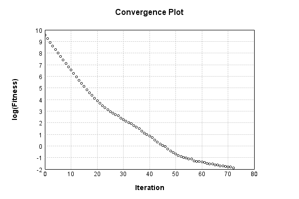

First we define a forward filter, in this case a simple convolution filter emulating motion blur

Code from [MindsEyeDemo.scala:351](../../src/test/scala/MindsEyeDemo.scala#L351) executed in 0.51 seconds: 
```java
    def singleConvolution: ConvolutionSynapseLayer = {
      val convolution = new ConvolutionSynapseLayer(Array[Int](3, 3), 9)
      (0 until 3).foreach(ii⇒{
        val i = ii + ii * 3
        convolution.filter.set(Array[Int](0, 2, i), 0.333)
        convolution.filter.set(Array[Int](1, 1, i), 0.333)
        convolution.filter.set(Array[Int](2, 0, i), 0.333)
      })
      convolution.freeze
      convolution
    }
    val net = new PipelineNetwork
    net.add(singleConvolution)
    net.add(singleConvolution)
    net.add(singleConvolution)
    net
```

Returns: 

```
    {
      "class": "PipelineNetwork",
      "id": "4d4f93dc-e75e-4103-a6e8-817500000001",
      "nodes": [
        {
          "id": {
            "class": "ConvolutionSynapseLayer",
            "id": "4d4f93dc-e75e-4103-a6e8-817500000002",
            "filter": "[ [ [ 0.0,0.0,0.0,0.0,0.0,0.0,0.0,0.0,0.0 ],[ 0.0,0.0,0.0,0.0,0.0,0.0,0.0,0.0,0.0 ],[ 0.333,0.0,0.0,0.0,0.333,0.0,0.0,0.0,0.333 ] ],[ [ 0.0,0.0,0.0,0.0,0.0,0.0,0.0,0.0,0.0 ],[ 0.333,0.0,0.0,0.0,0.333,0.0,0.0,0.0,0.333 ],[ 0.0,0.0,0.0,0.0,0.0,0.0,0.0,0.0,0.0 ] ],[ [ 0.333,0.0,0.0,0.0,0.333,0.0,0.0,0.0,0.333 ],[ 0.0,0.0,0.0,0.0,0.0,0.0,0.0,0.0,0.0 ],[ 0.0,0.0,0.0,0.0,0.0,0.0,0.0,0.0,0.0 ] ] ]"
          },
          "prev0": {
            "target": "[23cc8118-f3a2-4c7a-8904-a73f9cf69e2a]"
          }
        },
        {
          "id": {
            "class": "ConvolutionSynapseLayer",
            "id": "4d4f93dc-e75e-4103-a6e8-817500000003",
            "filter": "[ [ [ 0.0,0.0,0.0,0.0,0.0,0.0,0.0,0.0,0.0 ],[ 0.0,0.0,0.0,0.0,0.0,0.0,0.0,0.0,0.0 ],[ 0.333,0.0,0.0,0.0,0.333,0.0,0.0,0.0,0.333 ] ],[ [ 0.0,0.0,0.0,0.0,0.0,0.0,0.0,0.0,0.0 ],[ 0.333,0.0,0.0,0.0,0.333,0.0,0.0,0.0,0.333 ],[ 0.0,0.0,0.0,0.0,0.0,0.0,0.0,0.0,0.0 ] ],[ [ 0.333,0.0,0.0,0.0,0.333,0.0,0.0,0.0,0.333 ],[ 0.0,0.0,0.0,0.0,0.0,0.0,0.0,0.0,0.0 ],[ 0.0,0.0,0.0,0.0,0.0,0.0,0.0,0.0,0.0 ] ] ]"
          },
          "prev0": {
            "id": {
              "class": "ConvolutionSynapseLayer",
              "id": "4d4f93dc-e75e-4103-a6e8-817500000002",
              "filter": "[ [ [ 0.0,0.0,0.0,0.0,0.0,0.0,0.0,0.0,0.0 ],[ 0.0,0.0,0.0,0.0,0.0,0.0,0.0,0.0,0.0 ],[ 0.333,0.0,0.0,0.0,0.333,0.0,0.0,0.0,0.333 ] ],[ [ 0.0,0.0,0.0,0.0,0.0,0.0,0.0,0.0,0.0 ],[ 0.333,0.0,0.0,0.0,0.333,0.0,0.0,0.0,0.333 ],[ 0.0,0.0,0.0,0.0,0.0,0.0,0.0,0.0,0.0 ] ],[ [ 0.333,0.0,0.0,0.0,0.333,0.0,0.0,0.0,0.333 ],[ 0.0,0.0,0.0,0.0,0.0,0.0,0.0,0.0,0.0 ],[ 0.0,0.0,0.0,0.0,0.0,0.0,0.0,0.0,0.0 ] ] ]"
            },
            "prev0": {
              "target": "[23cc8118-f3a2-4c7a-8904-a73f9cf69e2a]"
            }
          }
        },
        {
          "id": {
            "class": "ConvolutionSynapseLayer",
            "id": "4d4f93dc-e75e-4103-a6e8-817500000004",
            "filter": "[ [ [ 0.0,0.0,0.0,0.0,0.0,0.0,0.0,0.0,0.0 ],[ 0.0,0.0,0.0,0.0,0.0,0.0,0.0,0.0,0.0 ],[ 0.333,0.0,0.0,0.0,0.333,0.0,0.0,0.0,0.333 ] ],[ [ 0.0,0.0,0.0,0.0,0.0,0.0,0.0,0.0,0.0 ],[ 0.333,0.0,0.0,0.0,0.333,0.0,0.0,0.0,0.333 ],[ 0.0,0.0,0.0,0.0,0.0,0.0,0.0,0.0,0.0 ] ],[ [ 0.333,0.0,0.0,0.0,0.333,0.0,0.0,0.0,0.333 ],[ 0.0,0.0,0.0,0.0,0.0,0.0,0.0,0.0,0.0 ],[ 0.0,0.0,0.0,0.0,0.0,0.0,0.0,0.0,0.0 ] ] ]"
          },
          "prev0": {
            "id": {
              "class": "ConvolutionSynapseLayer",
              "id": "4d4f93dc-e75e-4103-a6e8-817500000003",
              "filter": "[ [ [ 0.0,0.0,0.0,0.0,0.0,0.0,0.0,0.0,0.0 ],[ 0.0,0.0,0.0,0.0,0.0,0.0,0.0,0.0,0.0 ],[ 0.333,0.0,0.0,0.0,0.333,0.0,0.0,0.0,0.333 ] ],[ [ 0.0,0.0,0.0,0.0,0.0,0.0,0.0,0.0,0.0 ],[ 0.333,0.0,0.0,0.0,0.333,0.0,0.0,0.0,0.333 ],[ 0.0,0.0,0.0,0.0,0.0,0.0,0.0,0.0,0.0 ] ],[ [ 0.333,0.0,0.0,0.0,0.333,0.0,0.0,0.0,0.333 ],[ 0.0,0.0,0.0,0.0,0.0,0.0,0.0,0.0,0.0 ],[ 0.0,0.0,0.0,0.0,0.0,0.0,0.0,0.0,0.0 ] ] ]"
            },
            "prev0": {
              "id": {
                "class": "ConvolutionSynapseLayer",
                "id": "4d4f93dc-e75e-4103-a6e8-817500000002",
                "filter": "[ [ [ 0.0,0.0,0.0,0.0,0.0,0.0,0.0,0.0,0.0 ],[ 0.0,0.0,0.0,0.0,0.0,0.0,0.0,0.0,0.0 ],[ 0.333,0.0,0.0,0.0,0.333,0.0,0.0,0.0,0.333 ] ],[ [ 0.0,0.0,0.0,0.0,0.0,0.0,0.0,0.0,0.0 ],[ 0.333,0.0,0.0,0.0,0.333,0.0,0.0,0.0,0.333 ],[ 0.0,0.0,0.0,0.0,0.0,0.0,0.0,0.0,0.0 ] ],[ [ 0.333,0.0,0.0,0.0,0.333,0.0,0.0,0.0,0.333 ],[ 0.0,0.0,0.0,0.0,0.0,0.0,0.0,0.0,0.0 ],[ 0.0,0.0,0.0,0.0,0.0,0.0,0.0,0.0,0.0 ] ] ]"
              },
              "prev0": {
                "target": "[23cc8118-f3a2-4c7a-8904-a73f9cf69e2a]"
              }
            }
          }
        }
      ],
      "root": {
        "id": {
          "class": "ConvolutionSynapseLayer",
          "id": "4d4f93dc-e75e-4103-a6e8-817500000004",
          "filter": "[ [ [ 0.0,0.0,0.0,0.0,0.0,0.0,0.0,0.0,0.0 ],[ 0.0,0.0,0.0,0.0,0.0,0.0,0.0,0.0,0.0 ],[ 0.333,0.0,0.0,0.0,0.333,0.0,0.0,0.0,0.333 ] ],[ [ 0.0,0.0,0.0,0.0,0.0,0.0,0.0,0.0,0.0 ],[ 0.333,0.0,0.0,0.0,0.333,0.0,0.0,0.0,0.333 ],[ 0.0,0.0,0.0,0.0,0.0,0.0,0.0,0.0,0.0 ] ],[ [ 0.333,0.0,0.0,0.0,0.333,0.0,0.0,0.0,0.333 ],[ 0.0,0.0,0.0,0.0,0.0,0.0,0.0,0.0,0.0 ],[ 0.0,0.0,0.0,0.0,0.0,0.0,0.0,0.0,0.0 ] ] ]"
        },
        "prev0": {
          "id": {
            "class": "ConvolutionSynapseLayer",
            "id": "4d4f93dc-e75e-4103-a6e8-817500000003",
            "filter": "[ [ [ 0.0,0.0,0.0,0.0,0.0,0.0,0.0,0.0,0.0 ],[ 0.0,0.0,0.0,0.0,0.0,0.0,0.0,0.0,0.0 ],[ 0.333,0.0,0.0,0.0,0.333,0.0,0.0,0.0,0.333 ] ],[ [ 0.0,0.0,0.0,0.0,0.0,0.0,0.0,0.0,0.0 ],[ 0.333,0.0,0.0,0.0,0.333,0.0,0.0,0.0,0.333 ],[ 0.0,0.0,0.0,0.0,0.0,0.0,0.0,0.0,0.0 ] ],[ [ 0.333,0.0,0.0,0.0,0.333,0.0,0.0,0.0,0.333 ],[ 0.0,0.0,0.0,0.0,0.0,0.0,0.0,0.0,0.0 ],[ 0.0,0.0,0.0,0.0,0.0,0.0,0.0,0.0,0.0 ] ] ]"
          },
          "prev0": {
            "id": {
              "class": "ConvolutionSynapseLayer",
              "id": "4d4f93dc-e75e-4103-a6e8-817500000002",
              "filter": "[ [ [ 0.0,0.0,0.0,0.0,0.0,0.0,0.0,0.0,0.0 ],[ 0.0,0.0,0.0,0.0,0.0,0.0,0.0,0.0,0.0 ],[ 0.333,0.0,0.0,0.0,0.333,0.0,0.0,0.0,0.333 ] ],[ [ 0.0,0.0,0.0,0.0,0.0,0.0,0.0,0.0,0.0 ],[ 0.333,0.0,0.0,0.0,0.333,0.0,0.0,0.0,0.333 ],[ 0.0,0.0,0.0,0.0,0.0,0.0,0.0,0.0,0.0 ] ],[ [ 0.333,0.0,0.0,0.0,0.333,0.0,0.0,0.0,0.333 ],[ 0.0,0.0,0.0,0.0,0.0,0.0,0.0,0.0,0.0 ],[ 0.0,0.0,0.0,0.0,0.0,0.0,0.0,0.0,0.0 ] ] ]"
            },
            "prev0": {
              "target": "[23cc8118-f3a2-4c7a-8904-a73f9cf69e2a]"
            }
          }
        }
      }
    }
```


We load an ideal training image, which we will try to reconstruct: 

Code from [MindsEyeDemo.scala:371](../../src/test/scala/MindsEyeDemo.scala#L371) executed in 0.66 seconds: 
```java
    val read = ImageIO.read(getClass.getResourceAsStream("/monkey1.jpg"))
    def scale(img: BufferedImage, scale: Double) = {
      val w = img.getWidth
      val h = img.getHeight
      val after = new BufferedImage((w * scale).toInt, (h * scale).toInt, BufferedImage.TYPE_INT_ARGB)
      val at = new AffineTransform
      at.scale(scale, scale)
      new AffineTransformOp(at, AffineTransformOp.TYPE_BILINEAR).filter(img, after)
    }
    scale(read, 0.5)
```

Returns: 


Next we run this ideal image through our constructed filter to create a blurred image: 

Code from [MindsEyeDemo.scala:386](../../src/test/scala/MindsEyeDemo.scala#L386) executed in 1.52 seconds: 
```java
    blurFilter.eval(Array(Array(idealImageTensor))).data.head
```

Returns: 

```
    [ [ [ 91.42886761200002,184.11322048200003,138.251082528 ],[ 93.38594757300001,184.96251933300005,141.53749982100004 ],[ 91.20731139000002,182.93158729800004,141.16823945100003 ],[ 90.24723442800001,182.78388315,141.75905604300002 ],[ 88.62248880000003,183.15314352000001,141.90676019100002 ],[ 86.37000054300002,183.37469974200005,141.574425858 ],[ 84.00673417500002,183.116217483,141.13131341400003 ],[ 84.11751228600001,185.07329744400002,143.01454130100004 ],... ],[ [ 92.42587061100002,185.11022348100005,139.24808552700003 ],[ 90.98575516800001,183.30084766800005,139.61734589700004 ],[ 91.05960724200001,182.96851333500004,140.94668322900003 ],[ 90.35801253900001,183.11621748300004,141.79598208000002 ],[ 88.84404502200002,183.67010803800002,142.09139037600002 ],[ 86.55463072800002,183.67010803800002,141.72213000600001 ],[ 86.148444321,185.11022348100002,143.125319412 ],[ 86.03766621000003,187.06730344200002,145.00854729900004 ],... ],[ [ 90.76419894600002,184.07629444500003,137.955674232 ],[ 91.50271968600002,183.78088614900003,139.912754193 ],[ 91.68734987100001,183.96551633400003,141.79598208000002 ],[ 90.727272909,184.15014651900003,142.46065074600003 ],[ 88.88097105900002,184.26092463000003,142.34987263500003 ],[ 87.77318994900001,185.07329744400002,143.125319412 ],[ 86.88696506100003,186.36570873900004,144.38080467000003 ],[ 84.59755076700002,185.84874422100006,143.82691411500002 ],... ],[ [ 91.35501553800002,184.408628778,138.288008565 ],[ 92.20431438900002,185.07329744400002,141.31594359900004 ],[ 91.50271968600002,185.03637140700002,142.42372470900003 ],[ 90.28416046500001,184.777889148,142.60835489400003 ],[ 88.73326691100002,184.99944537000002,143.08839337500004 ],[ 86.99774317200001,185.70104007300003,143.75306204100002 ],[ 85.48377565500002,185.36870574000005,143.49457978200002 ],[ 83.12050928700002,184.92559329600005,142.68220696800003 ],... ],[ [ 91.87198005600001,185.92259629500003,140.06045834100001 ],[ 91.31808950100002,186.14415251700004,141.72213000600004 ],[ 90.35801253900001,185.22100159200002,142.12831641300002 ],[ 88.844045022,184.92559329600002,142.75605904200003 ],[ 86.37000054300002,185.14714951800005,143.23609752300004 ],[ 85.48377565500002,184.92559329600005,143.162245449 ],[ 83.78517795300002,184.26092463000003,142.276020561 ],[ 82.271210436,184.03936840800003,142.01753830200002 ],... ],[ [ 90.80112498300002,186.84574722000002,140.28201456300002 ],[ 89.73026991000002,185.66411403600003,140.90975719200003 ],[ 88.43785861500001,185.03637140700002,141.94368622800002 ],[ 85.85303602500002,184.88866725900004,142.719133005 ],[ 85.29914547000001,184.96251933300005,143.199171486 ],[ 84.11751228600002,184.11322048200003,142.34987263500003 ],[ 82.71432288000001,183.59625596400002,141.72213000600004 ],[ 81.97580214000001,183.70703407500002,141.463647747 ],... ],[ [ 89.21330539200002,185.88567025800003,139.174233453 ],[ 87.994746171,185.25792762900002,140.46664474800002 ],[ 85.88996206200001,184.99944537000005,141.86983415400002 ],[ 85.44684961800002,185.36870574000002,143.199171486 ],[ 84.56062473000001,184.66711103700004,143.014541301 ],[ 82.64047080600001,183.48547785300002,141.72213000600004 ],[ 82.45584062100001,183.15314352000004,141.168239451 ],[ 82.97280513900002,183.67010803800002,141.64827793200004 ],... ],[ [ 88.216302393,185.51640988800003,138.69419497200002 ],[ 86.81311298700001,185.47948385100003,140.61434889600002 ],[ 86.07459224700001,185.77489214700003,142.49757678300003 ],[ 85.37299754400001,185.51640988800003,143.56843185600002 ],[ 82.64047080600001,183.81781218600003,142.05446433900002 ],[ 82.197358362,182.74695711300004,140.90975719200003 ],[ 83.04665721300002,183.15314352000001,141.279017562 ],[ 83.268213435,183.48547785300002,141.57442585800004 ],... ],... ]
```


Code from [MindsEyeDemo.scala:389](../../src/test/scala/MindsEyeDemo.scala#L389) executed in 0.12 seconds: 
```java
    blurredImage.toRgbImage()
```

Returns: 


Now we define a reconstruction network, which adapts a bias id to find the source image given a post-filter image while also considering normalization factors including image entropy: 

Code from [MindsEyeDemo.scala:398](../../src/test/scala/MindsEyeDemo.scala#L398) executed in 0.02 seconds: 
```java
  
```

Returns: 

```
    (com.simiacryptus.mindseye.net.dag.InnerNode@60921b21,{
      "class": "PipelineNetwork",
      "id": "4d4f93dc-e75e-4103-a6e8-817500000005",
      "nodes": [
        {
          "id": {
            "class": "BiasLayer",
            "id": "4d4f93dc-e75e-4103-a6e8-817500000006",
            "bias": "[0.0, 0.0, 0.0, 0.0, 0.0, 0.0, 0.0, 0.0, 0.0, 0.0, 0.0, 0.0, 0.0, 0.0, 0.0, 0.0, 0.0, 0.0, 0.0, 0.0, 0.0, 0.0, 0.0, 0.0, 0.0, 0.0, 0.0, 0.0, 0.0, 0.0, 0.0, 0.0, 0.0, 0.0, 0.0, 0.0, 0.0, 0.0, 0.0, 0.0, 0.0, 0.0, 0.0, 0.0, 0.0, 0.0, 0.0, 0.0, 0.0, 0.0, 0.0, 0.0, 0.0, 0.0, 0.0, 0.0, 0.0, 0.0, 0.0, 0.0, 0.0, 0.0, 0.0, 0.0, 0.0, 0.0, 0.0, 0.0, 0.0, 0.0, 0.0, 0.0, 0.0, 0.0, 0.0, 0.0, 0.0, 0.0, 0.0, 0.0, 0.0, 0.0, 0.0, 0.0, 0.0, 0.0, 0.0, 0.0, 0.0, 0.0, 0.0, 0.0, 0.0, 0.0, 0.0, 0.0, 0.0, 0.0, 0.0, 0.0, 0.0, 0.0, 0.0, 0.0, 0.0, 0.0, 0.0, 0.0, 0.0, 0.0, 0.0, 0.0, 0.0, 0.0, 0.0, 0.0, 0.0, 0.0, 0.0, 0.0, 0.0, 0.0, 0.0, 0.0, 0.0, 0.0, 0.0, 0.0, 0.0, 0.0, 0.0, 0.0, 0.0, 0.0, 0.0, 0.0, 0.0, 0.0, 0.0, 0.0, 0.0, 0.0, 0.0, 0.0, 0.0, 0.0, 0.0, 0.0, 0.0, 0.0, 0.0, 0.0, 0.0, 0.0, 0.0, 0.0, 0.0, 0.0, 0.0, 0.0, 0.0, 0.0, 0.0, 0.0, 0.0, 0.0, 0.0, 0.0, 0.0, 0.0, 0.0, 0.0, 0.0, 0.0, 0.0, 0.0, 0.0, 0.0, 0.0, 0.0, 0.0, 0.0, 0.0, 0.0, 0.0, 0.0, 0.0, 0.0, 0.0, 0.0, 0.0, 0.0, 0.0, 0.0, 0.0, 0.0, 0.0, 0.0, 0.0, 0.0, 0.0, 0.0, 0.0, 0.0, 0.0, 0.0, 0.0, 0.0, 0.0, 0.0, 0.0, 0.0, 0.0, 0.0, 0.0, 0.0, 0.0, 0.0, 0.0, 0.0, 0.0, 0.0, 0.0, 0.0, 0.0, 0.0, 0.0, 0.0, 0.0, 0.0, 0.0, 0.0, 0.0, 0.0, 0.0, 0.0, 0.0, 0.0, 0.0, 0.0, 0.0, 0.0, 0.0, 0.0, 0.0, 0.0, 0.0, 0.0, 0.0, 0.0, 0.0, 0.0, 0.0, 0.0, 0.0, 0.0, 0.0, 0.0, 0.0, 0.0, 0.0, 0.0, 0.0, 0.0, 0.0, 0.0, 0.0, 0.0, 0.0, 0.0, 0.0, 0.0, 0.0, 0.0, 0.0, 0.0, 0.0, 0.0, 0.0, 0.0, 0.0, 0.0, 0.0, 0.0, 0.0, 0.0, 0.0, 0.0, 0.0, 0.0, 0.0, 0.0, 0.0, 0.0, 0.0, 0.0, 0.0, 0.0, 0.0, 0.0, 0.0, 0.0, 0.0, 0.0, 0.0, 0.0, 0.0, 0.0, 0.0, 0.0, 0.0, 0.0, 0.0, 0.0, 0.0, 0.0, 0.0, 0.0, 0.0, 0.0, 0.0, 0.0, 0.0, 0.0, 0.0, 0.0, 0.0, 0.0, 0.0, 0.0, 0.0, 0.0, 0.0, 0.0, 0.0, 0.0, 0.0, 0.0, 0.0, 0.0, 0.0, 0.0, 0.0, 0.0, 0.0, 0.0, 0.0, 0.0, 0.0, 0.0, 0.0, 0.0, 0.0, 0.0, 0.0, 0.0, 0.0, 0.0, 0.0, 0.0, 0.0, 0.0, 0.0, 0.0, 0.0, 0.0, 0.0, 0.0, 0.0, 0.0, 0.0, 0.0, 0.0, 0.0, 0.0, 0.0, 0.0, 0.0, 0.0, 0.0, 0.0, 0.0, 0.0, 0.0, 0.0, 0.0, 0.0, 0.0, 0.0, 0.0, 0.0, 0.0, 0.0, 0.0, 0.0, 0.0, 0.0, 0.0, 0.0, 0.0, 0.0, 0.0, 0.0, 0.0, 0.0, 0.0, 0.0, 0.0, 0.0, 0.0, 0.0, 0.0, 0.0, 0.0, 0.0, 0.0, 0.0, 0.0, 0.0, 0.0, 0.0, 0.0, 0.0, 0.0, 0.0, 0.0, 0.0, 0.0, 0.0, 0.0, 0.0, 0.0, 0.0, 0.0, 0.0, 0.0, 0.0, 0.0, 0.0, 0.0, 0.0, 0.0, 0.0, 0.0, 0.0, 0.0, 0.0, 0.0, 0.0, 0.0, 0.0, 0.0, 0.0, 0.0, 0.0, 0.0, 0.0, 0.0, 0.0, 0.0, 0.0, 0.0, 0.0, 0.0, 0.0, 0.0, 0.0, 0.0, 0.0, 0.0, 0.0, 0.0, 0.0, 0.0, 0.0, 0.0, 0.0, 0.0, 0.0, 0.0, 0.0, 0.0, 0.0, 0.0, 0.0, 0.0, 0.0, 0.0, 0.0, 0.0, 0.0, 0.0, 0.0, 0.0, 0.0, 0.0, 0.0, 0.0, 0.0, 0.0, 0.0, 0.0, 0.0, 0.0, 0.0, 0.0, 0.0, 0.0, 0.0, 0.0, 0.0, 0.0, 0.0, 0.0, 0.0, 0.0, 0.0, 0.0, 0.0, 0.0, 0.0, 0.0, 0.0, 0.0, 0.0, 0.0, 0.0, 0.0, 0.0, 0.0, 0.0, 0.0, 0.0, 0.0, 0.0, 0.0, 0.0, 0.0, 0.0, 0.0, 0.0, 0.0, 0.0, 0.0, 0.0, 0.0, 0.0, 0.0, 0.0, 0.0, 0.0, 0.0, 0.0, 0.0, 0.0, 0.0, 0.0, 0.0, 0.0, 0.0, 0.0, 0.0, 0.0, 0.0, 0.0, 0.0, 0.0, 0.0, 0.0, 0.0, 0.0, 0.0, 0.0, 0.0, 0.0, 0.0, 0.0, 0.0, 0.0, 0.0, 0.0, 0.0, 0.0, 0.0, 0.0, 0.0, 0.0, 0.0, 0.0, 0.0, 0.0, 0.0, 0.0, 0.0, 0.0, 0.0, 0.0, 0.0, 0.0, 0.0, 0.0, 0.0, 0.0, 0.0, 0.0, 0.0, 0.0, 0.0, 0.0, 0.0, 0.0, 0.0, 0.0, 0.0, 0.0, 0.0, 0.0, 0.0, 0.0, 0.0, 0.0, 0.0, 0.0, 0.0, 0.0, 0.0, 0.0, 0.0, 0.0, 0.0, 0.0, 0.0, 0.0, 0.0, 0.0, 0.0, 0.0, 0.0, 0.0, 0.0, 0.0, 0.0, 0.0, 0.0, 0.0, 0.0, 0.0, 0.0, 0.0, 0.0, 0.0, 0.0, 0.0, 0.0, 0.0, 0.0, 0.0, 0.0, 0.0, 0.0, 0.0, 0.0, 0.0, 0.0, 0.0, 0.0, 0.0, 0.0, 0.0, 0.0, 0.0, 0.0, 0.0, 0.0, 0.0, 0.0, 0.0, 0.0, 0.0, 0.0, 0.0, 0.0, 0.0, 0.0, 0.0, 0.0, 0.0, 0.0, 0.0, 0.0, 0.0, 0.0, 0.0, 0.0, 0.0, 0.0, 0.0, 0.0, 0.0, 0.0, 0.0, 0.0, 0.0, 0.0, 0.0, 0.0, 0.0, 0.0, 0.0, 0.0, 0.0, 0.0, 0.0, 0.0, 0.0, 0.0, 0.0, 0.0, 0.0, 0.0, 0.0, 0.0, 0.0, 0.0, 0.0, 0.0, 0.0, 0.0, 0.0, 0.0, 0.0, 0.0, 0.0, 0.0, 0.0, 0.0, 0.0, 0.0, 0.0, 0.0, 0.0, 0.0, 0.0, 0.0, 0.0, 0.0, 0.0, 0.0, 0.0, 0.0, 0.0, 0.0, 0.0, 0.0, 0.0, 0.0, 0.0, 0.0, 0.0, 0.0, 0.0, 0.0, 0.0, 0.0, 0.0, 0.0, 0.0, 0.0, 0.0, 0.0, 0.0, 0.0, 0.0, 0.0, 0.0, 0.0, 0.0, 0.0, 0.0, 0.0, 0.0, 0.0, 0.0, 0.0, 0.0, 0.0, 0.0, 0.0, 0.0, 0.0, 0.0, 0.0, 0.0, 0.0, 0.0, 0.0, 0.0, 0.0, 0.0, 0.0, 0.0, 0.0, 0.0, 0.0, 0.0, 0.0, 0.0, 0.0, 0.0, 0.0, 0.0, 0.0, 0.0, 0.0, 0.0, 0.0, 0.0, 0.0, 0.0, 0.0, 0.0, 0.0, 0.0, 0.0, 0.0, 0.0, 0.0, 0.0, 0.0, 0.0, 0.0, 0.0, 0.0, 0.0, 0.0, 0.0, 0.0, 0.0, 0.0, 0.0, 0.0, 0.0, 0.0, 0.0, 0.0, 0.0, 0.0, 0.0, 0.0, 0.0, 0.0, 0.0, 0.0, 0.0, 0.0, 0.0, 0.0, 0.0, 0.0, 0.0, 0.0, 0.0, 0.0, 0.0, 0.0, 0.0, 0.0, 0.0, 0.0, 0.0, 0.0, 0.0, 0.0, 0.0, 0.0, 0.0, 0.0, 0.0, 0.0, 0.0, 0.0, 0.0, 0.0, 0.0, 0.0, 0.0, 0.0, 0.0, 0.0, 0.0, 0.0, 0.0, 0.0, 0.0, 0.0, 0.0, 0.0, 0.0, 0.0, 0.0, 0.0, 0.0, 0.0, 0.0, 0.0, 0.0, 0.0, 0.0, 0.0, 0.0, 0.0, 0.0, 0.0, 0.0, 0.0, 0.0, 0.0, 0.0, 0.0, 0.0, 0.0, 0.0, 0.0, 0.0, 0.0, 0.0, 0.0, 0.0, 0.0, 0.0, 0.0, 0.0, 0.0, 0.0, 0.0, 0.0, 0.0, 0.0, 0.0, 0.0, 0.0, 0.0, 0.0, 0.0, 0.0, 0.0, 0.0, 0.0, 0.0, 0.0, 0.0, 0.0, 0.0, 0.0, 0.0, 0.0, 0.0, 0.0, 0.0, 0.0, 0.0, 0.0, 0.0, 0.0, 0.0, 0.0, 0.0, 0.0, 0.0, 0.0, 0.0, 0.0, 0.0, 0.0, 0.0, 0.0, 0.0, 0.0, 0.0, 0.0, 0.0, 0.0, 0.0, 0.0, 0.0, 0.0, 0.0, 0.0, 0.0, 0.0, 0.0, 0.0, 0.0, 0.0, 0.0, 0.0, 0.0, 0.0, 0.0, 0.0, 0.0, 0.0, 0.0, 0.0, 0.0, 0.0, 0.0, 0.0, 0.0, 0.0, 0.0, 0.0, 0.0, 0.0, 0.0, 0.0, 0.0, 0.0, 0.0, 0.0, 0.0, 0.0, 0.0, 0.0, 0.0, 0.0, 0.0, 0.0, 0.0, 0.0, 0.0, 0.0, 0.0, 0.0, 0.0, 0.0, 0.0, 0.0, 0.0, 0.0, 0.0, 0.0, 0.0, 0.0, 0.0, 0.0, 0.0, 0.0, 0.0, 0.0, 0.0, 0.0, 0.0, 0.0, 0.0, 0.0, 0.0, 0.0, 0.0, 0.0, 0.0, 0.0, 0.0, 0.0, 0.0, 0.0, 0.0, 0.0, 0.0, 0.0, 0.0, 0.0, 0.0, 0.0, 0.0, 0.0, 0.0, 0.0, 0.0, 0.0, 0.0, 0.0, 0.0, 0.0, 0.0, 0.0, 0.0, 0.0, 0.0, 0.0, 0.0, 0.0, 0.0, 0.0, 0.0, 0.0, 0.0, 0.0, 0.0, 0.0, 0.0, 0.0, 0.0, 0.0, 0.0, 0.0, 0.0, 0.0, 0.0, 0.0, 0.0, 0.0, 0.0, 0.0, 0.0, 0.0, 0.0, 0.0, 0.0, 0.0, 0.0, 0.0, 0.0, 0.0, 0.0, 0.0, 0.0, 0.0, 0.0, 0.0, 0.0, 0.0, 0.0, 0.0, 0.0, 0.0, 0.0, 0.0, 0.0, 0.0, 0.0, 0.0, 0.0, 0.0, 0.0, 0.0, 0.0, 0.0, 0.0, 0.0, 0.0, 0.0, 0.0, 0.0, 0.0, 0.0, 0.0, 0.0, 0.0, 0.0, 0.0, 0.0, 0.0, 0.0, 0.0, 0.0, 0.0, 0.0, 0.0, 0.0, 0.0, 0.0, 0.0, 0.0, 0.0, 0.0, 0.0, 0.0, 0.0, 0.0, 0.0, 0.0, 0.0, 0.0, 0.0, 0.0, 0.0, 0.0, 0.0, 0.0, 0.0, 0.0, 0.0, 0.0, 0.0, 0.0, 0.0, 0.0, 0.0, 0.0, 0.0, 0.0, 0.0, 0.0, 0.0, 0.0, 0.0, 0.0, 0.0, 0.0, 0.0, 0.0, 0.0, 0.0, 0.0, 0.0, 0.0, 0.0, 0.0, 0.0, 0.0, 0.0, 0.0, 0.0, 0.0, 0.0, 0.0, 0.0, 0.0, 0.0, 0.0, 0.0, 0.0, 0.0, 0.0, 0.0, 0.0, 0.0, 0.0, 0.0, 0.0, 0.0, 0.0, 0.0, 0.0, 0.0, 0.0, 0.0, 0.0, 0.0, 0.0, 0.0, 0.0, 0.0, 0.0, 0.0, 0.0, 0.0, 0.0, 0.0, 0.0, 0.0, 0.0, 0.0, 0.0, 0.0, 0.0, 0.0, 0.0, 0.0, 0.0, 0.0, 0.0, 0.0, 0.0, 0.0, 0.0, 0.0, 0.0, 0.0, 0.0, 0.0, 0.0, 0.0, 0.0, 0.0, 0.0, 0.0, 0.0, 0.0, 0.0, 0.0, 0.0, 0.0, 0.0, 0.0, 0.0, 0.0, 0.0, 0.0, 0.0, 0.0, 0.0, 0.0, 0.0, 0.0, 0.0, 0.0, 0.0, 0.0, 0.0, 0.0, 0.0, 0.0, 0.0, 0.0, 0.0, 0.0, 0.0, 0.0, 0.0, 0.0, 0.0, 0.0, 0.0, 0.0, 0.0, 0.0, 0.0, 0.0, 0.0, 0.0, 0.0, 0.0, 0.0, 0.0, 0.0, 0.0, 0.0, 0.0, 0.0, 0.0, 0.0, 0.0, 0.0, 0.0, 0.0, 0.0, 0.0, 0.0, 0.0, 0.0, 0.0, 0.0, 0.0, 0.0, 0.0, 0.0, 0.0, 0.0, 0.0, 0.0, 0.0, 0.0, 0.0, 0.0, 0.0, 0.0, 0.0, 0.0, 0.0, 0.0, 0.0, 0.0, 0.0, 0.0, 0.0, 0.0, 0.0, 0.0, 0.0, 0.0, 0.0, 0.0, 0.0, 0.0, 0.0, 0.0, 0.0, 0.0, 0.0, 0.0, 0.0, 0.0, 0.0, 0.0, 0.0, 0.0, 0.0, 0.0, 0.0, 0.0, 0.0, 0.0, 0.0, 0.0, 0.0, 0.0, 0.0, 0.0, 0.0, 0.0, 0.0, 0.0, 0.0, 0.0, 0.0, 0.0, 0.0, 0.0, 0.0, 0.0, 0.0, 0.0, 0.0, 0.0, 0.0, 0.0, 0.0, 0.0, 0.0, 0.0, 0.0, 0.0, 0.0, 0.0, 0.0, 0.0, 0.0, 0.0, 0.0, 0.0, 0.0, 0.0, 0.0, 0.0, 0.0, 0.0, 0.0, 0.0, 0.0, 0.0, 0.0, 0.0, 0.0, 0.0, 0.0, 0.0, 0.0, 0.0, 0.0, 0.0, 0.0, 0.0, 0.0, 0.0, 0.0, 0.0, 0.0, 0.0, 0.0, 0.0, 0.0, 0.0, 0.0, 0.0, 0.0, 0.0, 0.0, 0.0, 0.0, 0.0, 0.0, 0.0, 0.0, 0.0, 0.0, 0.0, 0.0, 0.0, 0.0, 0.0, 0.0, 0.0, 0.0, 0.0, 0.0, 0.0, 0.0, 0.0, 0.0, 0.0, 0.0, 0.0, 0.0, 0.0, 0.0, 0.0, 0.0, 0.0, 0.0, 0.0, 0.0, 0.0, 0.0, 0.0, 0.0, 0.0, 0.0, 0.0, 0.0, 0.0, 0.0, 0.0, 0.0, 0.0, 0.0, 0.0, 0.0, 0.0, 0.0, 0.0, 0.0, 0.0, 0.0, 0.0, 0.0, 0.0, 0.0, 0.0, 0.0, 0.0, 0.0, 0.0, 0.0, 0.0, 0.0, 0.0, 0.0, 0.0, 0.0, 0.0, 0.0, 0.0, 0.0, 0.0, 0.0, 0.0, 0.0, 0.0, 0.0, 0.0, 0.0, 0.0, 0.0, 0.0, 0.0, 0.0, 0.0, 0.0, 0.0, 0.0, 0.0, 0.0, 0.0, 0.0, 0.0, 0.0, 0... and 28114708 more bytes
```


Code from [MindsEyeDemo.scala:493](../../src/test/scala/MindsEyeDemo.scala#L493) executed in 6.63 seconds: 
```java
    Graphviz.fromGraph(toGraph(network)).width(width).render(Format.PNG).toImage
```

Returns: 


Now we define a standard L-BFGS trainer to optimize the reconstruction

Code from [MindsEyeDemo.scala:419](../../src/test/scala/MindsEyeDemo.scala#L419) executed in 0.03 seconds: 
```java
    val trainable = new StochasticArrayTrainable(Seq(Array(zeroInput, blurredImage)).toArray, dagNetwork, 1000)
    val trainer = new com.simiacryptus.mindseye.opt.IterativeTrainer(trainable)
    trainer.setMonitor(new TrainingMonitor {
      override def log(msg: String): Unit = {
        System.err.println(msg)
      }
```

Returns: 

```
    com.simiacryptus.mindseye.opt.IterativeTrainer@2513a118
```


Code from [MindsEyeDemo.scala:435](../../src/test/scala/MindsEyeDemo.scala#L435) executed in 60.30 seconds: 
```java
    bias.getLayer.asInstanceOf[BiasLayer].addWeights(new DoubleSupplier {
      override def getAsDouble: Double = Util.R.get.nextGaussian * 1e-5
    })
    trainer.run()
```

Returns: 

```
    NaN
```


Which results in the convergence timeline: 

Code from [MindsEyeDemo.scala:456](../../src/test/scala/MindsEyeDemo.scala#L456) executed in 0.02 seconds: 
```java
    val step = Math.max(Math.pow(10,Math.ceil(Math.log(history.size) / Math.log(10))-2), 1).toInt
    TableOutput.create(history.filter(0==_.iteration%step).map(state ⇒
      Map[String, AnyRef](
        "iteration" → state.iteration.toInt.asInstanceOf[Integer],
        "time" → state.time.toDouble.asInstanceOf[lang.Double],
        "fitness" → state.point.value.toDouble.asInstanceOf[lang.Double]
      ).asJava
    ): _*)
```

Returns: 

iteration | time | fitness
--------- | ---- | -------
     0 | 1494099958260.0000 | 13810.4452
     1 | 1494099963832.0000 | 10185.9327
     2 | 1494099964434.0000 | 7515.0320
     3 | 1494099965041.0000 | 5547.9691
     4 | 1494099965641.0000 | 4098.8522
     5 | 1494099966307.0000 | 3030.9512
     6 | 1494099966921.0000 | 2243.6847
     7 | 1494099967518.0000 | 1663.0535
     8 | 1494099968125.0000 | 1234.6074
     9 | 1494099968722.0000 | 918.2746
    10 | 1494099969333.0000 | 684.5599
    11 | 1494099970039.0000 | 511.7489
    12 | 1494099970740.0000 | 383.8518
    13 | 1494099971516.0000 | 289.0920
    14 | 1494099972124.0000 | 218.7931
    15 | 1494099972720.0000 | 166.5612
    16 | 1494099973320.0000 | 127.6828
    17 | 1494099973924.0000 | 98.6820
    18 | 1494099974526.0000 | 76.9941
    19 | 1494099975126.0000 | 60.7262
    20 | 1494099975728.0000 | 48.4804
    21 | 1494099976401.0000 | 39.2235
    22 | 1494099977006.0000 | 32.1916
    23 | 1494099977609.0000 | 26.8191
    24 | 1494099978214.0000 | 22.6871
    25 | 1494099978813.0000 | 19.4851
    26 | 1494099979414.0000 | 16.9822
    27 | 1494099980015.0000 | 15.0070
    28 | 1494099980621.0000 | 13.4317
    29 | 1494099981548.0000 | 11.0225
    30 | 1494099982254.0000 | 9.4277
    31 | 1494099982948.0000 | 8.3043
    32 | 1494099983641.0000 | 7.4659
    33 | 1494099984426.0000 | 6.8084
    34 | 1494099985328.0000 | 5.7861
    35 | 1494099985932.0000 | 5.0554
    36 | 1494099986534.0000 | 4.4912
    37 | 1494099987442.0000 | 3.6322
    38 | 1494099988042.0000 | 3.0495
    39 | 1494099988639.0000 | 2.6256
    40 | 1494099989238.0000 | 2.3028
    41 | 1494099989840.0000 | 2.0488
    42 | 1494099990745.0000 | 1.6596
    43 | 1494099991637.0000 | 1.3951
    44 | 1494099992241.0000 | 1.2027
    45 | 1494099992840.0000 | 1.0564
    46 | 1494099993441.0000 | 0.9412
    47 | 1494099994349.0000 | 0.7648
    48 | 1494099994951.0000 | 0.6449
    49 | 1494099995566.0000 | 0.5577
    50 | 1494099996172.0000 | 0.4912
    51 | 1494099996772.0000 | 0.4388
    52 | 1494099997372.0000 | 0.3966
    53 | 1494099997973.0000 | 0.3632
    54 | 1494099998569.0000 | 0.3527
    55 | 1494099999951.0000 | 0.3263
    56 | 1494100000551.0000 | 0.3197
    57 | 1494100002062.0000 | 0.2758
    58 | 1494100002963.0000 | 0.2663
    59 | 1494100003867.0000 | 0.2643
    60 | 1494100004772.0000 | 0.2469
    61 | 1494100005374.0000 | 0.2431
    62 | 1494100006884.0000 | 0.2172
    63 | 1494100007795.0000 | 0.2118
    64 | 1494100008783.0000 | 0.2107
    65 | 1494100009684.0000 | 0.1989
    66 | 1494100010291.0000 | 0.1964
    67 | 1494100011799.0000 | 0.1794
    68 | 1494100012698.0000 | 0.1757
    69 | 1494100013600.0000 | 0.1750
    70 | 1494100014499.0000 | 0.1668
    71 | 1494100015100.0000 | 0.1650
    72 | 1494100016651.0000 | 0.1530


Code from [MindsEyeDemo.scala:466](../../src/test/scala/MindsEyeDemo.scala#L466) executed in 0.28 seconds: 
```java
    val plot: PlotCanvas = ScatterPlot.plot(history.map(item ⇒ Array[Double](
      item.iteration, Math.log(item.point.value)
    )).toArray: _*)
    plot.setTitle("Convergence Plot")
    plot.setAxisLabels("Iteration", "log(Fitness)")
    plot.setSize(600, 400)
    plot
```

Returns: 




Now we query the reconstruction model for the source image: 

Code from [MindsEyeDemo.scala:446](../../src/test/scala/MindsEyeDemo.scala#L446) executed in 0.08 seconds: 
```java
    dagNetwork.getChild(bias.getId).asInstanceOf[BiasLayer].eval(zeroInput).data(0).toRgbImage()
```

Returns: 


