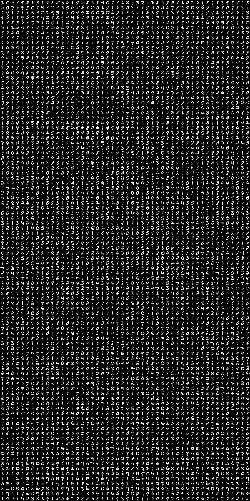

Code from [MindsEyeDemo.scala:58](../../src/test/scala/MindsEyeDemo.scala#L58) executed in 3.21 seconds: 
```java
    var n = 0
    MNIST.trainingDataStream().iterator().asScala.toStream.take(rows * cols).foreach(item ⇒ {
      val (x, y) = ((n % cols) * size, (n / cols) * size)
      (0 until size).foreach(xx ⇒
        (0 until size).foreach(yy ⇒ {
          val value: Double = item.data.get(xx, yy)
          gfx.setColor(new Color(value.toInt, value.toInt, value.toInt))
          gfx.drawRect(x + xx, y + yy, 1, 1)
        }))
      n = n + 1
    })
```

Returns: 




