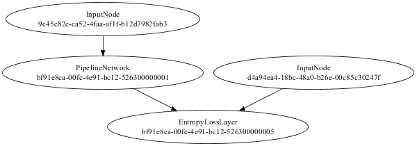
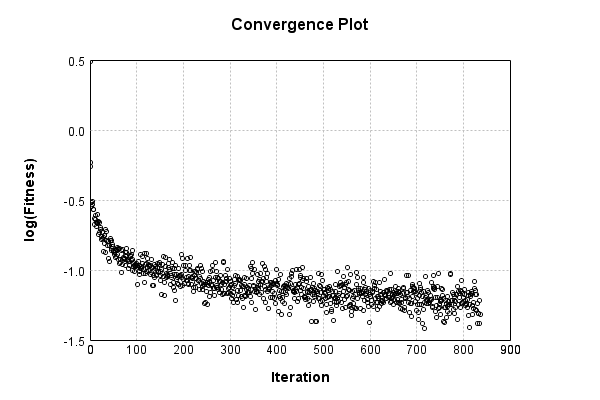

In this demo we train a simple neural network against the MNIST handwritten digit dataset

## Data
First, we load the training dataset: 

Code from [MindsEyeDemo.scala:64](../../src/test/scala/MindsEyeDemo.scala#L64) executed in 0.68 seconds: 
```java
    MNIST.trainingDataStream().iterator().asScala.toStream.map(labeledObj ⇒ {
      Array(labeledObj.data, toOutNDArray(toOut(labeledObj.label), 10))
    })
```

Returns: 

```
    Stream([Lcom.simiacryptus.util.ml.Tensor;@74eb909f, ?)
```


And preview a few rows: 

Code from [MindsEyeDemo.scala:70](../../src/test/scala/MindsEyeDemo.scala#L70) executed in 0.28 seconds: 
```java
    TableOutput.create(data.take(10).map(testObj ⇒ Map[String,AnyRef](
      "Input1 (as Image)" → log.image(testObj(0).toGrayImage(), testObj(0).toString),
      "Input2 (as String)" → testObj(1).toString,
      "Input1 (as String)" → testObj(0).toString
    ).asJava):_*)
```

Returns: 

Input1 (as Image) | Input2 (as String) | Input1 (as String)
----------------- | ------------------ | ------------------
![[ [ [ 0.0 ],[ 0.0 ],[ 0.0 ],[ 0.0 ],[ 0.0 ],[ 0.0 ],[ 0.0 ],[ 0.0 ],... ],[ [ 0.0 ],[ 0.0 ],[ 0.0 ],[ 0.0 ],[ 0.0 ],[ 0.0 ],[ 0.0 ],[ 0.0 ],... ],[ [ 0.0 ],[ 0.0 ],[ 0.0 ],[ 0.0 ],[ 0.0 ],[ 0.0 ],[ 0.0 ],[ 0.0 ],... ],[ [ 0.0 ],[ 0.0 ],[ 0.0 ],[ 0.0 ],[ 0.0 ],[ 0.0 ],[ 0.0 ],[ 0.0 ],... ],[ [ 0.0 ],[ 0.0 ],[ 0.0 ],[ 0.0 ],[ 0.0 ],[ 0.0 ],[ 0.0 ],[ 0.0 ],... ],[ [ 0.0 ],[ 0.0 ],[ 0.0 ],[ 0.0 ],[ 0.0 ],[ 0.0 ],[ 0.0 ],[ 0.0 ],... ],[ [ 0.0 ],[ 0.0 ],[ 0.0 ],[ 0.0 ],[ 0.0 ],[ 0.0 ],[ 0.0 ],[ 0.0 ],... ],[ [ 0.0 ],[ 0.0 ],[ 0.0 ],[ 0.0 ],[ 0.0 ],[ 0.0 ],[ 0.0 ],[ 49.0 ],... ],... ]](mnist_simple.1.png)      | [ 0.0,0.0,0.0,0.0,0.0,1.0,0.0,0.0,0.0,0.0 ] | [ [ [ 0.0 ],[ 0.0 ],[ 0.0 ],[ 0.0 ],[ 0.0 ],[ 0.0 ],[ 0.0 ],[ 0.0 ],... ],[ [ 0.0 ],[ 0.0 ],[ 0.0 ],[ 0.0 ],[ 0.0 ],[ 0.0 ],[ 0.0 ],[ 0.0 ],... ],[ [ 0.0 ],[ 0.0 ],[ 0.0 ],[ 0.0 ],[ 0.0 ],[ 0.0 ],[ 0.0 ],[ 0.0 ],... ],[ [ 0.0 ],[ 0.0 ],[ 0.0 ],[ 0.0 ],[ 0.0 ],[ 0.0 ],[ 0.0 ],[ 0.0 ],... ],[ [ 0.0 ],[ 0.0 ],[ 0.0 ],[ 0.0 ],[ 0.0 ],[ 0.0 ],[ 0.0 ],[ 0.0 ],... ],[ [ 0.0 ],[ 0.0 ],[ 0.0 ],[ 0.0 ],[ 0.0 ],[ 0.0 ],[ 0.0 ],[ 0.0 ],... ],[ [ 0.0 ],[ 0.0 ],[ 0.0 ],[ 0.0 ],[ 0.0 ],[ 0.0 ],[ 0.0 ],[ 0.0 ],... ],[ [ 0.0 ],[ 0.0 ],[ 0.0 ],[ 0.0 ],[ 0.0 ],[ 0.0 ],[ 0.0 ],[ 49.0 ],... ],... ]     
![[ [ [ 0.0 ],[ 0.0 ],[ 0.0 ],[ 0.0 ],[ 0.0 ],[ 0.0 ],[ 0.0 ],[ 0.0 ],... ],[ [ 0.0 ],[ 0.0 ],[ 0.0 ],[ 0.0 ],[ 0.0 ],[ 0.0 ],[ 0.0 ],[ 0.0 ],... ],[ [ 0.0 ],[ 0.0 ],[ 0.0 ],[ 0.0 ],[ 0.0 ],[ 0.0 ],[ 0.0 ],[ 0.0 ],... ],[ [ 0.0 ],[ 0.0 ],[ 0.0 ],[ 0.0 ],[ 0.0 ],[ 0.0 ],[ 0.0 ],[ 0.0 ],... ],[ [ 0.0 ],[ 0.0 ],[ 0.0 ],[ 0.0 ],[ 0.0 ],[ 0.0 ],[ 0.0 ],[ 0.0 ],... ],[ [ 0.0 ],[ 0.0 ],[ 0.0 ],[ 0.0 ],[ 0.0 ],[ 0.0 ],[ 0.0 ],[ 0.0 ],... ],[ [ 0.0 ],[ 0.0 ],[ 0.0 ],[ 0.0 ],[ 0.0 ],[ 0.0 ],[ 0.0 ],[ 0.0 ],... ],[ [ 0.0 ],[ 0.0 ],[ 0.0 ],[ 0.0 ],[ 0.0 ],[ 0.0 ],[ 0.0 ],[ 0.0 ],... ],... ]](mnist_simple.2.png)       | [ 1.0,0.0,0.0,0.0,0.0,0.0,0.0,0.0,0.0,0.0 ] | [ [ [ 0.0 ],[ 0.0 ],[ 0.0 ],[ 0.0 ],[ 0.0 ],[ 0.0 ],[ 0.0 ],[ 0.0 ],... ],[ [ 0.0 ],[ 0.0 ],[ 0.0 ],[ 0.0 ],[ 0.0 ],[ 0.0 ],[ 0.0 ],[ 0.0 ],... ],[ [ 0.0 ],[ 0.0 ],[ 0.0 ],[ 0.0 ],[ 0.0 ],[ 0.0 ],[ 0.0 ],[ 0.0 ],... ],[ [ 0.0 ],[ 0.0 ],[ 0.0 ],[ 0.0 ],[ 0.0 ],[ 0.0 ],[ 0.0 ],[ 0.0 ],... ],[ [ 0.0 ],[ 0.0 ],[ 0.0 ],[ 0.0 ],[ 0.0 ],[ 0.0 ],[ 0.0 ],[ 0.0 ],... ],[ [ 0.0 ],[ 0.0 ],[ 0.0 ],[ 0.0 ],[ 0.0 ],[ 0.0 ],[ 0.0 ],[ 0.0 ],... ],[ [ 0.0 ],[ 0.0 ],[ 0.0 ],[ 0.0 ],[ 0.0 ],[ 0.0 ],[ 0.0 ],[ 0.0 ],... ],[ [ 0.0 ],[ 0.0 ],[ 0.0 ],[ 0.0 ],[ 0.0 ],[ 0.0 ],[ 0.0 ],[ 0.0 ],... ],... ]      
![[ [ [ 0.0 ],[ 0.0 ],[ 0.0 ],[ 0.0 ],[ 0.0 ],[ 0.0 ],[ 0.0 ],[ 0.0 ],... ],[ [ 0.0 ],[ 0.0 ],[ 0.0 ],[ 0.0 ],[ 0.0 ],[ 0.0 ],[ 0.0 ],[ 0.0 ],... ],[ [ 0.0 ],[ 0.0 ],[ 0.0 ],[ 0.0 ],[ 0.0 ],[ 0.0 ],[ 0.0 ],[ 0.0 ],... ],[ [ 0.0 ],[ 0.0 ],[ 0.0 ],[ 0.0 ],[ 0.0 ],[ 0.0 ],[ 0.0 ],[ 0.0 ],... ],[ [ 0.0 ],[ 0.0 ],[ 0.0 ],[ 0.0 ],[ 0.0 ],[ 0.0 ],[ 62.0 ],[ 126.0 ],... ],[ [ 0.0 ],[ 0.0 ],[ 0.0 ],[ 0.0 ],[ 0.0 ],[ 0.0 ],[ 81.0 ],[ 163.0 ],... ],[ [ 0.0 ],[ 0.0 ],[ 0.0 ],[ 0.0 ],[ 0.0 ],[ 0.0 ],[ 0.0 ],[ 0.0 ],... ],[ [ 0.0 ],[ 0.0 ],[ 0.0 ],[ 0.0 ],[ 0.0 ],[ 0.0 ],[ 0.0 ],[ 0.0 ],... ],... ]](mnist_simple.3.png) | [ 0.0,0.0,0.0,0.0,1.0,0.0,0.0,0.0,0.0,0.0 ] | [ [ [ 0.0 ],[ 0.0 ],[ 0.0 ],[ 0.0 ],[ 0.0 ],[ 0.0 ],[ 0.0 ],[ 0.0 ],... ],[ [ 0.0 ],[ 0.0 ],[ 0.0 ],[ 0.0 ],[ 0.0 ],[ 0.0 ],[ 0.0 ],[ 0.0 ],... ],[ [ 0.0 ],[ 0.0 ],[ 0.0 ],[ 0.0 ],[ 0.0 ],[ 0.0 ],[ 0.0 ],[ 0.0 ],... ],[ [ 0.0 ],[ 0.0 ],[ 0.0 ],[ 0.0 ],[ 0.0 ],[ 0.0 ],[ 0.0 ],[ 0.0 ],... ],[ [ 0.0 ],[ 0.0 ],[ 0.0 ],[ 0.0 ],[ 0.0 ],[ 0.0 ],[ 62.0 ],[ 126.0 ],... ],[ [ 0.0 ],[ 0.0 ],[ 0.0 ],[ 0.0 ],[ 0.0 ],[ 0.0 ],[ 81.0 ],[ 163.0 ],... ],[ [ 0.0 ],[ 0.0 ],[ 0.0 ],[ 0.0 ],[ 0.0 ],[ 0.0 ],[ 0.0 ],[ 0.0 ],... ],[ [ 0.0 ],[ 0.0 ],[ 0.0 ],[ 0.0 ],[ 0.0 ],[ 0.0 ],[ 0.0 ],[ 0.0 ],... ],... ]
![[ [ [ 0.0 ],[ 0.0 ],[ 0.0 ],[ 0.0 ],[ 0.0 ],[ 0.0 ],[ 0.0 ],[ 0.0 ],... ],[ [ 0.0 ],[ 0.0 ],[ 0.0 ],[ 0.0 ],[ 0.0 ],[ 0.0 ],[ 0.0 ],[ 0.0 ],... ],[ [ 0.0 ],[ 0.0 ],[ 0.0 ],[ 0.0 ],[ 0.0 ],[ 0.0 ],[ 0.0 ],[ 0.0 ],... ],[ [ 0.0 ],[ 0.0 ],[ 0.0 ],[ 0.0 ],[ 0.0 ],[ 0.0 ],[ 0.0 ],[ 0.0 ],... ],[ [ 0.0 ],[ 0.0 ],[ 0.0 ],[ 0.0 ],[ 0.0 ],[ 0.0 ],[ 0.0 ],[ 0.0 ],... ],[ [ 0.0 ],[ 0.0 ],[ 0.0 ],[ 0.0 ],[ 0.0 ],[ 0.0 ],[ 0.0 ],[ 0.0 ],... ],[ [ 0.0 ],[ 0.0 ],[ 0.0 ],[ 0.0 ],[ 0.0 ],[ 0.0 ],[ 0.0 ],[ 0.0 ],... ],[ [ 0.0 ],[ 0.0 ],[ 0.0 ],[ 0.0 ],[ 0.0 ],[ 0.0 ],[ 0.0 ],[ 0.0 ],... ],... ]](mnist_simple.4.png)       | [ 0.0,1.0,0.0,0.0,0.0,0.0,0.0,0.0,0.0,0.0 ] | [ [ [ 0.0 ],[ 0.0 ],[ 0.0 ],[ 0.0 ],[ 0.0 ],[ 0.0 ],[ 0.0 ],[ 0.0 ],... ],[ [ 0.0 ],[ 0.0 ],[ 0.0 ],[ 0.0 ],[ 0.0 ],[ 0.0 ],[ 0.0 ],[ 0.0 ],... ],[ [ 0.0 ],[ 0.0 ],[ 0.0 ],[ 0.0 ],[ 0.0 ],[ 0.0 ],[ 0.0 ],[ 0.0 ],... ],[ [ 0.0 ],[ 0.0 ],[ 0.0 ],[ 0.0 ],[ 0.0 ],[ 0.0 ],[ 0.0 ],[ 0.0 ],... ],[ [ 0.0 ],[ 0.0 ],[ 0.0 ],[ 0.0 ],[ 0.0 ],[ 0.0 ],[ 0.0 ],[ 0.0 ],... ],[ [ 0.0 ],[ 0.0 ],[ 0.0 ],[ 0.0 ],[ 0.0 ],[ 0.0 ],[ 0.0 ],[ 0.0 ],... ],[ [ 0.0 ],[ 0.0 ],[ 0.0 ],[ 0.0 ],[ 0.0 ],[ 0.0 ],[ 0.0 ],[ 0.0 ],... ],[ [ 0.0 ],[ 0.0 ],[ 0.0 ],[ 0.0 ],[ 0.0 ],[ 0.0 ],[ 0.0 ],[ 0.0 ],... ],... ]      
![[ [ [ 0.0 ],[ 0.0 ],[ 0.0 ],[ 0.0 ],[ 0.0 ],[ 0.0 ],[ 0.0 ],[ 0.0 ],... ],[ [ 0.0 ],[ 0.0 ],[ 0.0 ],[ 0.0 ],[ 0.0 ],[ 0.0 ],[ 0.0 ],[ 0.0 ],... ],[ [ 0.0 ],[ 0.0 ],[ 0.0 ],[ 0.0 ],[ 0.0 ],[ 0.0 ],[ 0.0 ],[ 0.0 ],... ],[ [ 0.0 ],[ 0.0 ],[ 0.0 ],[ 0.0 ],[ 0.0 ],[ 0.0 ],[ 0.0 ],[ 0.0 ],... ],[ [ 0.0 ],[ 0.0 ],[ 0.0 ],[ 0.0 ],[ 0.0 ],[ 0.0 ],[ 0.0 ],[ 0.0 ],... ],[ [ 0.0 ],[ 0.0 ],[ 0.0 ],[ 0.0 ],[ 0.0 ],[ 0.0 ],[ 0.0 ],[ 0.0 ],... ],[ [ 0.0 ],[ 0.0 ],[ 0.0 ],[ 0.0 ],[ 0.0 ],[ 0.0 ],[ 0.0 ],[ 0.0 ],... ],[ [ 0.0 ],[ 0.0 ],[ 0.0 ],[ 0.0 ],[ 0.0 ],[ 0.0 ],[ 0.0 ],[ 0.0 ],... ],... ]](mnist_simple.5.png)       | [ 0.0,0.0,0.0,0.0,0.0,0.0,0.0,0.0,0.0,1.0 ] | [ [ [ 0.0 ],[ 0.0 ],[ 0.0 ],[ 0.0 ],[ 0.0 ],[ 0.0 ],[ 0.0 ],[ 0.0 ],... ],[ [ 0.0 ],[ 0.0 ],[ 0.0 ],[ 0.0 ],[ 0.0 ],[ 0.0 ],[ 0.0 ],[ 0.0 ],... ],[ [ 0.0 ],[ 0.0 ],[ 0.0 ],[ 0.0 ],[ 0.0 ],[ 0.0 ],[ 0.0 ],[ 0.0 ],... ],[ [ 0.0 ],[ 0.0 ],[ 0.0 ],[ 0.0 ],[ 0.0 ],[ 0.0 ],[ 0.0 ],[ 0.0 ],... ],[ [ 0.0 ],[ 0.0 ],[ 0.0 ],[ 0.0 ],[ 0.0 ],[ 0.0 ],[ 0.0 ],[ 0.0 ],... ],[ [ 0.0 ],[ 0.0 ],[ 0.0 ],[ 0.0 ],[ 0.0 ],[ 0.0 ],[ 0.0 ],[ 0.0 ],... ],[ [ 0.0 ],[ 0.0 ],[ 0.0 ],[ 0.0 ],[ 0.0 ],[ 0.0 ],[ 0.0 ],[ 0.0 ],... ],[ [ 0.0 ],[ 0.0 ],[ 0.0 ],[ 0.0 ],[ 0.0 ],[ 0.0 ],[ 0.0 ],[ 0.0 ],... ],... ]      
![[ [ [ 0.0 ],[ 0.0 ],[ 0.0 ],[ 0.0 ],[ 0.0 ],[ 0.0 ],[ 0.0 ],[ 0.0 ],... ],[ [ 0.0 ],[ 0.0 ],[ 0.0 ],[ 0.0 ],[ 0.0 ],[ 0.0 ],[ 0.0 ],[ 0.0 ],... ],[ [ 0.0 ],[ 0.0 ],[ 0.0 ],[ 0.0 ],[ 0.0 ],[ 0.0 ],[ 0.0 ],[ 0.0 ],... ],[ [ 0.0 ],[ 0.0 ],[ 0.0 ],[ 0.0 ],[ 0.0 ],[ 0.0 ],[ 0.0 ],[ 0.0 ],... ],[ [ 0.0 ],[ 0.0 ],[ 0.0 ],[ 0.0 ],[ 0.0 ],[ 0.0 ],[ 0.0 ],[ 0.0 ],... ],[ [ 0.0 ],[ 0.0 ],[ 0.0 ],[ 0.0 ],[ 0.0 ],[ 0.0 ],[ 0.0 ],[ 0.0 ],... ],[ [ 0.0 ],[ 0.0 ],[ 0.0 ],[ 0.0 ],[ 0.0 ],[ 0.0 ],[ 0.0 ],[ 0.0 ],... ],[ [ 0.0 ],[ 0.0 ],[ 0.0 ],[ 0.0 ],[ 0.0 ],[ 0.0 ],[ 0.0 ],[ 0.0 ],... ],... ]](mnist_simple.6.png)       | [ 0.0,0.0,1.0,0.0,0.0,0.0,0.0,0.0,0.0,0.0 ] | [ [ [ 0.0 ],[ 0.0 ],[ 0.0 ],[ 0.0 ],[ 0.0 ],[ 0.0 ],[ 0.0 ],[ 0.0 ],... ],[ [ 0.0 ],[ 0.0 ],[ 0.0 ],[ 0.0 ],[ 0.0 ],[ 0.0 ],[ 0.0 ],[ 0.0 ],... ],[ [ 0.0 ],[ 0.0 ],[ 0.0 ],[ 0.0 ],[ 0.0 ],[ 0.0 ],[ 0.0 ],[ 0.0 ],... ],[ [ 0.0 ],[ 0.0 ],[ 0.0 ],[ 0.0 ],[ 0.0 ],[ 0.0 ],[ 0.0 ],[ 0.0 ],... ],[ [ 0.0 ],[ 0.0 ],[ 0.0 ],[ 0.0 ],[ 0.0 ],[ 0.0 ],[ 0.0 ],[ 0.0 ],... ],[ [ 0.0 ],[ 0.0 ],[ 0.0 ],[ 0.0 ],[ 0.0 ],[ 0.0 ],[ 0.0 ],[ 0.0 ],... ],[ [ 0.0 ],[ 0.0 ],[ 0.0 ],[ 0.0 ],[ 0.0 ],[ 0.0 ],[ 0.0 ],[ 0.0 ],... ],[ [ 0.0 ],[ 0.0 ],[ 0.0 ],[ 0.0 ],[ 0.0 ],[ 0.0 ],[ 0.0 ],[ 0.0 ],... ],... ]      
![[ [ [ 0.0 ],[ 0.0 ],[ 0.0 ],[ 0.0 ],[ 0.0 ],[ 0.0 ],[ 0.0 ],[ 0.0 ],... ],[ [ 0.0 ],[ 0.0 ],[ 0.0 ],[ 0.0 ],[ 0.0 ],[ 0.0 ],[ 0.0 ],[ 0.0 ],... ],[ [ 0.0 ],[ 0.0 ],[ 0.0 ],[ 0.0 ],[ 0.0 ],[ 0.0 ],[ 0.0 ],[ 0.0 ],... ],[ [ 0.0 ],[ 0.0 ],[ 0.0 ],[ 0.0 ],[ 0.0 ],[ 0.0 ],[ 0.0 ],[ 0.0 ],... ],[ [ 0.0 ],[ 0.0 ],[ 0.0 ],[ 0.0 ],[ 0.0 ],[ 0.0 ],[ 0.0 ],[ 0.0 ],... ],[ [ 0.0 ],[ 0.0 ],[ 0.0 ],[ 0.0 ],[ 0.0 ],[ 0.0 ],[ 0.0 ],[ 0.0 ],... ],[ [ 0.0 ],[ 0.0 ],[ 0.0 ],[ 0.0 ],[ 0.0 ],[ 0.0 ],[ 0.0 ],[ 0.0 ],... ],[ [ 0.0 ],[ 0.0 ],[ 0.0 ],[ 0.0 ],[ 0.0 ],[ 0.0 ],[ 0.0 ],[ 0.0 ],... ],... ]](mnist_simple.7.png)       | [ 0.0,1.0,0.0,0.0,0.0,0.0,0.0,0.0,0.0,0.0 ] | [ [ [ 0.0 ],[ 0.0 ],[ 0.0 ],[ 0.0 ],[ 0.0 ],[ 0.0 ],[ 0.0 ],[ 0.0 ],... ],[ [ 0.0 ],[ 0.0 ],[ 0.0 ],[ 0.0 ],[ 0.0 ],[ 0.0 ],[ 0.0 ],[ 0.0 ],... ],[ [ 0.0 ],[ 0.0 ],[ 0.0 ],[ 0.0 ],[ 0.0 ],[ 0.0 ],[ 0.0 ],[ 0.0 ],... ],[ [ 0.0 ],[ 0.0 ],[ 0.0 ],[ 0.0 ],[ 0.0 ],[ 0.0 ],[ 0.0 ],[ 0.0 ],... ],[ [ 0.0 ],[ 0.0 ],[ 0.0 ],[ 0.0 ],[ 0.0 ],[ 0.0 ],[ 0.0 ],[ 0.0 ],... ],[ [ 0.0 ],[ 0.0 ],[ 0.0 ],[ 0.0 ],[ 0.0 ],[ 0.0 ],[ 0.0 ],[ 0.0 ],... ],[ [ 0.0 ],[ 0.0 ],[ 0.0 ],[ 0.0 ],[ 0.0 ],[ 0.0 ],[ 0.0 ],[ 0.0 ],... ],[ [ 0.0 ],[ 0.0 ],[ 0.0 ],[ 0.0 ],[ 0.0 ],[ 0.0 ],[ 0.0 ],[ 0.0 ],... ],... ]      
![[ [ [ 0.0 ],[ 0.0 ],[ 0.0 ],[ 0.0 ],[ 0.0 ],[ 0.0 ],[ 0.0 ],[ 0.0 ],... ],[ [ 0.0 ],[ 0.0 ],[ 0.0 ],[ 0.0 ],[ 0.0 ],[ 0.0 ],[ 0.0 ],[ 0.0 ],... ],[ [ 0.0 ],[ 0.0 ],[ 0.0 ],[ 0.0 ],[ 0.0 ],[ 0.0 ],[ 0.0 ],[ 0.0 ],... ],[ [ 0.0 ],[ 0.0 ],[ 0.0 ],[ 0.0 ],[ 0.0 ],[ 0.0 ],[ 0.0 ],[ 0.0 ],... ],[ [ 0.0 ],[ 0.0 ],[ 0.0 ],[ 0.0 ],[ 0.0 ],[ 0.0 ],[ 0.0 ],[ 0.0 ],... ],[ [ 0.0 ],[ 0.0 ],[ 0.0 ],[ 0.0 ],[ 0.0 ],[ 0.0 ],[ 0.0 ],[ 0.0 ],... ],[ [ 0.0 ],[ 0.0 ],[ 0.0 ],[ 0.0 ],[ 0.0 ],[ 0.0 ],[ 0.0 ],[ 0.0 ],... ],[ [ 0.0 ],[ 0.0 ],[ 0.0 ],[ 0.0 ],[ 0.0 ],[ 0.0 ],[ 0.0 ],[ 0.0 ],... ],... ]](mnist_simple.8.png)       | [ 0.0,0.0,0.0,1.0,0.0,0.0,0.0,0.0,0.0,0.0 ] | [ [ [ 0.0 ],[ 0.0 ],[ 0.0 ],[ 0.0 ],[ 0.0 ],[ 0.0 ],[ 0.0 ],[ 0.0 ],... ],[ [ 0.0 ],[ 0.0 ],[ 0.0 ],[ 0.0 ],[ 0.0 ],[ 0.0 ],[ 0.0 ],[ 0.0 ],... ],[ [ 0.0 ],[ 0.0 ],[ 0.0 ],[ 0.0 ],[ 0.0 ],[ 0.0 ],[ 0.0 ],[ 0.0 ],... ],[ [ 0.0 ],[ 0.0 ],[ 0.0 ],[ 0.0 ],[ 0.0 ],[ 0.0 ],[ 0.0 ],[ 0.0 ],... ],[ [ 0.0 ],[ 0.0 ],[ 0.0 ],[ 0.0 ],[ 0.0 ],[ 0.0 ],[ 0.0 ],[ 0.0 ],... ],[ [ 0.0 ],[ 0.0 ],[ 0.0 ],[ 0.0 ],[ 0.0 ],[ 0.0 ],[ 0.0 ],[ 0.0 ],... ],[ [ 0.0 ],[ 0.0 ],[ 0.0 ],[ 0.0 ],[ 0.0 ],[ 0.0 ],[ 0.0 ],[ 0.0 ],... ],[ [ 0.0 ],[ 0.0 ],[ 0.0 ],[ 0.0 ],[ 0.0 ],[ 0.0 ],[ 0.0 ],[ 0.0 ],... ],... ]      
![[ [ [ 0.0 ],[ 0.0 ],[ 0.0 ],[ 0.0 ],[ 0.0 ],[ 0.0 ],[ 0.0 ],[ 0.0 ],... ],[ [ 0.0 ],[ 0.0 ],[ 0.0 ],[ 0.0 ],[ 0.0 ],[ 0.0 ],[ 0.0 ],[ 0.0 ],... ],[ [ 0.0 ],[ 0.0 ],[ 0.0 ],[ 0.0 ],[ 0.0 ],[ 0.0 ],[ 0.0 ],[ 0.0 ],... ],[ [ 0.0 ],[ 0.0 ],[ 0.0 ],[ 0.0 ],[ 0.0 ],[ 0.0 ],[ 0.0 ],[ 0.0 ],... ],[ [ 0.0 ],[ 0.0 ],[ 0.0 ],[ 0.0 ],[ 0.0 ],[ 0.0 ],[ 0.0 ],[ 0.0 ],... ],[ [ 0.0 ],[ 0.0 ],[ 0.0 ],[ 0.0 ],[ 0.0 ],[ 0.0 ],[ 0.0 ],[ 0.0 ],... ],[ [ 0.0 ],[ 0.0 ],[ 0.0 ],[ 0.0 ],[ 0.0 ],[ 0.0 ],[ 0.0 ],[ 0.0 ],... ],[ [ 0.0 ],[ 0.0 ],[ 0.0 ],[ 0.0 ],[ 0.0 ],[ 0.0 ],[ 0.0 ],[ 0.0 ],... ],... ]](mnist_simple.9.png)       | [ 0.0,1.0,0.0,0.0,0.0,0.0,0.0,0.0,0.0,0.0 ] | [ [ [ 0.0 ],[ 0.0 ],[ 0.0 ],[ 0.0 ],[ 0.0 ],[ 0.0 ],[ 0.0 ],[ 0.0 ],... ],[ [ 0.0 ],[ 0.0 ],[ 0.0 ],[ 0.0 ],[ 0.0 ],[ 0.0 ],[ 0.0 ],[ 0.0 ],... ],[ [ 0.0 ],[ 0.0 ],[ 0.0 ],[ 0.0 ],[ 0.0 ],[ 0.0 ],[ 0.0 ],[ 0.0 ],... ],[ [ 0.0 ],[ 0.0 ],[ 0.0 ],[ 0.0 ],[ 0.0 ],[ 0.0 ],[ 0.0 ],[ 0.0 ],... ],[ [ 0.0 ],[ 0.0 ],[ 0.0 ],[ 0.0 ],[ 0.0 ],[ 0.0 ],[ 0.0 ],[ 0.0 ],... ],[ [ 0.0 ],[ 0.0 ],[ 0.0 ],[ 0.0 ],[ 0.0 ],[ 0.0 ],[ 0.0 ],[ 0.0 ],... ],[ [ 0.0 ],[ 0.0 ],[ 0.0 ],[ 0.0 ],[ 0.0 ],[ 0.0 ],[ 0.0 ],[ 0.0 ],... ],[ [ 0.0 ],[ 0.0 ],[ 0.0 ],[ 0.0 ],[ 0.0 ],[ 0.0 ],[ 0.0 ],[ 0.0 ],... ],... ]      
![[ [ [ 0.0 ],[ 0.0 ],[ 0.0 ],[ 0.0 ],[ 0.0 ],[ 0.0 ],[ 0.0 ],[ 0.0 ],... ],[ [ 0.0 ],[ 0.0 ],[ 0.0 ],[ 0.0 ],[ 0.0 ],[ 0.0 ],[ 0.0 ],[ 0.0 ],... ],[ [ 0.0 ],[ 0.0 ],[ 0.0 ],[ 0.0 ],[ 0.0 ],[ 0.0 ],[ 0.0 ],[ 0.0 ],... ],[ [ 0.0 ],[ 0.0 ],[ 0.0 ],[ 0.0 ],[ 0.0 ],[ 0.0 ],[ 0.0 ],[ 0.0 ],... ],[ [ 0.0 ],[ 0.0 ],[ 0.0 ],[ 0.0 ],[ 0.0 ],[ 0.0 ],[ 0.0 ],[ 0.0 ],... ],[ [ 0.0 ],[ 0.0 ],[ 0.0 ],[ 0.0 ],[ 0.0 ],[ 0.0 ],[ 0.0 ],[ 0.0 ],... ],[ [ 0.0 ],[ 0.0 ],[ 0.0 ],[ 0.0 ],[ 0.0 ],[ 0.0 ],[ 0.0 ],[ 0.0 ],... ],[ [ 0.0 ],[ 0.0 ],[ 0.0 ],[ 0.0 ],[ 0.0 ],[ 0.0 ],[ 0.0 ],[ 0.0 ],... ],... ]](mnist_simple.10.png)      | [ 0.0,0.0,0.0,0.0,1.0,0.0,0.0,0.0,0.0,0.0 ] | [ [ [ 0.0 ],[ 0.0 ],[ 0.0 ],[ 0.0 ],[ 0.0 ],[ 0.0 ],[ 0.0 ],[ 0.0 ],... ],[ [ 0.0 ],[ 0.0 ],[ 0.0 ],[ 0.0 ],[ 0.0 ],[ 0.0 ],[ 0.0 ],[ 0.0 ],... ],[ [ 0.0 ],[ 0.0 ],[ 0.0 ],[ 0.0 ],[ 0.0 ],[ 0.0 ],[ 0.0 ],[ 0.0 ],... ],[ [ 0.0 ],[ 0.0 ],[ 0.0 ],[ 0.0 ],[ 0.0 ],[ 0.0 ],[ 0.0 ],[ 0.0 ],... ],[ [ 0.0 ],[ 0.0 ],[ 0.0 ],[ 0.0 ],[ 0.0 ],[ 0.0 ],[ 0.0 ],[ 0.0 ],... ],[ [ 0.0 ],[ 0.0 ],[ 0.0 ],[ 0.0 ],[ 0.0 ],[ 0.0 ],[ 0.0 ],[ 0.0 ],... ],[ [ 0.0 ],[ 0.0 ],[ 0.0 ],[ 0.0 ],[ 0.0 ],[ 0.0 ],[ 0.0 ],[ 0.0 ],... ],[ [ 0.0 ],[ 0.0 ],[ 0.0 ],[ 0.0 ],[ 0.0 ],[ 0.0 ],[ 0.0 ],[ 0.0 ],... ],... ]      


## Model
Here we define the logic network that we are about to train: 

Code from [MindsEyeDemo.scala:80](../../src/test/scala/MindsEyeDemo.scala#L80) executed in 0.71 seconds: 
```java
    var model: DAGNetwork = new DAGNetwork
    model = model.add(new DenseSynapseLayerJBLAS(Tensor.dim(inputSize: _*), outputSize).setWeights(new ToDoubleFunction[Coordinate] {
      override def applyAsDouble(value: Coordinate): Double = Util.R.get.nextGaussian * 0.0
    }))
    model = model.add(new BiasLayer(outputSize: _*))
    model = model.add(new SoftmaxActivationLayer)
    model
```

Returns: 

```
    {
      "class": "DAGNetwork",
      "id": "c032913e-c689-4a8c-b707-0a1c00000001",
      "root": {
        "layer": {
          "class": "SoftmaxActivationLayer",
          "id": "c032913e-c689-4a8c-b707-0a1c00000004"
        },
        "prev0": {
          "layer": {
            "class": "BiasLayer",
            "id": "c032913e-c689-4a8c-b707-0a1c00000003",
            "bias": "[0.0, 0.0, 0.0, 0.0, 0.0, 0.0, 0.0, 0.0, 0.0, 0.0]"
          },
          "prev0": {
            "layer": {
              "class": "DenseSynapseLayerJBLAS",
              "id": "c032913e-c689-4a8c-b707-0a1c00000002",
              "weights": "[ [ -0.0,0.0,0.0,0.0,-0.0,0.0,-0.0,-0.0,-0.0,0.0 ],[ 0.0,0.0,-0.0,-0.0,0.0,-0.0,-0.0,-0.0,0.0,-0.0 ],[ 0.0,0.0,0.0,0.0,0.0,-0.0,-0.0,-0.0,-0.0,0.0 ],[ -0.0,0.0,0.0,-0.0,-0.0,-0.0,0.0,0.0,0.0,0.0 ],[ 0.0,-0.0,-0.0,-0.0,0.0,0.0,-0.0,-0.0,0.0,0.0 ],[ 0.0,-0.0,-0.0,0.0,0.0,0.0,0.0,0.0,-0.0,0.0 ],[ 0.0,-0.0,0.0,0.0,-0.0,0.0,-0.0,-0.0,-0.0,0.0 ],[ -0.0,0.0,0.0,-0.0,-0.0,-0.0,0.0,-0.0,-0.0,-0.0 ],... ]"
            },
            "prev0": {
              "target": "[3b72f0ff-eaea-41dc-9d17-dcbd9145aa54, e972e443-9f68-483a-819d-ef3b2d96674d]"
            }
          }
        }
      }
    }
```


We can visualize this network as a graph: 

Code from [MindsEyeDemo.scala:472](../../src/test/scala/MindsEyeDemo.scala#L472) executed in 9.29 seconds: 
```java
    val nodes: List[DAGNode] = dagNetwork.getNodes.asScala.toList
    val graphNodes: Map[UUID, MutableNode] = nodes.map(node ⇒ {
      node.getId() → guru.nidi.graphviz.model.Factory.mutNode((node match {
        case n : InnerNode ⇒
          n.nnlayer match {
            case _ if(n.nnlayer.isInstanceOf[VerboseWrapper]) ⇒ n.nnlayer.asInstanceOf[VerboseWrapper].inner.getClass.getSimpleName
            case _ ⇒ n.nnlayer.getClass.getSimpleName
          }
        case _ ⇒ node.getClass.getSimpleName
      }) + "\n" + node.getId.toString)
    }).toMap
    val idMap: Map[UUID, List[UUID]] = nodes.flatMap((to: DAGNode) ⇒ {
      to.getInputs.map((from: DAGNode) ⇒ {
        from.getId → to.getId
      })
    }).groupBy(_._1).mapValues(_.map(_._2))
    nodes.foreach((to: DAGNode) ⇒ {
      graphNodes(to.getId).addLink(idMap.getOrElse(to.getId, List.empty).map(from ⇒ {
        Link.to(graphNodes(from))
      }): _*)
    })
    val nodeArray = graphNodes.values.map(_.asInstanceOf[LinkSource]).toArray
    val graph = guru.nidi.graphviz.model.Factory.graph().`with`(nodeArray: _*)
      .generalAttr.`with`(RankDir.TOP_TO_BOTTOM).directed()
    Graphviz.fromGraph(graph).width(width).render(Format.PNG).toImage
```

Returns: 


We encapsulate our model network within a supervisory network that applies a loss function: 

Code from [MindsEyeDemo.scala:92](../../src/test/scala/MindsEyeDemo.scala#L92) executed in 0.01 seconds: 
```java
    val trainingNetwork: DAGNetwork = new DAGNetwork
    trainingNetwork.add(model)
    trainingNetwork.addLossComponent(new EntropyLossLayer)
    trainingNetwork
```

Returns: 

```
    {
      "class": "DAGNetwork",
      "id": "c032913e-c689-4a8c-b707-0a1c00000005",
      "root": {
        "layer": {
          "class": "EntropyLossLayer",
          "id": "c032913e-c689-4a8c-b707-0a1c00000006"
        },
        "prev0": {
          "layer": {
            "class": "DAGNetwork",
            "id": "c032913e-c689-4a8c-b707-0a1c00000001",
            "root": {
              "layer": {
                "class": "SoftmaxActivationLayer",
                "id": "c032913e-c689-4a8c-b707-0a1c00000004"
              },
              "prev0": {
                "layer": {
                  "class": "BiasLayer",
                  "id": "c032913e-c689-4a8c-b707-0a1c00000003",
                  "bias": "[0.0, 0.0, 0.0, 0.0, 0.0, 0.0, 0.0, 0.0, 0.0, 0.0]"
                },
                "prev0": {
                  "layer": {
                    "class": "DenseSynapseLayerJBLAS",
                    "id": "c032913e-c689-4a8c-b707-0a1c00000002",
                    "weights": "[ [ -0.0,0.0,0.0,0.0,-0.0,0.0,-0.0,-0.0,-0.0,0.0 ],[ 0.0,0.0,-0.0,-0.0,0.0,-0.0,-0.0,-0.0,0.0,-0.0 ],[ 0.0,0.0,0.0,0.0,0.0,-0.0,-0.0,-0.0,-0.0,0.0 ],[ -0.0,0.0,0.0,-0.0,-0.0,-0.0,0.0,0.0,0.0,0.0 ],[ 0.0,-0.0,-0.0,-0.0,0.0,0.0,-0.0,-0.0,0.0,0.0 ],[ 0.0,-0.0,-0.0,0.0,0.0,0.0,0.0,0.0,-0.0,0.0 ],[ 0.0,-0.0,0.0,0.0,-0.0,0.0,-0.0,-0.0,-0.0,0.0 ],[ -0.0,0.0,0.0,-0.0,-0.0,-0.0,0.0,-0.0,-0.0,-0.0 ],... ]"
                  },
                  "prev0": {
                    "target": "[3b72f0ff-eaea-41dc-9d17-dcbd9145aa54, e972e443-9f68-483a-819d-ef3b2d96674d]"
                  }
                }
              }
            }
          },
          "prev0": {
            "target": "[4c98c2af-b88d-4adc-889e-27b08a44d512, 862d3f0f-ca7f-45d5-b6b6-1218888130f8]"
          }
        }
      }
    }
```


With a the following component graph: 

Code from [MindsEyeDemo.scala:472](../../src/test/scala/MindsEyeDemo.scala#L472) executed in 0.39 seconds: 
```java
    val nodes: List[DAGNode] = dagNetwork.getNodes.asScala.toList
    val graphNodes: Map[UUID, MutableNode] = nodes.map(node ⇒ {
      node.getId() → guru.nidi.graphviz.model.Factory.mutNode((node match {
        case n : InnerNode ⇒
          n.nnlayer match {
            case _ if(n.nnlayer.isInstanceOf[VerboseWrapper]) ⇒ n.nnlayer.asInstanceOf[VerboseWrapper].inner.getClass.getSimpleName
            case _ ⇒ n.nnlayer.getClass.getSimpleName
          }
        case _ ⇒ node.getClass.getSimpleName
      }) + "\n" + node.getId.toString)
    }).toMap
    val idMap: Map[UUID, List[UUID]] = nodes.flatMap((to: DAGNode) ⇒ {
      to.getInputs.map((from: DAGNode) ⇒ {
        from.getId → to.getId
      })
    }).groupBy(_._1).mapValues(_.map(_._2))
    nodes.foreach((to: DAGNode) ⇒ {
      graphNodes(to.getId).addLink(idMap.getOrElse(to.getId, List.empty).map(from ⇒ {
        Link.to(graphNodes(from))
      }): _*)
    })
    val nodeArray = graphNodes.values.map(_.asInstanceOf[LinkSource]).toArray
    val graph = guru.nidi.graphviz.model.Factory.graph().`with`(nodeArray: _*)
      .generalAttr.`with`(RankDir.TOP_TO_BOTTOM).directed()
    Graphviz.fromGraph(graph).width(width).render(Format.PNG).toImage
```

Returns: 




Note that this visualization does not expand DAGNetworks recursively

## Training
We train using a standard iterative L-BFGS strategy: 

Code from [MindsEyeDemo.scala:104](../../src/test/scala/MindsEyeDemo.scala#L104) executed in 2.66 seconds: 
```java
    val gradientTrainer: LbfgsTrainer = new LbfgsTrainer
    gradientTrainer.setNet(trainingNetwork)
    gradientTrainer.setData(data.toArray)
    new IterativeTrainer(gradientTrainer)
```

Returns: 

```
    com.simiacryptus.mindseye.training.IterativeTrainer@44550792
```


Code from [MindsEyeDemo.scala:110](../../src/test/scala/MindsEyeDemo.scala#L110) executed in 72.92 seconds: 
```java
    val trainingContext = new TrainingContext
    trainingContext.terminalErr = 0.0
    trainingContext.setTimeout(5, TimeUnit.SECONDS)
    trainer.step(trainingContext)
    val finalError = trainer.step(trainingContext).finalError
    System.out.println(s"Final Error = $finalError")
```
Logging: 
```
    Final Error = 0.9261282128597624
    
```

Returns: 

```
    ()
```


After training, we have the following parameterized model: 

Code from [MindsEyeDemo.scala:119](../../src/test/scala/MindsEyeDemo.scala#L119) executed in 0.07 seconds: 
```java
    model.toString
```

Returns: 

```
    {
      "class": "DAGNetwork",
      "id": "c032913e-c689-4a8c-b707-0a1c00000001",
      "root": {
        "layer": {
          "class": "SoftmaxActivationLayer",
          "id": "c032913e-c689-4a8c-b707-0a1c00000004"
        },
        "prev0": {
          "layer": {
            "class": "BiasLayer",
            "id": "c032913e-c689-4a8c-b707-0a1c00000003",
            "bias": "[-3.192398184176421E-6, 2.238524114719996E-6, 3.1558723154110047E-7, -4.941756775016126E-7, 1.3163995986736915E-6, 1.4276294776927694E-6, 1.0760335936682815E-7, 1.1275673391844656E-6, -3.090765361265836E-6, 2.4402810176392217E-7]"
          },
          "prev0": {
            "layer": {
              "class": "DenseSynapseLayerJBLAS",
              "id": "c032913e-c689-4a8c-b707-0a1c00000002",
              "weights": "[ [ 0.0,-2.771316891183272E-6,3.862420548686114E-4,-1.7807355533879218E-4,-6.64855699649993E-5,-3.091364888536944E-8,-5.660136503418004E-5,-3.6265184466857E-4,-5.5934314578808664E-5,-4.858588774427891E-6 ],[ 0.0,-2.675270400286848E-6,-8.35681821522693E-4,-3.537867752101602E-4,2.7952723016517404E-4,-2.104798215343507E-8,-7.136455190468247E-5,9.347191412982912E-5,6.133339357877518E-4,2.7204954564320687E-5 ],[ 0.0,3.0021090732552266E-5,3.8611827384302667E-4,-8.443574551886531E-5,-3.0143061662086132E-5,-2.1061598416457703E-8,4.2147932392366946E-4,1.1241255893901491E-4,-6.537720659942128E-4,-9.260566970653426E-6 ],[ 0.0,-3.197185696993458E-6,1.5766500184286983E-4,2.699252776873934E-4,5.5039544159378215E-5,-5.869473616836905E-8,-1.9607971209743271E-4,-9.8961801947686E-4,6.170234187028768E-4,7.395807322779867E-6 ],[ 0.0,-3.3309797678962163E-6,6.410457750734683E-4,-8.887046653491715E-5,7.341358650471224E-5,-2.105567474707625E-8,-2.064631481873667E-4,2.857675492527563E-4,-6.364653928411216E-4,-1.9786143970304733E-5 ],[ 0.0,-3.098210442331612E-6,2.48660184875166E-4,7.521225582653129E-4,-2.134986443370895E-4,2.416618223883035E-7,-2.4227699691077283E-4,3.078183850921563E-4,-1.356523962922839E-4,-1.4220607730281946E-5 ],[ 0.0,-1.4348468566363328E-6,-4.763030646461899E-4,1.0484012555265647E-4,-1.3446005323546943E-4,-2.1405396411476575E-8,3.851543075984101E-4,-3.086978817437119E-5,2.2883572694432064E-4,-1.5396202275294587E-5 ],[ 0.0,-9.982675280380263E-7,1.212191283162155E-4,4.916532553726534E-4,-1.8226372586433966E-4,-2.107292578496407E-8,-1.4586404577264026E-4,1.9438669785198622E-4,-5.54992102702148E-4,5.29673128568583E-6 ],... ]"
            },
            "prev0": {
              "target": "[3b72f0ff-eaea-41dc-9d17-dcbd9145aa54, e972e443-9f68-483a-819d-ef3b2d96674d]"
            }
          }
        }
      }
    }
```


A summary of the training timeline: 

Code from [MindsEyeDemo.scala:450](../../src/test/scala/MindsEyeDemo.scala#L450) executed in 0.00 seconds: 
```java
    val step = Math.max(Math.pow(10,Math.ceil(Math.log(history.size()) / Math.log(10))-2), 1).toInt
    TableOutput.create(history.asScala.filter(0==_.getIteration%step).map(state ⇒
      Map[String, AnyRef](
        "iteration" → state.getIteration.toInt.asInstanceOf[Integer],
        "time" → state.getEvaluationTime.toDouble.asInstanceOf[lang.Double],
        "fitness" → state.getFitness.toDouble.asInstanceOf[lang.Double]
      ).asJava
    ): _*)
```

Returns: 

iteration | time | fitness
--------- | ---- | -------
     0 | 64.1939 | 1.4681
     1 | 8.6816 | 0.9261


Code from [MindsEyeDemo.scala:460](../../src/test/scala/MindsEyeDemo.scala#L460) executed in 0.32 seconds: 
```java
    val plot: PlotCanvas = ScatterPlot.plot(history.asScala.map(item ⇒ Array[Double](
      item.getIteration, Math.log(item.getFitness)
    )).toArray: _*)
    plot.setTitle("Convergence Plot")
    plot.setAxisLabels("Iteration", "log(Fitness)")
    plot.setSize(600, 400)
    plot
```

Returns: 




## Validation
Here we examine a sample of validation rows, randomly selected: 

Code from [MindsEyeDemo.scala:127](../../src/test/scala/MindsEyeDemo.scala#L127) executed in 0.15 seconds: 
```java
    TableOutput.create(MNIST.validationDataStream().iterator().asScala.toStream.take(10).map(testObj ⇒ {
      val result = model.eval(testObj.data).data.head
      Map[String, AnyRef](
        "Input" → log.image(testObj.data.toGrayImage(), testObj.label),
        "Predicted Label" → (0 to 9).maxBy(i ⇒ result.get(i)).asInstanceOf[java.lang.Integer],
        "Actual Label" → testObj.label,
        "Network Output" → result
      ).asJava
    }): _*)
```

Returns: 

Input | Predicted Label | Actual Label | Network Output
----- | --------------- | ------------ | --------------
![[7]](mnist_simple.14.png) |      7 | [7] | [ 6.448672531208294E-7,2.894205867788852E-8,1.3260838414313722E-5,1.0816879615157131E-5,1.2740729960059057E-4,1.4736762861348521E-5,9.042864201355474E-7,0.9983790909070586,1.3253178973673517E-6,0.0014517838988206886 ]
![[2]](mnist_simple.15.png) |      2 | [2] | [ 1.6448170122488682E-4,8.035152242991144E-5,0.8370954138270736,0.04509108655392426,1.1725624930575442E-6,0.01825528228059247,0.09907555469057938,2.00865476416099E-7,2.3467110518661294E-4,1.784891019331274E-6 ]
![[1]](mnist_simple.16.png) |      1 | [1] | [ 2.521769104397001E-6,0.996214908304482,0.0022060144856609044,6.620577228749794E-4,3.875485870961313E-5,2.3052611579248936E-4,2.5962610568939083E-4,1.1186712888606669E-4,1.682401974492526E-4,1.054833113511343E-4 ]
![[0]](mnist_simple.17.png) |      0 | [0] | [ 0.7639212118246043,2.8981792025653975E-10,0.0054575618509588465,2.331180758570846E-4,9.101054515206302E-5,0.02368399459178779,0.205914467301445,4.910642268054084E-4,2.013800630888243E-6,2.0555749294081822E-4 ]
![[4]](mnist_simple.18.png) |      4 | [4] | [ 4.2838657720910686E-5,1.0485538415530735E-8,0.007490793798456848,4.242042274678411E-5,0.9754606251898084,2.1322923600710863E-4,0.0024236971585588933,0.002545094028519356,8.837009723897768E-5,0.01169292092540471 ]
![[1]](mnist_simple.19.png) |      1 | [1] | [ 4.0267715233004846E-8,0.9992281298153934,4.396916214960673E-4,1.8900559274224264E-4,6.023978973858993E-6,3.5284695001274586E-5,7.459009425905089E-6,3.4746745277085016E-5,2.7223617900667234E-5,3.239465607442813E-5 ]
![[4]](mnist_simple.20.png) |      4 | [4] | [ 1.5812199512323073E-6,1.3449147328305176E-6,4.8757503259251226E-4,0.004199307667769885,0.8669187655373981,0.01191698977643301,2.4455760153506634E-4,0.04434060315697989,7.338979129807979E-4,0.07115537717962651 ]
![[9]](mnist_simple.21.png) |      9 | [9] | [ 2.3100768117201876E-6,1.043578236320469E-4,0.002562702904697839,0.003976442022754671,0.4148754023683487,0.04510953659447147,0.03327003778042648,0.004684779586754686,6.72419449676228E-4,0.4947420113924262 ]
![[5]](mnist_simple.22.png) |      2 | [5] | [ 8.220622787089657E-4,2.3369302538213553E-5,0.6368099721928628,6.1308971745479E-5,0.12178936312139006,0.020298530598042312,0.2135746328173226,1.613615246354084E-4,1.8527580937251575E-4,0.006274123383381431 ]
![[9]](mnist_simple.23.png) |      7 | [9] | [ 7.682246919844423E-7,4.4027400134462744E-7,6.013526647497675E-5,5.597760474999395E-6,0.19243796550181533,0.001009534781913012,2.2483323505403672E-4,0.4395479486202455,6.220310226901718E-6,0.36670655602510205 ]


Validation rows that are mispredicted are also sampled: 

Code from [MindsEyeDemo.scala:139](../../src/test/scala/MindsEyeDemo.scala#L139) executed in 0.73 seconds: 
```java
    TableOutput.create(MNIST.validationDataStream().iterator().asScala.toStream.filterNot(testObj ⇒ {
      val result = model.eval(testObj.data).data.head
      val prediction: Int = (0 to 9).maxBy(i ⇒ result.get(i))
      val actual = toOut(testObj.label)
      prediction == actual
    }).take(10).map(testObj ⇒ {
      val result = model.eval(testObj.data).data.head
      Map[String, AnyRef](
        "Input" → log.image(testObj.data.toGrayImage(), testObj.label),
        "Predicted Label" → (0 to 9).maxBy(i ⇒ result.get(i)).asInstanceOf[java.lang.Integer],
        "Actual Label" → testObj.label,
        "Network Output" → result
      ).asJava
    }): _*)
```

Returns: 

Input | Predicted Label | Actual Label | Network Output
----- | --------------- | ------------ | --------------
![[5]](mnist_simple.24.png) |      2 | [5] | [ 8.220622787089657E-4,2.3369302538213553E-5,0.6368099721928628,6.1308971745479E-5,0.12178936312139006,0.020298530598042312,0.2135746328173226,1.613615246354084E-4,1.8527580937251575E-4,0.006274123383381431 ]
![[9]](mnist_simple.25.png) |      7 | [9] | [ 7.682246919844423E-7,4.4027400134462744E-7,6.013526647497675E-5,5.597760474999395E-6,0.19243796550181533,0.001009534781913012,2.2483323505403672E-4,0.4395479486202455,6.220310226901718E-6,0.36670655602510205 ]
![[6]](mnist_simple.26.png) |      2 | [6] | [ 0.030028756024572424,7.674609415876935E-5,0.5917564555524025,0.013494426839490953,0.04518049265681606,0.0076395150377458355,0.3085563750048317,1.697010723353327E-4,0.0017504223741632778,0.0013471093434832937 ]
![[5]](mnist_simple.27.png) |      3 | [5] | [ 0.011309851193906309,1.8171574705328455E-5,0.01892112308650956,0.706077408380001,0.001025359782667168,0.25313496050849427,0.0026666262183005934,2.9417332297443355E-4,0.006261388999901419,2.9093693253983544E-4 ]
![[9]](mnist_simple.28.png) |      4 | [9] | [ 8.38415759678402E-6,8.805007507576226E-9,0.003314318210556914,6.455393375360462E-5,0.6917854891851185,2.2011835374891202E-4,0.0010018797862859359,0.025202707225293944,9.085868324883762E-5,0.278311681659389 ]
![[9]](mnist_simple.29.png) |      7 | [9] | [ 3.222811197198757E-7,1.9233143493866563E-5,4.667436693233132E-5,0.001019415706973763,0.029421775819572275,0.011439812708817889,2.3063689370495542E-5,0.62591257546292,3.464958090283509E-5,0.3320824772398968 ]
![[4]](mnist_simple.30.png) |      6 | [4] | [ 0.29162381948875676,7.625012000387672E-8,0.04132085126438282,2.8399531946455795E-6,0.029880031448221954,0.0022055581973835833,0.6345940686796954,2.6422136449345785E-5,5.8219495936532624E-5,2.881130858590532E-4 ]
![[2]](mnist_simple.31.png) |      3 | [2] | [ 0.0031933930138456483,0.0034460617980267894,0.43215096673814823,0.4766347925846497,4.802063405579857E-6,0.037374985410679046,0.042134008754337204,1.8243240663398865E-5,0.005010913344938049,3.183305130647103E-5 ]
![[1]](mnist_simple.32.png) |      3 | [1] | [ 5.799906654117786E-6,0.009392480867012819,0.11604231324101327,0.3892144049221233,0.03350031458130076,0.26271015768798034,0.0825583714480552,0.017779302886041067,0.006171295469661507,0.08262555899015767 ]
![[5]](mnist_simple.33.png) |      3 | [5] | [ 0.01651137318643338,6.285714512356257E-5,0.011542111930904512,0.6666003368706052,0.011266710013063893,0.2650537553734227,0.01072907120307581,8.207645887453524E-4,0.014162735080508432,0.0032502846081172297 ]


To summarize the accuracy of the model, we calculate several summaries: 

The (mis)categorization matrix displays a count matrix for every actual/predicted category: 

Code from [MindsEyeDemo.scala:157](../../src/test/scala/MindsEyeDemo.scala#L157) executed in 0.55 seconds: 
```java
    MNIST.validationDataStream().iterator().asScala.toStream.map(testObj ⇒ {
      val result = model.eval(testObj.data).data.head
      val prediction: Int = (0 to 9).maxBy(i ⇒ result.get(i))
      val actual: Int = toOut(testObj.label)
      actual → prediction
    }).groupBy(_._1).mapValues(_.groupBy(_._2).mapValues(_.size))
```

Returns: 

```
    Map(0 -> Map(0 -> 781, 5 -> 83, 6 -> 83, 2 -> 26, 7 -> 1, 3 -> 4, 4 -> 2), 5 -> Map(0 -> 4, 5 -> 632, 1 -> 8, 6 -> 39, 9 -> 9, 2 -> 53, 7 -> 9, 3 -> 100, 4 -> 38), 1 -> Map(5 -> 19, 1 -> 1032, 6 -> 9, 2 -> 65, 3 -> 9, 4 -> 1), 6 -> Map(0 -> 7, 5 -> 21, 1 -> 6, 6 -> 872, 2 -> 36, 3 -> 2, 4 -> 14), 9 -> Map(0 -> 2, 5 -> 24, 1 -> 10, 6 -> 7, 9 -> 611, 2 -> 22, 7 -> 47, 3 -> 14, 4 -> 272), 2 -> Map(0 -> 5, 5 -> 2, 1 -> 6, 6 -> 30, 9 -> 1, 2 -> 931, 7 -> 13, 3 -> 22, 8 -> 2, 4 -> 20), 7 -> Map(0 -> 3, 1 -> 28, 6 -> 4, 9 -> 34, 2 -> 62, 7 -> 877, 4 -> 20), 3 -> Map(0 -> 2, 5 -> 52, 1 -> 1, 6 -> 12, 9 -> 17, 2 -> 81, 7 -> 13, 3 -> 829, 4 -> 3), 8 -> Map(0 -> 2, 5 -> 320, 1 -> 21, 6 -> 31, 9 -> 70, 2 -> 290, 7 -> 20, 3 -> 152, 8 -> 25, 4 -> 43), 4 -> Map(5 -> 2, 1 -> 7, 6 -> 27, 9 -> 34, 2 -> 10, 7 -> 1, 4 -> 901))
```


Actual \ Predicted | 0 | 1 | 2 | 3 | 4 | 5 | 6 | 7 | 8 | 9
--- | --- | --- | --- | --- | --- | --- | --- | --- | --- | ---
 **0** | 781 | 0 | 26 | 4 | 2 | 83 | 83 | 1 | 0 | 0
 **1** | 0 | 1032 | 65 | 9 | 1 | 19 | 9 | 0 | 0 | 0
 **2** | 5 | 6 | 931 | 22 | 20 | 2 | 30 | 13 | 2 | 1
 **3** | 2 | 1 | 81 | 829 | 3 | 52 | 12 | 13 | 0 | 17
 **4** | 0 | 7 | 10 | 0 | 901 | 2 | 27 | 1 | 0 | 34
 **5** | 4 | 8 | 53 | 100 | 38 | 632 | 39 | 9 | 0 | 9
 **6** | 7 | 6 | 36 | 2 | 14 | 21 | 872 | 0 | 0 | 0
 **7** | 3 | 28 | 62 | 0 | 20 | 0 | 4 | 877 | 0 | 34
 **8** | 2 | 21 | 290 | 152 | 43 | 320 | 31 | 20 | 25 | 70
 **9** | 2 | 10 | 22 | 14 | 272 | 24 | 7 | 47 | 0 | 611

The accuracy, summarized per category: 

Code from [MindsEyeDemo.scala:174](../../src/test/scala/MindsEyeDemo.scala#L174) executed in 0.03 seconds: 
```java
    (0 to 9).map(actual ⇒ {
      actual → (categorizationMatrix.getOrElse(actual, Map.empty).getOrElse(actual, 0) * 100.0 / categorizationMatrix.getOrElse(actual,Map.empty).values.sum)
    }).toMap
```

Returns: 

```
    Map(0 -> 79.6938775510204, 5 -> 70.85201793721973, 1 -> 90.9251101321586, 6 -> 91.02296450939457, 9 -> 60.55500495540139, 2 -> 90.21317829457364, 7 -> 85.3112840466926, 3 -> 82.07920792079207, 8 -> 2.566735112936345, 4 -> 91.75152749490834)
```


The accuracy, summarized over the entire validation set: 

Code from [MindsEyeDemo.scala:180](../../src/test/scala/MindsEyeDemo.scala#L180) executed in 0.02 seconds: 
```java
    (0 to 9).map(actual ⇒ {
      categorizationMatrix.getOrElse(actual, Map.empty).getOrElse(actual, 0)
    }).sum.toDouble * 100.0 / categorizationMatrix.values.flatMap(_.values).sum
```

Returns: 

```
    74.91
```


