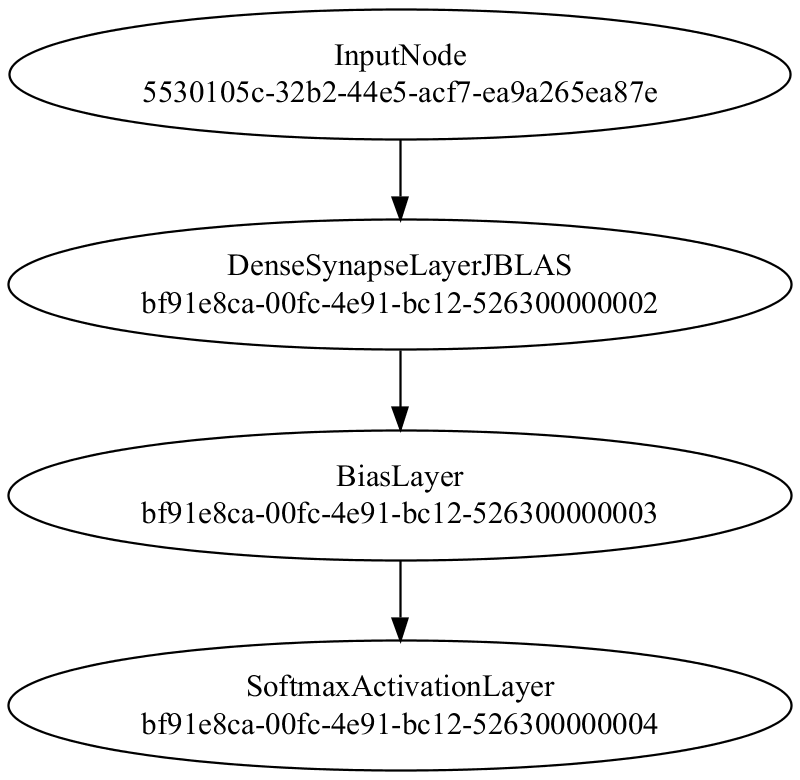

In this demo we train a simple neural network against the MNIST handwritten digit dataset

## Data
First, we load the training dataset: 

Code from [MindsEyeDemo.scala:66](../../src/test/scala/MindsEyeDemo.scala#L66) executed in 0.65 seconds: 
```java
    MNIST.trainingDataStream().iterator().asScala.toStream.map(labeledObj ⇒ {
      Array(labeledObj.data, toOutNDArray(toOut(labeledObj.label), 10))
    })
```

Returns: 

```
    Stream([Lcom.simiacryptus.util.ml.Tensor;@12c7a01b, ?)
```


And preview a few rows: 

Code from [MindsEyeDemo.scala:72](../../src/test/scala/MindsEyeDemo.scala#L72) executed in 0.28 seconds: 
```java
    TableOutput.create(data.take(10).map(testObj ⇒ Map[String,AnyRef](
      "Input1 (as Image)" → log.image(testObj(0).toGrayImage(), testObj(0).toString),
      "Input2 (as String)" → testObj(1).toString,
      "Input1 (as String)" → testObj(0).toString
    ).asJava):_*)
```

Returns: 

Input1 (as Image) | Input2 (as String) | Input1 (as String)
----------------- | ------------------ | ------------------
![[ [ [ 0.0 ],[ 0.0 ],[ 0.0 ],[ 0.0 ],[ 0.0 ],[ 0.0 ],[ 0.0 ],[ 0.0 ],... ],[ [ 0.0 ],[ 0.0 ],[ 0.0 ],[ 0.0 ],[ 0.0 ],[ 0.0 ],[ 0.0 ],[ 0.0 ],... ],[ [ 0.0 ],[ 0.0 ],[ 0.0 ],[ 0.0 ],[ 0.0 ],[ 0.0 ],[ 0.0 ],[ 0.0 ],... ],[ [ 0.0 ],[ 0.0 ],[ 0.0 ],[ 0.0 ],[ 0.0 ],[ 0.0 ],[ 0.0 ],[ 0.0 ],... ],[ [ 0.0 ],[ 0.0 ],[ 0.0 ],[ 0.0 ],[ 0.0 ],[ 0.0 ],[ 0.0 ],[ 0.0 ],... ],[ [ 0.0 ],[ 0.0 ],[ 0.0 ],[ 0.0 ],[ 0.0 ],[ 0.0 ],[ 0.0 ],[ 0.0 ],... ],[ [ 0.0 ],[ 0.0 ],[ 0.0 ],[ 0.0 ],[ 0.0 ],[ 0.0 ],[ 0.0 ],[ 0.0 ],... ],[ [ 0.0 ],[ 0.0 ],[ 0.0 ],[ 0.0 ],[ 0.0 ],[ 0.0 ],[ 0.0 ],[ 49.0 ],... ],... ]](mnist_simple.1.png)      | [ 0.0,0.0,0.0,0.0,0.0,1.0,0.0,0.0,0.0,0.0 ] | [ [ [ 0.0 ],[ 0.0 ],[ 0.0 ],[ 0.0 ],[ 0.0 ],[ 0.0 ],[ 0.0 ],[ 0.0 ],... ],[ [ 0.0 ],[ 0.0 ],[ 0.0 ],[ 0.0 ],[ 0.0 ],[ 0.0 ],[ 0.0 ],[ 0.0 ],... ],[ [ 0.0 ],[ 0.0 ],[ 0.0 ],[ 0.0 ],[ 0.0 ],[ 0.0 ],[ 0.0 ],[ 0.0 ],... ],[ [ 0.0 ],[ 0.0 ],[ 0.0 ],[ 0.0 ],[ 0.0 ],[ 0.0 ],[ 0.0 ],[ 0.0 ],... ],[ [ 0.0 ],[ 0.0 ],[ 0.0 ],[ 0.0 ],[ 0.0 ],[ 0.0 ],[ 0.0 ],[ 0.0 ],... ],[ [ 0.0 ],[ 0.0 ],[ 0.0 ],[ 0.0 ],[ 0.0 ],[ 0.0 ],[ 0.0 ],[ 0.0 ],... ],[ [ 0.0 ],[ 0.0 ],[ 0.0 ],[ 0.0 ],[ 0.0 ],[ 0.0 ],[ 0.0 ],[ 0.0 ],... ],[ [ 0.0 ],[ 0.0 ],[ 0.0 ],[ 0.0 ],[ 0.0 ],[ 0.0 ],[ 0.0 ],[ 49.0 ],... ],... ]     
![[ [ [ 0.0 ],[ 0.0 ],[ 0.0 ],[ 0.0 ],[ 0.0 ],[ 0.0 ],[ 0.0 ],[ 0.0 ],... ],[ [ 0.0 ],[ 0.0 ],[ 0.0 ],[ 0.0 ],[ 0.0 ],[ 0.0 ],[ 0.0 ],[ 0.0 ],... ],[ [ 0.0 ],[ 0.0 ],[ 0.0 ],[ 0.0 ],[ 0.0 ],[ 0.0 ],[ 0.0 ],[ 0.0 ],... ],[ [ 0.0 ],[ 0.0 ],[ 0.0 ],[ 0.0 ],[ 0.0 ],[ 0.0 ],[ 0.0 ],[ 0.0 ],... ],[ [ 0.0 ],[ 0.0 ],[ 0.0 ],[ 0.0 ],[ 0.0 ],[ 0.0 ],[ 0.0 ],[ 0.0 ],... ],[ [ 0.0 ],[ 0.0 ],[ 0.0 ],[ 0.0 ],[ 0.0 ],[ 0.0 ],[ 0.0 ],[ 0.0 ],... ],[ [ 0.0 ],[ 0.0 ],[ 0.0 ],[ 0.0 ],[ 0.0 ],[ 0.0 ],[ 0.0 ],[ 0.0 ],... ],[ [ 0.0 ],[ 0.0 ],[ 0.0 ],[ 0.0 ],[ 0.0 ],[ 0.0 ],[ 0.0 ],[ 0.0 ],... ],... ]](mnist_simple.2.png)       | [ 1.0,0.0,0.0,0.0,0.0,0.0,0.0,0.0,0.0,0.0 ] | [ [ [ 0.0 ],[ 0.0 ],[ 0.0 ],[ 0.0 ],[ 0.0 ],[ 0.0 ],[ 0.0 ],[ 0.0 ],... ],[ [ 0.0 ],[ 0.0 ],[ 0.0 ],[ 0.0 ],[ 0.0 ],[ 0.0 ],[ 0.0 ],[ 0.0 ],... ],[ [ 0.0 ],[ 0.0 ],[ 0.0 ],[ 0.0 ],[ 0.0 ],[ 0.0 ],[ 0.0 ],[ 0.0 ],... ],[ [ 0.0 ],[ 0.0 ],[ 0.0 ],[ 0.0 ],[ 0.0 ],[ 0.0 ],[ 0.0 ],[ 0.0 ],... ],[ [ 0.0 ],[ 0.0 ],[ 0.0 ],[ 0.0 ],[ 0.0 ],[ 0.0 ],[ 0.0 ],[ 0.0 ],... ],[ [ 0.0 ],[ 0.0 ],[ 0.0 ],[ 0.0 ],[ 0.0 ],[ 0.0 ],[ 0.0 ],[ 0.0 ],... ],[ [ 0.0 ],[ 0.0 ],[ 0.0 ],[ 0.0 ],[ 0.0 ],[ 0.0 ],[ 0.0 ],[ 0.0 ],... ],[ [ 0.0 ],[ 0.0 ],[ 0.0 ],[ 0.0 ],[ 0.0 ],[ 0.0 ],[ 0.0 ],[ 0.0 ],... ],... ]      
![[ [ [ 0.0 ],[ 0.0 ],[ 0.0 ],[ 0.0 ],[ 0.0 ],[ 0.0 ],[ 0.0 ],[ 0.0 ],... ],[ [ 0.0 ],[ 0.0 ],[ 0.0 ],[ 0.0 ],[ 0.0 ],[ 0.0 ],[ 0.0 ],[ 0.0 ],... ],[ [ 0.0 ],[ 0.0 ],[ 0.0 ],[ 0.0 ],[ 0.0 ],[ 0.0 ],[ 0.0 ],[ 0.0 ],... ],[ [ 0.0 ],[ 0.0 ],[ 0.0 ],[ 0.0 ],[ 0.0 ],[ 0.0 ],[ 0.0 ],[ 0.0 ],... ],[ [ 0.0 ],[ 0.0 ],[ 0.0 ],[ 0.0 ],[ 0.0 ],[ 0.0 ],[ 62.0 ],[ 126.0 ],... ],[ [ 0.0 ],[ 0.0 ],[ 0.0 ],[ 0.0 ],[ 0.0 ],[ 0.0 ],[ 81.0 ],[ 163.0 ],... ],[ [ 0.0 ],[ 0.0 ],[ 0.0 ],[ 0.0 ],[ 0.0 ],[ 0.0 ],[ 0.0 ],[ 0.0 ],... ],[ [ 0.0 ],[ 0.0 ],[ 0.0 ],[ 0.0 ],[ 0.0 ],[ 0.0 ],[ 0.0 ],[ 0.0 ],... ],... ]](mnist_simple.3.png) | [ 0.0,0.0,0.0,0.0,1.0,0.0,0.0,0.0,0.0,0.0 ] | [ [ [ 0.0 ],[ 0.0 ],[ 0.0 ],[ 0.0 ],[ 0.0 ],[ 0.0 ],[ 0.0 ],[ 0.0 ],... ],[ [ 0.0 ],[ 0.0 ],[ 0.0 ],[ 0.0 ],[ 0.0 ],[ 0.0 ],[ 0.0 ],[ 0.0 ],... ],[ [ 0.0 ],[ 0.0 ],[ 0.0 ],[ 0.0 ],[ 0.0 ],[ 0.0 ],[ 0.0 ],[ 0.0 ],... ],[ [ 0.0 ],[ 0.0 ],[ 0.0 ],[ 0.0 ],[ 0.0 ],[ 0.0 ],[ 0.0 ],[ 0.0 ],... ],[ [ 0.0 ],[ 0.0 ],[ 0.0 ],[ 0.0 ],[ 0.0 ],[ 0.0 ],[ 62.0 ],[ 126.0 ],... ],[ [ 0.0 ],[ 0.0 ],[ 0.0 ],[ 0.0 ],[ 0.0 ],[ 0.0 ],[ 81.0 ],[ 163.0 ],... ],[ [ 0.0 ],[ 0.0 ],[ 0.0 ],[ 0.0 ],[ 0.0 ],[ 0.0 ],[ 0.0 ],[ 0.0 ],... ],[ [ 0.0 ],[ 0.0 ],[ 0.0 ],[ 0.0 ],[ 0.0 ],[ 0.0 ],[ 0.0 ],[ 0.0 ],... ],... ]
![[ [ [ 0.0 ],[ 0.0 ],[ 0.0 ],[ 0.0 ],[ 0.0 ],[ 0.0 ],[ 0.0 ],[ 0.0 ],... ],[ [ 0.0 ],[ 0.0 ],[ 0.0 ],[ 0.0 ],[ 0.0 ],[ 0.0 ],[ 0.0 ],[ 0.0 ],... ],[ [ 0.0 ],[ 0.0 ],[ 0.0 ],[ 0.0 ],[ 0.0 ],[ 0.0 ],[ 0.0 ],[ 0.0 ],... ],[ [ 0.0 ],[ 0.0 ],[ 0.0 ],[ 0.0 ],[ 0.0 ],[ 0.0 ],[ 0.0 ],[ 0.0 ],... ],[ [ 0.0 ],[ 0.0 ],[ 0.0 ],[ 0.0 ],[ 0.0 ],[ 0.0 ],[ 0.0 ],[ 0.0 ],... ],[ [ 0.0 ],[ 0.0 ],[ 0.0 ],[ 0.0 ],[ 0.0 ],[ 0.0 ],[ 0.0 ],[ 0.0 ],... ],[ [ 0.0 ],[ 0.0 ],[ 0.0 ],[ 0.0 ],[ 0.0 ],[ 0.0 ],[ 0.0 ],[ 0.0 ],... ],[ [ 0.0 ],[ 0.0 ],[ 0.0 ],[ 0.0 ],[ 0.0 ],[ 0.0 ],[ 0.0 ],[ 0.0 ],... ],... ]](mnist_simple.4.png)       | [ 0.0,1.0,0.0,0.0,0.0,0.0,0.0,0.0,0.0,0.0 ] | [ [ [ 0.0 ],[ 0.0 ],[ 0.0 ],[ 0.0 ],[ 0.0 ],[ 0.0 ],[ 0.0 ],[ 0.0 ],... ],[ [ 0.0 ],[ 0.0 ],[ 0.0 ],[ 0.0 ],[ 0.0 ],[ 0.0 ],[ 0.0 ],[ 0.0 ],... ],[ [ 0.0 ],[ 0.0 ],[ 0.0 ],[ 0.0 ],[ 0.0 ],[ 0.0 ],[ 0.0 ],[ 0.0 ],... ],[ [ 0.0 ],[ 0.0 ],[ 0.0 ],[ 0.0 ],[ 0.0 ],[ 0.0 ],[ 0.0 ],[ 0.0 ],... ],[ [ 0.0 ],[ 0.0 ],[ 0.0 ],[ 0.0 ],[ 0.0 ],[ 0.0 ],[ 0.0 ],[ 0.0 ],... ],[ [ 0.0 ],[ 0.0 ],[ 0.0 ],[ 0.0 ],[ 0.0 ],[ 0.0 ],[ 0.0 ],[ 0.0 ],... ],[ [ 0.0 ],[ 0.0 ],[ 0.0 ],[ 0.0 ],[ 0.0 ],[ 0.0 ],[ 0.0 ],[ 0.0 ],... ],[ [ 0.0 ],[ 0.0 ],[ 0.0 ],[ 0.0 ],[ 0.0 ],[ 0.0 ],[ 0.0 ],[ 0.0 ],... ],... ]      
![[ [ [ 0.0 ],[ 0.0 ],[ 0.0 ],[ 0.0 ],[ 0.0 ],[ 0.0 ],[ 0.0 ],[ 0.0 ],... ],[ [ 0.0 ],[ 0.0 ],[ 0.0 ],[ 0.0 ],[ 0.0 ],[ 0.0 ],[ 0.0 ],[ 0.0 ],... ],[ [ 0.0 ],[ 0.0 ],[ 0.0 ],[ 0.0 ],[ 0.0 ],[ 0.0 ],[ 0.0 ],[ 0.0 ],... ],[ [ 0.0 ],[ 0.0 ],[ 0.0 ],[ 0.0 ],[ 0.0 ],[ 0.0 ],[ 0.0 ],[ 0.0 ],... ],[ [ 0.0 ],[ 0.0 ],[ 0.0 ],[ 0.0 ],[ 0.0 ],[ 0.0 ],[ 0.0 ],[ 0.0 ],... ],[ [ 0.0 ],[ 0.0 ],[ 0.0 ],[ 0.0 ],[ 0.0 ],[ 0.0 ],[ 0.0 ],[ 0.0 ],... ],[ [ 0.0 ],[ 0.0 ],[ 0.0 ],[ 0.0 ],[ 0.0 ],[ 0.0 ],[ 0.0 ],[ 0.0 ],... ],[ [ 0.0 ],[ 0.0 ],[ 0.0 ],[ 0.0 ],[ 0.0 ],[ 0.0 ],[ 0.0 ],[ 0.0 ],... ],... ]](mnist_simple.5.png)       | [ 0.0,0.0,0.0,0.0,0.0,0.0,0.0,0.0,0.0,1.0 ] | [ [ [ 0.0 ],[ 0.0 ],[ 0.0 ],[ 0.0 ],[ 0.0 ],[ 0.0 ],[ 0.0 ],[ 0.0 ],... ],[ [ 0.0 ],[ 0.0 ],[ 0.0 ],[ 0.0 ],[ 0.0 ],[ 0.0 ],[ 0.0 ],[ 0.0 ],... ],[ [ 0.0 ],[ 0.0 ],[ 0.0 ],[ 0.0 ],[ 0.0 ],[ 0.0 ],[ 0.0 ],[ 0.0 ],... ],[ [ 0.0 ],[ 0.0 ],[ 0.0 ],[ 0.0 ],[ 0.0 ],[ 0.0 ],[ 0.0 ],[ 0.0 ],... ],[ [ 0.0 ],[ 0.0 ],[ 0.0 ],[ 0.0 ],[ 0.0 ],[ 0.0 ],[ 0.0 ],[ 0.0 ],... ],[ [ 0.0 ],[ 0.0 ],[ 0.0 ],[ 0.0 ],[ 0.0 ],[ 0.0 ],[ 0.0 ],[ 0.0 ],... ],[ [ 0.0 ],[ 0.0 ],[ 0.0 ],[ 0.0 ],[ 0.0 ],[ 0.0 ],[ 0.0 ],[ 0.0 ],... ],[ [ 0.0 ],[ 0.0 ],[ 0.0 ],[ 0.0 ],[ 0.0 ],[ 0.0 ],[ 0.0 ],[ 0.0 ],... ],... ]      
![[ [ [ 0.0 ],[ 0.0 ],[ 0.0 ],[ 0.0 ],[ 0.0 ],[ 0.0 ],[ 0.0 ],[ 0.0 ],... ],[ [ 0.0 ],[ 0.0 ],[ 0.0 ],[ 0.0 ],[ 0.0 ],[ 0.0 ],[ 0.0 ],[ 0.0 ],... ],[ [ 0.0 ],[ 0.0 ],[ 0.0 ],[ 0.0 ],[ 0.0 ],[ 0.0 ],[ 0.0 ],[ 0.0 ],... ],[ [ 0.0 ],[ 0.0 ],[ 0.0 ],[ 0.0 ],[ 0.0 ],[ 0.0 ],[ 0.0 ],[ 0.0 ],... ],[ [ 0.0 ],[ 0.0 ],[ 0.0 ],[ 0.0 ],[ 0.0 ],[ 0.0 ],[ 0.0 ],[ 0.0 ],... ],[ [ 0.0 ],[ 0.0 ],[ 0.0 ],[ 0.0 ],[ 0.0 ],[ 0.0 ],[ 0.0 ],[ 0.0 ],... ],[ [ 0.0 ],[ 0.0 ],[ 0.0 ],[ 0.0 ],[ 0.0 ],[ 0.0 ],[ 0.0 ],[ 0.0 ],... ],[ [ 0.0 ],[ 0.0 ],[ 0.0 ],[ 0.0 ],[ 0.0 ],[ 0.0 ],[ 0.0 ],[ 0.0 ],... ],... ]](mnist_simple.6.png)       | [ 0.0,0.0,1.0,0.0,0.0,0.0,0.0,0.0,0.0,0.0 ] | [ [ [ 0.0 ],[ 0.0 ],[ 0.0 ],[ 0.0 ],[ 0.0 ],[ 0.0 ],[ 0.0 ],[ 0.0 ],... ],[ [ 0.0 ],[ 0.0 ],[ 0.0 ],[ 0.0 ],[ 0.0 ],[ 0.0 ],[ 0.0 ],[ 0.0 ],... ],[ [ 0.0 ],[ 0.0 ],[ 0.0 ],[ 0.0 ],[ 0.0 ],[ 0.0 ],[ 0.0 ],[ 0.0 ],... ],[ [ 0.0 ],[ 0.0 ],[ 0.0 ],[ 0.0 ],[ 0.0 ],[ 0.0 ],[ 0.0 ],[ 0.0 ],... ],[ [ 0.0 ],[ 0.0 ],[ 0.0 ],[ 0.0 ],[ 0.0 ],[ 0.0 ],[ 0.0 ],[ 0.0 ],... ],[ [ 0.0 ],[ 0.0 ],[ 0.0 ],[ 0.0 ],[ 0.0 ],[ 0.0 ],[ 0.0 ],[ 0.0 ],... ],[ [ 0.0 ],[ 0.0 ],[ 0.0 ],[ 0.0 ],[ 0.0 ],[ 0.0 ],[ 0.0 ],[ 0.0 ],... ],[ [ 0.0 ],[ 0.0 ],[ 0.0 ],[ 0.0 ],[ 0.0 ],[ 0.0 ],[ 0.0 ],[ 0.0 ],... ],... ]      
![[ [ [ 0.0 ],[ 0.0 ],[ 0.0 ],[ 0.0 ],[ 0.0 ],[ 0.0 ],[ 0.0 ],[ 0.0 ],... ],[ [ 0.0 ],[ 0.0 ],[ 0.0 ],[ 0.0 ],[ 0.0 ],[ 0.0 ],[ 0.0 ],[ 0.0 ],... ],[ [ 0.0 ],[ 0.0 ],[ 0.0 ],[ 0.0 ],[ 0.0 ],[ 0.0 ],[ 0.0 ],[ 0.0 ],... ],[ [ 0.0 ],[ 0.0 ],[ 0.0 ],[ 0.0 ],[ 0.0 ],[ 0.0 ],[ 0.0 ],[ 0.0 ],... ],[ [ 0.0 ],[ 0.0 ],[ 0.0 ],[ 0.0 ],[ 0.0 ],[ 0.0 ],[ 0.0 ],[ 0.0 ],... ],[ [ 0.0 ],[ 0.0 ],[ 0.0 ],[ 0.0 ],[ 0.0 ],[ 0.0 ],[ 0.0 ],[ 0.0 ],... ],[ [ 0.0 ],[ 0.0 ],[ 0.0 ],[ 0.0 ],[ 0.0 ],[ 0.0 ],[ 0.0 ],[ 0.0 ],... ],[ [ 0.0 ],[ 0.0 ],[ 0.0 ],[ 0.0 ],[ 0.0 ],[ 0.0 ],[ 0.0 ],[ 0.0 ],... ],... ]](mnist_simple.7.png)       | [ 0.0,1.0,0.0,0.0,0.0,0.0,0.0,0.0,0.0,0.0 ] | [ [ [ 0.0 ],[ 0.0 ],[ 0.0 ],[ 0.0 ],[ 0.0 ],[ 0.0 ],[ 0.0 ],[ 0.0 ],... ],[ [ 0.0 ],[ 0.0 ],[ 0.0 ],[ 0.0 ],[ 0.0 ],[ 0.0 ],[ 0.0 ],[ 0.0 ],... ],[ [ 0.0 ],[ 0.0 ],[ 0.0 ],[ 0.0 ],[ 0.0 ],[ 0.0 ],[ 0.0 ],[ 0.0 ],... ],[ [ 0.0 ],[ 0.0 ],[ 0.0 ],[ 0.0 ],[ 0.0 ],[ 0.0 ],[ 0.0 ],[ 0.0 ],... ],[ [ 0.0 ],[ 0.0 ],[ 0.0 ],[ 0.0 ],[ 0.0 ],[ 0.0 ],[ 0.0 ],[ 0.0 ],... ],[ [ 0.0 ],[ 0.0 ],[ 0.0 ],[ 0.0 ],[ 0.0 ],[ 0.0 ],[ 0.0 ],[ 0.0 ],... ],[ [ 0.0 ],[ 0.0 ],[ 0.0 ],[ 0.0 ],[ 0.0 ],[ 0.0 ],[ 0.0 ],[ 0.0 ],... ],[ [ 0.0 ],[ 0.0 ],[ 0.0 ],[ 0.0 ],[ 0.0 ],[ 0.0 ],[ 0.0 ],[ 0.0 ],... ],... ]      
![[ [ [ 0.0 ],[ 0.0 ],[ 0.0 ],[ 0.0 ],[ 0.0 ],[ 0.0 ],[ 0.0 ],[ 0.0 ],... ],[ [ 0.0 ],[ 0.0 ],[ 0.0 ],[ 0.0 ],[ 0.0 ],[ 0.0 ],[ 0.0 ],[ 0.0 ],... ],[ [ 0.0 ],[ 0.0 ],[ 0.0 ],[ 0.0 ],[ 0.0 ],[ 0.0 ],[ 0.0 ],[ 0.0 ],... ],[ [ 0.0 ],[ 0.0 ],[ 0.0 ],[ 0.0 ],[ 0.0 ],[ 0.0 ],[ 0.0 ],[ 0.0 ],... ],[ [ 0.0 ],[ 0.0 ],[ 0.0 ],[ 0.0 ],[ 0.0 ],[ 0.0 ],[ 0.0 ],[ 0.0 ],... ],[ [ 0.0 ],[ 0.0 ],[ 0.0 ],[ 0.0 ],[ 0.0 ],[ 0.0 ],[ 0.0 ],[ 0.0 ],... ],[ [ 0.0 ],[ 0.0 ],[ 0.0 ],[ 0.0 ],[ 0.0 ],[ 0.0 ],[ 0.0 ],[ 0.0 ],... ],[ [ 0.0 ],[ 0.0 ],[ 0.0 ],[ 0.0 ],[ 0.0 ],[ 0.0 ],[ 0.0 ],[ 0.0 ],... ],... ]](mnist_simple.8.png)       | [ 0.0,0.0,0.0,1.0,0.0,0.0,0.0,0.0,0.0,0.0 ] | [ [ [ 0.0 ],[ 0.0 ],[ 0.0 ],[ 0.0 ],[ 0.0 ],[ 0.0 ],[ 0.0 ],[ 0.0 ],... ],[ [ 0.0 ],[ 0.0 ],[ 0.0 ],[ 0.0 ],[ 0.0 ],[ 0.0 ],[ 0.0 ],[ 0.0 ],... ],[ [ 0.0 ],[ 0.0 ],[ 0.0 ],[ 0.0 ],[ 0.0 ],[ 0.0 ],[ 0.0 ],[ 0.0 ],... ],[ [ 0.0 ],[ 0.0 ],[ 0.0 ],[ 0.0 ],[ 0.0 ],[ 0.0 ],[ 0.0 ],[ 0.0 ],... ],[ [ 0.0 ],[ 0.0 ],[ 0.0 ],[ 0.0 ],[ 0.0 ],[ 0.0 ],[ 0.0 ],[ 0.0 ],... ],[ [ 0.0 ],[ 0.0 ],[ 0.0 ],[ 0.0 ],[ 0.0 ],[ 0.0 ],[ 0.0 ],[ 0.0 ],... ],[ [ 0.0 ],[ 0.0 ],[ 0.0 ],[ 0.0 ],[ 0.0 ],[ 0.0 ],[ 0.0 ],[ 0.0 ],... ],[ [ 0.0 ],[ 0.0 ],[ 0.0 ],[ 0.0 ],[ 0.0 ],[ 0.0 ],[ 0.0 ],[ 0.0 ],... ],... ]      
![[ [ [ 0.0 ],[ 0.0 ],[ 0.0 ],[ 0.0 ],[ 0.0 ],[ 0.0 ],[ 0.0 ],[ 0.0 ],... ],[ [ 0.0 ],[ 0.0 ],[ 0.0 ],[ 0.0 ],[ 0.0 ],[ 0.0 ],[ 0.0 ],[ 0.0 ],... ],[ [ 0.0 ],[ 0.0 ],[ 0.0 ],[ 0.0 ],[ 0.0 ],[ 0.0 ],[ 0.0 ],[ 0.0 ],... ],[ [ 0.0 ],[ 0.0 ],[ 0.0 ],[ 0.0 ],[ 0.0 ],[ 0.0 ],[ 0.0 ],[ 0.0 ],... ],[ [ 0.0 ],[ 0.0 ],[ 0.0 ],[ 0.0 ],[ 0.0 ],[ 0.0 ],[ 0.0 ],[ 0.0 ],... ],[ [ 0.0 ],[ 0.0 ],[ 0.0 ],[ 0.0 ],[ 0.0 ],[ 0.0 ],[ 0.0 ],[ 0.0 ],... ],[ [ 0.0 ],[ 0.0 ],[ 0.0 ],[ 0.0 ],[ 0.0 ],[ 0.0 ],[ 0.0 ],[ 0.0 ],... ],[ [ 0.0 ],[ 0.0 ],[ 0.0 ],[ 0.0 ],[ 0.0 ],[ 0.0 ],[ 0.0 ],[ 0.0 ],... ],... ]](mnist_simple.9.png)       | [ 0.0,1.0,0.0,0.0,0.0,0.0,0.0,0.0,0.0,0.0 ] | [ [ [ 0.0 ],[ 0.0 ],[ 0.0 ],[ 0.0 ],[ 0.0 ],[ 0.0 ],[ 0.0 ],[ 0.0 ],... ],[ [ 0.0 ],[ 0.0 ],[ 0.0 ],[ 0.0 ],[ 0.0 ],[ 0.0 ],[ 0.0 ],[ 0.0 ],... ],[ [ 0.0 ],[ 0.0 ],[ 0.0 ],[ 0.0 ],[ 0.0 ],[ 0.0 ],[ 0.0 ],[ 0.0 ],... ],[ [ 0.0 ],[ 0.0 ],[ 0.0 ],[ 0.0 ],[ 0.0 ],[ 0.0 ],[ 0.0 ],[ 0.0 ],... ],[ [ 0.0 ],[ 0.0 ],[ 0.0 ],[ 0.0 ],[ 0.0 ],[ 0.0 ],[ 0.0 ],[ 0.0 ],... ],[ [ 0.0 ],[ 0.0 ],[ 0.0 ],[ 0.0 ],[ 0.0 ],[ 0.0 ],[ 0.0 ],[ 0.0 ],... ],[ [ 0.0 ],[ 0.0 ],[ 0.0 ],[ 0.0 ],[ 0.0 ],[ 0.0 ],[ 0.0 ],[ 0.0 ],... ],[ [ 0.0 ],[ 0.0 ],[ 0.0 ],[ 0.0 ],[ 0.0 ],[ 0.0 ],[ 0.0 ],[ 0.0 ],... ],... ]      
![[ [ [ 0.0 ],[ 0.0 ],[ 0.0 ],[ 0.0 ],[ 0.0 ],[ 0.0 ],[ 0.0 ],[ 0.0 ],... ],[ [ 0.0 ],[ 0.0 ],[ 0.0 ],[ 0.0 ],[ 0.0 ],[ 0.0 ],[ 0.0 ],[ 0.0 ],... ],[ [ 0.0 ],[ 0.0 ],[ 0.0 ],[ 0.0 ],[ 0.0 ],[ 0.0 ],[ 0.0 ],[ 0.0 ],... ],[ [ 0.0 ],[ 0.0 ],[ 0.0 ],[ 0.0 ],[ 0.0 ],[ 0.0 ],[ 0.0 ],[ 0.0 ],... ],[ [ 0.0 ],[ 0.0 ],[ 0.0 ],[ 0.0 ],[ 0.0 ],[ 0.0 ],[ 0.0 ],[ 0.0 ],... ],[ [ 0.0 ],[ 0.0 ],[ 0.0 ],[ 0.0 ],[ 0.0 ],[ 0.0 ],[ 0.0 ],[ 0.0 ],... ],[ [ 0.0 ],[ 0.0 ],[ 0.0 ],[ 0.0 ],[ 0.0 ],[ 0.0 ],[ 0.0 ],[ 0.0 ],... ],[ [ 0.0 ],[ 0.0 ],[ 0.0 ],[ 0.0 ],[ 0.0 ],[ 0.0 ],[ 0.0 ],[ 0.0 ],... ],... ]](mnist_simple.10.png)      | [ 0.0,0.0,0.0,0.0,1.0,0.0,0.0,0.0,0.0,0.0 ] | [ [ [ 0.0 ],[ 0.0 ],[ 0.0 ],[ 0.0 ],[ 0.0 ],[ 0.0 ],[ 0.0 ],[ 0.0 ],... ],[ [ 0.0 ],[ 0.0 ],[ 0.0 ],[ 0.0 ],[ 0.0 ],[ 0.0 ],[ 0.0 ],[ 0.0 ],... ],[ [ 0.0 ],[ 0.0 ],[ 0.0 ],[ 0.0 ],[ 0.0 ],[ 0.0 ],[ 0.0 ],[ 0.0 ],... ],[ [ 0.0 ],[ 0.0 ],[ 0.0 ],[ 0.0 ],[ 0.0 ],[ 0.0 ],[ 0.0 ],[ 0.0 ],... ],[ [ 0.0 ],[ 0.0 ],[ 0.0 ],[ 0.0 ],[ 0.0 ],[ 0.0 ],[ 0.0 ],[ 0.0 ],... ],[ [ 0.0 ],[ 0.0 ],[ 0.0 ],[ 0.0 ],[ 0.0 ],[ 0.0 ],[ 0.0 ],[ 0.0 ],... ],[ [ 0.0 ],[ 0.0 ],[ 0.0 ],[ 0.0 ],[ 0.0 ],[ 0.0 ],[ 0.0 ],[ 0.0 ],... ],[ [ 0.0 ],[ 0.0 ],[ 0.0 ],[ 0.0 ],[ 0.0 ],[ 0.0 ],[ 0.0 ],[ 0.0 ],... ],... ]      


## Model
Here we define the logic network that we are about to train: 

Code from [MindsEyeDemo.scala:82](../../src/test/scala/MindsEyeDemo.scala#L82) executed in 0.56 seconds: 
```java
    var model: PipelineNetwork = new PipelineNetwork
    model.add(new DenseSynapseLayerJBLAS(inputSize, outputSize).setWeights(new ToDoubleFunction[Coordinate] {
      override def applyAsDouble(value: Coordinate): Double = Util.R.get.nextGaussian * 0.0
    }))
    model.add(new BiasLayer(outputSize: _*))
    model.add(new SoftmaxActivationLayer)
    model
```

Returns: 

```
    {
      "class": "PipelineNetwork",
      "id": "bf91e8ca-00fc-4e91-bc12-526300000001",
      "nodes": [
        {
          "id": {
            "class": "DenseSynapseLayerJBLAS",
            "id": "bf91e8ca-00fc-4e91-bc12-526300000002",
            "weights": "[ [ 0.0,-0.0,-0.0,-0.0,-0.0,-0.0,0.0,-0.0,-0.0,-0.0 ],[ -0.0,0.0,-0.0,0.0,-0.0,0.0,0.0,0.0,0.0,-0.0 ],[ 0.0,-0.0,0.0,0.0,0.0,0.0,-0.0,-0.0,0.0,0.0 ],[ -0.0,-0.0,0.0,0.0,-0.0,0.0,0.0,-0.0,0.0,-0.0 ],[ -0.0,-0.0,0.0,0.0,-0.0,-0.0,0.0,-0.0,0.0,-0.0 ],[ -0.0,-0.0,0.0,-0.0,-0.0,0.0,-0.0,-0.0,0.0,-0.0 ],[ 0.0,-0.0,-0.0,-0.0,0.0,0.0,0.0,0.0,-0.0,-0.0 ],[ -0.0,-0.0,-0.0,0.0,-0.0,-0.0,0.0,-0.0,-0.0,-0.0 ],... ]"
          },
          "prev0": {
            "target": "[5530105c-32b2-44e5-acf7-ea9a265ea87e]"
          }
        },
        {
          "id": {
            "class": "BiasLayer",
            "id": "bf91e8ca-00fc-4e91-bc12-526300000003",
            "bias": "[0.0, 0.0, 0.0, 0.0, 0.0, 0.0, 0.0, 0.0, 0.0, 0.0]"
          },
          "prev0": {
            "id": {
              "class": "DenseSynapseLayerJBLAS",
              "id": "bf91e8ca-00fc-4e91-bc12-526300000002",
              "weights": "[ [ 0.0,-0.0,-0.0,-0.0,-0.0,-0.0,0.0,-0.0,-0.0,-0.0 ],[ -0.0,0.0,-0.0,0.0,-0.0,0.0,0.0,0.0,0.0,-0.0 ],[ 0.0,-0.0,0.0,0.0,0.0,0.0,-0.0,-0.0,0.0,0.0 ],[ -0.0,-0.0,0.0,0.0,-0.0,0.0,0.0,-0.0,0.0,-0.0 ],[ -0.0,-0.0,0.0,0.0,-0.0,-0.0,0.0,-0.0,0.0,-0.0 ],[ -0.0,-0.0,0.0,-0.0,-0.0,0.0,-0.0,-0.0,0.0,-0.0 ],[ 0.0,-0.0,-0.0,-0.0,0.0,0.0,0.0,0.0,-0.0,-0.0 ],[ -0.0,-0.0,-0.0,0.0,-0.0,-0.0,0.0,-0.0,-0.0,-0.0 ],... ]"
            },
            "prev0": {
              "target": "[5530105c-32b2-44e5-acf7-ea9a265ea87e]"
            }
          }
        },
        {
          "id": {
            "class": "SoftmaxActivationLayer",
            "id": "bf91e8ca-00fc-4e91-bc12-526300000004"
          },
          "prev0": {
            "id": {
              "class": "BiasLayer",
              "id": "bf91e8ca-00fc-4e91-bc12-526300000003",
              "bias": "[0.0, 0.0, 0.0, 0.0, 0.0, 0.0, 0.0, 0.0, 0.0, 0.0]"
            },
            "prev0": {
              "id": {
                "class": "DenseSynapseLayerJBLAS",
                "id": "bf91e8ca-00fc-4e91-bc12-526300000002",
                "weights": "[ [ 0.0,-0.0,-0.0,-0.0,-0.0,-0.0,0.0,-0.0,-0.0,-0.0 ],[ -0.0,0.0,-0.0,0.0,-0.0,0.0,0.0,0.0,0.0,-0.0 ],[ 0.0,-0.0,0.0,0.0,0.0,0.0,-0.0,-0.0,0.0,0.0 ],[ -0.0,-0.0,0.0,0.0,-0.0,0.0,0.0,-0.0,0.0,-0.0 ],[ -0.0,-0.0,0.0,0.0,-0.0,-0.0,0.0,-0.0,0.0,-0.0 ],[ -0.0,-0.0,0.0,-0.0,-0.0,0.0,-0.0,-0.0,0.0,-0.0 ],[ 0.0,-0.0,-0.0,-0.0,0.0,0.0,0.0,0.0,-0.0,-0.0 ],[ -0.0,-0.0,-0.0,0.0,-0.0,-0.0,0.0,-0.0,-0.0,-0.0 ],... ]"
              },
              "prev0": {
                "target": "[5530105c-32b2-44e5-acf7-ea9a265ea87e]"
              }
            }
          }
        }
      ],
      "root": {
        "id": {
          "class": "SoftmaxActivationLayer",
          "id": "bf91e8ca-00fc-4e91-bc12-526300000004"
        },
        "prev0": {
          "id": {
            "class": "BiasLayer",
            "id": "bf91e8ca-00fc-4e91-bc12-526300000003",
            "bias": "[0.0, 0.0, 0.0, 0.0, 0.0, 0.0, 0.0, 0.0, 0.0, 0.0]"
          },
          "prev0": {
            "id": {
              "class": "DenseSynapseLayerJBLAS",
              "id": "bf91e8ca-00fc-4e91-bc12-526300000002",
              "weights": "[ [ 0.0,-0.0,-0.0,-0.0,-0.0,-0.0,0.0,-0.0,-0.0,-0.0 ],[ -0.0,0.0,-0.0,0.0,-0.0,0.0,0.0,0.0,0.0,-0.0 ],[ 0.0,-0.0,0.0,0.0,0.0,0.0,-0.0,-0.0,0.0,0.0 ],[ -0.0,-0.0,0.0,0.0,-0.0,0.0,0.0,-0.0,0.0,-0.0 ],[ -0.0,-0.0,0.0,0.0,-0.0,-0.0,0.0,-0.0,0.0,-0.0 ],[ -0.0,-0.0,0.0,-0.0,-0.0,0.0,-0.0,-0.0,0.0,-0.0 ],[ 0.0,-0.0,-0.0,-0.0,0.0,0.0,0.0,0.0,-0.0,-0.0 ],[ -0.0,-0.0,-0.0,0.0,-0.0,-0.0,0.0,-0.0,-0.0,-0.0 ],... ]"
            },
            "prev0": {
              "target": "[5530105c-32b2-44e5-acf7-ea9a265ea87e]"
            }
          }
        }
      }
    }
```


We can visualize this network as a graph: 

Code from [MindsEyeDemo.scala:493](../../src/test/scala/MindsEyeDemo.scala#L493) executed in 6.12 seconds: 
```java
    Graphviz.fromGraph(toGraph(network)).width(width).render(Format.PNG).toImage
```

Returns: 




We encapsulate our model network within a supervisory network that applies a loss function: 

Code from [MindsEyeDemo.scala:94](../../src/test/scala/MindsEyeDemo.scala#L94) executed in 0.00 seconds: 
```java
    new SupervisedNetwork(model, new EntropyLossLayer)
```

Returns: 

```
    {
      "class": "SupervisedNetwork",
      "id": "bf91e8ca-00fc-4e91-bc12-526300000006",
      "nodes": [
        {
          "id": {
            "class": "PipelineNetwork",
            "id": "bf91e8ca-00fc-4e91-bc12-526300000001",
            "nodes": [
              {
                "id": {
                  "class": "DenseSynapseLayerJBLAS",
                  "id": "bf91e8ca-00fc-4e91-bc12-526300000002",
                  "weights": "[ [ 0.0,-0.0,-0.0,-0.0,-0.0,-0.0,0.0,-0.0,-0.0,-0.0 ],[ -0.0,0.0,-0.0,0.0,-0.0,0.0,0.0,0.0,0.0,-0.0 ],[ 0.0,-0.0,0.0,0.0,0.0,0.0,-0.0,-0.0,0.0,0.0 ],[ -0.0,-0.0,0.0,0.0,-0.0,0.0,0.0,-0.0,0.0,-0.0 ],[ -0.0,-0.0,0.0,0.0,-0.0,-0.0,0.0,-0.0,0.0,-0.0 ],[ -0.0,-0.0,0.0,-0.0,-0.0,0.0,-0.0,-0.0,0.0,-0.0 ],[ 0.0,-0.0,-0.0,-0.0,0.0,0.0,0.0,0.0,-0.0,-0.0 ],[ -0.0,-0.0,-0.0,0.0,-0.0,-0.0,0.0,-0.0,-0.0,-0.0 ],... ]"
                },
                "prev0": {
                  "target": "[5530105c-32b2-44e5-acf7-ea9a265ea87e]"
                }
              },
              {
                "id": {
                  "class": "BiasLayer",
                  "id": "bf91e8ca-00fc-4e91-bc12-526300000003",
                  "bias": "[0.0, 0.0, 0.0, 0.0, 0.0, 0.0, 0.0, 0.0, 0.0, 0.0]"
                },
                "prev0": {
                  "id": {
                    "class": "DenseSynapseLayerJBLAS",
                    "id": "bf91e8ca-00fc-4e91-bc12-526300000002",
                    "weights": "[ [ 0.0,-0.0,-0.0,-0.0,-0.0,-0.0,0.0,-0.0,-0.0,-0.0 ],[ -0.0,0.0,-0.0,0.0,-0.0,0.0,0.0,0.0,0.0,-0.0 ],[ 0.0,-0.0,0.0,0.0,0.0,0.0,-0.0,-0.0,0.0,0.0 ],[ -0.0,-0.0,0.0,0.0,-0.0,0.0,0.0,-0.0,0.0,-0.0 ],[ -0.0,-0.0,0.0,0.0,-0.0,-0.0,0.0,-0.0,0.0,-0.0 ],[ -0.0,-0.0,0.0,-0.0,-0.0,0.0,-0.0,-0.0,0.0,-0.0 ],[ 0.0,-0.0,-0.0,-0.0,0.0,0.0,0.0,0.0,-0.0,-0.0 ],[ -0.0,-0.0,-0.0,0.0,-0.0,-0.0,0.0,-0.0,-0.0,-0.0 ],... ]"
                  },
                  "prev0": {
                    "target": "[5530105c-32b2-44e5-acf7-ea9a265ea87e]"
                  }
                }
              },
              {
                "id": {
                  "class": "SoftmaxActivationLayer",
                  "id": "bf91e8ca-00fc-4e91-bc12-526300000004"
                },
                "prev0": {
                  "id": {
                    "class": "BiasLayer",
                    "id": "bf91e8ca-00fc-4e91-bc12-526300000003",
                    "bias": "[0.0, 0.0, 0.0, 0.0, 0.0, 0.0, 0.0, 0.0, 0.0, 0.0]"
                  },
                  "prev0": {
                    "id": {
                      "class": "DenseSynapseLayerJBLAS",
                      "id": "bf91e8ca-00fc-4e91-bc12-526300000002",
                      "weights": "[ [ 0.0,-0.0,-0.0,-0.0,-0.0,-0.0,0.0,-0.0,-0.0,-0.0 ],[ -0.0,0.0,-0.0,0.0,-0.0,0.0,0.0,0.0,0.0,-0.0 ],[ 0.0,-0.0,0.0,0.0,0.0,0.0,-0.0,-0.0,0.0,0.0 ],[ -0.0,-0.0,0.0,0.0,-0.0,0.0,0.0,-0.0,0.0,-0.0 ],[ -0.0,-0.0,0.0,0.0,-0.0,-0.0,0.0,-0.0,0.0,-0.0 ],[ -0.0,-0.0,0.0,-0.0,-0.0,0.0,-0.0,-0.0,0.0,-0.0 ],[ 0.0,-0.0,-0.0,-0.0,0.0,0.0,0.0,0.0,-0.0,-0.0 ],[ -0.0,-0.0,-0.0,0.0,-0.0,-0.0,0.0,-0.0,-0.0,-0.0 ],... ]"
                    },
                    "prev0": {
                      "target": "[5530105c-32b2-44e5-acf7-ea9a265ea87e]"
                    }
                  }
                }
              }
            ],
            "root": {
              "id": {
                "class": "SoftmaxActivationLayer",
                "id": "bf91e8ca-00fc-4e91-bc12-526300000004"
              },
              "prev0": {
                "id": {
                  "class": "BiasLayer",
                  "id": "bf91e8ca-00fc-4e91-bc12-526300000003",
                  "bias": "[0.0, 0.0, 0.0, 0.0, 0.0, 0.0, 0.0, 0.0, 0.0, 0.0]"
                },
                "prev0": {
                  "id": {
                    "class": "DenseSynapseLayerJBLAS",
                    "id": "bf91e8ca-00fc-4e91-bc12-526300000002",
                    "weights": "[ [ 0.0,-0.0,-0.0,-0.0,-0.0,-0.0,0.0,-0.0,-0.0,-0.0 ],[ -0.0,0.0,-0.0,0.0,-0.0,0.0,0.0,0.0,0.0,-0.0 ],[ 0.0,-0.0,0.0,0.0,0.0,0.0,-0.0,-0.0,0.0,0.0 ],[ -0.0,-0.0,0.0,0.0,-0.0,0.0,0.0,-0.0,0.0,-0.0 ],[ -0.0,-0.0,0.0,0.0,-0.0,-0.0,0.0,-0.0,0.0,-0.0 ],[ -0.0,-0.0,0.0,-0.0,-0.0,0.0,-0.0,-0.0,0.0,-0.0 ],[ 0.0,-0.0,-0.0,-0.0,0.0,0.0,0.0,0.0,-0.0,-0.0 ],[ -0.0,-0.0,-0.0,0.0,-0.0,-0.0,0.0,-0.0,-0.0,-0.0 ],... ]"
                  },
                  "prev0": {
                    "target": "[5530105c-32b2-44e5-acf7-ea9a265ea87e]"
                  }
                }
              }
            }
          },
          "prev0": {
            "target": "[9c45c82c-ca52-4faa-af1f-b12d7982fab3, d4a94ea4-18bc-48a0-b26e-00c85c30247f]"
          }
        },
        {
          "id": {
            "class": "EntropyLossLayer",
            "id": "bf91e8ca-00fc-4e91-bc12-526300000005"
          },
          "prev0": {
            "id": {
              "class": "PipelineNetwork",
              "id": "bf91e8ca-00fc-4e91-bc12-526300000001",
              "nodes": [
                {
                  "id": {
                    "class": "DenseSynapseLayerJBLAS",
                    "id": "bf91e8ca-00fc-4e91-bc12-526300000002",
                    "weights": "[ [ 0.0,-0.0,-0.0,-0.0,-0.0,-0.0,0.0,-0.0,-0.0,-0.0 ],[ -0.0,0.0,-0.0,0.0,-0.0,0.0,0.0,0.0,0.0,-0.0 ],[ 0.0,-0.0,0.0,0.0,0.0,0.0,-0.0,-0.0,0.0,0.0 ],[ -0.0,-0.0,0.0,0.0,-0.0,0.0,0.0,-0.0,0.0,-0.0 ],[ -0.0,-0.0,0.0,0.0,-0.0,-0.0,0.0,-0.0,0.0,-0.0 ],[ -0.0,-0.0,0.0,-0.0,-0.0,0.0,-0.0,-0.0,0.0,-0.0 ],[ 0.0,-0.0,-0.0,-0.0,0.0,0.0,0.0,0.0,-0.0,-0.0 ],[ -0.0,-0.0,-0.0,0.0,-0.0,-0.0,0.0,-0.0,-0.0,-0.0 ],... ]"
                  },
                  "prev0": {
                    "target": "[5530105c-32b2-44e5-acf7-ea9a265ea87e]"
                  }
                },
                {
                  "id": {
                    "class": "BiasLayer",
                    "id": "bf91e8ca-00fc-4e91-bc12-526300000003",
                    "bias": "[0.0, 0.0, 0.0, 0.0, 0.0, 0.0, 0.0, 0.0, 0.0, 0.0]"
                  },
                  "prev0": {
                    "id": {
                      "class": "DenseSynapseLayerJBLAS",
                      "id": "bf91e8ca-00fc-4e91-bc12-526300000002",
                      "weights": "[ [ 0.0,-0.0,-0.0,-0.0,-0.0,-0.0,0.0,-0.0,-0.0,-0.0 ],[ -0.0,0.0,-0.0,0.0,-0.0,0.0,0.0,0.0,0.0,-0.0 ],[ 0.0,-0.0,0.0,0.0,0.0,0.0,-0.0,-0.0,0.0,0.0 ],[ -0.0,-0.0,0.0,0.0,-0.0,0.0,0.0,-0.0,0.0,-0.0 ],[ -0.0,-0.0,0.0,0.0,-0.0,-0.0,0.0,-0.0,0.0,-0.0 ],[ -0.0,-0.0,0.0,-0.0,-0.0,0.0,-0.0,-0.0,0.0,-0.0 ],[ 0.0,-0.0,-0.0,-0.0,0.0,0.0,0.0,0.0,-0.0,-0.0 ],[ -0.0,-0.0,-0.0,0.0,-0.0,-0.0,0.0,-0.0,-0.0,-0.0 ],... ]"
                    },
                    "prev0": {
                      "target": "[5530105c-32b2-44e5-acf7-ea9a265ea87e]"
                    }
                  }
                },
                {
                  "id": {
                    "class": "SoftmaxActivationLayer",
                    "id": "bf91e8ca-00fc-4e91-bc12-526300000004"
                  },
                  "prev0": {
                    "id": {
                      "class": "BiasLayer",
                      "id": "bf91e8ca-00fc-4e91-bc12-526300000003",
                      "bias": "[0.0, 0.0, 0.0, 0.0, 0.0, 0.0, 0.0, 0.0, 0.0, 0.0]"
                    },
                    "prev0": {
                      "id": {
                        "class": "DenseSynapseLayerJBLAS",
                        "id": "bf91e8ca-00fc-4e91-bc12-526300000002",
                        "weights": "[ [ 0.0,-0.0,-0.0,-0.0,-0.0,-0.0,0.0,-0.0,-0.0,-0.0 ],[ -0.0,0.0,-0.0,0.0,-0.0,0.0,0.0,0.0,0.0,-0.0 ],[ 0.0,-0.0,0.0,0.0,0.0,0.0,-0.0,-0.0,0.0,0.0 ],[ -0.0,-0.0,0.0,0.0,-0.0,0.0,0.0,-0.0,0.0,-0.0 ],[ -0.0,-0.0,0.0,0.0,-0.0,-0.0,0.0,-0.0,0.0,-0.0 ],[ -0.0,-0.0,0.0,-0.0,-0.0,0.0,-0.0,-0.0,0.0,-0.0 ],[ 0.0,-0.0,-0.0,-0.0,0.0,0.0,0.0,0.0,-0.0,-0.0 ],[ -0.0,-0.0,-0.0,0.0,-0.0,-0.0,0.0,-0.0,-0.0,-0.0 ],... ]"
                      },
                      "prev0": {
                        "target": "[5530105c-32b2-44e5-acf7-ea9a265ea87e]"
                      }
                    }
                  }
                }
              ],
              "root": {
           ... and 1427 more bytes
```


With a the following component graph: 

Code from [MindsEyeDemo.scala:493](../../src/test/scala/MindsEyeDemo.scala#L493) executed in 0.34 seconds: 
```java
    Graphviz.fromGraph(toGraph(network)).width(width).render(Format.PNG).toImage
```

Returns: 


Note that this visualization does not expand DAGNetworks recursively

## Training
We train using a standard iterative L-BFGS strategy: 

Code from [MindsEyeDemo.scala:104](../../src/test/scala/MindsEyeDemo.scala#L104) executed in 2.57 seconds: 
```java
    val trainable = new StochasticArrayTrainable(data.toArray, trainingNetwork, 1000)
    val trainer = new com.simiacryptus.mindseye.opt.IterativeTrainer(trainable)
    trainer.setMonitor(new TrainingMonitor {
      override def log(msg: String): Unit = {
        System.err.println(msg)
      }
```

Returns: 

```
    com.simiacryptus.mindseye.opt.IterativeTrainer@3db432c2
```


Code from [MindsEyeDemo.scala:120](../../src/test/scala/MindsEyeDemo.scala#L120) executed in 60.02 seconds: 
```java
    trainer.run()
```

Returns: 

```
    NaN
```


After training, we have the following parameterized model: 

Code from [MindsEyeDemo.scala:124](../../src/test/scala/MindsEyeDemo.scala#L124) executed in 0.08 seconds: 
```java
    model.toString
```

Returns: 

```
    {
      "class": "PipelineNetwork",
      "id": "bf91e8ca-00fc-4e91-bc12-526300000001",
      "nodes": [
        {
          "id": {
            "class": "DenseSynapseLayerJBLAS",
            "id": "bf91e8ca-00fc-4e91-bc12-526300000002",
            "weights": "[ [ 0.0,-1.009879975053083E-5,6.30940812644741E-4,5.12531326227992E-4,-1.0474280110168185E-4,-5.0950569977269764E-8,-1.787624413843852E-4,-2.1488303382594066E-4,3.7865558130937405E-4,-1.1582669332254549E-5 ],[ 0.0,-1.2808673507324134E-5,-0.0012237384675292961,-1.0568877464843547E-4,4.981294097901445E-4,-8.66211619321798E-10,5.456574456704503E-5,-3.7598865879400514E-4,8.655471023435605E-5,2.734318120815831E-4 ],[ 0.0,1.0717301982046677E-4,5.531313708906385E-4,-6.943619112254693E-4,3.639082338350587E-4,-9.631100187293047E-9,3.1318239903313207E-4,6.43921064408481E-5,-3.450807332617889E-4,-1.9290235538036734E-4 ],[ 0.0,-2.0896638986253413E-6,-2.6043470745177325E-4,5.300932621474937E-4,4.3371584630169E-4,-1.3365010197508765E-6,1.6236471585130694E-4,-2.0517580206119436E-4,4.3710991740235144E-4,1.2847313267044344E-4 ],[ 0.0,-1.082944602900095E-5,8.002409208799988E-4,-5.3392179169169E-4,-8.254562855672439E-5,-3.495009038542635E-8,-7.15609627887374E-4,3.530496904785354E-4,-1.2161702291437019E-4,-7.727661090831677E-5 ],[ 0.0,-4.454890957271382E-6,2.9090310224582054E-5,9.281645796594619E-4,-2.617413493632668E-4,4.429345842118379E-6,-7.051783821411013E-4,8.08310410721123E-4,-3.784370326728638E-4,-7.756070154857712E-5 ],[ 0.0,-3.500441407819064E-6,4.9812647097740826E-5,6.182253981619236E-5,-8.435945555697601E-4,-8.196686554094499E-8,5.21325903812586E-4,-4.499063433774768E-4,2.4927933581807385E-4,-1.622917153567802E-4 ],[ 0.0,-3.249717537178003E-6,3.115495723869996E-4,-7.652832312925416E-5,-7.731065106520561E-4,-3.6272383640970704E-8,-2.1419599332185959E-4,5.88215445197886E-5,-4.630641077921525E-4,2.001102977390358E-4 ],... ]"
          },
          "prev0": {
            "target": "[5530105c-32b2-44e5-acf7-ea9a265ea87e]"
          }
        },
        {
          "id": {
            "class": "BiasLayer",
            "id": "bf91e8ca-00fc-4e91-bc12-526300000003",
            "bias": "[-6.904128402539049E-6, 6.8285603866025295E-6, 2.430652891675485E-6, -5.217878140951031E-6, 1.2505503831735042E-6, 2.7756062399963147E-5, -1.2574016383153108E-6, 1.1588557763492702E-5, -3.1807101301021854E-5, -4.667874342080046E-6]"
          },
          "prev0": {
            "id": {
              "class": "DenseSynapseLayerJBLAS",
              "id": "bf91e8ca-00fc-4e91-bc12-526300000002",
              "weights": "[ [ 0.0,-1.009879975053083E-5,6.30940812644741E-4,5.12531326227992E-4,-1.0474280110168185E-4,-5.0950569977269764E-8,-1.787624413843852E-4,-2.1488303382594066E-4,3.7865558130937405E-4,-1.1582669332254549E-5 ],[ 0.0,-1.2808673507324134E-5,-0.0012237384675292961,-1.0568877464843547E-4,4.981294097901445E-4,-8.66211619321798E-10,5.456574456704503E-5,-3.7598865879400514E-4,8.655471023435605E-5,2.734318120815831E-4 ],[ 0.0,1.0717301982046677E-4,5.531313708906385E-4,-6.943619112254693E-4,3.639082338350587E-4,-9.631100187293047E-9,3.1318239903313207E-4,6.43921064408481E-5,-3.450807332617889E-4,-1.9290235538036734E-4 ],[ 0.0,-2.0896638986253413E-6,-2.6043470745177325E-4,5.300932621474937E-4,4.3371584630169E-4,-1.3365010197508765E-6,1.6236471585130694E-4,-2.0517580206119436E-4,4.3710991740235144E-4,1.2847313267044344E-4 ],[ 0.0,-1.082944602900095E-5,8.002409208799988E-4,-5.3392179169169E-4,-8.254562855672439E-5,-3.495009038542635E-8,-7.15609627887374E-4,3.530496904785354E-4,-1.2161702291437019E-4,-7.727661090831677E-5 ],[ 0.0,-4.454890957271382E-6,2.9090310224582054E-5,9.281645796594619E-4,-2.617413493632668E-4,4.429345842118379E-6,-7.051783821411013E-4,8.08310410721123E-4,-3.784370326728638E-4,-7.756070154857712E-5 ],[ 0.0,-3.500441407819064E-6,4.9812647097740826E-5,6.182253981619236E-5,-8.435945555697601E-4,-8.196686554094499E-8,5.21325903812586E-4,-4.499063433774768E-4,2.4927933581807385E-4,-1.622917153567802E-4 ],[ 0.0,-3.249717537178003E-6,3.115495723869996E-4,-7.652832312925416E-5,-7.731065106520561E-4,-3.6272383640970704E-8,-2.1419599332185959E-4,5.88215445197886E-5,-4.630641077921525E-4,2.001102977390358E-4 ],... ]"
            },
            "prev0": {
              "target": "[5530105c-32b2-44e5-acf7-ea9a265ea87e]"
            }
          }
        },
        {
          "id": {
            "class": "SoftmaxActivationLayer",
            "id": "bf91e8ca-00fc-4e91-bc12-526300000004"
          },
          "prev0": {
            "id": {
              "class": "BiasLayer",
              "id": "bf91e8ca-00fc-4e91-bc12-526300000003",
              "bias": "[-6.904128402539049E-6, 6.8285603866025295E-6, 2.430652891675485E-6, -5.217878140951031E-6, 1.2505503831735042E-6, 2.7756062399963147E-5, -1.2574016383153108E-6, 1.1588557763492702E-5, -3.1807101301021854E-5, -4.667874342080046E-6]"
            },
            "prev0": {
              "id": {
                "class": "DenseSynapseLayerJBLAS",
                "id": "bf91e8ca-00fc-4e91-bc12-526300000002",
                "weights": "[ [ 0.0,-1.009879975053083E-5,6.30940812644741E-4,5.12531326227992E-4,-1.0474280110168185E-4,-5.0950569977269764E-8,-1.787624413843852E-4,-2.1488303382594066E-4,3.7865558130937405E-4,-1.1582669332254549E-5 ],[ 0.0,-1.2808673507324134E-5,-0.0012237384675292961,-1.0568877464843547E-4,4.981294097901445E-4,-8.66211619321798E-10,5.456574456704503E-5,-3.7598865879400514E-4,8.655471023435605E-5,2.734318120815831E-4 ],[ 0.0,1.0717301982046677E-4,5.531313708906385E-4,-6.943619112254693E-4,3.639082338350587E-4,-9.631100187293047E-9,3.1318239903313207E-4,6.43921064408481E-5,-3.450807332617889E-4,-1.9290235538036734E-4 ],[ 0.0,-2.0896638986253413E-6,-2.6043470745177325E-4,5.300932621474937E-4,4.3371584630169E-4,-1.3365010197508765E-6,1.6236471585130694E-4,-2.0517580206119436E-4,4.3710991740235144E-4,1.2847313267044344E-4 ],[ 0.0,-1.082944602900095E-5,8.002409208799988E-4,-5.3392179169169E-4,-8.254562855672439E-5,-3.495009038542635E-8,-7.15609627887374E-4,3.530496904785354E-4,-1.2161702291437019E-4,-7.727661090831677E-5 ],[ 0.0,-4.454890957271382E-6,2.9090310224582054E-5,9.281645796594619E-4,-2.617413493632668E-4,4.429345842118379E-6,-7.051783821411013E-4,8.08310410721123E-4,-3.784370326728638E-4,-7.756070154857712E-5 ],[ 0.0,-3.500441407819064E-6,4.9812647097740826E-5,6.182253981619236E-5,-8.435945555697601E-4,-8.196686554094499E-8,5.21325903812586E-4,-4.499063433774768E-4,2.4927933581807385E-4,-1.622917153567802E-4 ],[ 0.0,-3.249717537178003E-6,3.115495723869996E-4,-7.652832312925416E-5,-7.731065106520561E-4,-3.6272383640970704E-8,-2.1419599332185959E-4,5.88215445197886E-5,-4.630641077921525E-4,2.001102977390358E-4 ],... ]"
              },
              "prev0": {
                "target": "[5530105c-32b2-44e5-acf7-ea9a265ea87e]"
              }
            }
          }
        }
      ],
      "root": {
        "id": {
          "class": "SoftmaxActivationLayer",
          "id": "bf91e8ca-00fc-4e91-bc12-526300000004"
        },
        "prev0": {
          "id": {
            "class": "BiasLayer",
            "id": "bf91e8ca-00fc-4e91-bc12-526300000003",
            "bias": "[-6.904128402539049E-6, 6.8285603866025295E-6, 2.430652891675485E-6, -5.217878140951031E-6, 1.2505503831735042E-6, 2.7756062399963147E-5, -1.2574016383153108E-6, 1.1588557763492702E-5, -3.1807101301021854E-5, -4.667874342080046E-6]"
          },
          "prev0": {
            "id": {
              "class": "DenseSynapseLayerJBLAS",
              "id": "bf91e8ca-00fc-4e91-bc12-526300000002",
              "weights": "[ [ 0.0,-1.009879975053083E-5,6.30940812644741E-4,5.12531326227992E-4,-1.0474280110168185E-4,-5.0950569977269764E-8,-1.787624413843852E-4,-2.1488303382594066E-4,3.7865558130937405E-4,-1.1582669332254549E-5 ],[ 0.0,-1.2808673507324134E-5,-0.0012237384675292961,-1.0568877464843547E-4,4.981294097901445E-4,-8.66211619321798E-10,5.456574456704503E-5,-3.7598865879400514E-4,8.655471023435605E-5,2.734318120815831E-4 ],[ 0.0,1.0717301982046677E-4,5.531313708906385E-4,-6.943619112254693E-4,3.639082338350587E-4,-9.631100187293047E-9,3.1318239903313207E-4,6.43921064... and 1233 more bytes
```


A summary of the training timeline: 

Code from [MindsEyeDemo.scala:456](../../src/test/scala/MindsEyeDemo.scala#L456) executed in 0.01 seconds: 
```java
    val step = Math.max(Math.pow(10,Math.ceil(Math.log(history.size) / Math.log(10))-2), 1).toInt
    TableOutput.create(history.filter(0==_.iteration%step).map(state ⇒
      Map[String, AnyRef](
        "iteration" → state.iteration.toInt.asInstanceOf[Integer],
        "time" → state.time.toDouble.asInstanceOf[lang.Double],
        "fitness" → state.point.value.toDouble.asInstanceOf[lang.Double]
      ).asJava
    ): _*)
```

Returns: 

iteration | time | fitness
--------- | ---- | -------
     0 | 1494099485072.0000 | 1.6329
    10 | 1494099486265.0000 | 0.5087
    20 | 1494099487306.0000 | 0.5181
    30 | 1494099488065.0000 | 0.4441
    40 | 1494099488949.0000 | 0.3989
    50 | 1494099489620.0000 | 0.4191
    60 | 1494099490309.0000 | 0.4260
    70 | 1494099490990.0000 | 0.4254
    80 | 1494099491677.0000 | 0.3935
    90 | 1494099492358.0000 | 0.4242
   100 | 1494099493028.0000 | 0.3794
   110 | 1494099493706.0000 | 0.3724
   120 | 1494099494377.0000 | 0.4131
   130 | 1494099495052.0000 | 0.3563
   140 | 1494099495747.0000 | 0.3775
   150 | 1494099496412.0000 | 0.3546
   160 | 1494099497089.0000 | 0.3070
   170 | 1494099497759.0000 | 0.3680
   180 | 1494099498458.0000 | 0.3717
   190 | 1494099499153.0000 | 0.3305
   200 | 1494099499841.0000 | 0.3786
   210 | 1494099500527.0000 | 0.3502
   220 | 1494099501187.0000 | 0.3457
   230 | 1494099501875.0000 | 0.3727
   240 | 1494099502525.0000 | 0.3651
   250 | 1494099503216.0000 | 0.3156
   260 | 1494099503892.0000 | 0.3285
   270 | 1494099504571.0000 | 0.3287
   280 | 1494099505222.0000 | 0.3400
   290 | 1494099505981.0000 | 0.3380
   300 | 1494099506716.0000 | 0.3101
   310 | 1494099507427.0000 | 0.3282
   320 | 1494099508125.0000 | 0.3446
   330 | 1494099508865.0000 | 0.3076
   340 | 1494099509567.0000 | 0.3125
   350 | 1494099510283.0000 | 0.3304
   360 | 1494099510995.0000 | 0.3282
   370 | 1494099511694.0000 | 0.3848
   380 | 1494099512446.0000 | 0.3163
   390 | 1494099513187.0000 | 0.3332
   400 | 1494099513915.0000 | 0.3345
   410 | 1494099514574.0000 | 0.3165
   420 | 1494099515266.0000 | 0.3263
   430 | 1494099515924.0000 | 0.3333
   440 | 1494099516609.0000 | 0.3327
   450 | 1494099517262.0000 | 0.3182
   460 | 1494099517942.0000 | 0.3044
   470 | 1494099518597.0000 | 0.2965
   480 | 1494099519271.0000 | 0.3053
   490 | 1494099519931.0000 | 0.3579
   500 | 1494099520601.0000 | 0.3056
   510 | 1494099521258.0000 | 0.3232
   520 | 1494099521949.0000 | 0.3165
   530 | 1494099522596.0000 | 0.3643
   540 | 1494099523264.0000 | 0.3066
   550 | 1494099523925.0000 | 0.3051
   560 | 1494099524589.0000 | 0.2740
   570 | 1494099525236.0000 | 0.3623
   580 | 1494099525911.0000 | 0.3224
   590 | 1494099526558.0000 | 0.3095
   600 | 1494099527239.0000 | 0.3175
   610 | 1494099527901.0000 | 0.3213
   620 | 1494099528567.0000 | 0.3357
   630 | 1494099529216.0000 | 0.3080
   640 | 1494099529910.0000 | 0.3115
   650 | 1494099530619.0000 | 0.2874
   660 | 1494099531294.0000 | 0.3213
   670 | 1494099531986.0000 | 0.2779
   680 | 1494099532654.0000 | 0.3050
   690 | 1494099533329.0000 | 0.3319
   700 | 1494099533997.0000 | 0.2749
   710 | 1494099534664.0000 | 0.3139
   720 | 1494099535317.0000 | 0.2967
   730 | 1494099535999.0000 | 0.2982
   740 | 1494099536682.0000 | 0.2735
   750 | 1494099537375.0000 | 0.2990
   760 | 1494099538044.0000 | 0.2816
   770 | 1494099538706.0000 | 0.2866
   780 | 1494099539358.0000 | 0.2959
   790 | 1494099540033.0000 | 0.2879
   800 | 1494099540688.0000 | 0.3032
   810 | 1494099541355.0000 | 0.2662
   820 | 1494099542025.0000 | 0.2672
   830 | 1494099542684.0000 | 0.2517


Code from [MindsEyeDemo.scala:466](../../src/test/scala/MindsEyeDemo.scala#L466) executed in 0.29 seconds: 
```java
    val plot: PlotCanvas = ScatterPlot.plot(history.map(item ⇒ Array[Double](
      item.iteration, Math.log(item.point.value)
    )).toArray: _*)
    plot.setTitle("Convergence Plot")
    plot.setAxisLabels("Iteration", "log(Fitness)")
    plot.setSize(600, 400)
    plot
```

Returns: 


## Validation
Here we examine a sample of validation rows, randomly selected: 

Code from [MindsEyeDemo.scala:132](../../src/test/scala/MindsEyeDemo.scala#L132) executed in 0.13 seconds: 
```java
    TableOutput.create(MNIST.validationDataStream().iterator().asScala.toStream.take(10).map(testObj ⇒ {
      val result = model.eval(testObj.data).data.head
      Map[String, AnyRef](
        "Input" → log.image(testObj.data.toGrayImage(), testObj.label),
        "Predicted Label" → (0 to 9).maxBy(i ⇒ result.get(i)).asInstanceOf[java.lang.Integer],
        "Actual Label" → testObj.label,
        "Network Output" → result
      ).asJava
    }): _*)
```

Returns: 

Input | Predicted Label | Actual Label | Network Output
----- | --------------- | ------------ | --------------
![[7]](mnist_simple.14.png) |      7 | [7] | [ 8.036761626087809E-5,1.1470916158604354E-8,1.4207324292121477E-4,0.002819519622115113,4.744507766255356E-6,1.8542257109136315E-5,5.89936104258562E-8,0.996085785424923,8.753048125839972E-5,7.613663831193823E-4 ]
![[2]](mnist_simple.15.png) |      2 | [2] | [ 0.004484788368116526,3.0161002456980354E-5,0.9436533449799669,0.008586789542521013,5.071943540982935E-9,0.010570537142263135,0.02851085490644005,2.6758542847249857E-10,0.0041634714418580685,4.7276848244417324E-8 ]
![[1]](mnist_simple.16.png) |      1 | [1] | [ 2.0662256834964025E-5,0.9717530776914555,0.01153469485008011,0.0034749876751235405,2.5277664714787795E-4,6.385811432090068E-4,0.0019503689962172951,0.0023230475845228385,0.007460595001364589,5.912081540441436E-4 ]
![[0]](mnist_simple.17.png) |      0 | [0] | [ 0.9992011334202103,1.4918055555442314E-10,1.4200387651121666E-4,1.8926016751062524E-5,4.942325377225874E-8,3.638346223020051E-4,1.4911490392382636E-4,4.982671864423288E-5,6.061612998832728E-5,1.4494739234387722E-5 ]
![[4]](mnist_simple.18.png) |      4 | [4] | [ 5.441269812388505E-4,1.6740322878928306E-6,0.0033138323347969866,1.2888165372871855E-4,0.9552314796039295,1.970032895490499E-4,0.0027690139746783258,0.005179337977084292,0.008295888667198149,0.0243387614855082 ]
![[1]](mnist_simple.19.png) |      1 | [1] | [ 1.6847972490808256E-6,0.9873065900722683,0.0026800577308949427,0.002444429234780545,4.5201349189009735E-5,6.856259953187064E-5,7.40680565677376E-5,0.0024962347239292923,0.004385416715313674,4.977547202757584E-4 ]
![[4]](mnist_simple.20.png) |      4 | [4] | [ 5.112313450085684E-6,1.722422116772707E-6,1.9662653725207125E-6,3.047759569603693E-4,0.9629765627979996,0.006106846146398962,8.181261728378509E-5,0.0010210090642461481,0.02060449285078135,0.00889569956539051 ]
![[9]](mnist_simple.21.png) |      9 | [9] | [ 2.2384229564170806E-6,0.003347492131489104,0.0012024043690002767,0.005427691107949573,0.020053119748711615,0.00936705265817565,6.587867826012116E-4,0.0037602712040432384,0.014238169646716653,0.9419427739283562 ]
![[5]](mnist_simple.22.png) |      6 | [5] | [ 0.0026230962912853453,5.054214321590016E-6,0.0060950527067884265,6.820911531530948E-7,0.010034559637767069,0.00430597772917988,0.9745297422084487,1.0382696036213673E-6,0.0022310069952538123,1.7378985619835306E-4 ]
![[9]](mnist_simple.23.png) |      9 | [9] | [ 2.0402864393131127E-5,4.093101889928523E-8,2.866940020133381E-6,8.358714397597552E-6,0.034508419602703996,1.0783250045186846E-4,1.2437642540329189E-5,0.0808955984121999,0.004568728002547913,0.8798753143897263 ]


Validation rows that are mispredicted are also sampled: 

Code from [MindsEyeDemo.scala:144](../../src/test/scala/MindsEyeDemo.scala#L144) executed in 0.62 seconds: 
```java
    TableOutput.create(MNIST.validationDataStream().iterator().asScala.toStream.filterNot(testObj ⇒ {
      val result = model.eval(testObj.data).data.head
      val prediction: Int = (0 to 9).maxBy(i ⇒ result.get(i))
      val actual = toOut(testObj.label)
      prediction == actual
    }).take(10).map(testObj ⇒ {
      val result = model.eval(testObj.data).data.head
      Map[String, AnyRef](
        "Input" → log.image(testObj.data.toGrayImage(), testObj.label),
        "Predicted Label" → (0 to 9).maxBy(i ⇒ result.get(i)).asInstanceOf[java.lang.Integer],
        "Actual Label" → testObj.label,
        "Network Output" → result
      ).asJava
    }): _*)
```

Returns: 

Input | Predicted Label | Actual Label | Network Output
----- | --------------- | ------------ | --------------
![[5]](mnist_simple.24.png) |      6 | [5] | [ 0.0026230962912853453,5.054214321590016E-6,0.0060950527067884265,6.820911531530948E-7,0.010034559637767069,0.00430597772917988,0.9745297422084487,1.0382696036213673E-6,0.0022310069952538123,1.7378985619835306E-4 ]
![[4]](mnist_simple.25.png) |      6 | [4] | [ 0.364053912057436,1.9439183009569903E-7,0.027219033276709225,2.145927429833905E-6,0.04620048518686362,0.09611542909053498,0.45772586660006404,2.236294823479408E-5,0.008510388552127525,1.501819687700477E-4 ]
![[3]](mnist_simple.26.png) |      2 | [3] | [ 5.840788490003583E-4,0.001172517315533872,0.558932643642399,0.37812579790868417,0.0011440736490354827,0.0014051758401915741,0.0010114867521532303,3.011764927916312E-5,0.051028398214000896,0.006565710179722406 ]
![[2]](mnist_simple.27.png) |      7 | [2] | [ 8.192971865103786E-4,9.83702836518625E-4,0.23759473755079322,0.004618175481327469,0.0014430513860215848,0.0033388717369393665,0.004389422597115575,0.6764686292316328,0.014113674551623432,0.05623043744151758 ]
![[9]](mnist_simple.28.png) |      4 | [9] | [ 0.0012751596989253467,0.005249940261496497,0.02934731641264998,0.02283007356136971,0.40046646287921794,0.024151410886646844,0.013628683939166261,0.021211724366148297,0.1571948741902841,0.32464435380409506 ]
![[7]](mnist_simple.29.png) |      4 | [7] | [ 8.486853723615204E-7,9.018222509789158E-7,1.6147557221745593E-8,2.7000351429933863E-4,0.7084886318513507,1.640409989167786E-4,4.121998004248059E-5,0.09212822553260679,0.01398601806404333,0.18492009340356014 ]
![[2]](mnist_simple.30.png) |      9 | [2] | [ 4.0976994074490855E-4,0.029549517796663427,0.010969923175493392,0.0305058274039974,0.08612887333788347,0.006245192296054266,0.026424586454383243,0.001975358806203002,0.0757610702926431,0.7320298804959338 ]
![[9]](mnist_simple.31.png) |      3 | [9] | [ 6.3797035922670724E-6,3.223833435379941E-4,0.004220378448702952,0.3532029030633615,0.32244003674744154,0.013711502761237608,0.0015664358754529442,0.04586178653173633,0.03747721284217602,0.22119098068276108 ]
![[3]](mnist_simple.32.png) |      8 | [3] | [ 2.7141972262673906E-4,0.017233495683691025,0.09732183327840176,0.26700082630793565,0.01398720230877397,0.16833513357261093,0.019040489835433615,9.210366688232463E-4,0.39378660102780466,0.022101961593898354 ]
![[5]](mnist_simple.33.png) |      7 | [5] | [ 0.1083543161203959,0.001278877328073045,0.001653640334566566,0.02156581458424836,0.010608254434253563,0.3060609473725631,4.1470705900315913E-4,0.40748787105752066,0.057716152269657296,0.08485941943971839 ]


To summarize the accuracy of the model, we calculate several summaries: 

The (mis)categorization matrix displays a count matrix for every actual/predicted category: 

Code from [MindsEyeDemo.scala:162](../../src/test/scala/MindsEyeDemo.scala#L162) executed in 0.56 seconds: 
```java
    MNIST.validationDataStream().iterator().asScala.toStream.map(testObj ⇒ {
      val result = model.eval(testObj.data).data.head
      val prediction: Int = (0 to 9).maxBy(i ⇒ result.get(i))
      val actual: Int = toOut(testObj.label)
      actual → prediction
    }).groupBy(_._1).mapValues(_.groupBy(_._2).mapValues(_.size))
```

Returns: 

```
    Map(0 -> Map(0 -> 958, 5 -> 5, 6 -> 9, 2 -> 2, 7 -> 1, 3 -> 2, 8 -> 3), 5 -> Map(0 -> 11, 5 -> 754, 1 -> 4, 6 -> 15, 9 -> 6, 2 -> 6, 7 -> 8, 3 -> 38, 8 -> 39, 4 -> 11), 1 -> Map(5 -> 2, 1 -> 1108, 6 -> 4, 2 -> 2, 7 -> 2, 3 -> 2, 8 -> 14, 4 -> 1), 6 -> Map(0 -> 13, 5 -> 13, 1 -> 3, 6 -> 908, 2 -> 3, 7 -> 1, 3 -> 2, 8 -> 4, 4 -> 11), 9 -> Map(0 -> 11, 5 -> 8, 1 -> 8, 9 -> 882, 2 -> 2, 7 -> 29, 3 -> 11, 8 -> 6, 4 -> 52), 2 -> Map(0 -> 7, 5 -> 2, 1 -> 8, 6 -> 13, 9 -> 4, 2 -> 917, 7 -> 13, 3 -> 14, 8 -> 38, 4 -> 16), 7 -> Map(0 -> 2, 1 -> 9, 9 -> 30, 2 -> 23, 7 -> 944, 3 -> 9, 8 -> 4, 4 -> 7), 3 -> Map(0 -> 3, 5 -> 27, 6 -> 2, 9 -> 7, 2 -> 24, 7 -> 12, 3 -> 915, 8 -> 20), 8 -> Map(0 -> 8, 5 -> 24, 1 -> 8, 6 -> 11, 9 -> 5, 2 -> 5, 7 -> 14, 3 -> 23, 8 -> 867, 4 -> 9), 4 -> Map(0 -> 1, 1 -> 1, 6 -> 11, 9 -> 31, 2 -> 3, 7 -> 2, 3 -> 1, 8 -> 9, 4 -> 923))
```


Actual \ Predicted | 0 | 1 | 2 | 3 | 4 | 5 | 6 | 7 | 8 | 9
--- | --- | --- | --- | --- | --- | --- | --- | --- | --- | ---
 **0** | 958 | 0 | 2 | 2 | 0 | 5 | 9 | 1 | 3 | 0
 **1** | 0 | 1108 | 2 | 2 | 1 | 2 | 4 | 2 | 14 | 0
 **2** | 7 | 8 | 917 | 14 | 16 | 2 | 13 | 13 | 38 | 4
 **3** | 3 | 0 | 24 | 915 | 0 | 27 | 2 | 12 | 20 | 7
 **4** | 1 | 1 | 3 | 1 | 923 | 0 | 11 | 2 | 9 | 31
 **5** | 11 | 4 | 6 | 38 | 11 | 754 | 15 | 8 | 39 | 6
 **6** | 13 | 3 | 3 | 2 | 11 | 13 | 908 | 1 | 4 | 0
 **7** | 2 | 9 | 23 | 9 | 7 | 0 | 0 | 944 | 4 | 30
 **8** | 8 | 8 | 5 | 23 | 9 | 24 | 11 | 14 | 867 | 5
 **9** | 11 | 8 | 2 | 11 | 52 | 8 | 0 | 29 | 6 | 882

The accuracy, summarized per category: 

Code from [MindsEyeDemo.scala:179](../../src/test/scala/MindsEyeDemo.scala#L179) executed in 0.03 seconds: 
```java
    (0 to 9).map(actual ⇒ {
      actual → (categorizationMatrix.getOrElse(actual, Map.empty).getOrElse(actual, 0) * 100.0 / categorizationMatrix.getOrElse(actual,Map.empty).values.sum)
    }).toMap
```

Returns: 

```
    Map(0 -> 97.75510204081633, 5 -> 84.52914798206278, 1 -> 97.62114537444934, 6 -> 94.78079331941545, 9 -> 87.41328047571854, 2 -> 88.85658914728683, 7 -> 91.82879377431907, 3 -> 90.5940594059406, 8 -> 89.01437371663245, 4 -> 93.9918533604888)
```


The accuracy, summarized over the entire validation set: 

Code from [MindsEyeDemo.scala:185](../../src/test/scala/MindsEyeDemo.scala#L185) executed in 0.03 seconds: 
```java
    (0 to 9).map(actual ⇒ {
      categorizationMatrix.getOrElse(actual, Map.empty).getOrElse(actual, 0)
    }).sum.toDouble * 100.0 / categorizationMatrix.values.flatMap(_.values).sum
```

Returns: 

```
    91.76
```


