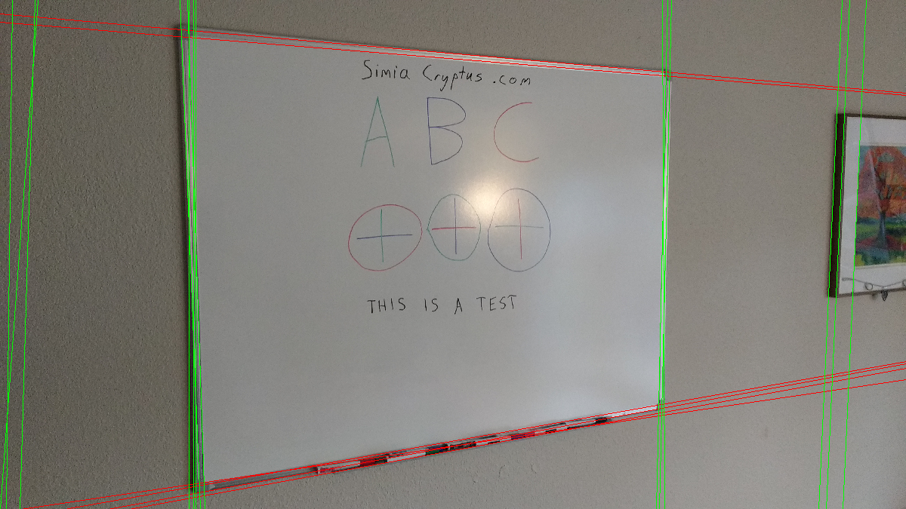
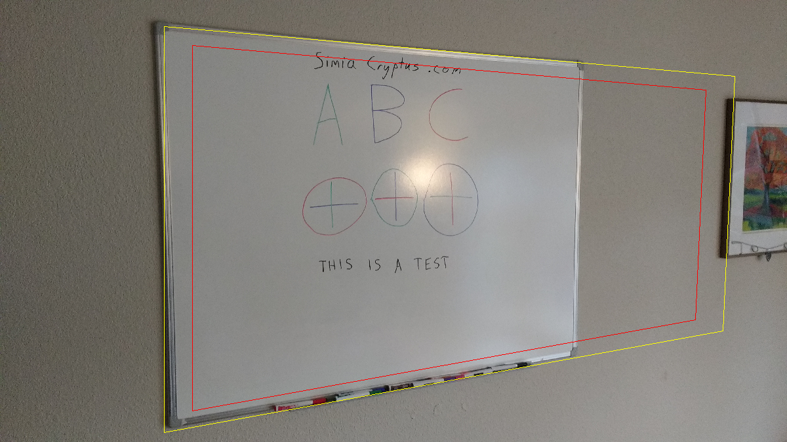
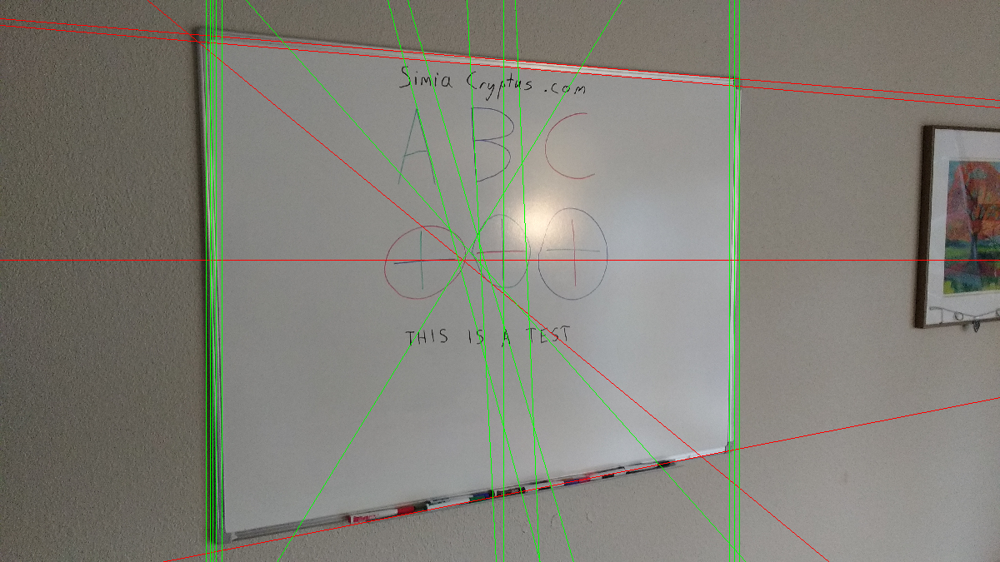
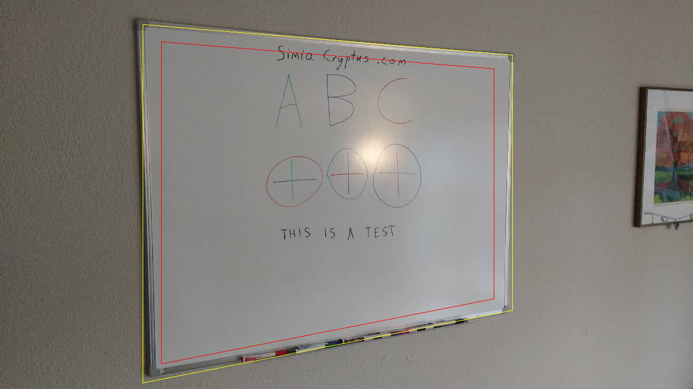
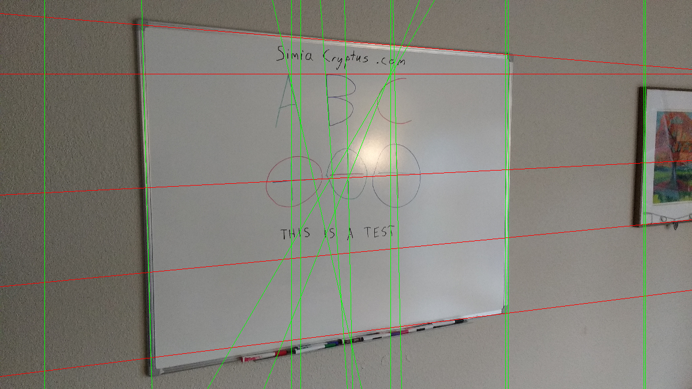
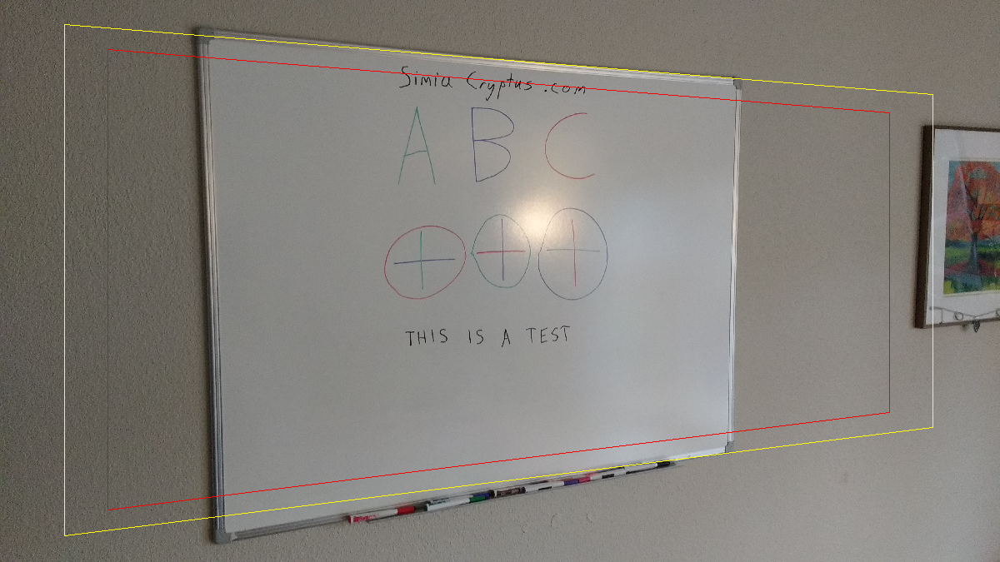

## HoughPolar
Code from [Subtasks.scala:166](../../src/test/scala/Subtasks.scala#L166) executed in 0.11 seconds: 
```java
    FactoryDetectLineAlgs.houghPolar(new ConfigHoughPolar(localMaxRadius, minCounts, 2, resolutionAngle, edgeThreshold, maxLines), classOf[GrayU8], classOf[GrayS16])
```

Returns: 
```
    boofcv.abst.feature.detect.line.DetectLineHoughPolar@2dd29a59
```
Code from [Subtasks.scala:69](../../src/test/scala/Subtasks.scala#L69) executed in 0.08 seconds: 
```java
    gfx.drawImage(image1, 0, 0, width, height, null)
    horizontals.foreach(line ⇒ {
      val x1 = 0
      val y1 = (line.p.y - line.p.x * line.slope.y / line.slope.x).toInt
      val x2 = image1.getWidth
      val y2 = y1 + (x2 * line.slope.y / line.slope.x).toInt
      gfx.setColor(Color.RED)
      gfx.drawLine(
        x1 * width / image1.getWidth, y1 * height / image1.getHeight,
        x2 * width / image1.getWidth, y2 * height / image1.getHeight)
    })
    verticals.foreach(line ⇒ {
      val y1 = 0
      val x1 = (line.p.x - line.p.y * line.slope.x / line.slope.y).toInt
      val y2 = image1.getHeight
      val x2 = x1 + (y2 * line.slope.x / line.slope.y).toInt
      gfx.setColor(Color.GREEN)
      gfx.drawLine(
        x1 * width / image1.getWidth, y1 * height / image1.getHeight,
        x2 * width / image1.getWidth, y2 * height / image1.getHeight)
    })
```

Returns: 

Code from [Subtasks.scala:106](../../src/test/scala/Subtasks.scala#L106) executed in 0.09 seconds: 
```java
    val imageBounds = new Rectangle2D_F32(0, 0, image1.getWidth, image1.getHeight)
    cross(pairs(horizontals), pairs(verticals)).map(xa ⇒ {
      val ((left: LineParametric2D_F32, right: LineParametric2D_F32), (top: LineParametric2D_F32, bottom: LineParametric2D_F32)) = xa
      new Quadrilateral_F32(
        Intersection2D_F32.intersection(left, top, null),
        Intersection2D_F32.intersection(left, bottom, null),
        Intersection2D_F32.intersection(right, top, null),
        Intersection2D_F32.intersection(right, bottom, null))
    }).filter((quad: Quadrilateral_F32) ⇒
      Intersection2D_F32.contains(imageBounds, quad.a.x, quad.a.y) &&
        Intersection2D_F32.contains(imageBounds, quad.b.x, quad.b.y) &&
        Intersection2D_F32.contains(imageBounds, quad.c.x, quad.c.y) &&
        Intersection2D_F32.contains(imageBounds, quad.d.x, quad.d.y)
    )
```

Returns: 
```
    List(Quadrilateral_F32{ a(865.0753 140.00659) b(832.67236 137.17188) c(866.184 171.755) d(833.9744 169.12573) }, Quadrilateral_F32{ a(865.0753 140.00659) b(3059.958 332.03412) c(866.184 171.755) d(3059.5212 350.79553) }, Quadrilateral_F32{ a(865.0753 140.00659) b(3075.933 333.43176) c(866.184 171.755) d(3075.4985 352.09973) }, Quadrilateral_F32{ a(865.0753 140.00659) b(889.7593 142.16626) c(866.184 171.755) d(889.7593 173.67938) }, Quadrilateral_F32{ a(865.0753 140.00659) b(901.7616 143.21631) c(866.184 171.755) d(901.7616 174.65912) }, Quadrilateral_F32{ a(865.0753 140.00659) b(3883.943 404.1236) c(866.184 171.755) d(3883.2952 418.03967) }, Quadrilateral_F32{ a(865.0753 140.00659) b(3848.0435 400.98273) c(866.184 171.755) d(3847.3855 415.10834) }, Quadrilateral_F32{ a(865.0753 140.00659) b(867.75476 140.24109) c(866.184 171.755) d(867.75476 171.88318) }, Quadrilateral_F32{ a(865.0753 140.00659) b(3043.3286 330.57922) c(866.184 171.755) d(3043.4385 349.48273) }, Quadrilateral_F32{ a(865.0753 140.00659) b(3959.7322 410.7542) c(866.184 171.755) d(3959.1047 424.2279) }, Quadrilateral_F32{ a(865.0753 140.00659) b(56.258698 69.24426) c(866.184 171.755) d(55.835583 105.60669) }, Quadrilateral_F32{ a(865.0753 140.00659) b(168.56299 79.06976) c(866.184 171.755) d(165.87152 114.58893) }, Quadrilateral_F32{ a(865.0753 140.00659) b(158.54721 78.1936) c(866.184 171.755) d(157.50807 113.90631) }, Quadrilateral_F32{ a(832.67236 137.17188) b(3059.958 332.03412) c(833.9744 169.12573) d(3059.5212 350.79553) }, Quadrilateral_F32{ a(832.67236 137.17188) b(3075.933 333.43176) c(833.9744 169.12573) d(3075.4985 352.09973) }, Quadrilateral_F32{ a(832.67236 137.17188) b(889.7593 142.16626) c(833.9744 169.12573) d(889.7593 173.67938) }, Quadrilateral_F32{ a(832.67236 137.17188) b(901.7616 143.21631) c(833.9744 169.12573) d(901.7616 174.65912) }, Quadrilateral_F32{ a(832.67236 137.17188) b(3883.943 404.1236) c(833.9744 169.12573) d(3883.2952 418.03967) }, Quadrilateral_F32{ a(832.67236 137.17188) b(3848.0435 400.98273) c(833.9744 169.12573) d(3847.3855 415.10834) }, Quadrilateral_F32{ a(832.67236 137.17188) b(867.75476 140.24109) c(833.9744 169.12573) d(867.75476 171.88318) }, Quadrilateral_F32{ a(832.67236 137.17188) b(3043.3286 330.57922) c(833.9744 169.12573) d(3043.4385 349.48273) }, Quadrilateral_F32{ a(832.67236 137.17188) b(3959.7322 410.7542) c(833.9744 169.12573) d(3959.1047 424.2279) }, Quadrilateral_F32{ a(832.67236 137.17188) b(56.258698 69.24426) c(833.9744 169.12573) d(55.835583 105.60669) }, Quadrilateral_F32{ a(832.67236 137.17188) b(168.56299 79.06976) c(833.9744 169.12573) d(165.87152 114.58893) }, Quadrilateral_F32{ a(832.67236 137.17188) b(158.54721 78.1936) c(833.9744 169.12573) d(157.50807 113.90631) }, Quadrilateral_F32{ a(3059.958 332.03412) b(3075.933 333.43176) c(3059.5212 350.79553) d(3075.4985 352.09973) }, Quadrilateral_F32{ a(3059.958 332.03412) b(889.7593 142.16626) c(3059.5212 350.79553) d(889.7593 173.67938) }, Quadrilateral_F32{ a(3059.958 332.03412) b(901.7616 143.21631) c(3059.5212 350.79553) d(901.7616 174.65912) }, Quadrilateral_F32{ a(3059.958 332.03412) b(3883.943 404.1236) c(3059.5212 350.79553) d(3883.2952 418.03967) }, Quadrilateral_F32{ a(3059.958 332.03412) b(3848.0435 400.98273) c(3059.5212 350.79553) d(3847.3855 415.10834) }, Quadrilateral_F32{ a(3059.958 332.03412) b(867.75476 140.24109) c(3059.5212 350.79553) d(867.75476 171.88318) }, Quadrilateral_F32{ a(3059.958 332.03412) b(3043.3286 330.57922) c(3059.5212 350.79553) d(3043.4385 349.48273) }, Quadrilateral_F32{ a(3059.958 332.03412) b(3959.7322 410.7542) c(3059.5212 350.79553) d(3959.1047 424.2279) }, Quadrilateral_F32{ a(3059.958 332.03412) b(56.258698 69.24426) c(3059.5212 350.79553) d(55.835583 105.60669) }, Quadrilateral_F32{ a(3059.958 332.03412) b(168.56299 79.06976) c(3059.5212 350.79553) d(165.87152 114.58893) }, Quadrilateral_F32{ a(3059.958 332.03412) b(158.54721 78.1936) c(3059.5212 350.79553) d(157.50807 113.90631) }, Quadrilateral_F32{ a(3075.933 333.43176) b(889.7593 142.16626) c(3075.4985 352.09973) d(889.7593 173.67938) }, Quadrilateral_F32{ a(3075.933 333.43176) b(901.7616 143.21631) c(3075.4985 352.09973) d(901.7616 174.65912) }, Quadrilateral_F32{ a(3075.933 333.43176) b(3883.943 404.1236) c(3075.4985 352.09973) d(3883.2952 418.03967) }, Quadrilateral_F32{ a(3075.933 333.43176) b(3848.0435 400.98273) c(3075.4985 352.09973) d(3847.3855 415.10834) }, Quadrilateral_F32{ a(3075.933 333.43176) b(867.75476 140.24109) c(3075.4985 352.09973) d(867.75476 171.88318) }, Quadrilateral_F32{ a(3075.933 333.43176) b(3043.3286 330.57922) c(3075.4985 352.09973) d(3043.4385 349.48273) }, Quadrilateral_F32{ a(3075.933 333.43176) b(3959.7322 410.7542) c(3075.4985 352.09973) d(3959.1047 424.2279) }, Quadrilateral_F32{ a(3075.933 333.43176) b(56.258698 69.24426) c(3075.4985 352.09973) d(55.835583 105.60669) }, Quadrilateral_F32{ a(3075.933 333.43176) b(168.56299 79.06976) c(3075.4985 352.09973) d(165.87152 114.58893) }, Quadrilateral_F32{ a(3075.933 333.43176) b(158.54721 78.1936) c(3075.4985 352.09973) d(157.50807 113.90631) }, Quadrilateral_F32{ a(889.7593 142.16626) b(901.7616 143.21631) c(889.7593 173.67938) d(901.7616 174.65912) }, Quadrilateral_F32{ a(889.7593 142.16626) b(3883.943 404.1236) c(889.7593 173.67938) d(3883.2952 418.03967) }, Quadrilateral_F32{ a(889.7593 142.16626) b(3848.0435 400.98273) c(889.7593 173.67938) d(3847.3855 415.10834) }, Quadrilateral_F32{ a(889.7593 142.16626) b(867.75476 140.24109) c(889.7593 173.67938) d(867.75476 171.88318) }, Quadrilateral_F32{ a(889.7593 142.16626) b(3043.3286 330.57922) c(889.7593 173.67938) d(3043.4385 349.48273) }, Quadrilateral_F32{ a(889.7593 142.16626) b(3959.7322 410.7542) c(889.7593 173.67938) d(3959.1047 424.2279) }, Quadrilateral_F32{ a(889.7593 142.16626) b(56.258698 69.24426) c(889.7593 173.67938) d(55.835583 105.60669) }, Quadrilateral_F32{ a(889.7593 142.16626) b(168.56299 79.06976) c(889.7593 173.67938) d(165.87152 114.58893) }, Quadrilateral_F32{ a(889.7593 142.16626) b(158.54721 78.1936) c(889.7593 173.67938) d(157.50807 113.90631) }, Quadrilateral_F32{ a(901.7616 143.21631) b(3883.943 404.1236) c(901.7616 174.65912) d(3883.2952 418.03967) }, Quadrilateral_F32{ a(901.7616 143.21631) b(3848.0435 400.98273) c(901.7616 174.65912) d(3847.3855 415.10834) }, Quadrilateral_F32{ a(901.7616 143.21631) b(867.75476 140.24109) c(901.7616 174.65912) d(867.75476 171.88318) }, Quadrilateral_F32{ a(901.7616 143.21631) b(3043.3286 330.57922) c(901.7616 174.65912) d(3043.4385 349.48273) }, Quadrilateral_F32{ a(901.7616 143.21631) b(3959.7322 410.7542) c(901.7616 174.65912) d(3959.1047 424.2279) }, Quadrilateral_F32{ a(901.7616 143.21631) b(56.258698 69.24426) c(901.7616 174.65912) d(55.835583 105.60669) }, Quadrilateral_F32{ a(901.7616 143.21631) b(168.56299 79.06976) c(901.7616 174.65912) d(165.87152 114.58893) }, Quadrilateral_F32{ a(901.7616 143.21631) b(158.54721 78.1936) c(901.7616 174.65912) d(157.50807 113.90631) }, Quadrilateral_F32{ a(3883.943 404.1236) b(3848.0435 400.98273) c(3883.2952 418.03967) d(3847.3855 415.10834) }, Quadrilateral_F32{ a(3883.943 404.1236) b(867.75476 140.24109) c(3883.2952 418.03967) d(867.75476 171.88318) }, Quadrilateral_F32{ a(3883.943 404.1236) b(3043.3286 330.57922) c(3883.2952 418.03967) d(3043.4385 349.48273) }, Quadrilateral_F32{ a(3883.943 404.1236) b(3959.7322 410.7542) c(3883.2952 418.03967) d(3959.1047 424.2279) }, Quadrilateral_F32{ a(3883.943 404.1236) b(56.258698 69.24426) c(3883.2952 418.03967) d(55.835583 105.60669) }, Quadrilateral_F32{ a(3883.943 404.1236) b(168.56299 79.06976) c(3883.2952 418.03967) d(165.87152 114.58893) }, Quadrilateral_F32{ a(3883.943 404.1236) b(158.54721 78.1936) c(3883.2952 418.03967) d(157.50807 113.90631) }, Quadrilateral_F32{ a(3848.0435 400.98273) b(867.75476 140.24109) c(3847.3855 415.10834) d(867.75476 171.88318) }, Quadrilateral_F32{ a(3848.0435 400.98273) b(3043.3286 330.57922) c(3847.3855 415.10834) d(3043.4385 349.48273) }, Quadrilateral_F32{ a(3848.0435 400.98273) b(3959.7322 410.7542) c(3847.3855 415.10834) d(3959.1047 424.2279) }, Quadrilateral_F32{ a(3848.0435 400.98273) b(56.258698 69.24426) c(3847.3855 415.10834) d(55... and 87766 more bytes
```
Code from [Subtasks.scala:123](../../src/test/scala/Subtasks.scala#L123) executed in 0.07 seconds: 
```java
    candidateQuadrangles.maxBy(quad ⇒ {
      val bounds = new Rectangle2D_F32()
      UtilPolygons2D_F32.bounding(quad, bounds)
      val area = quad.area()
      val squareness = area / bounds.area()
      assert(squareness >= 0 && squareness <= 1.01)
      area * Math.pow(squareness, 4)
    })
```

Returns: 
```
    Quadrilateral_F32{ a(3883.943 404.1236) b(867.75476 140.24109) c(3821.1028 1753.3307) d(867.75476 2291.8203) }
```
Code from [Subtasks.scala:148](../../src/test/scala/Subtasks.scala#L148) executed in 0.00 seconds: 
```java
    gfx.drawImage(image1, 0, 0, width, height, null)
    gfx.setColor(Color.YELLOW)
    draw(gfx, bestQuadrangle)
    gfx.setColor(Color.RED)
    draw(gfx, shrink(bestQuadrangle, 0.9f))
```

Returns: 

## HoughFoot
Code from [Subtasks.scala:170](../../src/test/scala/Subtasks.scala#L170) executed in 0.01 seconds: 
```java
    FactoryDetectLineAlgs.houghFoot(new ConfigHoughFoot(localMaxRadius, minCounts, minDistanceFromOrigin, edgeThreshold, maxLines), classOf[GrayU8], classOf[GrayS16])
```

Returns: 
```
    boofcv.abst.feature.detect.line.DetectLineHoughFoot@78a287ed
```
Code from [Subtasks.scala:69](../../src/test/scala/Subtasks.scala#L69) executed in 0.01 seconds: 
```java
    gfx.drawImage(image1, 0, 0, width, height, null)
    horizontals.foreach(line ⇒ {
      val x1 = 0
      val y1 = (line.p.y - line.p.x * line.slope.y / line.slope.x).toInt
      val x2 = image1.getWidth
      val y2 = y1 + (x2 * line.slope.y / line.slope.x).toInt
      gfx.setColor(Color.RED)
      gfx.drawLine(
        x1 * width / image1.getWidth, y1 * height / image1.getHeight,
        x2 * width / image1.getWidth, y2 * height / image1.getHeight)
    })
    verticals.foreach(line ⇒ {
      val y1 = 0
      val x1 = (line.p.x - line.p.y * line.slope.x / line.slope.y).toInt
      val y2 = image1.getHeight
      val x2 = x1 + (y2 * line.slope.x / line.slope.y).toInt
      gfx.setColor(Color.GREEN)
      gfx.drawLine(
        x1 * width / image1.getWidth, y1 * height / image1.getHeight,
        x2 * width / image1.getWidth, y2 * height / image1.getHeight)
    })
```

Returns: 

Code from [Subtasks.scala:106](../../src/test/scala/Subtasks.scala#L106) executed in 0.01 seconds: 
```java
    val imageBounds = new Rectangle2D_F32(0, 0, image1.getWidth, image1.getHeight)
    cross(pairs(horizontals), pairs(verticals)).map(xa ⇒ {
      val ((left: LineParametric2D_F32, right: LineParametric2D_F32), (top: LineParametric2D_F32, bottom: LineParametric2D_F32)) = xa
      new Quadrilateral_F32(
        Intersection2D_F32.intersection(left, top, null),
        Intersection2D_F32.intersection(left, bottom, null),
        Intersection2D_F32.intersection(right, top, null),
        Intersection2D_F32.intersection(right, bottom, null))
    }).filter((quad: Quadrilateral_F32) ⇒
      Intersection2D_F32.contains(imageBounds, quad.a.x, quad.a.y) &&
        Intersection2D_F32.contains(imageBounds, quad.b.x, quad.b.y) &&
        Intersection2D_F32.contains(imageBounds, quad.c.x, quad.c.y) &&
        Intersection2D_F32.contains(imageBounds, quad.d.x, quad.d.y)
    )
```

Returns: 
```
    List(Quadrilateral_F32{ a(2094.0 1082.0) b(3057.0 1082.0) c(2094.0 279.1388) d(3057.0 358.48303) }, Quadrilateral_F32{ a(2094.0 1082.0) b(2000.0934 1082.0) c(2094.0 279.1388) d(1956.6707 267.8239) }, Quadrilateral_F32{ a(2094.0 1082.0) b(885.0 1082.0) c(2094.0 279.1388) d(885.0 179.526) }, Quadrilateral_F32{ a(2094.0 1082.0) b(898.0 1082.0) c(2094.0 279.1388) d(898.0 180.5971) }, Quadrilateral_F32{ a(2094.0 1082.0) b(2017.1765 1082.0) c(2094.0 279.1388) d(1773.2686 252.71283) }, Quadrilateral_F32{ a(2094.0 1082.0) b(874.0 1082.0) c(2094.0 279.1388) d(874.0 178.61969) }, Quadrilateral_F32{ a(2094.0 1082.0) b(3035.0 1082.0) c(2094.0 279.1388) d(3035.0 356.6704) }, Quadrilateral_F32{ a(2094.0 1082.0) b(3075.0 1082.0) c(2094.0 279.1388) d(3075.0 359.96613) }, Quadrilateral_F32{ a(2094.0 1082.0) b(1905.8 1082.0) c(2094.0 279.1388) d(1678.5905 244.91205) }, Quadrilateral_F32{ a(2094.0 1082.0) b(2191.3914 1082.0) c(2094.0 279.1388) d(2156.709 284.3056) }, Quadrilateral_F32{ a(2094.0 1082.0) b(1985.6666 1082.0) c(2094.0 279.1388) d(1207.0542 206.06091) }, Quadrilateral_F32{ a(2094.0 1082.0) b(923.0 1082.0) c(2094.0 279.1388) d(923.0 182.65692) }, Quadrilateral_F32{ a(2094.0 1082.0) b(858.0 1082.0) c(2094.0 279.1388) d(858.0 177.30133) }, Quadrilateral_F32{ a(2094.0 1082.0) b(1923.3137 1082.0) c(2094.0 279.1388) d(2401.0327 304.4361) }, Quadrilateral_F32{ a(3057.0 1082.0) b(2000.0934 1082.0) c(3057.0 358.48303) d(1956.6707 267.8239) }, Quadrilateral_F32{ a(3057.0 1082.0) b(885.0 1082.0) c(3057.0 358.48303) d(885.0 179.526) }, Quadrilateral_F32{ a(3057.0 1082.0) b(898.0 1082.0) c(3057.0 358.48303) d(898.0 180.5971) }, Quadrilateral_F32{ a(3057.0 1082.0) b(2017.1765 1082.0) c(3057.0 358.48303) d(1773.2686 252.71283) }, Quadrilateral_F32{ a(3057.0 1082.0) b(874.0 1082.0) c(3057.0 358.48303) d(874.0 178.61969) }, Quadrilateral_F32{ a(3057.0 1082.0) b(3035.0 1082.0) c(3057.0 358.48303) d(3035.0 356.6704) }, Quadrilateral_F32{ a(3057.0 1082.0) b(3075.0 1082.0) c(3057.0 358.48303) d(3075.0 359.96613) }, Quadrilateral_F32{ a(3057.0 1082.0) b(1905.8 1082.0) c(3057.0 358.48303) d(1678.5905 244.91205) }, Quadrilateral_F32{ a(3057.0 1082.0) b(2191.3914 1082.0) c(3057.0 358.48303) d(2156.709 284.3056) }, Quadrilateral_F32{ a(3057.0 1082.0) b(1985.6666 1082.0) c(3057.0 358.48303) d(1207.0542 206.06091) }, Quadrilateral_F32{ a(3057.0 1082.0) b(923.0 1082.0) c(3057.0 358.48303) d(923.0 182.65692) }, Quadrilateral_F32{ a(3057.0 1082.0) b(858.0 1082.0) c(3057.0 358.48303) d(858.0 177.30133) }, Quadrilateral_F32{ a(3057.0 1082.0) b(1923.3137 1082.0) c(3057.0 358.48303) d(2401.0327 304.4361) }, Quadrilateral_F32{ a(2000.0934 1082.0) b(885.0 1082.0) c(1956.6707 267.8239) d(885.0 179.526) }, Quadrilateral_F32{ a(2000.0934 1082.0) b(898.0 1082.0) c(1956.6707 267.8239) d(898.0 180.5971) }, Quadrilateral_F32{ a(2000.0934 1082.0) b(2017.1765 1082.0) c(1956.6707 267.8239) d(1773.2686 252.71283) }, Quadrilateral_F32{ a(2000.0934 1082.0) b(874.0 1082.0) c(1956.6707 267.8239) d(874.0 178.61969) }, Quadrilateral_F32{ a(2000.0934 1082.0) b(3035.0 1082.0) c(1956.6707 267.8239) d(3035.0 356.6704) }, Quadrilateral_F32{ a(2000.0934 1082.0) b(3075.0 1082.0) c(1956.6707 267.8239) d(3075.0 359.96613) }, Quadrilateral_F32{ a(2000.0934 1082.0) b(1905.8 1082.0) c(1956.6707 267.8239) d(1678.5905 244.91205) }, Quadrilateral_F32{ a(2000.0934 1082.0) b(2191.3914 1082.0) c(1956.6707 267.8239) d(2156.709 284.3056) }, Quadrilateral_F32{ a(2000.0934 1082.0) b(1985.6666 1082.0) c(1956.6707 267.8239) d(1207.0542 206.06091) }, Quadrilateral_F32{ a(2000.0934 1082.0) b(923.0 1082.0) c(1956.6707 267.8239) d(923.0 182.65692) }, Quadrilateral_F32{ a(2000.0934 1082.0) b(858.0 1082.0) c(1956.6707 267.8239) d(858.0 177.30133) }, Quadrilateral_F32{ a(2000.0934 1082.0) b(1923.3137 1082.0) c(1956.6707 267.8239) d(2401.0327 304.4361) }, Quadrilateral_F32{ a(885.0 1082.0) b(898.0 1082.0) c(885.0 179.526) d(898.0 180.5971) }, Quadrilateral_F32{ a(885.0 1082.0) b(2017.1765 1082.0) c(885.0 179.526) d(1773.2686 252.71283) }, Quadrilateral_F32{ a(885.0 1082.0) b(874.0 1082.0) c(885.0 179.526) d(874.0 178.61969) }, Quadrilateral_F32{ a(885.0 1082.0) b(3035.0 1082.0) c(885.0 179.526) d(3035.0 356.6704) }, Quadrilateral_F32{ a(885.0 1082.0) b(3075.0 1082.0) c(885.0 179.526) d(3075.0 359.96613) }, Quadrilateral_F32{ a(885.0 1082.0) b(1905.8 1082.0) c(885.0 179.526) d(1678.5905 244.91205) }, Quadrilateral_F32{ a(885.0 1082.0) b(2191.3914 1082.0) c(885.0 179.526) d(2156.709 284.3056) }, Quadrilateral_F32{ a(885.0 1082.0) b(1985.6666 1082.0) c(885.0 179.526) d(1207.0542 206.06091) }, Quadrilateral_F32{ a(885.0 1082.0) b(923.0 1082.0) c(885.0 179.526) d(923.0 182.65692) }, Quadrilateral_F32{ a(885.0 1082.0) b(858.0 1082.0) c(885.0 179.526) d(858.0 177.30133) }, Quadrilateral_F32{ a(885.0 1082.0) b(1923.3137 1082.0) c(885.0 179.526) d(2401.0327 304.4361) }, Quadrilateral_F32{ a(898.0 1082.0) b(2017.1765 1082.0) c(898.0 180.5971) d(1773.2686 252.71283) }, Quadrilateral_F32{ a(898.0 1082.0) b(874.0 1082.0) c(898.0 180.5971) d(874.0 178.61969) }, Quadrilateral_F32{ a(898.0 1082.0) b(3035.0 1082.0) c(898.0 180.5971) d(3035.0 356.6704) }, Quadrilateral_F32{ a(898.0 1082.0) b(3075.0 1082.0) c(898.0 180.5971) d(3075.0 359.96613) }, Quadrilateral_F32{ a(898.0 1082.0) b(1905.8 1082.0) c(898.0 180.5971) d(1678.5905 244.91205) }, Quadrilateral_F32{ a(898.0 1082.0) b(2191.3914 1082.0) c(898.0 180.5971) d(2156.709 284.3056) }, Quadrilateral_F32{ a(898.0 1082.0) b(1985.6666 1082.0) c(898.0 180.5971) d(1207.0542 206.06091) }, Quadrilateral_F32{ a(898.0 1082.0) b(923.0 1082.0) c(898.0 180.5971) d(923.0 182.65692) }, Quadrilateral_F32{ a(898.0 1082.0) b(858.0 1082.0) c(898.0 180.5971) d(858.0 177.30133) }, Quadrilateral_F32{ a(898.0 1082.0) b(1923.3137 1082.0) c(898.0 180.5971) d(2401.0327 304.4361) }, Quadrilateral_F32{ a(2017.1765 1082.0) b(874.0 1082.0) c(1773.2686 252.71283) d(874.0 178.61969) }, Quadrilateral_F32{ a(2017.1765 1082.0) b(3035.0 1082.0) c(1773.2686 252.71283) d(3035.0 356.6704) }, Quadrilateral_F32{ a(2017.1765 1082.0) b(3075.0 1082.0) c(1773.2686 252.71283) d(3075.0 359.96613) }, Quadrilateral_F32{ a(2017.1765 1082.0) b(1905.8 1082.0) c(1773.2686 252.71283) d(1678.5905 244.91205) }, Quadrilateral_F32{ a(2017.1765 1082.0) b(2191.3914 1082.0) c(1773.2686 252.71283) d(2156.709 284.3056) }, Quadrilateral_F32{ a(2017.1765 1082.0) b(1985.6666 1082.0) c(1773.2686 252.71283) d(1207.0542 206.06091) }, Quadrilateral_F32{ a(2017.1765 1082.0) b(923.0 1082.0) c(1773.2686 252.71283) d(923.0 182.65692) }, Quadrilateral_F32{ a(2017.1765 1082.0) b(858.0 1082.0) c(1773.2686 252.71283) d(858.0 177.30133) }, Quadrilateral_F32{ a(2017.1765 1082.0) b(1923.3137 1082.0) c(1773.2686 252.71283) d(2401.0327 304.4361) }, Quadrilateral_F32{ a(874.0 1082.0) b(3035.0 1082.0) c(874.0 178.61969) d(3035.0 356.6704) }, Quadrilateral_F32{ a(874.0 1082.0) b(3075.0 1082.0) c(874.0 178.61969) d(3075.0 359.96613) }, Quadrilateral_F32{ a(874.0 1082.0) b(1905.8 1082.0) c(874.0 178.61969) d(1678.5905 244.91205) }, Quadrilateral_F32{ a(874.0 1082.0) b(2191.3914 1082.0) c(874.0 178.61969) d(2156.709 284.3056) }, Quadrilateral_F32{ a(874.0 1082.0) b(1985.6666 1082.0) c(874.0 178.61969) d(1207.0542 206.06091) }, Quadrilateral_F32{ a(874.0 1082.0) b(923.0 1082.0) c(874.0 178.61969) d(923.0 182.65692) }, Quadrilateral_F32{ a(874.0 1082.0) b(858.0 1082.0) c(874.0 178.61969) d(858.0 177.30133) }, Quadrilateral_F32{ a(874.0 1082.0) b(1923.3137 1082.0) c(874.0 178.61969) d(2401.0327 304.4361) }, Quadrilateral_F32{ a(3035.0 1082.0) b(3075.0 1082.0) c(3035.0 356.6704) d(3075.0 359.96613) }, Quadrilateral_F32{ a(3035.0 1082.0) b(1905.8 1082.0) c(3035.0 356.6704) d(1678.5905 244.91205) }, Quadrilateral_F32{ a(3035.0 1082.0) b(2191.3914 1082.0) c(3035.0 356.6704) d(2156.709 284.3056) }, Quadrilateral_F32{ a(3035.0 1082.0) b(1985.6666 1082.0) c(3035.0 356.6704) d(1207.0542 206.06091) }, Quadrilateral_F32{ a(3035.0 1082.0) b(923.0 1082.0) c(3035.0 356.6704) d(923.0 182.65692) }, Quadrilateral_F32{ a(3035.0 1082.0) b(858.0 1082.0) c(3035.0 356.6704) d(858.0 177.30133) }, Quadrilateral_F32{ a(3035.0 1082.0) b(1923.3137 1082.0) c(3035.0 356.6704) d(2401.0327 304.4361) }, Quadrilater... and 98408 more bytes
```
Code from [Subtasks.scala:123](../../src/test/scala/Subtasks.scala#L123) executed in 0.01 seconds: 
```java
    candidateQuadrangles.maxBy(quad ⇒ {
      val bounds = new Rectangle2D_F32()
      UtilPolygons2D_F32.bounding(quad, bounds)
      val area = quad.area()
      val squareness = area / bounds.area()
      assert(squareness >= 0 && squareness <= 1.01)
      area * Math.pow(squareness, 4)
    })
```

Returns: 
```
    Quadrilateral_F32{ a(3075.0 1868.8699) b(858.0 2304.0303) c(3075.0 330.40985) d(858.0 148.68854) }
```
Code from [Subtasks.scala:148](../../src/test/scala/Subtasks.scala#L148) executed in 0.01 seconds: 
```java
    gfx.drawImage(image1, 0, 0, width, height, null)
    gfx.setColor(Color.YELLOW)
    draw(gfx, bestQuadrangle)
    gfx.setColor(Color.RED)
    draw(gfx, shrink(bestQuadrangle, 0.9f))
```

Returns: 

## HoughFootSubimage
Code from [Subtasks.scala:174](../../src/test/scala/Subtasks.scala#L174) executed in 0.00 seconds: 
```java
    FactoryDetectLineAlgs.houghFootSub(new ConfigHoughFootSubimage(localMaxRadius, minCounts, minDistanceFromOrigin, edgeThreshold, maxLines, totalHorizontalDivisions, totalVerticalDivisions), classOf[GrayU8], classOf[GrayS16])
```

Returns: 
```
    boofcv.abst.feature.detect.line.DetectLineHoughFootSubimage@3f363cf5
```
Code from [Subtasks.scala:69](../../src/test/scala/Subtasks.scala#L69) executed in 0.01 seconds: 
```java
    gfx.drawImage(image1, 0, 0, width, height, null)
    horizontals.foreach(line ⇒ {
      val x1 = 0
      val y1 = (line.p.y - line.p.x * line.slope.y / line.slope.x).toInt
      val x2 = image1.getWidth
      val y2 = y1 + (x2 * line.slope.y / line.slope.x).toInt
      gfx.setColor(Color.RED)
      gfx.drawLine(
        x1 * width / image1.getWidth, y1 * height / image1.getHeight,
        x2 * width / image1.getWidth, y2 * height / image1.getHeight)
    })
    verticals.foreach(line ⇒ {
      val y1 = 0
      val x1 = (line.p.x - line.p.y * line.slope.x / line.slope.y).toInt
      val y2 = image1.getHeight
      val x2 = x1 + (y2 * line.slope.x / line.slope.y).toInt
      gfx.setColor(Color.GREEN)
      gfx.drawLine(
        x1 * width / image1.getWidth, y1 * height / image1.getHeight,
        x2 * width / image1.getWidth, y2 * height / image1.getHeight)
    })
```

Returns: 

Code from [Subtasks.scala:106](../../src/test/scala/Subtasks.scala#L106) executed in 0.01 seconds: 
```java
    val imageBounds = new Rectangle2D_F32(0, 0, image1.getWidth, image1.getHeight)
    cross(pairs(horizontals), pairs(verticals)).map(xa ⇒ {
      val ((left: LineParametric2D_F32, right: LineParametric2D_F32), (top: LineParametric2D_F32, bottom: LineParametric2D_F32)) = xa
      new Quadrilateral_F32(
        Intersection2D_F32.intersection(left, top, null),
        Intersection2D_F32.intersection(left, bottom, null),
        Intersection2D_F32.intersection(right, top, null),
        Intersection2D_F32.intersection(right, bottom, null))
    }).filter((quad: Quadrilateral_F32) ⇒
      Intersection2D_F32.contains(imageBounds, quad.a.x, quad.a.y) &&
        Intersection2D_F32.contains(imageBounds, quad.b.x, quad.b.y) &&
        Intersection2D_F32.contains(imageBounds, quad.c.x, quad.c.y) &&
        Intersection2D_F32.contains(imageBounds, quad.d.x, quad.d.y)
    )
```

Returns: 
```
    List(Quadrilateral_F32{ a(3882.0 1781.375) b(910.54596 2152.8066) c(3882.0 395.16132) d(854.4206 151.00171) }, Quadrilateral_F32{ a(3882.0 1781.375) b(3055.0 1884.75) c(3882.0 395.16132) d(3055.0 328.4677) }, Quadrilateral_F32{ a(3882.0 1781.375) b(2100.1028 2004.1122) c(3882.0 395.16132) d(1687.9747 218.22375) }, Quadrilateral_F32{ a(3882.0 1781.375) b(2406.5176 1965.8103) c(3882.0 395.16132) d(2369.722 273.20343) }, Quadrilateral_F32{ a(3882.0 1781.375) b(3037.0 1887.0) c(3882.0 395.16132) d(3037.0 327.0161) }, Quadrilateral_F32{ a(3882.0 1781.375) b(2347.0 1973.25) c(3882.0 395.16132) d(2347.0 271.37097) }, Quadrilateral_F32{ a(3882.0 1781.375) b(1752.0 2047.625) c(3882.0 395.16132) d(1752.0 223.38708) }, Quadrilateral_F32{ a(3882.0 1781.375) b(1809.0 2040.5) c(3882.0 395.16132) d(1809.0 227.98387) }, Quadrilateral_F32{ a(3882.0 1781.375) b(3869.0 1783.0) c(3882.0 395.16132) d(3869.0 394.1129) }, Quadrilateral_F32{ a(3882.0 1781.375) b(1390.7977 2092.7754) c(3882.0 395.16132) d(2448.5083 279.55713) }, Quadrilateral_F32{ a(3882.0 1781.375) b(2066.8396 2008.27) c(3882.0 395.16132) d(1942.0632 238.71478) }, Quadrilateral_F32{ a(3882.0 1781.375) b(270.0 2232.875) c(3882.0 395.16132) d(270.0 103.87097) }, Quadrilateral_F32{ a(3882.0 1781.375) b(1699.3158 2054.2104) c(3882.0 395.16132) d(2410.4062 276.48438) }, Quadrilateral_F32{ a(3882.0 1781.375) b(2112.7273 2002.534) c(3882.0 395.16132) d(2077.2432 249.6164) }, Quadrilateral_F32{ a(910.54596 2152.8066) b(3055.0 1884.75) c(854.4206 151.00171) d(3055.0 328.4677) }, Quadrilateral_F32{ a(910.54596 2152.8066) b(2100.1028 2004.1122) c(854.4206 151.00171) d(1687.9747 218.22375) }, Quadrilateral_F32{ a(910.54596 2152.8066) b(2406.5176 1965.8103) c(854.4206 151.00171) d(2369.722 273.20343) }, Quadrilateral_F32{ a(910.54596 2152.8066) b(3037.0 1887.0) c(854.4206 151.00171) d(3037.0 327.0161) }, Quadrilateral_F32{ a(910.54596 2152.8066) b(2347.0 1973.25) c(854.4206 151.00171) d(2347.0 271.37097) }, Quadrilateral_F32{ a(910.54596 2152.8066) b(1752.0 2047.625) c(854.4206 151.00171) d(1752.0 223.38708) }, Quadrilateral_F32{ a(910.54596 2152.8066) b(1809.0 2040.5) c(854.4206 151.00171) d(1809.0 227.98387) }, Quadrilateral_F32{ a(910.54596 2152.8066) b(3869.0 1783.0) c(854.4206 151.00171) d(3869.0 394.1129) }, Quadrilateral_F32{ a(910.54596 2152.8066) b(1390.7977 2092.7754) c(854.4206 151.00171) d(2448.5083 279.55713) }, Quadrilateral_F32{ a(910.54596 2152.8066) b(2066.8396 2008.27) c(854.4206 151.00171) d(1942.0632 238.71478) }, Quadrilateral_F32{ a(910.54596 2152.8066) b(270.0 2232.875) c(854.4206 151.00171) d(270.0 103.87097) }, Quadrilateral_F32{ a(910.54596 2152.8066) b(1699.3158 2054.2104) c(854.4206 151.00171) d(2410.4062 276.48438) }, Quadrilateral_F32{ a(910.54596 2152.8066) b(2112.7273 2002.534) c(854.4206 151.00171) d(2077.2432 249.6164) }, Quadrilateral_F32{ a(3055.0 1884.75) b(2100.1028 2004.1122) c(3055.0 328.4677) d(1687.9747 218.22375) }, Quadrilateral_F32{ a(3055.0 1884.75) b(2406.5176 1965.8103) c(3055.0 328.4677) d(2369.722 273.20343) }, Quadrilateral_F32{ a(3055.0 1884.75) b(3037.0 1887.0) c(3055.0 328.4677) d(3037.0 327.0161) }, Quadrilateral_F32{ a(3055.0 1884.75) b(2347.0 1973.25) c(3055.0 328.4677) d(2347.0 271.37097) }, Quadrilateral_F32{ a(3055.0 1884.75) b(1752.0 2047.625) c(3055.0 328.4677) d(1752.0 223.38708) }, Quadrilateral_F32{ a(3055.0 1884.75) b(1809.0 2040.5) c(3055.0 328.4677) d(1809.0 227.98387) }, Quadrilateral_F32{ a(3055.0 1884.75) b(3869.0 1783.0) c(3055.0 328.4677) d(3869.0 394.1129) }, Quadrilateral_F32{ a(3055.0 1884.75) b(1390.7977 2092.7754) c(3055.0 328.4677) d(2448.5083 279.55713) }, Quadrilateral_F32{ a(3055.0 1884.75) b(2066.8396 2008.27) c(3055.0 328.4677) d(1942.0632 238.71478) }, Quadrilateral_F32{ a(3055.0 1884.75) b(270.0 2232.875) c(3055.0 328.4677) d(270.0 103.87097) }, Quadrilateral_F32{ a(3055.0 1884.75) b(1699.3158 2054.2104) c(3055.0 328.4677) d(2410.4062 276.48438) }, Quadrilateral_F32{ a(3055.0 1884.75) b(2112.7273 2002.534) c(3055.0 328.4677) d(2077.2432 249.6164) }, Quadrilateral_F32{ a(2100.1028 2004.1122) b(2406.5176 1965.8103) c(1687.9747 218.22375) d(2369.722 273.20343) }, Quadrilateral_F32{ a(2100.1028 2004.1122) b(3037.0 1887.0) c(1687.9747 218.22375) d(3037.0 327.0161) }, Quadrilateral_F32{ a(2100.1028 2004.1122) b(2347.0 1973.25) c(1687.9747 218.22375) d(2347.0 271.37097) }, Quadrilateral_F32{ a(2100.1028 2004.1122) b(1752.0 2047.625) c(1687.9747 218.22375) d(1752.0 223.38708) }, Quadrilateral_F32{ a(2100.1028 2004.1122) b(1809.0 2040.5) c(1687.9747 218.22375) d(1809.0 227.98387) }, Quadrilateral_F32{ a(2100.1028 2004.1122) b(3869.0 1783.0) c(1687.9747 218.22375) d(3869.0 394.1129) }, Quadrilateral_F32{ a(2100.1028 2004.1122) b(1390.7977 2092.7754) c(1687.9747 218.22375) d(2448.5083 279.55713) }, Quadrilateral_F32{ a(2100.1028 2004.1122) b(2066.8396 2008.27) c(1687.9747 218.22375) d(1942.0632 238.71478) }, Quadrilateral_F32{ a(2100.1028 2004.1122) b(270.0 2232.875) c(1687.9747 218.22375) d(270.0 103.87097) }, Quadrilateral_F32{ a(2100.1028 2004.1122) b(1699.3158 2054.2104) c(1687.9747 218.22375) d(2410.4062 276.48438) }, Quadrilateral_F32{ a(2100.1028 2004.1122) b(2112.7273 2002.534) c(1687.9747 218.22375) d(2077.2432 249.6164) }, Quadrilateral_F32{ a(2406.5176 1965.8103) b(3037.0 1887.0) c(2369.722 273.20343) d(3037.0 327.0161) }, Quadrilateral_F32{ a(2406.5176 1965.8103) b(2347.0 1973.25) c(2369.722 273.20343) d(2347.0 271.37097) }, Quadrilateral_F32{ a(2406.5176 1965.8103) b(1752.0 2047.625) c(2369.722 273.20343) d(1752.0 223.38708) }, Quadrilateral_F32{ a(2406.5176 1965.8103) b(1809.0 2040.5) c(2369.722 273.20343) d(1809.0 227.98387) }, Quadrilateral_F32{ a(2406.5176 1965.8103) b(3869.0 1783.0) c(2369.722 273.20343) d(3869.0 394.1129) }, Quadrilateral_F32{ a(2406.5176 1965.8103) b(1390.7977 2092.7754) c(2369.722 273.20343) d(2448.5083 279.55713) }, Quadrilateral_F32{ a(2406.5176 1965.8103) b(2066.8396 2008.27) c(2369.722 273.20343) d(1942.0632 238.71478) }, Quadrilateral_F32{ a(2406.5176 1965.8103) b(270.0 2232.875) c(2369.722 273.20343) d(270.0 103.87097) }, Quadrilateral_F32{ a(2406.5176 1965.8103) b(1699.3158 2054.2104) c(2369.722 273.20343) d(2410.4062 276.48438) }, Quadrilateral_F32{ a(2406.5176 1965.8103) b(2112.7273 2002.534) c(2369.722 273.20343) d(2077.2432 249.6164) }, Quadrilateral_F32{ a(3037.0 1887.0) b(2347.0 1973.25) c(3037.0 327.0161) d(2347.0 271.37097) }, Quadrilateral_F32{ a(3037.0 1887.0) b(1752.0 2047.625) c(3037.0 327.0161) d(1752.0 223.38708) }, Quadrilateral_F32{ a(3037.0 1887.0) b(1809.0 2040.5) c(3037.0 327.0161) d(1809.0 227.98387) }, Quadrilateral_F32{ a(3037.0 1887.0) b(3869.0 1783.0) c(3037.0 327.0161) d(3869.0 394.1129) }, Quadrilateral_F32{ a(3037.0 1887.0) b(1390.7977 2092.7754) c(3037.0 327.0161) d(2448.5083 279.55713) }, Quadrilateral_F32{ a(3037.0 1887.0) b(2066.8396 2008.27) c(3037.0 327.0161) d(1942.0632 238.71478) }, Quadrilateral_F32{ a(3037.0 1887.0) b(270.0 2232.875) c(3037.0 327.0161) d(270.0 103.87097) }, Quadrilateral_F32{ a(3037.0 1887.0) b(1699.3158 2054.2104) c(3037.0 327.0161) d(2410.4062 276.48438) }, Quadrilateral_F32{ a(3037.0 1887.0) b(2112.7273 2002.534) c(3037.0 327.0161) d(2077.2432 249.6164) }, Quadrilateral_F32{ a(2347.0 1973.25) b(1752.0 2047.625) c(2347.0 271.37097) d(1752.0 223.38708) }, Quadrilateral_F32{ a(2347.0 1973.25) b(1809.0 2040.5) c(2347.0 271.37097) d(1809.0 227.98387) }, Quadrilateral_F32{ a(2347.0 1973.25) b(3869.0 1783.0) c(2347.0 271.37097) d(3869.0 394.1129) }, Quadrilateral_F32{ a(2347.0 1973.25) b(1390.7977 2092.7754) c(2347.0 271.37097) d(2448.5083 279.55713) }, Quadrilateral_F32{ a(2347.0 1973.25) b(2066.8396 2008.27) c(2347.0 271.37097) d(1942.0632 238.71478) }, Quadrilateral_F32{ a(2347.0 1973.25) b(270.0 2232.875) c(2347.0 271.37097) d(270.0 103.87097) }, Quadrilateral_F32{ a(2347.0 1973.25) b(1699.3158 2054.2104) c(2347.0 271.37097) d(2410.4062 276.48438) }, Quadrilateral_F32{ a(2347.0 1973.25) b(2112.7273 2002.534) c(2347.0 271.37097) d(2077.2432 249.6164) }, Quadrilateral_F32{ a(1752.0 2047.625) b(1809.0 2040.5) c(1752.0 223.38708) d(1809.0 227.98387) }, Quadrilateral_F32{ a(1752.0 2047.625) b(3869.0 1783.0) c(1752.0 223.38708) d(3869.0 394.... and 98016 more bytes
```
Code from [Subtasks.scala:123](../../src/test/scala/Subtasks.scala#L123) executed in 0.01 seconds: 
```java
    candidateQuadrangles.maxBy(quad ⇒ {
      val bounds = new Rectangle2D_F32()
      UtilPolygons2D_F32.bounding(quad, bounds)
      val area = quad.area()
      val squareness = area / bounds.area()
      assert(squareness >= 0 && squareness <= 1.01)
      area * Math.pow(squareness, 4)
    })
```

Returns: 
```
    Quadrilateral_F32{ a(3882.0 1781.375) b(270.0 2232.875) c(3882.0 395.16132) d(270.0 103.87097) }
```
Code from [Subtasks.scala:148](../../src/test/scala/Subtasks.scala#L148) executed in 0.00 seconds: 
```java
    gfx.drawImage(image1, 0, 0, width, height, null)
    gfx.setColor(Color.YELLOW)
    draw(gfx, bestQuadrangle)
    gfx.setColor(Color.RED)
    draw(gfx, shrink(bestQuadrangle, 0.9f))
```

Returns: 

