Code from [WhiteboardWorkflow.scala:79](../../src/test/scala/WhiteboardWorkflow.scala#L79) executed in 0.11 seconds: 
```java
    val localMaxRadius = 4
    val minCounts = 5
    val minDistanceFromOrigin = 1
    val edgeThreshold: Float = 100
    val maxLines: Int = 20
    FactoryDetectLineAlgs.houghFoot(new ConfigHoughFoot(localMaxRadius, minCounts, minDistanceFromOrigin, edgeThreshold, maxLines), classOf[GrayU8], classOf[GrayS16])
```

Returns: 
```
    boofcv.abst.feature.detect.line.DetectLineHoughFoot@c35172e
```
Code from [WhiteboardWorkflow.scala:114](../../src/test/scala/WhiteboardWorkflow.scala#L114) executed in 0.04 seconds: 
```java
    val imageBounds = new Rectangle2D_F32(0, 0, image1.getWidth, image1.getHeight)
    cross(pairs(horizontals), pairs(verticals)).map(xa ⇒ {
      val ((left: LineParametric2D_F32, right: LineParametric2D_F32), (top: LineParametric2D_F32, bottom: LineParametric2D_F32)) = xa
      new Quadrilateral_F32(
        Intersection2D_F32.intersection(left, top, null),
        Intersection2D_F32.intersection(left, bottom, null),
        Intersection2D_F32.intersection(right, top, null),
        Intersection2D_F32.intersection(right, bottom, null))
    }).filter((quad: Quadrilateral_F32) ⇒
      Intersection2D_F32.contains(imageBounds, quad.a.x, quad.a.y) &&
        Intersection2D_F32.contains(imageBounds, quad.b.x, quad.b.y) &&
        Intersection2D_F32.contains(imageBounds, quad.c.x, quad.c.y) &&
        Intersection2D_F32.contains(imageBounds, quad.d.x, quad.d.y)
    )
```

Returns: 
```
    List(Quadrilateral_F32{ a(2094.0 1082.0) b(3057.0 1082.0) c(2094.0 279.1388) d(3057.0 358.48303) }, Quadrilateral_F32{ a(2094.0 1082.0) b(2000.0934 1082.0) c(2094.0 279.1388) d(1956.6707 267.8239) }, Quadrilateral_F32{ a(2094.0 1082.0) b(885.0 1082.0) c(2094.0 279.1388) d(885.0 179.526) }, Quadrilateral_F32{ a(2094.0 1082.0) b(898.0 1082.0) c(2094.0 279.1388) d(898.0 180.5971) }, Quadrilateral_F32{ a(2094.0 1082.0) b(2017.1765 1082.0) c(2094.0 279.1388) d(1773.2686 252.71283) }, Quadrilateral_F32{ a(2094.0 1082.0) b(874.0 1082.0) c(2094.0 279.1388) d(874.0 178.61969) }, Quadrilateral_F32{ a(2094.0 1082.0) b(3035.0 1082.0) c(2094.0 279.1388) d(3035.0 356.6704) }, Quadrilateral_F32{ a(2094.0 1082.0) b(3075.0 1082.0) c(2094.0 279.1388) d(3075.0 359.96613) }, Quadrilateral_F32{ a(2094.0 1082.0) b(1905.8 1082.0) c(2094.0 279.1388) d(1678.5905 244.91205) }, Quadrilateral_F32{ a(2094.0 1082.0) b(2191.3914 1082.0) c(2094.0 279.1388) d(2156.709 284.3056) }, Quadrilateral_F32{ a(2094.0 1082.0) b(1985.6666 1082.0) c(2094.0 279.1388) d(1207.0542 206.06091) }, Quadrilateral_F32{ a(2094.0 1082.0) b(923.0 1082.0) c(2094.0 279.1388) d(923.0 182.65692) }, Quadrilateral_F32{ a(2094.0 1082.0) b(858.0 1082.0) c(2094.0 279.1388) d(858.0 177.30133) }, Quadrilateral_F32{ a(2094.0 1082.0) b(1923.3137 1082.0) c(2094.0 279.1388) d(2401.0327 304.4361) }, Quadrilateral_F32{ a(3057.0 1082.0) b(2000.0934 1082.0) c(3057.0 358.48303) d(1956.6707 267.8239) }, Quadrilateral_F32{ a(3057.0 1082.0) b(885.0 1082.0) c(3057.0 358.48303) d(885.0 179.526) }, Quadrilateral_F32{ a(3057.0 1082.0) b(898.0 1082.0) c(3057.0 358.48303) d(898.0 180.5971) }, Quadrilateral_F32{ a(3057.0 1082.0) b(2017.1765 1082.0) c(3057.0 358.48303) d(1773.2686 252.71283) }, Quadrilateral_F32{ a(3057.0 1082.0) b(874.0 1082.0) c(3057.0 358.48303) d(874.0 178.61969) }, Quadrilateral_F32{ a(3057.0 1082.0) b(3035.0 1082.0) c(3057.0 358.48303) d(3035.0 356.6704) }, Quadrilateral_F32{ a(3057.0 1082.0) b(3075.0 1082.0) c(3057.0 358.48303) d(3075.0 359.96613) }, Quadrilateral_F32{ a(3057.0 1082.0) b(1905.8 1082.0) c(3057.0 358.48303) d(1678.5905 244.91205) }, Quadrilateral_F32{ a(3057.0 1082.0) b(2191.3914 1082.0) c(3057.0 358.48303) d(2156.709 284.3056) }, Quadrilateral_F32{ a(3057.0 1082.0) b(1985.6666 1082.0) c(3057.0 358.48303) d(1207.0542 206.06091) }, Quadrilateral_F32{ a(3057.0 1082.0) b(923.0 1082.0) c(3057.0 358.48303) d(923.0 182.65692) }, Quadrilateral_F32{ a(3057.0 1082.0) b(858.0 1082.0) c(3057.0 358.48303) d(858.0 177.30133) }, Quadrilateral_F32{ a(3057.0 1082.0) b(1923.3137 1082.0) c(3057.0 358.48303) d(2401.0327 304.4361) }, Quadrilateral_F32{ a(2000.0934 1082.0) b(885.0 1082.0) c(1956.6707 267.8239) d(885.0 179.526) }, Quadrilateral_F32{ a(2000.0934 1082.0) b(898.0 1082.0) c(1956.6707 267.8239) d(898.0 180.5971) }, Quadrilateral_F32{ a(2000.0934 1082.0) b(2017.1765 1082.0) c(1956.6707 267.8239) d(1773.2686 252.71283) }, Quadrilateral_F32{ a(2000.0934 1082.0) b(874.0 1082.0) c(1956.6707 267.8239) d(874.0 178.61969) }, Quadrilateral_F32{ a(2000.0934 1082.0) b(3035.0 1082.0) c(1956.6707 267.8239) d(3035.0 356.6704) }, Quadrilateral_F32{ a(2000.0934 1082.0) b(3075.0 1082.0) c(1956.6707 267.8239) d(3075.0 359.96613) }, Quadrilateral_F32{ a(2000.0934 1082.0) b(1905.8 1082.0) c(1956.6707 267.8239) d(1678.5905 244.91205) }, Quadrilateral_F32{ a(2000.0934 1082.0) b(2191.3914 1082.0) c(1956.6707 267.8239) d(2156.709 284.3056) }, Quadrilateral_F32{ a(2000.0934 1082.0) b(1985.6666 1082.0) c(1956.6707 267.8239) d(1207.0542 206.06091) }, Quadrilateral_F32{ a(2000.0934 1082.0) b(923.0 1082.0) c(1956.6707 267.8239) d(923.0 182.65692) }, Quadrilateral_F32{ a(2000.0934 1082.0) b(858.0 1082.0) c(1956.6707 267.8239) d(858.0 177.30133) }, Quadrilateral_F32{ a(2000.0934 1082.0) b(1923.3137 1082.0) c(1956.6707 267.8239) d(2401.0327 304.4361) }, Quadrilateral_F32{ a(885.0 1082.0) b(898.0 1082.0) c(885.0 179.526) d(898.0 180.5971) }, Quadrilateral_F32{ a(885.0 1082.0) b(2017.1765 1082.0) c(885.0 179.526) d(1773.2686 252.71283) }, Quadrilateral_F32{ a(885.0 1082.0) b(874.0 1082.0) c(885.0 179.526) d(874.0 178.61969) }, Quadrilateral_F32{ a(885.0 1082.0) b(3035.0 1082.0) c(885.0 179.526) d(3035.0 356.6704) }, Quadrilateral_F32{ a(885.0 1082.0) b(3075.0 1082.0) c(885.0 179.526) d(3075.0 359.96613) }, Quadrilateral_F32{ a(885.0 1082.0) b(1905.8 1082.0) c(885.0 179.526) d(1678.5905 244.91205) }, Quadrilateral_F32{ a(885.0 1082.0) b(2191.3914 1082.0) c(885.0 179.526) d(2156.709 284.3056) }, Quadrilateral_F32{ a(885.0 1082.0) b(1985.6666 1082.0) c(885.0 179.526) d(1207.0542 206.06091) }, Quadrilateral_F32{ a(885.0 1082.0) b(923.0 1082.0) c(885.0 179.526) d(923.0 182.65692) }, Quadrilateral_F32{ a(885.0 1082.0) b(858.0 1082.0) c(885.0 179.526) d(858.0 177.30133) }, Quadrilateral_F32{ a(885.0 1082.0) b(1923.3137 1082.0) c(885.0 179.526) d(2401.0327 304.4361) }, Quadrilateral_F32{ a(898.0 1082.0) b(2017.1765 1082.0) c(898.0 180.5971) d(1773.2686 252.71283) }, Quadrilateral_F32{ a(898.0 1082.0) b(874.0 1082.0) c(898.0 180.5971) d(874.0 178.61969) }, Quadrilateral_F32{ a(898.0 1082.0) b(3035.0 1082.0) c(898.0 180.5971) d(3035.0 356.6704) }, Quadrilateral_F32{ a(898.0 1082.0) b(3075.0 1082.0) c(898.0 180.5971) d(3075.0 359.96613) }, Quadrilateral_F32{ a(898.0 1082.0) b(1905.8 1082.0) c(898.0 180.5971) d(1678.5905 244.91205) }, Quadrilateral_F32{ a(898.0 1082.0) b(2191.3914 1082.0) c(898.0 180.5971) d(2156.709 284.3056) }, Quadrilateral_F32{ a(898.0 1082.0) b(1985.6666 1082.0) c(898.0 180.5971) d(1207.0542 206.06091) }, Quadrilateral_F32{ a(898.0 1082.0) b(923.0 1082.0) c(898.0 180.5971) d(923.0 182.65692) }, Quadrilateral_F32{ a(898.0 1082.0) b(858.0 1082.0) c(898.0 180.5971) d(858.0 177.30133) }, Quadrilateral_F32{ a(898.0 1082.0) b(1923.3137 1082.0) c(898.0 180.5971) d(2401.0327 304.4361) }, Quadrilateral_F32{ a(2017.1765 1082.0) b(874.0 1082.0) c(1773.2686 252.71283) d(874.0 178.61969) }, Quadrilateral_F32{ a(2017.1765 1082.0) b(3035.0 1082.0) c(1773.2686 252.71283) d(3035.0 356.6704) }, Quadrilateral_F32{ a(2017.1765 1082.0) b(3075.0 1082.0) c(1773.2686 252.71283) d(3075.0 359.96613) }, Quadrilateral_F32{ a(2017.1765 1082.0) b(1905.8 1082.0) c(1773.2686 252.71283) d(1678.5905 244.91205) }, Quadrilateral_F32{ a(2017.1765 1082.0) b(2191.3914 1082.0) c(1773.2686 252.71283) d(2156.709 284.3056) }, Quadrilateral_F32{ a(2017.1765 1082.0) b(1985.6666 1082.0) c(1773.2686 252.71283) d(1207.0542 206.06091) }, Quadrilateral_F32{ a(2017.1765 1082.0) b(923.0 1082.0) c(1773.2686 252.71283) d(923.0 182.65692) }, Quadrilateral_F32{ a(2017.1765 1082.0) b(858.0 1082.0) c(1773.2686 252.71283) d(858.0 177.30133) }, Quadrilateral_F32{ a(2017.1765 1082.0) b(1923.3137 1082.0) c(1773.2686 252.71283) d(2401.0327 304.4361) }, Quadrilateral_F32{ a(874.0 1082.0) b(3035.0 1082.0) c(874.0 178.61969) d(3035.0 356.6704) }, Quadrilateral_F32{ a(874.0 1082.0) b(3075.0 1082.0) c(874.0 178.61969) d(3075.0 359.96613) }, Quadrilateral_F32{ a(874.0 1082.0) b(1905.8 1082.0) c(874.0 178.61969) d(1678.5905 244.91205) }, Quadrilateral_F32{ a(874.0 1082.0) b(2191.3914 1082.0) c(874.0 178.61969) d(2156.709 284.3056) }, Quadrilateral_F32{ a(874.0 1082.0) b(1985.6666 1082.0) c(874.0 178.61969) d(1207.0542 206.06091) }, Quadrilateral_F32{ a(874.0 1082.0) b(923.0 1082.0) c(874.0 178.61969) d(923.0 182.65692) }, Quadrilateral_F32{ a(874.0 1082.0) b(858.0 1082.0) c(874.0 178.61969) d(858.0 177.30133) }, Quadrilateral_F32{ a(874.0 1082.0) b(1923.3137 1082.0) c(874.0 178.61969) d(2401.0327 304.4361) }, Quadrilateral_F32{ a(3035.0 1082.0) b(3075.0 1082.0) c(3035.0 356.6704) d(3075.0 359.96613) }, Quadrilateral_F32{ a(3035.0 1082.0) b(1905.8 1082.0) c(3035.0 356.6704) d(1678.5905 244.91205) }, Quadrilateral_F32{ a(3035.0 1082.0) b(2191.3914 1082.0) c(3035.0 356.6704) d(2156.709 284.3056) }, Quadrilateral_F32{ a(3035.0 1082.0) b(1985.6666 1082.0) c(3035.0 356.6704) d(1207.0542 206.06091) }, Quadrilateral_F32{ a(3035.0 1082.0) b(923.0 1082.0) c(3035.0 356.6704) d(923.0 182.65692) }, Quadrilateral_F32{ a(3035.0 1082.0) b(858.0 1082.0) c(3035.0 356.6704) d(858.0 177.30133) }, Quadrilateral_F32{ a(3035.0 1082.0) b(1923.3137 1082.0) c(3035.0 356.6704) d(2401.0327 304.4361) }, Quadrilater... and 98408 more bytes
```
Code from [WhiteboardWorkflow.scala:130](../../src/test/scala/WhiteboardWorkflow.scala#L130) executed in 0.07 seconds: 
```java
    candidateQuadrangles.maxBy(quad ⇒ {
      val bounds = new Rectangle2D_F32()
      UtilPolygons2D_F32.bounding(quad, bounds)
      val area = quad.area()
      val squareness = area / bounds.area()
      assert(squareness >= 0 && squareness <= 1.01)
      area * Math.pow(squareness, 2)
    })
```

Returns: 
```
    Quadrilateral_F32{ a(3075.0 1868.8699) b(858.0 2304.0303) c(3075.0 330.40985) d(858.0 148.68854) }
```
Code from [WhiteboardWorkflow.scala:141](../../src/test/scala/WhiteboardWorkflow.scala#L141) executed in 0.10 seconds: 
```java
    gfx.drawImage(image1, 0, 0, null)
    gfx.setStroke(new BasicStroke(3))
    gfx.setColor(Color.YELLOW)
    draw(gfx, bestQuadrangle)
    gfx.setColor(Color.RED)
    draw(gfx, scale(bestQuadrangle, 0.9f))
```

Returns: 

Code from [WhiteboardWorkflow.scala:150](../../src/test/scala/WhiteboardWorkflow.scala#L150) executed in 0.00 seconds: 
```java
      (bestQuadrangle.getSideLength(0)+bestQuadrangle.getSideLength(2)).toInt / 2,
      (bestQuadrangle.getSideLength(1)+bestQuadrangle.getSideLength(3)).toInt / 2
```

Returns: 
```
    (2241,2887)
```
Code from [WhiteboardWorkflow.scala:154](../../src/test/scala/WhiteboardWorkflow.scala#L154) executed in 0.04 seconds: 
```java
    val pairs: util.ArrayList[AssociatedPair] = new util.ArrayList(List(
      new AssociatedPair(0,0,bestQuadrangle.a.x,bestQuadrangle.a.y),
      new AssociatedPair(0,areaHeight,bestQuadrangle.c.x,bestQuadrangle.c.y),
      new AssociatedPair(areaWidth,0,bestQuadrangle.b.x,bestQuadrangle.b.y),
      new AssociatedPair(areaWidth,areaHeight,bestQuadrangle.d.x,bestQuadrangle.d.y)
    ).asJava)
    if (!modelMatcher.process(pairs)) throw new RuntimeException("Model Matcher failed!")
    modelMatcher.getModelParameters
```

Returns: 
```
    Homography2D_F64[ 1.25e+00 3.91e-16 9.01e+02 ; 1.14e-01 1.01e+00 1.46e-04 ; 1.46e-04 1.08e-19 1.05e+00 ]
```
Code from [WhiteboardWorkflow.scala:165](../../src/test/scala/WhiteboardWorkflow.scala#L165) executed in 1.71 seconds: 
```java
    val distortion: ImageDistort[Planar[GrayF32], Planar[GrayF32]] = {
      val interpolation = FactoryInterpolation.bilinearPixelS(classOf[GrayF32], BorderType.ZERO)
      val model = new PixelTransformHomography_F32
      val distort = DistortSupport.createDistortPL(classOf[GrayF32], model, interpolation, false)
      model.set(transform)
      distort.setRenderAll(false)
      distort
    }
    val boofImage = ConvertBufferedImage.convertFromMulti(image1, null, true, classOf[GrayF32])
    val work: Planar[GrayF32] = boofImage.createNew(areaWidth.toInt, areaHeight.toInt)
    distortion.apply(boofImage, work)
    val output = new BufferedImage(areaWidth.toInt, areaHeight.toInt, image1.getType)
    ConvertBufferedImage.convertTo(work, output, true)
    output
```

Returns: 

Code from [WhiteboardWorkflow.scala:208](../../src/test/scala/WhiteboardWorkflow.scala#L208) executed in 1.28 seconds: 
```java
    describe(featureDetector, primaryImage)
```

Returns: 
```
    ([P( 1222.76123046875 624.8128662109375 ), P( 1364.02685546875 984.9888916015625 ), P( 2774.6962890625 2222.75634765625 ), P( 1055.837646484375 1361.611572265625 ), P( 892.153564453125 1368.3404541015625 ), P( 933.4981689453125 1383.1588134765625 ), P( 955.4876708984375 1392.39208984375 ), P( 1065.039306640625 1398.3214111328125 ), P( 1520.3590087890625 1397.4208984375 ), P( 950.54443359375 1401.314697265625 ), P( 2846.79248046875 31.420745849609375 ), P( 601.1905517578125 2223.791259765625 ), P( 1512.0701904296875 1403.973876953125 ), P( 1528.0341796875 1404.3671875 ), P( 1718.4114990234375 1400.4781494140625 ), P( 1247.8773193359375 1410.34521484375 ), P( 1206.1475830078125 419.51898193359375 ), P( 1724.638427734375 1410.71435546875 ), P( 1212.201171875 410.6249084472656 ), P( 1041.2039794921875 1421.0638427734375 ), P( 1587.122802734375 1418.43603515625 ), P( 1382.3492431640625 1427.680419921875 ), P( 1398.70947265625 2220.5068359375 ), P( 1651.029541015625 1428.850830078125 ), P( 1335.2052001953125 2218.0986328125 ), P( 1053.9647216796875 2216.4912109375 ), P( 1373.818603515625 1434.6485595703125 ), P( 1416.04345703125 89.57307434082031 ), P( 856.4537353515625 91.55596923828125 ), P( 1580.4166259765625 1440.461181640625 ), P( 1021.1013793945312 95.46184539794922 ), P( 983.4944458007812 2216.08349609375 ), P( 1607.1953125 1469.7958984375 ), P( 1647.48876953125 1470.671142578125 ), P( 1718.7139892578125 1466.57568359375 ), P( 1726.172607421875 1473.28369140625 ), P( 2822.392578125 2180.072265625 ), P( 2802.723388671875 2190.43701171875 ), P( 1002.0734252929688 2200.072021484375 ), P( 1412.8714599609375 105.459228515625 ), P( 1449.3056640625 105.32681274414062 ), P( 1199.9835205078125 255.58761596679688 ), P( 1823.880859375 107.96257019042969 ), P( 1277.69775390625 210.02777099609375 ), P( 991.3980712890625 2204.42724609375 ), P( 863.8764038085938 110.89505004882812 ), P( 1299.124267578125 159.4622039794922 ), P( 1199.6168212890625 2214.86962890625 ), P( 1294.154541015625 153.44256591796875 ), P( 1360.8271484375 110.47970581054688 ), P( 2783.5986328125 2211.70361328125 ), P( 1445.81982421875 110.44750213623047 ), P( 1511.249755859375 110.85564422607422 ), P( 1659.834228515625 111.99940490722656 ), P( 963.111328125 118.94778442382812 ), P( 976.26171875 116.79377746582031 ), P( 941.4659423828125 149.85440063476562 ), P( 1733.693603515625 141.07186889648438 ), P( 1604.1412353515625 143.95419311523438 ), P( 1454.8392333984375 117.58171081542969 ), P( 1292.97119140625 142.23638916015625 ), P( 1061.4638671875 143.18838500976562 ), P( 1707.10693359375 120.43653869628906 ), P( 1446.374755859375 138.11692810058594 ), P( 1647.5390625 131.9773712158203 ), P( 1435.0771484375 132.8164825439453 ), P( 1400.321533203125 129.40367126464844 ), P( 1353.0286865234375 133.10446166992188 ), P( 1803.86572265625 127.36054229736328 ), P( 1313.7764892578125 132.18798828125 ), P( 1262.28759765625 131.87564086914062 ), P( 975.45556640625 130.8443603515625 ), P( 1070.7626953125 129.9736328125 ), P( 1197.1146240234375 988.4674072265625 ), P( 1778.4847412109375 122.52223205566406 ), P( 1637.877197265625 125.61497497558594 ), P( 2147.48095703125 2214.330810546875 ), P( 2190.05615234375 2214.74951171875 ), P( 891.4034423828125 1352.7879638671875 ), P( 2276.76806640625 2223.26416015625 ), P( 2075.2578125 2226.09033203125 ), P( 875.514892578125 135.52369689941406 ), P( 1040.47998046875 1386.2301025390625 ), P( 1904.377685546875 2215.1240234375 ), P( 696.710205078125 2225.3974609375 ), P( 1086.089599609375 133.78341674804688 ), P( 1179.118408203125 134.95455932617188 ), P( 1235.58154296875 137.82748413085938 ), P( 621.7733764648438 2224.833251953125 ), P( 1608.0164794921875 1402.99560546875 ), P( 1999.747802734375 2217.49560546875 ), P( 1964.07470703125 2217.06494140625 ), P( 1491.54638671875 137.47433471679688 ), P( 1770.919189453125 2220.255126953125 ), P( 1664.712646484375 1413.6668701171875 ), P( 2855.78662109375 48.58095932006836 ), P( 1577.8846435546875 1427.2880859375 ), P( 1653.4500732421875 120.2608642578125 ), P( 1089.1064453125 140.49124145507812 ), P( 1184.6590576171875 80.82882690429688 ), P( 1254.3243408203125 144.64398193359375 ), P( 1234.444091796875 1439.560302734375 ), P( 1251.01416015625 1439.830322265625 ), P( 993.4755249023438 2217.135498046875 ), P( 1512.748046875 116.31712341308594 ), P( 871.0286865234375 101.22373962402344 ), P( 1518.0242919921875 144.60675048828125 ), P( 1493.617919921875 101.52152252197266 ), P( 1505.5494384765625 101.62049102783203 ), P( 612.2451782226562 2218.614501953125 ), P( 2856.281005859375 285.37347412109375 ), P( 2810.30517578125 2180.51220703125 ), P( 2837.2265625 2180.097412109375 ), P( 1044.2978515625 149.31832885742188 ), P( 1188.1470947265625 104.83628845214844 ), P( 1187.527099609375 147.47227478027344 ), P( 1706.449951171875 110.42279052734375 ), P( 117.42227172851562 2196.11865234375 ), P( 2791.275146484375 2195.772216796875 ), P( 1073.3486328125 2201.59619140625 ), P( 1293.4774169921875 207.2598876953125 ), P( 882.6551513671875 110.27204895019531 ), P( 1302.4276123046875 179.9462890625 ), P( 1289.4256591796875 178.9591064453125 ), P( 2039.029052734375 2207.873779296875 ), P( 1172.9525146484375 110.12057495117188 ), P( 1053.030517578125 132.45663452148438 ), P( 2819.9609375 1306.759765625 ), P( 860.0653076171875 501.011474609375 ), P( 1071.55126953125 1394.3095703125 ), P( 909.082275390625 2225.5849609375 ), P( 1839.163818359375 116.51211547851562 ), P( 2075.568115234375 2207.158203125 ), P( 1842.610595703125 138.73043823242188 ), P( 1634.33056640625 116.7751693725586 ), P( 885.734375 162.59732055664062 ), P( 1305.296630859375 173.985595703125 ), P( 667.0744018554688 2220.60693359375 ), P( 1308.6607666015625 180.57025146484375 ), P( 1302.5146484375 192.50732421875 ), P( 1372.38525390625 992.9788818359375 ), P( 1358.561767578125 1452.02001953125 ), P( 1577.678955078125 2211.003173828125 ), P( 1781.0694580078125 116.31644439697266 ), P( 46.295433044433594 2138.0576171875 ), P( 1691.479248046875 1397.599365234375 ), P( 1431.0093994140625 101.5536117553711 ), P( 1169.165283203125 100.87322998046875 ), P( 1043.580078125 1395.35693359375 ), P( 1355.5810546875 1460.1083984375 ), P( 1351.6312255859375 2221.8056640625 ), P( 1305.6180419921875 186.91964721679688 ), P( 888.6780395507812 120.03877258300781 ), P( 1359.2294921875 2213.189453125 ), P( 1380.48974609375 120.65741729736328 ), P( 1512.974609375 147.70750427246094 ), P( 1071.63330078125 1422.61767578125 ), P( 2858.975341796875 211.90463256835938 ), P( 1653.193115234375 1418.9737548828125 ), P( 35.97792053222656 1683.2763671875 ), P( 1941.5137939453125 2217.81494140625 ), P( 26.275897979736328 1271.29931640625 ), P( 39.178863525390625 1835.718505859375 ), P( 1331.7310791015625 176.58714294433594 ), P( 930.0810546875 1023.69580078125 ), P( 1349.226318359375 110.0914535522461 ), P( 1527.39208984375 119.42771911621094 ), P( 1526.5751953125 137.86431884765625 ), P( 1347.2523193359375 183.67991638183594 ), P( 857.9112548828125 174.07748413085938 ), P( 1846.3524169921875 2205.79931640625 ), P( 1045.4691162109375 2223.51513671875 ), P( 1517.35498046875 2207.894287109375 ), P( 2859.154541015625 1459.6220703125 ), P( 21.491737365722656 1158.26513671875 ), P( 1299.6177978515625 186.0867462158203 ), P( 1104.77880859375 1014.428955078125 ), P( 26.607254028320312 1328.0101318359375 ), P( 1260.21484375 1413.5347900390625 ), P( 1451.8507080078125 2223.583251953125 ), P( 2838.01708984375 20.446195602416992 ), P( 2866.826416015625 53.99454116821289 ), P( 117.21273803710938 2177.150146484375 ), P( 1193.9033203125 89.48246002197266 ), P( 1405.886474609375 97.66636657714844 ), P( 1670.8603515625 1444.09375 ), P( 1650.6038818359375 105.08163452148438 ), P( 1377.23193359375 108.23744201660156 ), P( 1404.287353515625 1434.140869140625 ), P( 965.9983520507812 2200.04541015625 ), P( 1184.712158203125 119.12285614013672 ), P( 1244.493896484375 1426.2569580078125 ), P( 611.7137451171875 2203.14208984375 ), P( 978.9578247070312 2204.92431640625 ), P( 1363.8358154296875 126.22467041015625 ), P( 2065.18701171875 2204.55859375 ), P( 975.1705322265625 140.06271362304688 ), P( 1077.16796875 140.872... and 14511 more bytes
```
Code from [WhiteboardWorkflow.scala:212](../../src/test/scala/WhiteboardWorkflow.scala#L212) executed in 0.03 seconds: 
```java
    gfx.drawImage(primaryImage, 0, 0, null)
    points.asScala.zip(descriptions.toList.asScala).foreach(x ⇒ {
      val (pt,d) = x
      if(d.white) {
        gfx.setColor(Color.GREEN)
      } else {
        gfx.setColor(Color.RED)
      }
      gfx.drawRect(pt.x.toInt - 4, pt.y.toInt - 4, 9, 9)
    })
```

Returns: 

Code from [WhiteboardWorkflow.scala:227](../../src/test/scala/WhiteboardWorkflow.scala#L227) executed in 0.67 seconds: 
```java
    describe(featureDetector, secondaryImage)
```

Returns: 
```
    ([P( 1850.292236328125 1441.649169921875 ), P( 2126.8994140625 1458.5272216796875 ), P( 2055.311767578125 1466.611083984375 ), P( 1986.45849609375 2184.836669921875 ), P( 1857.81396484375 1434.1219482421875 ), P( 2045.815673828125 2183.89208984375 ), P( 2127.508544921875 2180.8916015625 ), P( 2047.599609375 1474.330322265625 ), P( 1832.3572998046875 305.98895263671875 ), P( 1767.536865234375 2175.02783203125 ), P( 2048.147705078125 1419.6639404296875 ), P( 2169.473388671875 1416.9847412109375 ), P( 2090.66943359375 263.54339599609375 ), P( 1991.1676025390625 1407.480224609375 ), P( 1853.739501953125 255.91815185546875 ), P( 1854.9884033203125 1407.5146484375 ), P( 1703.51171875 506.1881103515625 ), P( 2280.4609375 253.4544677734375 ), P( 1442.644287109375 1405.883056640625 ), P( 3136.98291015625 2145.262451171875 ), P( 1868.635986328125 247.78204345703125 ), P( 1791.156005859375 251.77532958984375 ), P( 1513.5948486328125 251.07408142089844 ), P( 1488.96923828125 248.6103057861328 ), P( 1652.6435546875 2163.583984375 ), P( 1385.6796875 251.45208740234375 ), P( 1850.27392578125 246.10963439941406 ), P( 1811.903076171875 243.957763671875 ), P( 1761.606201171875 242.84307861328125 ), P( 1746.7177734375 244.34384155273438 ), P( 1580.6876220703125 243.05633544921875 ), P( 1417.8919677734375 245.62774658203125 ), P( 2286.01025390625 239.17861938476562 ), P( 2207.79541015625 240.36029052734375 ), P( 1860.171630859375 239.7660369873047 ), P( 2004.43603515625 230.4315948486328 ), P( 1434.5159912109375 1397.4893798828125 ), P( 1454.887939453125 229.94508361816406 ), P( 1728.009521484375 1392.91943359375 ), P( 2138.83056640625 227.83184814453125 ), P( 1857.6456298828125 224.97348022460938 ), P( 1380.187744140625 1385.343994140625 ), P( 1907.913330078125 222.61839294433594 ), P( 1481.058349609375 218.58230590820312 ), P( 1901.20166015625 214.87844848632812 ), P( 1582.000732421875 215.63046264648438 ), P( 1372.5048828125 1377.0374755859375 ), P( 1911.5269775390625 206.728759765625 ), P( 1895.496826171875 207.33151245117188 ), P( 3229.984130859375 185.85665893554688 ), P( 2574.80029296875 2174.916015625 ), P( 1548.4599609375 251.08306884765625 ), P( 532.530517578125 2124.322998046875 ), P( 1839.0478515625 1448.949462890625 ), P( 1419.7032470703125 2169.08251953125 ), P( 3171.35791015625 2091.4970703125 ), P( 1708.973388671875 1454.7679443359375 ), P( 1721.1580810546875 1454.1513671875 ), P( 1062.05517578125 2181.364013671875 ), P( 1447.970458984375 2159.73193359375 ), P( 3146.7451171875 2122.26513671875 ), P( 3182.181640625 2092.796142578125 ), P( 2552.645263671875 2175.10693359375 ), P( 3138.11279296875 2129.25830078125 ), P( 1131.174560546875 2181.953125 ), P( 1356.4617919921875 174.6396026611328 ), P( 1707.17236328125 361.4812927246094 ), P( 2034.1263427734375 2184.022705078125 ), P( 1688.8450927734375 215.74911499023438 ), P( 1886.3411865234375 216.5908203125 ), P( 2177.85498046875 1469.0206298828125 ), P( 2360.9580078125 2161.126953125 ), P( 2072.25244140625 1472.5955810546875 ), P( 1550.816650390625 221.87252807617188 ), P( 3233.9638671875 1175.9962158203125 ), P( 1944.3427734375 219.84365844726562 ), P( 1363.96337890625 1383.58642578125 ), P( 1527.683837890625 1431.8531494140625 ), P( 1859.14697265625 2174.71044921875 ), P( 3270.1416015625 227.8563995361328 ), P( 1061.671142578125 2187.131591796875 ), P( 1479.80517578125 234.48220825195312 ), P( 1796.322509765625 268.8551025390625 ), P( 1745.43603515625 233.21194458007812 ), P( 1756.20556640625 234.21417236328125 ), P( 1959.038330078125 233.860107421875 ), P( 2187.44140625 263.82684326171875 ), P( 582.3564453125 2174.674560546875 ), P( 1589.935791015625 239.264404296875 ), P( 1437.1142578125 1415.297119140625 ), P( 1422.259521484375 1413.789306640625 ), P( 1709.97900390625 497.6527404785156 ), P( 2192.9248046875 240.09725952148438 ), P( 1716.1907958984375 696.2723999023438 ), P( 2252.87890625 255.7852783203125 ), P( 1521.152099609375 242.89801025390625 ), P( 1686.552001953125 1032.0506591796875 ), P( 1968.057861328125 1408.634765625 ), P( 1847.2265625 1030.097900390625 ), P( 510.869873046875 2105.96435546875 ), P( 1710.9833984375 514.3301391601562 ), P( 1304.641357421875 1061.203369140625 ), P( 1855.1759033203125 1038.3660888671875 ), P( 3243.2255859375 209.8701171875 ), P( 1832.52587890625 1463.3660888671875 ), P( 1901.5089111328125 2158.3671875 ), P( 508.0665283203125 1952.7294921875 ), P( 1875.234130859375 1434.50732421875 ), P( 3219.12890625 1488.8319091796875 ), P( 519.3297119140625 2124.901123046875 ), P( 2346.01904296875 2147.02783203125 ), P( 3189.025390625 2102.2724609375 ), P( 503.39324951171875 2123.677001953125 ), P( 2074.909912109375 1411.4888916015625 ), P( 1866.494140625 1404.6414794921875 ), P( 527.5093994140625 1681.03662109375 ), P( 1704.051513671875 201.1827392578125 ), P( 1911.3134765625 419.2379150390625 ), P( 2367.987548828125 2174.267822265625 ), P( 1529.3753662109375 1401.22607421875 ), P( 495.2112121582031 1106.87060546875 ), P( 1841.391845703125 238.67852783203125 ), P( 531.1844482421875 1995.0068359375 ), P( 494.8201904296875 1049.5966796875 ), P( 1446.3507080078125 237.30123901367188 ), P( 502.2712097167969 1042.8558349609375 ), P( 1869.661376953125 1415.545166015625 ), P( 2006.698974609375 2185.393798828125 ), P( 518.9288940429688 2111.17724609375 ), P( 1881.266845703125 1453.27734375 ), P( 1492.882080078125 2169.389892578125 ), P( 1875.5712890625 232.23297119140625 ), P( 1685.9293212890625 192.16822814941406 ), P( 2606.759765625 2138.4560546875 ), P( 1689.9217529296875 255.179931640625 ), P( 2388.8623046875 2174.577392578125 ), P( 1806.197021484375 275.9034423828125 ), P( 1925.8905029296875 218.2669677734375 ), P( 514.1539916992188 1790.201904296875 ), P( 524.913818359375 1523.1971435546875 ), P( 1470.1319580078125 555.0181274414062 ), P( 2108.29931640625 1418.514404296875 ), P( 1788.367919921875 306.1950988769531 ), P( 2558.054931640625 2173.75244140625 ), P( 1680.1710205078125 198.1304931640625 ), P( 3215.9111328125 1589.120849609375 ), P( 2177.525146484375 1454.828857421875 ), P( 519.3438720703125 1149.058349609375 ), P( 1908.154052734375 413.85595703125 ), P( 1740.731689453125 1447.08544921875 ), P( 2337.2080078125 879.017333984375 ), P( 510.2302551269531 1525.585205078125 ), P( 488.6521911621094 807.3944091796875 ), P( 489.44158935546875 911.59912109375 ), P( 498.14031982421875 1217.460693359375 ), P( 2186.75244140625 1441.40283203125 ), P( 1711.3648681640625 248.18975830078125 ), P( 3239.84130859375 1065.6070556640625 ), P( 1995.0106201171875 261.375244140625 ), P( 1905.3057861328125 238.68820190429688 ), P( 1913.91796875 455.85003662109375 ), P( 2652.777099609375 2174.8779296875 ), P( 537.1952514648438 1862.442138671875 ), P( 1833.005615234375 2157.543212890625 ), P( 2489.744140625 2144.662109375 ), P( 3164.76806640625 2106.99072265625 ), P( 1767.05126953125 2170.13427734375 ), P( 1892.4091796875 2166.76708984375 ), P( 1414.9925537109375 1406.0628662109375 ), P( 1718.295166015625 1404.24267578125 ), P( 2411.3271484375 2174.013916015625 ), P( 2492.564453125 2175.0859375 ), P( 2000.993896484375 1416.865966796875 ), P( 1540.83642578125 1420.540771484375 ), P( 3235.59765625 158.79376220703125 ), P( 1733.7454833984375 1425.1959228515625 ), P( 1917.2412109375 2177.08154296875 ), P( 2187.71533203125 1422.4197998046875 ), P( 2203.5341796875 2178.1396484375 ), P( 1724.528076171875 1435.234619140625 ), P( 2055.865966796875 1433.0479736328125 ), P( 2119.84619140625 1434.0418701171875 ), P( 1698.34130859375 355.8257141113281 ), P( 2048.02783203125 1445.2081298828125 ), P( 1683.052978515625 204.00521850585938 ), P( 1792.3154296875 273.7384338378906 ), P( 2270.63330078125 263.97137451171875 ), P( 3254.63623046875 216.09414672851562 ), P( 1374.115478515625 224.4862518310547 ), P( 2133.231689453125 230.86087036132812 ), P( 1799.6806640625 237.36492919921875 ), P( 1947.770263671875 237.07351684570312 ), P( 1376.972412109375 242.9223175048828 ), P( 1457.6605224609375 243.64361572265625 ), P( 1479.6461181640625 240.73385620117188 ), P( 1688.8714599609375 197.69000244140625 ), P( 488.9548645019531 896.6412963867188 ), P( 2260.97802734375 2154.42529296875 ), P( 2196.63500976562... and 21107 more bytes
```
Code from [WhiteboardWorkflow.scala:212](../../src/test/scala/WhiteboardWorkflow.scala#L212) executed in 0.04 seconds: 
```java
    gfx.drawImage(primaryImage, 0, 0, null)
    points.asScala.zip(descriptions.toList.asScala).foreach(x ⇒ {
      val (pt,d) = x
      if(d.white) {
        gfx.setColor(Color.GREEN)
      } else {
        gfx.setColor(Color.RED)
      }
      gfx.drawRect(pt.x.toInt - 4, pt.y.toInt - 4, 9, 9)
    })
```

Returns: 

Code from [WhiteboardWorkflow.scala:227](../../src/test/scala/WhiteboardWorkflow.scala#L227) executed in 0.67 seconds: 
```java
    describe(featureDetector, secondaryImage)
```

Returns: 
```
    ([P( 903.1785888671875 888.0516357421875 ), P( 912.097412109375 1085.9674072265625 ), P( 903.1405029296875 1119.1373291015625 ), P( 2901.3603515625 1043.359619140625 ), P( 55.63676452636719 2291.02392578125 ), P( 1681.2802734375 163.42916870117188 ), P( 1687.1824951171875 178.76930236816406 ), P( 1670.971435546875 182.03114318847656 ), P( 1706.739990234375 184.7379913330078 ), P( 1856.327392578125 184.01046752929688 ), P( 1713.3056640625 191.28677368164062 ), P( 1753.4892578125 192.4109344482422 ), P( 2826.869140625 2265.659423828125 ), P( 2777.9697265625 2262.36328125 ), P( 1887.610107421875 203.69384765625 ), P( 2501.70458984375 2240.27880859375 ), P( 1527.15869140625 209.73486328125 ), P( 68.7575912475586 2243.04931640625 ), P( 1745.44677734375 206.89117431640625 ), P( 1842.113037109375 209.32760620117188 ), P( 1338.882568359375 216.91302490234375 ), P( 2832.03857421875 2230.6279296875 ), P( 2911.093017578125 1025.330078125 ), P( 1335.5926513671875 1230.25390625 ), P( 1697.26513671875 214.84658813476562 ), P( 1860.2420654296875 215.84246826171875 ), P( 1655.593017578125 221.94696044921875 ), P( 2355.066650390625 2200.95703125 ), P( 75.33915710449219 2201.829345703125 ), P( 1704.05029296875 224.3163299560547 ), P( 900.130859375 236.17662048339844 ), P( 1334.02978515625 238.01535034179688 ), P( 1473.67578125 239.23338317871094 ), P( 1598.2935791015625 239.99362182617188 ), P( 2358.141845703125 2183.5576171875 ), P( 1359.412109375 244.67581176757812 ), P( 1466.443115234375 246.55062866210938 ), P( 2274.39599609375 2174.743896484375 ), P( 2898.040771484375 1230.185791015625 ), P( 2832.10791015625 2167.689453125 ), P( 1384.427978515625 259.24853515625 ), P( 1391.758056640625 256.2382507324219 ), P( 1359.802001953125 1234.6824951171875 ), P( 2108.72607421875 2152.855224609375 ), P( 2091.85498046875 2144.89208984375 ), P( 32.44013214111328 2144.440673828125 ), P( 1349.5927734375 269.79754638671875 ), P( 2892.33349609375 1007.646484375 ), P( 2061.22607421875 2134.055419921875 ), P( 1628.8641357421875 278.9090576171875 ), P( 1590.164306640625 290.3223571777344 ), P( 2817.117919921875 2122.2568359375 ), P( 1988.59228515625 298.8814392089844 ), P( 900.58935546875 315.48980712890625 ), P( 1538.994384765625 335.5317077636719 ), P( 1639.123046875 336.3901062011719 ), P( 1991.49658203125 2113.93115234375 ), P( 1547.269287109375 341.17889404296875 ), P( 2074.75830078125 2108.33447265625 ), P( 2903.550048828125 997.0260009765625 ), P( 2100.517822265625 2102.361083984375 ), P( 1965.0107421875 2106.218017578125 ), P( 1368.364501953125 1251.268310546875 ), P( 1368.283447265625 366.2298889160156 ), P( 2903.734375 982.9637451171875 ), P( 1361.851806640625 1259.1229248046875 ), P( 1673.62353515625 385.1513671875 ), P( 2828.91552734375 2084.442626953125 ), P( 900.307861328125 404.5540466308594 ), P( 53.928062438964844 2072.614013671875 ), P( 2850.3359375 2041.920166015625 ), P( 2943.93701171875 437.12860107421875 ), P( 2831.1181640625 2045.987548828125 ), P( 2841.408203125 2037.21875 ), P( 1874.83203125 2034.1607666015625 ), P( 2843.957275390625 2027.796875 ), P( 900.7542724609375 462.2860107421875 ), P( 1433.519287109375 1263.24853515625 ), P( 2837.972412109375 2029.468994140625 ), P( 2822.955078125 2014.7413330078125 ), P( 1659.260986328125 2016.7833251953125 ), P( 1758.400634765625 1995.707763671875 ), P( 1641.5599365234375 485.680419921875 ), P( 2840.84375 1986.3973388671875 ), P( 2843.6376953125 1970.908203125 ), P( 1652.52783203125 510.4354248046875 ), P( 1655.9556884765625 515.991943359375 ), P( 2843.69287109375 1949.360595703125 ), P( 1553.228271484375 1934.047119140625 ), P( 2855.93359375 1928.008544921875 ), P( 2883.308349609375 1289.8084716796875 ), P( 1410.6519775390625 1890.7431640625 ), P( 1395.281005859375 1886.616943359375 ), P( 1334.6597900390625 1885.223388671875 ), P( 164.94322204589844 1875.9730224609375 ), P( 2840.73828125 1866.408935546875 ), P( 2849.7763671875 1860.34423828125 ), P( 2849.92529296875 1846.162841796875 ), P( 2841.264404296875 1842.742431640625 ), P( 1164.635009765625 1842.6083984375 ), P( 1158.258544921875 1827.7877197265625 ), P( 163.03271484375 1802.53955078125 ), P( 2864.82763671875 1786.015869140625 ), P( 2844.05908203125 1787.48291015625 ), P( 2855.919921875 1778.927978515625 ), P( 2846.87109375 1753.215576171875 ), P( 918.072998046875 1746.6865234375 ), P( 2859.927734375 1697.71044921875 ), P( 1738.21337890625 1305.1607666015625 ), P( 903.1710205078125 1310.00927734375 ), P( 1644.449951171875 1314.2984619140625 ), P( 903.1949462890625 780.213623046875 ), P( 1625.113525390625 1319.8544921875 ), P( 901.0548706054688 1635.7510986328125 ), P( 2865.69775390625 1630.3046875 ), P( 2864.929931640625 1605.33642578125 ), P( 1847.787353515625 1326.236328125 ), P( 2873.76611328125 1593.1776123046875 ), P( 2867.77734375 1595.78369140625 ), P( 1631.669677734375 1332.129150390625 ), P( 1770.74951171875 1330.7362060546875 ), P( 903.1041259765625 1337.9051513671875 ), P( 2865.441162109375 1576.3077392578125 ), P( 2856.279296875 1570.875732421875 ), P( 1869.57666015625 1338.0711669921875 ), P( 900.5465698242188 1560.8038330078125 ), P( 155.433349609375 1548.4039306640625 ), P( 2866.89453125 1538.337890625 ), P( 137.24594116210938 1340.9813232421875 ), P( 2880.176025390625 1526.9384765625 ), P( 2025.021728515625 843.122314453125 ), P( 2045.634521484375 908.7683715820312 ), P( 2879.881591796875 1514.7911376953125 ), P( 149.46934509277344 1514.919189453125 ), P( 2862.107421875 1497.04931640625 ), P( 902.984375 906.3267822265625 ), P( 1866.857177734375 1389.46484375 ), P( 2036.6136474609375 888.3690185546875 ), P( 902.817138671875 1380.4466552734375 ), P( 2897.608154296875 1076.1339111328125 ), P( 1872.3359375 1367.3021240234375 ), P( 2829.05224609375 2291.711181640625 ), P( 2799.097412109375 2253.72705078125 ), P( 2882.708251953125 1467.2412109375 ), P( 4139.75927734375 2100.6630859375 ), P( 2958.0078125 391.115478515625 ), P( 901.7689819335938 1565.73583984375 ), P( 1574.9176025390625 464.87237548828125 ), P( 2856.260986328125 1588.289794921875 ), P( 2858.85009765625 1740.248046875 ), P( 2829.271484375 1697.528076171875 ), P( 2871.197265625 1641.3779296875 ), P( 2862.25634765625 1453.29052734375 ), P( 2834.955078125 1807.4381103515625 ), P( 2870.234130859375 1691.48876953125 ), P( 1658.794189453125 521.9664306640625 ), P( 903.144775390625 818.4534301757812 ), P( 1404.018310546875 259.1097412109375 ), P( 2900.5478515625 1059.673583984375 ), P( 2853.356689453125 1643.28759765625 ), P( 2048.580810546875 918.2890625 ), P( 2174.816162109375 2173.861572265625 ), P( 909.2764892578125 1679.23974609375 ), P( 2834.85400390625 2137.41455078125 ), P( 1641.89892578125 1289.0772705078125 ), P( 50.20711898803711 2309.150390625 ), P( 43.253997802734375 2056.53076171875 ), P( 1679.69580078125 187.1152801513672 ), P( 1898.6781005859375 194.12042236328125 ), P( 1971.42919921875 193.16717529296875 ), P( 1984.6754150390625 191.84945678710938 ), P( 2847.502197265625 2100.79736328125 ), P( 1954.940673828125 197.46600341796875 ), P( 1663.2220458984375 202.99066162109375 ), P( 57.40081024169922 2304.66796875 ), P( 1676.0498046875 2022.257568359375 ), P( 2831.88232421875 2012.71337890625 ), P( 2841.2197265625 2006.77587890625 ), P( 1601.38427734375 1994.158935546875 ), P( 1642.3310546875 222.066162109375 ), P( 2834.63525390625 1979.8201904296875 ), P( 1602.44921875 1979.404296875 ), P( 1415.6845703125 228.0260009765625 ), P( 1545.4471435546875 1961.4716796875 ), P( 1458.7940673828125 234.38665771484375 ), P( 2835.125 1955.156005859375 ), P( 1584.704833984375 233.85189819335938 ), P( 1578.93359375 1958.3463134765625 ), P( 1454.926513671875 243.63006591796875 ), P( 1536.116455078125 1950.165771484375 ), P( 1448.432373046875 255.40386962890625 ), P( 2847.09814453125 1935.1593017578125 ), P( 1598.22021484375 252.8763885498047 ), P( 1622.35986328125 251.33258056640625 ), P( 68.67295837402344 2294.443115234375 ), P( 2847.695556640625 1917.61669921875 ), P( 152.13816833496094 1917.1387939453125 ), P( 150.18569946289062 1901.173583984375 ), P( 900.2199096679688 290.4649963378906 ), P( 2847.035400390625 1887.701416015625 ), P( 2187.952392578125 2132.7783203125 ), P( 1... and 22680 more bytes
```
Code from [WhiteboardWorkflow.scala:212](../../src/test/scala/WhiteboardWorkflow.scala#L212) executed in 0.05 seconds: 
```java
    gfx.drawImage(primaryImage, 0, 0, null)
    points.asScala.zip(descriptions.toList.asScala).foreach(x ⇒ {
      val (pt,d) = x
      if(d.white) {
        gfx.setColor(Color.GREEN)
      } else {
        gfx.setColor(Color.RED)
      }
      gfx.drawRect(pt.x.toInt - 4, pt.y.toInt - 4, 9, 9)
    })
```

Returns: 
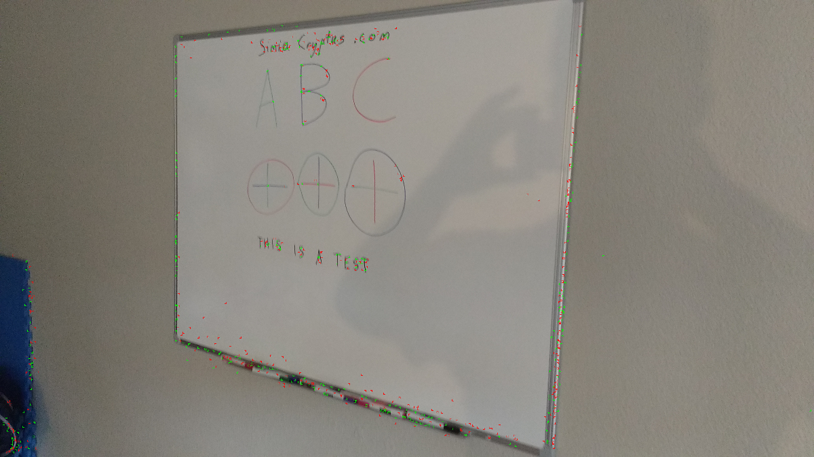
Code from [WhiteboardWorkflow.scala:239](../../src/test/scala/WhiteboardWorkflow.scala#L239) executed in 0.03 seconds: 
```java
    val boundsPoints = secondaryImages.zip(transforms).toMap.flatMap(x ⇒ {
      val (secondaryImage, transformParameters) = x
      val fromBtoA: Homography2D_F64 = transformParameters.invert(null)
      List((0, 0), (0, secondaryImage.getHeight), (secondaryImage.getWidth, 0), (secondaryImage.getWidth, secondaryImage.getHeight)).map(xx ⇒ {
        val (x: Int, y: Int) = xx
        transformXY(x, y, fromBtoA)
      })
    }).toList ++ List[(Double, Double)]((0, 0), (0, primaryImage.getHeight), (primaryImage.getWidth, 0), (primaryImage.getWidth, primaryImage.getHeight))
    System.out.println("renderMinX = " + boundsPoints.map(_._1).min)
    System.out.println("renderMaxX = " + boundsPoints.map(_._1).max)
    System.out.println("renderMinY = " + boundsPoints.map(_._2).min)
    System.out.println("renderMaxY = " + boundsPoints.map(_._2).max)
    boundsPoints
```
Logging: 
```
    renderMinX = -465.2668395522473
    renderMaxX = 3974.0735269294087
    renderMinY = -1339.378614985308
    renderMaxY = 2487.0045570626576
    
```

Returns: 
```
    List((374.17351574517454,-1339.378614985308), (3974.0735269294087,2487.0045570626576), (3911.011172145081,-261.74277046597354), (1342.15042234448,1037.418706961616), (1408.0938044078032,1217.0747667574938), (-465.2668395522473,-47.75555814468606), (739.1514407517967,-423.81435726099346), (-432.80968360175615,2381.996791407644), (0.0,0.0), (0.0,2241.0), (2887.0,0.0), (2887.0,2241.0))
```
Code from [WhiteboardWorkflow.scala:254](../../src/test/scala/WhiteboardWorkflow.scala#L254) executed in 0.00 seconds: 
```java
    val renderMinX = boundsPoints.map(_._1).min
    val renderMaxX = boundsPoints.map(_._1).max
    val renderMinY = boundsPoints.map(_._2).min
    val renderMaxY = boundsPoints.map(_._2).max
    if (expand) (Math.max(0, -renderMinX), Math.max(0, -renderMinY))
    else (0.0, 0.0)
```

Returns: 
```
    (0.0,0.0)
```
Code from [WhiteboardWorkflow.scala:262](../../src/test/scala/WhiteboardWorkflow.scala#L262) executed in 0.00 seconds: 
```java
    val renderMinX = boundsPoints.map(_._1).min
    val renderMaxX = boundsPoints.map(_._1).max
    val renderMinY = boundsPoints.map(_._2).min
    val renderMaxY = boundsPoints.map(_._2).max
    if (expand) (renderMaxX - renderMinX, renderMaxY - renderMinY)
    else (primaryImage.getWidth.toDouble, primaryImage.getHeight.toDouble)
```

Returns: 
```
    (2887.0,2241.0)
```
Code from [WhiteboardWorkflow.scala:272](../../src/test/scala/WhiteboardWorkflow.scala#L272) executed in 0.00 seconds: 
```java
    val interpolation = FactoryInterpolation.bilinearPixelS(classOf[GrayF32], BorderType.ZERO)
    val model = new PixelTransformHomography_F32
    val distort = DistortSupport.createDistortPL(classOf[GrayF32], model, interpolation, false)
    model.set(transformParameters)
    distort.setRenderAll(false)
    distort
```

Returns: 
```
    boofcv.alg.distort.impl.ImplImageDistort_PL@7555b920
```
Code from [WhiteboardWorkflow.scala:280](../../src/test/scala/WhiteboardWorkflow.scala#L280) executed in 1.32 seconds: 
```java
    val boofImage = ConvertBufferedImage.convertFromMulti(secondaryImage, null, true, classOf[GrayF32])
    val work: Planar[GrayF32] = boofImage.createNew(renderWidth.toInt, renderHeight.toInt)
    distortion.apply(boofImage, work)
    val output = new BufferedImage(renderWidth.toInt, renderHeight.toInt, primaryImage.getType)
    ConvertBufferedImage.convertTo(work, output, true)
    output
```

Returns: 

Code from [WhiteboardWorkflow.scala:227](../../src/test/scala/WhiteboardWorkflow.scala#L227) executed in 0.47 seconds: 
```java
    describe(featureDetector, secondaryImage)
```

Returns: 
```
    ([P( 1443.2672119140625 2226.90966796875 ), P( 1913.9791259765625 2220.982666015625 ), P( 975.9058837890625 2220.053466796875 ), P( 2144.640625 2214.33203125 ), P( 1214.54248046875 70.05429077148438 ), P( 849.1937255859375 75.34521484375 ), P( 2839.3818359375 2187.2373046875 ), P( 1178.359619140625 86.38858795166016 ), P( 2831.40283203125 2176.57421875 ), P( 1416.3604736328125 86.67276000976562 ), P( 69.51094055175781 2165.01708984375 ), P( 846.5931396484375 98.7073974609375 ), P( 48.64655685424805 2144.99365234375 ), P( 1071.943603515625 101.0238037109375 ), P( 1413.0013427734375 102.7807846069336 ), P( 2849.981689453125 1577.7216796875 ), P( 1650.3072509765625 102.2090835571289 ), P( 1823.968994140625 102.09890747070312 ), P( 1650.2794189453125 1472.332275390625 ), P( 1610.046142578125 1471.7225341796875 ), P( 1583.3221435546875 1473.973876953125 ), P( 1361.6968994140625 108.14279174804688 ), P( 1673.41650390625 1466.609130859375 ), P( 1397.1552734375 105.26310729980469 ), P( 1590.67138671875 1466.220947265625 ), P( 1446.1617431640625 108.53917694091797 ), P( 1511.55859375 107.76542663574219 ), P( 1374.179443359375 1470.386474609375 ), P( 1734.06201171875 1454.509521484375 ), P( 879.60400390625 110.27621459960938 ), P( 2861.45703125 1449.1817626953125 ), P( 1052.41796875 110.54682922363281 ), P( 1077.9600830078125 109.95024108886719 ), P( 1676.0921630859375 1452.305908203125 ), P( 1590.2392578125 1450.888671875 ), P( 1466.921142578125 112.06404113769531 ), P( 1643.6619873046875 110.09786987304688 ), P( 1829.3426513671875 111.66336059570312 ), P( 962.6229248046875 120.31745910644531 ), P( 975.4259033203125 117.3426513671875 ), P( 1243.95751953125 1451.9981689453125 ), P( 1182.278564453125 119.53956604003906 ), P( 1604.6619873046875 1437.155029296875 ), P( 1392.931884765625 1437.83544921875 ), P( 1376.6702880859375 1438.26025390625 ), P( 1380.4542236328125 117.05113220214844 ), P( 1706.8597412109375 116.5263671875 ), P( 1778.4195556640625 119.47186279296875 ), P( 1401.408203125 1429.7830810546875 ), P( 1384.527587890625 1431.0531005859375 ), P( 1259.2520751953125 1432.18115234375 ), P( 1364.449462890625 125.57904052734375 ), P( 1775.593505859375 125.41766357421875 ), P( 1718.7579345703125 1418.194580078125 ), P( 1803.60986328125 122.05990600585938 ), P( 1838.577392578125 123.93399810791016 ), P( 911.8789672851562 133.4733123779297 ), P( 1314.228759765625 130.91783142089844 ), P( 1373.83837890625 132.2015838623047 ), P( 881.56201171875 1421.4930419921875 ), P( 1727.800537109375 1412.6246337890625 ), P( 1582.595703125 1413.382568359375 ), P( 1772.585693359375 131.45266723632812 ), P( 1235.369140625 1413.2789306640625 ), P( 1710.594482421875 1409.783203125 ), P( 1085.92626953125 135.31930541992188 ), P( 1514.533447265625 1407.592529296875 ), P( 1067.8433837890625 1407.5137939453125 ), P( 936.7846069335938 1409.9483642578125 ), P( 1743.591064453125 1405.2711181640625 ), P( 1641.078125 134.87808227539062 ), P( 1708.7889404296875 138.37814331054688 ), P( 1746.229736328125 135.19869995117188 ), P( 1842.349853515625 134.75291442871094 ), P( 1610.93408203125 1404.0057373046875 ), P( 1544.8729248046875 1402.2108154296875 ), P( 1076.837646484375 139.9620361328125 ), P( 1380.76904296875 1400.8680419921875 ), P( 1254.14453125 142.94580078125 ), P( 1292.9114990234375 140.7726287841797 ), P( 957.2415771484375 1401.339111328125 ), P( 1392.419921875 1398.041259765625 ), P( 1604.67822265625 140.37753295898438 ), P( 1037.808837890625 1388.4705810546875 ), P( 872.77099609375 149.82403564453125 ), P( 911.9490966796875 149.97509765625 ), P( 1008.6785888671875 151.24984741210938 ), P( 1044.199462890625 149.663818359375 ), P( 1068.1568603515625 150.304931640625 ), P( 1044.8902587890625 1380.7410888671875 ), P( 894.0902099609375 1379.20263671875 ), P( 877.88232421875 1377.6524658203125 ), P( 886.1299438476562 1370.635498046875 ), P( 2861.99072265625 1367.321044921875 ), P( 867.9984130859375 1367.5782470703125 ), P( 1218.5213623046875 154.18458557128906 ), P( 2867.798828125 1128.6485595703125 ), P( 812.600341796875 1030.780029296875 ), P( 878.5789794921875 158.40109252929688 ), P( 1374.011474609375 996.2982177734375 ), P( 1358.190185546875 996.4254150390625 ), P( 1298.87744140625 158.85781860351562 ), P( 1199.8358154296875 992.7772216796875 ), P( 1365.3895263671875 987.70947265625 ), P( 1230.27294921875 618.2066650390625 ), P( 1215.1495361328125 428.3670959472656 ), P( 1491.3876953125 134.509765625 ), P( 1235.347412109375 137.33494567871094 ), P( 2843.9072265625 1928.1090087890625 ), P( 48.35279083251953 1859.269287109375 ), P( 1210.24072265625 140.27816772460938 ), P( 2853.254150390625 1797.31787109375 ), P( 2846.77099609375 1784.160888671875 ), P( 1653.994384765625 144.21682739257812 ), P( 12.044011116027832 900.2779541015625 ), P( 1505.587646484375 98.35838317871094 ), P( 2856.010986328125 1620.8580322265625 ), P( 1646.36865234375 1412.564208984375 ), P( 1188.296875 147.3825225830078 ), P( 1640.71240234375 102.72486877441406 ), P( 24.314655303955078 1024.348876953125 ), P( 1194.584716796875 96.83511352539062 ), P( 1711.961181640625 101.18919372558594 ), P( 1637.3857421875 107.36857604980469 ), P( 1704.166015625 108.40309143066406 ), P( 2860.017822265625 1462.7227783203125 ), P( 1784.946533203125 106.22065734863281 ), P( 2865.1279296875 1193.79296875 ), P( 2864.537353515625 1227.2366943359375 ), P( 1527.6939697265625 116.13333892822266 ), P( 18.339710235595703 1091.41796875 ), P( 2856.09814453125 1596.769287109375 ), P( 66.21321105957031 2027.826171875 ), P( 2847.341796875 2047.9560546875 ), P( 1305.5128173828125 186.9249267578125 ), P( 2859.06201171875 1928.548828125 ), P( 2858.986572265625 1401.4114990234375 ), P( 2832.21923828125 1401.16650390625 ), P( 1263.574462890625 1443.573486328125 ), P( 1895.6240234375 828.2392578125 ), P( 942.7890625 1400.666015625 ), P( 2852.99462890625 1760.8004150390625 ), P( 1700.759521484375 141.35125732421875 ), P( 1947.31787109375 896.4168090820312 ), P( 2855.60546875 1693.602783203125 ), P( 1403.648193359375 315.1909484863281 ), P( 2865.0439453125 923.1964111328125 ), P( 1721.5478515625 1455.9781494140625 ), P( 1311.3123779296875 174.19705200195312 ), P( 1305.917724609375 417.04718017578125 ), P( 1197.015625 1418.54150390625 ), P( 2858.88916015625 1575.637451171875 ), P( 2863.10986328125 1013.5240478515625 ), P( 30.04347038269043 1467.2479248046875 ), P( 2829.0732421875 1541.084716796875 ), P( 39.47704315185547 1532.334228515625 ), P( 1236.14306640625 1444.7530517578125 ), P( 2849.448486328125 2122.1318359375 ), P( 984.5179443359375 110.47708129882812 ), P( 1575.239990234375 1459.72412109375 ), P( 47.76618957519531 1811.04736328125 ), P( 54.243247985839844 2069.40771484375 ), P( 1193.09521484375 150.648681640625 ), P( 2864.76025390625 993.859375 ), P( 2826.08251953125 1353.567138671875 ), P( 2871.0107421875 987.32421875 ), P( 2030.943115234375 2218.94580078125 ), P( 1958.84814453125 2220.6748046875 ), P( 2855.52197265625 29.6370792388916 ), P( 1880.631103515625 813.1715698242188 ), P( 1409.6590576171875 2223.08837890625 ), P( 1203.634033203125 90.51835632324219 ), P( 1178.830810546875 95.89651489257812 ), P( 1406.5322265625 95.20137786865234 ), P( 1656.877197265625 98.5321044921875 ), P( 874.675537109375 105.11487579345703 ), P( 1775.0498046875 989.9346923828125 ), P( 1376.8690185546875 105.40237426757812 ), P( 1427.69482421875 106.23323822021484 ), P( 1810.711181640625 102.20878601074219 ), P( 1104.822265625 1019.896240234375 ), P( 1040.163330078125 110.04823303222656 ), P( 1187.93701171875 107.38462829589844 ), P( 1659.453857421875 111.28948974609375 ), P( 1710.1226806640625 111.59281921386719 ), P( 1455.133544921875 116.93905639648438 ), P( 1827.22119140625 115.69943237304688 ), P( 888.6813354492188 119.35282897949219 ), P( 116.88311004638672 2219.54052734375 ), P( 1343.182373046875 121.87420654296875 ), P( 1299.4603271484375 129.05111694335938 ), P( 1436.4981689453125 128.9680938720703 ), P( 1507.2386474609375 125.276123046875 ), P( 1650.701416015625 126.46017456054688 ), P( 1245.4443359375 134.80960083007812 ), P( 1263.2401123046875 133.00051879882812 ), P( 1353.655517578125 131.77394104003906 ), P( 2000.92431640625 221... and 14663 more bytes
```
Code from [WhiteboardWorkflow.scala:212](../../src/test/scala/WhiteboardWorkflow.scala#L212) executed in 0.03 seconds: 
```java
    gfx.drawImage(primaryImage, 0, 0, null)
    points.asScala.zip(descriptions.toList.asScala).foreach(x ⇒ {
      val (pt,d) = x
      if(d.white) {
        gfx.setColor(Color.GREEN)
      } else {
        gfx.setColor(Color.RED)
      }
      gfx.drawRect(pt.x.toInt - 4, pt.y.toInt - 4, 9, 9)
    })
```

Returns: 

Code from [WhiteboardWorkflow.scala:272](../../src/test/scala/WhiteboardWorkflow.scala#L272) executed in 0.00 seconds: 
```java
    val interpolation = FactoryInterpolation.bilinearPixelS(classOf[GrayF32], BorderType.ZERO)
    val model = new PixelTransformHomography_F32
    val distort = DistortSupport.createDistortPL(classOf[GrayF32], model, interpolation, false)
    model.set(transformParameters)
    distort.setRenderAll(false)
    distort
```

Returns: 
```
    boofcv.alg.distort.impl.ImplImageDistort_PL@6928f576
```
Code from [WhiteboardWorkflow.scala:280](../../src/test/scala/WhiteboardWorkflow.scala#L280) executed in 1.10 seconds: 
```java
    val boofImage = ConvertBufferedImage.convertFromMulti(secondaryImage, null, true, classOf[GrayF32])
    val work: Planar[GrayF32] = boofImage.createNew(renderWidth.toInt, renderHeight.toInt)
    distortion.apply(boofImage, work)
    val output = new BufferedImage(renderWidth.toInt, renderHeight.toInt, primaryImage.getType)
    ConvertBufferedImage.convertTo(work, output, true)
    output
```

Returns: 

Code from [WhiteboardWorkflow.scala:272](../../src/test/scala/WhiteboardWorkflow.scala#L272) executed in 0.00 seconds: 
```java
    val interpolation = FactoryInterpolation.bilinearPixelS(classOf[GrayF32], BorderType.ZERO)
    val model = new PixelTransformHomography_F32
    val distort = DistortSupport.createDistortPL(classOf[GrayF32], model, interpolation, false)
    model.set(transformParameters)
    distort.setRenderAll(false)
    distort
```

Returns: 
```
    boofcv.alg.distort.impl.ImplImageDistort_PL@27e0f2f5
```
Code from [WhiteboardWorkflow.scala:280](../../src/test/scala/WhiteboardWorkflow.scala#L280) executed in 1.33 seconds: 
```java
    val boofImage = ConvertBufferedImage.convertFromMulti(secondaryImage, null, true, classOf[GrayF32])
    val work: Planar[GrayF32] = boofImage.createNew(renderWidth.toInt, renderHeight.toInt)
    distortion.apply(boofImage, work)
    val output = new BufferedImage(renderWidth.toInt, renderHeight.toInt, primaryImage.getType)
    ConvertBufferedImage.convertTo(work, output, true)
    output
```

Returns: 
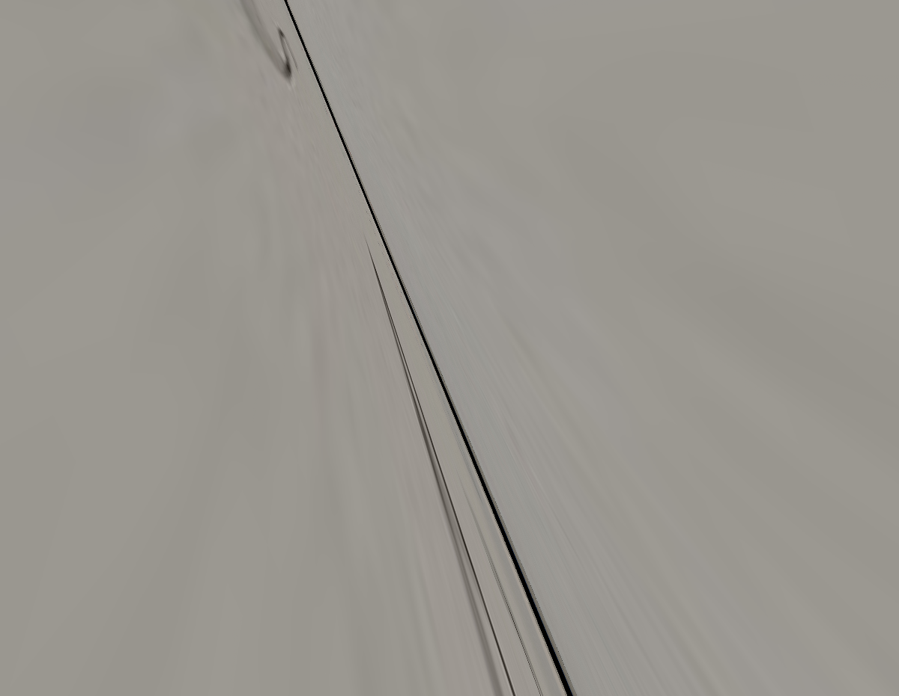
Code from [WhiteboardWorkflow.scala:227](../../src/test/scala/WhiteboardWorkflow.scala#L227) executed in 0.51 seconds: 
```java
    describe(featureDetector, secondaryImage)
```

Returns: 
```
    ([P( 1127.702880859375 545.780029296875 ), P( 1304.83837890625 980.0791015625 ), P( 1313.6376953125 1002.2474365234375 ), P( 1344.209228515625 1044.250244140625 ), P( 935.6738891601562 74.9903564453125 ), P( 1271.84326171875 899.2105712890625 ), P( 1269.3875732421875 859.968017578125 ), P( 962.6689453125 141.2600555419922 ), P( 1476.72314453125 1373.2093505859375 ), P( 1469.811279296875 1386.503662109375 ), P( 1487.9691162109375 1401.1097412109375 ), P( 1229.56298828125 795.8900756835938 ), P( 1226.647216796875 788.7735595703125 ), P( 995.7938232421875 222.74075317382812 ), P( 1236.27099609375 778.2899780273438 ), P( 1493.856689453125 1416.358642578125 ), P( 1220.75439453125 773.8862915039062 ), P( 1496.755615234375 1423.474365234375 ), P( 1017.4163818359375 242.37840270996094 ), P( 1214.635009765625 759.552490234375 ), P( 1502.8211669921875 1437.802001953125 ), P( 1505.38623046875 1444.2940673828125 ), P( 1211.79931640625 751.962158203125 ), P( 1508.8236083984375 1452.0107421875 ), P( 1512.038818359375 1459.5518798828125 ), P( 1514.76953125 1467.665283203125 ), P( 1208.7012939453125 744.5299682617188 ), P( 1517.7352294921875 1474.07373046875 ), P( 1520.9808349609375 1482.055908203125 ), P( 1674.078857421875 1857.983154296875 ), P( 1523.688720703125 1489.4139404296875 ), P( 1037.566162109375 325.28790283203125 ), P( 1671.220458984375 1850.2679443359375 ), P( 1527.05712890625 1496.7196044921875 ), P( 1668.051025390625 1842.4024658203125 ), P( 1530.287109375 1504.602294921875 ), P( 1193.699951171875 707.650390625 ), P( 1533.0980224609375 1512.250732421875 ), P( 1203.46875 697.8237915039062 ), P( 1665.210205078125 1835.1318359375 ), P( 1661.749267578125 1828.1737060546875 ), P( 1535.990966796875 1518.3116455078125 ), P( 1187.7335205078125 693.1792602539062 ), P( 1538.99365234375 1526.809326171875 ), P( 1541.9571533203125 1533.612548828125 ), P( 1655.8443603515625 1812.7935791015625 ), P( 1545.199462890625 1541.891357421875 ), P( 1181.68017578125 678.262451171875 ), P( 1653.2032470703125 1806.08837890625 ), P( 1649.837646484375 1798.3626708984375 ), P( 1547.884521484375 1547.95068359375 ), P( 1647.0501708984375 1791.375244140625 ), P( 1644.106689453125 1784.1939697265625 ), P( 1067.6722412109375 399.2492980957031 ), P( 1551.1622314453125 1556.7081298828125 ), P( 1640.9036865234375 1776.5859375 ), P( 1169.580322265625 648.90478515625 ), P( 1553.964111328125 1562.6326904296875 ), P( 1638.192626953125 1769.066650390625 ), P( 1634.917236328125 1761.52001953125 ), P( 1557.24951171875 1570.958251953125 ), P( 1632.08642578125 1754.135009765625 ), P( 1079.878662109375 427.746337890625 ), P( 1560.044189453125 1577.5660400390625 ), P( 1562.8289794921875 1584.876708984375 ), P( 1628.951416015625 1746.6982421875 ), P( 1566.084716796875 1592.781494140625 ), P( 1098.184326171875 440.5062255859375 ), P( 1088.54541015625 450.52484130859375 ), P( 1626.105224609375 1739.7392578125 ), P( 1091.566162109375 456.9747619628906 ), P( 1104.543212890625 454.98101806640625 ), P( 1622.8857421875 1732.3172607421875 ), P( 1568.7900390625 1599.833984375 ), P( 1154.6619873046875 612.2890625 ), P( 1572.197265625 1606.9200439453125 ), P( 1620.0567626953125 1724.8544921875 ), P( 1574.8721923828125 1614.229736328125 ), P( 1617.288818359375 1718.0072021484375 ), P( 1577.638671875 1621.038330078125 ), P( 1103.6212158203125 486.437255859375 ), P( 1613.98193359375 1710.236328125 ), P( 1611.2734375 1702.7479248046875 ), P( 1580.881103515625 1628.853271484375 ), P( 1608.046875 1696.22802734375 ), P( 1112.5235595703125 508.3384094238281 ), P( 1583.8011474609375 1636.39111328125 ), P( 1586.9615478515625 1643.7451171875 ), P( 1605.107177734375 1687.939453125 ), P( 1602.32421875 1681.832275390625 ), P( 1131.2978515625 521.4417724609375 ), P( 1599.066650390625 1672.9354248046875 ), P( 1596.21142578125 1667.172119140625 ), P( 1590.2669677734375 1651.8056640625 ), P( 1593.1475830078125 1658.1983642578125 ), P( 1583.7491455078125 1667.7557373046875 ), P( 969.4542236328125 105.00634002685547 ), P( 1589.7265625 1682.652099609375 ), P( 1595.661376953125 1697.36181640625 ), P( 1604.6964111328125 1719.87451171875 ), P( 1113.122314453125 459.0328674316406 ), P( 1610.665283203125 1734.66015625 ), P( 1553.6920166015625 1594.126953125 ), P( 1619.8758544921875 1757.4173583984375 ), P( 1622.800048828125 1764.67529296875 ), P( 1070.530029296875 405.9417724609375 ), P( 1538.78662109375 1556.896484375 ), P( 1640.82177734375 1809.1900634765625 ), P( 1532.677490234375 1541.86279296875 ), P( 1646.79638671875 1823.3682861328125 ), P( 1062.3768310546875 335.6263427734375 ), P( 1034.53857421875 317.9576110839844 ), P( 1661.6949462890625 1861.0968017578125 ), P( 1031.57177734375 309.7619934082031 ), P( 1205.36376953125 736.0770263671875 ), P( 1670.5367431640625 1882.015625 ), P( 1346.6280517578125 1083.4044189453125 ), P( 951.0726318359375 60.01496124267578 ), P( 1487.6988525390625 1431.3822021484375 ), P( 1484.46923828125 1423.2010498046875 ), P( 1352.6170654296875 1098.283935546875 ), P( 1481.7298583984375 1416.4608154296875 ), P( 1475.732666015625 1401.06201171875 ), P( 1466.6531982421875 1379.4215087890625 ), P( 1244.728515625 833.1468505859375 ), P( 1247.57177734375 840.8010864257812 ), P( 987.3162231445312 149.46334838867188 ), P( 1754.87841796875 2091.151123046875 ), P( 1385.5042724609375 1179.0819091796875 ), P( 1433.680419921875 1297.46435546875 ), P( 1388.5682373046875 1186.038818359375 ), P( 1259.559814453125 870.057861328125 ), P( 1400.613525390625 1215.19384765625 ), P( 1262.4898681640625 877.0543212890625 ), P( 1146.1181640625 539.9290771484375 ), P( 1463.7581787109375 1371.8848876953125 ), P( 942.4378662109375 38.6416015625 ), P( 1232.5367431640625 807.711669921875 ), P( 1199.4981689453125 726.7095947265625 ), P( 927.4982299804688 17.055267333984375 ), P( 1449.4727783203125 1297.6162109375 ), P( 1532.7235107421875 1547.308349609375 ), P( 930.118408203125 24.399089813232422 ), P( 1446.2000732421875 1289.7047119140625 ), P( 923.9410400390625 29.875843048095703 ), P( 1443.3253173828125 1283.3133544921875 ), P( 1440.21923828125 1275.148681640625 ), P( 1437.42138671875 1268.051513671875 ), P( 1434.14111328125 1261.07275390625 ), P( 926.4534912109375 57.679649353027344 ), P( 1431.3685302734375 1253.4232177734375 ), P( 1454.997314453125 1311.578125 ), P( 929.8704833984375 65.49009704589844 ), P( 1428.77001953125 1246.62841796875 ), P( 948.4293212890625 68.70794677734375 ), P( 1523.5400390625 1524.493896484375 ), P( 935.96044921875 79.57856750488281 ), P( 951.587890625 76.782470703125 ), P( 1425.291259765625 1238.9000244140625 ), P( 954.215576171875 83.41720581054688 ), P( 1422.004638671875 1230.551025390625 ), P( 941.431884765625 93.9781723022461 ), P( 1419.3846435546875 1223.999267578125 ), P( 1823.8494873046875 2224.3779296875 ), P( 1415.984375 1216.4510498046875 ), P( 959.642333984375 117.90653228759766 ), P( 1577.92041015625 1658.437744140625 ), P( 1409.6944580078125 1201.260986328125 ), P( 1464.20263671875 1334.837158203125 ), P( 1407.206298828125 1194.873779296875 ), P( 975.0860595703125 135.10690307617188 ), P( 1404.5380859375 1186.989501953125 ), P( 963.018798828125 146.15261840820312 ), P( 1467.0428466796875 1340.921875 ), P( 1400.9111328125 1179.6160888671875 ), P( 1398.339599609375 1173.23486328125 ), P( 1395.0374755859375 1164.345458984375 ), P( 977.8515014648438 162.12649536132812 ), P( 987.3173217773438 164.23899841308594 ), P( 971.6903686523438 168.58499145507812 ), P( 1392.26416015625 1158.2626953125 ), P( 990.4302978515625 171.38546752929688 ), P( 1820.972900390625 2216.087158203125 ), P( 974.5062255859375 174.9346923828125 ), P( 993.458984375 179.11831665039062 ), P( 1818.4134521484375 2210.030029296875 ), P( 1383.56005859375 1135.85205078125 ), P( 1613.5528564453125 1747.411865234375 ), P( 1364.47412109375 1131.8330078125 ), P( 1815.03076171875 2201.561767578125 ), P( 983.7777099609375 197.34910583496094 ), P( 986.5169677734375 204.66819763183594 ), P( 1358.4541015625 1116.9063720703125 ), P( 1355.7249755859375 1110.772216796875 ), P( 1008.2027587890625 215.98562622070312 ), P( 996.04345703125 226.77049255371094 ), P( 1365.3189697265625 1091.8642578125 ), P( 1812.3193359375 2194.6462... and 25288 more bytes
```
Code from [WhiteboardWorkflow.scala:212](../../src/test/scala/WhiteboardWorkflow.scala#L212) executed in 0.03 seconds: 
```java
    gfx.drawImage(primaryImage, 0, 0, null)
    points.asScala.zip(descriptions.toList.asScala).foreach(x ⇒ {
      val (pt,d) = x
      if(d.white) {
        gfx.setColor(Color.GREEN)
      } else {
        gfx.setColor(Color.RED)
      }
      gfx.drawRect(pt.x.toInt - 4, pt.y.toInt - 4, 9, 9)
    })
```

Returns: 
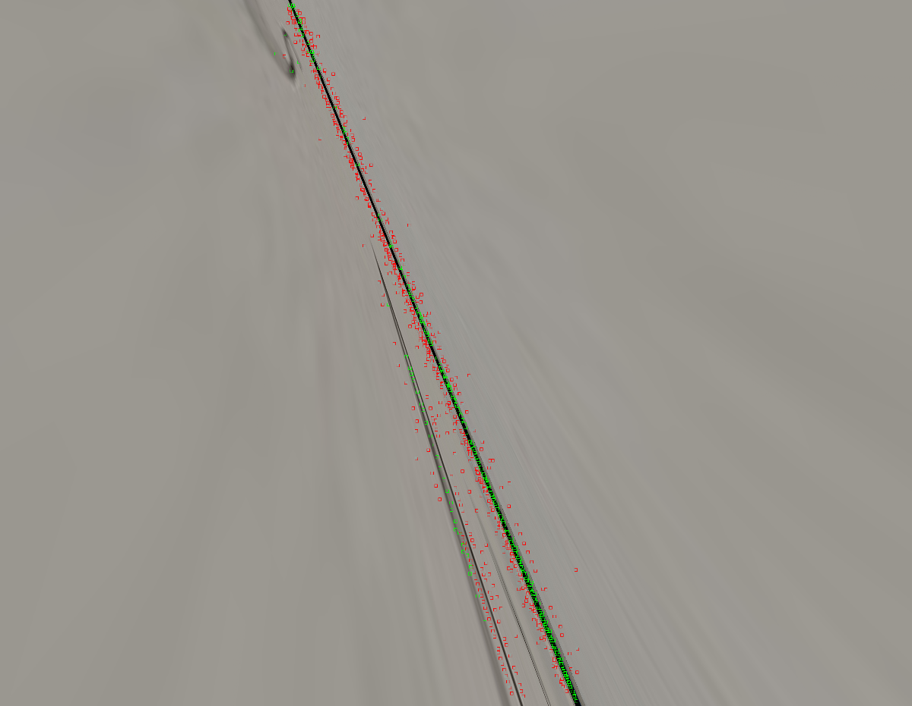
Code from [WhiteboardWorkflow.scala:272](../../src/test/scala/WhiteboardWorkflow.scala#L272) executed in 0.00 seconds: 
```java
    val interpolation = FactoryInterpolation.bilinearPixelS(classOf[GrayF32], BorderType.ZERO)
    val model = new PixelTransformHomography_F32
    val distort = DistortSupport.createDistortPL(classOf[GrayF32], model, interpolation, false)
    model.set(transformParameters)
    distort.setRenderAll(false)
    distort
```

Returns: 
```
    boofcv.alg.distort.impl.ImplImageDistort_PL@780ec4a5
```
Code from [WhiteboardWorkflow.scala:280](../../src/test/scala/WhiteboardWorkflow.scala#L280) executed in 0.47 seconds: 
```java
    val boofImage = ConvertBufferedImage.convertFromMulti(secondaryImage, null, true, classOf[GrayF32])
    val work: Planar[GrayF32] = boofImage.createNew(renderWidth.toInt, renderHeight.toInt)
    distortion.apply(boofImage, work)
    val output = new BufferedImage(renderWidth.toInt, renderHeight.toInt, primaryImage.getType)
    ConvertBufferedImage.convertTo(work, output, true)
    output
```

Returns: 

Code from [WhiteboardWorkflow.scala:189](../../src/test/scala/WhiteboardWorkflow.scala#L189) executed in 0.03 seconds: 
```java
    gfx.drawImage(primaryImage,0,0,null)
    gfx.setStroke(new BasicStroke(3))
    gfx.setColor(Color.YELLOW)
    gfx.drawRect(tileBounds.p0.x.toInt, tileBounds.p0.x.toInt, tileBounds.getWidth.toInt, tileBounds.getHeight.toInt)
    gfx.setColor(Color.RED)
    gfx.drawRect(superTileBounds.p0.x.toInt, superTileBounds.p0.x.toInt, superTileBounds.getWidth.toInt, superTileBounds.getHeight.toInt)
```

Returns: 
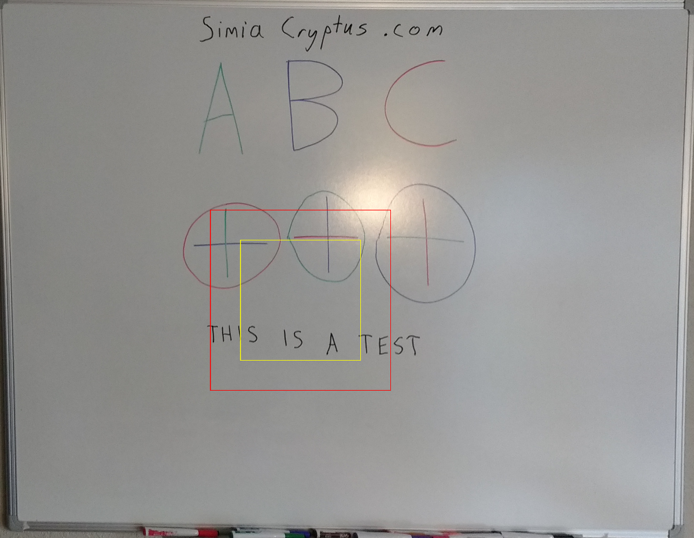
Code from [WhiteboardWorkflow.scala:208](../../src/test/scala/WhiteboardWorkflow.scala#L208) executed in 0.03 seconds: 
```java
    describe(featureDetector, primaryImage)
```

Returns: 
```
    ([P( 68.3247299194336 13.261783599853516 ), P( 48.490516662597656 14.350648880004883 ), P( 104.84534454345703 14.628320693969727 ), P( 225.62594604492188 19.891521453857422 ), P( 149.5500030517578 33.50448226928711 ), P( 228.14190673828125 38.04413604736328 ), P( 234.62661743164062 37.53702163696289 ), P( 143.6331329345703 47.17471694946289 ), P( 218.51486206054688 45.15355682373047 ), P( 224.66043090820312 59.018402099609375 ), P( 243.34799194335938 60.399688720703125 ), P( 153.45928955078125 66.42379760742188 ), P( 150.45944213867188 72.22251892089844 ), P( 125.95944213867188 78.87551879882812 ), P( 134.89100646972656 74.6285171508789 ), P( 258.3419189453125 89.1769027709961 ), P( 359.1982421875 86.87174987792969 ), P( 123.03142547607422 99.124755859375 ), P( 129.27883911132812 101.29289245605469 ), P( 476.77911376953125 102.03421020507812 ), P( 254.30963134765625 114.88252258300781 ), P( 483.09149169921875 114.4457015991211 ), P( 263.8116455078125 117.10157775878906 ), P( 285.3909606933594 122.69361877441406 ), P( 312.55804443359375 143.68016052246094 ), P( 317.65899658203125 158.6228790283203 ), P( 425.1240234375 158.4195098876953 ), P( 38.804439544677734 353.34844970703125 ), P( 29.15126609802246 359.40997314453125 ), P( 48.23979187011719 383.4647216796875 ), P( 54.7097282409668 380.3420715332031 ), P( 30.53350067138672 386.19781494140625 ), P( 41.58034133911133 387.05450439453125 ), P( 63.38548278808594 386.37664794921875 ), P( 378.27569580078125 396.5937194824219 ), P( 192.2478790283203 401.54345703125 ), P( 248.80126953125 411.1883239746094 ), P( 258.5244140625 410.9052734375 ), P( 390.18267822265625 414.5338134765625 ), P( 396.3275146484375 416.96282958984375 ), P( 198.85693359375 425.5011291503906 ), P( 246.4497528076172 426.32720947265625 ), P( 381.689453125 427.3027038574219 ), P( 179.64817810058594 431.5863037109375 ), P( 373.86572265625 434.8963623046875 ), P( 390.8624267578125 434.3912353515625 ), P( 402.40899658203125 434.9788818359375 ), P( 399.4944763183594 444.3166809082031 ), P( 252.40599060058594 447.53741455078125 ), P( 359.61029052734375 449.98394775390625 ), P( 372.347412109375 450.57135009765625 ), P( 356.58648681640625 456.6429748535156 ), P( 375.34967041015625 458.403564453125 ), P( 392.0054626464844 465.531494140625 ), P( 369.9889221191406 477.98455810546875 ), P( 32.05903244018555 14.621177673339844 ), P( 364.22698974609375 47.84532928466797 ), P( 239.36448669433594 97.13484191894531 ), P( 242.50283813476562 101.6220932006836 ), P( 464.6270751953125 116.35220336914062 ), P( 54.27174377441406 360.754150390625 ), P( 45.36154556274414 372.3118896484375 ), P( 192.69776916503906 371.3973388671875 ), P( 255.38046264648438 371.5841369628906 ), P( 72.46322631835938 392.5076904296875 ), P( 365.4391784667969 395.43939208984375 ), P( 393.31854248046875 398.8338317871094 ), P( 228.52761840820312 404.0076904296875 ), P( 218.77133178710938 407.76885986328125 ), P( 176.81741333007812 422.73602294921875 ), P( 402.60833740234375 429.6011962890625 ), P( 218.73880004882812 437.8424072265625 ), P( 408.4244384765625 447.9329833984375 ), P( 102.05587768554688 17.74121856689453 ), P( 239.14419555664062 102.17573547363281 ), P( 456.2044677734375 149.38058471679688 ), P( 35.770973205566406 383.2952880859375 ), P( 53.417510986328125 408.33587646484375 ), P( 65.89067077636719 419.38848876953125 ), P( 173.5307159423828 421.3856506347656 ), P( 402.33599853515625 420.765625 ), P( 188.45750427246094 431.22064208984375 ), P( 372.757080078125 434.1849365234375 ), P( 257.50390625 449.14849853515625 ), P( 383.8547058105469 447.69085693359375 ), P( 65.60028839111328 376.9598388671875 ), P( 357.4443359375 393.3514709472656 ), P( 397.55419921875 389.5489196777344 ), P( 352.9906005859375 439.8614501953125 ), P( 261.656005859375 395.6602478027344 ), P( 381.65863037109375 399.1583251953125 ), P( 347.7931213378906 441.50225830078125 ), P( 48.94843292236328 371.2859802246094 ), P( 410.6282958984375 382.952880859375 ), P( 57.39107894897461 410.5379333496094 ), P( 242.04872131347656 391.76373291015625 )],boofcv.alg.descriptor.UtilFeature$2@64f857e7)
```
Code from [WhiteboardWorkflow.scala:212](../../src/test/scala/WhiteboardWorkflow.scala#L212) executed in 0.00 seconds: 
```java
    gfx.drawImage(primaryImage, 0, 0, null)
    points.asScala.zip(descriptions.toList.asScala).foreach(x ⇒ {
      val (pt,d) = x
      if(d.white) {
        gfx.setColor(Color.GREEN)
      } else {
        gfx.setColor(Color.RED)
      }
      gfx.drawRect(pt.x.toInt - 4, pt.y.toInt - 4, 9, 9)
    })
```

Returns: 
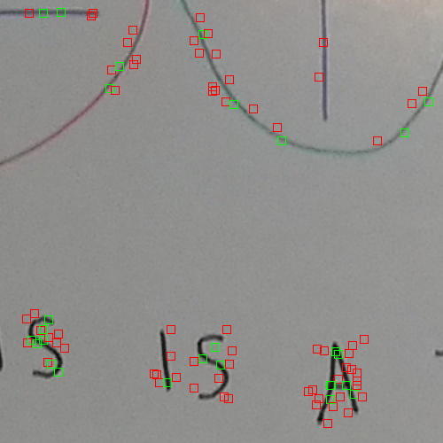
Code from [WhiteboardWorkflow.scala:227](../../src/test/scala/WhiteboardWorkflow.scala#L227) executed in 0.06 seconds: 
```java
    describe(featureDetector, secondaryImage)
```

Returns: 
```
    ([P( 593.15771484375 18.946212768554688 ), P( 725.5059814453125 17.349266052246094 ), P( 621.41650390625 29.73861312866211 ), P( 617.9360961914062 35.8498649597168 ), P( 719.6436157226562 33.45429992675781 ), P( 621.21044921875 41.69770812988281 ), P( 722.711181640625 41.067142486572266 ), P( 611.4519653320312 48.592323303222656 ), P( 630.2449951171875 47.04039764404297 ), P( 614.4906616210938 54.77325439453125 ), P( 720.513671875 72.95060729980469 ), P( 726.5248413085938 72.08839416503906 ), P( 642.282470703125 77.45384216308594 ), P( 285.14874267578125 80.46481323242188 ), P( 488.82965087890625 81.44465637207031 ), P( 704.3368530273438 79.8660888671875 ), P( 723.4505615234375 80.19738006591797 ), P( 701.3466186523438 87.09539794921875 ), P( 640.8353881835938 95.99602508544922 ), P( 694.7706298828125 113.56060791015625 ), P( 711.0590209960938 114.17848205566406 ), P( 323.36749267578125 119.8802261352539 ), P( 353.9614562988281 120.14512634277344 ), P( 489.1580810546875 117.31036376953125 ), P( 594.3641967773438 120.98980712890625 ), P( 497.5732421875 126.0029296875 ), P( 85.0902099609375 143.99365234375 ), P( 121.77162170410156 144.28997802734375 ), P( 690.20947265625 149.85629272460938 ), P( 18.30987548828125 156.3523406982422 ), P( 360.2923583984375 201.20053100585938 ), P( 696.1539306640625 200.35446166992188 ), P( 696.4629516601562 206.57525634765625 ), P( 687.7678833007812 212.75399780273438 ), P( 692.4800415039062 212.593994140625 ), P( 705.4290771484375 235.77362060546875 ), P( 708.4818115234375 242.92886352539062 ), P( 491.2511901855469 249.35609436035156 ), P( 701.3558959960938 257.8844299316406 ), P( 714.413330078125 257.39373779296875 ), P( 698.617919921875 264.4826354980469 ), P( 707.9933471679688 269.64703369140625 ), P( 575.7611083984375 284.23553466796875 ), P( 722.56005859375 306.057373046875 ), P( 24.65255355834961 489.02685546875 ), P( 152.11083984375 492.09393310546875 ), P( 179.75967407226562 490.673583984375 ), P( 16.254871368408203 498.7052001953125 ), P( 87.15555572509766 503.96636962890625 ), P( 167.93853759765625 502.4447937011719 ), P( 356.6680908203125 500.57763671875 ), P( 57.501102447509766 512.2000732421875 ), P( 71.79277801513672 512.9698486328125 ), P( 87.21368408203125 512.8328857421875 ), P( 129.05392456054688 513.2567138671875 ), P( 51.25890350341797 521.7581176757812 ), P( 65.40584564208984 521.051513671875 ), P( 357.691650390625 521.9946899414062 ), P( 623.7151489257812 519.0447387695312 ), P( 666.69140625 518.0546875 ), P( 59.62970733642578 529.45068359375 ), P( 113.76382446289062 525.0968017578125 ), P( 503.43743896484375 527.3175048828125 ), P( 644.7498168945312 528.1538696289062 ), P( 74.53291320800781 531.5823364257812 ), P( 732.9695434570312 533.4207153320312 ), P( 182.8983154296875 539.522216796875 ), P( 513.3978271484375 540.27490234375 ), P( 718.4466552734375 540.4967651367188 ), P( 302.36187744140625 547.0029907226562 ), P( 378.037109375 545.4640502929688 ), P( 704.4194946289062 542.3582763671875 ), P( 711.6693115234375 549.5552978515625 ), P( 371.6010437011719 556.3499145507812 ), P( 491.3731689453125 554.87939453125 ), P( 506.8997497558594 556.750732421875 ), P( 498.53656005859375 563.869140625 ), P( 711.010986328125 560.4635009765625 ), P( 358.4046630859375 567.694580078125 ), P( 384.28863525390625 569.1546020507812 ), P( 654.219970703125 568.4134521484375 ), P( 725.802490234375 566.2076416015625 ), P( 365.9652404785156 575.8836059570312 ), P( 531.3837280273438 579.3786010742188 ), P( 711.8501586914062 578.6976318359375 ), P( 479.4613952636719 590.383056640625 ), P( 515.3150634765625 591.3262329101562 ), P( 731.5237426757812 599.7811279296875 ), P( 62.75705337524414 16.196704864501953 ), P( 719.8785400390625 27.429550170898438 ), P( 713.480224609375 44.20429611206055 ), P( 336.53106689453125 59.83654022216797 ), P( 704.7055053710938 74.55732727050781 ), P( 327.988525390625 92.55543518066406 ), P( 720.41552734375 93.35592651367188 ), P( 630.2901000976562 105.29580688476562 ), P( 717.4775390625 101.80245208740234 ), P( 405.0081481933594 117.09098815917969 ), P( 73.0838851928711 134.33543395996094 ), P( 228.4593505859375 145.6659698486328 ), P( 53.22718048095703 156.49525451660156 ), P( 74.3158187866211 156.1319122314453 ), P( 702.4231567382812 218.710693359375 ), P( 683.3051147460938 229.1407470703125 ), P( 612.1422729492188 240.40682983398438 ), P( 689.580322265625 248.58843994140625 ), P( 714.4254150390625 252.34982299804688 ), P( 698.7122192382812 269.3274230957031 ), P( 707.2557373046875 285.8201904296875 ), P( 713.5145874023438 282.45928955078125 ), P( 726.4868774414062 287.66351318359375 ), P( 173.94189453125 513.0661010742188 ), P( 132.26962280273438 518.4237670898438 ), P( 195.23651123046875 519.0370483398438 ), P( 79.22064971923828 521.6674194335938 ), P( 188.61663818359375 526.0633544921875 ), P( 516.762939453125 524.476806640625 ), P( 93.5026626586914 527.0588989257812 ), P( 621.2330322265625 528.6318359375 ), P( 519.60302734375 532.9871215820312 ), P( 654.9534912109375 537.7330932617188 ), P( 516.2079467773438 545.5979614257812 ), P( 169.05767822265625 551.0953979492188 ), P( 525.4177856445312 554.2603759765625 ), P( 302.66705322265625 558.03564453125 ), P( 485.595458984375 571.440185546875 ), P( 531.4445190429688 572.834228515625 ), P( 704.7256469726562 570.0750732421875 ), P( 482.5509338378906 578.0449829101562 ), P( 479.63507080078125 585.3168334960938 ), P( 696.0071411132812 587.60986328125 ), P( 695.8934326171875 93.68809509277344 ), P( 708.7146606445312 229.73471069335938 ), P( 714.7045288085938 245.78591918945312 ), P( 65.44194030761719 508.5661926269531 ), P( 132.00619506835938 509.89105224609375 ), P( 341.1929931640625 503.6758117675781 ), P( 52.420326232910156 521.45654296875 ), P( 107.49383544921875 522.4136962890625 ), P( 364.71856689453125 522.47265625 ), P( 66.9220199584961 534.3528442382812 ), P( 523.4266357421875 534.69677734375 ), P( 644.3218383789062 528.1898193359375 ), P( 178.4636993408203 538.7035522460938 ), P( 324.01800537109375 540.1627197265625 ), P( 656.222412109375 541.0584716796875 ), P( 168.96835327148438 551.2963256835938 ), P( 198.55459594726562 557.663330078125 ), P( 487.192138671875 553.8909301757812 ), P( 716.0653076171875 554.9432983398438 ), P( 508.8238220214844 577.8932495117188 ), P( 534.244384765625 574.1384887695312 ), P( 706.08203125 601.375244140625 ), P( 341.840576171875 107.2936019897461 ), P( 63.53197479248047 146.34469604492188 ), P( 353.86859130859375 138.8664093017578 ), P( 46.773468017578125 162.96168518066406 ), P( 37.75634765625 478.6784362792969 ), P( 94.80307006835938 507.7859802246094 ), P( 383.5137939453125 527.1014404296875 ), P( 523.5609130859375 522.7310791015625 ), P( 107.1200180053711 533.2887573242188 ), P( 706.4110107421875 569.3650512695312 ), P( 311.92559814453125 145.5914306640625 ), P( 58.14194869995117 478.2569274902344 ), P( 144.50778198242188 527.8795166015625 ), P( 341.33404541015625 548.7113037109375 ), P( 142.1258087158203 476.2454833984375 ), P( 171.6160888671875 501.840576171875 ), P( 64.04735565185547 523.71875 ), P( 360.244873046875 519.214111328125 ), P( 181.38644409179688 541.9202270507812 ), P( 466.93621826171875 558.79052734375 ), P( 491.944091796875 119.95938110351562 ), P( 74.80277252197266 144.49183654785156 ), P( 170.10137939453125 522.74365234375 ), P( 357.830810546875 544.2771606445312 ), P( 341.150634765625 534.928955078125 )],boofcv.alg.descriptor.UtilFeature$2@24a1c17f)
```
Code from [WhiteboardWorkflow.scala:212](../../src/test/scala/WhiteboardWorkflow.scala#L212) executed in 0.00 seconds: 
```java
    gfx.drawImage(primaryImage, 0, 0, null)
    points.asScala.zip(descriptions.toList.asScala).foreach(x ⇒ {
      val (pt,d) = x
      if(d.white) {
        gfx.setColor(Color.GREEN)
      } else {
        gfx.setColor(Color.RED)
      }
      gfx.drawRect(pt.x.toInt - 4, pt.y.toInt - 4, 9, 9)
    })
```

Returns: 
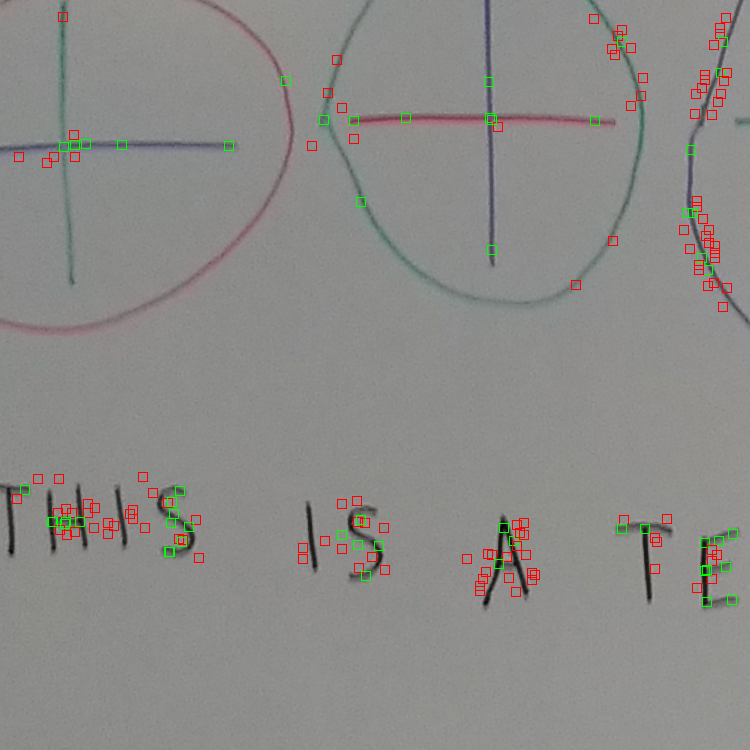
Code from [WhiteboardWorkflow.scala:227](../../src/test/scala/WhiteboardWorkflow.scala#L227) executed in 0.07 seconds: 
```java
    describe(featureDetector, secondaryImage)
```

Returns: 
```
    ([P( 353.8941955566406 23.814254760742188 ), P( 356.86016845703125 32.18658447265625 ), P( 360.0007629394531 40.865081787109375 ), P( 375.3348083496094 47.184146881103516 ), P( 362.9468994140625 49.6797981262207 ), P( 365.8730773925781 58.033409118652344 ), P( 368.7165222167969 67.15532684326172 ), P( 371.8792724609375 75.54087829589844 ), P( 374.6831359863281 84.7666015625 ), P( 377.9256286621094 93.20510864257812 ), P( 380.7796325683594 101.2705307006836 ), P( 386.9541320800781 118.92514038085938 ), P( 374.6576232910156 123.7021484375 ), P( 377.66845703125 132.68812561035156 ), P( 380.68218994140625 141.7032012939453 ), P( 383.65887451171875 150.72752380371094 ), P( 386.6545715332031 159.7100067138672 ), P( 389.6741943359375 168.6748809814453 ), P( 426.28753662109375 191.00949096679688 ), P( 438.1292724609375 225.09378051757812 ), P( 444.1112365722656 242.62722778320312 ), P( 450.27899169921875 259.9043273925781 ), P( 462.20086669921875 293.5929260253906 ), P( 468.2332763671875 311.0439147949219 ), P( 446.778076171875 336.6842041015625 ), P( 480.2300720214844 344.474365234375 ), P( 452.67132568359375 354.6899719238281 ), P( 455.67816162109375 363.6639404296875 ), P( 458.68975830078125 372.6041564941406 ), P( 461.68255615234375 381.6490478515625 ), P( 464.6770935058594 390.6650390625 ), P( 467.6252746582031 399.5792236328125 ), P( 470.822021484375 408.11065673828125 ), P( 531.1767578125 489.45123291015625 ), P( 537.4005737304688 505.77899169921875 ), P( 549.1982421875 540.2919921875 ), P( 527.694091796875 576.6173706054688 ), P( 530.6841430664062 585.638916015625 ), P( 533.697998046875 594.6222534179688 ), P( 536.6973876953125 603.6209716796875 ), P( 539.683837890625 612.6590576171875 ), P( 573.1884155273438 608.4461669921875 ), P( 563.8096923828125 618.7734985351562 ), P( 542.6929321289062 621.65234375 ), P( 545.5374755859375 630.53076171875 ), P( 566.71337890625 627.6685791015625 ), P( 548.7774658203125 638.1411743164062 ), P( 588.3287353515625 650.8366088867188 ), P( 578.6497802734375 660.657470703125 ), P( 591.3003540039062 659.3609619140625 ), P( 581.8700561523438 669.5575561523438 ), P( 594.4664306640625 668.1145629882812 ), P( 584.7684326171875 677.9031982421875 ), P( 597.4484252929688 676.733154296875 ), P( 587.6384887695312 685.24755859375 ), P( 590.7672729492188 695.41357421875 ), P( 603.309814453125 693.7506103515625 ), P( 593.6553955078125 702.7981567382812 ), P( 606.3607788085938 702.133056640625 ), P( 596.949951171875 712.7906494140625 ), P( 609.3077392578125 710.3953857421875 ), P( 599.8705444335938 720.2251586914062 ), P( 602.7680053710938 729.7432250976562 ), P( 615.4305419921875 727.8121337890625 ), P( 335.7098388671875 15.592353820800781 ), P( 366.11279296875 15.234146118164062 ), P( 338.71112060546875 23.550403594970703 ), P( 341.5957946777344 31.2304744720459 ), P( 372.2784729003906 32.36688232421875 ), P( 384.035888671875 66.25164031982422 ), P( 390.2055358886719 83.47682189941406 ), P( 396.29205322265625 101.04537963867188 ), P( 384.18719482421875 111.96915435791016 ), P( 402.426513671875 118.76296997070312 ), P( 390.17864990234375 129.47470092773438 ), P( 393.0433349609375 136.7416229248047 ), P( 396.268798828125 146.25538635253906 ), P( 398.5902099609375 153.98214721679688 ), P( 401.73138427734375 163.0649871826172 ), P( 404.7525329589844 171.9822235107422 ), P( 392.8311767578125 182.96022033691406 ), P( 407.9623718261719 180.0864715576172 ), P( 410.84814453125 188.5811309814453 ), P( 398.70880126953125 200.61947631835938 ), P( 414.0660400390625 197.87635803222656 ), P( 416.913818359375 205.76712036132812 ), P( 401.7169189453125 209.69613647460938 ), P( 404.73309326171875 218.62628173828125 ), P( 420.1162109375 215.2993927001953 ), P( 422.6441650390625 223.4161834716797 ), P( 407.7137451171875 227.6095733642578 ), P( 425.7507019042969 232.47238159179688 ), P( 410.71826171875 236.64337158203125 ), P( 428.7166748046875 241.03839111328125 ), P( 413.7413635253906 245.46707153320312 ), P( 431.78948974609375 250.00003051757812 ), P( 434.91168212890625 257.75982666015625 ), P( 437.90313720703125 267.5455017089844 ), P( 440.93902587890625 275.43487548828125 ), P( 444.04034423828125 284.68060302734375 ), P( 446.9788818359375 292.61871337890625 ), P( 450.1535339355469 302.3363037109375 ), P( 452.61846923828125 310.19232177734375 ), P( 456.2666931152344 320.03350830078125 ), P( 458.74090576171875 327.150390625 ), P( 461.8937072753906 336.7658996582031 ), P( 464.8913269042969 344.61004638671875 ), P( 467.95208740234375 354.1388244628906 ), P( 470.9818115234375 362.3217468261719 ), P( 489.3177795410156 365.1378173828125 ), P( 495.1094970703125 381.535888671875 ), P( 501.1741943359375 398.866943359375 ), P( 470.8030700683594 412.9013671875 ), P( 507.3106689453125 416.1440734863281 ), P( 473.73638916015625 422.63079833984375 ), P( 476.7364196777344 431.54833984375 ), P( 513.0103149414062 432.4968566894531 ), P( 479.7440185546875 440.53973388671875 ), P( 482.72515869140625 449.57952880859375 ), P( 519.1943359375 449.91778564453125 ), P( 485.746337890625 458.63604736328125 ), P( 488.75225830078125 467.5110168457031 ), P( 525.386962890625 466.9911804199219 ), P( 491.67071533203125 476.4420166015625 ), P( 521.72021484375 564.6033935546875 ), P( 551.7468872070312 653.5217895507812 ), P( 554.749267578125 662.5151977539062 ), P( 557.7499389648438 671.5416870117188 ), P( 560.7444458007812 680.53857421875 ), P( 563.7559814453125 689.5234985351562 ), P( 566.7530517578125 698.514892578125 ), P( 569.7561645507812 707.3995361328125 ), P( 572.602294921875 715.1866455078125 ), P( 341.7218322753906 37.39521408081055 ), P( 390.79962158203125 77.80223083496094 ), P( 396.7257080078125 95.05821990966797 ), P( 365.7740173339844 109.04459381103516 ), P( 389.6025695800781 180.6554412841797 ), P( 414.7707824707031 204.0384521484375 ), P( 420.6031494140625 220.26614379882812 ), P( 426.0635986328125 236.84103393554688 ), P( 432.0092468261719 252.37393188476562 ), P( 438.07489013671875 270.84381103515625 ), P( 425.4561767578125 286.89837646484375 ), P( 444.09478759765625 287.5523681640625 ), P( 450.06561279296875 304.4740905761719 ), P( 437.21026611328125 322.82470703125 ), P( 456.1976623535156 321.73590087890625 ), P( 462.2239990234375 339.266845703125 ), P( 467.80279541015625 355.3667907714844 ), P( 473.7889709472656 372.27093505859375 ), P( 479.87420654296875 389.7974853515625 ), P( 504.6991882324219 401.10748291015625 ), P( 467.48919677734375 410.82806396484375 ), P( 485.93829345703125 406.993408203125 ), P( 491.9295654296875 424.79766845703125 ), P( 497.9499206542969 442.31756591796875 ), P( 503.86944580078125 459.0460205078125 ), P( 509.72552490234375 475.76422119140625 ), P( 534.590576171875 486.3470458984375 ), P( 515.8162231445312 492.74700927734375 ), P( 521.8374633789062 510.20184326171875 ), P( 540.6403198242188 503.4384765625 ), P( 509.4195556640625 535.5828247070312 ), P( 527.846435546875 527.9442749023438 ), P( 533.8318481445312 545.749755859375 ), P( 515.2506713867188 553.5501708984375 ), P( 521.4165649414062 570.498046875 ), P( 539.9088134765625 562.9705810546875 ), P( 545.8272705078125 580.1544799804688 ), P( 570.5932006835938 588.3516845703125 ), P( 551.8441162109375 597.3250732421875 ), P( 557.70458984375 614.5693969726562 ), P( 563.732421875 631.8800659179688 ), P( 545.4830322265625 641.967529296875 ), P( 569.7430419921875 649.39013671875 ), P( 575.7493896484375 666.7070922851562 ), P( 581.7453002929688 684.0782470703125 ), P( 587.7386474609375 701.6443481445312 ), P( 569.3555908203125 713.6534423828125 ), P( 593.9224243164062 718.9849243164062 ), P( 618.4471435546875 724.59912109375 ), P( 378.555908203125 32.1689567565918 ), P( 384.592041015625 49.426109313964844 ), P( 359.2203369140625 60.72277069091797 ), P( 347.4657287597656 67.39814758300781 ), P( 378.80023193359375 72.23468780517578 ), P( 390.6533203125 66.26590728759766 ), P( 371.4601135253906 95.1923828125 ), P( 384.65606689453125 90.17183685302734 ), P( 408.7720642089844 117.92616271972656 ), P( 414.5491943359375 134.92489624023438 ), P( 420.6374816894531 151.94454956054688 ), P( 426.63885498046875 168.62680053710938 ), P( 432.661376953125 185.79483032226562 ), P( 438.7449... and 2281 more bytes
```
Code from [WhiteboardWorkflow.scala:212](../../src/test/scala/WhiteboardWorkflow.scala#L212) executed in 0.00 seconds: 
```java
    gfx.drawImage(primaryImage, 0, 0, null)
    points.asScala.zip(descriptions.toList.asScala).foreach(x ⇒ {
      val (pt,d) = x
      if(d.white) {
        gfx.setColor(Color.GREEN)
      } else {
        gfx.setColor(Color.RED)
      }
      gfx.drawRect(pt.x.toInt - 4, pt.y.toInt - 4, 9, 9)
    })
```

Returns: 
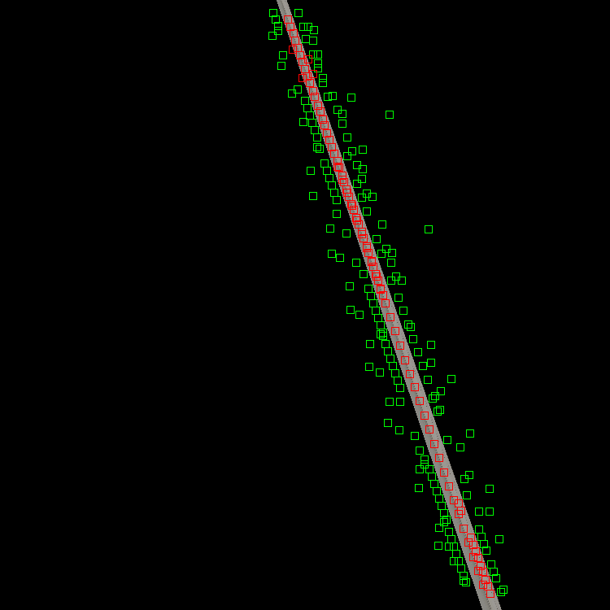
Code from [WhiteboardWorkflow.scala:239](../../src/test/scala/WhiteboardWorkflow.scala#L239) executed in 0.00 seconds: 
```java
    val boundsPoints = secondaryImages.zip(transforms).toMap.flatMap(x ⇒ {
      val (secondaryImage, transformParameters) = x
      val fromBtoA: Homography2D_F64 = transformParameters.invert(null)
      List((0, 0), (0, secondaryImage.getHeight), (secondaryImage.getWidth, 0), (secondaryImage.getWidth, secondaryImage.getHeight)).map(xx ⇒ {
        val (x: Int, y: Int) = xx
        transformXY(x, y, fromBtoA)
      })
    }).toList ++ List[(Double, Double)]((0, 0), (0, primaryImage.getHeight), (primaryImage.getWidth, 0), (primaryImage.getWidth, primaryImage.getHeight))
    System.out.println("renderMinX = " + boundsPoints.map(_._1).min)
    System.out.println("renderMaxX = " + boundsPoints.map(_._1).max)
    System.out.println("renderMinY = " + boundsPoints.map(_._2).min)
    System.out.println("renderMaxY = " + boundsPoints.map(_._2).max)
    boundsPoints
```
Logging: 
```
    renderMinX = -484.5969409654454
    renderMaxX = 708.3996683118378
    renderMinY = 0.0
    renderMaxY = 813.5513154555608
    
```

Returns: 
```
    List((287.1486768132866,140.26507762779474), (-484.5969409654454,813.5513154555608), (289.1028285614372,144.09113010838752), (288.64115605699385,143.15572235589738), (288.8009549522688,143.52583322705792), (708.3996683118378,702.947102750344), (90.95129863894147,81.99706227259247), (501.8076946513533,105.29814803715081), (0.0,0.0), (0.0,500.0), (500.0,0.0), (500.0,500.0))
```
Code from [WhiteboardWorkflow.scala:254](../../src/test/scala/WhiteboardWorkflow.scala#L254) executed in 0.00 seconds: 
```java
    val renderMinX = boundsPoints.map(_._1).min
    val renderMaxX = boundsPoints.map(_._1).max
    val renderMinY = boundsPoints.map(_._2).min
    val renderMaxY = boundsPoints.map(_._2).max
    if (expand) (Math.max(0, -renderMinX), Math.max(0, -renderMinY))
    else (0.0, 0.0)
```

Returns: 
```
    (0.0,0.0)
```
Code from [WhiteboardWorkflow.scala:262](../../src/test/scala/WhiteboardWorkflow.scala#L262) executed in 0.00 seconds: 
```java
    val renderMinX = boundsPoints.map(_._1).min
    val renderMaxX = boundsPoints.map(_._1).max
    val renderMinY = boundsPoints.map(_._2).min
    val renderMaxY = boundsPoints.map(_._2).max
    if (expand) (renderMaxX - renderMinX, renderMaxY - renderMinY)
    else (primaryImage.getWidth.toDouble, primaryImage.getHeight.toDouble)
```

Returns: 
```
    (500.0,500.0)
```
Code from [WhiteboardWorkflow.scala:272](../../src/test/scala/WhiteboardWorkflow.scala#L272) executed in 0.00 seconds: 
```java
    val interpolation = FactoryInterpolation.bilinearPixelS(classOf[GrayF32], BorderType.ZERO)
    val model = new PixelTransformHomography_F32
    val distort = DistortSupport.createDistortPL(classOf[GrayF32], model, interpolation, false)
    model.set(transformParameters)
    distort.setRenderAll(false)
    distort
```

Returns: 
```
    boofcv.alg.distort.impl.ImplImageDistort_PL@617fe9e1
```
Code from [WhiteboardWorkflow.scala:280](../../src/test/scala/WhiteboardWorkflow.scala#L280) executed in 0.04 seconds: 
```java
    val boofImage = ConvertBufferedImage.convertFromMulti(secondaryImage, null, true, classOf[GrayF32])
    val work: Planar[GrayF32] = boofImage.createNew(renderWidth.toInt, renderHeight.toInt)
    distortion.apply(boofImage, work)
    val output = new BufferedImage(renderWidth.toInt, renderHeight.toInt, primaryImage.getType)
    ConvertBufferedImage.convertTo(work, output, true)
    output
```

Returns: 
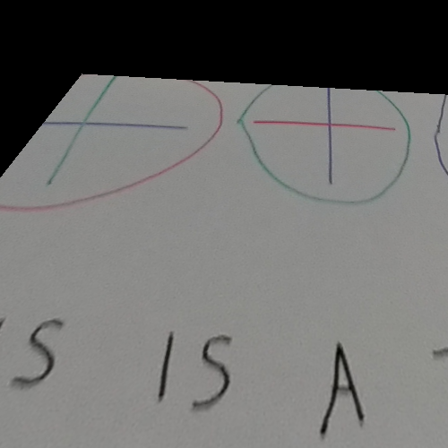
Code from [WhiteboardWorkflow.scala:227](../../src/test/scala/WhiteboardWorkflow.scala#L227) executed in 0.04 seconds: 
```java
    describe(featureDetector, secondaryImage)
```

Returns: 
```
    ([P( 128.9778594970703 80.77765655517578 ), P( 147.53594970703125 81.35391998291016 ), P( 183.7095184326172 83.30435180664062 ), P( 200.81906127929688 84.37699890136719 ), P( 236.9871826171875 86.37059783935547 ), P( 288.35675048828125 89.29423522949219 ), P( 305.5302734375 90.272705078125 ), P( 263.39056396484375 95.59342193603516 ), P( 342.2702941894531 92.39324188232422 ), P( 333.08721923828125 99.60893249511719 ), P( 447.56170654296875 98.34553527832031 ), P( 465.5814514160156 99.3844985961914 ), P( 438.62359619140625 105.23568725585938 ), P( 474.37469482421875 107.60069274902344 ), P( 75.34219360351562 111.44192504882812 ), P( 276.6814270019531 133.30477905273438 ), P( 38.95030212402344 138.05349731445312 ), P( 95.81954956054688 135.73123168945312 ), P( 23.87100601196289 176.8170166015625 ), P( 40.582611083984375 355.9015808105469 ), P( 47.67639923095703 359.51007080078125 ), P( 64.26152038574219 360.20025634765625 ), P( 32.12004089355469 364.9154357910156 ), P( 45.69694137573242 375.4059753417969 ), P( 252.17782592773438 378.57696533203125 ), P( 36.2862548828125 380.222900390625 ), P( 179.77870178222656 386.8896789550781 ), P( 368.0148010253906 390.8843078613281 ), P( 182.9061279296875 396.4228515625 ), P( 378.36505126953125 394.30419921875 ), P( 176.59722900390625 398.8076171875 ), P( 195.17245483398438 398.6202392578125 ), P( 56.984375 410.38104248046875 ), P( 191.7989959716797 412.62322998046875 ), P( 258.83062744140625 409.9507141113281 ), P( 382.222900390625 425.4855651855469 ), P( 374.513916015625 433.1865234375 ), P( 390.8399658203125 432.81158447265625 ), P( 363.1152038574219 443.95343017578125 ), P( 399.95343017578125 441.58953857421875 ), P( 218.73370361328125 452.15203857421875 ), P( 359.63885498046875 452.65631103515625 ), P( 408.48370361328125 452.24981689453125 ), P( 369.263916015625 461.99407958984375 ), P( 392.41265869140625 465.3502197265625 ), P( 353.62213134765625 469.73114013671875 ), P( 370.07568359375 483.70166015625 ), P( 93.70933532714844 88.20120239257812 ), P( 217.81646728515625 84.83942413330078 ), P( 74.96560668945312 90.11605072021484 ), P( 137.25857543945312 90.36630249023438 ), P( 192.2522735595703 93.2412109375 ), P( 209.3519287109375 93.83821105957031 ), P( 363.358642578125 93.15734100341797 ), P( 227.4169464111328 95.27542877197266 ), P( 244.8836669921875 96.54084777832031 ), P( 280.7024841308594 98.21914672851562 ), P( 297.901611328125 102.00814819335938 ), P( 354.5159606933594 102.63117980957031 ), P( 456.62042236328125 108.32490539550781 ), P( 65.71574401855469 126.14772033691406 ), P( 42.32740783691406 132.59927368164062 ), P( 446.5068054199219 150.7632293701172 ), P( 33.093299865722656 167.80908203125 ), P( 221.67054748535156 378.38592529296875 ), P( 56.62723159790039 398.4000244140625 ), P( 393.33905029296875 397.45635986328125 ), P( 221.26377868652344 408.70947265625 ), P( 251.43280029296875 414.25738525390625 ), P( 402.26361083984375 425.9762878417969 ), P( 193.00115966796875 432.115234375 ), P( 225.57354736328125 440.703857421875 ), P( 408.1728515625 445.08233642578125 ), P( 244.20172119140625 456.97906494140625 ), P( 353.7216796875 462.6375732421875 ), P( 129.16864013671875 77.93199157714844 ), P( 149.17466735839844 78.39187622070312 ), P( 204.01705932617188 77.62260437011719 ), P( 137.9195098876953 90.76387023925781 ), P( 217.28416442871094 83.92106628417969 ), P( 208.34312438964844 96.74678039550781 ), P( 354.21160888671875 103.49989318847656 ), P( 426.5782470703125 95.68961334228516 ), P( 418.9794921875 108.65091705322266 ), P( 29.63946533203125 144.094482421875 ), P( 29.02969741821289 360.4476623535156 ), P( 222.2724609375 374.6903991699219 ), P( 242.00637817382812 391.81365966796875 ), P( 54.636634826660156 394.2872314453125 ), P( 397.1583251953125 399.310302734375 ), P( 41.54435729980469 406.64166259765625 ), P( 251.33035278320312 414.3406982421875 ), P( 23.485252380371094 426.0072326660156 ), P( 239.56240844726562 425.1114807128906 ), P( 402.0517272949219 419.1982727050781 ), P( 252.82675170898438 437.2204284667969 ), P( 221.15675354003906 452.10693359375 ), P( 384.00115966796875 448.2803955078125 ), P( 353.4405212402344 456.77667236328125 ), P( 169.20936584472656 72.36803436279297 ), P( 276.008544921875 77.71928405761719 ), P( 383.05279541015625 82.68338775634766 ), P( 369.6986999511719 90.77122497558594 ), P( 311.558349609375 103.18971252441406 ), P( 381.46551513671875 108.62327575683594 ), P( 403.41265869140625 112.56988525390625 ), P( 36.02219009399414 131.70263671875 ), P( 72.27120971679688 125.10891723632812 ), P( 353.3313903808594 442.67822265625 ), P( 126.26654052734375 71.99562072753906 ), P( 298.34832763671875 83.41331481933594 ), P( 58.78483200073242 94.8104248046875 ), P( 96.33110046386719 97.35591888427734 ), P( 143.25946044921875 96.99398803710938 ), P( 262.72747802734375 106.26545715332031 ), P( 312.7690124511719 108.28897094726562 ), P( 58.48052978515625 398.848388671875 ), P( 264.2286376953125 395.82073974609375 ), P( 381.2723083496094 396.861328125 ), P( 169.8509521484375 58.51237106323242 ), P( 223.09487915039062 76.26233673095703 ), P( 368.78900146484375 82.89476776123047 ), P( 395.89971923828125 117.17469787597656 ), P( 60.861297607421875 158.12612915039062 ), P( 215.5078582763672 422.89239501953125 ), P( 328.3080749511719 120.72859954833984 ), P( 242.23175048828125 393.7470703125 )],boofcv.alg.descriptor.UtilFeature$2@245a26e1)
```
Code from [WhiteboardWorkflow.scala:212](../../src/test/scala/WhiteboardWorkflow.scala#L212) executed in 0.00 seconds: 
```java
    gfx.drawImage(primaryImage, 0, 0, null)
    points.asScala.zip(descriptions.toList.asScala).foreach(x ⇒ {
      val (pt,d) = x
      if(d.white) {
        gfx.setColor(Color.GREEN)
      } else {
        gfx.setColor(Color.RED)
      }
      gfx.drawRect(pt.x.toInt - 4, pt.y.toInt - 4, 9, 9)
    })
```

Returns: 
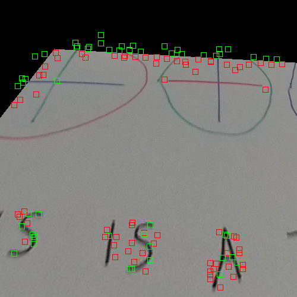
Code from [WhiteboardWorkflow.scala:272](../../src/test/scala/WhiteboardWorkflow.scala#L272) executed in 0.00 seconds: 
```java
    val interpolation = FactoryInterpolation.bilinearPixelS(classOf[GrayF32], BorderType.ZERO)
    val model = new PixelTransformHomography_F32
    val distort = DistortSupport.createDistortPL(classOf[GrayF32], model, interpolation, false)
    model.set(transformParameters)
    distort.setRenderAll(false)
    distort
```

Returns: 
```
    boofcv.alg.distort.impl.ImplImageDistort_PL@2e185cd7
```
Code from [WhiteboardWorkflow.scala:280](../../src/test/scala/WhiteboardWorkflow.scala#L280) executed in 0.04 seconds: 
```java
    val boofImage = ConvertBufferedImage.convertFromMulti(secondaryImage, null, true, classOf[GrayF32])
    val work: Planar[GrayF32] = boofImage.createNew(renderWidth.toInt, renderHeight.toInt)
    distortion.apply(boofImage, work)
    val output = new BufferedImage(renderWidth.toInt, renderHeight.toInt, primaryImage.getType)
    ConvertBufferedImage.convertTo(work, output, true)
    output
```

Returns: 
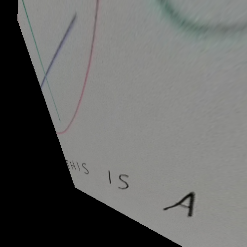
Code from [WhiteboardWorkflow.scala:272](../../src/test/scala/WhiteboardWorkflow.scala#L272) executed in 0.00 seconds: 
```java
    val interpolation = FactoryInterpolation.bilinearPixelS(classOf[GrayF32], BorderType.ZERO)
    val model = new PixelTransformHomography_F32
    val distort = DistortSupport.createDistortPL(classOf[GrayF32], model, interpolation, false)
    model.set(transformParameters)
    distort.setRenderAll(false)
    distort
```

Returns: 
```
    boofcv.alg.distort.impl.ImplImageDistort_PL@6815c5f2
```
Code from [WhiteboardWorkflow.scala:280](../../src/test/scala/WhiteboardWorkflow.scala#L280) executed in 0.04 seconds: 
```java
    val boofImage = ConvertBufferedImage.convertFromMulti(secondaryImage, null, true, classOf[GrayF32])
    val work: Planar[GrayF32] = boofImage.createNew(renderWidth.toInt, renderHeight.toInt)
    distortion.apply(boofImage, work)
    val output = new BufferedImage(renderWidth.toInt, renderHeight.toInt, primaryImage.getType)
    ConvertBufferedImage.convertTo(work, output, true)
    output
```

Returns: 
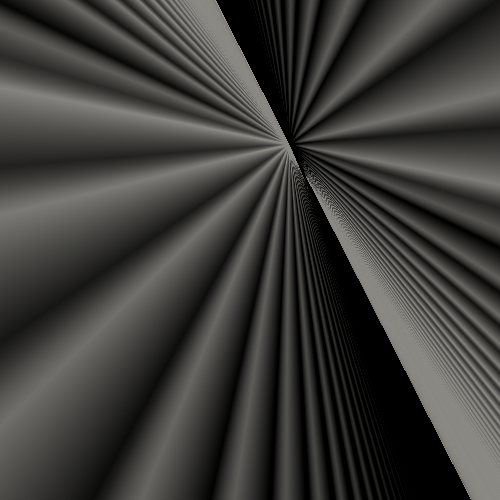
Code from [WhiteboardWorkflow.scala:227](../../src/test/scala/WhiteboardWorkflow.scala#L227) executed in 0.07 seconds: 
```java
    describe(featureDetector, secondaryImage)
```

Returns: 
```
    ([P( 137.52435302734375 24.352323532104492 ), P( 144.39234924316406 38.83948516845703 ), P( 155.65261840820312 39.25807189941406 ), P( 243.36724853515625 41.121337890625 ), P( 302.63372802734375 42.497196197509766 ), P( 152.7663116455078 45.1312255859375 ), P( 161.1689910888672 51.4005126953125 ), P( 311.8986511230469 60.131500244140625 ), P( 204.716064453125 65.46913146972656 ), P( 309.1065979003906 71.36909484863281 ), P( 176.38034057617188 75.44291687011719 ), P( 314.55609130859375 77.0367431640625 ), P( 185.363037109375 81.40653228759766 ), P( 311.85504150390625 83.09839630126953 ), P( 186.5233917236328 89.99812316894531 ), P( 194.4774169921875 87.34750366210938 ), P( 308.8856506347656 89.4405517578125 ), P( 192.1420440673828 93.07738494873047 ), P( 197.714599609375 96.13429260253906 ), P( 203.5567626953125 93.4424057006836 ), P( 176.62782287597656 99.28143310546875 ), P( 183.00799560546875 102.05462646484375 ), P( 203.2825927734375 99.14543151855469 ), P( 231.77426147460938 98.49263000488281 ), P( 189.76004028320312 104.94171142578125 ), P( 196.57061767578125 108.54267883300781 ), P( 314.8045959472656 103.52461242675781 ), P( 316.8616943359375 112.58322143554688 ), P( 197.4895477294922 117.06037902832031 ), P( 206.67434692382812 120.32664489746094 ), P( 249.35797119140625 119.51103210449219 ), P( 285.3477478027344 122.9695816040039 ), P( 251.84674072265625 129.233154296875 ), P( 323.33984375 132.29734802246094 ), P( 240.56021118164062 138.5879669189453 ), P( 251.49302673339844 143.77841186523438 ), P( 281.954833984375 143.59994506835938 ), P( 294.2200622558594 140.6371612548828 ), P( 318.0245666503906 150.21902465820312 ), P( 338.158935546875 149.4980010986328 ), P( 252.42202758789062 155.9376678466797 ), P( 257.12957763671875 161.61143493652344 ), P( 327.6228332519531 158.71963500976562 ), P( 329.55487060546875 168.69754028320312 ), P( 260.4275817871094 173.82626342773438 ), P( 312.12933349609375 179.2218475341797 ), P( 375.7179260253906 176.6435546875 ), P( 382.1025390625 179.59487915039062 ), P( 388.87725830078125 183.247802734375 ), P( 395.2821044921875 186.0533447265625 ), P( 305.3052062988281 190.14007568359375 ), P( 350.68682861328125 192.60653686523438 ), P( 375.75762939453125 188.75680541992188 ), P( 381.23236083984375 191.81002807617188 ), P( 375.31085205078125 194.62350463867188 ), P( 386.698974609375 194.9194793701172 ), P( 392.36431884765625 198.02284240722656 ), P( 267.17315673828125 202.16734313964844 ), P( 384.41162109375 200.7150421142578 ), P( 263.6098327636719 208.79647827148438 ), P( 314.50811767578125 208.06956481933594 ), P( 393.47015380859375 206.6681671142578 ), P( 269.79168701171875 212.216796875 ), P( 402.4481201171875 212.63978576660156 ), P( 267.114501953125 222.8496551513672 ), P( 377.39410400390625 225.47763061523438 ), P( 276.5401916503906 239.78414916992188 ), P( 417.5506591796875 236.71762084960938 ), P( 425.96893310546875 242.9871826171875 ), P( 426.57891845703125 251.61370849609375 ), P( 438.3258056640625 251.7523193359375 ), P( 441.26324462890625 263.8014831542969 ), P( 459.2132568359375 278.8063659667969 ), P( 459.72698974609375 293.5359802246094 ), P( 477.0340576171875 308.9835510253906 ), P( 111.3233413696289 15.18560791015625 ), P( 119.63735961914062 21.183868408203125 ), P( 127.93746185302734 27.57674789428711 ), P( 171.421630859375 35.667198181152344 ), P( 317.58477783203125 38.49652862548828 ), P( 189.18524169921875 50.78089904785156 ), P( 314.7347412109375 49.66936492919922 ), P( 146.670654296875 57.291629791259766 ), P( 155.66061401367188 63.259403228759766 ), P( 321.26324462890625 60.94243240356445 ), P( 164.75656127929688 69.18115234375 ), P( 318.5135192871094 67.15059661865234 ), P( 158.0525360107422 75.5759048461914 ), P( 169.1043243408203 80.6302261352539 ), P( 207.93521118164062 80.39387512207031 ), P( 146.4470977783203 87.36839294433594 ), P( 174.4576416015625 83.80452728271484 ), P( 179.86521911621094 86.95172882080078 ), P( 216.58737182617188 86.51570892333984 ), P( 152.96290588378906 90.1011962890625 ), P( 159.6649169921875 92.86636352539062 ), P( 323.8406066894531 89.37284851074219 ), P( 325.00836181640625 105.6729736328125 ), P( 167.281982421875 107.967041015625 ), P( 176.80345153808594 110.98696899414062 ), P( 233.50848388671875 110.80799865722656 ), P( 296.64581298828125 110.91075134277344 ), P( 185.88949584960938 114.35269165039062 ), P( 266.68731689453125 117.00137329101562 ), P( 329.9712219238281 119.82958984375 ), P( 243.64114379882812 125.8147201538086 ), P( 332.4691467285156 129.13983154296875 ), P( 221.49981689453125 135.7442626953125 ), P( 249.17623901367188 134.53099060058594 ), P( 291.32843017578125 131.2021026611328 ), P( 232.67367553710938 138.61965942382812 ), P( 342.86737060546875 142.01670837402344 ), P( 239.82882690429688 144.38453674316406 ), P( 284.95672607421875 152.31271362304688 ), P( 323.0507507324219 150.47682189941406 ), P( 329.7259216308594 153.1626739501953 ), P( 346.09393310546875 149.4636993408203 ), P( 243.12014770507812 158.92431640625 ), P( 303.018798828125 155.69020080566406 ), P( 250.97952270507812 164.68760681152344 ), P( 336.15289306640625 162.0225830078125 ), P( 340.0427551269531 174.3577880859375 ), P( 345.4891357421875 177.34402465820312 ), P( 403.37225341796875 176.57933044433594 ), P( 251.8714599609375 183.18801879882812 ), P( 411.08221435546875 179.5891876220703 ), P( 419.092529296875 182.73780822753906 ), P( 405.74261474609375 188.67520141601562 ), P( 255.14749145507812 195.72340393066406 ), P( 305.8529357910156 194.26608276367188 ), P( 412.30682373046875 191.5059814453125 ), P( 419.0543212890625 195.25286865234375 ), P( 362.3330078125 201.55117797851562 ), P( 399.21185302734375 200.97048950195312 ), P( 425.4495849609375 198.00204467773438 ), P( 315.0689392089844 212.0089874267578 ), P( 332.87152099609375 214.167236328125 ), P( 415.1177673339844 209.3792724609375 ), P( 420.7718505859375 212.50982666015625 ), P( 260.5758056640625 218.20883178710938 ), P( 414.1018981933594 218.90179443359375 ), P( 426.5056457519531 215.58856201171875 ), P( 257.8590393066406 224.79734802246094 ), P( 423.1787109375 224.82769775390625 ), P( 432.1458435058594 230.80081176757812 ), P( 263.75054931640625 233.6148681640625 ), P( 389.637451171875 237.34466552734375 ), P( 261.4775085449219 243.82228088378906 ), P( 407.37030029296875 252.48239135742188 ), P( 273.6561279296875 262.47552490234375 ), P( 450.76116943359375 260.59033203125 ), P( 459.0826416015625 266.9588317871094 ), P( 270.75225830078125 277.08807373046875 ), P( 471.4188232421875 275.70513916015625 ), P( 468.4166259765625 284.704345703125 ), P( 479.7945556640625 282.0338439941406 ), P( 440.51495361328125 300.34930419921875 ), P( 411.178955078125 365.71923828125 ), P( 398.744140625 375.2955017089844 ), P( 417.4754638671875 377.4193420410156 ), P( 423.4622802734375 389.425537109375 ), P( 324.38555908203125 20.634620666503906 ), P( 112.50208282470703 36.790550231933594 ), P( 330.6150207519531 38.429901123046875 ), P( 117.80442810058594 54.96714782714844 ), P( 130.54034423828125 48.695045471191406 ), P( 323.6654052734375 51.098289489746094 ), P( 140.02566528320312 65.91497039794922 ), P( 148.77438354492188 60.89271926879883 ), P( 109.42532348632812 71.94071197509766 ), P( 122.64200592041016 77.77461242675781 ), P( 150.6135711669922 72.1103744506836 ), P( 161.5302734375 78.19784545898438 ), P( 199.0147705078125 70.5001220703125 ), P( 330.69305419921875 79.98007202148438 ), P( 136.00111389160156 84.55601501464844 ), P( 148.66104125976562 90.58214569091797 ), P( 216.43116760253906 83.3720474243164 ), P( 129.19219970703125 96.96878051757812 ), P( 147.01174926757812 102.68516540527344 ), P( 257.5996398925781 102.91647338867188 ), P( 334.2693176269531 93.82657623291016 ), P( 263.6259460449219 114.65095520019531 ), P( 282.7680358886719 108.84967803955078 ), P( 340.6038818359375 113.10601043701172 ), P( 332.2470397949219 120.40812683105469 ), P( 342.93536376953125 126.65503692626953 ), P( 238.03009033203125 129.0116424560547 ), P( 227.5018310546875 142.69174194335938 ), P( 341.2783203125 156.79910278320312 ), P( 377.1217956542969 155.0337371826172 ), P( 244.61724853515625 167.892578125 ), P( 350.24169921875 16... and 5306 more bytes
```
Code from [WhiteboardWorkflow.scala:212](../../src/test/scala/WhiteboardWorkflow.scala#L212) executed in 0.00 seconds: 
```java
    gfx.drawImage(primaryImage, 0, 0, null)
    points.asScala.zip(descriptions.toList.asScala).foreach(x ⇒ {
      val (pt,d) = x
      if(d.white) {
        gfx.setColor(Color.GREEN)
      } else {
        gfx.setColor(Color.RED)
      }
      gfx.drawRect(pt.x.toInt - 4, pt.y.toInt - 4, 9, 9)
    })
```

Returns: 
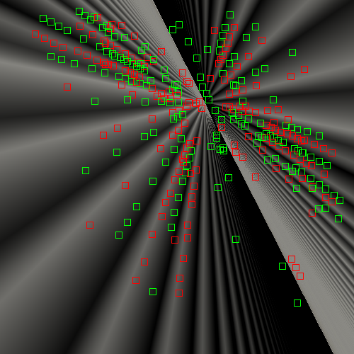
Code from [WhiteboardWorkflow.scala:272](../../src/test/scala/WhiteboardWorkflow.scala#L272) executed in 0.00 seconds: 
```java
    val interpolation = FactoryInterpolation.bilinearPixelS(classOf[GrayF32], BorderType.ZERO)
    val model = new PixelTransformHomography_F32
    val distort = DistortSupport.createDistortPL(classOf[GrayF32], model, interpolation, false)
    model.set(transformParameters)
    distort.setRenderAll(false)
    distort
```

Returns: 
```
    boofcv.alg.distort.impl.ImplImageDistort_PL@3546d80f
```
Code from [WhiteboardWorkflow.scala:280](../../src/test/scala/WhiteboardWorkflow.scala#L280) executed in 0.04 seconds: 
```java
    val boofImage = ConvertBufferedImage.convertFromMulti(secondaryImage, null, true, classOf[GrayF32])
    val work: Planar[GrayF32] = boofImage.createNew(renderWidth.toInt, renderHeight.toInt)
    distortion.apply(boofImage, work)
    val output = new BufferedImage(renderWidth.toInt, renderHeight.toInt, primaryImage.getType)
    ConvertBufferedImage.convertTo(work, output, true)
    output
```

Returns: 

