First, we load an photo of a whiteboard

Code from [WhiteboardWorkflow.scala:70](../../src/test/scala/WhiteboardWorkflow.scala#L70) executed in 0.91 seconds: 
```java
    ImageIO.read(getClass.getClassLoader.getResourceAsStream("Whiteboard1.jpg"))
```

Returns: 
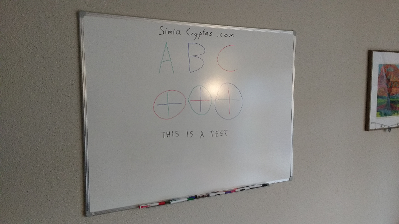


## Region Selection
We start looking for long edges which can be used to find the board:

Code from [WhiteboardWorkflow.scala:411](../../src/test/scala/WhiteboardWorkflow.scala#L411) executed in 0.12 seconds: 
```java
    val localMaxRadius = 10
    val minCounts = 5
    val minDistanceFromOrigin = 1
    val edgeThreshold: Float = 100
    val maxLines: Int = 20
    FactoryDetectLineAlgs.houghFoot(new ConfigHoughFoot(localMaxRadius, minCounts, minDistanceFromOrigin, edgeThreshold, maxLines), classOf[GrayU8], classOf[GrayS16])
```

Returns: 
```
    boofcv.abst.feature.detect.line.DetectLineHoughFoot@20a8a64e
```


Code from [WhiteboardWorkflow.scala:410](../../src/test/scala/WhiteboardWorkflow.scala#L410) executed in 0.87 seconds: 
```java
    val rulerDetector: DetectLine[GrayU8] = log.code(() ⇒ {
      val localMaxRadius = 10
      val minCounts = 5
      val minDistanceFromOrigin = 1
      val edgeThreshold: Float = 100
      val maxLines: Int = 20
      FactoryDetectLineAlgs.houghFoot(new ConfigHoughFoot(localMaxRadius, minCounts, minDistanceFromOrigin, edgeThreshold, maxLines), classOf[GrayU8], classOf[GrayS16])
    })
    rulerDetector.detect(ConvertBufferedImage.convertFromSingle(sourceImage, null, classOf[GrayU8]))
```

Returns: 
```
    [LineParametric2D_F32 P( 2094.0 1170.0 ) Slope( 0.0 14.0 ), LineParametric2D_F32 P( 3057.0 1170.0 ) Slope( 0.0 977.0 ), LineParametric2D_F32 P( 2005.0 1174.0 ) Slope( -4.0 -75.0 ), LineParametric2D_F32 P( 885.0 1170.0 ) Slope( 0.0 -1195.0 ), LineParametric2D_F32 P( 898.0 1170.0 ) Slope( 0.0 -1182.0 ), LineParametric2D_F32 P( 2080.0 1082.0 ) Slope( 88.0 0.0 ), LineParametric2D_F32 P( 2046.0 1180.0 ) Slope( -10.0 -34.0 ), LineParametric2D_F32 P( 3031.0 1170.0 ) Slope( 0.0 951.0 ), LineParametric2D_F32 P( 3075.0 1170.0 ) Slope( 0.0 995.0 ), LineParametric2D_F32 P( 1940.0 1208.0 ) Slope( -38.0 -140.0 ), LineParametric2D_F32 P( 2195.0 1165.0 ) Slope( 5.0 115.0 ), LineParametric2D_F32 P( 2153.0 284.0 ) Slope( 886.0 73.0 ), LineParametric2D_F32 P( 2249.0 2031.0 ) Slope( -861.0 169.0 ), LineParametric2D_F32 P( 2061.0 1193.0 ) Slope( -23.0 -19.0 ), LineParametric2D_F32 P( 2155.0 255.0 ) Slope( 915.0 75.0 ), LineParametric2D_F32 P( 858.0 1170.0 ) Slope( 0.0 -1222.0 ), LineParametric2D_F32 P( 1927.0 1076.0 ) Slope( 94.0 -153.0 ), LineParametric2D_F32 P( 1752.0 1170.0 ) Slope( 0.0 -328.0 ), LineParametric2D_F32 P( 1783.0 873.0 ) Slope( 297.0 -297.0 ), LineParametric2D_F32 P( 2391.0 1161.0 ) Slope( 9.0 311.0 )]
```


Code from [WhiteboardWorkflow.scala:421](../../src/test/scala/WhiteboardWorkflow.scala#L421) executed in 0.05 seconds: 
```java
    gfx.drawImage(sourceImage, 0, 0, null)
    gfx.setStroke(new BasicStroke(3))
    found.asScala.foreach(line ⇒ {
      if (Math.abs(line.slope.x) > Math.abs(line.slope.y)) {
        val x1 = 0
        val y1 = (line.p.y - line.p.x * line.slope.y / line.slope.x).toInt
        val x2 = sourceImage.getWidth
        val y2 = y1 + (x2 * line.slope.y / line.slope.x).toInt
        gfx.setColor(Color.RED)
        gfx.drawLine(
          x1, y1,
          x2, y2)
      } else {
        val y1 = 0
        val x1 = (line.p.x - line.p.y * line.slope.x / line.slope.y).toInt
        val y2 = sourceImage.getHeight
        val x2 = x1 + (y2 * line.slope.x / line.slope.y).toInt
        gfx.setColor(Color.GREEN)
        gfx.drawLine(
          x1, y1,
          x2, y2)
      }
    })
```

Returns: 
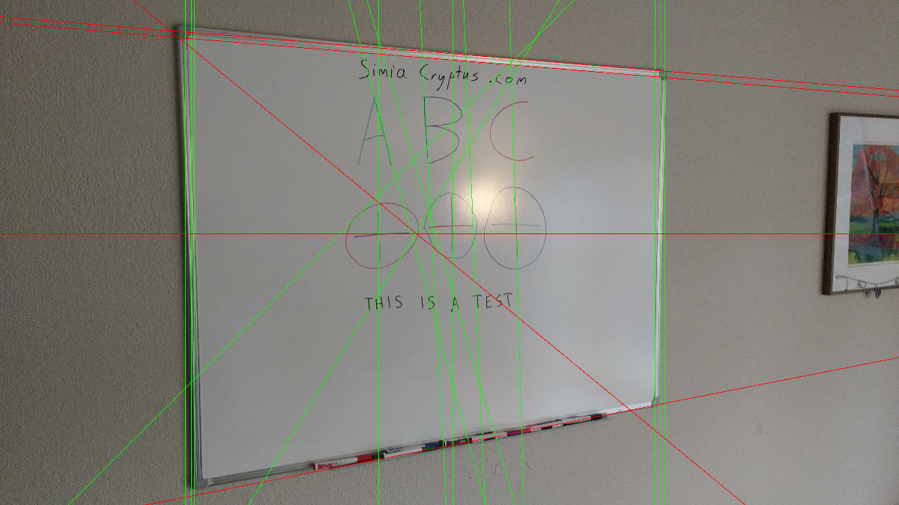


This can then be searched for the largest, most upright, and rectangular shape

Code from [WhiteboardWorkflow.scala:448](../../src/test/scala/WhiteboardWorkflow.scala#L448) executed in 0.10 seconds: 
```java
    val horizontals = found.asScala.filter(line ⇒ Math.abs(line.slope.x) > Math.abs(line.slope.y)).toList
    val verticals = found.asScala.filter(line ⇒ Math.abs(line.slope.x) <= Math.abs(line.slope.y)).toList
    val imageBounds = new Rectangle2D_F32(0, 0, sourceImage.getWidth, sourceImage.getHeight)
    val candidateQuadrangles: List[Quadrilateral_F32] = cross(pairs(horizontals), pairs(verticals)).map(xa ⇒ {
      val ((left: LineParametric2D_F32, right: LineParametric2D_F32), (top: LineParametric2D_F32, bottom: LineParametric2D_F32)) = xa
      new Quadrilateral_F32(
        Intersection2D_F32.intersection(left, top, null),
        Intersection2D_F32.intersection(left, bottom, null),
        Intersection2D_F32.intersection(right, top, null),
        Intersection2D_F32.intersection(right, bottom, null))
    }).filter((quad: Quadrilateral_F32) ⇒
      Intersection2D_F32.contains(imageBounds, quad.a.x, quad.a.y) &&
        Intersection2D_F32.contains(imageBounds, quad.b.x, quad.b.y) &&
        Intersection2D_F32.contains(imageBounds, quad.c.x, quad.c.y) &&
        Intersection2D_F32.contains(imageBounds, quad.d.x, quad.d.y)
    )
    scale(rotate(
      candidateQuadrangles.maxBy(quad ⇒ {
        val bounds = new Rectangle2D_F32()
        UtilPolygons2D_F32.bounding(quad, bounds)
        val area = quad.area()
        val squareness = area / bounds.area()
        assert(squareness >= 0 && squareness <= 1.01)
        area * Math.pow(squareness, 2)
      })
    ), 1.0f)
```

Returns: 
```
    Quadrilateral_F32{ a(858.0 148.68854) b(3075.0 330.40985) c(858.0 2304.0303) d(3075.0 1868.8699) }
```


Code from [WhiteboardWorkflow.scala:476](../../src/test/scala/WhiteboardWorkflow.scala#L476) executed in 0.04 seconds: 
```java
    gfx.drawImage(sourceImage, 0, 0, null)
    gfx.setStroke(new BasicStroke(3))
    gfx.setColor(Color.RED)
    draw(gfx, bestQuadrangle)
```

Returns: 
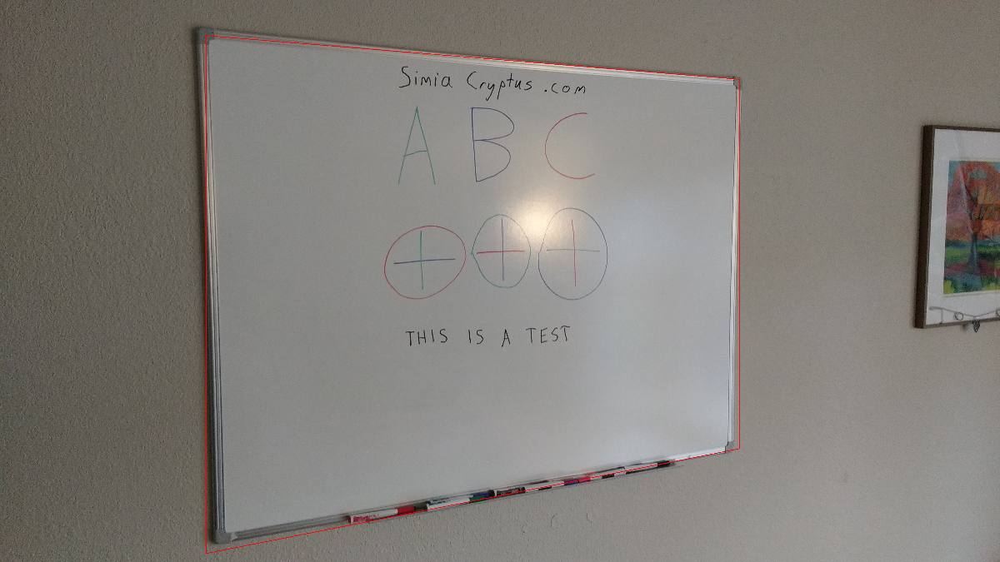


We then distort the image using a homographic transform back into a rectangle. First we estimate the correct size of the image:

Code from [WhiteboardWorkflow.scala:484](../../src/test/scala/WhiteboardWorkflow.scala#L484) executed in 0.00 seconds: 
```java
    (
      (bestQuadrangle.getSideLength(0) + bestQuadrangle.getSideLength(2)).toInt / 2,
      (bestQuadrangle.getSideLength(1) + bestQuadrangle.getSideLength(3)).toInt / 2
    )
```

Returns: 
```
    (2241,2887)
```


We derive the transform:

Code from [WhiteboardWorkflow.scala:492](../../src/test/scala/WhiteboardWorkflow.scala#L492) executed in 0.08 seconds: 
```java
    val transformModel: ModelMatcher[Homography2D_F64, AssociatedPair] = {
      val maxIterations = 100
      val inlierThreshold = 7
      val normalize = true
      FactoryMultiViewRobust.homographyRansac(new ConfigHomography(normalize), new ConfigRansac(maxIterations, inlierThreshold))
    }
    val pairs: util.ArrayList[AssociatedPair] = new util.ArrayList(List(
      new AssociatedPair(0, 0, bestQuadrangle.a.x, bestQuadrangle.a.y),
      new AssociatedPair(0, areaHeight, bestQuadrangle.c.x, bestQuadrangle.c.y),
      new AssociatedPair(areaWidth, 0, bestQuadrangle.b.x, bestQuadrangle.b.y),
      new AssociatedPair(areaWidth, areaHeight, bestQuadrangle.d.x, bestQuadrangle.d.y)
    ).asJava)
    if (!transformModel.process(pairs)) throw new RuntimeException("Model Matcher failed!")
    transformModel.getModelParameters
```

Returns: 
```
    Homography2D_F64[ 1.25e+00 3.91e-16 9.01e+02 ; 1.14e-01 1.01e+00 1.46e-04 ; 1.46e-04 1.08e-19 1.05e+00 ]
```


And we transform the image:

Code from [WhiteboardWorkflow.scala:510](../../src/test/scala/WhiteboardWorkflow.scala#L510) executed in 1.43 seconds: 
```java
    val distortion: ImageDistort[Planar[GrayF32], Planar[GrayF32]] = {
      val interpolation = FactoryInterpolation.bilinearPixelS(classOf[GrayF32], BorderType.ZERO)
      val model = new PixelTransformHomography_F32
      val distort = DistortSupport.createDistortPL(classOf[GrayF32], model, interpolation, false)
      model.set(transform)
      distort.setRenderAll(false)
      distort
    }
    val boofImage = ConvertBufferedImage.convertFromMulti(sourceImage, null, true, classOf[GrayF32])
    val work: Planar[GrayF32] = boofImage.createNew(areaWidth.toInt, areaHeight.toInt)
    distortion.apply(boofImage, work)
    val output = new BufferedImage(areaWidth.toInt, areaHeight.toInt, sourceImage.getType)
    ConvertBufferedImage.convertTo(work, output, true)
    output
```

Returns: 
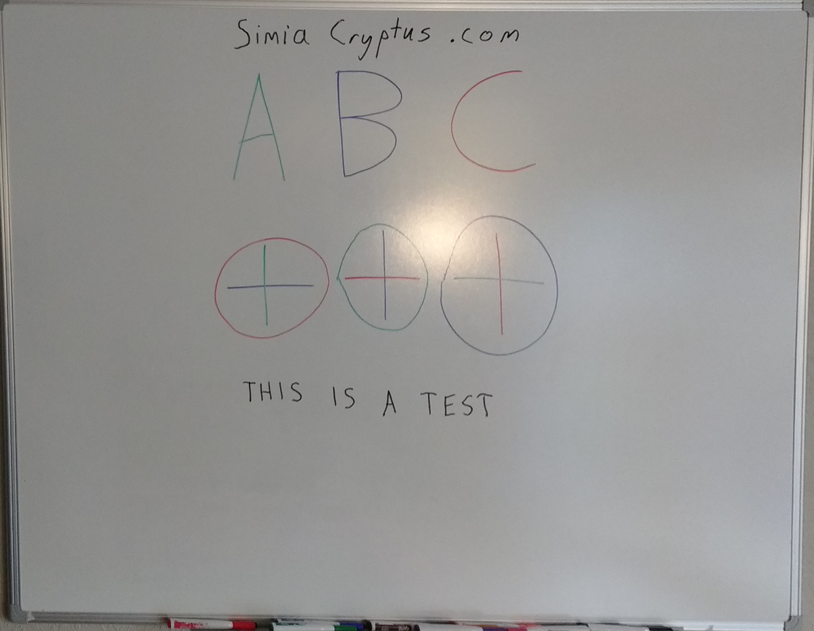


Now we refine our selection using some region selection, perhaps by manual selection

Code from [WhiteboardWorkflow.scala:78](../../src/test/scala/WhiteboardWorkflow.scala#L78) executed in 0.00 seconds: 
```java
    new Rectangle2D_F32(100, 40, 2700, 2100)
```

Returns: 
```
    Rectangle2D_F32{ p0(100.0 40.0) p1(2700.0 2100.0) }
```


Code from [WhiteboardWorkflow.scala:81](../../src/test/scala/WhiteboardWorkflow.scala#L81) executed in 0.03 seconds: 
```java
    gfx.drawImage(primaryImage, 0, 0, null)
    gfx.setStroke(new BasicStroke(3))
    gfx.setColor(Color.RED)
    gfx.drawRect(tileBounds.p0.x.toInt, tileBounds.p0.y.toInt, tileBounds.getWidth.toInt, tileBounds.getHeight.toInt)
```

Returns: 
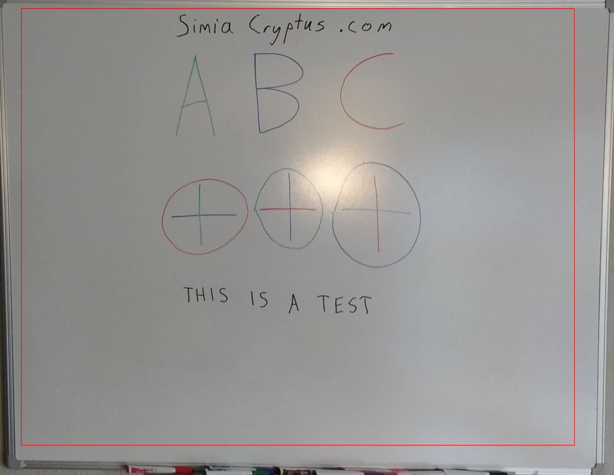


Code from [WhiteboardWorkflow.scala:87](../../src/test/scala/WhiteboardWorkflow.scala#L87) executed in 0.00 seconds: 
```java
    primaryImage.getSubimage(tileBounds.p0.x.toInt, tileBounds.p0.y.toInt, tileBounds.getWidth.toInt, tileBounds.getHeight.toInt)
```

Returns: 
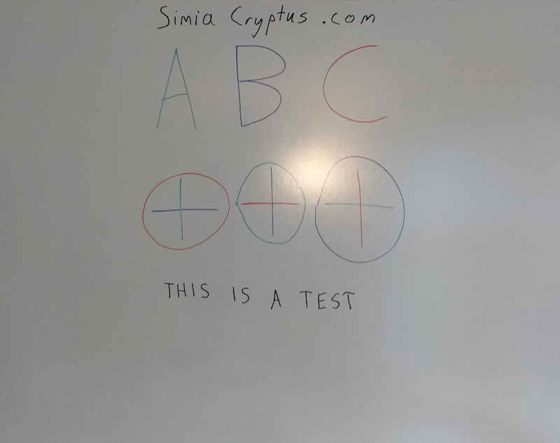


## Color Normalization
### Method 1 - Thresholding
Our default method uses binarization and morphological operations:

Dectection of markings uses the luminosity

Code from [WhiteboardWorkflow.scala:366](../../src/test/scala/WhiteboardWorkflow.scala#L366) executed in 1.03 seconds: 
```java
    val bandImg: GrayF32 = hsv.getBand(2)
    val to = ConvertBufferedImage.convertTo(bandImg, null)
    VisualizeImageData.standard(bandImg, to)
```

Returns: 
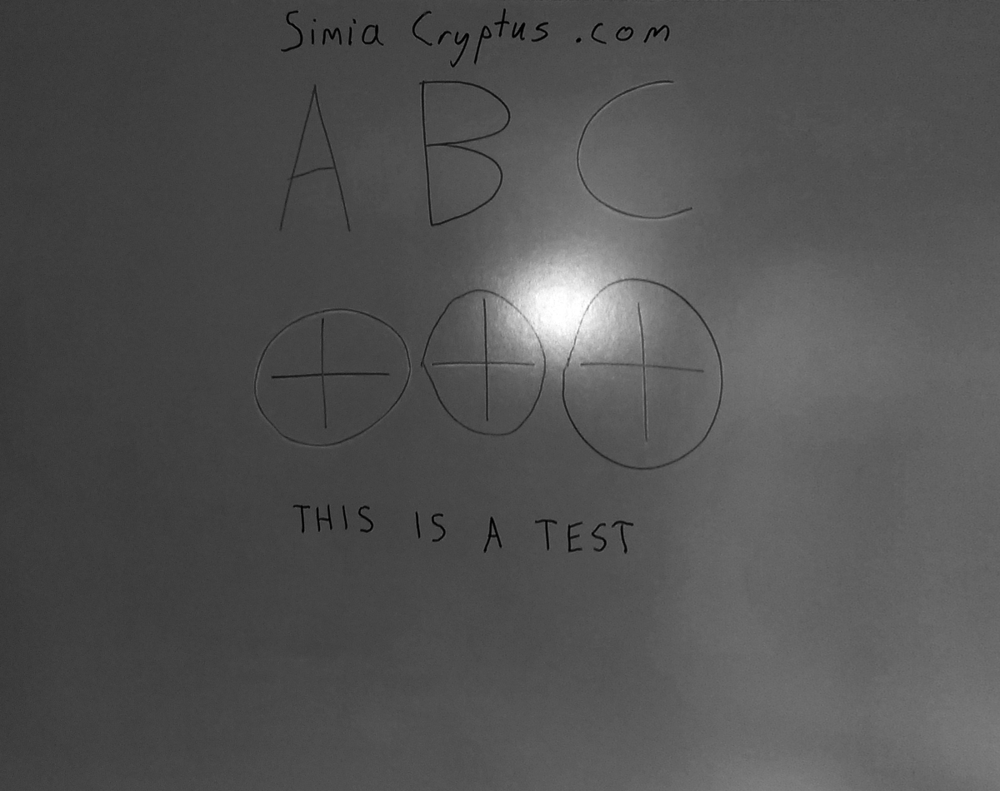


...by detecting local variations

Code from [WhiteboardWorkflow.scala:372](../../src/test/scala/WhiteboardWorkflow.scala#L372) executed in 1.14 seconds: 
```java
    val single = ConvertBufferedImage.convertFromSingle(colorBand, null, classOf[GrayF32])
    val binary = new GrayU8(single.width, single.height)
    GThresholdImageOps.localSauvola(single, binary, 50, 0.2f, true)
```

Returns: 
```
    boofcv.struct.image.GrayU8@7c041b41
```


Code from [WhiteboardWorkflow.scala:377](../../src/test/scala/WhiteboardWorkflow.scala#L377) executed in 0.03 seconds: 
```java
    VisualizeBinaryData.renderBinary(binaryMask, false, null)
```

Returns: 


Code from [WhiteboardWorkflow.scala:310](../../src/test/scala/WhiteboardWorkflow.scala#L310) executed in 0.01 seconds: 
```java
    VisualizeBinaryData.renderBinary(finalBinaryMask, false, null)
```

Returns: 
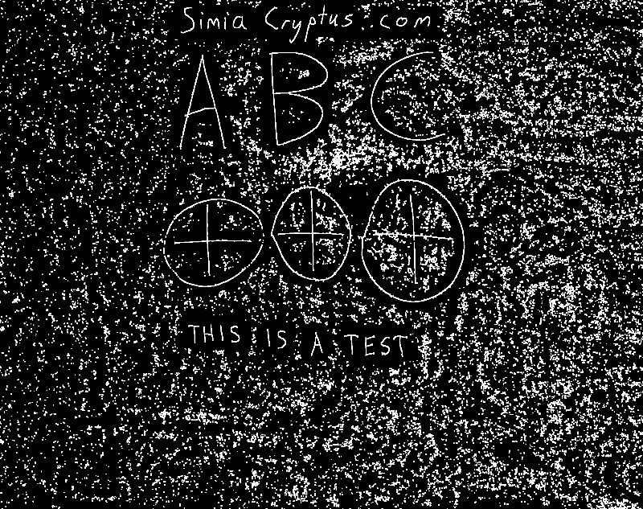


We can now identify segments which may be markings:

Code from [WhiteboardWorkflow.scala:315](../../src/test/scala/WhiteboardWorkflow.scala#L315) executed in 30.02 seconds: 
```java
    val input = ConvertBufferedImage.convertFrom(thresholdImg, null: GrayF32)
    val imageType = ImageType.single(classOf[GrayF32])
    val alg = FactoryImageSegmentation.fh04(new ConfigFh04(100, 30), imageType)
    val segmentation = new GrayS32(thresholdImg.getWidth, thresholdImg.getHeight)
    alg.segment(input, segmentation)
    (alg.getTotalSuperpixels, segmentation)
```

Returns: 
```
    (58,boofcv.struct.image.GrayS32@1601e47)
```


Code from [WhiteboardWorkflow.scala:323](../../src/test/scala/WhiteboardWorkflow.scala#L323) executed in 0.04 seconds: 
```java
    VisualizeRegions.regions(segmentation, superpixels, null)
```

Returns: 
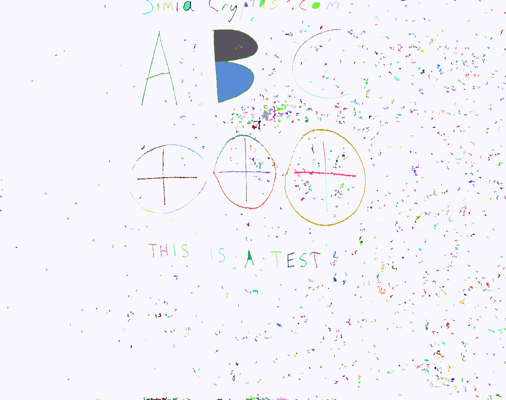


For each segment, we categorize and colorize each using some logic

Code from [WhiteboardWorkflow.scala:139](../../src/test/scala/WhiteboardWorkflow.scala#L139) executed in 21.01 seconds: 
```java
    val regions = (0 until segmentation.getWidth).flatMap(x ⇒ (0 until segmentation.getHeight).map(y ⇒ {
      segmentation.get(x, y) → ((x, y) → rgb.bands.map(_.get(x, y)))
    })).groupBy(x ⇒ x._1).mapValues(_.map(t ⇒ t._2))
    regions.mapValues(pixels ⇒ {
      val rgvValues = pixels.map(_._2)
      val hsvValues = rgvValues.map(rgb ⇒ {
        val hsv = new Array[Float](3)
        ColorHsv.rgbToHsv(rgb(0), rgb(1), rgb(2), hsv)
        hsv
      })
```

Returns: 
```
    Map(0 -> [D@7927bd9f, 5 -> [D@532721fd, 10 -> [D@410954b, 56 -> [D@7fb9f71f, 42 -> [D@3b366632, 24 -> [D@51f49060, 37 -> [D@514eedd8, 25 -> [D@617fe9e1, 52 -> [D@6970140a, 14 -> [D@1cf2fed4, 20 -> [D@3af4e0bf, 46 -> [D@245a26e1, 57 -> [D@4d63b624, 29 -> [D@466cf502, 1 -> [D@5b800468, 6 -> [D@2e185cd7, 28 -> [D@7e1a1da6, 38 -> [D@5f7f2382, 21 -> [D@407cf41, 33 -> [D@6815c5f2, 9 -> [D@46cc127b, 53 -> [D@60094a13, 13 -> [D@5aceec94, 41 -> [D@1c32886a, 2 -> [D@3a4b0e5d, 32 -> [D@10b892d5, 34 -> [D@3d3f761a, 45 -> [D@3546d80f, 17 -> [D@579d011c, 22 -> [D@3670f00, 44 -> [D@452e26d0, 27 -> [D@46ab18da, 12 -> [D@790174f2, 54 -> [D@42257bdd, 49 -> [D@7689ddef, 7 -> [D@687a762c, 39 -> [D@1a2e2935, 3 -> [D@733c423e, 35 -> [D@4b629f13, 48 -> [D@70925b45, 18 -> [D@1b9ea3e3, 50 -> [D@aa22f1c, 16 -> [D@55e7a35c, 31 -> [D@37cd92d6, 11 -> [D@5922ae77, 43 -> [D@4263b080, 40 -> [D@2af616d3, 26 -> [D@71f67a79, 55 -> [D@3deb2326, 23 -> [D@62d363ab, 8 -> [D@7889a1ac, 36 -> [D@3aee3976, 30 -> [D@5ef8df1e, 51 -> [D@27cf3151, 19 -> [D@127e70c5, 4 -> [D@5910de75, 47 -> [D@4108fa66, 15 -> [D@1f130eaf)
```


To help interpret the structure of this data set, we train a density tree:

Code from [WhiteboardWorkflow.scala:292](../../src/test/scala/WhiteboardWorkflow.scala#L292) executed in 0.19 seconds: 
```java
    val tree = new DensityTree("hueMean", "hueStdDev", "lumMean", "lumStdDev", "chromaMean", "width", "length")
    tree.setSplitSizeThreshold(2)
    tree.setMinFitness(2)
    tree.setMaxDepth(3)
    new tree.Node((0 until superpixels).map(superpixelParameters(_)).toArray)
```

Returns: 
```
    // Count: 58 Volume: 6.664234263131682E12 Region: [hueMean: 0.12923774123191833 - 6.245822429656982; hueStdDev: 4.8828125E-4 - 0.753420352935791; lumMean: 61.020057678222656 - 225.43167114257812; lumStdDev: 1.0326694250106812 - 42.27054214477539; chromaMean: 1.0641002655029297 - 42.1846809387207; width: 3.0 - 2007.0; length: 9.0 - 2599.0]
if(hueStdDev < 0.09631896764039993) { // Fitness 14.045226767822914
  // Count: 21 Volume: 1.4683188835173493E7 Region: [hueMean: 0.49926790595054626 - 1.047196865081787; hueStdDev: 4.8828125E-4 - 0.08508992195129395; lumMean: 63.170249938964844 - 225.43167114257812; lumStdDev: 1.0326694250106812 - 42.27054214477539; chromaMean: 2.0 - 42.1846809387207; width: 3.0 - 22.0; length: 9.0 - 71.0]
  if(hueMean < 0.6977432370185852) { // Fitness 9.726381637184762
    // Count: 9 Volume: 412.69075986001644 Region: [hueMean: 0.49926790595054626 - 0.5912733674049377; hueStdDev: 4.8828125E-4 - 0.021778520196676254; lumMean: 182.3623046875 - 225.43167114257812; lumStdDev: 1.0326694250106812 - 7.597285747528076; chromaMean: 19.603906631469727 - 42.1846809387207; width: 3.0 - 6.0; length: 9.0 - 20.0]
    if(hueStdDev < 0.02108108624815941) { // Fitness 7.375891141237016
      // Count: 7 Volume: 71.73530894130663 Region: [hueMean: 0.49926790595054626 - 0.5912733674049377; hueStdDev: 4.8828125E-4 - 0.012429611757397652; lumMean: 196.16419982910156 - 225.43167114257812; lumStdDev: 1.0326694250106812 - 7.597285747528076; chromaMean: 26.73749351501465 - 42.1846809387207; width: 3.0 - 5.0; length: 9.0 - 20.0]
    } else {
      // Count: 2 Volume: 1.9213469503738632E-5 Region: [hueMean: 0.5072579979896545 - 0.5129984021186829; hueStdDev: 0.02108108624815941 - 0.021778520196676254; lumMean: 182.3623046875 - 184.092041015625; lumStdDev: 1.7743836641311646 - 2.2972469329833984; chromaMean: 19.603906631469727 - 20.267194747924805; width: 4.0 - 6.0; length: 9.0 - 13.0]
    }
  } else {
    // Count: 12 Volume: 285979.5804953233 Region: [hueMean: 0.6977432370185852 - 1.047196865081787; hueStdDev: 6.905339541845024E-4 - 0.08508992195129395; lumMean: 63.170249938964844 - 145.228271484375; lumStdDev: 3.4983255863189697 - 42.27054214477539; chromaMean: 2.0 - 5.072223663330078; width: 6.0 - 22.0; length: 9.0 - 71.0]
    if(hueMean < 0.7511306405067444) { // Fitness 6.564506872288744
      // Count: 5 Volume: 917.7761371191644 Region: [hueMean: 0.6977432370185852 - 0.7249494194984436; hueStdDev: 6.905339541845024E-4 - 0.048798818141222; lumMean: 63.170249938964844 - 145.228271484375; lumStdDev: 3.4983255863189697 - 37.578529357910156; chromaMean: 2.9836065769195557 - 3.2538020610809326; width: 6.0 - 22.0; length: 9.0 - 67.0]
    } else {
      // Count: 7 Volume: 7077.0708076395895 Region: [hueMean: 0.7511306405067444 - 1.047196865081787; hueStdDev: 0.001035800902172923 - 0.08508992195129395; lumMean: 66.27381896972656 - 80.08123779296875; lumStdDev: 29.202125549316406 - 42.27054214477539; chromaMean: 2.0 - 5.072223663330078; width: 7.0 - 16.0; length: 14.0 - 71.0]
    }
  }
} else {
  // Count: 37 Volume: 1.791086011786511E12 Region: [hueMean: 0.12923774123191833 - 6.245822429656982; hueStdDev: 0.09631896764039993 - 0.753420352935791; lumMean: 61.020057678222656 - 158.3722381591797; lumStdDev: 2.631316900253296 - 36.78925704956055; chromaMean: 1.0641002655029297 - 27.00333023071289; width: 3.0 - 2007.0; length: 21.0 - 2599.0]
  if(hueMean < 0.9837005734443665) { // Fitness 12.958916448015643
    // Count: 18 Volume: 8.01259229795973E7 Region: [hueMean: 0.12923774123191833 - 0.9739459156990051; hueStdDev: 0.09934153407812119 - 0.37449613213539124; lumMean: 61.020057678222656 - 158.3722381591797; lumStdDev: 5.185616970062256 - 36.78925704956055; chromaMean: 2.527862787246704 - 27.00333023071289; width: 6.0 - 20.0; length: 33.0 - 360.0]
    if(lumMean < 138.43170166015625) { // Fitness 9.367213795950876
      // Count: 15 Volume: 73994.38702971455 Region: [hueMean: 0.5398526787757874 - 0.9739459156990051; hueStdDev: 0.09934153407812119 - 0.37449613213539124; lumMean: 61.020057678222656 - 94.86650848388672; lumStdDev: 27.98627281188965 - 36.78925704956055; chromaMean: 2.527862787246704 - 4.885230541229248; width: 6.0 - 20.0; length: 46.0 - 109.0]
    } else {
      // Count: 3 Volume: 1438038.1809232393 Region: [hueMean: 0.12923774123191833 - 0.7489758133888245; hueStdDev: 0.11874373257160187 - 0.34063419699668884; lumMean: 138.43170166015625 - 158.3722381591797; lumStdDev: 5.185616970062256 - 14.140478134155273; chromaMean: 4.616625785827637 - 27.00333023071289; width: 8.0 - 16.0; length: 33.0 - 360.0]
    }
  } else {
    // Count: 19 Volume: 1.2033890974756482E12 Region: [hueMean: 0.9837005734443665 - 6.245822429656982; hueStdDev: 0.09631896764039993 - 0.753420352935791; lumMean: 68.70708465576172 - 156.6826171875; lumStdDev: 2.631316900253296 - 36.0942497253418; chromaMean: 1.0641002655029297 - 23.946746826171875; width: 3.0 - 2007.0; length: 21.0 - 2599.0]
    if(hueStdDev < 0.2266698181629181) { // Fitness 17.281744950313797
      // Count: 3 Volume: 563.3390757714004 Region: [hueMean: 6.133906841278076 - 6.245822429656982; hueStdDev: 0.09631896764039993 - 0.17155009508132935; lumMean: 118.97666931152344 - 122.32018280029297; lumStdDev: 4.811079502105713 - 7.114163875579834; chromaMean: 15.623969078063965 - 23.946746826171875; width: 3.0 - 7.0; length: 97.0 - 358.0]
    } else {
      // Count: 16 Volume: 7.184322958542596E11 Region: [hueMean: 0.9837005734443665 - 6.200987815856934; hueStdDev: 0.2266698181629181 - 0.753420352935791; lumMean: 68.70708465576172 - 156.6826171875; lumStdDev: 2.631316900253296 - 36.0942497253418; chromaMean: 1.0641002655029297 - 18.260848999023438; width: 4.0 - 2007.0; length: 21.0 - 2599.0]
    }
  }
}
```


Now, we recolor the image by classifying each superpixel as white, black, or color:

Code from [WhiteboardWorkflow.scala:202](../../src/test/scala/WhiteboardWorkflow.scala#L202) executed in 0.76 seconds: 
```java
    val segmentColors: ColorQueue_F32 = new ColorQueue_F32(3)
    segmentColors.resize(superpixels)
    (0 until superpixels).foreach(i ⇒ {
      segmentColors.getData()(i) = {
        val p = superpixelParameters(i)
        val (hueMean: Float, hueStdDev: Float, lumMean: Float, lumStdDev: Float, chromaMean: Float, width: Int, length: Int) = (p(0).floatValue(), p(1).floatValue(), p(2).floatValue(), p(3).floatValue(), p(4).floatValue(), p(5).intValue(), p(6).intValue())
        val aspect = length.toDouble / width
```

Returns: 
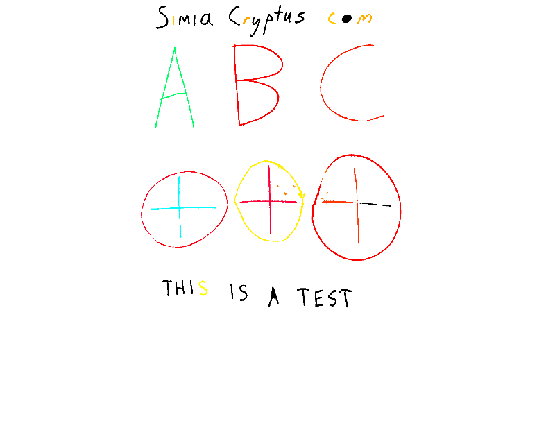


### Method 2 - Color Segmentation
Here is an alternate method using direct-color segmentation:

We can identify segments which may be markings using the full color image:

Code from [WhiteboardWorkflow.scala:392](../../src/test/scala/WhiteboardWorkflow.scala#L392) executed in 26.61 seconds: 
```java
    val imageType = ImageType.pl(3, classOf[GrayF32])
    val alg = FactoryImageSegmentation.fh04(new ConfigFh04(1.0f, 20), imageType)
    //val alg = FactoryImageSegmentation.meanShift(new ConfigSegmentMeanShift(10,60.0F,30,true), imageType)
    //val alg = FactoryImageSegmentation.watershed(new ConfigWatershed(ConnectRule.EIGHT, 20), imageType)
    //val alg = FactoryImageSegmentation.slic(new ConfigSlic(100), imageType)
    val segmentation = new GrayS32(rgb.getWidth, rgb.getHeight)
    alg.segment(rgb, segmentation)
    (alg.getTotalSuperpixels, segmentation)
```

Returns: 
```
    (93343,boofcv.struct.image.GrayS32@1a6f5124)
```


Code from [WhiteboardWorkflow.scala:402](../../src/test/scala/WhiteboardWorkflow.scala#L402) executed in 0.03 seconds: 
```java
    VisualizeRegions.regions(segmentation, superpixels, null)
```

Returns: 


For each segment, we categorize and colorize each using some logic

Code from [WhiteboardWorkflow.scala:139](../../src/test/scala/WhiteboardWorkflow.scala#L139) executed in 12.83 seconds: 
```java
    val regions = (0 until segmentation.getWidth).flatMap(x ⇒ (0 until segmentation.getHeight).map(y ⇒ {
      segmentation.get(x, y) → ((x, y) → rgb.bands.map(_.get(x, y)))
    })).groupBy(x ⇒ x._1).mapValues(_.map(t ⇒ t._2))
    regions.mapValues(pixels ⇒ {
      val rgvValues = pixels.map(_._2)
      val hsvValues = rgvValues.map(rgb ⇒ {
        val hsv = new Array[Float](3)
        ColorHsv.rgbToHsv(rgb(0), rgb(1), rgb(2), hsv)
        hsv
      })
```

Returns: 
```
    Map(53767 -> [D@32f61a31, 32571 -> [D@f5c79a6, 88533 -> [D@669253b7, 77772 -> [D@5305c37d, 42890 -> [D@51a06cbe, 46805 -> [D@3dddbe65, 72033 -> [D@49a64d82, 88320 -> [D@344561e0, 92325 -> [D@66d23e4a, 37159 -> [D@36ac8a63, 29176 -> [D@4d9d1b69, 14221 -> [D@52c8295b, 2163 -> [D@251f7d26, 37041 -> [D@77b21474, 62232 -> [D@52d10fb8, 8607 -> [D@41c07648, 60426 -> [D@1fe8d51b, 25695 -> [D@781e7326, 645 -> [D@22680f52, 84726 -> [D@60d84f61, 13950 -> [D@39c11e6c, 31843 -> [D@324dcd31, 20873 -> [D@503d56b5, 86230 -> [D@72bca894, 23162 -> [D@433ffad1, 39241 -> [D@1fc793c2, 90638 -> [D@2575f671, 64790 -> [D@329a1243, 42900 -> [D@ecf9fb3, 69439 -> [D@2d35442b, 46827 -> [D@27f9e982, 16466 -> [D@4593ff34, 67614 -> [D@37d3d232, 55558 -> [D@30c0ccff, 53060 -> [D@581d969c, 28337 -> [D@22db8f4, 49828 -> [D@2b46a8c1, 50400 -> [D@1d572e62, 29862 -> [D@29caf222, 39049 -> [D@46cf05f7, 69397 -> [D@5851bd4f, 19887 -> [D@7cd1ac19, 81338 -> [D@2f40a43, 35178 -> [D@3caa4757, 84918 -> [D@69c43e48, 86139 -> [D@1804f60d, 41742 -> [D@3a80515c, 39858 -> [D@547e29a4, 54355 -> [D@1c807b1d, 18180 -> [D@238b521e, 69939 -> [D@1b39fd82, 70174 -> [D@3e2fc448, 70656 -> [D@21680803, 16383 -> [D@588ab592, 36308 -> [D@c8b96ec, 31885 -> [D@4cc61eb1, 892 -> [D@2d8f2f3a, 90410 -> [D@2024293c, 69 -> [D@7048f722, 50665 -> [D@c074c0c, 51261 -> [D@58a55449, 35370 -> [D@5949eba8, 80586 -> [D@6e0ff644, 74021 -> [D@58dea0a5, 53550 -> [D@2a2bb0eb, 45704 -> [D@3c291aad, 66152 -> [D@2d0566ba, 10822 -> [D@733037, 37830 -> [D@7728643a, 37753 -> [D@320e400, 79066 -> [D@5167268, 85145 -> [D@1cfd1875, 26129 -> [D@28c0b664, 16216 -> [D@2c444798, 23563 -> [D@1af7f54a, 81292 -> [D@6ebd78d1, 43261 -> [D@436390f4, 64943 -> [D@4d157787, 25953 -> [D@68ed96ca, 23764 -> [D@6d1310f6, 81608 -> [D@3228d990, 15874 -> [D@54e7391d, 35210 -> [D@50b8ae8d, 54422 -> [D@255990cc, 34630 -> [D@51c929ae, 5385 -> [D@3c8bdd5b, 84486 -> [D@29d2d081, 91071 -> [D@40e4ea87, 40422 -> [D@58783f6c, 68000 -> [D@3a7b503d, 5810 -> [D@512d92b, 49767 -> [D@62c5bbdc, 7375 -> [D@7bdf6bb7, 67223 -> [D@1bc53649, 31462 -> [D@88d6f9b, 81586 -> [D@47d93e0d, 66592 -> [D@475b7792, 81767 -> [D@751e664e, 41894 -> [D@160c3ec1, 77446 -> [D@182b435b, 62382 -> [D@4d0402b, 32287 -> [D@2fa7ae9, 33394 -> [D@7577b641, 5659 -> [D@3704122f, 67773 -> [D@3153ddfc, 55377 -> [D@60afd40d, 31720 -> [D@28a2a3e7, 61456 -> [D@3f2049b6, 19204 -> [D@10b3df93, 59593 -> [D@ea27e34, 64599 -> [D@33a2499c, 80316 -> [D@e72dba7, 42983 -> [D@33c2bd, 20194 -> [D@1dfd5f51, 74720 -> [D@3c321bdb, 69626 -> [D@24855019, 56771 -> [D@3abd581e, 50239 -> [D@4d4d8fcf, 34987 -> [D@610db97e, 33234 -> [D@6f0628de, 14977 -> [D@3fabf088, 33019 -> [D@1e392345, 9929 -> [D@12f3afb5, 11866 -> [D@4ced35ed, 24939 -> [D@2c22a348, 92584 -> [D@7bd69e82, 57415 -> [D@74d7184a, 68990 -> [D@51b01960, 86853 -> [D@6831d8fd, 12928 -> [D@27dc79f7, 45296 -> [D@6b85300e, 67543 -> [D@3aaf4f07, 74492 -> [D@5cbf9e9f, 60039 -> [D@18e8473e, 46897 -> [D@5a2f016d, 21605 -> [D@1a38ba58, 66993 -> [D@3ad394e6, 75299 -> [D@6058e535, 17671 -> [D@42deb43a, 36739 -> [D@1deb2c43, 49591 -> [D@3bb9efbc, 75883 -> [D@1cefc4b3, 2199 -> [D@2b27cc70, 64022 -> [D@6f6a7463, 59003 -> [D@1bdaa23d, 66341 -> [D@79f227a9, 72905 -> [D@6ca320ab, 8062 -> [D@50d68830, 39417 -> [D@1e53135d, 25109 -> [D@7674a051, 3021 -> [D@3a7704c, 38328 -> [D@6754ef00, 13650 -> [D@619bd14c, 8536 -> [D@323e8306, 5437 -> [D@a23a01d, 20200 -> [D@4acf72b6, 59913 -> [D@7561db12, 57225 -> [D@3301500b, 1322 -> [D@24b52d3e, 25521 -> [D@15deb1dc, 36905 -> [D@6e9c413e, 85910 -> [D@57a4d5ee, 49988 -> [D@5af5def9, 56093 -> [D@3a45c42a, 88990 -> [D@36dce7ed, 45621 -> [D@47a64f7d, 24338 -> [D@33d05366, 74470 -> [D@27a0a5a2, 43294 -> [D@7692cd34, 1665 -> [D@33aa93c, 15767 -> [D@32c0915e, 40432 -> [D@106faf11, 38002 -> [D@70f43b45, 62154 -> [D@26d10f2e, 54506 -> [D@10ad20cb, 91679 -> [D@7dd712e8, 59972 -> [D@2c282004, 45642 -> [D@22ee2d0, 79473 -> [D@7bfc3126, 57284 -> [D@3e792ce3, 79936 -> [D@53bc1328, 34178 -> [D@26f143ed, 21624 -> [D@3c1e3314, 61953 -> [D@4b770e40, 56912 -> [D@78e16155, 73329 -> [D@54a3ab8f, 78556 -> [D@1968a49c, 5509 -> [D@6a1ebcff, 40738 -> [D@19868320, 5686 -> [D@50b0bc4c, 26820 -> [D@c20be82, 1036 -> [D@13c612bd, 52015 -> [D@3ef41c66, 45875 -> [D@6b739528, 58090 -> [D@622ef26a, 9982 -> [D@41de5768, 52505 -> [D@5f577419, 69133 -> [D@28fa700e, 2822 -> [D@3d526ad9, 7304 -> [D@e041f0c, 16794 -> [D@6a175569, 14852 -> [D@11963225, 19370 -> [D@3f3c966c, 38939 -> [D@11ee02f8, 75324 -> [D@4102b1b1, 24213 -> [D@61a5b4ae, 10007 -> [D@3a71c100, 42603 -> [D@5b69fd74, 65367 -> [D@f325091, 9131 -> [D@437e951d, 54999 -> [D@77b325b3, 29375 -> [D@63a5e46c, 91636 -> [D@7e8e8651, 34665 -> [D@49ef32e0, 2630 -> [D@271f18d3, 21729 -> [D@6bd51ed8, 41049 -> [D@61e3a1fd, 13052 -> [D@51abf713, 66201 -> [D@eadb475, 39515 -> [D@4d4d48a6, 87345 -> [D@315df4bb, 15806 -> [D@3fc08eec, 50164 -> [D@5cad8b7d, 83028 -> [D@7b02e036, 57736 -> [D@25243bc1, 70698 -> [D@1e287667, 56798 -> [D@2e6ee0bc, 29564 -> [D@4201a617, 80948 -> [D@467f77a5, 23855 -> [D@1bb9aa43, 59383 -> [D@420bc288, 24878 -> [D@df5f5c0, 54403 -> [D@308a6984, 81915 -> [D@66b72664, 6085 -> [D@7a34b7b8, 26329 -> [D@58cd06cb, 29599 -> [D@3be8821f, 13266 -> [D@64b31700, 47949 -> [D@3b65e559, 76381 -> [D@bae47a0, 76233 -> [D@74a9c4b0, 62161 -> [D@85ec632, 47229 -> [D@1c05a54d, 27536 -> [D@65ef722a, 3873 -> [D@5fd9b663, 87419 -> [D@214894fc, 81756 -> [D@10567255, 68707 -> [D@e362c57, 64422 -> [D@1c4ee95c, 54447 -> [D@79c4715d, 73813 -> [D@5aa360ea, 75848 -> [D@6548bb7d, 28587 -> [D@e27ba81, 10917 -> [D@54336c81, 4188 -> [D@1556f2dd, 15643 -> [D@35e52059, 83720 -> [D@62577d6, 92603 -> [D@49bd54f7, 44266 -> [D@6b5f8707, 46590 -> [D@772485dd, 87875 -> [D@5a12c728, 70259 -> [D@79ab3a71, 20256 -> [D@6e5bfdfc, 79806 -> [D@3d829787, 1586 -> [D@71652c98, 40696 -> [D@51bde877, 85756 -> [D@60b85ba1, 25724 -> [D@492fc69e, 92385 -> [D@117632cf, 8618 -> [D@2fb68ec6, 26413 -> [D@d71adc2, 88303 -> [D@3add81c4, 36243 -> [D@1a1d3c1a, 29473 -> [D@1c65121, 23882 -> [D@159e366, 54280 -> [D@57dc9128, 83171 -> [D@24528a25, 75915 -> [D@17ae98d7, 53672 -> [D@59221b97, 85109 -> [D@6ac4944a, 26250 -> [D@5a772895, 16054 -> [D@39fc6b2c, 41557 -> [D@704b2127, 66135 -> [D@3ee39da0, 29163 -> [D@5d332969, 64773 -> [D@7cc9ce8, 1501 -> [D@2e27d72f, 39365 -> [D@c0b41d6, 35474 -> [D@4837595f, 19597 -> [D@2bffa76d, 92234 -> [D@3b718392, 30353 -> [D@6d2260db, 69484 -> [D@1f2d2181, 18768 -> [D@49bf29c6, 27510 -> [D@7ee55e70, 27052 -> [D@3fcdcf, 52737 -> [D@7668d560, 84540 -> [D@46292372, 61392 -> [D@126be319, 71968 -> [D@6c44052e, 4201 -> [D@5c371e13, 32604 -> [D@530a8454, 2452 -> [D@1e34c607, 35681 -> [D@5215cd9a, 21321 -> [D@36b6964d, 90821 -> [D@31198ceb, 88518 -> [D@9257031, 19904 -> [D@75201592, 91295 -> [D@7726e185, 53037 -> [D@aa5455e, 8960 -> [D@282308c3, 85839 -> [D@5dda14d0, 43615 -> [D@1db0ec27, 62868 -> [D@3d9fc57a, 15170 -> [D@d4ab71a, 40307 -> [D@3b4ef7, 9405 -> [D@1af05b03, 71858 -> [D@5987e932, 61794 -> [D@1ad777f, 809 -> [D@5bbbdd4b, 7373 -> [D@438bad7c, 25680 -> [D@25230246, 45783 -> [D@4fdf8f12, 48513 -> [D@4a8b5227, 60061 -> [D@54f5f647, 52690 -> [D@6979efad, 66167 -> [D@5a6d5a8f, 23428 -> [D@4a67318f, 16261 -> [D@315ba14a, 90622 -> [D@17f9344b, 18279 -> [D@27f0ad19, 16340 -> [D@54e81b21, 15467 -> [D@38d5b107, 45828 -> [D@6650813a, 39919 -> [D@44ea608c, 55663 -> [D@50cf5a23, 24146 -> [D@450794b4, 66854 -> [D@273c947f, 44442 -> [D@30457e14, 91652 -> [D@1af1347d, 28292 -> [D@632aa1a3, 63802 -> [D@20765ed5, 41429 -> [D@3b582111, 8930 -> [D@2899a8db, 24791 -> [D@1e8823d2, 17959 -> [D@c1a4620, 80503 -> [D@76b0ae1b, 57366 -> [D@130a0f66, 33902 -> [D@4c432866, 77856 -> [D@12365c88, 88156 -> [D@6105f8a3, 72880 -> [D@2237bada, 66719 -> [D@77e2a6e2, 82465 -> [D@5710768a, 44514 -> [D@199e4c2b, 71049 -> [D@6e0d4a8, 4560 -> [D@64d7b720, 17507 -> [D@30272916, 63148 -> [D@5bb3d42d, 50896 -> [D@5bf61e67, 7766 -> [D@2c1dc8e, 35606 -> [D@b273a59, 17759 -> [D@4e7095ac, 13024 -> [D@251ebf23, 68362 -> [D@29b732a2, 24914 -> [D@1b70203f, 64491 -> [D@51671b08, 76413 -> [D@15051a0, 4447 -> [D@1162410a, 38311 -> [D@b09fac1, 75070 -> [D@62df0ff3, 28419 -> [D@61019f59, 34352 -> [D@62e8f862, 47281 -> [D@26f3d90c, 55964 -> [D@3c49fab6, 67165 -> [D@515f4131, 90259 -> [D@7... and 2021792 more bytes
```


To help interpret the structure of this data set, we train a density tree:

Code from [WhiteboardWorkflow.scala:292](../../src/test/scala/WhiteboardWorkflow.scala#L292) executed in 12.09 seconds: 
```java
    val tree = new DensityTree("hueMean", "hueStdDev", "lumMean", "lumStdDev", "chromaMean", "width", "length")
    tree.setSplitSizeThreshold(2)
    tree.setMinFitness(2)
    tree.setMaxDepth(3)
    new tree.Node((0 until superpixels).map(superpixelParameters(_)).toArray)
```

Returns: 
```
    // Count: 93343 Volume: 3.7365306236707883E9 Region: [hueMean: 2.7641456108540297E-4 - 6.283112049102783; hueStdDev: 0.0 - 1.608965516090393; lumMean: 17.942581176757812 - 255.00003051757812; lumStdDev: 0.0 - 31.760578155517578; chromaMean: 0.0 - 52.78872299194336; width: 1.0 - 11.0; length: 4.0 - 97.0]
if(chromaMean < 8.030442237854004) { // Fitness 6.473736585093095
  // Count: 85590 Volume: 3.513630636709118E8 Region: [hueMean: 2.7641456108540297E-4 - 6.283112049102783; hueStdDev: 0.0 - 1.608965516090393; lumMean: 17.942581176757812 - 186.19741821289062; lumStdDev: 0.0 - 31.760578155517578; chromaMean: 0.0 - 8.029947280883789; width: 1.0 - 11.0; length: 4.0 - 85.0]
  if(lumStdDev < 0.9642030596733093) { // Fitness 6.261725333232036
    // Count: 80224 Volume: 3454248.8540038066 Region: [hueMean: 2.7641456108540297E-4 - 6.283112049102783; hueStdDev: 0.0 - 1.608965516090393; lumMean: 111.3158950805664 - 186.19741821289062; lumStdDev: 0.0 - 0.9631896615028381; chromaMean: 0.0 - 8.029947280883789; width: 1.0 - 11.0; length: 4.0 - 63.0]
    if(hueStdDev < 0.0013864522334188223) { // Fitness 4.477521440840184
      // Count: 28584 Volume: 1330.6424897850738 Region: [hueMean: 0.20943912863731384 - 5.76010274887085; hueStdDev: 0.0 - 0.0013810679083690047; lumMean: 126.1464614868164 - 186.19741821289062; lumStdDev: 0.0 - 0.9631896615028381; chromaMean: 0.2599334716796875 - 8.014521598815918; width: 1.0 - 10.0; length: 4.0 - 47.0]
    } else {
      // Count: 51640 Volume: 3401339.851974993 Region: [hueMean: 2.7641456108540297E-4 - 6.283112049102783; hueStdDev: 0.0013864522334188223 - 1.608965516090393; lumMean: 111.3158950805664 - 185.11404418945312; lumStdDev: 0.0 - 0.9631896615028381; chromaMean: 0.0 - 8.029947280883789; width: 1.0 - 11.0; length: 4.0 - 63.0]
    }
  } else {
    // Count: 5366 Volume: 3.099200436791079E8 Region: [hueMean: 0.010003415867686272 - 6.280218124389648; hueStdDev: 0.0 - 1.4764198064804077; lumMean: 17.942581176757812 - 185.11289978027344; lumStdDev: 0.9642030596733093 - 31.760578155517578; chromaMean: 0.0 - 8.028115272521973; width: 1.0 - 11.0; length: 4.0 - 85.0]
    if(lumStdDev < 1.5322062969207764) { // Fitness 5.140794202377674
      // Count: 3510 Volume: 1385235.3987834817 Region: [hueMean: 0.030079929158091545 - 6.261921405792236; hueStdDev: 0.0 - 1.3228386640548706; lumMean: 107.81869506835938 - 185.11289978027344; lumStdDev: 0.9642030596733093 - 1.5283774137496948; chromaMean: 0.0 - 8.027841567993164; width: 1.0 - 11.0; length: 4.0 - 52.0]
    } else {
      // Count: 1856 Volume: 2.8893119756019425E8 Region: [hueMean: 0.010003415867686272 - 6.280218124389648; hueStdDev: 0.0 - 1.4764198064804077; lumMean: 17.942581176757812 - 180.7397003173828; lumStdDev: 1.5322062969207764 - 31.760578155517578; chromaMean: 0.0 - 8.028115272521973; width: 1.0 - 11.0; length: 6.0 - 85.0]
    }
  }
} else {
  // Count: 7753 Volume: 3.434291924232156E8 Region: [hueMean: 0.0011666695354506373 - 6.279778957366943; hueStdDev: 0.0 - 0.4623412489891052; lumMean: 74.70964050292969 - 255.00003051757812; lumStdDev: 0.0 - 15.764564514160156; chromaMean: 8.030442237854004 - 52.78872299194336; width: 1.0 - 11.0; length: 4.0 - 97.0]
  if(lumStdDev < 1.4710752964019775) { // Fitness 5.734513914047658
    // Count: 6480 Volume: 3032778.064071479 Region: [hueMean: 0.012901393696665764 - 6.269227981567383; hueStdDev: 0.0 - 0.18709011375904083; lumMean: 103.27598571777344 - 255.00003051757812; lumStdDev: 0.0 - 1.4697469472885132; chromaMean: 8.030442237854004 - 43.891937255859375; width: 1.0 - 10.0; length: 4.0 - 40.0]
    if(hueMean < 0.796545147895813) { // Fitness 3.2770241375046036
      // Count: 5872 Volume: 297396.39369532606 Region: [hueMean: 0.012901393696665764 - 0.7904947400093079; hueStdDev: 0.0 - 0.18709011375904083; lumMean: 135.28782653808594 - 255.00003051757812; lumStdDev: 0.0 - 1.4697469472885132; chromaMean: 8.032264709472656 - 43.891937255859375; width: 1.0 - 10.0; length: 4.0 - 40.0]
    } else {
      // Count: 608 Volume: 510561.19565660576 Region: [hueMean: 0.796545147895813 - 6.269227981567383; hueStdDev: 0.0 - 0.14323878288269043; lumMean: 103.27598571777344 - 185.774658203125; lumStdDev: 0.0 - 1.4677523374557495; chromaMean: 8.030442237854004 - 31.21501922607422; width: 1.0 - 9.0; length: 4.0 - 33.0]
    }
  } else {
    // Count: 1273 Volume: 3.0051270794363314E8 Region: [hueMean: 0.0011666695354506373 - 6.279778957366943; hueStdDev: 0.0 - 0.4623412489891052; lumMean: 74.70964050292969 - 252.54922485351562; lumStdDev: 1.4710752964019775 - 15.764564514160156; chromaMean: 8.035074234008789 - 52.78872299194336; width: 1.0 - 11.0; length: 6.0 - 97.0]
    if(hueMean < 0.6883835196495056) { // Fitness 3.7052465229194924
      // Count: 775 Volume: 1.0269460062490573E7 Region: [hueMean: 0.0011666695354506373 - 0.6788809895515442; hueStdDev: 0.0 - 0.4393967092037201; lumMean: 105.95199584960938 - 252.54922485351562; lumStdDev: 1.4710752964019775 - 12.274051666259766; chromaMean: 8.035074234008789 - 42.59990310668945; width: 1.0 - 11.0; length: 6.0 - 69.0]
    } else {
      // Count: 498 Volume: 8.101968385656749E7 Region: [hueMean: 0.6883835196495056 - 6.279778957366943; hueStdDev: 0.002583741443231702 - 0.4623412489891052; lumMean: 74.70964050292969 - 184.2880401611328; lumStdDev: 1.4763765335083008 - 15.764564514160156; chromaMean: 8.055840492248535 - 52.78872299194336; width: 1.0 - 6.0; length: 7.0 - 97.0]
    }
  }
}
```


Now, we recolor the image by classifying each superpixel as white, black, or color:

Code from [WhiteboardWorkflow.scala:202](../../src/test/scala/WhiteboardWorkflow.scala#L202) executed in 0.57 seconds: 
```java
    val segmentColors: ColorQueue_F32 = new ColorQueue_F32(3)
    segmentColors.resize(superpixels)
    (0 until superpixels).foreach(i ⇒ {
      segmentColors.getData()(i) = {
        val p = superpixelParameters(i)
        val (hueMean: Float, hueStdDev: Float, lumMean: Float, lumStdDev: Float, chromaMean: Float, width: Int, length: Int) = (p(0).floatValue(), p(1).floatValue(), p(2).floatValue(), p(3).floatValue(), p(4).floatValue(), p(5).intValue(), p(6).intValue())
        val aspect = length.toDouble / width
```

Returns: 
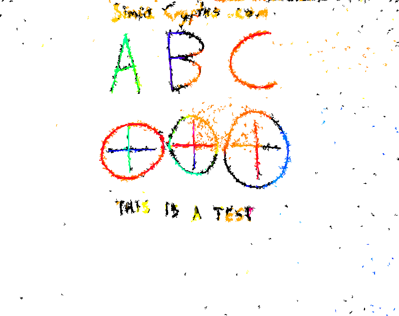


### Method 3 - Hybrid
Here is an alternate method using direct-color segmentation:

Dectection of markings uses the luminosity

Code from [WhiteboardWorkflow.scala:366](../../src/test/scala/WhiteboardWorkflow.scala#L366) executed in 0.88 seconds: 
```java
    val bandImg: GrayF32 = hsv.getBand(2)
    val to = ConvertBufferedImage.convertTo(bandImg, null)
    VisualizeImageData.standard(bandImg, to)
```

Returns: 


...by detecting local variations

Code from [WhiteboardWorkflow.scala:372](../../src/test/scala/WhiteboardWorkflow.scala#L372) executed in 0.59 seconds: 
```java
    val single = ConvertBufferedImage.convertFromSingle(colorBand, null, classOf[GrayF32])
    val binary = new GrayU8(single.width, single.height)
    GThresholdImageOps.localSauvola(single, binary, 50, 0.2f, true)
```

Returns: 
```
    boofcv.struct.image.GrayU8@1e94fe1d
```


Code from [WhiteboardWorkflow.scala:377](../../src/test/scala/WhiteboardWorkflow.scala#L377) executed in 0.01 seconds: 
```java
    VisualizeBinaryData.renderBinary(binaryMask, false, null)
```

Returns: 
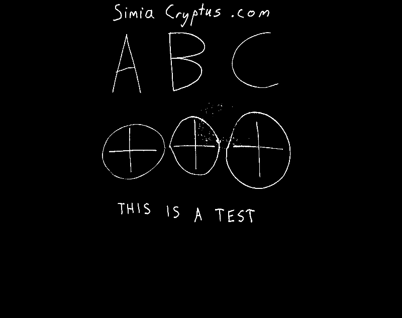


Code from [WhiteboardWorkflow.scala:331](../../src/test/scala/WhiteboardWorkflow.scala#L331) executed in 0.01 seconds: 
```java
    VisualizeBinaryData.renderBinary(finalBinaryMask, false, null)
```

Returns: 


Use threshold mask to clean white area on board

Code from [WhiteboardWorkflow.scala:336](../../src/test/scala/WhiteboardWorkflow.scala#L336) executed in 0.86 seconds: 
```java
    val maskedRgb: Planar[GrayF32] = rgb.clone()
    (0 until maskedRgb.getWidth).foreach(x ⇒
      (0 until maskedRgb.getHeight).foreach(y ⇒
        (0 until maskedRgb.getNumBands).foreach(b ⇒
          if(finalBinaryMask.get(x,y)==0) {
            maskedRgb.getBand(b).set(x, y, 255.0f)
          })))
    maskedRgb
```

Returns: 
```
    boofcv.struct.image.Planar@2c188e57
```


Code from [WhiteboardWorkflow.scala:346](../../src/test/scala/WhiteboardWorkflow.scala#L346) executed in 0.06 seconds: 
```java
    ConvertBufferedImage.convertTo(maskedRgb, null, false)
```

Returns: 
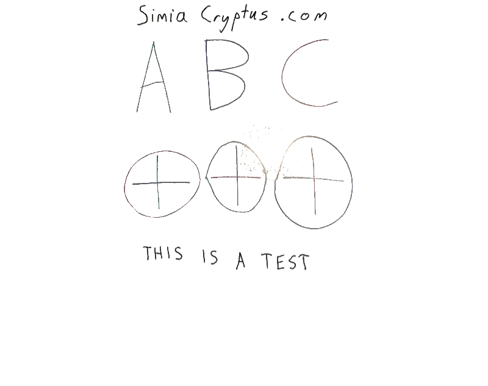


We can identify segments which may be markings using the masked color image:

Code from [WhiteboardWorkflow.scala:351](../../src/test/scala/WhiteboardWorkflow.scala#L351) executed in 8.19 seconds: 
```java
    val imageType = ImageType.pl(3, classOf[GrayF32])
    val alg = FactoryImageSegmentation.fh04(new ConfigFh04(0.5f, 30), imageType)
    val segmentation = new GrayS32(rgb.getWidth, rgb.getHeight)
    alg.segment(maskedRgb, segmentation)
    (alg.getTotalSuperpixels, segmentation)
```

Returns: 
```
    (642,boofcv.struct.image.GrayS32@615ae885)
```


Code from [WhiteboardWorkflow.scala:358](../../src/test/scala/WhiteboardWorkflow.scala#L358) executed in 0.02 seconds: 
```java
    VisualizeRegions.regions(segmentation, superpixels, null)
```

Returns: 


For each segment, we categorize and colorize each using some logic

Code from [WhiteboardWorkflow.scala:139](../../src/test/scala/WhiteboardWorkflow.scala#L139) executed in 17.12 seconds: 
```java
    val regions = (0 until segmentation.getWidth).flatMap(x ⇒ (0 until segmentation.getHeight).map(y ⇒ {
      segmentation.get(x, y) → ((x, y) → rgb.bands.map(_.get(x, y)))
    })).groupBy(x ⇒ x._1).mapValues(_.map(t ⇒ t._2))
    regions.mapValues(pixels ⇒ {
      val rgvValues = pixels.map(_._2)
      val hsvValues = rgvValues.map(rgb ⇒ {
        val hsv = new Array[Float](3)
        ColorHsv.rgbToHsv(rgb(0), rgb(1), rgb(2), hsv)
        hsv
      })
```

Returns: 
```
    Map(69 -> [D@39677403, 629 -> [D@22fba5df, 365 -> [D@4980d7bb, 138 -> [D@55cb146f, 101 -> [D@578eb5b9, 479 -> [D@282427ca, 347 -> [D@67d6007a, 333 -> [D@6ab30883, 628 -> [D@48325b11, 249 -> [D@41a12faa, 518 -> [D@16a32234, 468 -> [D@64a6d773, 234 -> [D@3e16e225, 0 -> [D@76824632, 555 -> [D@79bf7854, 88 -> [D@2bf0355f, 481 -> [D@227eedce, 352 -> [D@46a98c65, 408 -> [D@44d6213c, 170 -> [D@6ea6be34, 523 -> [D@3b633eb3, 582 -> [D@31a3471e, 115 -> [D@44894fd7, 217 -> [D@1f850e6c, 276 -> [D@3db13d89, 308 -> [D@16810696, 5 -> [D@18780466, 449 -> [D@2fb99f6b, 120 -> [D@1bd0b260, 247 -> [D@57bb23a, 379 -> [D@5df8ddc7, 440 -> [D@3e5943d4, 511 -> [D@2084b5cd, 614 -> [D@78b62985, 269 -> [D@63bbd5b1, 202 -> [D@17087df1, 597 -> [D@12a79800, 10 -> [D@5b9461d0, 385 -> [D@663f314e, 384 -> [D@320c2f8d, 56 -> [D@1c45c654, 533 -> [D@64a7aeed, 550 -> [D@7b8d4676, 142 -> [D@282e7ecd, 500 -> [D@1aeb7afa, 472 -> [D@43e26f8c, 340 -> [D@524d3f70, 538 -> [D@94eebe2, 153 -> [D@48337c9b, 174 -> [D@187de41e, 404 -> [D@2370fede, 185 -> [D@5d1f10a9, 42 -> [D@e1b6835, 417 -> [D@793130fc, 24 -> [D@5d13a70a, 288 -> [D@782c6e59, 301 -> [D@2d23eba9, 320 -> [D@5de59821, 565 -> [D@1d0e5f60, 436 -> [D@6cba43e, 37 -> [D@340769ed, 25 -> [D@45d2dbdc, 257 -> [D@2a486959, 389 -> [D@7179c27a, 52 -> [D@7e3e85b9, 14 -> [D@2d61bd99, 570 -> [D@448a1bcd, 184 -> [D@7b5f7b34, 372 -> [D@71c62aab, 504 -> [D@516bcc7f, 110 -> [D@45abf1ec, 587 -> [D@45ada4b6, 619 -> [D@5fe5dda, 125 -> [D@a79612e, 344 -> [D@1047c51c, 357 -> [D@38674bb6, 196 -> [D@4f80d1ed, 542 -> [D@eb1a922, 460 -> [D@2070f2cd, 157 -> [D@2248378e, 559 -> [D@6b8e8593, 638 -> [D@6875d979, 189 -> [D@4f34b820, 20 -> [D@2ca3020f, 421 -> [D@339eb815, 46 -> [D@7566010e, 93 -> [D@1f79523a, 606 -> [D@2bfe98a0, 284 -> [D@6de6d3da, 416 -> [D@284dc119, 325 -> [D@7d70bea8, 152 -> [D@2294123e, 228 -> [D@79b77db5, 289 -> [D@3f342e93, 448 -> [D@47495223, 57 -> [D@454ead16, 316 -> [D@7563adf, 78 -> [D@1988dc10, 261 -> [D@14dd4d48, 29 -> [D@244b64d8, 216 -> [D@12fd224c, 475 -> [D@4dca145f, 492 -> [D@3303a7a3, 164 -> [D@4c1168bf, 179 -> [D@3705cc33, 591 -> [D@2a705e60, 443 -> [D@460ca32, 321 -> [D@43f31e91, 376 -> [D@5a0e2688, 623 -> [D@72a5e0f7, 211 -> [D@701695cb, 253 -> [D@2bca0ace, 485 -> [D@5b4359, 106 -> [D@5d24b9fd, 238 -> [D@1958d75f, 121 -> [D@623f32c0, 514 -> [D@38a4e455, 348 -> [D@40b759ed, 574 -> [D@1f8a8c8b, 84 -> [D@4381488, 353 -> [D@1ba1de16, 480 -> [D@61a394be, 602 -> [D@2a06a2d5, 147 -> [D@6e5e6f49, 397 -> [D@7b1a4dfa, 280 -> [D@6613043, 61 -> [D@196e3a50, 634 -> [D@4572a13, 221 -> [D@2d0bd2fe, 293 -> [D@22670c34, 453 -> [D@4a330e92, 132 -> [D@7709a275, 396 -> [D@4660248, 89 -> [D@1e7aa85c, 133 -> [D@4c6f729f, 411 -> [D@76cf6b6d, 116 -> [D@428f43be, 243 -> [D@97c2bfb, 428 -> [D@3eb05bc1, 1 -> [D@33a9cb79, 265 -> [D@b83fc01, 507 -> [D@63482d79, 527 -> [D@5f9a0c82, 312 -> [D@2295f60b, 74 -> [D@36e275ac, 206 -> [D@1463a5ec, 307 -> [D@1b1245fe, 292 -> [D@163add39, 233 -> [D@33d09547, 452 -> [D@3a951a14, 6 -> [D@33a1950d, 248 -> [D@73325555, 60 -> [D@44ff8cd9, 380 -> [D@56286be8, 117 -> [D@691e95dd, 512 -> [D@867fd56, 439 -> [D@30c631c7, 270 -> [D@25a47b1c, 529 -> [D@3889a208, 546 -> [D@fb36502, 85 -> [D@e7a353a, 201 -> [D@880d372, 381 -> [D@7d6cb988, 220 -> [D@69e34852, 366 -> [D@36ef63b1, 534 -> [D@387a3d5d, 102 -> [D@20427323, 334 -> [D@53100ea1, 302 -> [D@1eaf0d99, 260 -> [D@77565bc4, 349 -> [D@44bef566, 28 -> [D@17888e56, 38 -> [D@71ad9afb, 598 -> [D@34606771, 160 -> [D@746b15e, 561 -> [D@546f75de, 392 -> [D@490857ea, 297 -> [D@7e64fa55, 70 -> [D@4c9a6886, 424 -> [D@63f4354e, 192 -> [D@68c889dd, 407 -> [D@31a770c3, 630 -> [D@2e66f029, 429 -> [D@6cfaeeee, 275 -> [D@40d014cd, 21 -> [D@4afb557c, 137 -> [D@530503b2, 165 -> [D@68b31aa2, 33 -> [D@28051d05, 92 -> [D@38c5edcc, 467 -> [D@43a661f5, 229 -> [D@33300529, 566 -> [D@335dcb7f, 484 -> [D@24e1eb55, 252 -> [D@54388ff5, 197 -> [D@6712d116, 361 -> [D@3ac9e8b8, 65 -> [D@115907f7, 625 -> [D@18e750e, 435 -> [D@70e58e48, 97 -> [D@59c34c4, 329 -> [D@5ca3ed3f, 583 -> [D@2ef7c5a0, 522 -> [D@72bc99f8, 461 -> [D@1662a97f, 493 -> [D@55eb7499, 551 -> [D@45a16141, 456 -> [D@53c45354, 324 -> [D@50ee3102, 285 -> [D@5eafd83a, 224 -> [D@10ca01c7, 519 -> [D@6165ae79, 578 -> [D@40a2f576, 317 -> [D@606c9b50, 156 -> [D@20e87aa3, 615 -> [D@6c321ea1, 403 -> [D@3b6c5f14, 9 -> [D@3f5ef532, 188 -> [D@5c80bd18, 388 -> [D@20bb673f, 53 -> [D@797618c3, 356 -> [D@31c995ba, 169 -> [D@68f896e6, 593 -> [D@13019659, 141 -> [D@5af834fa, 610 -> [D@27610e5a, 420 -> [D@b02e3f6, 499 -> [D@142e0f91, 109 -> [D@f6aa60a, 328 -> [D@20567a63, 471 -> [D@3c5720cc, 256 -> [D@58e1e250, 488 -> [D@26145b0, 124 -> [D@11f7b2fd, 225 -> [D@14a3b14f, 339 -> [D@430732e9, 77 -> [D@4bc3a3fc, 554 -> [D@678f9023, 193 -> [D@6e2f7c54, 537 -> [D@14458b02, 476 -> [D@42cf1635, 526 -> [D@59da98c7, 637 -> [D@4c828274, 489 -> [D@74a71d7d, 590 -> [D@4ee3c362, 547 -> [D@437266d9, 212 -> [D@1b3bdde1, 96 -> [D@57bb770e, 622 -> [D@7935648, 393 -> [D@5707accd, 515 -> [D@1296a719, 457 -> [D@1e19a142, 173 -> [D@32585df, 13 -> [D@692e30b2, 129 -> [D@4e27ece1, 569 -> [D@1d6747d6, 41 -> [D@32c332d8, 371 -> [D@2af02f92, 503 -> [D@5bc18ec9, 605 -> [D@7cbf2b90, 134 -> [D@5741832d, 73 -> [D@7c66aae8, 128 -> [D@2b86d46b, 343 -> [D@2ee09920, 237 -> [D@75633f3a, 105 -> [D@3c1bea94, 244 -> [D@212344f0, 2 -> [D@ba0f06d, 266 -> [D@675694cc, 633 -> [D@4fa8df8, 360 -> [D@3fc54d53, 205 -> [D@336af15e, 508 -> [D@60c9e30b, 311 -> [D@308c27a7, 541 -> [D@25365b30, 398 -> [D@4132bec9, 558 -> [D@6e4ccc5f, 530 -> [D@3fac6f2e, 586 -> [D@28d45c30, 298 -> [D@7c447b15, 412 -> [D@74627ef6, 618 -> [D@28ebaa4b, 425 -> [D@22d456ba, 513 -> [D@7d970d26, 430 -> [D@1ae559ac, 166 -> [D@6fa90149, 32 -> [D@6fc8eb80, 34 -> [D@2af32562, 148 -> [D@1a6b21a9, 264 -> [D@3defc8e4, 45 -> [D@1553b032, 161 -> [D@26b85fcf, 279 -> [D@659d54d8, 64 -> [D@26761867, 573 -> [D@2e2ceebb, 180 -> [D@4a8e9a96, 296 -> [D@453a3c8b, 17 -> [D@5319b16b, 444 -> [D@1a89d485, 149 -> [D@24edb768, 375 -> [D@3027191a, 601 -> [D@2e2b749c, 584 -> [D@7ad2a020, 562 -> [D@334d1ee5, 176 -> [D@3b2a3e5f, 423 -> [D@4ed03232, 191 -> [D@216c5868, 402 -> [D@7a8dc096, 22 -> [D@10bfc15e, 44 -> [D@5fb120d9, 286 -> [D@1cdd9c5f, 577 -> [D@8c07622, 579 -> [D@669bf355, 291 -> [D@30fab0b7, 59 -> [D@40b5ed93, 118 -> [D@4bcff2c1, 281 -> [D@72f7a1b6, 204 -> [D@176dd857, 545 -> [D@785b665c, 259 -> [D@4c36ca6c, 27 -> [D@303284d, 413 -> [D@7a55f71a, 641 -> [D@599f178a, 71 -> [D@2300c37f, 391 -> [D@39dbc612, 12 -> [D@6ce31b14, 445 -> [D@4de17245, 382 -> [D@68df5bbd, 54 -> [D@f53ebe2, 572 -> [D@7b1c6aa7, 313 -> [D@3d294cdb, 611 -> [D@2fb9fa70, 144 -> [D@3f25189e, 498 -> [D@27f4048f, 49 -> [D@50cccb3e, 466 -> [D@30c6c12d, 335 -> [D@2730de43, 236 -> [D@20e76656, 181 -> [D@16c4dc4f, 350 -> [D@108db813, 540 -> [D@316eae87, 86 -> [D@2a20bb2a, 159 -> [D@1a363c85, 604 -> [D@678652f0, 187 -> [D@2358c211, 406 -> [D@c8ed4bb, 172 -> [D@27f713bb, 113 -> [D@7233c467, 219 -> [D@179ec87a, 274 -> [D@6dcffd3e, 419 -> [D@72ba41f7, 81 -> [D@1e46b33b, 377 -> [D@7ffa7591, 230 -> [D@6d4e515d, 362 -> [D@4ddb00fa, 451 -> [D@662fad11, 76 -> [D@4ad51ab8, 567 -> [D@558e6e06, 7 -> [D@4047789d, 245 -> [D@5b9b02a1, 318 -> [D@3979d3b0, 509 -> [D@1f2164c7, 39 -> [D@6459742e, 434 -> [D@6754ec0e, 98 -> [D@10c75707, 616 -> [D@4d40e84, 303 -> [D@2b03f234, 271 -> [D@6bf75fc6, 208 -> [D@41a252d0, 599 -> [D@65a6c44e, 477 -> [D@5100089c, 387 -> [D@586415, 494 -> [D@53bf821c, 631 -> [D@68a891, 345 -> [D@517d14e8, 367 -> [D@12c6ba1e, 552 -> [D@3d467538, 535 -> [D@78af7e21, 103 -> [D@414cef88, 609 -> [D@667dabf5, 323 -> [D@689cedb7, 594 -> [D@6b41d8f3, 140 -> [D@4dd74abc, 213 -> [D@46fe72f0, 621 -> [D@4900cecd, 91 -> [D@2ce3115e, 483 -> [D@5b162cd4, 520 -> [D@6e4aacb4, 66 -> [D@21f36116, 240 -> [D@152eed97, 251 -> [D@7f34036a, 626 -> [D@44a03f34, 155 -> [D@7ee11d67, 198 -> [D@1c411579, 108 -> [D@43316ac8, 330 -> [D@62da405, 462 -> [D@70d18b82, 521 -> [D@642fa23c, 130 -> [D@2c80f35b, 399 -> [D@47e67742, 636 -> [D@3b1769a7, 278 -> [D@22b012bb, 455 -> [D@981379d, 223 -> [D@7da91d88, 608 -> [D@7d7309cb, 394 -> [D@5f74e914, 306 -> [D@5fc900b8, 135 -> [D@6a390394, 563 -> [D@fe16249, 299 -> [D@772506e8, 226 -> [D@607e0474, 3 -> [D@42f99e4c, 267 -> [D@468e4f70, 505 -> [D@19c3030f, 438 -> [D@98ee9e7, 431 ... and 4472 more bytes
```


To help interpret the structure of this data set, we train a density tree:

Code from [WhiteboardWorkflow.scala:292](../../src/test/scala/WhiteboardWorkflow.scala#L292) executed in 0.10 seconds: 
```java
    val tree = new DensityTree("hueMean", "hueStdDev", "lumMean", "lumStdDev", "chromaMean", "width", "length")
    tree.setSplitSizeThreshold(2)
    tree.setMinFitness(2)
    tree.setMaxDepth(3)
    new tree.Node((0 until superpixels).map(superpixelParameters(_)).toArray)
```

Returns: 
```
    // Count: 642 Volume: 1.5766214308346117E13 Region: [hueMean: 0.01195644959807396 - 6.281895637512207; hueStdDev: 0.0 - 1.2375530004501343; lumMean: 19.406431198120117 - 229.07838439941406; lumStdDev: 1.0326694250106812 - 41.21062088012695; chromaMean: 0.05663092061877251 - 46.46259689331055; width: 1.0 - 2007.0; length: 8.0 - 2599.0]
if(hueStdDev < 0.18930457532405853) { // Fitness 13.773256777525539
  // Count: 501 Volume: 8.153634908142563E8 Region: [hueMean: 0.01195644959807396 - 6.281895637512207; hueStdDev: 0.0 - 0.18787600100040436; lumMean: 19.406431198120117 - 229.07838439941406; lumStdDev: 1.0326694250106812 - 41.21062088012695; chromaMean: 1.4897948503494263 - 46.46259689331055; width: 1.0 - 22.0; length: 8.0 - 95.0]
  if(chromaMean < 6.0291218757629395) { // Fitness 4.043424693143221
    // Count: 191 Volume: 3.169831835269944E7 Region: [hueMean: 0.09187182784080505 - 5.759585857391357; hueStdDev: 0.0 - 0.18582507967948914; lumMean: 19.406431198120117 - 150.74514770507812; lumStdDev: 1.4496766328811646 - 41.21062088012695; chromaMean: 1.4897948503494263 - 5.988892078399658; width: 1.0 - 22.0; length: 9.0 - 70.0]
    if(lumMean < 92.92259216308594) { // Fitness 3.593891435297913
      // Count: 88 Volume: 653566.0632668228 Region: [hueMean: 0.5204094052314758 - 1.0725330114364624; hueStdDev: 0.0 - 0.17737987637519836; lumMean: 19.406431198120117 - 92.75288391113281; lumStdDev: 6.092287540435791 - 41.21062088012695; chromaMean: 1.6451785564422607 - 5.506298542022705; width: 1.0 - 12.0; length: 9.0 - 70.0]
    } else {
      // Count: 103 Volume: 8611947.335529538 Region: [hueMean: 0.09187182784080505 - 5.759585857391357; hueStdDev: 0.0 - 0.18582507967948914; lumMean: 92.92259216308594 - 150.74514770507812; lumStdDev: 1.4496766328811646 - 28.17722511291504; chromaMean: 1.4897948503494263 - 5.988892078399658; width: 1.0 - 22.0; length: 11.0 - 67.0]
    }
  } else {
    // Count: 310 Volume: 6.503509541023154E7 Region: [hueMean: 0.01195644959807396 - 6.281895637512207; hueStdDev: 2.44140625E-4 - 0.18787600100040436; lumMean: 77.49382781982422 - 229.07838439941406; lumStdDev: 1.0326694250106812 - 18.31138038635254; chromaMean: 6.0291218757629395 - 46.46259689331055; width: 1.0 - 7.0; length: 8.0 - 95.0]
    if(hueMean < 2.3908135890960693) { // Fitness 2.333312694313708
      // Count: 142 Volume: 8653579.479723416 Region: [hueMean: 0.01195644959807396 - 1.2616571187973022; hueStdDev: 2.44140625E-4 - 0.1872149556875229; lumMean: 113.1924819946289 - 229.07838439941406; lumStdDev: 1.0326694250106812 - 18.31138038635254; chromaMean: 6.0824971199035645 - 42.348846435546875; width: 1.0 - 7.0; length: 8.0 - 93.0]
    } else {
      // Count: 168 Volume: 1.8090304270369813E7 Region: [hueMean: 2.3908135890960693 - 6.281895637512207; hueStdDev: 0.001642288058064878 - 0.18787600100040436; lumMean: 77.49382781982422 - 152.2187957763672; lumStdDev: 1.6108155250549316 - 17.439319610595703; chromaMean: 6.0291218757629395 - 46.46259689331055; width: 1.0 - 7.0; length: 8.0 - 95.0]
    }
  }
} else {
  // Count: 141 Volume: 3.530386415848913E12 Region: [hueMean: 0.03294476494193077 - 6.2711567878723145; hueStdDev: 0.18930457532405853 - 1.2375530004501343; lumMean: 30.13751220703125 - 161.3789520263672; lumStdDev: 1.6183758974075317 - 34.73158645629883; chromaMean: 0.05663092061877251 - 23.96747589111328; width: 1.0 - 2007.0; length: 9.0 - 2599.0]
  if(hueStdDev < 0.5252676606178284) { // Fitness 14.691082207229721
    // Count: 83 Volume: 9.101126495219502E7 Region: [hueMean: 0.06845054030418396 - 6.2711567878723145; hueStdDev: 0.18930457532405853 - 0.5071811079978943; lumMean: 44.620216369628906 - 161.3789520263672; lumStdDev: 1.6183758974075317 - 34.73158645629883; chromaMean: 1.8173586130142212 - 23.96747589111328; width: 1.0 - 8.0; length: 9.0 - 86.0]
    if(chromaMean < 4.739744186401367) { // Fitness 3.1939475758896143
      // Count: 45 Volume: 9986045.433229033 Region: [hueMean: 0.10205158591270447 - 6.259024143218994; hueStdDev: 0.18997089564800262 - 0.5071811079978943; lumMean: 44.620216369628906 - 150.25572204589844; lumStdDev: 1.6183758974075317 - 34.73158645629883; chromaMean: 1.8173586130142212 - 4.529293060302734; width: 1.0 - 8.0; length: 9.0 - 86.0]
    } else {
      // Count: 38 Volume: 9897424.939360468 Region: [hueMean: 0.06845054030418396 - 6.2711567878723145; hueStdDev: 0.18930457532405853 - 0.49158743023872375; lumMean: 99.394287109375 - 161.3789520263672; lumStdDev: 1.7252717018127441 - 16.488927841186523; chromaMean: 4.739744186401367 - 23.96747589111328; width: 1.0 - 6.0; length: 13.0 - 73.0]
    }
  } else {
    // Count: 58 Volume: 8.507901808314618E11 Region: [hueMean: 0.03294476494193077 - 6.053177833557129; hueStdDev: 0.5252676606178284 - 1.2375530004501343; lumMean: 30.13751220703125 - 156.6826171875; lumStdDev: 2.4266586303710938 - 33.78315734863281; chromaMean: 0.05663092061877251 - 9.699155807495117; width: 1.0 - 2007.0; length: 14.0 - 2599.0]
    if(hueMean < 3.344520330429077) { // Fitness 16.547854891978886
      // Count: 5 Volume: 9930794.44369788 Region: [hueMean: 0.03294476494193077 - 1.8380794525146484; hueStdDev: 0.550834059715271 - 0.6815736293792725; lumMean: 67.97038269042969 - 142.52899169921875; lumStdDev: 2.631316900253296 - 28.567567825317383; chromaMean: 1.8923025131225586 - 4.495193958282471; width: 3.0 - 47.0; length: 23.0 - 213.0]
    } else {
      // Count: 53 Volume: 3.827923571448875E11 Region: [hueMean: 3.344520330429077 - 6.053177833557129; hueStdDev: 0.5252676606178284 - 1.2375530004501343; lumMean: 30.13751220703125 - 156.6826171875; lumStdDev: 2.4266586303710938 - 33.78315734863281; chromaMean: 0.05663092061877251 - 9.699155807495117; width: 1.0 - 2007.0; length: 14.0 - 2599.0]
    }
  }
}
```


Now, we recolor the image by classifying each superpixel as white, black, or color:

Code from [WhiteboardWorkflow.scala:202](../../src/test/scala/WhiteboardWorkflow.scala#L202) executed in 0.42 seconds: 
```java
    val segmentColors: ColorQueue_F32 = new ColorQueue_F32(3)
    segmentColors.resize(superpixels)
    (0 until superpixels).foreach(i ⇒ {
      segmentColors.getData()(i) = {
        val p = superpixelParameters(i)
        val (hueMean: Float, hueStdDev: Float, lumMean: Float, lumStdDev: Float, chromaMean: Float, width: Int, length: Int) = (p(0).floatValue(), p(1).floatValue(), p(2).floatValue(), p(3).floatValue(), p(4).floatValue(), p(5).intValue(), p(6).intValue())
        val aspect = length.toDouble / width
```

Returns: 


