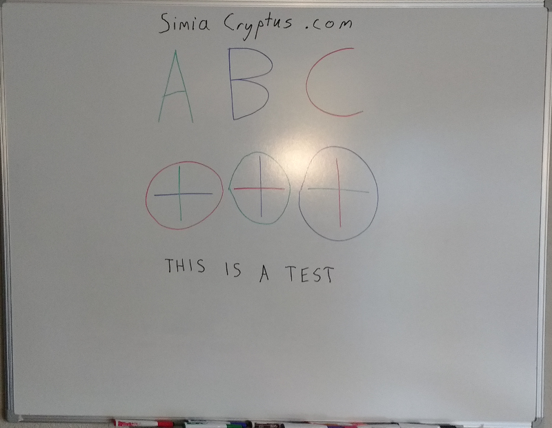

First, we load an photo of a whiteboard

Code from [WhiteboardWorkflow.scala:69](../../src/test/scala/WhiteboardWorkflow.scala#L69) executed in 0.95 seconds: 
```java
    ImageIO.read(getClass.getClassLoader.getResourceAsStream("Whiteboard1.jpg"))
```

Returns: 


## Region Selection
We start looking for long edges which can be used to find the board:

Code from [WhiteboardWorkflow.scala:471](../../src/test/scala/WhiteboardWorkflow.scala#L471) executed in 0.14 seconds: 
```java
    val localMaxRadius = 10
    val minCounts = 5
    val minDistanceFromOrigin = 1
    val edgeThreshold: Float = 100
    val maxLines: Int = 20
    FactoryDetectLineAlgs.houghFoot(new ConfigHoughFoot(localMaxRadius, minCounts, minDistanceFromOrigin, edgeThreshold, maxLines), classOf[GrayU8], classOf[GrayS16])
```

Returns: 
```
    boofcv.abst.feature.detect.line.DetectLineHoughFoot@2b5825fa
```


Code from [WhiteboardWorkflow.scala:470](../../src/test/scala/WhiteboardWorkflow.scala#L470) executed in 0.93 seconds: 
```java
    val rulerDetector: DetectLine[GrayU8] = log.code(() ⇒ {
      val localMaxRadius = 10
      val minCounts = 5
      val minDistanceFromOrigin = 1
      val edgeThreshold: Float = 100
      val maxLines: Int = 20
      FactoryDetectLineAlgs.houghFoot(new ConfigHoughFoot(localMaxRadius, minCounts, minDistanceFromOrigin, edgeThreshold, maxLines), classOf[GrayU8], classOf[GrayS16])
    })
    rulerDetector.detect(ConvertBufferedImage.convertFromSingle(sourceImage, null, classOf[GrayU8]))
```

Returns: 
```
    [LineParametric2D_F32 P( 2094.0 1170.0 ) Slope( 0.0 14.0 ), LineParametric2D_F32 P( 3057.0 1170.0 ) Slope( 0.0 977.0 ), LineParametric2D_F32 P( 2005.0 1174.0 ) Slope( -4.0 -75.0 ), LineParametric2D_F32 P( 885.0 1170.0 ) Slope( 0.0 -1195.0 ), LineParametric2D_F32 P( 898.0 1170.0 ) Slope( 0.0 -1182.0 ), LineParametric2D_F32 P( 2080.0 1082.0 ) Slope( 88.0 0.0 ), LineParametric2D_F32 P( 2046.0 1180.0 ) Slope( -10.0 -34.0 ), LineParametric2D_F32 P( 3031.0 1170.0 ) Slope( 0.0 951.0 ), LineParametric2D_F32 P( 3075.0 1170.0 ) Slope( 0.0 995.0 ), LineParametric2D_F32 P( 1940.0 1208.0 ) Slope( -38.0 -140.0 ), LineParametric2D_F32 P( 2195.0 1165.0 ) Slope( 5.0 115.0 ), LineParametric2D_F32 P( 2153.0 284.0 ) Slope( 886.0 73.0 ), LineParametric2D_F32 P( 2249.0 2031.0 ) Slope( -861.0 169.0 ), LineParametric2D_F32 P( 2061.0 1193.0 ) Slope( -23.0 -19.0 ), LineParametric2D_F32 P( 2155.0 255.0 ) Slope( 915.0 75.0 ), LineParametric2D_F32 P( 858.0 1170.0 ) Slope( 0.0 -1222.0 ), LineParametric2D_F32 P( 1927.0 1076.0 ) Slope( 94.0 -153.0 ), LineParametric2D_F32 P( 1752.0 1170.0 ) Slope( 0.0 -328.0 ), LineParametric2D_F32 P( 1783.0 873.0 ) Slope( 297.0 -297.0 ), LineParametric2D_F32 P( 2391.0 1161.0 ) Slope( 9.0 311.0 )]
```


Code from [WhiteboardWorkflow.scala:481](../../src/test/scala/WhiteboardWorkflow.scala#L481) executed in 0.06 seconds: 
```java
    gfx.drawImage(sourceImage, 0, 0, null)
    gfx.setStroke(new BasicStroke(3))
    found.asScala.foreach(line ⇒ {
      if (Math.abs(line.slope.x) > Math.abs(line.slope.y)) {
        val x1 = 0
        val y1 = (line.p.y - line.p.x * line.slope.y / line.slope.x).toInt
        val x2 = sourceImage.getWidth
        val y2 = y1 + (x2 * line.slope.y / line.slope.x).toInt
        gfx.setColor(Color.RED)
        gfx.drawLine(
          x1, y1,
          x2, y2)
      } else {
        val y1 = 0
        val x1 = (line.p.x - line.p.y * line.slope.x / line.slope.y).toInt
        val y2 = sourceImage.getHeight
        val x2 = x1 + (y2 * line.slope.x / line.slope.y).toInt
        gfx.setColor(Color.GREEN)
        gfx.drawLine(
          x1, y1,
          x2, y2)
      }
    })
```

Returns: 


This can then be searched for the largest, most upright, and rectangular shape

Code from [WhiteboardWorkflow.scala:508](../../src/test/scala/WhiteboardWorkflow.scala#L508) executed in 0.11 seconds: 
```java
    val horizontals = found.asScala.filter(line ⇒ Math.abs(line.slope.x) > Math.abs(line.slope.y)).toList
    val verticals = found.asScala.filter(line ⇒ Math.abs(line.slope.x) <= Math.abs(line.slope.y)).toList
    val imageBounds = new Rectangle2D_F32(0, 0, sourceImage.getWidth, sourceImage.getHeight)
    val candidateQuadrangles: List[Quadrilateral_F32] = cross(pairs(horizontals), pairs(verticals)).map(xa ⇒ {
      val ((left: LineParametric2D_F32, right: LineParametric2D_F32), (top: LineParametric2D_F32, bottom: LineParametric2D_F32)) = xa
      new Quadrilateral_F32(
        Intersection2D_F32.intersection(left, top, null),
        Intersection2D_F32.intersection(left, bottom, null),
        Intersection2D_F32.intersection(right, top, null),
        Intersection2D_F32.intersection(right, bottom, null))
    }).filter((quad: Quadrilateral_F32) ⇒
      Intersection2D_F32.contains(imageBounds, quad.a.x, quad.a.y) &&
        Intersection2D_F32.contains(imageBounds, quad.b.x, quad.b.y) &&
        Intersection2D_F32.contains(imageBounds, quad.c.x, quad.c.y) &&
        Intersection2D_F32.contains(imageBounds, quad.d.x, quad.d.y)
    )
    scale(rotate(
      candidateQuadrangles.maxBy(quad ⇒ {
        val bounds = new Rectangle2D_F32()
        UtilPolygons2D_F32.bounding(quad, bounds)
        val area = quad.area()
        val squareness = area / bounds.area()
        assert(squareness >= 0 && squareness <= 1.01)
        area * Math.pow(squareness, 2)
      })
    ), 1.0f)
```

Returns: 
```
    Quadrilateral_F32{ a(858.0 148.68854) b(3075.0 330.40985) c(858.0 2304.0303) d(3075.0 1868.8699) }
```


Code from [WhiteboardWorkflow.scala:536](../../src/test/scala/WhiteboardWorkflow.scala#L536) executed in 0.07 seconds: 
```java
    gfx.drawImage(sourceImage, 0, 0, null)
    gfx.setStroke(new BasicStroke(3))
    gfx.setColor(Color.RED)
    draw(gfx, bestQuadrangle)
```

Returns: 


We then distort the image using a homographic transform back into a rectangle. First we estimate the correct size of the image:

Code from [WhiteboardWorkflow.scala:544](../../src/test/scala/WhiteboardWorkflow.scala#L544) executed in 0.00 seconds: 
```java
    (
      (bestQuadrangle.getSideLength(0) + bestQuadrangle.getSideLength(2)).toInt / 2,
      (bestQuadrangle.getSideLength(1) + bestQuadrangle.getSideLength(3)).toInt / 2
    )
```

Returns: 
```
    (2241,2887)
```


We derive the transform:

Code from [WhiteboardWorkflow.scala:552](../../src/test/scala/WhiteboardWorkflow.scala#L552) executed in 0.09 seconds: 
```java
    val transformModel: ModelMatcher[Homography2D_F64, AssociatedPair] = {
      val maxIterations = 100
      val inlierThreshold = 7
      val normalize = true
      FactoryMultiViewRobust.homographyRansac(new ConfigHomography(normalize), new ConfigRansac(maxIterations, inlierThreshold))
    }
    val pairs: util.ArrayList[AssociatedPair] = new util.ArrayList(List(
      new AssociatedPair(0, 0, bestQuadrangle.a.x, bestQuadrangle.a.y),
      new AssociatedPair(0, areaHeight, bestQuadrangle.c.x, bestQuadrangle.c.y),
      new AssociatedPair(areaWidth, 0, bestQuadrangle.b.x, bestQuadrangle.b.y),
      new AssociatedPair(areaWidth, areaHeight, bestQuadrangle.d.x, bestQuadrangle.d.y)
    ).asJava)
    if (!transformModel.process(pairs)) throw new RuntimeException("Model Matcher failed!")
    transformModel.getModelParameters
```

Returns: 
```
    Homography2D_F64[ 1.25e+00 3.91e-16 9.01e+02 ; 1.14e-01 1.01e+00 1.46e-04 ; 1.46e-04 1.08e-19 1.05e+00 ]
```


And we transform the image:

Code from [WhiteboardWorkflow.scala:570](../../src/test/scala/WhiteboardWorkflow.scala#L570) executed in 1.38 seconds: 
```java
    val distortion: ImageDistort[Planar[GrayF32], Planar[GrayF32]] = {
      val interpolation = FactoryInterpolation.bilinearPixelS(classOf[GrayF32], BorderType.ZERO)
      val model = new PixelTransformHomography_F32
      val distort = DistortSupport.createDistortPL(classOf[GrayF32], model, interpolation, false)
      model.set(transform)
      distort.setRenderAll(false)
      distort
    }
    val boofImage = ConvertBufferedImage.convertFromMulti(sourceImage, null, true, classOf[GrayF32])
    val work: Planar[GrayF32] = boofImage.createNew(areaWidth.toInt, areaHeight.toInt)
    distortion.apply(boofImage, work)
    val output = new BufferedImage(areaWidth.toInt, areaHeight.toInt, sourceImage.getType)
    ConvertBufferedImage.convertTo(work, output, true)
    output
```

Returns: 



Now we refine our selection using some region selection, perhaps by manual selection

Code from [WhiteboardWorkflow.scala:77](../../src/test/scala/WhiteboardWorkflow.scala#L77) executed in 0.00 seconds: 
```java
    new Rectangle2D_F32(100, 40, 2700, 2100)
```

Returns: 
```
    Rectangle2D_F32{ p0(100.0 40.0) p1(2700.0 2100.0) }
```


Code from [WhiteboardWorkflow.scala:80](../../src/test/scala/WhiteboardWorkflow.scala#L80) executed in 0.04 seconds: 
```java
    gfx.drawImage(primaryImage, 0, 0, null)
    gfx.setStroke(new BasicStroke(3))
    gfx.setColor(Color.RED)
    gfx.drawRect(tileBounds.p0.x.toInt, tileBounds.p0.y.toInt, tileBounds.getWidth.toInt, tileBounds.getHeight.toInt)
```

Returns: 


Code from [WhiteboardWorkflow.scala:86](../../src/test/scala/WhiteboardWorkflow.scala#L86) executed in 0.00 seconds: 
```java
    primaryImage.getSubimage(tileBounds.p0.x.toInt, tileBounds.p0.y.toInt, tileBounds.getWidth.toInt, tileBounds.getHeight.toInt)
```

Returns: 


## Color Normalization
### Method 1 - Thresholding
Our default method uses binarization and morphological operations:

Dectection of markings uses the luminosity

Code from [WhiteboardWorkflow.scala:413](../../src/test/scala/WhiteboardWorkflow.scala#L413) executed in 1.26 seconds: 
```java
    val bandImg: GrayF32 = hsv.getBand(2)
    val to = ConvertBufferedImage.convertTo(bandImg, null)
    VisualizeImageData.standard(bandImg, to)
```

Returns: 


...by detecting local variations within a gaussian radius

Code from [WhiteboardWorkflow.scala:419](../../src/test/scala/WhiteboardWorkflow.scala#L419) executed in 1.24 seconds: 
```java
    val single = ConvertBufferedImage.convertFromSingle(colorBand, null, classOf[GrayF32])
    val binary = new GrayU8(single.width, single.height)
    val radius = 75
    val scale = 1.0
    //GThresholdImageOps.localGaussian(single, binary, radius, scale, true, null, null)
    GThresholdImageOps.localSauvola(single, binary, radius, 0.1f, true)
```

Returns: 
```
    boofcv.struct.image.GrayU8@669513d8
```


Code from [WhiteboardWorkflow.scala:427](../../src/test/scala/WhiteboardWorkflow.scala#L427) executed in 0.03 seconds: 
```java
    VisualizeBinaryData.renderBinary(localGaussian, false, null)
```

Returns: 


This binarization is then refined by eroding and thinning operations

Code from [WhiteboardWorkflow.scala:431](../../src/test/scala/WhiteboardWorkflow.scala#L431) executed in 0.50 seconds: 
```java
    var binary = localGaussian
    binary = BinaryImageOps.erode8(binary, 1, null)
    binary = BinaryImageOps.thin(binary, 5, null)
    binary = BinaryImageOps.dilate8(binary, 1, null)
    VisualizeBinaryData.renderBinary(binary, false, null)
```

Returns: 


We can now identify segments which may be markings:

Code from [WhiteboardWorkflow.scala:439](../../src/test/scala/WhiteboardWorkflow.scala#L439) executed in 29.96 seconds: 
```java
    val input = ConvertBufferedImage.convertFrom(thresholdImg, null: GrayF32)
    val imageType = ImageType.single(classOf[GrayF32])
    val alg = FactoryImageSegmentation.fh04(new ConfigFh04(100, 30), imageType)
    val segmentation = new GrayS32(thresholdImg.getWidth, thresholdImg.getHeight)
    alg.segment(input, segmentation)
    (alg.getTotalSuperpixels, segmentation)
```

Returns: 
```
    (87,boofcv.struct.image.GrayS32@770d0ea6)
```


Code from [WhiteboardWorkflow.scala:447](../../src/test/scala/WhiteboardWorkflow.scala#L447) executed in 0.04 seconds: 
```java
    VisualizeRegions.regions(segmentation, superpixels, null)
```

Returns: 


For each segment, we categorize and colorize each using some logic

Code from [WhiteboardWorkflow.scala:156](../../src/test/scala/WhiteboardWorkflow.scala#L156) executed in 22.54 seconds: 
```java
    val regions = (0 until segmentation.getWidth).flatMap(x ⇒ (0 until segmentation.getHeight).map(y ⇒ {
      segmentation.get(x, y) → ((x, y) → rgb.bands.map(_.get(x, y)))
    })).groupBy(x ⇒ x._1).mapValues(_.map(t ⇒ t._2))
    regions.mapValues(pixels ⇒ {
      val rgvValues = pixels.map(_._2)
      val hsvValues = rgvValues.map(rgb ⇒ {
        val hsv = new Array[Float](3)
        ColorHsv.rgbToHsv(rgb(0), rgb(1), rgb(2), hsv)
        hsv
      })
```

Returns: 
```
    Map(69 -> [D@3deb2326, 0 -> [D@62d363ab, 5 -> [D@7889a1ac, 10 -> [D@3aee3976, 56 -> [D@5ef8df1e, 42 -> [D@27cf3151, 24 -> [D@127e70c5, 37 -> [D@5910de75, 25 -> [D@4108fa66, 52 -> [D@1f130eaf, 14 -> [D@7e0aadd0, 20 -> [D@21362712, 46 -> [D@27eb3298, 57 -> [D@200a26bc, 78 -> [D@bc57b40, 29 -> [D@1b5bc39d, 84 -> [D@655a5d9c, 61 -> [D@1494b84d, 1 -> [D@34abdee4, 74 -> [D@71a9b4c7, 6 -> [D@4628b1d3, 60 -> [D@77cf3f8b, 85 -> [D@1df98368, 28 -> [D@21ca139c, 38 -> [D@226f885f, 70 -> [D@2cd2c8fe, 21 -> [D@7d61eccf, 33 -> [D@cc6460c, 65 -> [D@52350abb, 9 -> [D@681aad3b, 53 -> [D@1a6f2363, 77 -> [D@2427e004, 13 -> [D@5ebd56e9, 41 -> [D@63f34b70, 73 -> [D@641856, 2 -> [D@1b58ff9e, 32 -> [D@2f66e802, 34 -> [D@56b78e55, 45 -> [D@76318a7d, 64 -> [D@2a492f2a, 17 -> [D@3277e499, 22 -> [D@585811a4, 44 -> [D@22c01ab0, 59 -> [D@411341bd, 27 -> [D@4c4d362a, 71 -> [D@5400db36, 12 -> [D@76b74e9c, 54 -> [D@2d72f75e, 49 -> [D@8ab78bc, 86 -> [D@5aa0dbf4, 81 -> [D@16afbd92, 76 -> [D@2c5d601e, 7 -> [D@7fe083b1, 39 -> [D@23c388c2, 66 -> [D@486be205, 3 -> [D@f713686, 80 -> [D@74f7d1d2, 35 -> [D@4b4dd216, 48 -> [D@5ca17ab0, 63 -> [D@5a62b2a4, 18 -> [D@1051817b, 50 -> [D@35293c05, 67 -> [D@620aa4ea, 16 -> [D@2db2dd9d, 31 -> [D@3174cb09, 11 -> [D@4d411036, 72 -> [D@7adbd080, 43 -> [D@41beb473, 40 -> [D@560513ce, 26 -> [D@13006998, 55 -> [D@37fbe4a8, 23 -> [D@352c308, 8 -> [D@7d373bcf, 75 -> [D@6d6bc158, 58 -> [D@5dda6f9, 82 -> [D@10027fc9, 36 -> [D@54afd745, 30 -> [D@677dbd89, 51 -> [D@fff25f1, 19 -> [D@c00fff0, 4 -> [D@263f04ca, 79 -> [D@2ca47471, 47 -> [D@5a021cb9, 15 -> [D@51768776, 68 -> [D@f31c0c6, 62 -> [D@b93aad, 83 -> [D@4a9419d7)
```


To interpret these clusters and the various measures, we train a density tree:

Code from [WhiteboardWorkflow.scala:395](../../src/test/scala/WhiteboardWorkflow.scala#L395) executed in 0.15 seconds: 
```java
    val tree = new DensityTree("hueMean", "hueStdDev", "lumMean", "lumStdDev", "chromaMean", "width", "length")
    tree.setSplitSizeThreshold(50)
    tree.setMinFitness(5)
    tree.setMaxDepth(5)
    new tree.Node((0 until superpixels).map(superpixelParameters(_)).toArray)
```

Returns: 
```
    // Count: 87 Volume: 8.044006839791568E12 Region: [hueMean: 0.11601719260215759 - 6.222848415374756; hueStdDev: 1.726334885461256E-4 - 0.9703593254089355; lumMean: 39.17523193359375 - 225.29617309570312; lumStdDev: 0.49410587549209595 - 35.15899658203125; chromaMean: 0.9574448466300964 - 42.15271759033203; width: 3.0 - 1973.0; length: 6.0 - 2599.0]
if(hueStdDev < 0.03949951007962227) { // Fitness 14.738594347638877
  // Count: 43 Volume: 5239250.363987026 Region: [hueMean: 0.4369143843650818 - 1.0471972227096558; hueStdDev: 1.726334885461256E-4 - 0.03897695615887642; lumMean: 39.17523193359375 - 225.29617309570312; lumStdDev: 0.49410587549209595 - 35.15899658203125; chromaMean: 2.000000238418579 - 42.15271759033203; width: 3.0 - 17.0; length: 6.0 - 67.0]
} else {
  // Count: 44 Volume: 3.5457312980293154E12 Region: [hueMean: 0.11601719260215759 - 6.222848415374756; hueStdDev: 0.03949951007962227 - 0.9703593254089355; lumMean: 39.65763473510742 - 187.8336944580078; lumStdDev: 1.60626220703125 - 32.490142822265625; chromaMean: 0.9574448466300964 - 27.639972686767578; width: 3.0 - 1973.0; length: 6.0 - 2599.0]
}
```


Code from [WhiteboardWorkflow.scala:218](../../src/test/scala/WhiteboardWorkflow.scala#L218) executed in 0.65 seconds: 
```java
    val segmentColors: ColorQueue_F32 = new ColorQueue_F32(3)
    segmentColors.resize(superpixels)
    (0 until superpixels).foreach(i ⇒ {
      segmentColors.getData()(i) = {
        val p = superpixelParameters(i)
        val (hueMean: Float, hueStdDev: Float, lumMean: Float, lumStdDev: Float, chromaMean: Float, width: Int, length: Int) = (p(0).floatValue(), p(1).floatValue(), p(2).floatValue(), p(3).floatValue(), p(4).floatValue(), p(5).intValue(), p(6).intValue())
        val aspect = length.toDouble / width
```

Returns: 


### Method 2 - Color Segmentation
Here is an alternate method using direct-color segmentation:

We can identify segments which may be markings using the full color image:

Code from [WhiteboardWorkflow.scala:455](../../src/test/scala/WhiteboardWorkflow.scala#L455) executed in 26.69 seconds: 
```java
    val imageType = ImageType.pl(3, classOf[GrayF32])
    val alg = FactoryImageSegmentation.fh04(new ConfigFh04(100, 30), imageType)
    val segmentation = new GrayS32(rgb.getWidth, rgb.getHeight)
    alg.segment(rgb, segmentation)
    (alg.getTotalSuperpixels, segmentation)
```

Returns: 
```
    (22241,boofcv.struct.image.GrayS32@2a2bb0eb)
```


Code from [WhiteboardWorkflow.scala:462](../../src/test/scala/WhiteboardWorkflow.scala#L462) executed in 0.02 seconds: 
```java
    VisualizeRegions.regions(segmentation, superpixels, null)
```

Returns: 


For each segment, we categorize and colorize each using some logic

Code from [WhiteboardWorkflow.scala:156](../../src/test/scala/WhiteboardWorkflow.scala#L156) executed in 14.98 seconds: 
```java
    val regions = (0 until segmentation.getWidth).flatMap(x ⇒ (0 until segmentation.getHeight).map(y ⇒ {
      segmentation.get(x, y) → ((x, y) → rgb.bands.map(_.get(x, y)))
    })).groupBy(x ⇒ x._1).mapValues(_.map(t ⇒ t._2))
    regions.mapValues(pixels ⇒ {
      val rgvValues = pixels.map(_._2)
      val hsvValues = rgvValues.map(rgb ⇒ {
        val hsv = new Array[Float](3)
        ColorHsv.rgbToHsv(rgb(0), rgb(1), rgb(2), hsv)
        hsv
      })
```

Returns: 
```
    Map(14221 -> [D@6ebd78d1, 2163 -> [D@436390f4, 8607 -> [D@4d157787, 645 -> [D@68ed96ca, 13950 -> [D@6d1310f6, 20873 -> [D@3228d990, 16466 -> [D@54e7391d, 19887 -> [D@50b8ae8d, 18180 -> [D@255990cc, 16383 -> [D@51c929ae, 892 -> [D@3c8bdd5b, 69 -> [D@29d2d081, 10822 -> [D@40e4ea87, 16216 -> [D@58783f6c, 15874 -> [D@3a7b503d, 5385 -> [D@512d92b, 5810 -> [D@62c5bbdc, 7375 -> [D@7bdf6bb7, 5659 -> [D@1bc53649, 19204 -> [D@88d6f9b, 20194 -> [D@47d93e0d, 14977 -> [D@475b7792, 9929 -> [D@751e664e, 11866 -> [D@160c3ec1, 12928 -> [D@182b435b, 21605 -> [D@4d0402b, 17671 -> [D@2fa7ae9, 2199 -> [D@7577b641, 8062 -> [D@3704122f, 3021 -> [D@3153ddfc, 13650 -> [D@60afd40d, 8536 -> [D@28a2a3e7, 5437 -> [D@3f2049b6, 20200 -> [D@10b3df93, 1322 -> [D@ea27e34, 1665 -> [D@33a2499c, 15767 -> [D@e72dba7, 21624 -> [D@33c2bd, 5509 -> [D@1dfd5f51, 5686 -> [D@3c321bdb, 1036 -> [D@24855019, 9982 -> [D@3abd581e, 2822 -> [D@4d4d8fcf, 7304 -> [D@610db97e, 16794 -> [D@6f0628de, 14852 -> [D@3fabf088, 19370 -> [D@1e392345, 10007 -> [D@12f3afb5, 9131 -> [D@4ced35ed, 2630 -> [D@2c22a348, 21729 -> [D@7bd69e82, 13052 -> [D@74d7184a, 15806 -> [D@51b01960, 6085 -> [D@6831d8fd, 13266 -> [D@27dc79f7, 3873 -> [D@6b85300e, 10917 -> [D@3aaf4f07, 4188 -> [D@5cbf9e9f, 15643 -> [D@18e8473e, 20256 -> [D@5a2f016d, 1586 -> [D@1a38ba58, 8618 -> [D@3ad394e6, 16054 -> [D@6058e535, 1501 -> [D@42deb43a, 19597 -> [D@1deb2c43, 18768 -> [D@3bb9efbc, 4201 -> [D@1cefc4b3, 2452 -> [D@2b27cc70, 21321 -> [D@6f6a7463, 19904 -> [D@1bdaa23d, 8960 -> [D@79f227a9, 15170 -> [D@6ca320ab, 9405 -> [D@50d68830, 809 -> [D@1e53135d, 7373 -> [D@7674a051, 16261 -> [D@3a7704c, 18279 -> [D@6754ef00, 16340 -> [D@619bd14c, 15467 -> [D@323e8306, 8930 -> [D@a23a01d, 17959 -> [D@4acf72b6, 4560 -> [D@7561db12, 17507 -> [D@3301500b, 7766 -> [D@24b52d3e, 17759 -> [D@15deb1dc, 13024 -> [D@6e9c413e, 4447 -> [D@57a4d5ee, 20503 -> [D@5af5def9, 3962 -> [D@3a45c42a, 1879 -> [D@36dce7ed, 17505 -> [D@47a64f7d, 5422 -> [D@33d05366, 11472 -> [D@27a0a5a2, 1337 -> [D@7692cd34, 14885 -> [D@33aa93c, 10609 -> [D@32c0915e, 13321 -> [D@106faf11, 1718 -> [D@70f43b45, 17639 -> [D@26d10f2e, 14038 -> [D@10ad20cb, 16662 -> [D@7dd712e8, 2094 -> [D@2c282004, 6836 -> [D@22ee2d0, 5469 -> [D@7bfc3126, 13373 -> [D@3e792ce3, 9208 -> [D@53bc1328, 19254 -> [D@26f143ed, 3944 -> [D@3c1e3314, 1411 -> [D@4b770e40, 14782 -> [D@78e16155, 7427 -> [D@54a3ab8f, 21331 -> [D@1968a49c, 10647 -> [D@6a1ebcff, 15628 -> [D@19868320, 5365 -> [D@50b0bc4c, 6387 -> [D@c20be82, 629 -> [D@13c612bd, 19672 -> [D@3ef41c66, 13955 -> [D@6b739528, 20690 -> [D@622ef26a, 8186 -> [D@41de5768, 3883 -> [D@5f577419, 18874 -> [D@28fa700e, 17803 -> [D@3d526ad9, 18575 -> [D@e041f0c, 5116 -> [D@6a175569, 10410 -> [D@11963225, 6405 -> [D@3f3c966c, 19364 -> [D@11ee02f8, 13616 -> [D@4102b1b1, 16137 -> [D@61a5b4ae, 9458 -> [D@3a71c100, 5561 -> [D@5b69fd74, 18360 -> [D@f325091, 6979 -> [D@437e951d, 19540 -> [D@77b325b3, 20007 -> [D@63a5e46c, 16598 -> [D@7e8e8651, 2612 -> [D@49ef32e0, 14343 -> [D@271f18d3, 18008 -> [D@6bd51ed8, 17043 -> [D@61e3a1fd, 4094 -> [D@51abf713, 6167 -> [D@eadb475, 1024 -> [D@4d4d48a6, 5918 -> [D@315df4bb, 13142 -> [D@3fc08eec, 1469 -> [D@5cad8b7d, 13162 -> [D@7b02e036, 7272 -> [D@25243bc1, 13199 -> [D@1e287667, 8398 -> [D@2e6ee0bc, 20273 -> [D@4201a617, 17537 -> [D@467f77a5, 12055 -> [D@1bb9aa43, 21175 -> [D@420bc288, 20432 -> [D@df5f5c0, 365 -> [D@308a6984, 5088 -> [D@66b72664, 9273 -> [D@7a34b7b8, 10166 -> [D@58cd06cb, 2744 -> [D@3be8821f, 1369 -> [D@64b31700, 12597 -> [D@3b65e559, 4835 -> [D@bae47a0, 21040 -> [D@74a9c4b0, 138 -> [D@85ec632, 12710 -> [D@1c05a54d, 6669 -> [D@65ef722a, 22153 -> [D@5fd9b663, 12607 -> [D@214894fc, 6355 -> [D@10567255, 17539 -> [D@e362c57, 12057 -> [D@1c4ee95c, 2889 -> [D@79c4715d, 12490 -> [D@5aa360ea, 13859 -> [D@6548bb7d, 1823 -> [D@e27ba81, 1190 -> [D@54336c81, 10259 -> [D@1556f2dd, 10373 -> [D@35e52059, 11445 -> [D@62577d6, 1168 -> [D@49bd54f7, 2295 -> [D@6b5f8707, 2306 -> [D@772485dd, 7890 -> [D@5a12c728, 4571 -> [D@79ab3a71, 3053 -> [D@6e5bfdfc, 4101 -> [D@3d829787, 16928 -> [D@71652c98, 4450 -> [D@51bde877, 13740 -> [D@60b85ba1, 22210 -> [D@492fc69e, 9786 -> [D@117632cf, 17358 -> [D@2fb68ec6, 15278 -> [D@d71adc2, 3345 -> [D@3add81c4, 9653 -> [D@1a1d3c1a, 14367 -> [D@1c65121, 760 -> [D@159e366, 4005 -> [D@57dc9128, 5857 -> [D@24528a25, 4464 -> [D@17ae98d7, 16013 -> [D@59221b97, 19326 -> [D@6ac4944a, 9886 -> [D@5a772895, 15564 -> [D@39fc6b2c, 10785 -> [D@704b2127, 2341 -> [D@3ee39da0, 10638 -> [D@5d332969, 17771 -> [D@7cc9ce8, 101 -> [D@2e27d72f, 2336 -> [D@c0b41d6, 9077 -> [D@4837595f, 3008 -> [D@2bffa76d, 2109 -> [D@3b718392, 4824 -> [D@6d2260db, 12564 -> [D@1f2d2181, 5593 -> [D@49bf29c6, 19772 -> [D@7ee55e70, 17950 -> [D@3fcdcf, 17072 -> [D@7668d560, 2131 -> [D@46292372, 1454 -> [D@126be319, 19726 -> [D@6c44052e, 7854 -> [D@5c371e13, 13690 -> [D@530a8454, 4909 -> [D@1e34c607, 2031 -> [D@5215cd9a, 5136 -> [D@36b6964d, 8154 -> [D@31198ceb, 17986 -> [D@9257031, 12721 -> [D@75201592, 15720 -> [D@7726e185, 10177 -> [D@aa5455e, 21710 -> [D@282308c3, 7973 -> [D@5dda14d0, 17875 -> [D@1db0ec27, 6530 -> [D@3d9fc57a, 11211 -> [D@d4ab71a, 17094 -> [D@3b4ef7, 7569 -> [D@1af05b03, 5896 -> [D@5987e932, 1633 -> [D@1ad777f, 6231 -> [D@5bbbdd4b, 2778 -> [D@438bad7c, 13402 -> [D@25230246, 15009 -> [D@4fdf8f12, 8288 -> [D@4a8b5227, 15418 -> [D@54f5f647, 13854 -> [D@6979efad, 7691 -> [D@5a6d5a8f, 11192 -> [D@4a67318f, 16676 -> [D@315ba14a, 2072 -> [D@17f9344b, 5260 -> [D@27f0ad19, 14606 -> [D@54e81b21, 4262 -> [D@38d5b107, 21995 -> [D@6650813a, 11372 -> [D@44ea608c, 18107 -> [D@50cf5a23, 14801 -> [D@450794b4, 5329 -> [D@273c947f, 8663 -> [D@30457e14, 8097 -> [D@1af1347d, 9648 -> [D@632aa1a3, 6976 -> [D@20765ed5, 3661 -> [D@3b582111, 16962 -> [D@2899a8db, 11895 -> [D@1e8823d2, 7445 -> [D@c1a4620, 20014 -> [D@76b0ae1b, 21993 -> [D@130a0f66, 17684 -> [D@4c432866, 11186 -> [D@12365c88, 19347 -> [D@6105f8a3, 4062 -> [D@2237bada, 1767 -> [D@77e2a6e2, 3399 -> [D@5710768a, 1995 -> [D@199e4c2b, 18504 -> [D@6e0d4a8, 21164 -> [D@64d7b720, 20850 -> [D@30272916, 10452 -> [D@5bb3d42d, 2263 -> [D@5bf61e67, 12366 -> [D@2c1dc8e, 6544 -> [D@b273a59, 14922 -> [D@4e7095ac, 12116 -> [D@251ebf23, 19481 -> [D@29b732a2, 3930 -> [D@1b70203f, 16243 -> [D@51671b08, 4169 -> [D@15051a0, 479 -> [D@1162410a, 22108 -> [D@b09fac1, 4899 -> [D@62df0ff3, 3798 -> [D@61019f59, 12526 -> [D@62e8f862, 1559 -> [D@26f3d90c, 6712 -> [D@3c49fab6, 16501 -> [D@515f4131, 1105 -> [D@74518890, 15596 -> [D@4c5204af, 10577 -> [D@3f3ddbd9, 19101 -> [D@14c053c6, 16576 -> [D@6c2d4cc6, 10267 -> [D@30865a90, 13643 -> [D@6134ac4a, 12570 -> [D@777c9dc9, 21908 -> [D@71b1a49c, 15752 -> [D@73e132e0, 21439 -> [D@3773862a, 15440 -> [D@2472c7d8, 347 -> [D@589b028e, 3666 -> [D@22175d4f, 4729 -> [D@9fecdf1, 21025 -> [D@3b809711, 4022 -> [D@3b0f7d9d, 12975 -> [D@236ab296, 19062 -> [D@5c84624f, 21595 -> [D@63034ed1, 9516 -> [D@232024b9, 9180 -> [D@55a8dc49, 10399 -> [D@2a415aa9, 14574 -> [D@53cdecf6, 12189 -> [D@71ea1fda, 19464 -> [D@62b3df3a, 11504 -> [D@420745d7, 11922 -> [D@7e11ab3d, 16444 -> [D@5fa47fea, 1729 -> [D@2392212b, 15257 -> [D@5b43e173, 15303 -> [D@28f8e165, 14912 -> [D@545f80bf, 5950 -> [D@66f66866, 16604 -> [D@22fa55b2, 11517 -> [D@4d666b41, 6651 -> [D@6594402a, 14890 -> [D@30f4b1a6, 10520 -> [D@405325cf, 3434 -> [D@3e1162e7, 14404 -> [D@79c3f01f, 18610 -> [D@6c2f1700, 3167 -> [D@350b3a17, 17510 -> [D@38600b, 7922 -> [D@669d2b1b, 13783 -> [D@721eb7df, 18082 -> [D@1ea9f009, 10213 -> [D@5d52e3ef, 8114 -> [D@5298dead, 8514 -> [D@553f3b6e, 9754 -> [D@4c7a078, 19971 -> [D@4e406694, 21871 -> [D@5ab9b447, 2412 -> [D@76f10035, 8976 -> [D@4f8caaf3, 2876 -> [D@2b50150, 20300 -> [D@15b986cd, 21348 -> [D@6bb7cce7, 14463 -> [D@41c62850, 1237 -> [D@6b530eb9, 17307 -> [D@328572f0, 7673 -> [D@678040b3, 15472 -> [D@17f460bb, 20668 -> [D@64a1923a, 846 -> [D@7d2a6eac, 20993 -> [D@18ca3c62, 11235 -> [D@2c0f7678, 12109 -> [D@44d70181, 19640 -> [D@6aa648b9, 21050 -> [D@23c650a3, 9833 -> [D@742d4e15, 19594 -> [D@88a8218, 5320 -> [D@50b1f030, 6283 -> [D@4163f1cd, 4183 -> [D@5fa05212, 11313 -> [D@3e681bc, 909 -> [D@5c09d180, 2921 -> [D@23aae55, 9485 -> [D@5f574cc2, 13058 -> [D@680bddf5, 17226 -> [D@7a9c84a5, 4290 -> [D@2d83c5a5, 8... and 466976 more bytes
```


To interpret these clusters and the various measures, we train a density tree:

Code from [WhiteboardWorkflow.scala:395](../../src/test/scala/WhiteboardWorkflow.scala#L395) executed in 3.92 seconds: 
```java
    val tree = new DensityTree("hueMean", "hueStdDev", "lumMean", "lumStdDev", "chromaMean", "width", "length")
    tree.setSplitSizeThreshold(50)
    tree.setMinFitness(5)
    tree.setMaxDepth(5)
    new tree.Node((0 until superpixels).map(superpixelParameters(_)).toArray)
```

Returns: 
```
    // Count: 22241 Volume: 2.291550308046559E11 Region: [hueMean: 0.005908815190196037 - 6.28177547454834; hueStdDev: 0.0 - 1.5219855308532715; lumMean: 13.667362213134766 - 254.9503173828125; lumStdDev: 0.0 - 42.18177032470703; chromaMean: 0.0 - 53.36378860473633; width: 1.0 - 109.0; length: 5.0 - 414.0]
if(hueStdDev < 0.001600937102921307) { // Fitness 7.789725096000005
  // Count: 10563 Volume: 8087117.826602667 Region: [hueMean: 0.20919737219810486 - 5.760383129119873; hueStdDev: 0.0 - 0.00158221204765141; lumMean: 17.797605514526367 - 251.99856567382812; lumStdDev: 0.0 - 37.14754867553711; chromaMean: 0.37112659215927124 - 42.037986755371094; width: 1.0 - 21.0; length: 5.0 - 132.0]
  if(lumStdDev < 1.0933034420013428) { // Fitness 5.383144512936802
    // Count: 9154 Volume: 126632.20136804329 Region: [hueMean: 0.20919737219810486 - 5.760233402252197; hueStdDev: 0.0 - 0.00158221204765141; lumMean: 127.29027557373047 - 251.99856567382812; lumStdDev: 0.0 - 1.0924098491668701; chromaMean: 0.37112659215927124 - 42.037986755371094; width: 1.0 - 21.0; length: 5.0 - 132.0]
  } else {
    // Count: 1409 Volume: 3073734.8973999578 Region: [hueMean: 0.20955093204975128 - 5.760383129119873; hueStdDev: 0.0 - 0.00158221204765141; lumMean: 17.797605514526367 - 241.97145080566406; lumStdDev: 1.0933034420013428 - 37.14754867553711; chromaMean: 0.6350529789924622 - 39.99999237060547; width: 1.0 - 21.0; length: 5.0 - 60.0]
    if(lumStdDev < 1.9380040168762207) { // Fitness 6.675278802495521
      // Count: 1177 Volume: 12557.561097523872 Region: [hueMean: 0.20955093204975128 - 5.760383129119873; hueStdDev: 0.0 - 0.00158221204765141; lumMean: 128.29090881347656 - 241.97145080566406; lumStdDev: 1.0933034420013428 - 1.9253652095794678; chromaMean: 0.6350529789924622 - 39.99999237060547; width: 2.0 - 14.0; length: 6.0 - 38.0]
    } else {
      // Count: 232 Volume: 2526450.1424461943 Region: [hueMean: 0.4487987160682678 - 5.759588718414307; hueStdDev: 0.0 - 0.0014443554682657123; lumMean: 17.797605514526367 - 233.9615020751953; lumStdDev: 1.9380040168762207 - 37.14754867553711; chromaMean: 0.6592716574668884 - 39.99989700317383; width: 1.0 - 21.0; length: 5.0 - 60.0]
    }
  }
} else {
  // Count: 11678 Volume: 2.289139885715339E11 Region: [hueMean: 0.005908815190196037 - 6.28177547454834; hueStdDev: 0.001600937102921307 - 1.5219855308532715; lumMean: 13.667362213134766 - 254.9503173828125; lumStdDev: 0.0 - 42.18177032470703; chromaMean: 0.0 - 53.36378860473633; width: 1.0 - 109.0; length: 5.0 - 414.0]
  if(lumStdDev < 1.1039700508117676) { // Fitness 6.99069637489377
    // Count: 8032 Volume: 5.643835093851501E8 Region: [hueMean: 0.031154004856944084 - 6.275053977966309; hueStdDev: 0.001600937102921307 - 0.986794650554657; lumMean: 127.66875457763672 - 254.9503173828125; lumStdDev: 0.0 - 1.1030851602554321; chromaMean: 0.0 - 42.59041976928711; width: 1.0 - 68.0; length: 5.0 - 234.0]
    if(chromaMean < 5.570276737213135) { // Fitness 6.540291206430446
      // Count: 7044 Volume: 3.01557509299105E7 Region: [hueMean: 0.031154004856944084 - 6.275053977966309; hueStdDev: 0.001600937102921307 - 0.986794650554657; lumMean: 127.66875457763672 - 179.70086669921875; lumStdDev: 0.0 - 1.1030851602554321; chromaMean: 0.0 - 5.566751003265381; width: 1.0 - 68.0; length: 5.0 - 234.0]
    } else {
      // Count: 988 Volume: 2.7619842875140864E7 Region: [hueMean: 0.33465519547462463 - 6.220462322235107; hueStdDev: 0.0016914558364078403 - 0.33180785179138184; lumMean: 131.7617645263672 - 254.9503173828125; lumStdDev: 0.0 - 1.1021995544433594; chromaMean: 5.570276737213135 - 42.59041976928711; width: 2.0 - 30.0; length: 6.0 - 107.0]
      if(chromaMean < 10.550251960754395) { // Fitness 5.11342396012605
        // Count: 727 Volume: 1570327.5102161448 Region: [hueMean: 0.33465519547462463 - 6.220462322235107; hueStdDev: 0.001953125 - 0.33180785179138184; lumMean: 131.7617645263672 - 185.19876098632812; lumStdDev: 0.0 - 1.1021995544433594; chromaMean: 5.570276737213135 - 10.426289558410645; width: 2.0 - 30.0; length: 6.0 - 107.0]
      } else {
        // Count: 261 Volume: 121013.02300838406 Region: [hueMean: 0.38577279448509216 - 0.7589214444160461; hueStdDev: 0.0016914558364078403 - 0.08512353897094727; lumMean: 149.3510284423828 - 254.9503173828125; lumStdDev: 0.0 - 1.1004260778427124; chromaMean: 10.550251960754395 - 42.59041976928711; width: 2.0 - 20.0; length: 6.0 - 64.0]
      }
    }
  } else {
    // Count: 3646 Volume: 2.2104420487668265E11 Region: [hueMean: 0.005908815190196037 - 6.28177547454834; hueStdDev: 0.001664817100390792 - 1.5219855308532715; lumMean: 13.667362213134766 - 253.5133514404297; lumStdDev: 1.1039700508117676 - 42.18177032470703; chromaMean: 0.0 - 53.36378860473633; width: 1.0 - 109.0; length: 6.0 - 414.0]
    if(lumStdDev < 1.8146538734436035) { // Fitness 6.254053041680992
      // Count: 2200 Volume: 7.50859123483118E8 Region: [hueMean: 0.08032307028770447 - 6.249090671539307; hueStdDev: 0.001664817100390792 - 1.5219855308532715; lumMean: 128.7567901611328 - 253.5133514404297; lumStdDev: 1.1039700508117676 - 1.8108829259872437; chromaMean: 0.0 - 41.59501647949219; width: 1.0 - 76.0; length: 6.0 - 297.0]
      if(chromaMean < 6.181522846221924) { // Fitness 6.945440971363646
        // Count: 1810 Volume: 4.450761654256051E7 Region: [hueMean: 0.08032307028770447 - 6.249090671539307; hueStdDev: 0.001664817100390792 - 1.5219855308532715; lumMean: 128.7567901611328 - 179.34857177734375; lumStdDev: 1.1039700508117676 - 1.8108829259872437; chromaMean: 0.0 - 6.1621198654174805; width: 2.0 - 76.0; length: 6.0 - 297.0]
      } else {
        // Count: 390 Volume: 1.941745235771977E7 Region: [hueMean: 0.3864835500717163 - 6.141866683959961; hueStdDev: 0.0036600742023438215 - 0.22534272074699402; lumMean: 140.00320434570312 - 253.5133514404297; lumStdDev: 1.1039700508117676 - 1.8092643022537231; chromaMean: 6.181522846221924 - 41.59501647949219; width: 1.0 - 45.0; length: 6.0 - 128.0]
      }
    } else {
      // Count: 1446 Volume: 1.927809555799012E11 Region: [hueMean: 0.005908815190196037 - 6.28177547454834; hueStdDev: 0.0019301010761409998 - 1.3621389865875244; lumMean: 13.667362213134766 - 251.58493041992188; lumStdDev: 1.8146538734436035 - 42.18177032470703; chromaMean: 0.0 - 53.36378860473633; width: 1.0 - 109.0; length: 6.0 - 414.0]
      if(chromaMean < 10.261261940002441) { // Fitness 5.742727698841261
        // Count: 963 Volume: 2.601845209605777E10 Region: [hueMean: 0.012518970295786858 - 6.278128147125244; hueStdDev: 0.0019301010761409998 - 1.3621389865875244; lumMean: 13.667362213134766 - 182.10784912109375; lumStdDev: 1.8146538734436035 - 42.18177032470703; chromaMean: 0.0 - 10.189536094665527; width: 1.0 - 109.0; length: 6.0 - 414.0]
        if(lumStdDev < 5.01365327835083) { // Fitness 5.679702904137033
          // Count: 420 Volume: 1.812602923781781E9 Region: [hueMean: 0.012518970295786858 - 6.2616496086120605; hueStdDev: 0.0019301010761409998 - 1.2261497974395752; lumMean: 13.667362213134766 - 182.10784912109375; lumStdDev: 1.8146538734436035 - 4.966095924377441; chromaMean: 0.0 - 10.129405975341797; width: 1.0 - 109.0; length: 6.0 - 414.0]
          if(lumStdDev < 2.0808839797973633) { // Fitness 5.410776108475223
            // Count: 148 Volume: 2262291.2597895516 Region: [hueMean: 0.2491060197353363 - 6.152900695800781; hueStdDev: 0.001953125 - 0.7814410328865051; lumMean: 130.6246337890625 - 182.10784912109375; lumStdDev: 1.8146538734436035 - 2.078066349029541; chromaMean: 0.0 - 9.682110786437988; width: 1.0 - 27.0; length: 6.0 - 150.0]
          } else {
            // Count: 272 Volume: 1.6102658250239825E9 Region: [hueMean: 0.012518970295786858 - 6.2616496086120605; hueStdDev: 0.0019301010761409998 - 1.2261497974395752; lumMean: 13.667362213134766 - 177.51449584960938; lumStdDev: 2.0808839797973633 - 4.966095924377441; chromaMean: 2.384185791015625E-6 - 10.129405975341797; width: 1.0 - 109.0; length: 7.0 - 414.0]
            if(width < 8.0) { // Fitness 5.236161523480863
              // Count: 195 Volume: 2.2943308190836184E7 Region: [hueMean: 0.012518970295786858 - 6.2616496086120605; hueStdDev: 0.0049795112572610... and 1397 more bytes
```


Code from [WhiteboardWorkflow.scala:218](../../src/test/scala/WhiteboardWorkflow.scala#L218) executed in 0.49 seconds: 
```java
    val segmentColors: ColorQueue_F32 = new ColorQueue_F32(3)
    segmentColors.resize(superpixels)
    (0 until superpixels).foreach(i ⇒ {
      segmentColors.getData()(i) = {
        val p = superpixelParameters(i)
        val (hueMean: Float, hueStdDev: Float, lumMean: Float, lumStdDev: Float, chromaMean: Float, width: Int, length: Int) = (p(0).floatValue(), p(1).floatValue(), p(2).floatValue(), p(3).floatValue(), p(4).floatValue(), p(5).intValue(), p(6).intValue())
        val aspect = length.toDouble / width
```

Returns: 


