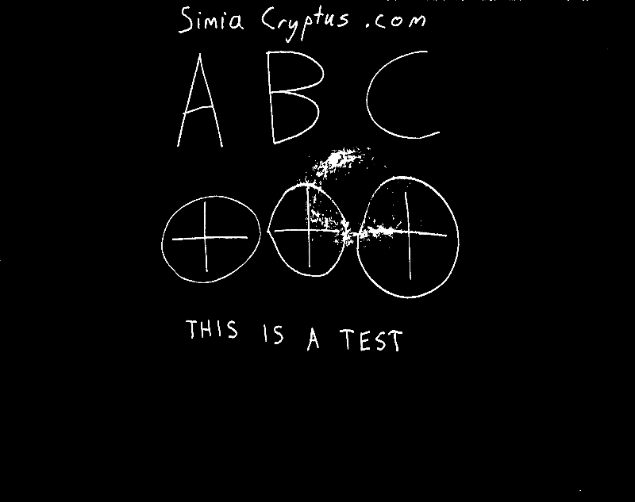
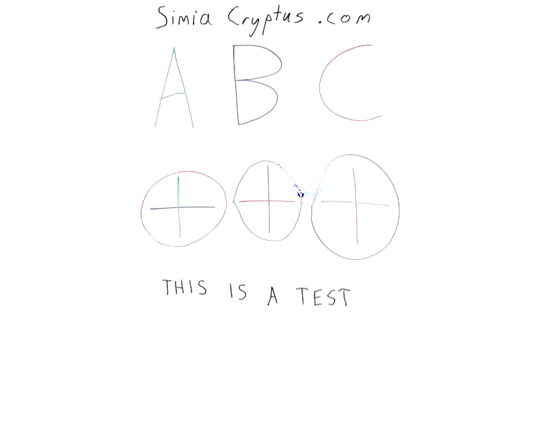

First, we load an photo of a whiteboard

Code from [WhiteboardWorkflow.scala:66](../../src/test/scala/WhiteboardWorkflow.scala#L66) executed in 0.91 seconds: 
```java
    ImageIO.read(getClass.getClassLoader.getResourceAsStream("Whiteboard1.jpg"))
```

Returns: 


## Region Selection
We start looking for long edges which can be used to find the board:

Code from [WhiteboardWorkflow.scala:397](../../src/test/scala/WhiteboardWorkflow.scala#L397) executed in 0.13 seconds: 
```java
    val localMaxRadius = 10
    val minCounts = 5
    val minDistanceFromOrigin = 1
    val edgeThreshold: Float = 100
    val maxLines: Int = 20
    FactoryDetectLineAlgs.houghFoot(new ConfigHoughFoot(localMaxRadius, minCounts, minDistanceFromOrigin, edgeThreshold, maxLines), classOf[GrayU8], classOf[GrayS16])
```

Returns: 
```
    boofcv.abst.feature.detect.line.DetectLineHoughFoot@20a8a64e
```


Code from [WhiteboardWorkflow.scala:396](../../src/test/scala/WhiteboardWorkflow.scala#L396) executed in 0.93 seconds: 
```java
    val rulerDetector: DetectLine[GrayU8] = log.code(() ⇒ {
      val localMaxRadius = 10
      val minCounts = 5
      val minDistanceFromOrigin = 1
      val edgeThreshold: Float = 100
      val maxLines: Int = 20
      FactoryDetectLineAlgs.houghFoot(new ConfigHoughFoot(localMaxRadius, minCounts, minDistanceFromOrigin, edgeThreshold, maxLines), classOf[GrayU8], classOf[GrayS16])
    })
    rulerDetector.detect(ConvertBufferedImage.convertFromSingle(sourceImage, null, classOf[GrayU8]))
```

Returns: 
```
    [LineParametric2D_F32 P( 2094.0 1170.0 ) Slope( 0.0 14.0 ), LineParametric2D_F32 P( 3057.0 1170.0 ) Slope( 0.0 977.0 ), LineParametric2D_F32 P( 2005.0 1174.0 ) Slope( -4.0 -75.0 ), LineParametric2D_F32 P( 885.0 1170.0 ) Slope( 0.0 -1195.0 ), LineParametric2D_F32 P( 898.0 1170.0 ) Slope( 0.0 -1182.0 ), LineParametric2D_F32 P( 2080.0 1082.0 ) Slope( 88.0 0.0 ), LineParametric2D_F32 P( 2046.0 1180.0 ) Slope( -10.0 -34.0 ), LineParametric2D_F32 P( 3031.0 1170.0 ) Slope( 0.0 951.0 ), LineParametric2D_F32 P( 3075.0 1170.0 ) Slope( 0.0 995.0 ), LineParametric2D_F32 P( 1940.0 1208.0 ) Slope( -38.0 -140.0 ), LineParametric2D_F32 P( 2195.0 1165.0 ) Slope( 5.0 115.0 ), LineParametric2D_F32 P( 2153.0 284.0 ) Slope( 886.0 73.0 ), LineParametric2D_F32 P( 2249.0 2031.0 ) Slope( -861.0 169.0 ), LineParametric2D_F32 P( 2061.0 1193.0 ) Slope( -23.0 -19.0 ), LineParametric2D_F32 P( 2155.0 255.0 ) Slope( 915.0 75.0 ), LineParametric2D_F32 P( 858.0 1170.0 ) Slope( 0.0 -1222.0 ), LineParametric2D_F32 P( 1927.0 1076.0 ) Slope( 94.0 -153.0 ), LineParametric2D_F32 P( 1752.0 1170.0 ) Slope( 0.0 -328.0 ), LineParametric2D_F32 P( 1783.0 873.0 ) Slope( 297.0 -297.0 ), LineParametric2D_F32 P( 2391.0 1161.0 ) Slope( 9.0 311.0 )]
```


Code from [WhiteboardWorkflow.scala:407](../../src/test/scala/WhiteboardWorkflow.scala#L407) executed in 0.06 seconds: 
```java
    gfx.drawImage(sourceImage, 0, 0, null)
    gfx.setStroke(new BasicStroke(3))
    found.asScala.foreach(line ⇒ {
      if (Math.abs(line.slope.x) > Math.abs(line.slope.y)) {
        val x1 = 0
        val y1 = (line.p.y - line.p.x * line.slope.y / line.slope.x).toInt
        val x2 = sourceImage.getWidth
        val y2 = y1 + (x2 * line.slope.y / line.slope.x).toInt
        gfx.setColor(Color.RED)
        gfx.drawLine(
          x1, y1,
          x2, y2)
      } else {
        val y1 = 0
        val x1 = (line.p.x - line.p.y * line.slope.x / line.slope.y).toInt
        val y2 = sourceImage.getHeight
        val x2 = x1 + (y2 * line.slope.x / line.slope.y).toInt
        gfx.setColor(Color.GREEN)
        gfx.drawLine(
          x1, y1,
          x2, y2)
      }
    })
```

Returns: 


This can then be searched for the largest, most upright, and rectangular shape

Code from [WhiteboardWorkflow.scala:434](../../src/test/scala/WhiteboardWorkflow.scala#L434) executed in 0.10 seconds: 
```java
    val horizontals = found.asScala.filter(line ⇒ Math.abs(line.slope.x) > Math.abs(line.slope.y)).toList
    val verticals = found.asScala.filter(line ⇒ Math.abs(line.slope.x) <= Math.abs(line.slope.y)).toList
    val imageBounds = new Rectangle2D_F32(0, 0, sourceImage.getWidth, sourceImage.getHeight)
    val candidateQuadrangles: List[Quadrilateral_F32] = cross(pairs(horizontals), pairs(verticals)).map(xa ⇒ {
      val ((left: LineParametric2D_F32, right: LineParametric2D_F32), (top: LineParametric2D_F32, bottom: LineParametric2D_F32)) = xa
      new Quadrilateral_F32(
        Intersection2D_F32.intersection(left, top, null),
        Intersection2D_F32.intersection(left, bottom, null),
        Intersection2D_F32.intersection(right, top, null),
        Intersection2D_F32.intersection(right, bottom, null))
    }).filter((quad: Quadrilateral_F32) ⇒
      Intersection2D_F32.contains(imageBounds, quad.a.x, quad.a.y) &&
        Intersection2D_F32.contains(imageBounds, quad.b.x, quad.b.y) &&
        Intersection2D_F32.contains(imageBounds, quad.c.x, quad.c.y) &&
        Intersection2D_F32.contains(imageBounds, quad.d.x, quad.d.y)
    )
    scale(rotate(
      candidateQuadrangles.maxBy(quad ⇒ {
        val bounds = new Rectangle2D_F32()
        UtilPolygons2D_F32.bounding(quad, bounds)
        val area = quad.area()
        val squareness = area / bounds.area()
        assert(squareness >= 0 && squareness <= 1.01)
        area * Math.pow(squareness, 2)
      })
    ), 1.0f)
```

Returns: 
```
    Quadrilateral_F32{ a(858.0 148.68854) b(3075.0 330.40985) c(858.0 2304.0303) d(3075.0 1868.8699) }
```


Code from [WhiteboardWorkflow.scala:462](../../src/test/scala/WhiteboardWorkflow.scala#L462) executed in 0.07 seconds: 
```java
    gfx.drawImage(sourceImage, 0, 0, null)
    gfx.setStroke(new BasicStroke(3))
    gfx.setColor(Color.RED)
    draw(gfx, bestQuadrangle)
```

Returns: 


We then distort the image using a homographic transform back into a rectangle. First we estimate the correct size of the image:

Code from [WhiteboardWorkflow.scala:470](../../src/test/scala/WhiteboardWorkflow.scala#L470) executed in 0.00 seconds: 
```java
    (
      (bestQuadrangle.getSideLength(0) + bestQuadrangle.getSideLength(2)).toInt / 2,
      (bestQuadrangle.getSideLength(1) + bestQuadrangle.getSideLength(3)).toInt / 2
    )
```

Returns: 
```
    (2241,2887)
```


We derive the transform:

Code from [WhiteboardWorkflow.scala:478](../../src/test/scala/WhiteboardWorkflow.scala#L478) executed in 0.08 seconds: 
```java
    val transformModel: ModelMatcher[Homography2D_F64, AssociatedPair] = {
      val maxIterations = 100
      val inlierThreshold = 7
      val normalize = true
      FactoryMultiViewRobust.homographyRansac(new ConfigHomography(normalize), new ConfigRansac(maxIterations, inlierThreshold))
    }
    val pairs: util.ArrayList[AssociatedPair] = new util.ArrayList(List(
      new AssociatedPair(0, 0, bestQuadrangle.a.x, bestQuadrangle.a.y),
      new AssociatedPair(0, areaHeight, bestQuadrangle.c.x, bestQuadrangle.c.y),
      new AssociatedPair(areaWidth, 0, bestQuadrangle.b.x, bestQuadrangle.b.y),
      new AssociatedPair(areaWidth, areaHeight, bestQuadrangle.d.x, bestQuadrangle.d.y)
    ).asJava)
    if (!transformModel.process(pairs)) throw new RuntimeException("Model Matcher failed!")
    transformModel.getModelParameters
```

Returns: 
```
    Homography2D_F64[ 1.25e+00 3.91e-16 9.01e+02 ; 1.14e-01 1.01e+00 1.46e-04 ; 1.46e-04 1.08e-19 1.05e+00 ]
```


And we transform the image:

Code from [WhiteboardWorkflow.scala:496](../../src/test/scala/WhiteboardWorkflow.scala#L496) executed in 1.39 seconds: 
```java
    val distortion: ImageDistort[Planar[GrayF32], Planar[GrayF32]] = {
      val interpolation = FactoryInterpolation.bilinearPixelS(classOf[GrayF32], BorderType.ZERO)
      val model = new PixelTransformHomography_F32
      val distort = DistortSupport.createDistortPL(classOf[GrayF32], model, interpolation, false)
      model.set(transform)
      distort.setRenderAll(false)
      distort
    }
    val boofImage = ConvertBufferedImage.convertFromMulti(sourceImage, null, true, classOf[GrayF32])
    val work: Planar[GrayF32] = boofImage.createNew(areaWidth.toInt, areaHeight.toInt)
    distortion.apply(boofImage, work)
    val output = new BufferedImage(areaWidth.toInt, areaHeight.toInt, sourceImage.getType)
    ConvertBufferedImage.convertTo(work, output, true)
    output
```

Returns: 


Now we refine our selection using some region selection, perhaps by manual selection

Code from [WhiteboardWorkflow.scala:74](../../src/test/scala/WhiteboardWorkflow.scala#L74) executed in 0.00 seconds: 
```java
    new Rectangle2D_F32(100, 40, 2700, 2100)
```

Returns: 
```
    Rectangle2D_F32{ p0(100.0 40.0) p1(2700.0 2100.0) }
```


Code from [WhiteboardWorkflow.scala:77](../../src/test/scala/WhiteboardWorkflow.scala#L77) executed in 0.03 seconds: 
```java
    gfx.drawImage(primaryImage, 0, 0, null)
    gfx.setStroke(new BasicStroke(3))
    gfx.setColor(Color.RED)
    gfx.drawRect(tileBounds.p0.x.toInt, tileBounds.p0.y.toInt, tileBounds.getWidth.toInt, tileBounds.getHeight.toInt)
```

Returns: 


Code from [WhiteboardWorkflow.scala:83](../../src/test/scala/WhiteboardWorkflow.scala#L83) executed in 0.00 seconds: 
```java
    primaryImage.getSubimage(tileBounds.p0.x.toInt, tileBounds.p0.y.toInt, tileBounds.getWidth.toInt, tileBounds.getHeight.toInt)
```

Returns: 


## Color Normalization
Here is an alternate method using direct-color segmentation:

Dectection of markings uses the luminosity

Code from [WhiteboardWorkflow.scala:376](../../src/test/scala/WhiteboardWorkflow.scala#L376) executed in 1.25 seconds: 
```java
    val bandImg: GrayF32 = hsv.getBand(2)
    val to = ConvertBufferedImage.convertTo(bandImg, null)
    VisualizeImageData.standard(bandImg, to)
```

Returns: 


...by detecting local variations

Code from [WhiteboardWorkflow.scala:382](../../src/test/scala/WhiteboardWorkflow.scala#L382) executed in 0.98 seconds: 
```java
    val single = ConvertBufferedImage.convertFromSingle(colorBand, null, classOf[GrayF32])
    val binary = new GrayU8(single.width, single.height)
    GThresholdImageOps.localSauvola(single, binary, 50, 0.2f, true)
```

Returns: 
```
    boofcv.struct.image.GrayU8@7c041b41
```


Code from [WhiteboardWorkflow.scala:387](../../src/test/scala/WhiteboardWorkflow.scala#L387) executed in 0.03 seconds: 
```java
    VisualizeBinaryData.renderBinary(binaryMask, false, null)
```

Returns: 



Code from [WhiteboardWorkflow.scala:308](../../src/test/scala/WhiteboardWorkflow.scala#L308) executed in 0.01 seconds: 
```java
    VisualizeBinaryData.renderBinary(finalBinaryMask, false, null)
```

Returns: 


Use threshold mask to generate a background image

Code from [WhiteboardWorkflow.scala:313](../../src/test/scala/WhiteboardWorkflow.scala#L313) executed in 0.05 seconds: 
```java
    (0 until 3).map(b⇒ImageStatistics.mean(rgb.getBand(b)))
```

Returns: 
```
    Vector(149.66823, 148.4071, 146.59772)
```


Code from [WhiteboardWorkflow.scala:316](../../src/test/scala/WhiteboardWorkflow.scala#L316) executed in 107.20 seconds: 
```java
    val mask = BinaryImageOps.dilate8(BinaryImageOps.thin(finalBinaryMask.clone(),2,null),5,null)
    val maskedBackground: Planar[GrayF32] = rgb.clone()
    (0 until maskedBackground.getWidth).foreach(x ⇒
      (0 until maskedBackground.getHeight).foreach(y ⇒
        (0 until maskedBackground.getNumBands).foreach(b ⇒
          if(mask.get(x,y)!=0) {
            maskedBackground.getBand(b).set(x, y, averageRGB(b))
          })))
    List(150.0, 50.0, 15.0, 5.0).foreach(blurRadius ⇒ {
      val nextIteration: Planar[GrayF32] = maskedBackground.clone()
      GBlurImageOps.gaussian(nextIteration,nextIteration, blurRadius, -1, null)
      (0 until maskedBackground.getWidth).foreach(x ⇒
        (0 until maskedBackground.getHeight).foreach(y ⇒
          (0 until maskedBackground.getNumBands).foreach(b ⇒
            if(mask.get(x,y)!=0) {
              maskedBackground.getBand(b).set(x, y, nextIteration.getBand(b).get(x,y))
            })))
    })
    maskedBackground
```

Returns: 
```
    boofcv.struct.image.Planar@a486d78
```


Code from [WhiteboardWorkflow.scala:337](../../src/test/scala/WhiteboardWorkflow.scala#L337) executed in 0.06 seconds: 
```java
    ConvertBufferedImage.convertTo(maskedBackground, null, false)
```

Returns: 


Use threshold mask to generate a mask the foreground image (contrasted with the background)

Code from [WhiteboardWorkflow.scala:342](../../src/test/scala/WhiteboardWorkflow.scala#L342) executed in 1.00 seconds: 
```java
    val maskedForground: Planar[GrayF32] = rgb.clone()
    (0 until maskedForground.getWidth).foreach(x ⇒
      (0 until maskedForground.getHeight).foreach(y ⇒
        (0 until maskedForground.getNumBands).foreach(b ⇒
          if(finalBinaryMask.get(x,y)==0) {
            maskedForground.getBand(b).set(x, y, 255.0f)
          } else {
            val forground = maskedForground.getBand(b).get(x,y)
            val background = maskedBackground.getBand(b).get(x,y)
            maskedForground.getBand(b).set(x, y, forground * (255.0f  / background))
          })))
    maskedForground
```

Returns: 
```
    boofcv.struct.image.Planar@1601e47
```


Code from [WhiteboardWorkflow.scala:356](../../src/test/scala/WhiteboardWorkflow.scala#L356) executed in 0.05 seconds: 
```java
    ConvertBufferedImage.convertTo(maskedForground, null, false)
```

Returns: 



We can identify segments which may be markings using the masked color image:

Code from [WhiteboardWorkflow.scala:361](../../src/test/scala/WhiteboardWorkflow.scala#L361) executed in 10.32 seconds: 
```java
    val imageType = ImageType.pl(3, classOf[GrayF32])
    val alg = FactoryImageSegmentation.fh04(new ConfigFh04(0.1f, 10), imageType)
    val segmentation = new GrayS32(rgb.getWidth, rgb.getHeight)
    alg.segment(maskedForground, segmentation)
    (alg.getTotalSuperpixels, segmentation)
```

Returns: 
```
    (2387,boofcv.struct.image.GrayS32@6691490c)
```


Code from [WhiteboardWorkflow.scala:368](../../src/test/scala/WhiteboardWorkflow.scala#L368) executed in 0.04 seconds: 
```java
    VisualizeRegions.regions(segmentation, superpixels, null)
```

Returns: 


For each segment, we categorize and colorize each using some logic

Code from [WhiteboardWorkflow.scala:124](../../src/test/scala/WhiteboardWorkflow.scala#L124) executed in 22.56 seconds: 
```java
    val regions = (0 until segmentation.getWidth).flatMap(x ⇒ (0 until segmentation.getHeight).map(y ⇒ {
      segmentation.get(x, y) → ((x, y) → rgb.bands.map(_.get(x, y)))
    })).groupBy(x ⇒ x._1).mapValues(_.map(t ⇒ t._2))
    regions.mapValues(pixels ⇒ {
      val rgvValues = pixels.map(_._2)
      val hsvValues = rgvValues.map(rgb ⇒ {
        val hsv = new Array[Float](3)
        ColorHsv.rgbToHsv(rgb(0), rgb(1), rgb(2), hsv)
        hsv
      })
      def statsHsv(fn: Array[Float] ⇒ (Float, Float)): (Float, Float) = {
        val stats = hsvValues.map((hsv: Array[Float]) ⇒ {
          val (weight, value) = fn(hsv)
          (weight, value * weight, value * value * weight)
        }).reduce((xa, xb) ⇒ (xa._1 + xb._1, xa._2 + xb._2, xa._3 + xb._3))
        val mean = stats._2 / stats._1
        val stdDev = Math.sqrt(Math.abs((stats._3 / stats._1) - mean * mean)).toFloat
        (mean, stdDev)
      }
      // Superpixel color statistics:
      val (hueMean1, hueStdDev1) = statsHsv((hsv: Array[Float]) ⇒ {
        (hsv(2) * hsv(1) * (1 - hsv(2)), hsv(0))
      })
      val (hueMean2, hueStdDev2) = statsHsv((hsv: Array[Float]) ⇒ {
        (hsv(2) * hsv(1) * (1 - hsv(2)), ((Math.PI + hsv(0)) % (2 * Math.PI)).toFloat)
      })
      val (hueMean: Float, hueStdDev: Float) = if (hueStdDev1 < hueStdDev2) {
        (hueMean1, hueStdDev1)
      } else {
        (((Math.PI + hueMean2) % (2 * Math.PI)).toFloat, hueStdDev2)
      }
      val (lumMean, lumStdDev) = statsHsv((hsv: Array[Float]) ⇒ {
        (1, hsv(2))
      })
      val (chromaMean, chromaStdDev) = statsHsv((hsv: Array[Float]) ⇒ {
        (1, hsv(2) * hsv(1))
      })
      // Superpixel geometry statistics:
      val xMax = pixels.map(_._1._1).max
      val xMin = pixels.map(_._1._1).min
      val yMax = pixels.map(_._1._2).max
      val yMin = pixels.map(_._1._2).min
      val length = Math.max(xMax - xMin, yMax - yMin)
      val area = pixels.size
      val width = area / length
      Array[Double](hueMean, hueStdDev, lumMean, lumStdDev, chromaMean, width, length)
    }).toArray.toMap
```

Returns: 
```
    Map(2163 -> [D@620aa4ea, 645 -> [D@2db2dd9d, 892 -> [D@3174cb09, 69 -> [D@4d411036, 2199 -> [D@7adbd080, 1322 -> [D@41beb473, 1665 -> [D@560513ce, 1036 -> [D@13006998, 1586 -> [D@37fbe4a8, 1501 -> [D@352c308, 809 -> [D@7d373bcf, 1879 -> [D@6d6bc158, 1337 -> [D@5dda6f9, 1718 -> [D@10027fc9, 2094 -> [D@54afd745, 1411 -> [D@677dbd89, 629 -> [D@fff25f1, 1024 -> [D@c00fff0, 1469 -> [D@263f04ca, 365 -> [D@2ca47471, 1369 -> [D@5a021cb9, 138 -> [D@51768776, 1823 -> [D@f31c0c6, 1190 -> [D@b93aad, 1168 -> [D@4a9419d7, 2295 -> [D@2f3c6ac4, 2306 -> [D@2e8ab815, 760 -> [D@67af833b, 2341 -> [D@d1f74b8, 101 -> [D@41394595, 2336 -> [D@3a0807b7, 2109 -> [D@21a5fd96, 2131 -> [D@5769e7ae, 1454 -> [D@5c77053b, 2031 -> [D@26b894bd, 1633 -> [D@287f94b1, 2072 -> [D@30b34287, 1767 -> [D@5489c777, 1995 -> [D@3676ac27, 2263 -> [D@62f87c44, 479 -> [D@48f5bde6, 1559 -> [D@525d79f0, 1105 -> [D@5149f008, 347 -> [D@7072bc39, 1729 -> [D@158d255c, 1237 -> [D@2ca65ce4, 846 -> [D@327120c8, 909 -> [D@5707c1cb, 333 -> [D@2b5cb9b2, 628 -> [D@35038141, 1031 -> [D@ecf9049, 249 -> [D@672f11c2, 1899 -> [D@2970a5bc, 893 -> [D@50305a, 1840 -> [D@72efb5c1, 1315 -> [D@6d511b5f, 518 -> [D@41200e0c, 1850 -> [D@40f33492, 1083 -> [D@4fbdc0f0, 962 -> [D@2ad3a1bb, 1982 -> [D@6bc28a83, 468 -> [D@324c64cd, 234 -> [D@13579834, 941 -> [D@24be2d9c, 0 -> [D@5bd73d1a, 1179 -> [D@aec50a1, 2331 -> [D@2555fff0, 777 -> [D@70d2e40b, 555 -> [D@120f38e6, 666 -> [D@7a0e1b5e, 1818 -> [D@702ed190, 1295 -> [D@173b9122, 1956 -> [D@7c18432b, 1950 -> [D@7646731d, 88 -> [D@70e29e14, 1549 -> [D@3b1bb3ab, 2280 -> [D@5a4bef8, 1554 -> [D@40bffbca, 1110 -> [D@2449cff7, 1686 -> [D@42a9a63e, 481 -> [D@62da83ed, 352 -> [D@5d8445d7, 2250 -> [D@37d80fe7, 2363 -> [D@384fc774, 1855 -> [D@e3cee7b, 1200 -> [D@71e9a896, 2077 -> [D@6b9267b, 1750 -> [D@408b35bf, 408 -> [D@29ad44e3, 977 -> [D@15bcf458, 170 -> [D@5af9926a, 1211 -> [D@43c67247, 523 -> [D@fac80, 1158 -> [D@726386ed, 2309 -> [D@649f2009, 582 -> [D@14bb2297, 762 -> [D@69adf72c, 1924 -> [D@797501a, 1005 -> [D@1a15b789, 2210 -> [D@57f791c6, 2117 -> [D@51650883, 1596 -> [D@6c4f9535, 1406 -> [D@5bd1ceca, 115 -> [D@30c31dd7, 2104 -> [D@499b2a5c, 683 -> [D@596df867, 730 -> [D@c1fca1e, 1290 -> [D@241a53ef, 1882 -> [D@344344fa, 217 -> [D@2db2cd5, 276 -> [D@70e659aa, 2231 -> [D@615f972, 1068 -> [D@285f09de, 1522 -> [D@73393584, 2381 -> [D@31500940, 2062 -> [D@1827a871, 1443 -> [D@48e64352, 1808 -> [D@7249dadf, 1618 -> [D@4362d7df, 994 -> [D@66238be2, 1401 -> [D@1c25b8a7, 1422 -> [D@200606de, 308 -> [D@750fe12e, 1569 -> [D@f8908f6, 1939 -> [D@3e587920, 2248 -> [D@2ef8a8c3, 741 -> [D@24f43aa3, 1073 -> [D@63fd4873, 1544 -> [D@1e11bc55, 2014 -> [D@7544a1e4, 5 -> [D@70e0accd, 1728 -> [D@7957dc72, 873 -> [D@6ab72419, 1205 -> [D@3aacf32a, 449 -> [D@4fdfa676, 120 -> [D@82c57b3, 2099 -> [D@5be82d43, 2282 -> [D@600b0b7, 247 -> [D@345e5a17, 1591 -> [D@5ea502e0, 2114 -> [D@443dbe42, 1142 -> [D@473b3b7a, 379 -> [D@1734f68, 1269 -> [D@77b7ffa4, 878 -> [D@5ed190be, 440 -> [D@402f80f5, 655 -> [D@5bbc9f97, 511 -> [D@133e019b, 2380 -> [D@41382722, 1971 -> [D@7dac3fd8, 1793 -> [D@425357dd, 1533 -> [D@2102a4d5, 614 -> [D@210386e0, 1692 -> [D@3d4d3fe7, 269 -> [D@65f87a2c, 677 -> [D@51684e4a, 1305 -> [D@6ce1f601, 202 -> [D@38875e7d, 597 -> [D@1e886a5b, 1437 -> [D@d816dde, 1041 -> [D@6e33c391, 861 -> [D@6c451c9c, 1173 -> [D@31c269fd, 1486 -> [D@372b0d86, 1497 -> [D@47747fb9, 10 -> [D@3113a37, 2195 -> [D@213e3629, 1705 -> [D@4e9658b5, 1078 -> [D@2a7b6f69, 1788 -> [D@20312893, 1426 -> [D@70eecdc2, 1671 -> [D@c41709a, 1608 -> [D@7db0565c, 385 -> [D@54ec8cc9, 384 -> [D@52eacb4b, 56 -> [D@5528a42c, 1655 -> [D@2a551a63, 1137 -> [D@1a6f5124, 1756 -> [D@1edb61b1, 1310 -> [D@ec2bf82, 533 -> [D@cc62a3b, 2035 -> [D@6cc0bcf6, 550 -> [D@29539e36, 142 -> [D@32f61a31, 1735 -> [D@f5c79a6, 1867 -> [D@669253b7, 500 -> [D@5305c37d, 2184 -> [D@51a06cbe, 1164 -> [D@3dddbe65, 1999 -> [D@49a64d82, 797 -> [D@344561e0, 2316 -> [D@66d23e4a, 715 -> [D@36ac8a63, 1275 -> [D@4d9d1b69, 2141 -> [D@52c8295b, 1872 -> [D@251f7d26, 472 -> [D@77b21474, 1233 -> [D@52d10fb8, 814 -> [D@41c07648, 1327 -> [D@1fe8d51b, 2168 -> [D@781e7326, 1260 -> [D@22680f52, 698 -> [D@60d84f61, 1919 -> [D@39c11e6c, 1988 -> [D@324dcd31, 1761 -> [D@503d56b5, 1342 -> [D@72bca894, 747 -> [D@433ffad1, 913 -> [D@1fc793c2, 1640 -> [D@2575f671, 945 -> [D@329a1243, 1063 -> [D@ecf9fb3, 1954 -> [D@2d35442b, 340 -> [D@27f9e982, 2042 -> [D@4593ff34, 538 -> [D@37d3d232, 1354 -> [D@30c0ccff, 153 -> [D@581d969c, 2146 -> [D@22db8f4, 1507 -> [D@2b46a8c1, 1222 -> [D@1d572e62, 930 -> [D@29caf222, 2360 -> [D@46cf05f7, 1458 -> [D@5851bd4f, 670 -> [D@7cd1ac19, 829 -> [D@2f40a43, 174 -> [D@3caa4757, 1095 -> [D@69c43e48, 404 -> [D@1804f60d, 1196 -> [D@3a80515c, 1746 -> [D@547e29a4, 898 -> [D@1c807b1d, 185 -> [D@238b521e, 1835 -> [D@1b39fd82, 2216 -> [D@3e2fc448, 2348 -> [D@21680803, 1001 -> [D@588ab592, 2046 -> [D@c8b96ec, 1914 -> [D@4cc61eb1, 1243 -> [D@2d8f2f3a, 1127 -> [D@2024293c, 1782 -> [D@7048f722, 42 -> [D@c074c0c, 2227 -> [D@58a55449, 1391 -> [D@5949eba8, 1576 -> [D@6e0ff644, 782 -> [D@58dea0a5, 1441 -> [D@2a2bb0eb, 709 -> [D@3c291aad, 2020 -> [D@2d0566ba, 841 -> [D@733037, 417 -> [D@7728643a, 24 -> [D@320e400, 973 -> [D@5167268, 885 -> [D@1cfd1875, 1046 -> [D@28c0b664, 288 -> [D@2c444798, 1613 -> [D@1af7f54a, 2010 -> [D@6ebd78d1, 1935 -> [D@436390f4, 1650 -> [D@4d157787, 1645 -> [D@68ed96ca, 1921 -> [D@6d1310f6, 1359 -> [D@3228d990, 1601 -> [D@54e7391d, 1386 -> [D@50b8ae8d, 301 -> [D@255990cc, 2082 -> [D@51c929ae, 1724 -> [D@3c8bdd5b, 1475 -> [D@29d2d081, 320 -> [D@40e4ea87, 2173 -> [D@58783f6c, 565 -> [D@3a7b503d, 1366 -> [D@512d92b, 2067 -> [D@62c5bbdc, 1529 -> [D@7bdf6bb7, 1967 -> [D@1bc53649, 436 -> [D@88d6f9b, 1803 -> [D@47d93e0d, 2136 -> [D@475b7792, 37 -> [D@751e664e, 1904 -> [D@160c3ec1, 1518 -> [D@182b435b, 1265 -> [D@4d0402b, 1703 -> [D@2fa7ae9, 1228 -> [D@7577b641, 1623 -> [D@3704122f, 1482 -> [D@3153ddfc, 25 -> [D@60afd40d, 1254 -> [D@28a2a3e7, 1887 -> [D@3f2049b6, 651 -> [D@10b3df93, 257 -> [D@ea27e34, 389 -> [D@33a2499c, 1628 -> [D@e72dba7, 52 -> [D@33c2bd, 1055 -> [D@1dfd5f51, 1409 -> [D@3c321bdb, 724 -> [D@24855019, 1287 -> [D@3abd581e, 14 -> [D@4d4d8fcf, 1709 -> [D@610db97e, 2328 -> [D@6f0628de, 570 -> [D@3fabf088, 1792 -> [D@1e392345, 1430 -> [D@12f3afb5, 1985 -> [D@4ced35ed, 2039 -> [D@2c22a348, 184 -> [D@7bd69e82, 1760 -> [D@74d7184a, 1660 -> [D@51b01960, 1298 -> [D@6831d8fd, 719 -> [D@27dc79f7, 2339 -> [D@6b85300e, 785 -> [D@3aaf4f07, 2269 -> [D@5cbf9e9f, 372 -> [D@18e8473e, 504 -> [D@5a2f016d, 1871 -> [D@1a38ba58, 110 -> [D@3ad394e6, 1907 -> [D@6058e535, 1330 -> [D@42deb43a, 1860 -> [D@1deb2c43, 1264 -> [D@3bb9efbc, 2217 -> [D@1cefc4b3, 587 -> [D@2b27cc70, 1323 -> [D@6f6a7463, 619 -> [D@1bdaa23d, 838 -> [D@79f227a9, 1511 -> [D@6ca320ab, 2274 -> [D@50d68830, 917 -> [D@1e53135d, 702 -> [D@7674a051, 751 -> [D@3a7704c, 802 -> [D@6754ef00, 125 -> [D@619bd14c, 344 -> [D@323e8306, 1826 -> [D@a23a01d, 1313 -> [D@4acf72b6, 1279 -> [D@7561db12, 2185 -> [D@3301500b, 1577 -> [D@24b52d3e, 1455 -> [D@15deb1dc, 1832 -> [D@6e9c413e, 934 -> [D@57a4d5ee, 357 -> [D@5af5def9, 1191 -> [D@3a45c42a, 1992 -> [D@36dce7ed, 2126 -> [D@47a64f7d, 196 -> [D@33d05366, 1462 -> [D@27a0a5a2, 1059 -> [D@7692cd34, 1132 -> [D@33aa93c, 949 -> [D@32c0915e, 2356 -> [D@106faf11, 542 -> [D@70f43b45, 460 -> [D@26d10f2e, 157 -> [D@10ad20cb, 1545 -> [D@7dd712e8, 1922 -> [D@2c282004, 817 -> [D@22ee2d0, 902 -> [D@7bfc3126, 559 -> [D@3e792ce3, 1800 -> [D@53bc1328, 638 -> [D@26f143ed, 853 -> [D@3c1e3314, 1892 -> [D@4b770e40, 1379 -> [D@78e16155, 2169 -> [D@54a3ab8f, 1087 -> [D@1968a49c, 1514 -> [D@6a1ebcff, 189 -> [D@19868320, 20 -> [D@50b0bc4c, 1147 -> [D@c20be82, 1247 -> [D@13c612bd, 2049 -> [D@3ef41c66, 1319 -> [D@6b739528, 1704 -> [D@622ef26a, 421 -> [D@41de5768, 870 -> [D@5f577419, 1890 -> [D@28fa700e, 1479 -> [D@3d526ad9, 46 -> [D@e041f0c, 1609 -> [D@6a175569, 969 -> [D@11963225, 93 -> [D@3f3c966c, 2373 -> [D@11ee02f8, 606 -> [D@4102b1b1, 1347 -> [D@61a5b4ae, 1572 -> [D@3a71c100, 1013 -> [D@5b69fd74, 284 -> [D@f325091, 770 -> [D@437e951d, 1741 -> [D@77b325b3, 1398 -> [D@63a5e46c, 881 -> [D@7e8e8651, 416 -> [D@49ef32e0, 1115 -> [D@271f18d3, 325 -> [D@6bd51ed8, 1931 -> [D@61e3a1fd, 152 -> [... and 40482 more bytes
```


To help interpret the structure of this data set, we train a density tree:

Code from [WhiteboardWorkflow.scala:289](../../src/test/scala/WhiteboardWorkflow.scala#L289) executed in 0.83 seconds: 
```java
    val tree = new DensityTree("hueMean", "hueStdDev", "lumMean", "lumStdDev", "chromaMean", "width", "length")
    tree.setSplitSizeThreshold(2)
    tree.setMinFitness(2)
    tree.setMaxDepth(3)
    new tree.Node((0 until superpixels).map(superpixelParameters(_)).toArray)
```

Returns: 
```
    // Count: 2387 Volume: 8.250520642622389E13 Region: [hueMean: 0.0034466662909835577 - 6.283112049102783; hueStdDev: 0.0 - 1.7508474588394165; lumMean: 20.321897506713867 - 262.1994934082031; lumStdDev: 0.16535945236682892 - 65.11351776123047; chromaMean: 0.0 - 91.72726440429688; width: 1.0 - 2007.0; length: 3.0 - 2599.0]
if(hueStdDev < 0.07282432913780212) { // Fitness 17.47841295967532
  // Count: 1213 Volume: 1.6533702323794615E8 Region: [hueMean: 0.017229167744517326 - 6.281704425811768; hueStdDev: 0.0 - 0.07229860872030258; lumMean: 20.321897506713867 - 260.93804931640625; lumStdDev: 0.2651650309562683 - 55.71626281738281; chromaMean: 0.5263283252716064 - 91.72726440429688; width: 1.0 - 7.0; length: 3.0 - 53.0]
  if(hueMean < 2.202871084213257) { // Fitness 3.426251194154281
    // Count: 357 Volume: 4102268.769988796 Region: [hueMean: 0.017229167744517326 - 1.3246312141418457; hueStdDev: 0.0 - 0.07219300419092178; lumMean: 20.321897506713867 - 260.93804931640625; lumStdDev: 0.5448623895645142 - 55.71626281738281; chromaMean: 0.5263283252716064 - 20.014530181884766; width: 1.0 - 7.0; length: 3.0 - 31.0]
    if(lumStdDev < 15.973732948303223) { // Fitness 3.037766489014445
      // Count: 188 Volume: 542078.2122972362 Region: [hueMean: 0.017229167744517326 - 1.3246312141418457; hueStdDev: 0.0 - 0.07219300419092178; lumMean: 31.698135375976562 - 260.93804931640625; lumStdDev: 0.5448623895645142 - 15.849265098571777; chromaMean: 0.5263283252716064 - 20.014530181884766; width: 1.0 - 4.0; length: 3.0 - 31.0]
    } else {
      // Count: 169 Volume: 456118.6740592811 Region: [hueMean: 0.32586702704429626 - 1.1479634046554565; hueStdDev: 0.0 - 0.07210709154605865; lumMean: 20.321897506713867 - 211.60240173339844; lumStdDev: 15.973732948303223 - 55.71626281738281; chromaMean: 0.6662831902503967 - 7.695200443267822; width: 1.0 - 7.0; length: 5.0 - 29.0]
    }
  } else {
    // Count: 856 Volume: 2.6688955148851242E7 Region: [hueMean: 2.202871084213257 - 6.281704425811768; hueStdDev: 0.0 - 0.07229860872030258; lumMean: 78.65109252929688 - 245.317138671875; lumStdDev: 0.2651650309562683 - 30.141624450683594; chromaMean: 0.8491277694702148 - 91.72726440429688; width: 1.0 - 5.0; length: 3.0 - 53.0]
    if(hueMean < 5.905760765075684) { // Fitness 2.3842135499996417
      // Count: 562 Volume: 2.3856300673571505E7 Region: [hueMean: 2.202871084213257 - 5.849750518798828; hueStdDev: 0.0 - 0.07227964699268341; lumMean: 78.65109252929688 - 245.317138671875; lumStdDev: 0.2651650309562683 - 30.141624450683594; chromaMean: 0.8491277694702148 - 91.72726440429688; width: 1.0 - 5.0; length: 3.0 - 53.0]
    } else {
      // Count: 294 Volume: 269024.37431554287 Region: [hueMean: 5.905760765075684 - 6.281704425811768; hueStdDev: 0.002583741443231702 - 0.07229860872030258; lumMean: 167.3528289794922 - 241.14544677734375; lumStdDev: 0.6312190294265747 - 17.167146682739258; chromaMean: 1.7479875087738037 - 89.37353515625; width: 1.0 - 4.0; length: 4.0 - 36.0]
    }
  }
} else {
  // Count: 1174 Volume: 3.0096269196690477E13 Region: [hueMean: 0.0034466662909835577 - 6.283112049102783; hueStdDev: 0.07282432913780212 - 1.7508474588394165; lumMean: 31.708820343017578 - 262.1994934082031; lumStdDev: 0.16535945236682892 - 65.11351776123047; chromaMean: 0.0 - 36.637210845947266; width: 1.0 - 2007.0; length: 3.0 - 2599.0]
  if(hueStdDev < 0.5015340447425842) { // Fitness 16.904574780490712
    // Count: 887 Volume: 2.607222326975081E8 Region: [hueMean: 0.009126750752329826 - 6.283112049102783; hueStdDev: 0.07282432913780212 - 0.5006633400917053; lumMean: 31.708820343017578 - 262.1994934082031; lumStdDev: 0.4635123908519745 - 65.11351776123047; chromaMean: 0.4246063232421875 - 36.637210845947266; width: 1.0 - 5.0; length: 3.0 - 48.0]
    if(lumMean < 192.58506774902344) { // Fitness 2.405484088280748
      // Count: 332 Volume: 8.352013235485639E7 Region: [hueMean: 0.01226290874183178 - 6.187159061431885; hueStdDev: 0.07344373315572739 - 0.49971523880958557; lumMean: 31.708820343017578 - 192.098388671875; lumStdDev: 0.789333164691925 - 65.11351776123047; chromaMean: 0.7810121178627014 - 22.139097213745117; width: 1.0 - 5.0; length: 3.0 - 39.0]
    } else {
      // Count: 555 Volume: 3.586142620262314E7 Region: [hueMean: 0.009126750752329826 - 6.283112049102783; hueStdDev: 0.07282432913780212 - 0.5006633400917053; lumMean: 192.58506774902344 - 262.1994934082031; lumStdDev: 0.4635123908519745 - 29.905841827392578; chromaMean: 0.4246063232421875 - 36.637210845947266; width: 1.0 - 5.0; length: 3.0 - 48.0]
    }
  } else {
    // Count: 287 Volume: 4.996201168886687E12 Region: [hueMean: 0.0034466662909835577 - 6.2790913581848145; hueStdDev: 0.5015340447425842 - 1.7508474588394165; lumMean: 45.58393478393555 - 260.7364501953125; lumStdDev: 0.16535945236682892 - 57.20643615722656; chromaMean: 0.0 - 9.971038818359375; width: 1.0 - 2007.0; length: 3.0 - 2599.0]
    if(hueStdDev < 0.7500022053718567) { // Fitness 17.31610611536725
      // Count: 132 Volume: 2.698626842352774E7 Region: [hueMean: 0.0034466662909835577 - 6.2790913581848145; hueStdDev: 0.5015340447425842 - 0.7471826672554016; lumMean: 69.8143539428711 - 253.11085510253906; lumStdDev: 1.0058423280715942 - 57.20643615722656; chromaMean: 0.5303741693496704 - 9.971038818359375; width: 1.0 - 6.0; length: 3.0 - 39.0]
    } else {
      // Count: 155 Volume: 1.5665539035406792E12 Region: [hueMean: 0.006475536152720451 - 6.27366304397583; hueStdDev: 0.7500022053718567 - 1.7508474588394165; lumMean: 45.58393478393555 - 260.7364501953125; lumStdDev: 0.16535945236682892 - 56.46309280395508; chromaMean: 0.0 - 3.9624836444854736; width: 1.0 - 2007.0; length: 5.0 - 2599.0]
    }
  }
}
```


Now, we recolor the image by classifying each superpixel as white, black, or color:

Code from [WhiteboardWorkflow.scala:185](../../src/test/scala/WhiteboardWorkflow.scala#L185) executed in 0.69 seconds: 
```java
    val segmentColors: ColorQueue_F32 = new ColorQueue_F32(3)
    segmentColors.resize(superpixels)
    (0 until superpixels).foreach(i ⇒ {
      segmentColors.getData()(i) = {
        val p = superpixelParameters(i)
        val (hueMean: Float, hueStdDev: Float, lumMean: Float, lumStdDev: Float, chromaMean: Float, width: Int, length: Int) =
          (p(0).floatValue(), p(1).floatValue(), p(2).floatValue(), p(3).floatValue(), p(4).floatValue(), p(5).intValue(), p(6).intValue())
        var isColored = false
        var isBlack = false
        var isWhite = false
        if (lumStdDev < 1.5) {
            isWhite = true
        } else {
          if (hueStdDev < 0.05) {
            isColored = true
          } else {
            if (chromaMean < 5.0) {
              isBlack = true
            } else {
              isColored = true
            }
          }
        }
        val aspect = length.toDouble / width
        val isMarkingShape = aspect > 2 && width < 35
        val isMarking = isMarkingShape && !isWhite
        if (isMarking) {
          if (isBlack) {
            Array(0.0f, 0.0f, 0.0f)
          } else {
            val rgb = new Array[Float](3)
            ColorHsv.hsvToRgb(hueMean, 1.0f, 255.0f, rgb)
            rgb
          }
        } else {
          Array(255.0f, 255.0f, 255.0f)
        }
      }
    })
    VisualizeRegions.regionsColor(segmentation, segmentColors, null)
```

Returns: 


Finally, we trim all the whitespace: 

Code from [WhiteboardWorkflow.scala:229](../../src/test/scala/WhiteboardWorkflow.scala#L229) executed in 1.42 seconds: 
```java
    val pixels = (0 until colorizedImg.getWidth).flatMap(x ⇒
      (0 until colorizedImg.getHeight).filterNot(y ⇒
        util.Arrays.equals(colorizedImg.getRaster.getPixel(x, y, null: Array[Int]), Array(255, 255, 255))).map(y ⇒ x → y))
    var (xmin,xmax) = (pixels.map(_._1).min, pixels.map(_._1).max)
    var (ymin,ymax) = (pixels.map(_._2).min, pixels.map(_._2).max)
    val regionAspect = (xmax - xmin).toDouble / (ymax - ymin)
    val imageAspect = colorizedImg.getWidth.toDouble / colorizedImg.getHeight
    if(regionAspect< imageAspect) {
      val width = (colorizedImg.getWidth * (ymax-ymin))/colorizedImg.getHeight
      xmin = Math.max(0, (xmax + xmin - width)/2)
      xmax = xmin + width
    } else {
      val height = (colorizedImg.getHeight * (xmax-xmin))/colorizedImg.getWidth
      ymin = Math.max(0, (ymax + ymin - height)/2)
      ymax = ymin + height
    }
    gfx.drawImage(colorizedImg, 0, 0, colorizedImg.getWidth, colorizedImg.getHeight, xmin,ymin, xmax,ymax, null)
```

Returns: 


