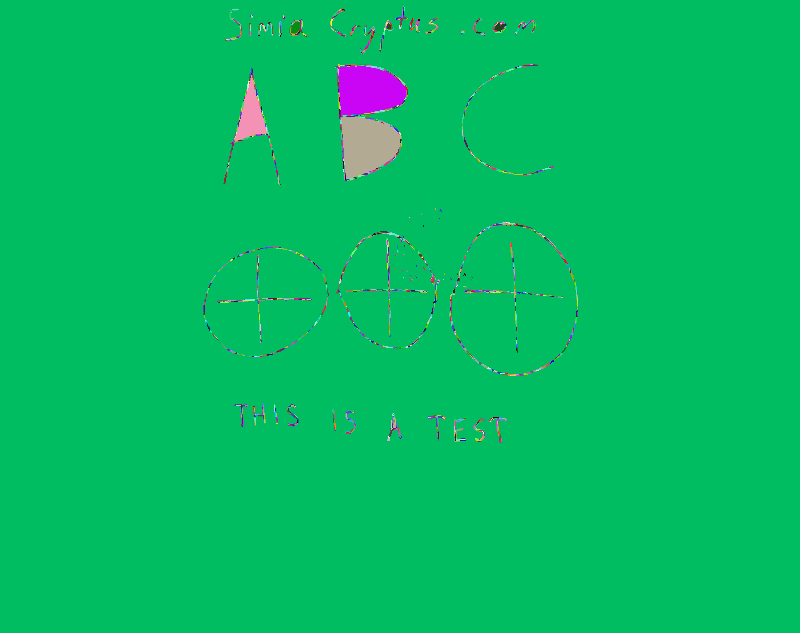
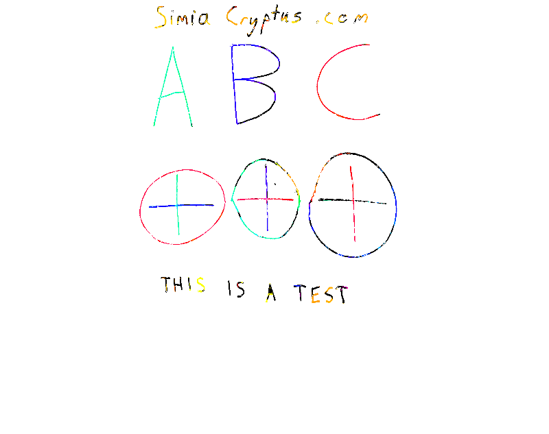

First, we load an photo of a whiteboard

Code from [WhiteboardWorkflow.scala:66](../../src/test/scala/WhiteboardWorkflow.scala#L66) executed in 0.93 seconds: 
```java
    ImageIO.read(getClass.getClassLoader.getResourceAsStream("Whiteboard1.jpg"))
```

Returns: 


## Region Selection
We start looking for long edges which can be used to find the board:

Code from [WhiteboardWorkflow.scala:397](../../src/test/scala/WhiteboardWorkflow.scala#L397) executed in 0.14 seconds: 
```java
    val localMaxRadius = 10
    val minCounts = 5
    val minDistanceFromOrigin = 1
    val edgeThreshold: Float = 100
    val maxLines: Int = 20
    FactoryDetectLineAlgs.houghFoot(new ConfigHoughFoot(localMaxRadius, minCounts, minDistanceFromOrigin, edgeThreshold, maxLines), classOf[GrayU8], classOf[GrayS16])
```

Returns: 
```
    boofcv.abst.feature.detect.line.DetectLineHoughFoot@20a8a64e
```


Code from [WhiteboardWorkflow.scala:396](../../src/test/scala/WhiteboardWorkflow.scala#L396) executed in 0.89 seconds: 
```java
    val rulerDetector: DetectLine[GrayU8] = log.code(() ⇒ {
      val localMaxRadius = 10
      val minCounts = 5
      val minDistanceFromOrigin = 1
      val edgeThreshold: Float = 100
      val maxLines: Int = 20
      FactoryDetectLineAlgs.houghFoot(new ConfigHoughFoot(localMaxRadius, minCounts, minDistanceFromOrigin, edgeThreshold, maxLines), classOf[GrayU8], classOf[GrayS16])
    })
    rulerDetector.detect(ConvertBufferedImage.convertFromSingle(sourceImage, null, classOf[GrayU8]))
```

Returns: 
```
    [LineParametric2D_F32 P( 2094.0 1170.0 ) Slope( 0.0 14.0 ), LineParametric2D_F32 P( 3057.0 1170.0 ) Slope( 0.0 977.0 ), LineParametric2D_F32 P( 2005.0 1174.0 ) Slope( -4.0 -75.0 ), LineParametric2D_F32 P( 885.0 1170.0 ) Slope( 0.0 -1195.0 ), LineParametric2D_F32 P( 898.0 1170.0 ) Slope( 0.0 -1182.0 ), LineParametric2D_F32 P( 2080.0 1082.0 ) Slope( 88.0 0.0 ), LineParametric2D_F32 P( 2046.0 1180.0 ) Slope( -10.0 -34.0 ), LineParametric2D_F32 P( 3031.0 1170.0 ) Slope( 0.0 951.0 ), LineParametric2D_F32 P( 3075.0 1170.0 ) Slope( 0.0 995.0 ), LineParametric2D_F32 P( 1940.0 1208.0 ) Slope( -38.0 -140.0 ), LineParametric2D_F32 P( 2195.0 1165.0 ) Slope( 5.0 115.0 ), LineParametric2D_F32 P( 2153.0 284.0 ) Slope( 886.0 73.0 ), LineParametric2D_F32 P( 2249.0 2031.0 ) Slope( -861.0 169.0 ), LineParametric2D_F32 P( 2061.0 1193.0 ) Slope( -23.0 -19.0 ), LineParametric2D_F32 P( 2155.0 255.0 ) Slope( 915.0 75.0 ), LineParametric2D_F32 P( 858.0 1170.0 ) Slope( 0.0 -1222.0 ), LineParametric2D_F32 P( 1927.0 1076.0 ) Slope( 94.0 -153.0 ), LineParametric2D_F32 P( 1752.0 1170.0 ) Slope( 0.0 -328.0 ), LineParametric2D_F32 P( 1783.0 873.0 ) Slope( 297.0 -297.0 ), LineParametric2D_F32 P( 2391.0 1161.0 ) Slope( 9.0 311.0 )]
```


Code from [WhiteboardWorkflow.scala:407](../../src/test/scala/WhiteboardWorkflow.scala#L407) executed in 0.06 seconds: 
```java
    gfx.drawImage(sourceImage, 0, 0, null)
    gfx.setStroke(new BasicStroke(3))
    found.asScala.foreach(line ⇒ {
      if (Math.abs(line.slope.x) > Math.abs(line.slope.y)) {
        val x1 = 0
        val y1 = (line.p.y - line.p.x * line.slope.y / line.slope.x).toInt
        val x2 = sourceImage.getWidth
        val y2 = y1 + (x2 * line.slope.y / line.slope.x).toInt
        gfx.setColor(Color.RED)
        gfx.drawLine(
          x1, y1,
          x2, y2)
      } else {
        val y1 = 0
        val x1 = (line.p.x - line.p.y * line.slope.x / line.slope.y).toInt
        val y2 = sourceImage.getHeight
        val x2 = x1 + (y2 * line.slope.x / line.slope.y).toInt
        gfx.setColor(Color.GREEN)
        gfx.drawLine(
          x1, y1,
          x2, y2)
      }
    })
```

Returns: 


This can then be searched for the largest, most upright, and rectangular shape

Code from [WhiteboardWorkflow.scala:434](../../src/test/scala/WhiteboardWorkflow.scala#L434) executed in 0.10 seconds: 
```java
    val horizontals = found.asScala.filter(line ⇒ Math.abs(line.slope.x) > Math.abs(line.slope.y)).toList
    val verticals = found.asScala.filter(line ⇒ Math.abs(line.slope.x) <= Math.abs(line.slope.y)).toList
    val imageBounds = new Rectangle2D_F32(0, 0, sourceImage.getWidth, sourceImage.getHeight)
    val candidateQuadrangles: List[Quadrilateral_F32] = cross(pairs(horizontals), pairs(verticals)).map(xa ⇒ {
      val ((left: LineParametric2D_F32, right: LineParametric2D_F32), (top: LineParametric2D_F32, bottom: LineParametric2D_F32)) = xa
      new Quadrilateral_F32(
        Intersection2D_F32.intersection(left, top, null),
        Intersection2D_F32.intersection(left, bottom, null),
        Intersection2D_F32.intersection(right, top, null),
        Intersection2D_F32.intersection(right, bottom, null))
    }).filter((quad: Quadrilateral_F32) ⇒
      Intersection2D_F32.contains(imageBounds, quad.a.x, quad.a.y) &&
        Intersection2D_F32.contains(imageBounds, quad.b.x, quad.b.y) &&
        Intersection2D_F32.contains(imageBounds, quad.c.x, quad.c.y) &&
        Intersection2D_F32.contains(imageBounds, quad.d.x, quad.d.y)
    )
    scale(rotate(
      candidateQuadrangles.maxBy(quad ⇒ {
        val bounds = new Rectangle2D_F32()
        UtilPolygons2D_F32.bounding(quad, bounds)
        val area = quad.area()
        val squareness = area / bounds.area()
        assert(squareness >= 0 && squareness <= 1.01)
        area * Math.pow(squareness, 2)
      })
    ), 1.0f)
```

Returns: 
```
    Quadrilateral_F32{ a(858.0 148.68854) b(3075.0 330.40985) c(858.0 2304.0303) d(3075.0 1868.8699) }
```


Code from [WhiteboardWorkflow.scala:462](../../src/test/scala/WhiteboardWorkflow.scala#L462) executed in 0.04 seconds: 
```java
    gfx.drawImage(sourceImage, 0, 0, null)
    gfx.setStroke(new BasicStroke(3))
    gfx.setColor(Color.RED)
    draw(gfx, bestQuadrangle)
```

Returns: 


We then distort the image using a homographic transform back into a rectangle. First we estimate the correct size of the image:

Code from [WhiteboardWorkflow.scala:470](../../src/test/scala/WhiteboardWorkflow.scala#L470) executed in 0.00 seconds: 
```java
    (
      (bestQuadrangle.getSideLength(0) + bestQuadrangle.getSideLength(2)).toInt / 2,
      (bestQuadrangle.getSideLength(1) + bestQuadrangle.getSideLength(3)).toInt / 2
    )
```

Returns: 
```
    (2241,2887)
```


We derive the transform:

Code from [WhiteboardWorkflow.scala:478](../../src/test/scala/WhiteboardWorkflow.scala#L478) executed in 0.08 seconds: 
```java
    val transformModel: ModelMatcher[Homography2D_F64, AssociatedPair] = {
      val maxIterations = 100
      val inlierThreshold = 7
      val normalize = true
      FactoryMultiViewRobust.homographyRansac(new ConfigHomography(normalize), new ConfigRansac(maxIterations, inlierThreshold))
    }
    val pairs: util.ArrayList[AssociatedPair] = new util.ArrayList(List(
      new AssociatedPair(0, 0, bestQuadrangle.a.x, bestQuadrangle.a.y),
      new AssociatedPair(0, areaHeight, bestQuadrangle.c.x, bestQuadrangle.c.y),
      new AssociatedPair(areaWidth, 0, bestQuadrangle.b.x, bestQuadrangle.b.y),
      new AssociatedPair(areaWidth, areaHeight, bestQuadrangle.d.x, bestQuadrangle.d.y)
    ).asJava)
    if (!transformModel.process(pairs)) throw new RuntimeException("Model Matcher failed!")
    transformModel.getModelParameters
```

Returns: 
```
    Homography2D_F64[ 1.25e+00 3.91e-16 9.01e+02 ; 1.14e-01 1.01e+00 1.46e-04 ; 1.46e-04 1.08e-19 1.05e+00 ]
```


And we transform the image:

Code from [WhiteboardWorkflow.scala:496](../../src/test/scala/WhiteboardWorkflow.scala#L496) executed in 1.48 seconds: 
```java
    val distortion: ImageDistort[Planar[GrayF32], Planar[GrayF32]] = {
      val interpolation = FactoryInterpolation.bilinearPixelS(classOf[GrayF32], BorderType.ZERO)
      val model = new PixelTransformHomography_F32
      val distort = DistortSupport.createDistortPL(classOf[GrayF32], model, interpolation, false)
      model.set(transform)
      distort.setRenderAll(false)
      distort
    }
    val boofImage = ConvertBufferedImage.convertFromMulti(sourceImage, null, true, classOf[GrayF32])
    val work: Planar[GrayF32] = boofImage.createNew(areaWidth.toInt, areaHeight.toInt)
    distortion.apply(boofImage, work)
    val output = new BufferedImage(areaWidth.toInt, areaHeight.toInt, sourceImage.getType)
    ConvertBufferedImage.convertTo(work, output, true)
    output
```

Returns: 


Now we refine our selection using some region selection, perhaps by manual selection

Code from [WhiteboardWorkflow.scala:74](../../src/test/scala/WhiteboardWorkflow.scala#L74) executed in 0.00 seconds: 
```java
    new Rectangle2D_F32(100, 40, 2700, 2100)
```

Returns: 
```
    Rectangle2D_F32{ p0(100.0 40.0) p1(2700.0 2100.0) }
```


Code from [WhiteboardWorkflow.scala:77](../../src/test/scala/WhiteboardWorkflow.scala#L77) executed in 0.03 seconds: 
```java
    gfx.drawImage(primaryImage, 0, 0, null)
    gfx.setStroke(new BasicStroke(3))
    gfx.setColor(Color.RED)
    gfx.drawRect(tileBounds.p0.x.toInt, tileBounds.p0.y.toInt, tileBounds.getWidth.toInt, tileBounds.getHeight.toInt)
```

Returns: 


Code from [WhiteboardWorkflow.scala:83](../../src/test/scala/WhiteboardWorkflow.scala#L83) executed in 0.00 seconds: 
```java
    primaryImage.getSubimage(tileBounds.p0.x.toInt, tileBounds.p0.y.toInt, tileBounds.getWidth.toInt, tileBounds.getHeight.toInt)
```

Returns: 


## Color Normalization
Here is an alternate method using direct-color segmentation:

Dectection of markings uses the luminosity

Code from [WhiteboardWorkflow.scala:376](../../src/test/scala/WhiteboardWorkflow.scala#L376) executed in 1.01 seconds: 
```java
    val bandImg: GrayF32 = hsv.getBand(2)
    val to = ConvertBufferedImage.convertTo(bandImg, null)
    VisualizeImageData.standard(bandImg, to)
```

Returns: 


...by detecting local variations

Code from [WhiteboardWorkflow.scala:382](../../src/test/scala/WhiteboardWorkflow.scala#L382) executed in 1.11 seconds: 
```java
    val single = ConvertBufferedImage.convertFromSingle(colorBand, null, classOf[GrayF32])
    val binary = new GrayU8(single.width, single.height)
    GThresholdImageOps.localSauvola(single, binary, 50, 0.2f, true)
```

Returns: 
```
    boofcv.struct.image.GrayU8@7c041b41
```


Code from [WhiteboardWorkflow.scala:387](../../src/test/scala/WhiteboardWorkflow.scala#L387) executed in 0.03 seconds: 
```java
    VisualizeBinaryData.renderBinary(binaryMask, false, null)
```

Returns: 


Code from [WhiteboardWorkflow.scala:308](../../src/test/scala/WhiteboardWorkflow.scala#L308) executed in 0.01 seconds: 
```java
    VisualizeBinaryData.renderBinary(finalBinaryMask, false, null)
```

Returns: 


Use threshold mask to generate a background image

Code from [WhiteboardWorkflow.scala:313](../../src/test/scala/WhiteboardWorkflow.scala#L313) executed in 0.05 seconds: 
```java
    (0 until 3).map(b⇒ImageStatistics.mean(rgb.getBand(b)))
```

Returns: 
```
    Vector(149.66823, 148.4071, 146.59772)
```


Code from [WhiteboardWorkflow.scala:316](../../src/test/scala/WhiteboardWorkflow.scala#L316) executed in 104.73 seconds: 
```java
    val mask = BinaryImageOps.dilate8(BinaryImageOps.thin(finalBinaryMask.clone(),2,null),5,null)
    val maskedBackground: Planar[GrayF32] = rgb.clone()
    (0 until maskedBackground.getWidth).foreach(x ⇒
      (0 until maskedBackground.getHeight).foreach(y ⇒
        (0 until maskedBackground.getNumBands).foreach(b ⇒
          if(mask.get(x,y)!=0) {
            maskedBackground.getBand(b).set(x, y, averageRGB(b))
          })))
    List(150.0, 50.0, 15.0, 5.0).foreach(blurRadius ⇒ {
      val nextIteration: Planar[GrayF32] = maskedBackground.clone()
      GBlurImageOps.gaussian(nextIteration,nextIteration, blurRadius, -1, null)
      (0 until maskedBackground.getWidth).foreach(x ⇒
        (0 until maskedBackground.getHeight).foreach(y ⇒
          (0 until maskedBackground.getNumBands).foreach(b ⇒
            if(mask.get(x,y)!=0) {
              maskedBackground.getBand(b).set(x, y, nextIteration.getBand(b).get(x,y))
            })))
    })
    maskedBackground
```

Returns: 
```
    boofcv.struct.image.Planar@a486d78
```


Code from [WhiteboardWorkflow.scala:337](../../src/test/scala/WhiteboardWorkflow.scala#L337) executed in 0.06 seconds: 
```java
    ConvertBufferedImage.convertTo(maskedBackground, null, false)
```

Returns: 


Use threshold mask to generate a mask the foreground image (contrasted with the background)

Code from [WhiteboardWorkflow.scala:342](../../src/test/scala/WhiteboardWorkflow.scala#L342) executed in 1.17 seconds: 
```java
    val maskedForground: Planar[GrayF32] = rgb.clone()
    (0 until maskedForground.getWidth).foreach(x ⇒
      (0 until maskedForground.getHeight).foreach(y ⇒
        (0 until maskedForground.getNumBands).foreach(b ⇒
          if(finalBinaryMask.get(x,y)==0) {
            maskedForground.getBand(b).set(x, y, 255.0f)
          } else {
            val forground = maskedForground.getBand(b).get(x,y)
            val background = maskedBackground.getBand(b).get(x,y)
            maskedForground.getBand(b).set(x, y, forground * (255.0f  / background))
          })))
    maskedForground
```

Returns: 
```
    boofcv.struct.image.Planar@1601e47
```


Code from [WhiteboardWorkflow.scala:356](../../src/test/scala/WhiteboardWorkflow.scala#L356) executed in 0.04 seconds: 
```java
    ConvertBufferedImage.convertTo(maskedForground, null, false)
```

Returns: 


We can identify segments which may be markings using the masked color image:

Code from [WhiteboardWorkflow.scala:361](../../src/test/scala/WhiteboardWorkflow.scala#L361) executed in 10.83 seconds: 
```java
    val imageType = ImageType.pl(3, classOf[GrayF32])
    val alg = FactoryImageSegmentation.fh04(new ConfigFh04(0.5f, 30), imageType)
    val segmentation = new GrayS32(rgb.getWidth, rgb.getHeight)
    alg.segment(maskedForground, segmentation)
    (alg.getTotalSuperpixels, segmentation)
```

Returns: 
```
    (621,boofcv.struct.image.GrayS32@6691490c)
```


Code from [WhiteboardWorkflow.scala:368](../../src/test/scala/WhiteboardWorkflow.scala#L368) executed in 0.04 seconds: 
```java
    VisualizeRegions.regions(segmentation, superpixels, null)
```

Returns: 



For each segment, we categorize and colorize each using some logic

Code from [WhiteboardWorkflow.scala:124](../../src/test/scala/WhiteboardWorkflow.scala#L124) executed in 17.03 seconds: 
```java
    val regions = (0 until segmentation.getWidth).flatMap(x ⇒ (0 until segmentation.getHeight).map(y ⇒ {
      segmentation.get(x, y) → ((x, y) → rgb.bands.map(_.get(x, y)))
    })).groupBy(x ⇒ x._1).mapValues(_.map(t ⇒ t._2))
    regions.mapValues(pixels ⇒ {
      val rgvValues = pixels.map(_._2)
      val hsvValues = rgvValues.map(rgb ⇒ {
        val hsv = new Array[Float](3)
        ColorHsv.rgbToHsv(rgb(0), rgb(1), rgb(2), hsv)
        hsv
      })
      def statsHsv(fn: Array[Float] ⇒ (Float, Float)): (Float, Float) = {
        val stats = hsvValues.map((hsv: Array[Float]) ⇒ {
          val (weight, value) = fn(hsv)
          (weight, value * weight, value * value * weight)
        }).reduce((xa, xb) ⇒ (xa._1 + xb._1, xa._2 + xb._2, xa._3 + xb._3))
        val mean = stats._2 / stats._1
        val stdDev = Math.sqrt(Math.abs((stats._3 / stats._1) - mean * mean)).toFloat
        (mean, stdDev)
      }
      // Superpixel color statistics:
      val (hueMean1, hueStdDev1) = statsHsv((hsv: Array[Float]) ⇒ {
        (hsv(2) * hsv(1) * (1 - hsv(2)), hsv(0))
      })
      val (hueMean2, hueStdDev2) = statsHsv((hsv: Array[Float]) ⇒ {
        (hsv(2) * hsv(1) * (1 - hsv(2)), ((Math.PI + hsv(0)) % (2 * Math.PI)).toFloat)
      })
      val (hueMean: Float, hueStdDev: Float) = if (hueStdDev1 < hueStdDev2) {
        (hueMean1, hueStdDev1)
      } else {
        (((Math.PI + hueMean2) % (2 * Math.PI)).toFloat, hueStdDev2)
      }
      val (lumMean, lumStdDev) = statsHsv((hsv: Array[Float]) ⇒ {
        (1, hsv(2))
      })
      val (chromaMean, chromaStdDev) = statsHsv((hsv: Array[Float]) ⇒ {
        (1, hsv(2) * hsv(1))
      })
      // Superpixel geometry statistics:
      val xMax = pixels.map(_._1._1).max
      val xMin = pixels.map(_._1._1).min
      val yMax = pixels.map(_._1._2).max
      val yMin = pixels.map(_._1._2).min
      val length = Math.max(xMax - xMin, yMax - yMin)
      val area = pixels.size
      val width = area / length
      Array[Double](hueMean, hueStdDev, lumMean, lumStdDev, chromaMean, width, length)
    }).toArray.toMap
```

Returns: 
```
    Map(69 -> [D@486be205, 365 -> [D@f713686, 138 -> [D@74f7d1d2, 101 -> [D@4b4dd216, 479 -> [D@5ca17ab0, 347 -> [D@5a62b2a4, 333 -> [D@1051817b, 249 -> [D@35293c05, 518 -> [D@620aa4ea, 468 -> [D@2db2dd9d, 234 -> [D@3174cb09, 0 -> [D@4d411036, 555 -> [D@7adbd080, 88 -> [D@41beb473, 481 -> [D@560513ce, 352 -> [D@13006998, 408 -> [D@37fbe4a8, 170 -> [D@352c308, 523 -> [D@7d373bcf, 582 -> [D@6d6bc158, 115 -> [D@5dda6f9, 217 -> [D@10027fc9, 276 -> [D@54afd745, 308 -> [D@677dbd89, 5 -> [D@fff25f1, 449 -> [D@c00fff0, 120 -> [D@263f04ca, 247 -> [D@2ca47471, 379 -> [D@5a021cb9, 440 -> [D@51768776, 511 -> [D@f31c0c6, 614 -> [D@b93aad, 269 -> [D@4a9419d7, 202 -> [D@2f3c6ac4, 597 -> [D@2e8ab815, 10 -> [D@67af833b, 385 -> [D@d1f74b8, 384 -> [D@41394595, 56 -> [D@3a0807b7, 533 -> [D@21a5fd96, 550 -> [D@5769e7ae, 142 -> [D@5c77053b, 500 -> [D@26b894bd, 472 -> [D@287f94b1, 340 -> [D@30b34287, 538 -> [D@5489c777, 153 -> [D@3676ac27, 174 -> [D@62f87c44, 404 -> [D@48f5bde6, 185 -> [D@525d79f0, 42 -> [D@5149f008, 417 -> [D@7072bc39, 24 -> [D@158d255c, 288 -> [D@2ca65ce4, 301 -> [D@327120c8, 320 -> [D@5707c1cb, 565 -> [D@2b5cb9b2, 436 -> [D@35038141, 37 -> [D@ecf9049, 25 -> [D@672f11c2, 257 -> [D@2970a5bc, 389 -> [D@50305a, 52 -> [D@72efb5c1, 14 -> [D@6d511b5f, 570 -> [D@41200e0c, 184 -> [D@40f33492, 372 -> [D@4fbdc0f0, 504 -> [D@2ad3a1bb, 110 -> [D@6bc28a83, 587 -> [D@324c64cd, 619 -> [D@13579834, 125 -> [D@24be2d9c, 344 -> [D@5bd73d1a, 357 -> [D@aec50a1, 196 -> [D@2555fff0, 542 -> [D@70d2e40b, 460 -> [D@120f38e6, 157 -> [D@7a0e1b5e, 559 -> [D@702ed190, 189 -> [D@173b9122, 20 -> [D@7c18432b, 421 -> [D@7646731d, 46 -> [D@70e29e14, 93 -> [D@3b1bb3ab, 606 -> [D@5a4bef8, 284 -> [D@40bffbca, 416 -> [D@2449cff7, 325 -> [D@42a9a63e, 152 -> [D@62da83ed, 228 -> [D@5d8445d7, 289 -> [D@37d80fe7, 448 -> [D@384fc774, 57 -> [D@e3cee7b, 316 -> [D@71e9a896, 78 -> [D@6b9267b, 261 -> [D@408b35bf, 29 -> [D@29ad44e3, 216 -> [D@15bcf458, 475 -> [D@5af9926a, 492 -> [D@43c67247, 164 -> [D@fac80, 179 -> [D@726386ed, 591 -> [D@649f2009, 443 -> [D@14bb2297, 321 -> [D@69adf72c, 376 -> [D@797501a, 211 -> [D@1a15b789, 253 -> [D@57f791c6, 485 -> [D@51650883, 106 -> [D@6c4f9535, 238 -> [D@5bd1ceca, 121 -> [D@30c31dd7, 514 -> [D@499b2a5c, 348 -> [D@596df867, 574 -> [D@c1fca1e, 84 -> [D@241a53ef, 353 -> [D@344344fa, 480 -> [D@2db2cd5, 602 -> [D@70e659aa, 147 -> [D@615f972, 397 -> [D@285f09de, 280 -> [D@73393584, 61 -> [D@31500940, 221 -> [D@1827a871, 293 -> [D@48e64352, 453 -> [D@7249dadf, 132 -> [D@4362d7df, 396 -> [D@66238be2, 89 -> [D@1c25b8a7, 133 -> [D@200606de, 411 -> [D@750fe12e, 116 -> [D@f8908f6, 243 -> [D@3e587920, 428 -> [D@2ef8a8c3, 1 -> [D@24f43aa3, 265 -> [D@63fd4873, 507 -> [D@1e11bc55, 527 -> [D@7544a1e4, 312 -> [D@70e0accd, 74 -> [D@7957dc72, 206 -> [D@6ab72419, 307 -> [D@3aacf32a, 292 -> [D@4fdfa676, 233 -> [D@82c57b3, 452 -> [D@5be82d43, 6 -> [D@600b0b7, 248 -> [D@345e5a17, 60 -> [D@5ea502e0, 380 -> [D@443dbe42, 117 -> [D@473b3b7a, 512 -> [D@1734f68, 439 -> [D@77b7ffa4, 270 -> [D@5ed190be, 529 -> [D@402f80f5, 546 -> [D@5bbc9f97, 85 -> [D@133e019b, 201 -> [D@41382722, 381 -> [D@7dac3fd8, 220 -> [D@425357dd, 366 -> [D@2102a4d5, 534 -> [D@210386e0, 102 -> [D@3d4d3fe7, 334 -> [D@65f87a2c, 302 -> [D@51684e4a, 260 -> [D@6ce1f601, 349 -> [D@38875e7d, 28 -> [D@1e886a5b, 38 -> [D@d816dde, 598 -> [D@6e33c391, 160 -> [D@6c451c9c, 561 -> [D@31c269fd, 392 -> [D@372b0d86, 297 -> [D@47747fb9, 70 -> [D@3113a37, 424 -> [D@213e3629, 192 -> [D@4e9658b5, 407 -> [D@2a7b6f69, 429 -> [D@20312893, 275 -> [D@70eecdc2, 21 -> [D@c41709a, 137 -> [D@7db0565c, 165 -> [D@54ec8cc9, 33 -> [D@52eacb4b, 92 -> [D@5528a42c, 467 -> [D@2a551a63, 229 -> [D@1a6f5124, 566 -> [D@1edb61b1, 484 -> [D@ec2bf82, 252 -> [D@cc62a3b, 197 -> [D@6cc0bcf6, 361 -> [D@29539e36, 65 -> [D@32f61a31, 435 -> [D@f5c79a6, 97 -> [D@669253b7, 329 -> [D@5305c37d, 583 -> [D@51a06cbe, 522 -> [D@3dddbe65, 461 -> [D@49a64d82, 493 -> [D@344561e0, 551 -> [D@66d23e4a, 456 -> [D@36ac8a63, 324 -> [D@4d9d1b69, 285 -> [D@52c8295b, 224 -> [D@251f7d26, 519 -> [D@77b21474, 578 -> [D@52d10fb8, 317 -> [D@41c07648, 156 -> [D@1fe8d51b, 615 -> [D@781e7326, 403 -> [D@22680f52, 9 -> [D@60d84f61, 188 -> [D@39c11e6c, 388 -> [D@324dcd31, 53 -> [D@503d56b5, 356 -> [D@72bca894, 169 -> [D@433ffad1, 593 -> [D@1fc793c2, 141 -> [D@2575f671, 610 -> [D@329a1243, 420 -> [D@ecf9fb3, 499 -> [D@2d35442b, 109 -> [D@27f9e982, 328 -> [D@4593ff34, 471 -> [D@37d3d232, 256 -> [D@30c0ccff, 488 -> [D@581d969c, 124 -> [D@22db8f4, 225 -> [D@2b46a8c1, 339 -> [D@1d572e62, 77 -> [D@29caf222, 554 -> [D@46cf05f7, 193 -> [D@5851bd4f, 537 -> [D@7cd1ac19, 476 -> [D@2f40a43, 526 -> [D@3caa4757, 489 -> [D@69c43e48, 590 -> [D@1804f60d, 547 -> [D@3a80515c, 212 -> [D@547e29a4, 96 -> [D@1c807b1d, 393 -> [D@238b521e, 515 -> [D@1b39fd82, 457 -> [D@3e2fc448, 173 -> [D@21680803, 13 -> [D@588ab592, 129 -> [D@c8b96ec, 569 -> [D@4cc61eb1, 41 -> [D@2d8f2f3a, 371 -> [D@2024293c, 503 -> [D@7048f722, 605 -> [D@c074c0c, 134 -> [D@58a55449, 73 -> [D@5949eba8, 128 -> [D@6e0ff644, 343 -> [D@58dea0a5, 237 -> [D@2a2bb0eb, 105 -> [D@3c291aad, 244 -> [D@2d0566ba, 2 -> [D@733037, 266 -> [D@7728643a, 360 -> [D@320e400, 205 -> [D@5167268, 508 -> [D@1cfd1875, 311 -> [D@28c0b664, 541 -> [D@2c444798, 398 -> [D@1af7f54a, 558 -> [D@6ebd78d1, 530 -> [D@436390f4, 586 -> [D@4d157787, 298 -> [D@68ed96ca, 412 -> [D@6d1310f6, 618 -> [D@3228d990, 425 -> [D@54e7391d, 513 -> [D@50b8ae8d, 430 -> [D@255990cc, 166 -> [D@51c929ae, 32 -> [D@3c8bdd5b, 34 -> [D@29d2d081, 148 -> [D@40e4ea87, 264 -> [D@58783f6c, 45 -> [D@3a7b503d, 161 -> [D@512d92b, 279 -> [D@62c5bbdc, 64 -> [D@7bdf6bb7, 573 -> [D@1bc53649, 180 -> [D@88d6f9b, 296 -> [D@47d93e0d, 17 -> [D@475b7792, 444 -> [D@751e664e, 149 -> [D@160c3ec1, 375 -> [D@182b435b, 601 -> [D@4d0402b, 584 -> [D@2fa7ae9, 562 -> [D@7577b641, 176 -> [D@3704122f, 423 -> [D@3153ddfc, 191 -> [D@60afd40d, 402 -> [D@28a2a3e7, 22 -> [D@3f2049b6, 44 -> [D@10b3df93, 286 -> [D@ea27e34, 577 -> [D@33a2499c, 579 -> [D@e72dba7, 291 -> [D@33c2bd, 59 -> [D@1dfd5f51, 118 -> [D@3c321bdb, 281 -> [D@24855019, 204 -> [D@3abd581e, 545 -> [D@4d4d8fcf, 259 -> [D@610db97e, 27 -> [D@6f0628de, 413 -> [D@3fabf088, 71 -> [D@1e392345, 391 -> [D@12f3afb5, 12 -> [D@4ced35ed, 445 -> [D@2c22a348, 382 -> [D@7bd69e82, 54 -> [D@74d7184a, 572 -> [D@51b01960, 313 -> [D@6831d8fd, 611 -> [D@27dc79f7, 144 -> [D@6b85300e, 498 -> [D@3aaf4f07, 49 -> [D@5cbf9e9f, 466 -> [D@18e8473e, 335 -> [D@5a2f016d, 236 -> [D@1a38ba58, 181 -> [D@3ad394e6, 350 -> [D@6058e535, 540 -> [D@42deb43a, 86 -> [D@1deb2c43, 159 -> [D@3bb9efbc, 604 -> [D@1cefc4b3, 187 -> [D@2b27cc70, 406 -> [D@6f6a7463, 172 -> [D@1bdaa23d, 113 -> [D@79f227a9, 219 -> [D@6ca320ab, 274 -> [D@50d68830, 419 -> [D@1e53135d, 81 -> [D@7674a051, 377 -> [D@3a7704c, 230 -> [D@6754ef00, 362 -> [D@619bd14c, 451 -> [D@323e8306, 76 -> [D@a23a01d, 567 -> [D@4acf72b6, 7 -> [D@7561db12, 245 -> [D@3301500b, 318 -> [D@24b52d3e, 509 -> [D@15deb1dc, 39 -> [D@6e9c413e, 434 -> [D@57a4d5ee, 98 -> [D@5af5def9, 616 -> [D@3a45c42a, 303 -> [D@36dce7ed, 271 -> [D@47a64f7d, 208 -> [D@33d05366, 599 -> [D@27a0a5a2, 477 -> [D@7692cd34, 387 -> [D@33aa93c, 494 -> [D@32c0915e, 345 -> [D@106faf11, 367 -> [D@70f43b45, 552 -> [D@26d10f2e, 535 -> [D@10ad20cb, 103 -> [D@7dd712e8, 609 -> [D@2c282004, 323 -> [D@22ee2d0, 594 -> [D@7bfc3126, 140 -> [D@3e792ce3, 213 -> [D@53bc1328, 91 -> [D@26f143ed, 483 -> [D@3c1e3314, 520 -> [D@4b770e40, 66 -> [D@78e16155, 240 -> [D@54a3ab8f, 251 -> [D@1968a49c, 155 -> [D@6a1ebcff, 198 -> [D@19868320, 108 -> [D@50b0bc4c, 330 -> [D@c20be82, 462 -> [D@13c612bd, 521 -> [D@3ef41c66, 130 -> [D@6b739528, 399 -> [D@622ef26a, 278 -> [D@41de5768, 455 -> [D@5f577419, 223 -> [D@28fa700e, 608 -> [D@3d526ad9, 394 -> [D@e041f0c, 306 -> [D@6a175569, 135 -> [D@11963225, 563 -> [D@3f3c966c, 299 -> [D@11ee02f8, 226 -> [D@4102b1b1, 3 -> [D@61a5b4ae, 267 -> [D@3a71c100, 505 -> [D@5b69fd74, 438 -> [D@f325091, 431 -> [D@437e951d, 241 -> [D@77b325b3, 80 -> [D@63a5e46c, 167 -> [D@7e8e8651, 35 -> [D@49ef32e0, 473 -> [D@271f18d3, 490 -> [D@6bd51ed8, 426 -> [D@61e3a1fd, 589 -> [D@51abf713, 162 -> [D@eadb475, 531 -> [D@4d4d48a6, 548 -> [D@315df4bb, 374 -> [D@3fc08eec, 255 -> [D@5cad8b7d, 209 -> [D@7b02e036, 487 -> [D@25243bc1, ... and 4034 more bytes
```


To help interpret the structure of this data set, we train a density tree:

Code from [WhiteboardWorkflow.scala:289](../../src/test/scala/WhiteboardWorkflow.scala#L289) executed in 0.42 seconds: 
```java
    val tree = new DensityTree("hueMean", "hueStdDev", "lumMean", "lumStdDev", "chromaMean", "width", "length")
    tree.setSplitSizeThreshold(2)
    tree.setMinFitness(2)
    tree.setMaxDepth(3)
    new tree.Node((0 until superpixels).map(superpixelParameters(_)).toArray)
```

Returns: 
```
    // Count: 621 Volume: 6.246484879214828E13 Region: [hueMean: 0.004469720646739006 - 6.279195785522461; hueStdDev: 0.001035800902172923 - 1.5992368459701538; lumMean: 34.291725158691406 - 260.9708251953125; lumStdDev: 0.16535945236682892 - 64.3162841796875; chromaMean: 0.0 - 82.30860137939453; width: 1.0 - 2008.0; length: 6.0 - 2599.0]
if(hueMean < 1.4919136762619019) { // Fitness 15.540184266691895
  // Count: 208 Volume: 3.0583945655376935E8 Region: [hueMean: 0.004469720646739006 - 1.2587355375289917; hueStdDev: 0.001035800902172923 - 1.3151744604110718; lumMean: 34.291725158691406 - 260.9708251953125; lumStdDev: 0.7856128215789795 - 64.3162841796875; chromaMean: 0.5942007899284363 - 18.614490509033203; width: 1.0 - 12.0; length: 6.0 - 71.0]
  if(lumStdDev < 32.64391326904297) { // Fitness 3.421733521958372
    // Count: 117 Volume: 4.009633037521425E7 Region: [hueMean: 0.004469720646739006 - 1.2587355375289917; hueStdDev: 0.002183660166338086 - 1.3151744604110718; lumMean: 34.291725158691406 - 260.9708251953125; lumStdDev: 0.7856128215789795 - 32.15647888183594; chromaMean: 0.5942007899284363 - 18.614490509033203; width: 1.0 - 6.0; length: 8.0 - 46.0]
    if(hueStdDev < 0.2145572453737259) { // Fitness 2.598165365903678
      // Count: 81 Volume: 6211137.2217389075 Region: [hueMean: 0.004469720646739006 - 1.2587355375289917; hueStdDev: 0.002183660166338086 - 0.2090710550546646; lumMean: 34.291725158691406 - 260.9708251953125; lumStdDev: 0.7856128215789795 - 31.85982322692871; chromaMean: 0.7297631502151489 - 18.614490509033203; width: 1.0 - 6.0; length: 8.0 - 46.0]
    } else {
      // Count: 36 Volume: 7647974.953958649 Region: [hueMean: 0.026233522221446037 - 1.1802877187728882; hueStdDev: 0.2145572453737259 - 1.3151744604110718; lumMean: 52.8023681640625 - 255.75904846191406; lumStdDev: 2.139655351638794 - 32.15647888183594; chromaMean: 0.5942007899284363 - 8.315775871276855; width: 1.0 - 5.0; length: 9.0 - 41.0]
    }
  } else {
    // Count: 91 Volume: 1.8433433932939306E7 Region: [hueMean: 0.24813851714134216 - 1.229535460472107; hueStdDev: 0.001035800902172923 - 0.9691200852394104; lumMean: 58.09783172607422 - 181.54705810546875; lumStdDev: 32.64391326904297 - 64.3162841796875; chromaMean: 1.047852873802185 - 7.988075256347656; width: 1.0 - 12.0; length: 6.0 - 71.0]
    if(hueStdDev < 0.42833706736564636) { // Fitness 2.7820851444792534
      // Count: 64 Volume: 4284779.131741084 Region: [hueMean: 0.39828309416770935 - 1.229535460472107; hueStdDev: 0.001035800902172923 - 0.41219615936279297; lumMean: 58.09783172607422 - 181.54705810546875; lumStdDev: 32.64391326904297 - 64.3162841796875; chromaMean: 1.047852873802185 - 7.988075256347656; width: 1.0 - 12.0; length: 6.0 - 48.0]
    } else {
      // Count: 27 Volume: 881053.3882767463 Region: [hueMean: 0.24813851714134216 - 0.8920767903327942; hueStdDev: 0.42833706736564636 - 0.9691200852394104; lumMean: 93.25434875488281 - 178.5743408203125; lumStdDev: 33.32270050048828 - 59.2001953125; chromaMean: 1.7848788499832153 - 5.388463973999023; width: 1.0 - 7.0; length: 18.0 - 71.0]
    }
  }
} else {
  // Count: 413 Volume: 2.6602222141392742E13 Region: [hueMean: 1.4919136762619019 - 6.279195785522461; hueStdDev: 0.004099818412214518 - 1.5992368459701538; lumMean: 95.45254516601562 - 257.7938232421875; lumStdDev: 0.16535945236682892 - 50.30046463012695; chromaMean: 0.0 - 82.30860137939453; width: 1.0 - 2008.0; length: 8.0 - 2599.0]
  if(hueStdDev < 0.1255234181880951) { // Fitness 16.81088790981032
    // Count: 222 Volume: 6.116692979148135E7 Region: [hueMean: 2.581885814666748 - 6.26704216003418; hueStdDev: 0.004099818412214518 - 0.12420784682035446; lumMean: 146.03236389160156 - 248.0144805908203; lumStdDev: 2.0213701725006104 - 31.040422439575195; chromaMean: 1.238821029663086 - 82.30860137939453; width: 1.0 - 7.0; length: 8.0 - 104.0]
    if(hueMean < 5.941737174987793) { // Fitness 3.3330431584047293
      // Count: 135 Volume: 3.250625919889018E7 Region: [hueMean: 2.581885814666748 - 4.547713756561279; hueStdDev: 0.004099818412214518 - 0.12384260445833206; lumMean: 146.03236389160156 - 248.0144805908203; lumStdDev: 2.0425169467926025 - 31.040422439575195; chromaMean: 1.238821029663086 - 82.30860137939453; width: 1.0 - 7.0; length: 8.0 - 104.0]
    } else {
      // Count: 87 Volume: 449034.7340248687 Region: [hueMean: 5.941737174987793 - 6.26704216003418; hueStdDev: 0.012000201269984245 - 0.12420784682035446; lumMean: 200.07693481445312 - 247.234375; lumStdDev: 2.0213701725006104 - 16.83258628845215; chromaMean: 2.2888023853302 - 75.67503356933594; width: 1.0 - 5.0; length: 9.0 - 69.0]
    }
  } else {
    // Count: 191 Volume: 1.2719681293823938E13 Region: [hueMean: 1.4919136762619019 - 6.279195785522461; hueStdDev: 0.1255234181880951 - 1.5992368459701538; lumMean: 95.45254516601562 - 257.7938232421875; lumStdDev: 0.16535945236682892 - 50.30046463012695; chromaMean: 0.0 - 42.630836486816406; width: 1.0 - 2008.0; length: 10.0 - 2599.0]
    if(hueStdDev < 0.5177218317985535) { // Fitness 15.78683820849267
      // Count: 119 Volume: 2.0925529128411597E8 Region: [hueMean: 1.4919136762619019 - 6.253637313842773; hueStdDev: 0.1255234181880951 - 0.505559504032135; lumMean: 128.8603973388672 - 254.7413330078125; lumStdDev: 1.5039011240005493 - 46.150230407714844; chromaMean: 1.3153983354568481 - 42.630836486816406; width: 1.0 - 7.0; length: 10.0 - 93.0]
    } else {
      // Count: 72 Volume: 3.4986618649939976E12 Region: [hueMean: 1.511406421661377 - 6.279195785522461; hueStdDev: 0.5177218317985535 - 1.5992368459701538; lumMean: 95.45254516601562 - 257.7938232421875; lumStdDev: 0.16535945236682892 - 50.30046463012695; chromaMean: 0.0 - 16.06843376159668; width: 1.0 - 2008.0; length: 14.0 - 2599.0]
    }
  }
}
```


Now, we recolor the image by classifying each superpixel as white, black, or color:

Code from [WhiteboardWorkflow.scala:185](../../src/test/scala/WhiteboardWorkflow.scala#L185) executed in 0.65 seconds: 
```java
    val segmentColors: ColorQueue_F32 = new ColorQueue_F32(3)
    segmentColors.resize(superpixels)
    (0 until superpixels).foreach(i ⇒ {
      segmentColors.getData()(i) = {
        val p = superpixelParameters(i)
        val (hueMean: Float, hueStdDev: Float, lumMean: Float, lumStdDev: Float, chromaMean: Float, width: Int, length: Int) =
          (p(0).floatValue(), p(1).floatValue(), p(2).floatValue(), p(3).floatValue(), p(4).floatValue(), p(5).intValue(), p(6).intValue())
        var isColored = false
        var isBlack = false
        var isWhite = false
        if (lumStdDev < 1.5) {
            isWhite = true
        } else {
          if (hueStdDev < 0.05) {
            isColored = true
          } else {
            if (chromaMean < 5.0) {
              isBlack = true
            } else {
              isColored = true
            }
          }
        }
        val aspect = length.toDouble / width
        val isMarkingShape = aspect > 2 && width < 35
        val isMarking = isMarkingShape && !isWhite
        if (isMarking) {
          if (isBlack) {
            Array(0.0f, 0.0f, 0.0f)
          } else {
            val rgb = new Array[Float](3)
            ColorHsv.hsvToRgb(hueMean, 1.0f, 255.0f, rgb)
            rgb
          }
        } else {
          Array(255.0f, 255.0f, 255.0f)
        }
      }
    })
    VisualizeRegions.regionsColor(segmentation, segmentColors, null)
```

Returns: 



Finally, we trim all the whitespace: 

Code from [WhiteboardWorkflow.scala:229](../../src/test/scala/WhiteboardWorkflow.scala#L229) executed in 1.41 seconds: 
```java
    val pixels = (0 until colorizedImg.getWidth).flatMap(x ⇒
      (0 until colorizedImg.getHeight).filterNot(y ⇒
        util.Arrays.equals(colorizedImg.getRaster.getPixel(x, y, null: Array[Int]), Array(255, 255, 255))).map(y ⇒ x → y))
    var (xmin,xmax) = (pixels.map(_._1).min, pixels.map(_._1).max)
    var (ymin,ymax) = (pixels.map(_._2).min, pixels.map(_._2).max)
    val regionAspect = (xmax - xmin).toDouble / (ymax - ymin)
    val imageAspect = colorizedImg.getWidth.toDouble / colorizedImg.getHeight
    if(regionAspect< imageAspect) {
      val width = (colorizedImg.getWidth * (ymax-ymin))/colorizedImg.getHeight
      xmin = Math.max(0, (xmax + xmin - width)/2)
      xmax = xmin + width
    } else {
      val height = (colorizedImg.getHeight * (xmax-xmin))/colorizedImg.getWidth
      ymin = Math.max(0, (ymax + ymin - height)/2)
      ymax = ymin + height
    }
    gfx.drawImage(colorizedImg, 0, 0, colorizedImg.getWidth, colorizedImg.getHeight, xmin,ymin, xmax,ymax, null)
```

Returns: 


