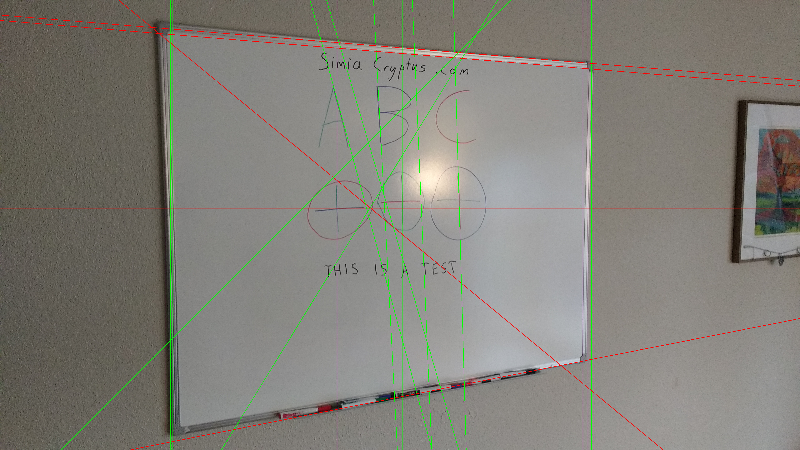

First, we load an photo of a whiteboard

Code from [WhiteboardWorkflow.scala:64](../../src/test/scala/WhiteboardWorkflow.scala#L64) executed in 0.91 seconds: 
```java
    ImageIO.read(getClass.getClassLoader.getResourceAsStream("Whiteboard1.jpg"))
```

Returns: 


We start looking for long edges which can be used to find the board:

Code from [WhiteboardWorkflow.scala:70](../../src/test/scala/WhiteboardWorkflow.scala#L70) executed in 0.13 seconds: 
```java
    val localMaxRadius = 10
    val minCounts = 5
    val minDistanceFromOrigin = 1
    val edgeThreshold: Float = 100
    val maxLines: Int = 20
    FactoryDetectLineAlgs.houghFoot(new ConfigHoughFoot(localMaxRadius, minCounts, minDistanceFromOrigin, edgeThreshold, maxLines), classOf[GrayU8], classOf[GrayS16])
```

Returns: 
```
    boofcv.abst.feature.detect.line.DetectLineHoughFoot@6eeade6c
```


Code from [WhiteboardWorkflow.scala:69](../../src/test/scala/WhiteboardWorkflow.scala#L69) executed in 0.90 seconds: 
```java
    val rulerDetector: DetectLine[GrayU8] = log.code(() ⇒ {
      val localMaxRadius = 10
      val minCounts = 5
      val minDistanceFromOrigin = 1
      val edgeThreshold: Float = 100
      val maxLines: Int = 20
      FactoryDetectLineAlgs.houghFoot(new ConfigHoughFoot(localMaxRadius, minCounts, minDistanceFromOrigin, edgeThreshold, maxLines), classOf[GrayU8], classOf[GrayS16])
    })
    rulerDetector.detect(ConvertBufferedImage.convertFromSingle(sourceImage, null, classOf[GrayU8]))
```

Returns: 
```
    [LineParametric2D_F32 P( 2094.0 1170.0 ) Slope( 0.0 14.0 ), LineParametric2D_F32 P( 3057.0 1170.0 ) Slope( 0.0 977.0 ), LineParametric2D_F32 P( 2005.0 1174.0 ) Slope( -4.0 -75.0 ), LineParametric2D_F32 P( 885.0 1170.0 ) Slope( 0.0 -1195.0 ), LineParametric2D_F32 P( 898.0 1170.0 ) Slope( 0.0 -1182.0 ), LineParametric2D_F32 P( 2080.0 1082.0 ) Slope( 88.0 0.0 ), LineParametric2D_F32 P( 2046.0 1180.0 ) Slope( -10.0 -34.0 ), LineParametric2D_F32 P( 3031.0 1170.0 ) Slope( 0.0 951.0 ), LineParametric2D_F32 P( 3075.0 1170.0 ) Slope( 0.0 995.0 ), LineParametric2D_F32 P( 1940.0 1208.0 ) Slope( -38.0 -140.0 ), LineParametric2D_F32 P( 2195.0 1165.0 ) Slope( 5.0 115.0 ), LineParametric2D_F32 P( 2153.0 284.0 ) Slope( 886.0 73.0 ), LineParametric2D_F32 P( 2249.0 2031.0 ) Slope( -861.0 169.0 ), LineParametric2D_F32 P( 2061.0 1193.0 ) Slope( -23.0 -19.0 ), LineParametric2D_F32 P( 2155.0 255.0 ) Slope( 915.0 75.0 ), LineParametric2D_F32 P( 858.0 1170.0 ) Slope( 0.0 -1222.0 ), LineParametric2D_F32 P( 1927.0 1076.0 ) Slope( 94.0 -153.0 ), LineParametric2D_F32 P( 1752.0 1170.0 ) Slope( 0.0 -328.0 ), LineParametric2D_F32 P( 1783.0 873.0 ) Slope( 297.0 -297.0 ), LineParametric2D_F32 P( 2391.0 1161.0 ) Slope( 9.0 311.0 )]
```


Code from [WhiteboardWorkflow.scala:80](../../src/test/scala/WhiteboardWorkflow.scala#L80) executed in 0.06 seconds: 
```java
    gfx.drawImage(sourceImage, 0, 0, null)
    found.asScala.foreach(line ⇒ {
      if(Math.abs(line.slope.x) > Math.abs(line.slope.y)) {
        val x1 = 0
        val y1 = (line.p.y - line.p.x * line.slope.y / line.slope.x).toInt
        val x2 = sourceImage.getWidth
        val y2 = y1 + (x2 * line.slope.y / line.slope.x).toInt
        gfx.setColor(Color.RED)
        gfx.drawLine(
          x1, y1,
          x2, y2)
      } else {
        val y1 = 0
        val x1 = (line.p.x - line.p.y * line.slope.x / line.slope.y).toInt
        val y2 = sourceImage.getHeight
        val x2 = x1 + (y2 * line.slope.x / line.slope.y).toInt
        gfx.setColor(Color.GREEN)
        gfx.drawLine(
          x1, y1,
          x2, y2)
      }
    })
```

Returns: 



This can then be searched for the largest, most upright, and rectangular shape

Code from [WhiteboardWorkflow.scala:106](../../src/test/scala/WhiteboardWorkflow.scala#L106) executed in 0.14 seconds: 
```java
    val horizontals = found.asScala.filter(line ⇒ Math.abs(line.slope.x) > Math.abs(line.slope.y)).toList
    val verticals = found.asScala.filter(line ⇒ Math.abs(line.slope.x) <= Math.abs(line.slope.y)).toList
    val imageBounds = new Rectangle2D_F32(0, 0, sourceImage.getWidth, sourceImage.getHeight)
    val candidateQuadrangles: List[Quadrilateral_F32] = cross(pairs(horizontals), pairs(verticals)).map(xa ⇒ {
      val ((left: LineParametric2D_F32, right: LineParametric2D_F32), (top: LineParametric2D_F32, bottom: LineParametric2D_F32)) = xa
      new Quadrilateral_F32(
        Intersection2D_F32.intersection(left, top, null),
        Intersection2D_F32.intersection(left, bottom, null),
        Intersection2D_F32.intersection(right, top, null),
        Intersection2D_F32.intersection(right, bottom, null))
    }).filter((quad: Quadrilateral_F32) ⇒
      Intersection2D_F32.contains(imageBounds, quad.a.x, quad.a.y) &&
        Intersection2D_F32.contains(imageBounds, quad.b.x, quad.b.y) &&
        Intersection2D_F32.contains(imageBounds, quad.c.x, quad.c.y) &&
        Intersection2D_F32.contains(imageBounds, quad.d.x, quad.d.y)
    )
    scale(rotate(
      candidateQuadrangles.maxBy(quad ⇒ {
        val bounds = new Rectangle2D_F32()
        UtilPolygons2D_F32.bounding(quad, bounds)
        val area = quad.area()
        val squareness = area / bounds.area()
        assert(squareness >= 0 && squareness <= 1.01)
        area * Math.pow(squareness, 2)
      })
    ), 1.0f)
```

Returns: 
```
    Quadrilateral_F32{ a(858.0 148.68854) b(3075.0 330.40985) c(858.0 2304.0303) d(3075.0 1868.8699) }
```


Code from [WhiteboardWorkflow.scala:134](../../src/test/scala/WhiteboardWorkflow.scala#L134) executed in 0.06 seconds: 
```java
    gfx.drawImage(sourceImage, 0, 0, null)
    gfx.setStroke(new BasicStroke(3))
    gfx.setColor(Color.RED)
    draw(gfx, bestQuadrangle)
```

Returns: 


We then distort the image using a homographic transform back into a rectangle. First we estimate the correct size of the image:

Code from [WhiteboardWorkflow.scala:142](../../src/test/scala/WhiteboardWorkflow.scala#L142) executed in 0.00 seconds: 
```java
    (
      (bestQuadrangle.getSideLength(0) + bestQuadrangle.getSideLength(2)).toInt / 2,
      (bestQuadrangle.getSideLength(1) + bestQuadrangle.getSideLength(3)).toInt / 2
    )
```

Returns: 
```
    (2241,2887)
```


We derive the transform:

Code from [WhiteboardWorkflow.scala:150](../../src/test/scala/WhiteboardWorkflow.scala#L150) executed in 0.09 seconds: 
```java
    val transformModel: ModelMatcher[Homography2D_F64, AssociatedPair] = {
      val maxIterations = 100
      val inlierThreshold = 7
      val normalize = true
      FactoryMultiViewRobust.homographyRansac(new ConfigHomography(normalize), new ConfigRansac(maxIterations, inlierThreshold))
    }
    val pairs: util.ArrayList[AssociatedPair] = new util.ArrayList(List(
      new AssociatedPair(0, 0, bestQuadrangle.a.x, bestQuadrangle.a.y),
      new AssociatedPair(0, areaHeight, bestQuadrangle.c.x, bestQuadrangle.c.y),
      new AssociatedPair(areaWidth, 0, bestQuadrangle.b.x, bestQuadrangle.b.y),
      new AssociatedPair(areaWidth, areaHeight, bestQuadrangle.d.x, bestQuadrangle.d.y)
    ).asJava)
    if (!transformModel.process(pairs)) throw new RuntimeException("Model Matcher failed!")
    transformModel.getModelParameters
```

Returns: 
```
    Homography2D_F64[ 1.25e+00 3.91e-16 9.01e+02 ; 1.14e-01 1.01e+00 1.46e-04 ; 1.46e-04 1.08e-19 1.05e+00 ]
```


And we transform the image:

Code from [WhiteboardWorkflow.scala:168](../../src/test/scala/WhiteboardWorkflow.scala#L168) executed in 1.39 seconds: 
```java
    val distortion: ImageDistort[Planar[GrayF32], Planar[GrayF32]] = {
      val interpolation = FactoryInterpolation.bilinearPixelS(classOf[GrayF32], BorderType.ZERO)
      val model = new PixelTransformHomography_F32
      val distort = DistortSupport.createDistortPL(classOf[GrayF32], model, interpolation, false)
      model.set(transform)
      distort.setRenderAll(false)
      distort
    }
    val boofImage = ConvertBufferedImage.convertFromMulti(sourceImage, null, true, classOf[GrayF32])
    val work: Planar[GrayF32] = boofImage.createNew(areaWidth.toInt, areaHeight.toInt)
    distortion.apply(boofImage, work)
    val output = new BufferedImage(areaWidth.toInt, areaHeight.toInt, sourceImage.getType)
    ConvertBufferedImage.convertTo(work, output, true)
    output
```

Returns: 


Now we refine our selection using some region selection, perhaps by manual selection

Code from [WhiteboardWorkflow.scala:186](../../src/test/scala/WhiteboardWorkflow.scala#L186) executed in 0.00 seconds: 
```java
    new Rectangle2D_F32(100, 40, 2700, 2100)
```

Returns: 
```
    Rectangle2D_F32{ p0(100.0 40.0) p1(2700.0 2100.0) }
```


Code from [WhiteboardWorkflow.scala:189](../../src/test/scala/WhiteboardWorkflow.scala#L189) executed in 0.03 seconds: 
```java
    gfx.drawImage(primaryImage, 0, 0, null)
    gfx.setStroke(new BasicStroke(3))
    gfx.setColor(Color.RED)
    gfx.drawRect(tileBounds.p0.x.toInt, tileBounds.p0.x.toInt, tileBounds.getWidth.toInt, tileBounds.getHeight.toInt)
```

Returns: 


Code from [WhiteboardWorkflow.scala:195](../../src/test/scala/WhiteboardWorkflow.scala#L195) executed in 0.00 seconds: 
```java
    primaryImage.getSubimage(tileBounds.p0.x.toInt, tileBounds.p0.x.toInt, tileBounds.getWidth.toInt, tileBounds.getHeight.toInt)
```

Returns: 


Dectection of markings uses the luminosity

Code from [WhiteboardWorkflow.scala:204](../../src/test/scala/WhiteboardWorkflow.scala#L204) executed in 0.98 seconds: 
```java
    val bandImg: GrayF32 = hsv.getBand(2)
    val to = ConvertBufferedImage.convertTo(bandImg, null)
    VisualizeImageData.standard(bandImg, to)
```

Returns: 


...by detecting local variations within a gaussian radius

Code from [WhiteboardWorkflow.scala:211](../../src/test/scala/WhiteboardWorkflow.scala#L211) executed in 4.32 seconds: 
```java
    val single = ConvertBufferedImage.convertFromSingle(colorBand, null, classOf[GrayF32])
    val binary = new GrayU8(single.width, single.height)
    val radius = 60
    val scale = 1.0
    GThresholdImageOps.localGaussian(single, binary, radius, scale, true, null, null)
```

Returns: 
```
    boofcv.struct.image.GrayU8@37f21974
```


Code from [WhiteboardWorkflow.scala:218](../../src/test/scala/WhiteboardWorkflow.scala#L218) executed in 0.03 seconds: 
```java
    VisualizeBinaryData.renderBinary(localGaussian, false, null)
```

Returns: 


This binarization is then refined by eroding and thinning operations

Code from [WhiteboardWorkflow.scala:223](../../src/test/scala/WhiteboardWorkflow.scala#L223) executed in 0.26 seconds: 
```java
    var prefiltered = localGaussian
    prefiltered = BinaryImageOps.erode4(prefiltered, 1, null)
    prefiltered = BinaryImageOps.erode8(prefiltered, 1, null)
    VisualizeBinaryData.renderBinary(prefiltered, false, null)
```

Returns: 


We can now identify segments which may be markings:

Code from [WhiteboardWorkflow.scala:231](../../src/test/scala/WhiteboardWorkflow.scala#L231) executed in 18.80 seconds: 
```java
    val input = ConvertBufferedImage.convertFrom(thresholdImg, null: GrayF32)
    val imageType = ImageType.single(classOf[GrayF32])
    val alg = FactoryImageSegmentation.fh04(new ConfigFh04(100, 30), imageType)
    val segmentation = new GrayS32(thresholdImg.getWidth, thresholdImg.getHeight)
    alg.segment(input, segmentation)
    (alg.getTotalSuperpixels, segmentation)
```

Returns: 
```
    (1107,boofcv.struct.image.GrayS32@a1217f9)
```


Code from [WhiteboardWorkflow.scala:239](../../src/test/scala/WhiteboardWorkflow.scala#L239) executed in 0.04 seconds: 
```java
    VisualizeRegions.regions(segmentation, superpixels, null)
```

Returns: 


For each segment, we categorize and colorize each using some logic

Code from [WhiteboardWorkflow.scala:244](../../src/test/scala/WhiteboardWorkflow.scala#L244) executed in 7.90 seconds: 
```java
    val regionMemberCount = new GrowQueue_I32
    regionMemberCount.resize(superpixels)
    ImageSegmentationOps.countRegionPixels(segmentation, superpixels, regionMemberCount.data)
    val avgColors: Map[Int, Array[Float]] = (0 until segmentation.getWidth).flatMap(x ⇒ (0 until segmentation.getHeight).map(y ⇒ {
      segmentation.get(x, y) → rgb.bands.map(_.get(x,y))
    })).groupBy(x⇒x._1).mapValues(_.map(_._2)).mapValues((pixels: immutable.Seq[Array[Float]]) ⇒ {
      (0 until 3).map(band⇒pixels.map(_(band)).sum / pixels.size).toArray
    })
    val segmentColors: ColorQueue_F32 = new ColorQueue_F32(3)
    segmentColors.resize(superpixels)
    val averageLuminosity = ImageStatistics.mean(hsv.getBand(2))
    (0 until superpixels).foreach(i ⇒ {
      val count = regionMemberCount.get(i)
      val avgColor = avgColors(i)
      val hsvColor = new Array[Float](3)
      val rgbColor = new Array[Float](3)
      ColorHsv.rgbToHsv(avgColor(0),avgColor(1),avgColor(2),hsvColor)
      val isWhite = hsvColor(1) < 0.05 && hsvColor(2) > averageLuminosity
      val isBlack = hsvColor(1) < 0.05 && hsvColor(2) < averageLuminosity
      if (count > 50 && count < 50000 && !isWhite) {
        hsvColor(2) = if(isBlack) 0.0f else 255.0f
        hsvColor(1) = if(isBlack) 0.0f else 1.0f
        ColorHsv.hsvToRgb(hsvColor(0),hsvColor(1),hsvColor(2),rgbColor)
        segmentColors.getData()(i) = rgbColor
      } else {
        segmentColors.getData()(i) = Array(255.0f, 255.0f, 255.0f)
      }
    })
    VisualizeRegions.regionsColor(segmentation, segmentColors, null)
```

Returns: 


